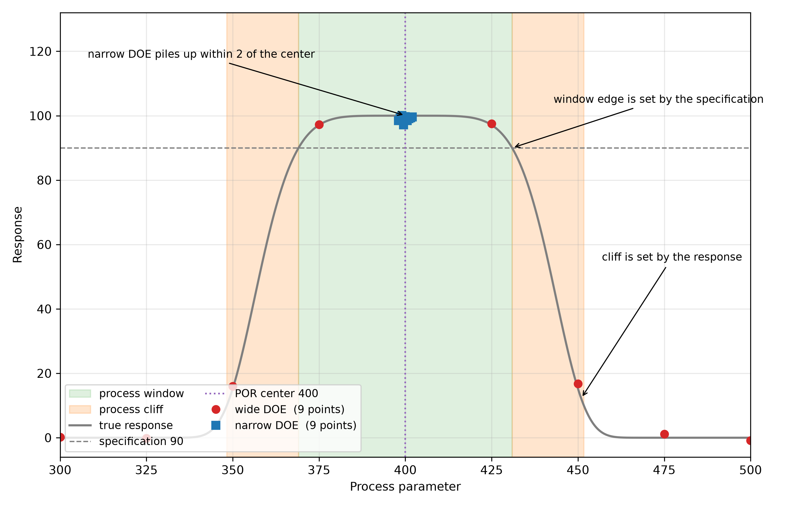

# Wide and Narrow DOE for Semiconductor Process Models
Rev. 4 | Created: 2026-08-27 | Updated: 2026-08-27 20:51 UTC

반도체 공정에 machine learning 을 쓸 때 model 이 무엇을 배우는지는 DOE 가 덮은 범위가 정한다. 범위를 넓게 잡은 DOE 와 양산 조건 가까이에서 좁게 잡은 DOE 는 쓰임이 다르다. 이 문서는 이 둘을 학습과 추론에 어떻게 나누어 쓰는지를 명제에서 출발해 정리한다. DOE 자체가 machine learning 의 어디에 속하는지는 [Appendix B](#appendix-b-position-in-machine-learning) 에 따로 두었다.

## 1. Proposition

두 명제를 두고 시작한다.

- Process cliff 를 찾으려는 wide DOE 의 data 는 학습에 쓰고 추론 입력으로는 쓰지 않는다.
- Process window centering 을 따라가려는 narrow DOE 의 data 는 학습과 추론 입력에 모두 쓴다.

주어를 data 로 못 박으면 두 명제 모두 맞다. 어긋나는 것은 명제가 아니라 그것을 읽는 방식이다. 추론 입력으로 쓰지 않는다는 말이 추론과 무관하다는 뜻으로 읽히면 틀린다. Wide DOE 의 data 는 model 에 입력으로 들어가는 일이 없지만, 그 data 로 학습한 model 은 양산 영역의 모든 추론에 관여하며 그 정확도를 정한다. 3 절이 그 정확도를 다루고, 4 절이 추론이 어디에서 일어나는지를 다룬다.

## 2. Range

Wide DOE 는 온도, 압력, gas 비율 같은 공정 parameter 를 정상 범위 밖의 극단까지 일부러 흔들어 얻는다. 그렇게 흔드는 것은 process cliff 가 어디에서 시작하는지를 찾기 위해서이다. Process window 를 찾는 것과는 다르다. Window 는 결과가 spec 을 만족하는 범위이므로 spec 이 바뀌면 함께 바뀌고, 좁은 범위에서 잰 것만으로도 model 로 미루어 그릴 수 있다. Cliff 는 응답이 무너지는 자리라 spec 과 무관하게 그 자리에 있고, 그 밖까지 실제로 흔들어 보지 않으면 어디인지 알 수 없다. 범위를 넓혀야 하는 이유는 window 가 아니라 cliff 쪽에 있다. Narrow DOE 는 실제로 제품이 나오는 POR 근처의 좁은 변동 안에서 얻는다.

Table 1. Wide DOE and narrow DOE

| Item | Wide DOE | Narrow DOE |
|------|----------|------------|
| Range | 정상 범위를 벗어난 극단까지 흔든다 | POR 근처의 좁은 구간에 머문다 |
| Spacing | 점 사이가 넓다 | 점 사이가 촘촘하다 |
| Purpose | 경계와 물리적 경향을 잡는다 | 양산 영역의 미세한 변화를 맞춘다 |
| Training | 처음 model 을 세울 때 쓴다 | 양산에 맞추어 fine-tuning 할 때 쓴다 |
| Inference | 정상 가동에서는 드물다 | 추론의 대부분을 차지한다 |
| When it runs | 장비와 공정을 들일 때 | 양산이 도는 동안 |

Fig 1. Process window, process cliff and the two DOE designs

가로축은 공정 parameter 하나이고 세로축은 그 조건에서 나오는 결과이다. 앞 문단이 갈라 놓은 두 경계가 그림에서는 서로 다른 자리에 걸린다. 녹색 띠의 가장자리는 가로 점선인 spec 이 곡선을 자르는 높이에서 정해지고, 주황색 띠는 곡선이 꺾여 내려가는 어깨에 걸린다. 그러므로 spec 을 올리면 녹색 띠만 좁아지고 주황색 띠는 자리를 지킨다.

Narrow DOE 의 점 아홉 개는 모두 center 에서 2 안에 몰려 있어 하나처럼 보인다. Wide DOE 의 점 아홉 개는 같은 개수로 cliff 를 지나 그 바깥까지 놓인다. 앞의 것은 곡선의 꼭대기를 촘촘히 재고, 뒤의 것은 그 꼭대기가 어디에서 끝나는지를 잰다.

## 3. Training

Wide DOE 를 학습시키는 목적은 그 극단 영역을 예측하려는 것이 아니다. 좁은 영역의 예측을 떠받치려는 것이다.

Model 이 학습한 적 없는 영역에서 내는 값은 extrapolation 이고, extrapolation 에는 근거가 없다. 학습 범위의 가장자리에 양산 영역이 놓이면 그 예측이 곧 extrapolation 이 된다. Wide DOE 는 양산 영역을 학습 범위의 한가운데로 밀어 넣어 같은 예측을 interpolation 으로 바꾼다. 물리적 한계까지 범위에 넣으므로 좁은 구간에서는 드러나지 않는 parameter 와 결과의 관계도 함께 담긴다.

범위는 기울기를 얼마나 정확히 정하는지도 좌우한다. 회귀에서 기울기의 표준오차는 입력의 산포에 반비례한다. 그러므로 좁은 구간에서만 학습하면 같은 표본 수로도 기울기가 크게 흔들리며, 회귀가 아닌 model 에서도 방향은 같다. 흔들린 기울기는 구간을 조금만 벗어나도 곧바로 큰 오차가 되고, 입력의 변동이 작으면 model 이 잡음을 신호로 오인하기도 쉽다. Wide DOE 는 지레를 길게 잡아 이 둘을 함께 줄인다.

그다음에 narrow DOE 로 fine-tuning 한다. Wide DOE 는 점 사이가 넓어 양산 영역 안의 미세한 변화를 담지 못하므로, 그 구간의 오차는 촘촘한 data 로 따로 줄여야 한다. 두 단계를 거치면 넓은 범위의 경향과 좁은 범위의 정밀도를 함께 얻는다.

범위를 넓히는 데에는 대가가 있다. 범위 안에서 지배하는 물리가 바뀌면 하나의 model 이 서로 다른 영역을 함께 맞추려다 양산 영역에서 오히려 나빠진다. 그러므로 wide DOE 는 무작정 넓히는 것이 아니라 같은 물리가 이어지는 한도 안에서 넓혀야 한다.

예를 들어 새 장비를 들일 때 온도를 300 ℃ 에서 500 ℃ 까지 흔들어 model 에 큰 경향을 먼저 익히게 한다. 양산은 398 ℃ 에서 402 ℃ 사이에서만 돈다. 이 좁은 구간의 data 를 따로 학습시켜 오차를 줄이면, 양산 조건은 300 ℃ 에서 500 ℃ 까지의 학습 범위 한가운데에 놓인다.

## 4. Inference

추론은 대부분 narrow 영역에서 일어난다. 양산 중에 장비를 극단 조건으로 돌리지 않기 때문만은 아니다. APC 가 run 마다 결과를 되먹여 공정 parameter 를 목표치로 끌어당기므로, 양산 data 는 스스로 center 근처의 좁은 구간에 쌓인다. 이 되먹임이 곧 process window centering, 줄여서 PWC 이다. Cliff 가 어디인지를 찾는 것이 wide DOE 의 목적이라면, 그 안쪽 window 의 한가운데에 공정을 붙들어 두는 것이 PWC 이다. Model 이 만나는 입력의 분포가 narrow DOE 가 덮은 범위와 거의 겹치는 것은 그 제어의 결과이다.

Wide DOE 가 덮은 구간은 process cliff 이다. 그 구간에서는 수율이 급격히 무너지고 defect 가 몰려 나오므로 양산을 그곳에서 돌릴 이유가 없다. 그러므로 양산 중에 그 구간의 값이 들어온다는 것은 공정 제어가 실패했다는 뜻이며, 정상 가동만 놓고 보면 wide 영역을 추론할 일이 없다는 말이 맞다.

이상을 가려내는 일이 cliff 의 data 로 이루어진다고 생각하기 쉬우나 그렇지 않다. 정상의 모양을 배워 두고 거기서 벗어난 것을 이상이라 부르는 것이므로, 그 판정에 필요한 것은 정상 data 이지 cliff data 가 아니다. 애초에 cliff data 는 실제 양산에서 거의 생기지 않으므로 그것을 모아 배우는 방법은 쓸 수도 없다. 그러니 벗어났는지 아닌지를 가리는 데까지는 narrow 범위만으로 선다.

Table 2. What each task learns from

| Task | What it needs | Where it comes from |
|------|---------------|---------------------|
| Detection | 정상의 모양 | Narrow DOE 와 정상 양산 data 만으로 선다 |
| Classification | 이상마다의 본보기 | 일부러 고장을 넣어 얻는 wide DOE |
| Prediction | 그 범위에서 입력과 결과의 관계 | Wide DOE. 없으면 extrapolation 이 된다 |

Wide DOE 가 값을 하는 자리는 Detection 아래의 두 줄이다. 벗어났다는 것까지는 정상 data 로 알 수 있어도, 어느 쪽으로 얼마나 벗어났고 그것이 어떤 고장인지는 그 범위를 본 적이 있어야 말할 수 있다. 이상의 종류를 가르려면 그 이상의 본보기가 있어야 하고, 본보기는 양산을 기다려 얻는 것이 아니라 일부러 고장을 넣어 만든다. Cliff 가 어디인지 알아야 control limit 을 통계가 아니라 물리 위에 놓을 수 있다는 것도 같은 이야기이다.

그러므로 명제는 그대로 두되 그 뜻을 좁혀 읽어야 한다. Wide DOE 의 data 가 추론 입력이 아니라는 것은 맞다. 그 data 의 값어치는 입력이 아닌 다른 셋에 있다. 양산 영역 예측의 정확도, 이상의 종류를 가르는 능력, 그리고 경계를 어디에 그을지의 근거이다.

## References

[1] Settles, B. [Active Learning Literature Survey](https://burrsettles.com/pub/settles.activelearning.pdf). Computer Sciences Technical Report 1648, University of Wisconsin-Madison, 2009.

[2] Shahriari, B., Swersky, K., Wang, Z., Adams, R. P., de Freitas, N. [Taking the Human Out of the Loop: A Review of Bayesian Optimization](https://doi.org/10.1109/JPROC.2015.2494218). Proceedings of the IEEE, 104(1), 148-175, 2016.

---

## Appendix A. Terminology

- **Acquisition function** 은 다음에 시험할 점을 고를 때 후보마다 매기는 점수이며, 아직 모르는 곳을 넓게 살피는 쪽과 좋아 보이는 곳을 파고드는 쪽 사이의 균형을 정한다.
- **APC (Advanced Process Control)** 는 계측 결과를 되먹여 다음 run 의 공정 parameter 를 고침으로써 공정을 목표치에 붙들어 두는 제어이며, run 단위로 도는 것을 run-to-run control 이라고 한다.
- **DOE (Design of Experiments)** 는 어떤 조건에서 몇 번 실험할지를 미리 설계해 적은 실험으로 많은 것을 알아내는 방법론이다.
- **Extrapolation** 은 학습한 범위 밖의 값을 내는 것이다. 범위 안의 자료가 그 값을 떠받치지 못하므로 근거가 없다.
- **FDC (Fault Detection and Classification)** 는 장비가 남긴 sensor 기록을 감시해 이상을 찾아내고 그 종류를 가르는 체계이다.
- **Fine-tuning** 은 이미 학습한 model 을 좁은 영역의 data 로 다시 학습시켜 그 영역의 오차를 줄이는 것이다.
- **Interlock** 은 정해진 조건을 벗어났을 때 장비를 멈추어 더 나아가지 못하게 막는 장치이다.
- **Interpolation** 은 학습한 범위 안의 값을 내는 것이다. 양옆의 자료가 그 값을 떠받친다.
- **POR (Process of Record)** 는 양산에서 쓰기로 고정해 둔 공정 조건이며, 바꾸려면 별도의 승인을 거친다.
- **Process cliff** 는 공정 parameter 가 조금 더 벗어나면 결과가 급격히 무너지는 자리이다. 응답의 모양이 그 자리를 정하므로 spec 이 바뀌어도 움직이지 않는다.
- **Process window** 는 결과가 spec 을 만족하는 공정 parameter 의 범위이다. Spec 이 그 경계를 정하므로 spec 이 바뀌면 함께 움직이며, 보통 cliff 보다 안쪽에 여유를 두고 놓인다.
- **PWC (Process Window Centering)** 는 공정을 process window 의 가장자리가 아니라 한가운데에 두는 것이며, APC 가 하는 일이 이것이다.
- **Virtual metrology** 는 실제로 재지 않은 계측값을 장비의 sensor 기록으로부터 model 이 대신 내주는 것이다.

## Appendix B. Position in Machine Learning

DOE 는 machine learning 안의 algorithm 이나 model 구조가 아니다. Model 에 넣을 data 를 설계하고 모으는 방법론이며, workflow 에서는 data 수집 전략에 속한다. 통계에서 온 이 방법론이 machine learning 과 만나는 자리는 셋으로 나뉜다.

Table 3. DOE in the machine learning workflow

| Field | What it chooses | Relation to DOE |
|-------|-----------------|-------------------|
| Active learning | 다음에 label 을 붙일 표본 | Model 의 오차를 가장 빨리 줄이는 점을 고른다 [1](#ref-1) |
| Bayesian optimization | 다음에 시험할 공정 조건 | 대리 model 과 acquisition function 으로 최적점을 찾는다 [2](#ref-2) |
| Data-centric AI | Data 자체의 구성 | 공간을 치우침 없이 덮어 일반화를 얻는다 |

Active learning 과 Bayesian optimization 을 같은 것으로 보지 않아야 한다. 둘은 대리 model 과 acquisition function 이라는 같은 장치를 쓰지만 무엇을 얻으려는지가 다르다. Active learning 은 model 을 잘 만들려고 점을 고르고, Bayesian optimization 은 최적점을 찾으려고 점을 고른다. 그러므로 어느 쪽을 쓸지는 다음 실험으로 model 을 고치려는지 공정을 고치려는지가 정한다.

세 자리가 모두 실험 한 번의 값이 비싼 분야에서 쓰인다. 반도체에서 wafer 한 장을 파괴 검사하는 값이 그렇고, 신약과 신소재에서도 같은 이유로 쓰인다. DOE 가 machine learning 과 만나는 이유가 여기에 있다.
