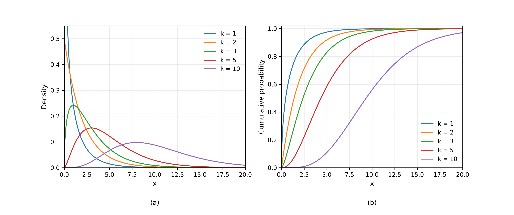

# The Chi-Squared Distribution (Korean)
Rev. 1 | Created: 2026-09-04 | Updated: 2026-09-04 16:10 CDT

> 표준정규 확률변수의 제곱합이 따르는 분포에 대한 기록. 어떻게 만들어지는지, 밀도함수와 moment 가
> 무엇인지, 다른 표본분포와 어떻게 이어지는지, 그리고 이를 쓰는 검정에 왜 등장하는지를 다룬다.

## 1. Scope

Chi-squared distribution 은 자료의 model 로 만나는 일이 드물다. 통계량의 분포로 만나며, 성질이 아주
다른 두 양이 공교롭게도 이 분포를 따르기에 자리를 얻는다. 하나는 정규모집단의 척도조정된 sample
variance 이고, 다른 하나는 관측도수와 기대도수의 차이를 재는 Pearson 의 측도이다. 둘 다 근사적으로
표준정규인 양들의 제곱합으로 환원되며, 그 제곱합이 바로 이 분포가 기술하는 대상이다.

이 문서는 분포를 정의하고, 밀도함수와 moment 를 제시하고, normal·gamma·t·F distribution 과의 관계를
정리하고, 위의 두 상황을 보인다. 유도는 [Appendix B](#appendix-b-derivations) 에, 분포를 계산하는
호출은 [Appendix C](#appendix-c-computation) 에 둔다.

## 2. Definition

### 2.1. Construction from Normal Variables

$Z_1, \ldots, Z_k$ 를 독립인 표준정규 확률변수라 하자. 자유도 (degrees of freedom) 가 $k$ 인
chi-squared distribution 은 이들의 제곱합이 따르는 분포이며 $X \sim \chi^2_k$ 로 적는다.

$$X = \sum_{i=1}^{k} Z_i^{2} \hspace{19em} (1)$$

이 구성이 한꺼번에 세 가지를 정한다. 제곱합은 음수가 될 수 없으므로 support 는 $x \ge 0$ 이다.
parameter 는 $k$ 하나뿐이며, 그것은 더해지는 제곱의 개수를 센다. 그리고 제곱은 정규분포의 두 꼬리를
한쪽으로 접으므로 이 분포는 대칭이 아니다.

### 2.2. Density Function

$x \gt 0$ 에서 $\chi^2_k$ 의 밀도함수에는 gamma function $\Gamma$ 가 들어간다.

$$f(x) = \frac{1}{2^{k/2} \Gamma(k/2)} x^{k/2 - 1} e^{-x/2} \hspace{19em} (2)$$

이 식의 어디에도 $k$ 가 정수여야 할 이유는 없다. section 2.1 의 세는 방식은 정수 $k$ 를 주지만,
밀도함수 자체는 모든 실수 $k \gt 0$ 에 대해 성립한다. 어떤 근사가 만들어내는 소수 자유도를 이 분포로
받을 수 있는 것은 그 때문이다 [[4](#ref-4)].

Moment generating function 은 밀도함수보다 단순하며, 뒤에 오는 대부분의 논의가 이것을 도구로 쓴다.

$$M(t) = E\left[ e^{tX} \right] = (1 - 2t)^{-k/2}, \qquad t \lt \tfrac{1}{2} \hspace{19em} (3)$$

## 3. Properties

### 3.1. Moments

식 (3) 을 원점에서 미분하면 moment 가 나온다. 평균은 자유도와 같고 분산은 그 두 배이다.

$$E[X] = k, \qquad \mathrm{Var}[X] = 2k, \qquad \gamma_1 = \sqrt{8/k}, \qquad \gamma_2 = 12/k \hspace{19em} (4)$$

여기서 $\gamma_1$ 은 왜도 (skewness), $\gamma_2$ 는 초과첨도 (excess kurtosis) 이다. 둘 다 $k$ 가
커지면 줄어들며, 이 분포의 대표본 거동은 이 두 수가 전부이다.

Table 1. Moments of the chi-squared distribution.

| Degrees of freedom | Mean | Variance | Skewness | Excess kurtosis |
|---:|---:|---:|---:|---:|
| 1 | 1 | 2 | 2.8284 | 12.0 |
| 2 | 2 | 4 | 2.0000 | 6.0 |
| 3 | 3 | 6 | 1.6330 | 4.0 |
| 5 | 5 | 10 | 1.2649 | 2.4 |
| 10 | 10 | 20 | 0.8944 | 1.2 |

평균이 $k$ 와 같다는 것은 기억해 둘 만하다. $\chi^2_k$ 를 따라야 할 검정통계량이 $k$ 근처에서 나오면
특별할 것이 없고, $k$ 의 몇 배로 나오면 그것이 검정이 찾는 신호이다.

### 3.2. Additivity

$X \sim \chi^2_m$ 과 $Y \sim \chi^2_n$ 이 독립이면 그 합도 chi-squared 이며 자유도는 더해진다.

$$X + Y \sim \chi^2_{m+n} \hspace{19em} (5)$$

독립인 두 제곱합의 합은 다시 제곱합이므로 식 (1) 에서 곧바로 따르고, 두 moment generating function 의
곱이 지수 $-(m+n)/2$ 인 것과 같으므로 식 (3) 에서도 똑같이 따른다. 자유도가 개수처럼 움직이는 것은
그것이 개수이기 때문이다.

### 3.3. Shape

모양은 $k$ 에 따라 질적으로 달라진다. $k = 1$ 에서 밀도함수는 원점에서 발산하고, $k = 2$ 에서는
exponential 밀도함수여서 원점에서 유한하지만 여전히 감소한다. $k = 3$ 부터는 원점에서 0 이 되고
단봉이며, mode 는 $k - 2$ 에 있다.



Fig 1. Chi-squared density (a) and distribution function (b) for five values of the degrees of
freedom. The density for $k = 1$ leaves the top of the panel; it is unbounded at the origin.

$k$ 가 커지면 밀도함수는 점점 대칭에 가까워지고, 표준화한 변수는 표준정규분포로 수렴한다.

$$\frac{X - k}{\sqrt{2k}} \xrightarrow{d} N(0, 1) \hspace{19em} (6)$$

수렴은 느리다. 식 (4) 의 왜도가 $k^{-1/2}$ 로만 줄기 때문이며, 그 느림이 정규 근사 대신 이 분포의 표가
오래 쓰인 이유이다. $k = 10$ 에서 상위 5 percent 점은 18.307 인데 식 (6) 은 17.356 을 주어 5 percent
의 오차가 난다. 같은 $k$ 에서 Wilson 과 Hilferty 의 세제곱근 변환 [[1](#ref-1)] 은 18.292 를 주어 훨씬
낫다.

Table 2. Upper-tail critical values: the value the statistic exceeds with the stated probability.

| Degrees of freedom | 0.10 | 0.05 | 0.01 |
|---:|---:|---:|---:|
| 1 | 2.706 | 3.841 | 6.635 |
| 2 | 4.605 | 5.991 | 9.210 |
| 3 | 6.251 | 7.815 | 11.345 |
| 4 | 7.779 | 9.488 | 13.277 |
| 5 | 9.236 | 11.070 | 15.086 |
| 6 | 10.645 | 12.592 | 16.812 |
| 7 | 12.017 | 14.067 | 18.475 |
| 8 | 13.362 | 15.507 | 20.090 |
| 9 | 14.684 | 16.919 | 21.666 |
| 10 | 15.987 | 18.307 | 23.209 |
| 15 | 22.307 | 24.996 | 30.578 |
| 20 | 28.412 | 31.410 | 37.566 |
| 30 | 40.256 | 43.773 | 50.892 |

## 4. Relation to Other Distributions

Chi-squared distribution 은 정규이론 표본분포들의 한가운데에 있고, 나머지 대부분은 이것으로부터
만들어진다.

Table 3. Relations to other distributions.

| Distribution | Relation | Note |
|---|---|---|
| Normal | $Z^2 \sim \chi^2_1$ | $k = 1$ 인 경우 |
| Exponential | $\chi^2_2$ 는 평균이 2 인 exponential | $k = 2$ 인 경우 |
| Gamma | $\chi^2_k$ 는 shape $k/2$, scale 2 인 gamma | 밀도함수의 일반형 |
| Student t | $Z / \sqrt{V/k}$, $V \sim \chi^2_k$ 이며 $Z$ 와 독립 | Chi-squared 가 분모 |
| F | $(V_1/k_1) / (V_2/k_2)$, $V_1, V_2$ 는 독립 | 두 chi-squared 의 비 |
| Noncentral chi-squared | 평균이 0 이 아닌 정규 변수들의 제곱합 | 아래 검정들의 검정력에 쓰임 |

첫 행은 Table 2 로 확인할 수 있다. 표준정규의 양측 5 percent 점은 1.96 이고 $1.96^2 = 3.8415$ 인데,
이것이 $\chi^2_1$ 의 5 percent 점이다. 정규 평균에 대한 양측검정과 그 제곱에 대한 단측검정은 같은
검정이다.

## 5. Role in Sampling

### 5.1. Sample Variance of a Normal Population

$x_1, \ldots, x_n$ 을 $N(\mu, \sigma^2)$ 에서 독립으로 뽑고 sample mean 을 $\bar{x}$, sample variance
를 $s^2$ 라 하면, 척도조정된 sample variance 는 표본 크기보다 자유도가 하나 적은 chi-squared 를
따르며 $\bar{x}$ 와 독립이다.

$$\frac{(n-1)s^{2}}{\sigma^{2}} \sim \chi^2_{n-1} \hspace{19em} (7)$$

잃는 자유도 하나는 $\mu$ 를 추정하는 데 쓴 것이다. 편차 $x_i - \bar{x}$ 는 구성상 합이 0 이므로 그중
$n-1$ 개만 자유롭게 고를 수 있고, 그 제곱합은 $n$ 개가 아니라 $n-1$ 개의 독립인 제곱의 합처럼
움직인다. 결과가 정확히 chi-squared 이고 평균과 정확히 독립이라는 것이 Cochran 의 정리이다
[[2](#ref-2)].

식 (7) 을 뒤집으면 정규 분산의 confidence interval 이 나오며, 분포가 비대칭이므로 구간도 비대칭이다.

$$\left[ \frac{(n-1)s^{2}}{\chi^2_{n-1, \alpha/2}}, \ \frac{(n-1)s^{2}}{\chi^2_{n-1, 1-\alpha/2}} \right] \hspace{19em} (8)$$

### 5.2. Degrees of Freedom

이 분포를 쓰는 모든 자리에서 자유도는 제약이 걸린 뒤에도 자유롭게 변할 수 있는 양의 개수를 세며,
같은 자료에서 추정한 parameter 하나마다 하나씩 줄어든다. 식 (7) 에서 제약은 추정한 평균 하나이고,
section 6 의 검정에서는 기대도수가 맞춰야 하는 합계에서 제약이 나온다. 이 개수를 틀리면 통계량이
틀리는 것이 아니라 기준분포가 틀리는데, 그쪽이 알아채기 더 어렵다.

## 6. Tests Built on the Distribution

### 6.1. Goodness of Fit

$m$ 개의 cell 에 떨어진 도수 $O_1, \ldots, O_m$ 과 가설이 기대하는 도수 $E_1, \ldots, E_m$ 이 주어지면,
Pearson 의 통계량이 그 차이를 잰다 [[3](#ref-3)].

$$X^{2} = \sum_{j=1}^{m} \frac{(O_j - E_j)^{2}}{E_j} \hspace{19em} (9)$$

가설 아래에서 각 항은 대략 표준화된 편차의 제곱이므로 합은 대략 표준정규의 제곱합이 되고 식 (1) 이
적용된다. 자료에서 추정한 parameter 가 없으면 자유도는 $m - 1$ 이며, 유일한 제약은 기대도수의 합이
관측도수의 합과 같아야 한다는 것이다.

주사위를 300 번 굴려 43, 52, 54, 61, 48, 42 가 나왔다면 기대도수는 모두 50 이고 통계량은 자유도 5 에서
5.160 이다. Table 2 가 5 percent 점으로 11.070 을 주므로 이 도수는 특별할 것이 없으며, 정확한 상위꼬리
확률은 0.397 이다.

이 검정을 받치는 것은 각 cell 도수에 대한 정규 근사이고, 기대도수가 작으면 그 근사가 깨진다. 통상의
실무 기준은 모든 기대도수가 5 이상이어야 한다는 것이다.

### 6.2. Independence in a Contingency Table

행이 $r$ 개, 열이 $c$ 개인 도수표에서 행 분류와 열 분류가 독립이라는 가설은 각 cell 을 margin 만으로
예측하며, 그 예측값에 식 (9) 를 적용한다.

$$E_{ij} = \frac{R_i C_j}{n} \hspace{19em} (10)$$

자유도는 section 5.2 를 따른다. 표에는 $rc$ 개의 cell 이 있고 margin 에서 추정한 행·열 비율이 그중
$(r-1) + (c-1)$ 개를 없애므로 $rc - 1 - (r-1) - (c-1) = (r-1)(c-1)$ 이 남는다.

행이 38, 62 와 51, 49 인 2×2 표에서는 기대도수가 모두 44.5 아니면 55.5 이고, 통계량은 자유도 1 에서
3.421, 상위꼬리 확률은 0.064 이다. Table 2 의 3.841 에 견주면 두 행의 차이는 5 percent 수준에서
유의하지 않다.

## References

<a id="ref-1"></a>
[1] Wilson, E. B., & Hilferty, M. M. (1931). The Distribution of Chi-Square. *Proceedings of the
National Academy of Sciences*, 17(12), 684–688.
[https://doi.org/10.1073/pnas.17.12.684](https://doi.org/10.1073/pnas.17.12.684)

<a id="ref-2"></a>
[2] Cochran, W. G. (1934). The Distribution of Quadratic Forms in a Normal System, with
Applications to the Analysis of Covariance. *Mathematical Proceedings of the Cambridge
Philosophical Society*, 30(2), 178–191.
[https://doi.org/10.1017/S0305004100016595](https://doi.org/10.1017/S0305004100016595)

<a id="ref-3"></a>
[3] Pearson, K. (1900). On the Criterion that a Given System of Deviations from the Probable in the
Case of a Correlated System of Variables is Such that it Can be Reasonably Supposed to have Arisen
from Random Sampling. *The London, Edinburgh, and Dublin Philosophical Magazine and Journal of
Science*, 50(302), 157–175.
[https://doi.org/10.1080/14786440009463897](https://doi.org/10.1080/14786440009463897)

<a id="ref-4"></a>
[4] Johnson, N. L., Kotz, S., & Balakrishnan, N. (1994). *Continuous Univariate Distributions*
(Vol. 1, 2nd ed.). Wiley. ISBN 978-0-471-58495-7.

---

## Appendix A. Terminology

- **Cell**: 도수를 담는, 범주 분류의 한 갈래.
- **Contingency table**: 두 범주형 변수로 교차분류한 도수표.
- **Degrees of freedom**: 제약이 걸린 뒤에도 자유롭게 변할 수 있는 양의 개수이며, chi-squared
  distribution 의 parameter.
- **Excess kurtosis**: 네 번째 표준화 moment 에서 3 을 뺀 값이며, 정규분포에서 0.
- **Margin**: 도수표의 행 합계 또는 열 합계.
- **Moment generating function**: $t$ 의 함수로 본 $E[e^{tX}]$ 이며, 원점에서의 도함수가 moment.
- **Skewness**: 세 번째 표준화 moment 이며, 대칭분포에서 0.
- **Support**: 분포가 양의 확률을 주는 값의 집합.
- **Survival function**: 1 에서 분포함수를 뺀 것, 곧 상위꼬리 확률.

## Appendix B. Derivations

### B.1. Square of a Normal Variable

식 (1) 의 구성은 표준정규 변수에서 출발하지만, 측정값이 표준화된 채로 오는 일은 드물다. 아래 정리는
일반적인 경우를 다룬다.

**정리.** $X$ 가 연속확률변수이고 $X \sim N(\mu, \sigma^{2})$, $\sigma \gt 0$ 이라 하자. 그러면
표준화한 편차의 제곱은 자유도가 1 인 chi-squared distribution 을 따른다.

$$Y = \frac{(X - \mu)^{2}}{\sigma^{2}} \sim \chi^2_1 \hspace{19em} (11)$$

**증명.** $Z = (X - \mu)/\sigma$ 로 두자. 정규 변수의 일차변환은 정규이고 이 변환은 평균 0, 분산 1 을
가지므로 $Z \sim N(0, 1)$ 이고 $Y = Z^{2}$ 이다.

$Y$ 는 제곱이므로 음수가 될 수 없고, 따라서 $y \le 0$ 에서 $F_Y(y) = 0$ 이다. $y \gt 0$ 에서 사건
$Y \le y$ 는 사건 $-\sqrt{y} \le Z \le \sqrt{y}$ 와 같으므로, $Y$ 의 분포함수는 $\Phi$ 로 적는 $Z$ 의
분포함수에서 따라 나온다. 두 번째 등호는 표준정규의 대칭성을 쓴다.

$$F_Y(y) = \Phi(\sqrt{y}) - \Phi(-\sqrt{y}) = 2\Phi(\sqrt{y}) - 1 \hspace{19em} (12)$$

$y$ 로 미분한다. 연쇄법칙이 $\sqrt{y}$ 의 도함수인 $1/(2\sqrt{y})$ 를 내놓고, $\Phi' = \phi$ 는
표준정규 밀도함수 $\phi(z) = e^{-z^{2}/2}/\sqrt{2\pi}$ 이다.

$$f_Y(y) = 2 \phi(\sqrt{y}) \cdot \frac{1}{2\sqrt{y}} = \frac{1}{\sqrt{2\pi}} y^{-1/2} e^{-y/2} \hspace{19em} (13)$$

남은 일은 식 (13) 을 알아보는 것이다. 식 (2) 에 $k = 1$ 을 넣으면 밀도함수
$y^{-1/2} e^{-y/2} / \left( 2^{1/2}\Gamma(1/2) \right)$ 가 되는데, $\Gamma(1/2) = \sqrt{\pi}$ 이므로 그
상수는 $\sqrt{2}\sqrt{\pi} = \sqrt{2\pi}$ 이다. 두 밀도함수는 $y \gt 0$ 에서 일치하고 그 밖에서는 둘 다
0 이므로 $Y \sim \chi^2_1$ 이다. $\blacksquare$

식 (5) 와 함께 읽으면, 이 정리는 표준정규 변수가 아니라 측정값에서 이 분포족에 닿게 해 주는 것이다.
독립인 정규 관측값 $n$ 개를 표준화해 제곱하면 독립인 $\chi^2_1$ 변수 $n$ 개가 되고, 그 합이
$\chi^2_n$ 이다.

### B.2. Moment Generating Function

제곱 하나에 대해, 정의하는 적분에서 $u = z\sqrt{1-2t}$ 로 치환한다. 이 치환은 $t \lt 1/2$ 에서만
정당하며, 그 범위에서 지수가 음수로 남아 적분이 수렴한다.

$$E\left[ e^{tZ^{2}} \right] = \int_{-\infty}^{\infty} \frac{1}{\sqrt{2\pi}} e^{tz^{2}} e^{-z^{2}/2} dz = \frac{1}{\sqrt{1-2t}} \int_{-\infty}^{\infty} \frac{e^{-u^{2}/2}}{\sqrt{2\pi}} du = (1-2t)^{-1/2} \hspace{19em} (14)$$

남은 적분은 표준정규 밀도함수의 전체 질량이므로 1 이다. 식 (1) 의 $Z_i$ 가 독립이므로 그 합의 moment
generating function 은 이런 인자 $k$ 개의 곱이고, 그것이 식 (3) 이다. 식 (5) 는 같은 말을 거꾸로 읽은
것으로, $(1-2t)^{-m/2}$ 와 $(1-2t)^{-n/2}$ 의 곱이 $(1-2t)^{-(m+n)/2}$ 이다.

### B.3. Mean and Variance

식 (3) 을 원점에서 전개하거나 두 번 미분한다. $t = 0$ 에서의 처음 두 도함수가 처음 두 raw moment 를 준다.

$$M'(t) = k(1-2t)^{-k/2 - 1}, \qquad M''(t) = k(k+2)(1-2t)^{-k/2 - 2} \hspace{19em} (15)$$

$t = 0$ 을 넣으면 $E[X] = k$ 와 $E[X^2] = k(k+2)$ 가 나오므로 분산은 $k(k+2) - k^2 = 2k$ 이고, 이것이
식 (4) 이다.

### B.4. Loss of One Degree of Freedom

참평균에서의 편차제곱합을 쓰고 각 제곱 안에서 $\bar{x}$ 를 더했다 뺀다. 전개하면 세 조각이 나온다.
$\bar{x}$ 에서의 편차제곱합, 교차항, 그리고 $n(\bar{x} - \mu)^2$ 이다.

$$\sum_{i=1}^{n} (x_i - \mu)^{2} = \sum_{i=1}^{n} (x_i - \bar{x})^{2} + 2(\bar{x} - \mu)\sum_{i=1}^{n}(x_i - \bar{x}) + n(\bar{x} - \mu)^{2} \hspace{19em} (16)$$

$\bar{x}$ 에서의 편차는 합이 0 이므로 교차항이 사라지고 두 조각이 남는다. $\sigma^2$ 으로 나누면
좌변은 표준정규 제곱 $n$ 개의 합이므로 $\chi^2_n$ 이다. 마지막 항은
$\left( (\bar{x}-\mu)/(\sigma/\sqrt{n}) \right)^2$, 곧 표준정규 제곱 하나이므로 $\chi^2_1$ 이다. Cochran
의 정리 [[2](#ref-2)] 는 우변의 두 항이 독립이고 각각 chi-squared 라고 말하므로, 자유도가 빼져 첫
항은 $\chi^2_{n-1}$ 이다. 그 첫 항이 $(n-1)s^2/\sigma^2$ 이며, 이것이 식 (7) 이다.

## Appendix C. Computation

분포와 그 역함수는 `scipy.stats.chi2` 에서 얻는다. Survival function `sf` 는 상위꼬리를 곧바로 주며
꼬리 깊은 곳에서 정밀도를 잃는 `1 - cdf` 보다 낫다. `isf` 는 그것을 뒤집어 Table 2 의 값을 만든다.

```python
# Python
from scipy import stats

print(stats.chi2.isf(0.05, df=5))       # upper 5 percent point
print(stats.chi2.sf(5.16, df=5))        # upper tail probability of an observed statistic
print(stats.chi2.stats(df=5, moments='mv'))
```

```text
11.070497693516355
0.3966674666097388
(np.float64(5.0), np.float64(10.0))
```

Section 6 의 두 검정은 각각 호출 한 번이고, 둘 다 통계량과 그 상위꼬리 확률을 함께 돌려준다.

```python
# Python
import numpy as np
from scipy import stats

print(stats.chisquare(f_obs=np.array([43, 52, 54, 61, 48, 42])))
statistic, p_value, degrees, expected = stats.chi2_contingency(np.array([[38, 62], [51, 49]]),
                                                               correction=False)
print(round(statistic, 4), degrees, round(p_value, 4))
```

```text
Power_divergenceResult(statistic=np.float64(5.16), pvalue=np.float64(0.3966674666097388))
3.4214 1 0.0644
```

기본값 두 가지는 알아 둘 만하다. `stats.chisquare` 는 `f_exp` 를 주지 않으면 기대도수가 모두 같다고
보며, `ddof` 로 추정한 parameter 개수를 알려주지 않으면 자유도를 $m - 1$ 로 잡는다.
`stats.chi2_contingency` 는 2×2 표에서 Yates 의 연속성 보정을 기본으로 적용하므로, section 6.2 의
보정하지 않은 통계량을 재현하려면 `correction=False` 가 필요하다.
