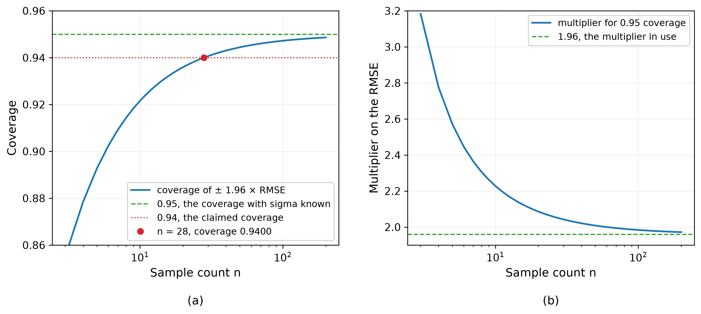

# Intervals from the RMSE and Their Use in SPC
Rev. 6 | Created: 2026-10-09 | Updated: 2026-10-10 11:56 CDT

- [1. Purpose](#1-purpose)
- [2. Summary](#2-summary)
- [3. Taxonomy and its Hierarchy](#3-taxonomy-and-its-hierarchy)
  - [3.1 Placement](#31-placement)
- [4. RMSE Interval](#4-rmse-interval)
  - [4.1 Interval Calculation](#41-interval-calculation)
  - [4.2 Interval Coverage](#42-interval-coverage)
  - [4.3 Coverage Loss](#43-coverage-loss)
  - [4.4 Coverage Stated with 1.96](#44-coverage-stated-with-196)
  - [4.5 Degrees of Freedom with Fitted Parameters](#45-degrees-of-freedom-with-fitted-parameters)
  - [4.6 Conditions](#46-conditions)
- [5. Prediction Interval](#5-prediction-interval)
  - [5.1 The Multiplier for 95 Percent](#51-the-multiplier-for-95-percent)
  - [5.2 Leverage](#52-leverage)
  - [5.3 Conditions](#53-conditions)
- [6. Confidence Interval](#6-confidence-interval)
- [7. Tolerance Interval](#7-tolerance-interval)
- [8. Spec Setting for SPC](#8-spec-setting-for-spc)
  - [8.1 What the Limit Is Drawn On](#81-what-the-limit-is-drawn-on)
  - [8.2 The Limit from the RMSE](#82-the-limit-from-the-rmse)
  - [8.3 The Guard Band](#83-the-guard-band)
  - [8.4 The Spec and the Control Limit](#84-the-spec-and-the-control-limit)
- [References](#references)
- [Appendix A. Terminology](#appendix-a-terminology)
- [Appendix B. Quantile Functions of the Normal and t Distributions](#appendix-b-quantile-functions-of-the-normal-and-t-distributions)
  - [B.1 Normal Distribution](#b1-normal-distribution)
  - [B.2 t Distribution](#b2-t-distribution)
- [Appendix C. Chi-squared Distribution](#appendix-c-chi-squared-distribution)
- [Appendix D. Derivation of Equations (4) to (8)](#appendix-d-derivation-of-equations-4-to-8)

## 1. Purpose

- **Problem Statement**: The RMSE, a common ML metric, is hard to read as a physical quantity.
- **Goal**: A guide, in theory and in practice, to setting the limits used alongside a spec in SPC (the error limit and the guard band) from the RMSE of a model.
- **Non-Goal**: Intervals for errors that are not normally distributed.

## 2. Summary

This document separates the four intervals drawn around a prediction from the RMSE (the RMSE interval, the prediction interval, the confidence interval and the tolerance interval) by what they cover and the multiplier they use, and applies them to the three SPC limits (the error limit, the guard band and the control limit).

An interval of plus or minus 1.96 standard deviations holds a new error with probability 95.00% when the true standard deviation of the errors is used, and with less when the RMSE of n errors takes its place; the probability is 94% at n = 28 (it rounds to 94% for n from 19 to 55). The ratio of a new error to the RMSE follows Student's t distribution with n degrees of freedom, which pulls the probability below 95%.

To hold 95%, the multiplier is the 97.5% point of that t distribution instead of 1.96. It is 2.05 at n = 28 and returns to 1.96 as n grows. The error limit drawn on the model error uses that multiplier, and when a predicted value replaces a measured value in a conformity decision, the decision uses the existing spec narrowed inward by a guard band.

## 3. Taxonomy and its Hierarchy

The size of an interval is a multiple of the RMSE, the model error. The two ends of the interval are the center plus and minus the multiplier times the RMSE, and when $\sigma$ is known the multiplier is applied to that true value instead. Two things set the multiplier: whether the standard deviation of the errors (scale) is known or estimated, and what the interval is meant to cover (covered quantity). The two axes are shown in <a href="#fig-1">Fig 1</a> below.

```text
INTERVAL around a prediction:  center +/- k * scale
|
+-- axis 1: the scale
|   sigma                        the true error scale, known
|   RMSE of n errors             an estimate, itself random
|
+-- axis 2: the covered quantity
    one future error             prediction
    the mean of the errors       confidence
    a fraction of the population tolerance
```

<a id="fig-1"></a>
Fig 1. The two axes an interval around a prediction is placed on

The first axis separates a true from an estimated standard deviation of the errors, the value that sets the width. The second axis separates what an interval of that width is taken to cover, moving from one error to the mean of the errors and then to a fraction of the population.

The intervals on the two axes form a hierarchy by the strength of their assumptions, shown in <a href="#fig-2">Fig 2</a> below.

```text
HIERARCHY of the intervals, with what each step down changes

interval                    scale          multiplier        coverage of the next error
Normal interval             σ, known       z(1 - α/2)        1 - α for every n
|
| assumption dropped: σ is known. The RMSE of n errors takes its place.
|
+-- RMSE interval           RMSE           z(1 - α/2)        below 1 - α
|                                                            0.9400 at α = 0.05, n = 28
+-- prediction interval     RMSE           t(ν, 1 - α/2)     1 - α for every n
    |
    | requirement added: the covered fraction must hold with a stated confidence
    |
    +-- tolerance interval  RMSE           tolerance factor  a stated fraction of the
                                                             population, held with a
                                                             stated confidence
```

<a id="fig-2"></a>
Fig 2. The hierarchy the intervals form, and the assumption each step drops or the requirement it adds

- **σ**: The true standard deviation of the errors. Known for the normal interval, unknown for the RMSE, prediction and tolerance intervals.
- **RMSE**: The estimate of $\sigma$ from n errors, defined by Eq. (1).
- **n**: The number of errors formed by pairing predicted with measured values, the n of Eq. (1).
- **ν**: The degrees of freedom left in the sum of squares of the RMSE. The figure is the case $\nu = n$, with no fitted parameters.
- **multiplier**: The number the standard deviation is multiplied by. The two ends of the interval lie that far from the center.
- **coverage**: The probability that the error of the model's next prediction falls inside the interval. That error did not exist when the RMSE was computed, so it is independent of the n errors behind the RMSE; this document calls it the new error.
- **1 - α**: The probability the interval is set to cover. $\alpha$ is the remainder, and this document uses $\alpha = 0.05$.
- **z**: The quantile function (inverse CDF) of the standard normal distribution. It is the inverse of the CDF $\Phi$ of Eq. (3), so $z = \Phi^{-1}$, and $z(q)$ is the value with cumulative probability $q$. $z(1 - \alpha/2)$ leaves $\alpha$ in the two tails together and is 1.96 at $\alpha = 0.05$. Details are in [Appendix B](#appendix-b-quantile-functions-of-the-normal-and-t-distributions).
- **t**: The quantile function of Student's t distribution with $\nu$ degrees of freedom. $t(\nu, q)$ is the value with cumulative probability $q$, and $t(\nu, 1 - \alpha/2)$ is 2.05 at $\alpha = 0.05$ and $n = 28$.
- **tolerance factor**: The multiplier set by the fraction of the population to cover, the confidence that guarantees it, and n. With a confidence above 0.5 it exceeds the multiplier of the prediction interval.
- The $n = 28$ in the figure is the error count at which the probability is exactly 0.9400. Values at other n are in Table 2.

Each step down the hierarchy drops one assumption or adds one requirement. The top knows the standard deviation of the errors, the next estimates it from n errors, and the bottom uses the estimate to guarantee a fraction of the population. Once $\sigma$ is no longer assumed known, the hierarchy branches into the second row (RMSE interval) and the third row (prediction interval) of <a href="#fig-2">Fig 2</a>. Keeping the multiplier at $z(1 - \alpha/2)$ lets the probability fall below $1 - \alpha$; holding $1 - \alpha$ requires raising the multiplier to $\sqrt{n/\nu}\; t_{\nu}(1 - \alpha/2)$ of Eq. (9), which is $t_{n}(1 - \alpha/2)$ when $\nu = n$. The fourth row (tolerance interval) puts a confidence level on the covered probability, and with that confidence above 0.5 its multiplier exceeds the third row's.

### 3.1 Placement

Table 1 lists, for each interval, the value it takes on the two axes of <a href="#fig-1">Fig 1</a>, namely the standard deviation it uses and what it covers, together with the multiplier and probability those two fix. The interval to use is chosen from this table by the standard deviation at hand and what has to be covered.

Table 1. Intervals around a prediction

| #   | Interval            | Scale          | Multiplier                             | Covered quantity                          | Probability                                  |
| :-: | :-----------------: | :------------: | :------------------------------------: | :---------------------------------------: | :------------------------------------------: |
| 1   | Normal interval     | $\sigma$       | $z(1 - \alpha/2)$                      | One new error                             | $1 - \alpha$                                 |
| 2   | RMSE interval       | RMSE           | $z(1 - \alpha/2)$                      | One new error                             | [Value of Eq. (7)](#4-rmse-interval)         |
| 3   | Prediction interval | RMSE           | $\sqrt{n/\nu}\; t_{\nu}(1 - \alpha/2)$ | One new error                             | [$1 - \alpha$](#5-prediction-interval)       |
| 4   | Confidence interval | $s / \sqrt{n}$ | $t_{n-1}(1 - \alpha/2)$                | Mean of the errors                        | [$1 - \alpha$](#6-confidence-interval)       |
| 5   | Tolerance interval  | RMSE           | tolerance factor                       | At least a fraction $P$ of the population | [Confidence $\gamma$](#7-tolerance-interval) |

At $\alpha = 0.05$ the multiplier is 1.96 in rows 1 and 2, $\sqrt{n/\nu}\; t_{\nu}(0.975)$ in row 3 and $t_{n-1}(0.975)$ in row 4. Row 1 applies only when $\sigma$ is known; from row 2 on, a value computed from the sample stands in for $\sigma$. Rows 2 and 3 put different multipliers on the same standard deviation, and because the multiplier of row 3 comes from the t distribution with $\nu$ degrees of freedom as in Eq. (9), its probability stays at $1 - \alpha$ for every n. Row 4 is about $1/\sqrt{n}$ as wide as row 3 and covers the mean of the errors rather than a new error, so it cannot replace row 2. The $s$ of row 4, unlike the RMSE of Eq. (1), is the standard deviation computed after subtracting the mean of the errors and dividing by n - 1, with n - 1 degrees of freedom. Row 5 attaches a different meaning to its probability than the other four. Row 3 means a new error falls in the interval with probability $1 - \alpha$ on average; row 5 means the interval covers at least a fraction $P$ of the population with confidence $\gamma$, so the covered fraction itself carries a probability. Its multiplier is the tolerance factor fixed by $P$, $\gamma$ and n [[1](#ref-1)]. The tolerance factor has no closed form and is read from tables for each combination of the three [[2](#ref-2)].

## 4. RMSE Interval

This section gives Eq. (2), which draws the RMSE interval, and Eq. (7), the probability that this interval holds one new error. The unknown $\sigma$ cancels in the derivation of Eq. (7), so this probability depends only on the error count n.

### 4.1 Interval Calculation

The two ends of the interval are the center plus and minus 1.96 times the RMSE, and the RMSE is the root mean square of n errors.

```math
\mathrm{RMSE} = \sqrt{\frac{1}{n}\sum_{i=1}^{n} e_i^2} \hspace{19em} (1)
```

The error $e_i$ in Eq. (1) is the i-th predicted value of the model minus the i-th measured value, and $e_1, \dots, e_n$ are n such differences drawn independently from a normal distribution with mean 0 and variance $\sigma^2$.

```math
\mathrm{LSL},\ \mathrm{USL} = \mu_0 \mp 1.96\,\mathrm{RMSE} \hspace{19em} (2)
```

In Eq. (2), $\mu_0$ is the center of the interval, 0 for an interval on the errors. The multiplier 1.96 holds 95% when $\sigma$ is known, and with the RMSE standing in for $\sigma$ the probability falls short of 95%. The size of the shortfall is in section 4.2, and the multiplier that holds 95% is Eq. (9) of section 5.

#### Using the RMSE in Place of Sigma 🎈

Two facts let the RMSE stand in for $\sigma$.

- **Expected value**: With a zero mean, $\sigma^2 = E[e_i^2]$, and the quantity under the square root in Eq. (1) is the sample mean of $e_i^2$, so $E[\mathrm{RMSE}^2] = \sigma^2$. $\mathrm{RMSE}^2$ is therefore an unbiased estimator of $\sigma^2$, and since the sample mean converges to $\sigma^2$ as n grows, the RMSE converges to $\sigma$.
- **Finite n**: The t distribution of Eq. (6) accounts exactly for how far the RMSE departs from $\sigma$ at finite n, so Eq. (7) gives the probability without approximation. That includes the RMSE running slightly below $\sigma$ on average, which pulls the probability of the 1.96 interval below 95%; the size of that drop is in sections 4.2 and 4.3.

### 4.2 Interval Coverage

With $\sigma$ known, an interval of 1.96 times $\sigma$ holds 95.00% for every n; with the RMSE in place of $\sigma$ it holds less.

```math
P\left(|e| \le 1.96\,\sigma\right) = 2\Phi(1.96) - 1 = 0.9500 \hspace{19em} (3)
```

$\Phi$ is the CDF of the standard normal distribution, and 1.96 is its two-sided 95% point cut at the second decimal place. The uncut value is 1.95996, and the 0.950004 that the 1.96 interval holds differs from 95% at the sixth decimal place. This is the value behind the convention of reporting limits as the mean difference plus or minus 1.96 standard deviations when two measurement methods are compared [[3](#ref-3)]. The 1.96 corresponds to a target probability of 95%; a different target replaces it with its own two-sided point. This document uses 95%, as is customary.

The RMSE varies from one data set to the next, so it cannot simply replace the $\sigma$ of Eq. (3). The sum of squares divided by $\sigma^2$ follows a chi-squared distribution with n degrees of freedom; its definition, density and CDF are in [Appendix C](#appendix-c-chi-squared-distribution).

```math
\frac{n\,\mathrm{RMSE}^2}{\sigma^2} \sim \chi^2_n \hspace{19em} (4)
```

Eq. (4) gives the expected value of the RMSE, which is $\sigma$ times a constant below 1.

```math
E[\mathrm{RMSE}] = c_n\,\sigma, \qquad c_n = \sqrt{\frac{2}{n}}\;\frac{\Gamma\!\left(\frac{n+1}{2}\right)}{\Gamma\!\left(\frac{n}{2}\right)} \hspace{19em} (5)
```

$c_n$ tends to 1 as n grows: 0.9754 at n = 10, 0.9911 at 28 and 0.9975 at 100. The derivation is in [Appendix D](#appendix-d-derivation-of-equations-4-to-8).

A new error divided by the RMSE follows Student's t distribution with n degrees of freedom [[4](#ref-4)].

```math
\frac{e^{\ast}}{\mathrm{RMSE}} \sim t_n \hspace{19em} (6)
```

The $e^{\ast}$ in Eq. (6) is the error of the model's next prediction. It did not exist when the RMSE was computed, so it is independent of the n errors behind the RMSE. With the denominator changed from the constant $\sigma$ to the random RMSE, the ratio follows a t distribution instead of the standard normal, and the probability changes with it.

```math
P\left(|e^{\ast}| \le 1.96\,\mathrm{RMSE}\right) = 2F_{t_n}(1.96) - 1 \hspace{19em} (7)
```

$F_{t_n}$ in Eq. (7) is the CDF of the t distribution with n degrees of freedom. Table 2 lists its value at each n and the multiplier that holds 95% in place of 1.96.

Table 2. Coverage of the RMSE interval by sample count

| #   | n    | $c_n$  | Coverage | Multiplier for 0.95 |
| :-: | :--: | :----: | :------: | :-----------------: |
| 1   | 5    | 0.9515 | 0.8927   | 2.5706              |
| 2   | 10   | 0.9754 | 0.9216   | 2.2281              |
| 3   | 20   | 0.9876 | 0.9359   | 2.0860              |
| 4   | 25   | 0.9901 | 0.9388   | 2.0595              |
| 5   | 28   | 0.9911 | 0.9400   | 2.0484              |
| 6   | 30   | 0.9917 | 0.9407   | 2.0423              |
| 7   | 40   | 0.9938 | 0.9430   | 2.0211              |
| 8   | 50   | 0.9950 | 0.9444   | 2.0086              |
| 9   | 100  | 0.9975 | 0.9472   | 1.9840              |
| 10  | 200  | 0.9988 | 0.9486   | 1.9719              |
| 11  | 1000 | 0.9998 | 0.9497   | 1.9623              |

The coverage column rises toward 95% as n grows but never reaches it. It rounds to 94% for n from 19 to 55, and row 5, at 0.9400, is the closest. Coverage exceeds 94.5% only for n of 56 or more, and 94.9% only for n of 277 or more. Table 2 is the case $\nu = n$ with no fitted parameters; with fitted parameters the value comes from Eq. (8) in section 4.5. The values of Eq. (7) agree to the third decimal place with a Monte Carlo run of 2 million draws at n = 10, 28 and 100.

Eq. (7) and the multiplier that keeps 95%, plotted against n, are shown in <a href="#fig-3">Fig 3</a> below.



<a id="fig-3"></a>
Fig 3. Coverage of the RMSE interval and the multiplier that restores 95 percent

- (a) The probability of Eq. (7) against n. The upper horizontal line is 0.9500, the value with the standard deviation of the errors known, the lower one is 0.9400, and the marked point is n = 28, where the curve meets the lower line.
- (b) The multiplier $t_n(0.975)$ that keeps 95%, against n. The horizontal line is 1.96, and the curve comes down to it as n grows.

### 4.3 Coverage Loss

The probability drops for two reasons. One is that the expected RMSE is smaller than $\sigma$; the other is that the RMSE varies from one data set to the next.

If the RMSE always equaled its expected value $c_n\sigma$, the probability would be $2\Phi(1.96\,c_n) - 1$. At n = 28 that is 0.9479, so the smaller expected value lowers the probability by 0.0021. The actual probability is 0.9400, so the remaining 0.0079 is the drop caused by the variation of the RMSE.

The probability as a function of the standard deviation, $g(u) = 2\Phi(1.96\,u) - 1$, is concave for $u \gt 0$. Jensen's inequality gives $E[g(U)] \lt g(E[U])$, so the probability gained when the RMSE exceeds its expected value is smaller than the probability lost when it falls short, and the average goes down.

Both parts shrink together as n grows: 0.0059 and 0.0225 at n = 10, 0.0006 and 0.0022 at n = 100.

### 4.4 Coverage Stated with 1.96

A statement that pairs 1.96 with 95% is right only approximately, and only for n in the hundreds, as Table 2 shows. A statement that pairs 1.96 with 94% reports the value for an RMSE-estimated standard deviation with n around 30; with $\sigma$ known, the multiplier that holds 94% is 1.88.

### 4.5 Degrees of Freedom with Fitted Parameters

When p parameters are fitted to the data and the RMSE is computed from the residuals, the degrees of freedom drop to $\nu = n - p$, and the same 1.96 holds a smaller fraction.

```math
P\left(|e^{\ast}| \le 1.96\,\mathrm{RMSE}\right) = 2F_{t_{\nu}}\!\left(1.96\sqrt{\frac{\nu}{n}}\right) - 1, \qquad \nu = n - p \hspace{19em} (8)
```

Eq. (8) reduces to Eq. (7) when p is 0. At n = 28 it gives 0.9299 for p = 2 and 0.9111 for p = 5. At n = 100 and p = 5 it gives 0.9409, the same 0.94 from more than three times the data.

### 4.6 Conditions

- **Assumptions**: Errors drawn independently from a normal distribution with mean 0 and a common variance. The errors behind the RMSE independent of the new error to be covered. Leverage, the variation of the predicted value itself, left out (section 5.2).
- **Settings**: A multiplier fixed at 1.96. With p parameters fitted to the same data, $\nu = n - p$ degrees of freedom and the probability from Eq. (8).
- **Failure conditions**: A nonzero mean error makes the RMSE carry bias as well as spread, so the interval is wider than needed and the probability of Eq. (7) no longer fits it. An error variance that changes with the input (heteroscedasticity) leaves one RMSE unable to represent the errors at every input, and the probability drops at inputs with large variance. Correlated errors leave fewer than n degrees of freedom in the sum of squares, so Eq. (7) overstates the probability. Tails heavier than normal make the same multiplier hold less; a Laplace distribution with the same variance puts 93.7% inside $\pm 1.96\sigma$.
- **Where it is used**: Bland-Altman limits on the difference between two measurement methods [[3](#ref-3)].

## 5. Prediction Interval

The prediction interval replaces the multiplier 1.96 of the RMSE interval with one taken from the t distribution, and the next error falls inside it with probability $1 - \alpha$ for every n.

```math
\mathrm{LSL},\ \mathrm{USL} = \mu_0 \mp k\,\mathrm{RMSE}, \qquad k = \sqrt{\frac{n}{\nu}}\; t_{\nu}\!\left(1 - \frac{\alpha}{2}\right) \hspace{19em} (9)
```

In Eq. (9), $\mu_0$ is as in Eq. (2). $k$ is the multiplier set by the target probability $1 - \alpha$, and $\sqrt{n/\nu}$ is a correction factor that compensates for the RMSE dividing its sum of squares by n rather than $\nu$. With no fitted parameters, $\nu = n$, the correction factor is 1, and $k = t_n(1 - \alpha/2)$, which is 2.05 at $\alpha = 0.05$ and n = 28, the last column of Table 2. With p fitted parameters, $\nu = n - p$ goes into the formula, and n = 28 with p = 2 gives 2.13.

It uses the same standard deviation as the RMSE interval of section 4 and differs only in the multiplier. The RMSE interval fixes the multiplier at 1.96, which lowers its probability to Eq. (7); the prediction interval uses the $k$ of Eq. (9) and keeps the probability at $1 - \alpha$.

### 5.1 The Multiplier for 95 Percent

At $\alpha = 0.05$ the multiplier is 2.05 at n = 28, 2.01 at 50 and 1.98 at 100.

### 5.2 Leverage

The prediction interval in this document is a simplified one without leverage: the multiplier of Eq. (9) and the probability of Eq. (8) assume a new error independent of the residuals behind the RMSE and with variance $\sigma^2$. The error left after subtracting the model's prediction at a new input $x^{\ast}$ has variance $\sigma^2(1 + h)$ rather than $\sigma^2$, where $h$ is the leverage of that input, the variation of the predicted value itself. For linear regression, $h = 1/n + (x^{\ast} - \bar{x})^2 / \sum (x_i - \bar{x})^2$. With $h$ above 0, the probability actually held is below $1 - \alpha$ for the interval of Eq. (9) and below the value of Eq. (8) for the 1.96 interval, and it falls further the farther the input lies from the center of the data.

### 5.3 Conditions

- **Assumptions**: As in section 4.6.
- **Settings**: The multiplier $\sqrt{n/\nu}\; t_{\nu}(0.975)$ of Eq. (9), with $\nu = n - p$ degrees of freedom, p being the number of parameters fitted to the same data. The error count n stays separately in the denominator of Eq. (1), the definition of the RMSE, and enters through $\sqrt{n/\nu}$.
- **Failure conditions**: As in section 4.6. Under the four conditions of section 4.6 even the multiplier of Eq. (9) does not keep the probability at $1 - \alpha$.
- **Where it is used**: Prediction error ranges reported for regression models, error bars on predicted values of process data, and the error limit of section 8.

## 6. Confidence Interval

The confidence interval holds the mean of the errors rather than a single error, and with the same degrees of freedom and standard deviation it is $1/\sqrt{n}$ as wide as the prediction interval.

The interval is $\bar{e} \pm t_{\nu}(1 - \alpha/2)\, s / \sqrt{n}$, where $\bar{e}$ is the mean of the n errors, $s$ is the standard deviation computed after subtracting that mean, and the degrees of freedom are $\nu = n - 1$. Since it covers a mean, its width shrinks to 0 as n grows, while the width of the prediction interval keeps $\sigma$ and does not. Using one for the other draws an interval $\sqrt{n}$ times too narrow where a single error has to be covered.

This interval checks whether the model bias is 0. An interval that excludes 0 means the mean error is not 0, and that bias is removed first, as in the first item of section 8.2.

## 7. Tolerance Interval

The tolerance interval guarantees, with confidence $\gamma$, that it covers a fraction $P$ of the population.

In the prediction interval the next error falls inside with probability $1 - \alpha$ on average; in the tolerance interval the probability that the interval covers at least a fraction $P$ of the population is $\gamma$. With the confidence above 0.5 the added requirement raises the multiplier, so at the same n and fraction it is wider than the prediction interval. Its multiplier is the tolerance factor fixed by $P$, $\gamma$ and n, which has no closed form and is read from tables for each combination [[1](#ref-1)] [[2](#ref-2)].

It is used when a requirement names both the fraction of the population the interval must cover and the confidence that must guarantee it, as in "at least 99% of the population with 95% confidence". When only the next point matters, the prediction interval is the right one.

## 8. Spec Setting for SPC

The three limits drawn in SPC on predicted values use the prediction interval, the RMSE interval and the normal interval, and the confidence interval checks the model bias before them.

- **Prediction interval**: The error limit (section 8.2). The error of the next prediction must be covered with probability $1 - \alpha$ for every n, so the multiplier of Eq. (9) is used.
- **RMSE interval**: The guard band of the acceptance limit (section 8.3). ISO 14253-1 subtracts from the spec the expanded uncertainty, the standard uncertainty times a fixed factor of 2, which gives the form of an RMSE interval, a fixed multiplier on the RMSE. As with Eq. (7), the probability held by a fixed multiplier drops as n gets small, so for small n the multiplier is raised toward that of the prediction interval.
- **Normal interval**: The control limit (section 8.4). Control limits treat the observed standard deviation as known and add and subtract three times it, which is row 1 of Table 1 with a multiplier of 3, that is $\alpha = 0.0027$.
- **Confidence interval**: The bias check (first item of section 8.2). Before the RMSE is computed, the interval of section 6 checks whether the mean error is 0.
- **Tolerance interval**: Not used. If the spec requires "at least a fraction $P$ of the population with confidence $\gamma$", the multiplier of the error limit becomes the tolerance factor of section 7.

### 8.1 What the Limit Is Drawn On

The error limit and the guard band come from the RMSE, and the control limit comes from the process variation. The three limits are compared in Table 3.

Table 3. Limits around a predicted value

| #   | Limit            | Set from          | Offset                             | What it decides                                   |
| :-: | :--------------: | :---------------: | :--------------------------------: | :-----------------------------------------------: |
| 1   | Error limit      | RMSE              | $k\,\mathrm{RMSE}$                 | Whether to accept the error of one prediction     |
| 2   | Acceptance limit | Spec and RMSE     | $g\,\mathrm{RMSE}$                 | Whether to decide conformity on a predicted value |
| 3   | Control limit    | Process variation | Three observed standard deviations | Whether the process has changed                   |

Row 1 is the range within which the model may replace a measurement. Row 2 is the existing spec narrowed inward, and the amount of narrowing is the guard band. Row 3 does not come from the spec, but on a chart of predicted values its width also reflects the RMSE, through Eq. (11).

### 8.2 The Limit from the RMSE

The error limit, row 1 of Table 3, is Eq. (9) of section 5 with $\mu_0 = 0$. The spec is set separately from the requirement, and the RMSE enters it only through the guard band of section 8.3. At $\alpha = 0.05$ and $\nu = n = 28$ the multiplier is 2.05, the value in the last column of Table 2. Check three things before using it.

- **Remove the bias first**: A nonzero mean error makes the RMSE carry bias as well as spread (section 4.6) and widens the limit beyond what is needed. Correct the bias in the model and recompute the RMSE.
- **Use data not used to fit the model**: No parameters were fitted to those data, so $\nu = n$. Residuals from the fitting data reduce the degrees of freedom to $\nu = n - p$ and make Eq. (7) overstate the probability, so the probability then comes from Eq. (8) and the multiplier from Eq. (9) with that $\nu$.
- **Count the errors first**: At n around 30, 1.96 holds 94%, so a 95% error limit takes its multiplier from Table 2 instead.

### 8.3 The Guard Band

When a predicted value replaces a measured value in a conformity decision, the decision uses an acceptance limit narrowed inward from the spec.

```math
A_{\mathrm{L}} = \mathrm{LSL} + g\,\mathrm{RMSE}, \qquad A_{\mathrm{U}} = \mathrm{USL} - g\,\mathrm{RMSE} \hspace{19em} (10)
```

Only items between the two values of Eq. (10) are accepted, and the width $g\,\mathrm{RMSE}$ between the spec and the acceptance limit is the guard band. An item measured just inside the spec can have a true value outside it, with a probability that grows with the RMSE. The guard band lowers that probability, the consumer's risk [[5](#ref-5)]. The default rule of ISO 14253-1 subtracts one expanded uncertainty from the spec [[6](#ref-6)]. Taking the RMSE as the standard uncertainty makes $g$ the coverage factor, and the customary coverage factor of 2 gives $g = 2$. For small n a value above 2 is used, for the same reason that $k$ in Eq. (9) grows. A larger $g$ lowers the consumer's risk at the cost of a higher probability of rejecting conforming items, the producer's risk.

### 8.4 The Spec and the Control Limit

Control limits come from the process variation and the spec from the requirement, so the two are not set to the same value. On a chart of predicted values the observed variation contains both the process variation and the model error.

```math
\sigma_{\mathrm{obs}}^2 = \sigma_{\mathrm{proc}}^2 + \mathrm{RMSE}^2 \hspace{19em} (11)
```

The $\sigma_{\mathrm{obs}}$ of Eq. (11) sets the width of the control limits, so an RMSE of half the process standard deviation widens them 1.12 times and lowers the process capability index measured on the same data to 0.89 times its value. An RMSE equal to the process standard deviation gives 1.41 and 0.71 times. Eq. (11) holds when the model error is independent of the process variation; if the error changes with the process level (heteroscedasticity), one RMSE cannot set the limits at every process level.

## References

<a id="ref-1"></a>
[1] Meeker, W. Q., Hahn, G. J., & Escobar, L. A. (2017). [Statistical Intervals: A Guide for Practitioners and Researchers](https://wqmeeker.stat.iastate.edu/other_pages/hahn_meeker.html) (2nd ed.). John Wiley & Sons. ISBN 978-0471687177.<br>
<a id="ref-2"></a>
[2] NIST/SEMATECH. (2012). [e-Handbook of Statistical Methods](https://doi.org/10.18434/M32189). NIST Handbook 151, National Institute of Standards and Technology.<br>
<a id="ref-3"></a>
[3] Bland, J. M., & Altman, D. G. (1986). [Statistical Methods for Assessing Agreement Between Two Methods of Clinical Measurement](https://doi.org/10.1016/S0140-6736(86)90837-8). *The Lancet*, 327(8476), 307–310.<br>
<a id="ref-4"></a>
[4] Student. (1908). [The Probable Error of a Mean](https://doi.org/10.2307/2331554). *Biometrika*, 6(1), 1–25.<br>
<a id="ref-5"></a>
[5] JCGM. (2012). [Evaluation of Measurement Data — The Role of Measurement Uncertainty in Conformity Assessment](https://doi.org/10.59161/JCGM106-2012). JCGM 106:2012, Joint Committee for Guides in Metrology.<br>
<a id="ref-6"></a>
[6] ISO. (2017). [Geometrical Product Specifications (GPS) — Inspection by Measurement of Workpieces and Measuring Equipment — Part 1: Decision Rules for Verifying Conformity or Nonconformity with Specifications](https://www.iso.org/standard/70137.html). ISO 14253-1:2017, International Organization for Standardization.

---

## Appendix A. Terminology

- **chi-squared distribution**: The distribution of the sum of squares of independent standard normal values. Defined by Eq. (15).
- **concave**: The property of a function with a negative second derivative, whose curve bends downward.
- **confidence interval**: An interval with a set probability of containing the parameter being estimated.
- **consumer's risk**: The probability that an accepted item is out of spec.
- **control limit**: The limit on a chart that tells whether the process is behaving as usual. Computed from the process variation.
- **coverage**: The probability that an interval actually covers what it is meant to cover.
- **coverage factor**: The number the standard uncertainty is multiplied by to give the expanded uncertainty. Customarily 2.
- **degrees of freedom**: The number of independent components left in a sum of squares.
- **expanded uncertainty**: The standard uncertainty times the coverage factor.
- **gamma function**: The function defined by the integral of Eq. (19). It extends the factorial of positive integers.
- **guard band**: The width between the spec and the acceptance limit. Defined by Eq. (10).
- **heteroscedasticity**: An error variance that changes with the input or the process level.
- **Jensen's inequality**: For a concave function, the function of the expected value is at least the expected value of the function.
- **Laplace distribution**: A symmetric distribution whose two tails decay exponentially. Its tails are heavier than those of a normal distribution with the same variance.
- **leverage**: A measure of how far a new input lies from the center of the data. It sets how much the predicted value itself varies.
- **lower incomplete gamma function**: The gamma function with its integral cut off at a finite upper limit. Defined by Eq. (18).
- **Monte Carlo**: Estimating a probability from samples generated with random numbers.
- **prediction interval**: An interval with a set probability of containing one new observation.
- **process capability index**: The width of the spec divided by six times the process variation.
- **producer's risk**: The probability that a rejected item is within spec.
- **quantile function**: The inverse of a CDF. For a probability $q$ it gives the value with cumulative probability $q$. Defined by Eq. (13).
- **regularized incomplete gamma function**: The lower incomplete gamma function divided by the gamma function. It is the right-hand side of Eq. (17).
- **RMSE**: The square root of the mean of the squared errors. Defined by Eq. (1).
- **spec limit**: The upper and lower limits that come from the requirement. Set separately from the process variation.
- **Student t distribution**: The distribution of a standard normal value divided by the square root of an independent chi-squared value over its degrees of freedom.
- **tolerance factor**: The multiplier on the standard deviation in a tolerance interval. Fixed by the fraction, the confidence level and the sample size.
- **tolerance interval**: An interval guaranteed, with a stated confidence, to cover a stated fraction of the population.
- **unbiased estimator**: An estimator whose expected value equals the quantity it estimates.

## Appendix B. Quantile Functions of the Normal and t Distributions

### B.1 Normal Distribution

#### From the Cumulative Distribution Function to Its Inverse

A CDF gives, for a value $x$, the probability of being at most $x$; a quantile function goes the other way and gives, for a probability $q$, the value with cumulative probability $q$. The CDF of the standard normal distribution is written $\Phi$.

```math
\Phi(x) = P(Z \le x), \qquad Z \sim N(0, 1) \hspace{19em} (12)
```

$\Phi$ in Eq. (12) is continuous and only increases with $x$, so for each probability $q$ between 0 and 1 exactly one $x$ satisfies $\Phi(x) = q$. That $x$ is written $z(q)$, and it is the inverse of $\Phi$.

```math
z(q) = \Phi^{-1}(q), \qquad \Phi(z(q)) = q \hspace{19em} (13)
```

$z(0.5)$ is 0 and $z(0.975)$ is 1.96. The first is the median, and the second is the value below which 97.5% of the distribution lies.

#### The Two-sided Point

The two ends of an interval that leaves $\alpha$ in the two tails together are $\pm z(1 - \alpha/2)$. The distribution is symmetric, so each tail holds $\alpha/2$, and the point with $\alpha/2$ in the upper tail is the point with cumulative probability $1 - \alpha/2$ below it.

```math
P\left(|Z| \le z(1 - \alpha/2)\right) = 1 - \alpha \hspace{19em} (14)
```

With $\alpha = 0.05$, $z(0.975) = 1.96$, and Eq. (14) becomes Eq. (3).

### B.2 t Distribution

Student's t distribution with $\nu$ degrees of freedom uses $t(\nu, q)$ in the same way. It is the inverse of the CDF $F_{t_{\nu}}$ of that distribution, and $t(\nu, 1 - \alpha/2)$ is the point that leaves $\alpha$ in the two tails together. The t distribution has heavier tails than the normal, so at the same $q$ it exceeds $z(q)$, and it approaches $z(q)$ as $\nu$ grows. At $\alpha = 0.05$, $t(28, 0.975)$ is 2.05 and $t(1000, 0.975)$ is 1.96.

## Appendix C. Chi-squared Distribution

### C.1 Definition

Given $k$ independent random variables $Z_1, Z_2, \dots, Z_k$, each standard normal $N(0, 1)$, the random variable $X$ defined as their sum of squares follows the chi-squared distribution with $k$ degrees of freedom.

```math
X = \sum_{i=1}^{k} Z_i^2 = Z_1^2 + Z_2^2 + \dots + Z_k^2 \sim \chi^2(k) \hspace{19em} (15)
```

- $k$ (degrees of freedom): The number of independent standard normal variables summed.

The main text writes the same degrees of freedom as n and $\nu$. The $S$ of Eq. (20) is the $X$ of Eq. (15) with $k = n$, and the $S_{\nu}$ of Eq. (23) is the same with $k = \nu$.

### C.2 Probability Density Function

The probability density function of the chi-squared distribution with $k$ degrees of freedom is, for $x \gt 0$, as follows.

```math
f(x; k) = \frac{1}{2^{k/2}\,\Gamma(k/2)}\; x^{(k/2) - 1}\, e^{-x/2} \hspace{19em} (16)
```

$\Gamma$ in Eq. (16) is the gamma function, defined by Eq. (19).

### C.3 Cumulative Distribution Function

The CDF $F(x; k)$ is the probability $P(X \le x)$ that $X$ is at most $x$, obtained by integrating the density from 0 to $x$.

```math
F(x; k) = P(X \le x) = \frac{1}{\Gamma(k/2)}\; \gamma\!\left(\frac{k}{2}, \frac{x}{2}\right) \quad (x \ge 0) \hspace{19em} (17)
```

$\gamma(s, t)$ in Eq. (17) is the lower incomplete gamma function, and $\Gamma(s)$ is the gamma function, the same integral with its upper limit taken to infinity.

```math
\gamma(s, t) = \int_0^t u^{s-1} e^{-u}\, du \hspace{19em} (18)
```

```math
\Gamma(s) = \int_0^{\infty} u^{s-1} e^{-u}\, du \hspace{19em} (19)
```

The CDF of the chi-squared distribution has no simple form in elementary functions. It is therefore written, as in Eq. (17), as a regularized incomplete gamma function, and computed with numerical methods or the statistical functions of R, Python or Excel.

### C.4 Properties

- **Range**: $X \ge 0$. A sum of squares is never negative.
- **Mean**: $E(X) = k$.
- **Variance**: $\mathrm{Var}(X) = 2k$.
- **Shape**: Right-skewed with a long right tail for small $k$, and closer to a symmetric normal shape as $k$ grows.

## Appendix D. Derivation of Equations (4) to (8)

The starting point is a single fact: an error divided by $\sigma$ is standard normal. The sum of the squares of n of them follows a chi-squared distribution with n degrees of freedom.

```math
S = \sum_{i=1}^{n} \left(\frac{e_i}{\sigma}\right)^2 \sim \chi^2_n, \qquad S = \frac{n\,\mathrm{RMSE}^2}{\sigma^2} \hspace{19em} (20)
```

The second equality is Eq. (1) squared and multiplied by n, and it is Eq. (4). Eq. (5) follows from the expected value of the square root. The square root of a chi-squared value with n degrees of freedom has the expected value below.

```math
E\left[\sqrt{S}\right] = \sqrt{2}\;\frac{\Gamma\!\left(\frac{n+1}{2}\right)}{\Gamma\!\left(\frac{n}{2}\right)} \hspace{19em} (21)
```

Eq. (20) gives $\mathrm{RMSE} = \sigma\sqrt{S/n}$, so taking expected values and substituting Eq. (21) yields the $c_n$ of Eq. (5).

Eq. (6) follows from the definition of the t distribution. The new error $e^{\ast}$ is independent of $e_1, \dots, e_n$, so $Z = e^{\ast}/\sigma$ is a standard normal value independent of S.

```math
\frac{e^{\ast}}{\mathrm{RMSE}} = \frac{\sigma Z}{\sigma\sqrt{S/n}} = \frac{Z}{\sqrt{S/n}} \sim t_n \hspace{19em} (22)
```

$\sigma$ cancels in the middle of Eq. (22), so the covered fraction does not depend on the unknown $\sigma$ and is fixed by n alone. The probability that the absolute value of the left-hand side is at most 1.96, written with the CDF of the t distribution, is Eq. (7).

With p fitted parameters, the degrees of freedom of the sum of squares drop to $\nu = n - p$, but the RMSE still divides by n as in Eq. (1). Writing the chi-squared value with that many degrees of freedom as $S_{\nu}$ leaves the two numbers separate.

```math
\frac{e^{\ast}}{\mathrm{RMSE}} = \frac{Z}{\sqrt{S_{\nu}/n}} = \sqrt{\frac{n}{\nu}}\;\frac{Z}{\sqrt{S_{\nu}/\nu}} \sim \sqrt{\frac{n}{\nu}}\;t_{\nu} \hspace{19em} (23)
```

The left-hand side of Eq. (23) is at most 1.96 exactly when $t_{\nu}$ is at most $1.96\sqrt{\nu/n}$, and writing that with the CDF gives Eq. (8). The $c_n$ of Eq. (5) also shrinks by a further factor of $\sqrt{\nu/n}$ when n is replaced by $\nu$.
