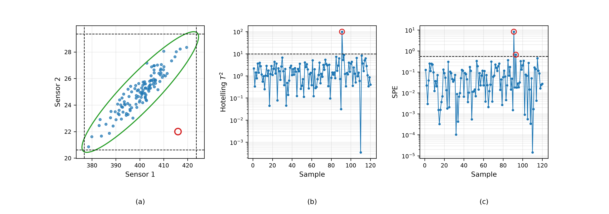

# Multivariate Statistical Process Control
Rev. 2 | Created: 2026-09-04 | Updated: 2026-09-04 19:26 UTC

> 웨이퍼 결과물 하나가 아니라 장비 센서 수십~수백 개의 조합을 한꺼번에 추적하는 기법에 대한 기록.
> Hotelling $T^2$ 관리도와 PCA 기반 SPE 통계량이 각각 무엇을 보고, 왜 둘이 함께 필요한지를 다룬다.

## 1. Scope

Uniformity index 같은 지표는 공정이 끝난 뒤의 결과물 $y$ 를 본다. 그것으로 이상을 알았을 때는 웨이퍼가
이미 그렇게 만들어진 뒤이다. 장비는 그 사이에 압력·유량·전력·온도·임피던스 같은 값을 초 단위로
남기는데, 이 $X$ 를 보면 결과가 나오기 전에 이상을 알 수 있다. 문제는 그 값이 하나가 아니라 수십에서
수백 개라는 데 있다.

센서마다 관리도를 하나씩 두는 방법은 두 가지 이유로 실패한다. 이 문서는 그 두 가지를 먼저 보이고,
그것을 푸는 두 통계량인 Hotelling $T^2$ 와 PCA 기반 SPE 를 정리한다. 본문에서 정의 없이 쓴 용어는
[Appendix A](#appendix-a-terminology) 에 모았다.

### 1.1. False Alarm Inflation

첫째 이유는 헛경보가 쌓이는 것이다. 관리도 하나의 헛경보 확률이 $\alpha$ 이고 센서 $p$ 개가 독립이면,
어느 하나라도 울릴 확률은 $\alpha$ 가 아니라 다음과 같다.

$$\alpha_{\mathrm{total}} = 1 - (1 - \alpha)^{p} \hspace{19em} (1)$$

Table 1. Chance that at least one of p univariate charts signals on a healthy process, alpha = 0.0027.

| Sensors | False alarm rate |
|---:|---:|
| 1 | 0.0027 |
| 2 | 0.0054 |
| 5 | 0.0134 |
| 10 | 0.0267 |
| 20 | 0.0526 |
| 50 | 0.1264 |
| 100 | 0.2369 |

센서 100 개에 3 sigma 관리도를 하나씩 걸면 정상 공정에서도 네 점에 한 번꼴로 어딘가는 울린다. 그
상태의 관리도는 아무도 보지 않게 된다.

### 1.2. Correlation Blindness

둘째 이유가 더 근본적이다. 장비 센서들은 서로 독립이 아니다. 유량을 올리면 압력이 따라 오르고, 전력을
올리면 온도가 따라 오른다. 관리도를 따로 두면 각 센서가 자기 범위 안에 있는지만 보고, 센서들 사이의
그 관계가 깨졌는지는 보지 못한다. 유량이 평소보다 높은데 압력이 따라 오르지 않았다면 두 값 모두
정상 범위 안에 있어도 무언가 고장난 것인데, 개별 관리도는 그것을 신호로 만들지 못한다.

## 2. Hotelling's T-Squared Chart

### 2.1. Definition

해법은 $p$ 개의 값을 하나의 거리로 묶는 것이다. 관측 vector 를 $\mathbf{x}$, 정상 운전 자료에서 얻은
평균 vector 를 $\boldsymbol{\mu}$, 공분산 행렬을 $\mathbf{S}$ 라 할 때 Hotelling 의 $T^2$ 는 그 둘
사이의 Mahalanobis 거리의 제곱이다.

$$T^{2} = \left( \mathbf{x} - \boldsymbol{\mu} \right)^{\top} \mathbf{S}^{-1} \left( \mathbf{x} - \boldsymbol{\mu} \right) \hspace{19em} (2)$$

$\mathbf{S}^{-1}$ 이 하는 일이 핵심이다. 각 방향을 그 방향의 표준편차로 나누어 척도를 없애고, 동시에
센서 사이의 상관을 풀어 준다. 그 결과 이 거리는 자료가 흩어진 모양을 따라 재는 거리가 된다. 상관이
강한 두 센서라면 둘이 함께 움직이는 방향으로는 멀리 가도 거리가 조금밖에 늘지 않고, 둘이 어긋나는
방향으로는 조금만 벗어나도 거리가 크게 는다.

$T^2$ 를 상수로 놓으면 $p$ 차원 공간의 타원체가 되며, 이것이 관리한계이다. 개별 관리도가 만드는
직육면체와는 모양이 다르고, 그 차이가 section 1.2 의 이상을 잡아내는 자리이다.

### 2.2. Control Limit

정상 운전 자료 $m$ 개로 $\boldsymbol{\mu}$ 와 $\mathbf{S}$ 를 추정한 뒤 새 관측값을 감시할 때, 한계는
$F$ 분포에서 나온다.

$$T^{2}_{\mathrm{limit}} = \frac{p(m+1)(m-1)}{m(m-p)} F_{\alpha, p, m-p} \hspace{19em} (3)$$

$m$ 이 충분히 크면 이 값은 자유도 $p$ 인 chi-squared 분포의 상위 $\alpha$ 점으로 수렴한다.

## 3. PCA-Based Monitoring

### 3.1. Why Principal Components

식 (2) 는 $\mathbf{S}^{-1}$ 을 요구하는데, 센서가 수백 개인 현장에서 이 역행렬은 대개 존재하지 않거나
믿을 수 없다. 센서들이 강하게 상관되어 공분산 행렬이 거의 특이하고, 정상 운전 자료 개수 $m$ 이 센서
개수 $p$ 보다 크지 않은 경우도 흔하기 때문이다.

Principal component analysis 는 이것을 자료가 실제로 놓인 저차원 부분공간을 찾아 푼다. 표준화한 자료
행렬 $\mathbf{X}$ 를 $a$ 개의 주성분으로 나누면 다음과 같다.

$$\mathbf{X} = \mathbf{T}\mathbf{P}^{\top} + \mathbf{E} \hspace{19em} (4)$$

여기서 $\mathbf{P}$ 는 loading, $\mathbf{T} = \mathbf{X}\mathbf{P}$ 는 score, $\mathbf{E}$ 는 남은
잔차이다. 공정이 정상일 때 관측값은 주성분이 펼치는 부분공간 안에 놓이고, 잔차는 측정 잡음 수준으로
작다.

### 3.2. Two Statistics

이 분해가 감시할 자리를 둘로 나눈다. 하나는 부분공간 **안에서** 얼마나 멀리 갔는지이고, 다른 하나는
부분공간에서 **얼마나 벗어났는지**이다.

부분공간 안의 거리는 score 로 계산한 $T^2$ 이며, $\lambda_j$ 는 $j$ 번째 주성분의 분산이다.

$$T^{2} = \sum_{j=1}^{a} \frac{t_j^{2}}{\lambda_j} \hspace{19em} (5)$$

부분공간에서 벗어난 거리는 잔차의 제곱합이며, squared prediction error 또는 $Q$ 통계량이라 부른다.

$$SPE = \left\lVert \mathbf{x} - \hat{\mathbf{x}} \right\rVert^{2} = \sum_{j=1}^{p} \left( x_j - \hat{x}_j \right)^{2}, \qquad \hat{\mathbf{x}} = \mathbf{P}\mathbf{P}^{\top}\mathbf{x} \hspace{19em} (6)$$

$SPE$ 의 관리한계는 버린 주성분의 분산 $\lambda_{a+1}, \ldots, \lambda_p$ 로부터 Jackson 과 Mudholkar
의 근사식으로 얻는다 [[1](#ref-1)]. $\theta_i = \sum_{j=a+1}^{p} \lambda_j^{i}$ 이고
$h_0 = 1 - 2\theta_1\theta_3 / (3\theta_2^2)$ 일 때 다음과 같다.

$$SPE_{\mathrm{limit}} = \theta_1 \left[ \frac{z_\alpha \sqrt{2\theta_2 h_0^{2}}}{\theta_1} + 1 + \frac{\theta_2 h_0 (h_0 - 1)}{\theta_1^{2}} \right]^{1/h_0} \hspace{19em} (7)$$

### 3.3. What Each One Catches

두 통계량은 서로 다른 종류의 이상을 잡으며, 그래서 둘 다 필요하다.

Table 2. What the two statistics monitor.

| Statistic | Measures | Signals when |
|---|---|---|
| $T^2$ | 주성분 부분공간 안의 거리 | 센서들이 평소의 관계는 지키면서 함께 정상 범위를 벗어남 |
| $SPE$ | 주성분 부분공간에서 벗어난 거리 | 센서들 사이의 관계 자체가 깨져 model 로 설명되지 않음 |

$T^2$ 만 커진 것은 공정이 평소 움직이던 방향을 따라 멀리 간 것이므로, 대개 알고 있는 조작 변수가
움직인 결과이다. $SPE$ 가 커진 것은 정상 자료에서 배운 관계로 설명되지 않는 새로운 무언가가 생겼다는
뜻이며, 부품 고장이나 누설처럼 model 을 만들 때 본 적 없는 사건이 여기에 해당한다. 현장에서 더 급한
쪽은 대개 후자이다.

## 4. Diagnosis

$T^2$ 든 $SPE$ 든 스칼라 하나이므로, 이상이 있다는 것만 말하고 어느 센서 때문인지는 말하지 않는다.
Uniformity index 가 웨이퍼의 어디가 문제인지 말하지 못하는 것과 같은 한계이다. 그래서 신호가 나면
통계량을 센서별 기여도로 분해해 본다. $SPE$ 는 정의부터 센서별 항의 합이므로 분해가 자명하다.

$$\mathrm{contribution}_j = \left( x_j - \hat{x}_j \right)^{2} \hspace{19em} (8)$$

기여도가 큰 센서 몇 개가 원인을 좁혀 준다. 다만 기여도는 원인을 지목하는 것이 아니라 후보를 좁히는
것임에 주의해야 한다. 상관이 강한 센서들은 하나가 고장나면 나머지의 기여도까지 함께 올라가는
smearing 이 일어나기 때문이다.

## 5. Application

Fig 1. Two correlated sensors over 120 samples. The scatter shows the univariate three-sigma box as
dashed lines and the T-squared limit as the ellipse (a); the T-squared chart (b) and the SPE chart
(c) follow the same samples on a log scale. The circled sample is the fault.

Fig 1 이 section 1.2 의 상황을 그대로 보여 준다. 두 센서의 상관은 0.92 이고, 91 번 표본에서 첫 번째
센서는 평균보다 $2.02\sigma$ 높고 두 번째 센서는 $2.05\sigma$ 낮다. 두 값 모두 3 sigma 관리한계 안에
있으므로 개별 관리도는 아무 신호도 내지 않는다. 그림 (a) 에서 그 점은 점선 상자 안에 있으면서 타원
밖으로 한참 나가 있다.

두 다변량 통계량은 모두 이 표본을 잡아낸다. $T^2$ 는 한계 9.746 에 대해 99.051 이 나오고, 주성분 하나를
남긴 PCA 의 $SPE$ 는 한계 0.5505 에 대해 8.279 가 나온다. 첫 주성분이 전체 분산의 95.8 percent 를
설명하므로 두 센서가 함께 움직이는 방향은 model 안에 들어가 있고, 서로 어긋난 이 표본은 그 부분공간에서
벗어난 것으로 잡힌다.

반도체 현장에서 이 구조가 놓이는 자리는 fault detection and classification 이다. 장비가 남기는 시계열을
step 별로 잘라 요약값을 만들고, 정상 웨이퍼들로 PCA model 을 세운 뒤 새 웨이퍼의 $T^2$ 와 $SPE$ 를
계산한다. 웨이퍼 한 장마다 수백 개의 수 대신 두 개의 수를 보게 되므로 사람이 감당할 수 있고, 결과물을
측정하기 전에 판정이 나온다는 것이 이 방법의 실질적인 이득이다 [[2](#ref-2)].

Model 을 다루는 데는 조건이 둘 있다. 하나는 정상 자료의 정의이다. Model 은 정상 운전 기간의 자료로만
세워야 하며, 여기에 이상 자료가 섞이면 그 이상이 정상으로 학습된다. 다른 하나는 갱신이다. 장비는
소모품 교체와 정비를 거치며 정상 상태 자체가 옮겨가므로, model 을 고정해 두면 정비 직후부터 $SPE$ 가
계속 울린다. 정비 주기에 맞추어 model 을 다시 세우는 절차가 필요하다.

## References

[1] Jackson, J. E., & Mudholkar, G. S. (1979). [Control Procedures for Residuals Associated with
Principal Component Analysis](https://doi.org/10.1080/00401706.1979.10489779). *Technometrics*, 21(3), 341–349.

[2] MacGregor, J. F., & Kourti, T. (1995). [Statistical Process Control of Multivariate Processes](https://doi.org/10.1016/0967-0661%2895%2900014-L).
*Control Engineering Practice*, 3(3), 403–414.

[3] Montgomery, D. C. (2020). *Introduction to Statistical Quality Control* (8th ed.). Wiley.
ISBN 978-1-119-72309-7.

---

## Appendix A. Terminology

- **Loading**: 주성분이 원래 센서들의 어떤 조합인지를 담은 vector.
- **Mahalanobis distance**: 자료가 흩어진 모양을 기준으로 잰 거리이며, 공분산 행렬의 역행렬로
  가중한다.
- **Principal component**: 자료의 분산을 가장 많이 담는 방향부터 차례로 잡은 서로 직교인 방향.
- **Score**: 한 관측값을 주성분 방향에 사영한 값.
- **Smearing**: 상관된 센서들 사이에서 한 센서의 고장이 다른 센서의 기여도까지 키우는 현상.
- **Squared prediction error**: 관측값과 주성분 model 이 재구성한 값 사이의 거리 제곱이며, $Q$
  통계량이라고도 한다.
- **Uniformity index**: 웨이퍼 여러 지점에서 측정한 공정 결과의 산포를 평균으로 나누어 백분율로 적은
  지표이며, 공정이 끝난 뒤의 결과물만 본다.
