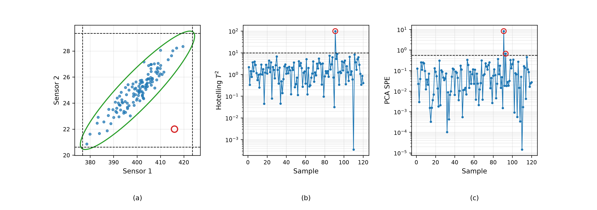

# Multivariate Statistical Process Control
Rev. 0 | Created: 2026-09-28 | Updated: 2026-09-28 15:06 CDT

- [1. Scope](#1-scope)
  - [1.1. False Alarm Inflation](#11-false-alarm-inflation)
  - [1.2. Correlation Blindness](#12-correlation-blindness)
- [2. Hotelling's T-Squared Chart](#2-hotellings-t-squared-chart)
  - [2.1. Definition](#21-definition)
  - [2.2. Control Limit](#22-control-limit)
- [3. PCA-Based Monitoring](#3-pca-based-monitoring)
  - [3.1. Why Principal Components](#31-why-principal-components)
  - [3.2. Two Statistics](#32-two-statistics)
  - [3.3. What Each One Catches](#33-what-each-one-catches)
- [4. Diagnosis](#4-diagnosis)
- [5. Application](#5-application)
- [References](#references)
- [Appendix A. Terminology](#appendix-a-terminology)

> A record of the techniques that track the combination of tens to hundreds of tool sensors at once,
> rather than a single wafer result.
> It covers what the Hotelling $T^2$ chart and the PCA-based squared prediction error (SPE) statistic each
> look at, and why the two are needed together.

## 1. Scope

A metric such as the uniformity index looks at the result $y$ after the process has finished. By the time
it reveals a fault, the wafer has already been made that way. In the meantime the tool records values
such as pressure, flow, power, temperature and impedance every second, and watching this $X$ reveals a
fault before the result is out. The difficulty is that there are not one but tens to hundreds of these
values.

Putting one control chart on each sensor fails for two reasons. This document shows those two first,
then sets out the two statistics that resolve them, Hotelling $T^2$ and the PCA-based SPE. Terms used in
the body without a definition are collected in [Appendix A](#appendix-a-terminology).

The principal components, distance and control limit the three statistics use are given in Table 1.

Table 1. Principal components, distance and control limit of the three statistics.

| #     | Statistic       | Principal components                                        | Distance             | Control limit                                 |
| :---: | :---:           | :---:                                                       | :---:                | :---:                                         |
| 1     | Hotelling $T^2$ | No PCA, all $p$ sensors, equation (2)                       | Mahalanobis distance | $F$ distribution, equation (3)                |
| 2     | PCA $T^2$       | Components in the model, $1, \ldots, a$, equation (5)       | Mahalanobis distance | Equation (3) with $a$ in place of $p$         |
| 3     | PCA SPE         | Components not in the model, $a+1, \ldots, p$, equation (6) | Euclidean distance   | Jackson–Mudholkar approximation, equation (7) |

Distance is a single number measuring how far a new observation lies from a reference point of the
normal operating data. The reference point is the mean for #1 and #2, and the value $\hat{\mathbf{x}}$
reconstructed by the PCA model for #3. The Mahalanobis distance weights by the inverse of the covariance,
so it counts a difference along a direction in which normal data spread widely as small and one along a
direction in which they spread narrowly as large, and thereby measures how rare the observation is
under normal operation. The Euclidean distance counts every direction with the same weight. Both
distances have a known distribution on normal data, which gives the control limits of equations (3) and
(7).

#1 measures across all $p$ sensors weighted by the covariance in section 2, while #2 measures the same
Mahalanobis distance in section 3 inside the subspace spanned by the $a$ principal components in the
model, and equals #1 when $a = p$. #3 measures the size of the residual left outside that subspace
without covariance weighting. When there are too many sensors for $\mathbf{S}^{-1}$ to be trusted, #2
and #3 are used as a pair. $p$ is the number of sensors, and $a$ is the number of principal components
put in the model in section 3.1.

### 1.1. False Alarm Inflation

The first reason is that false alarms pile up. If one chart has false alarm probability $\alpha$ and the
$p$ sensors are independent, the probability that at least one of them signals is not $\alpha$ but the
following.

$$\alpha_{\mathrm{total}} = 1 - (1 - \alpha)^{p} \hspace{19em} (1)$$

Table 2. Chance that at least one of p univariate charts signals on a healthy process, alpha = 0.0027.

| Sensors | False alarm rate |
|---:|---:|
| 1 | 0.0027 |
| 2 | 0.0054 |
| 5 | 0.0134 |
| 10 | 0.0267 |
| 20 | 0.0526 |
| 50 | 0.1264 |
| 100 | 0.2369 |

With a three-sigma chart on each of 100 sensors, something signals about once every four points even on
a normal process. Nobody looks at charts in that state.

### 1.2. Correlation Blindness

The second reason is more fundamental. Tool sensors are not independent of one another. Raising the flow
raises the pressure with it, and raising the power raises the temperature with it. Separate charts check
only whether each sensor stays in its own range, not whether the relation between sensors has broken. If
the flow is higher than usual and the pressure did not rise with it, something has failed even though
both values are in their normal ranges, and the univariate charts cannot turn that into a signal.

## 2. Hotelling's T-Squared Chart

### 2.1. Definition

The remedy is to combine the $p$ values into one distance. With the observation vector $\mathbf{x}$ and
the mean vector $\boldsymbol{\mu}$ and covariance matrix $\mathbf{S}$ from normal operating data,
Hotelling's $T^2$ is the square of the Mahalanobis distance between the two.

$$T^{2} = \left( \mathbf{x} - \boldsymbol{\mu} \right)^{\top} \mathbf{S}^{-1} \left( \mathbf{x} - \boldsymbol{\mu} \right) \hspace{19em} (2)$$

What $\mathbf{S}^{-1}$ does is the core of it. It divides each direction by the standard deviation along
that direction to remove scale, and at the same time undoes the correlation between sensors. The distance
is then measured along the shape in which the data spread. For two strongly correlated sensors, moving far
along the direction in which they move together adds little distance, while moving slightly along the
direction in which they disagree adds a lot.

Setting $T^2$ to a constant gives an ellipsoid in $p$-dimensional space, and that is the control limit.
Its shape differs from the box the univariate charts make, and that difference is where the fault of
section 1.2 is caught.

Of the two PCA-based statistics in section 3.2, the $T^2$ of equation (5) measures the same Mahalanobis
distance inside the principal component subspace, and the SPE of equation (6) is the square of a
Euclidean distance without covariance weighting.

### 2.2. Control Limit

When $\boldsymbol{\mu}$ and $\mathbf{S}$ are estimated from $m$ normal operating observations and a new
observation is monitored, the limit comes from the $F$ distribution.

$$T^{2}_{\mathrm{limit}} = \frac{p(m+1)(m-1)}{m(m-p)} F_{\alpha, p, m-p} \hspace{19em} (3)$$

For large enough $m$ this value converges to the upper $\alpha$ point of the chi-squared distribution with
$p$ degrees of freedom.

## 3. PCA-Based Monitoring

### 3.1. Why Principal Components

Equation (2) requires $\mathbf{S}^{-1}$, and with hundreds of sensors in the field this inverse usually
does not exist or cannot be trusted. The sensors are strongly correlated so the covariance matrix is
nearly singular, and it is also common for the number of normal operating observations $m$ not to exceed
the number of sensors $p$.

Principal component analysis resolves this by finding the low-dimensional subspace in which the data
actually lie. Splitting the standardized data matrix $\mathbf{X}$ into $a$ principal components gives the
following.

$$\mathbf{X} = \mathbf{T}\mathbf{P}^{\top} + \mathbf{E} \hspace{19em} (4)$$

Here $\mathbf{P}$ is the loading, $\mathbf{T} = \mathbf{X}\mathbf{P}$ the score and $\mathbf{E}$ the
remaining residual. When the process is normal, an observation lies inside the subspace spanned by the
principal components and the residual is as small as the measurement noise.

In this document the PCA model consists of the mean and standard deviation of the standardization set
from normal operating data, and the loading $\mathbf{P}$ and variances $\lambda_1, \ldots, \lambda_a$ of
the $a$ principal components put in the model. The $\mathbf{T}\mathbf{P}^{\top}$ of equation (4) is the
part this model reconstructs, and $\mathbf{E}$ is the part left along the principal components
$a+1, \ldots, p$ not in the model.

### 3.2. Two Statistics

This split divides what to monitor into two. One is how far the observation has gone **inside** the
subspace, and the other is **how far it has left** the subspace.

The distance inside the subspace is the $T^2$ computed from the scores, where $\lambda_j$ is the variance
of the $j$-th principal component.

$$T^{2} = \sum_{j=1}^{a} \frac{t_j^{2}}{\lambda_j} \hspace{19em} (5)$$

The distance out of the subspace is the sum of squared residuals, called the squared prediction error
(SPE) or the $Q$ statistic.

$$SPE = \left\lVert \mathbf{x} - \hat{\mathbf{x}} \right\rVert^{2} = \sum_{j=1}^{p} \left( x_j - \hat{x}_j \right)^{2}, \qquad \hat{\mathbf{x}} = \mathbf{P}\mathbf{P}^{\top}\mathbf{x} \hspace{19em} (6)$$

Equation (5) divides each score by the variance $\lambda_j$ of its principal component, so it is the
square of the Mahalanobis distance measured inside the subspace spanned by the $a$ principal components
in the model. Equation (6) adds the residuals without covariance weighting, so it is the square of a
Euclidean distance. Keeping every principal component, $a = p$, makes equation (5) equal to equation (2)
and SPE zero. The two statistics split the data space into the principal component subspace and the
residual space, and measure the first with the Mahalanobis distance and the second with the Euclidean
distance.

The control limit of $SPE$ comes from the Jackson and Mudholkar approximation using the variances
$\lambda_{a+1}, \ldots, \lambda_p$ of the principal components not in the model [[1](#ref-1)]. With
$\theta_i = \sum_{j=a+1}^{p} \lambda_j^{i}$ and $h_0 = 1 - 2\theta_1\theta_3 / (3\theta_2^2)$ it is the
following.

$$SPE_{\mathrm{limit}} = \theta_1 \left[ \frac{z_\alpha \sqrt{2\theta_2 h_0^{2}}}{\theta_1} + 1 + \frac{\theta_2 h_0 (h_0 - 1)}{\theta_1^{2}} \right]^{1/h_0} \hspace{19em} (7)$$

### 3.3. What Each One Catches

The two statistics catch different kinds of fault, which is why both are needed.

Table 3. What the two statistics monitor.

| Statistic | Measures | Signals when |
|---|---|---|
| $T^2$ | Distance inside the principal component subspace | Sensors keep their usual relation but leave the normal range together |
| $SPE$ | Distance out of the principal component subspace | The relation between sensors itself breaks and the model cannot explain it |

A rise in $T^2$ alone means the process went far along a direction it usually moves in, which is usually
the result of a known manipulated variable moving. A rise in $SPE$ means something new has appeared that
the relations learned from normal data cannot explain, and events never seen when the model was built,
such as a part failure or a leak, fall here. In the field the latter is usually the more urgent.

## 4. Diagnosis

Both $T^2$ and $SPE$ are single scalars, so they say only that there is a fault, not which sensor causes
it. This is the same limitation as the uniformity index being unable to say where on the wafer the
problem lies. So when a signal appears, the statistic is broken down into per-sensor contributions. $SPE$
is a sum of per-sensor terms by definition, so its breakdown is immediate.

$$\mathrm{contribution}_j = \left( x_j - \hat{x}_j \right)^{2} \hspace{19em} (8)$$

The few sensors with the largest contributions narrow down the cause. Note, however, that contributions
narrow the candidates rather than name the cause. Among strongly correlated sensors, a failure in one
raises the contributions of the others as well, which is smearing.

## 5. Application

Fig 1. Two correlated sensors over 120 samples. The scatter shows the univariate three-sigma box as
dashed lines and the Hotelling T-squared limit as the ellipse (a); the Hotelling T-squared chart (b)
and the PCA-SPE chart (c) follow the same samples on a log scale. The circled sample is the fault.

Fig 1 shows the situation of section 1.2 as it is. The two sensors have correlation 0.92, and at sample 91
the first sensor is $2.02\sigma$ above its mean and the second $2.05\sigma$ below. Both values are inside
their three-sigma control limits, so the univariate charts give no signal. In panel (a) the point sits
inside the dashed box and far outside the ellipse.

Both multivariate statistics catch this sample. The Hotelling $T^2$, #1 of Table 1, gives 99.051 against a
limit of 9.746, and the PCA $SPE$ of #3, with one principal component in the model, gives 8.279 against a
limit of 0.5505. The first principal component explains 95.8 percent of the total variance, so the
direction in which the two sensors move together is inside the model, and this sample, in which they
disagree, is caught as having left that subspace.

In a semiconductor fab this structure sits in fault detection and classification. The time series a tool
records is cut by step into summary values, a PCA model is built from normal wafers, and the $T^2$ and
$SPE$ of each new wafer are computed. Each wafer then shows two numbers instead of hundreds, which a person
can handle, and the practical gain of the method is that the verdict comes before the result is measured
[[2](#ref-2)].

Handling the model comes with two conditions. One is the definition of normal data. The model must be
built only from data of a normal operating period, and if faulty data are mixed in, the fault is learned
as normal. The other is updating. A tool shifts its normal state itself through consumable replacement
and maintenance, so a fixed model makes $SPE$ keep signalling from right after maintenance. A procedure
that rebuilds the model on the maintenance cycle is needed.

## References

[1] Jackson, J. E., & Mudholkar, G. S. (1979). [Control Procedures for Residuals Associated with
Principal Component Analysis](https://doi.org/10.1080/00401706.1979.10489779). *Technometrics*, 21(3), 341–349. 

[2] MacGregor, J. F., & Kourti, T. (1995). [Statistical Process Control of Multivariate Processes](https://doi.org/10.1016/0967-0661%2895%2900014-L).
*Control Engineering Practice*, 3(3), 403–414. 

[3] Montgomery, D. C. (2020). *Introduction to Statistical Quality Control* (8th ed.). Wiley.
ISBN 978-1-119-72309-7.

---

## Appendix A. Terminology

- **Loading**: The vector holding which combination of the original sensors a principal component is.
- **Mahalanobis distance**: A distance measured against the shape in which the data spread, weighted by
  the inverse of the covariance matrix.
- **Principal component**: One of mutually orthogonal directions taken in turn, starting from the one that
  holds the most variance of the data.
- **Score**: The projection of an observation onto a principal component direction.
- **Smearing**: The effect by which, among correlated sensors, a failure in one sensor inflates the
  contributions of the others.
- **Squared prediction error (SPE)**: The squared distance between an observation and the value the
  principal component model reconstructs, also called the $Q$ statistic.
- **Uniformity index**: A metric giving the spread of a process result measured at several points on a
  wafer, divided by the mean, as a percentage; it looks only at the result after the process has finished.
