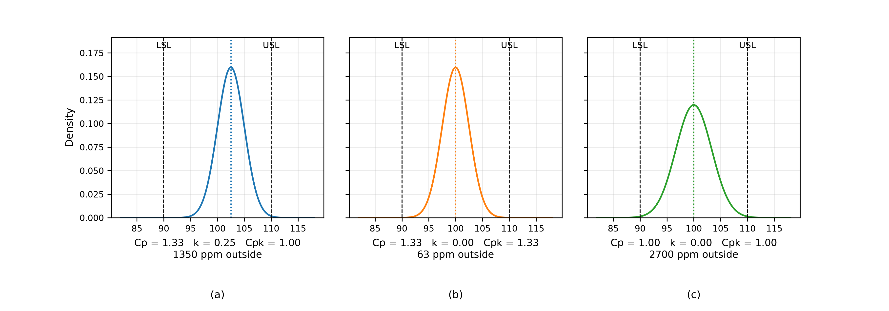

# Process Capability Indices
Rev. 3 | Created: 2026-09-04 | Updated: 2026-09-04 19:26 UTC

> A note on the three indices that compare a process against its specification: $C_p$ for the
> spread, $k$ for the centring, and $C_{pk}$ for what the two produce together.

## 1. Scope

A control chart says whether a process is stable. It says nothing about whether the process makes
acceptable product, because it is built from the process own variation and never looks at the
specification. Capability indices are the other half of that pair: they hold the process
distribution against the specification limits and return a number that says how much room is left.

This document defines $C_p$, $k$ and $C_{pk}$, gives what each one measures, shows why the three are
read together rather than singly, and sets out the assumptions under which the numbers mean
anything. Terms used without definition in the body are collected in
[Appendix A](#appendix-a-terminology).

## 2. Definitions

Throughout, the process is normal with mean $\mu$ and standard deviation $\sigma$, and the
specification has a lower limit `LSL` and an upper limit `USL`. Write $m$ for the midpoint of the
specification.

### 2.1. Potential Capability

$C_p$ compares the width the specification allows against the width the process occupies, where the
process width is taken as $6\sigma$ [[1](#ref-1)].

$$C_p = \frac{USL - LSL}{6\sigma} \hspace{19em} (1)$$

The index does not contain $\mu$. It therefore answers a question about the spread alone: if the
process were centred, how much room would there be. That is why it is called the potential
capability. A process with $C_p = 2$ occupies half the specification width and could be moved a long
way off centre before making anything out of specification; a process with $C_p = 1$ exactly fills
the specification and has no room at all.

### 2.2. Centring

$k$ measures how far the process mean sits from the middle of the specification, expressed as a
fraction of the half-width.

$$m = \frac{USL + LSL}{2}, \qquad k = \frac{\left| m - \mu \right|}{(USL - LSL)/2} \hspace{19em} (2)$$

The index runs from 0 to 1 within the specification. At $k = 0$ the process is perfectly centred, at
$k = 0.25$ the mean has moved a quarter of the way from the middle towards a limit, and at $k = 1$
the mean sits on a limit. Like $C_p$, it answers half the question: it contains no $\sigma$ and so
says nothing about how wide the process is.

### 2.3. Achieved Capability

$C_{pk}$ measures the distance from the mean to the nearer specification limit in units of
$3\sigma$, so it carries both the spread and the centring.

$$CPU = \frac{USL - \mu}{3\sigma}, \qquad CPL = \frac{\mu - LSL}{3\sigma}, \qquad C_{pk} = \min\left( CPU, CPL \right) \hspace{19em} (3)$$

The three indices are not independent. Substituting equations (1) and (2) into equation (3) gives
$C_{pk}$ as $C_p$ discounted by the centring.

$$C_{pk} = (1 - k) C_p \hspace{19em} (4)$$

Equation (4) is the whole relationship between them. $C_p$ is what the spread makes possible, $k$ is
the fraction of that potential the off-centring gives away, and $C_{pk}$ is what is left. It follows
that $C_{pk} \le C_p$ always, with equality only when the process is centred.

## 3. Physical Meaning

### 3.1. Defect Rate

Under the normal model the indices convert directly into a fraction outside the specification. For a
centred process both tails contribute and the fraction follows $C_p$; off centre, the near tail
dominates and the fraction follows $C_{pk}$.

$$p = \Phi\left( -3 CPL \right) + \Phi\left( -3 CPU \right) \hspace{19em} (5)$$

Table 1. Defect rate against index value, in parts per million.

| Index value | Sigma level | Centred, from Cp | Near tail, from Cpk |
|---:|---:|---:|---:|
| 0.67 | 2.0 | 44431 | 22216 |
| 1.00 | 3.0 | 2700 | 1350 |
| 1.33 | 4.0 | 66.1 | 33.0 |
| 1.67 | 5.0 | 0.544 | 0.272 |
| 2.00 | 6.0 | 0.00197 | 0.000987 |

The 1.33 row is why $C_p = 1.33$ became a common minimum requirement and $C_{pk} = 1.33$ a
common goal: it puts four standard deviations between the mean and the nearer limit, which leaves
room for the ordinary drift of a real process. The bottom row is the arithmetic behind the name of
the six sigma programme.

### 3.2. Reading the Three Together

No single index determines the defect rate, and Fig 1 is the demonstration.

Fig 1. Three processes against the same specification, LSL 90 and USL 110, drawn on one density
scale. The dotted line is the process mean and each panel is labelled with its indices and with the
fraction outside the specification, which is far too small an area to see at this scale.

Panels (a) and (b) have the same $C_p$ of 1.33 and differ only in centring, and that difference
costs a factor of twenty in defect rate: 1350 ppm against 63 ppm. The spread is not the problem in
(a), and grinding on the spread would be wasted work; moving the mean back to 100 turns (a) into (b)
with no change to the process variation at all.

Panels (a) and (c) are the opposite case. Both have $C_{pk} = 1.00$, yet (a) makes 1350 ppm and (c)
makes 2700 ppm, and the two call for entirely different work. In (a) the process is narrow and
misaligned, which is usually a matter of adjusting a setpoint. In (c) the process is centred and too
wide, which requires reducing the variation itself, and no amount of adjustment will help. A
$C_{pk}$ quoted on its own hides that distinction.

Table 2. What the pair of indices indicates.

| Condition | Reading | Action |
|---|---|---|
| $C_p$ high, $k$ near 0 | Capable and centred | Hold |
| $C_p$ high, $k$ large | Capable but misaligned | Move the mean |
| $C_p$ low, $k$ near 0 | Centred but too wide | Reduce the variation |
| $C_p$ low, $k$ large | Both wrong | Centre first, then reduce |

The order in the last row matters. Centring is usually a setpoint change and is cheap; reducing
variation usually means changing hardware, recipe or material and is expensive. Equation (4) says
the cheap move recovers the factor $1/(1-k)$ immediately.

## 4. Application

### 4.1. Short-Term and Long-Term

The indices are computed from an estimate of $\sigma$, and there are two of those. Estimating
$\sigma$ from within-subgroup variation captures only the causes acting over a short interval;
estimating it from all the data across a long period captures the drift between subgroups as well.
The first gives $C_p$ and $C_{pk}$, the second gives the performance indices $P_p$ and $P_{pk}$,
which are defined by the same equations (1) and (3) with the long-term estimate substituted.

Because the long-term estimate is the larger of the two, $P_{pk} \le C_{pk}$ in practice. The gap
between them is not a defect in the calculation; it is the amount of drift the process has, and a
large gap is itself the finding. Quoting one of the two without saying which was computed makes the
number unusable.

### 4.2. Assumptions

Equation (5) and Table 1 hold under conditions that a real process meets only sometimes.

- Normality: the tail areas come from the normal distribution, and a skewed or bounded
  characteristic gives a different defect rate at the same index value.
- Stability: the indices describe the next period only if the process is in control, so the control
  chart comes first and the capability study second.
- Estimation: $\mu$ and $\sigma$ are estimated, so the indices are estimates with their own
  uncertainty, which is wide at the sample sizes commonly used.
- Two-sided specification: $C_p$ needs both limits. Where only one exists, $CPU$ or $CPL$ is
  reported alone and $C_p$ and $k$ do not apply.

### 4.3. In the Fab

For semiconductor process steps the specification is usually on a measured layer property, and the
capability study runs on one measurement per wafer, most often the wafer mean. The within-wafer
spread is a separate concern with its own index, and folding it into $\sigma$ mixes two variances
that call for different action, in the same way that equation (4) separates spread from centring.

The practical use is threefold: qualifying a new process or tool against its specification, comparing
chambers that run the same recipe, and setting the sampling rate, since a step with a high $C_{pk}$
needs measuring less often than one running near its limits.

## References

[1] Kane, V. E. (1986). [Process Capability Indices](https://doi.org/10.1080/00224065.1986.11978984). *Journal of Quality Technology*, 18(1), 41–52.

[2] Montgomery, D. C. (2020). *Introduction to Statistical Quality Control* (8th ed.). Wiley.
ISBN 978-1-119-72309-7.

---

## Appendix A. Terminology

- **Capability study**: the exercise of estimating the indices from a sample of a stable process.
- **In control**: showing no control chart signal of a cause outside the ordinary variation.
- **Parts per million**: the fraction outside the specification multiplied by $10^{6}$.
- **Performance index**: a capability index computed with a long-term estimate of the standard
  deviation, written $P_p$ and $P_{pk}$.
- **Sigma level**: the distance from the mean to the nearer specification limit in standard
  deviations, equal to $3 C_{pk}$.
- **Specification limit**: a bound the product must satisfy, set by design rather than estimated
  from the process.
