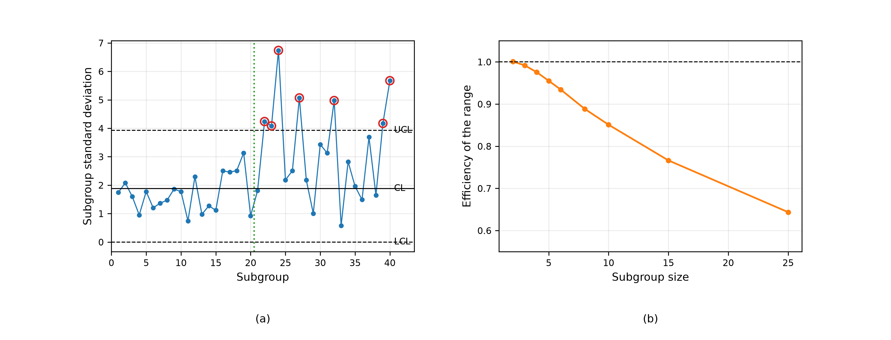

# The s Control Chart
Rev. 0 | Created: 2026-09-04 | Updated: 2026-09-04 11:45 CDT

> 부분군의 표준편차를 찍어 공정의 산포를 관리하는 s 관리도에 대한 기록. 관리한계가 어떻게 나오는지,
> 왜 $\bar{s}$ 를 그대로 쓰지 않고 $c_4$ 로 나누는지, 그리고 언제 R 관리도 대신 이것을 쓰는지를 다룬다.

## 1. Scope

공정을 관리하려면 중심과 산포를 함께 보아야 하고, 둘은 서로 다른 관리도가 맡는다. 중심은 부분군 평균을
찍는 $\bar{x}$ 관리도가 맡고, 산포는 부분군 범위를 찍는 R 관리도나 부분군 표준편차를 찍는 s 관리도가
맡는다.

이 문서는 s 관리도를 정리한다. 통계량의 정의와 그것이 치우쳐 있다는 사실, 거기서 나오는 관리한계,
R 관리도와의 비교, 그리고 $\bar{x}$ 관리도와 짝을 이룰 때의 한계를 다룬다. 본문에서 정의 없이 쓴 용어는
[Appendix A](#appendix-a-terminology) 에 모았다.

## 2. The s Statistic

### 2.1. Definition

크기 $n$ 의 부분군 하나에서 관측값을 $x_1, \ldots, x_n$, 그 평균을 $\bar{x}$ 라 할 때 찍는 통계량은
표본표준편차이다.

$$s = \sqrt{\frac{1}{n-1} \sum_{i=1}^{n} \left( x_i - \bar{x} \right)^{2}} \hspace{19em} (1)$$

분모가 $n$ 이 아니라 $n-1$ 인 것은 $s^2$ 이 $\sigma^2$ 의 불편추정량이 되게 하려는 것이다.

### 2.2. Bias and the c4 Constant

$s^2$ 이 $\sigma^2$ 의 불편추정량이라고 해서 $s$ 가 $\sigma$ 의 불편추정량이 되지는 않는다. 제곱근은
비선형이므로 기댓값이 그대로 넘어가지 않으며, 정규모집단에서 $s$ 의 기댓값은 $\sigma$ 보다 작다.

$$E[s] = c_4 \sigma, \qquad c_4 = \sqrt{\frac{2}{n-1}} \cdot \frac{\Gamma(n/2)}{\Gamma\left( (n-1)/2 \right)} \hspace{19em} (2)$$

$c_4$ 는 1 보다 작고 $n$ 이 커지면 1 로 간다. $n = 2$ 에서 0.7979 로 20 percent 나 낮고, $n = 5$ 에서
0.9400, $n = 25$ 에서 0.9896 이다. 작은 부분군에서 $\bar{s}$ 를 그대로 $\sigma$ 의 추정값으로 쓰면
산포를 그만큼 낮게 잡게 되므로, $\sigma$ 는 항상 $c_4$ 로 나누어 추정한다.

$$\hat{\sigma} = \frac{\bar{s}}{c_4} \hspace{19em} (3)$$

$s$ 의 표준편차도 $c_4$ 로 적힌다. 이것이 관리한계의 폭을 정한다.

$$\sigma_s = \sigma \sqrt{1 - c_4^{2}} \hspace{19em} (4)$$

## 3. Control Limits

관리한계는 식 (1) 의 통계량에 대해 중심에서 3 표준편차 떨어진 자리이며, 식 (2) 와 식 (4) 를 넣으면
$\sigma$ 로 쓸 수 있다.

$$UCL = \left( c_4 + 3\sqrt{1 - c_4^{2}} \right) \sigma, \qquad LCL = \left( c_4 - 3\sqrt{1 - c_4^{2}} \right) \sigma \hspace{19em} (5)$$

실무에서는 $\sigma$ 를 모르므로 식 (3) 으로 바꾸어 쓴다. 그러면 한계가 $\bar{s}$ 의 배수가 되고, 그
배수가 관리도표의 $B_3$ 와 $B_4$ 이다.

$$UCL = B_4 \bar{s}, \qquad CL = \bar{s}, \qquad LCL = B_3 \bar{s}, \qquad B_{3,4} = 1 \mp \frac{3}{c_4}\sqrt{1 - c_4^{2}} \hspace{19em} (6)$$

$B_3$ 는 $n \le 5$ 에서 음수가 되는데, 표준편차는 음수가 될 수 없으므로 0 으로 자른다. 그 결과 작은
부분군의 s 관리도에는 아래 한계가 없고, 산포가 줄어드는 쪽의 변화는 신호로 잡히지 않는다. 산포가
줄어드는 것은 대개 반가운 일이지만 측정계의 고장일 수도 있으므로, 이 눈먼 구간이 있다는 것은 알고
있어야 한다.

Table 1. Chart constants by subgroup size.

| n | c4 | B3 | B4 | A3 |
|---:|---:|---:|---:|---:|
| 2 | 0.7979 | 0.000 | 3.267 | 2.659 |
| 3 | 0.8862 | 0.000 | 2.568 | 1.954 |
| 4 | 0.9213 | 0.000 | 2.266 | 1.628 |
| 5 | 0.9400 | 0.000 | 2.089 | 1.427 |
| 6 | 0.9515 | 0.030 | 1.970 | 1.287 |
| 7 | 0.9594 | 0.118 | 1.882 | 1.182 |
| 8 | 0.9650 | 0.185 | 1.815 | 1.099 |
| 9 | 0.9693 | 0.239 | 1.761 | 1.032 |
| 10 | 0.9727 | 0.284 | 1.716 | 0.975 |
| 15 | 0.9823 | 0.428 | 1.572 | 0.789 |
| 20 | 0.9869 | 0.510 | 1.490 | 0.680 |
| 25 | 0.9896 | 0.565 | 1.435 | 0.606 |

## 4. Comparison with the R Chart

R 관리도는 부분군의 최댓값과 최솟값만 읽고 s 관리도는 모든 관측값을 읽는다. 계산기가 없던 시절에는
그 차이가 결정적이어서 R 관리도가 표준이었고, 지금 남은 이유는 계산이 아니라 현장에서 눈으로 따라가기
쉽다는 데 있다.

Fig 1. An s chart of 40 subgroups of five, with the process standard deviation doubling at the
dotted line (a), and the efficiency of the range estimator of sigma relative to the s estimator
against subgroup size (b). Circled points fall outside the limits.

Fig 1 (b) 가 둘의 차이를 수로 보여 준다. 여기서 효율은 두 추정량의 분산비이며, 1 이면 같은 정보를
담는다는 뜻이다. $n = 2$ 에서는 범위와 표준편차가 사실상 같은 값이라 효율이 1 이고, $n = 5$ 에서 0.955,
$n = 10$ 에서 0.851, $n = 25$ 에서 0.644 로 떨어진다. 부분군이 커질수록 범위는 가운데 관측값을 버리는
대가를 치르는 것이다.

Table 2. Efficiency of the range estimator relative to the s estimator, estimated from 400,000
simulated subgroups at each size.

| n | Efficiency |
|---:|---:|
| 2 | 1.001 |
| 3 | 0.992 |
| 4 | 0.976 |
| 5 | 0.955 |
| 6 | 0.934 |
| 8 | 0.889 |
| 10 | 0.851 |
| 15 | 0.766 |
| 25 | 0.644 |

여기서 통상의 기준이 나온다. $n \le 10$ 이면 손실이 15 percent 안쪽이라 R 관리도를 써도 되고,
$n \gt 10$ 이면 s 관리도를 쓴다. 부분군 크기가 일정하지 않을 때도 s 관리도를 쓰는데, 범위는 부분군
크기가 다르면 서로 비교할 수 없는 반면 $s$ 는 이미 $n$ 으로 나누어져 있기 때문이다.

## 5. The xbar and s Pair

$\bar{x}$ 관리도의 한계도 산포 추정값에서 나오고, s 관리도를 쓸 때는 그 추정값이 식 (3) 이다. 이를
넣어 정리하면 배수 $A_3$ 이 나온다.

$$UCL = \bar{\bar{x}} + A_3 \bar{s}, \qquad LCL = \bar{\bar{x}} - A_3 \bar{s}, \qquad A_3 = \frac{3}{c_4 \sqrt{n}} \hspace{19em} (7)$$

읽는 순서는 정해져 있다. s 관리도를 먼저 보고 산포가 관리 상태임을 확인한 뒤에 $\bar{x}$ 관리도를
본다. 산포가 관리 상태가 아니면 $\bar{s}$ 가 무엇을 추정하는지 알 수 없고, 식 (7) 의 한계 자체가 근거를
잃기 때문이다.

## 6. Application

Fig 1 (a) 는 $n = 5$, $\sigma = 2$ 인 공정에서 21 번째 부분군부터 표준편차가 두 배가 된 경우이다.
$c_4 = 0.9400$ 이므로 $CL = 1.880$, $UCL = 3.927$ 이고 $B_3 = 0$ 이라 아래 한계는 없다. 관리도는 22 번
부분군에서 처음 신호를 냈다.

산포가 커지는 변화는 중심이 옮겨가는 변화보다 알아채기 어렵다. 그림에서도 표준편차가 두 배가 된 뒤
20 개 부분군 가운데 신호를 낸 것은 일곱 개뿐이다. 나머지 열셋은 한계 안에 있었고, 그 각각만 보면
정상으로 읽힌다. 산포 변화를 s 관리도 하나로 잡으려 하지 않고 여러 점의 무늬로 함께 읽어야 하는 이유가
여기에 있다.

반도체 공정에서 s 관리도가 놓이는 자리는 웨이퍼 안의 산포이다. 웨이퍼마다 여러 점을 측정하므로 부분군이
자연히 만들어지고, 그 표준편차가 웨이퍼 내 균일도를 그대로 나타낸다. 측정점 수가 recipe 마다 다른 것도
흔하므로, 부분군 크기가 달라도 쓸 수 있다는 section 4 의 성질이 여기서 실질적인 이유가 된다.

## References

[1] Montgomery, D. C. (2020). *Introduction to Statistical Quality Control* (8th ed.). Wiley.
ISBN 978-1-119-72309-7.

[2] Shewhart, W. A. (1931). *Economic Control of Quality of Manufactured Product*. Van Nostrand.
ASQ 50th anniversary reissue, ISBN 978-0-87389-076-2.

---

## Appendix A. Terminology

- **Chart constant**: 관리한계를 통계량의 평균에 대한 배수로 적기 위해 부분군 크기마다 표로 주어지는
  수이며, $B_3$, $B_4$, $A_3$ 가 그것이다.
- **Control limit**: 공정 자료에서 추정한, 관리도의 위아래 경계.
- **In control**: 관리도에 이상원인의 신호가 없는 상태.
- **Subgroup**: 한 시점에서 함께 뽑아 하나의 통계량으로 요약하는 관측값의 묶음.
- **Unbiased estimator**: 기댓값이 추정 대상과 같은 추정량.
