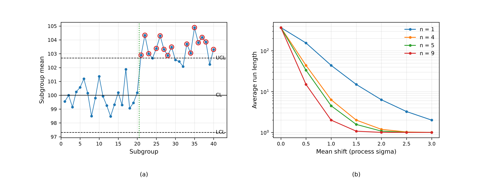

# The Shewhart Control Chart
Rev. 1 | Created: 2026-09-04 | Updated: 2026-09-04 20:10 UTC

> 공정의 변동을 우연원인과 이상원인으로 갈라내기 위한 관리도에 대한 기록. 관리한계가 어떻게 정해지고
> 왜 3 sigma 인지, 어떤 종류가 있고 이상을 얼마나 빨리 잡아내는지를 다룬다.

## 1. Scope

모든 공정은 변동한다. Shewhart 가 세운 구분은 그 변동을 두 갈래로 나눈 것이다 [[1](#ref-1)]. 하나는
공정에 늘 있는 수많은 작은 원인들이 만드는 우연원인 (common cause) 변동이고, 다른 하나는 특정할 수
있는 사건이 만드는 이상원인 (special cause) 변동이다. 앞의 것은 공정의 성질이므로 손대려면 공정
자체를 바꿔야 하고, 뒤의 것은 찾아서 제거해야 한다. 둘을 뒤바꾸어 다루면 공정은 나빠진다. 우연원인에
반응해 설정을 건드리면 변동이 오히려 커지고, 이상원인을 우연으로 넘기면 원인이 남는다.

관리도는 그 구분을 자료로 내리기 위한 도구이다. 이 문서는 관리도의 구성과 관리한계의 근거, 대표적인
종류, 그리고 이상을 잡아내는 속도를 정리한다. 본문에서 정의 없이 쓴 용어는
[Appendix A](#appendix-a-terminology) 에 모았다.

## 2. Chart Structure

### 2.1. Centre Line and Control Limits

관리도는 시간 순으로 뽑은 표본에서 통계량 하나를 계산해 차례로 찍고, 중심선 (CL) 과 위아래
관리한계 (UCL, LCL) 를 함께 그린다. 통계량을 $W$, 그 기댓값을 $\mu_W$, 표준편차를 $\sigma_W$ 라 하면
한계는 다음과 같다.

$$UCL = \mu_W + L\sigma_W, \qquad CL = \mu_W, \qquad LCL = \mu_W - L\sigma_W \hspace{19em} (1)$$

$L$ 은 한계를 중심에서 몇 표준편차만큼 떨어뜨릴지 정하는 수이며 관례상 3 이다. 크기 $n$ 의 부분군
평균을 찍는 $\bar{x}$ 관리도에서 $\sigma_W$ 는 표본평균의 표준편차이므로, 공정 표준편차 $\sigma$ 를
$\sqrt{n}$ 으로 나눈 값이 된다.

$$UCL = \mu + \frac{3\sigma}{\sqrt{n}}, \qquad LCL = \mu - \frac{3\sigma}{\sqrt{n}} \hspace{19em} (2)$$

여기서 $\mu$ 와 $\sigma$ 는 규격이 아니라 공정이 안정된 기간의 자료에서 추정한 값이다. 이 점이 관리도를
규격 검사와 가르는 지점이다. 관리한계는 공정이 실제로 무엇을 하고 있는지를 말하고, 규격한계는 제품이
무엇을 해야 하는지를 말한다. 둘은 같은 그림에 함께 그리지 않는다.

### 2.2. Why Three Sigma

$L = 3$ 은 통계적 최적화의 결과가 아니라 두 종류의 오류를 맞바꾼 공학적 선택이다. 공정이 정상인데
점이 한계 밖으로 나가면 헛경보이고, 공정이 변했는데 점이 한계 안에 있으면 놓친 것이다. 한계를 좁히면
헛경보가 늘고 넓히면 놓침이 는다.

정규분포를 가정하면 정상 상태에서 한 점이 한계 밖에 놓일 확률 $\alpha$ 와, 헛경보가 날 때까지 찍는
평균 점 개수인 $ARL_0$ 이 정해진다.

$$\alpha = 2\left[ 1 - \Phi(L) \right], \qquad ARL_0 = \frac{1}{\alpha} \hspace{19em} (3)$$

$L = 3$ 에서 $\alpha = 0.0027$ 이고 $ARL_0 = 370.4$ 이다. 정상 공정에서 평균 370 점마다 한 번 헛경보가
난다는 뜻이며, 하루 수십 점을 찍는 현장에서 이 정도면 조사할 만하다고 본 것이 3 이라는 수의 근거이다.
$L = 2$ 로 좁히면 $ARL_0$ 이 22 로 떨어져 헛경보가 실무를 마비시키고, $L = 3.5$ 로 넓히면 2149 가 되어
웬만한 변화를 놓친다.

## 3. Chart Types

관리도는 찍는 통계량에 따라 나뉘고, 자료가 계량형인지 계수형인지가 그 갈래를 정한다.

Table 1. Chart types by the statistic plotted.

| Chart | Statistic | Data type | Typical use |
|---|---|---|---|
| $\bar{x}$ | 부분군 평균 | 계량형 | 공정 중심의 이동 |
| $R$ | 부분군 범위 | 계량형 | 산포, $n \le 10$ |
| $s$ | 부분군 표준편차 | 계량형 | 산포, $n \gt 10$ |
| $I$-$MR$ | 개별값과 이동범위 | 계량형 | 부분군을 만들 수 없을 때 |
| $p$, $np$ | 불량률, 불량 개수 | 계수형 | 합격 여부로 판정하는 항목 |
| $c$, $u$ | 결점 수, 단위당 결점 수 | 계수형 | 한 단위에 결점이 여럿일 때 |

중심과 산포는 반드시 짝으로 본다. $\bar{x}$ 관리도만 보면 산포가 커지는 것을 놓치고, 산포 관리도만
보면 중심이 흐르는 것을 놓친다. 또한 $\bar{x}$ 관리도의 한계는 식 (2) 처럼 산포 추정값에서 나오므로,
산포가 관리 상태가 아니면 $\bar{x}$ 관리도의 한계 자체가 믿을 것이 못 된다. 그래서 두 관리도를 함께
읽되 산포 쪽을 먼저 읽는다.

## 4. Detection Performance

### 4.1. Average Run Length

공정 평균이 $\delta\sigma$ 만큼 옮겨 그대로 머물렀다고 하자. 부분군 평균은 그 관리도의 단위로
$\delta\sqrt{n}$ 만큼 옮겨간 것이므로, 다음 한 점이 한계 밖에 놓일 확률은 옮겨간 중심에서 두 꼬리를
더한 값이다.

$$P = \Phi\left( \delta\sqrt{n} - L \right) + \Phi\left( -\delta\sqrt{n} - L \right), \qquad ARL_1 = \frac{1}{P} \hspace{19em} (4)$$

Fig 1. An xbar chart of 40 subgroups of five, with the process mean stepping up by 1.5 sigma at the
dotted line (a), and the average run length against the size of a sustained shift (b). Circled
points fall outside the limits.

Fig 1 (a) 는 $n = 5$, $\mu = 100$, $\sigma = 2$ 인 공정에서 21 번째 부분군부터 평균이 $1.5\sigma$ 만큼
올라간 경우이다. 한계는 $UCL = 102.683$, $LCL = 97.317$ 이고, 관리도는 옮겨간 첫 부분군인 21 번에서
바로 신호를 냈다.

Table 2. Average run length to a signal, by shift size and subgroup size.

| Shift (sigma) | n = 1 | n = 4 | n = 5 | n = 9 |
|---:|---:|---:|---:|---:|
| 0.0 | 370.40 | 370.40 | 370.40 | 370.40 |
| 0.5 | 155.22 | 43.89 | 33.40 | 14.97 |
| 1.0 | 43.89 | 6.30 | 4.50 | 2.00 |
| 1.5 | 14.97 | 2.00 | 1.57 | 1.07 |
| 2.0 | 6.30 | 1.19 | 1.08 | 1.00 |
| 2.5 | 3.24 | 1.02 | 1.00 | 1.00 |
| 3.0 | 2.00 | 1.00 | 1.00 | 1.00 |

Table 2 가 관리도의 성격을 요약한다. 큰 변화는 거의 즉시 잡히지만 작은 변화는 오래 걸린다. $n = 5$
에서 $1.5\sigma$ 는 평균 1.57 점 만에 잡히는 반면 $0.5\sigma$ 는 33.4 점이 걸린다. 부분군을 키우면 그
시간이 줄어드는데, 식 (4) 의 $\sqrt{n}$ 때문이다. 작은 이동을 빨리 잡아야 하면 부분군을 키우거나,
과거 점을 누적해 쓰는 다른 관리도로 가야 한다. Shewhart 관리도는 마지막 한 점만 보기 때문이다.

### 4.2. Run Rules

한 점이 한계를 벗어나는 것만 보면 작은 이동을 놓치므로, 중심선 양쪽을 1, 2, 3 sigma 로 나눈 구역에
연속된 점의 무늬로 판정하는 규칙을 함께 쓴다 [[2](#ref-2)]. 규칙 넷은 다음과 같으며, 두 번째와
세 번째에서 벗어난 점들은 모두 중심선의 같은 쪽에 있어야 한다.

- 한 점이 3 sigma 밖.
- 연속 3 점 중 2 점이 2 sigma 밖, 같은 쪽.
- 연속 5 점 중 4 점이 1 sigma 밖, 같은 쪽.
- 연속 8 점 또는 9 점이 중심선의 같은 쪽.

여기에 연속 6 점이 한 방향으로 증가하거나 감소하는 추세 규칙을 얹는 경우가 많은데, 그것은 위의 네
규칙에 속하지 않는 별도의 추가이다.

규칙을 더할수록 작은 이동은 빨리 잡히지만 헛경보도 함께 는다. 규칙마다 각자의 $\alpha$ 가 있고 그것이
합쳐지므로, 위의 규칙 넷을 함께 쓰면 정상 공정의 $ARL_0$ 이 370 에서 100 안팎까지 내려간다. 정확한
값은 규칙을 어떻게 정의하느냐에 따라 (연속 8 점인지 9 점인지 같은 차이로) 달라지지만, 3 분의 1
수준으로 떨어진다는 점은 달라지지 않는다. 규칙은 공짜로 민감도를 주지 않으며, 몇 개를 쓸지는 헛경보를
조사하는 비용으로 정한다.

## 5. Control and Capability

관리 상태 (in control) 와 공정능력은 다른 것이다. 관리 상태는 공정이 자기 자신에 대해 안정하다는
뜻이고, 공정능력은 그 안정된 공정이 규격을 만족한다는 뜻이다. 네 조합이 모두 가능하다. 관리 상태이면서
규격을 못 맞추는 공정은 우연원인 변동 자체가 규격보다 큰 것이므로 공정을 바꿔야 하고, 관리 상태가
아니면서 규격은 맞는 공정은 지금 운이 좋을 뿐이다.

순서는 정해져 있다. 관리도로 이상원인을 먼저 제거해 공정을 안정시키고, 그 다음에 공정능력을 따진다.
안정되지 않은 공정에서 계산한 능력 지수는 그 다음 기간을 예측하지 못하기 때문이다.

## 6. Application

반도체 공정에서 관리도가 놓이는 자리는 공정 결과와 장비 상태 두 곳이다. 공정 결과 쪽은 웨이퍼마다
측정한 두께·깊이·선폭의 평균과 산포를 찍고, 장비 상태 쪽은 챔버 압력·유량·전력 같은 값을 찍는다.
전자는 문제가 제품에 이미 나타난 뒤에 보이고 후자는 그 전에 보이므로, 둘을 함께 두어야 원인에 먼저
닿는다.

현장에서 관리도가 잘 듣지 않는 경우는 대개 통계가 아니라 부분군을 잘못 잡은 데서 온다. 부분군은 그
안에 우연원인만 들어가도록 뽑아야 한다. 서로 다른 챔버의 웨이퍼를 한 부분군으로 묶으면 챔버 차이가
부분군 안의 산포로 들어가 관리한계가 넓어지고, 관리도는 아무것도 잡지 못하게 된다. 챔버마다 따로
관리도를 두는 것이 이 문제의 통상적인 해법이다.

## References

[1] Shewhart, W. A. (1931). *Economic Control of Quality of Manufactured Product*. Van Nostrand.
ASQ 50th anniversary reissue, ISBN 978-0-87389-076-2. 

[2] Western Electric Company (1956). *Statistical Quality Control Handbook*. Western Electric,
Indianapolis. 

[3] Montgomery, D. C. (2020). *Introduction to Statistical Quality Control* (8th ed.). Wiley.
ISBN 978-1-119-72309-7.

---

## Appendix A. Terminology

- **Average run length**: 관리도가 신호를 낼 때까지 찍는 점 개수의 기댓값이며, 정상 상태의 값을
  $ARL_0$, 변화가 있을 때의 값을 $ARL_1$ 로 적는다.
- **Common cause**: 공정에 늘 존재하는 다수의 작은 원인이 만드는 변동.
- **Control limit**: 공정 자료에서 추정한, 관리도의 위아래 경계.
- **In control**: 관리도에 이상원인의 신호가 없는 상태.
- **Rational subgroup**: 그 안에 우연원인만 들어가도록 뽑은 표본.
- **Special cause**: 특정할 수 있는 사건이 만드는 변동.
- **Specification limit**: 제품이 만족해야 하는, 설계에서 정한 경계.
