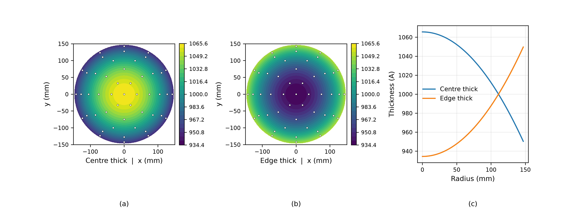

# The Wafer Uniformity Index (Korean)
Rev. 4 | Created: 2026-09-04 | Updated: 2026-09-04 20:10 UTC

> 반도체 공정 관리에서 층이 웨이퍼 위에서 얼마나 변하는지를 하나의 수로 요약하는 지표에 대한 기록.
> 표준 산출 방식 두 가지, 그 수가 담는 것과 담지 못하는 것, 그리고 증착·식각·CMP 에서의 쓰임을 다룬다.

## 1. Scope

공정은 웨이퍼의 모든 자리에 어떤 양을 남기고, 그 값이 어디서나 같은 공정은 없다. 증착은 두께를,
식각은 깊이를, CMP 는 남은 두께를, 이온주입은 면저항을 남긴다. 어느 경우든 웨이퍼를 정해진 자리에서
측정하고 그 지도 전체를 하나의 수로 줄여야 한다. 규격에 담을 수 있는 것도, 관리도에 찍을 수 있는 것도
수 하나이기 때문이다.

그 수가 uniformity index 이다. 이 문서는 산업 현장에서 쓰는 두 가지 정의와 각각이 물리적으로 무엇을
재는지, 둘 다 보지 못하는 것이 무엇인지, 그리고 이 지표가 공정 관리에 어떻게 들어가는지를 정리한다.
본문에서 정의 없이 쓴 용어는 [Appendix A](#appendix-a-terminology) 에 모았다.

## 2. Measurement Basis

### 2.1. Measurement Pattern and Edge Exclusion

이 지표는 정해진 측정 자리에서 계산하며, 반지름 방향이 고르게 뽑히도록 동심원 위에 배치하는 것이
보통이다. 흔히 쓰는 것은 9, 13, 25, 49, 121 점이다. 웨이퍼 가장자리에서 몇 밀리미터 안쪽은 측정에서
빼는데 보통 3 mm 이며, 가장자리에는 반송 중 생긴 손상과 급격한 공정 저하가 있어 그대로 두면 그 값이
지표를 지배하기 때문이다.

측정 배치와 가장자리 제외 폭은 정의의 일부이지 부수적인 것이 아니다. 같은 웨이퍼를 9 점으로 재는
것과 49 점으로 재는 것은 서로 다른 지표를 주며, 그 크기는 section 4.2 에 있다.

### 2.2. What the Index Normalises

아래의 모든 정의는 산포를 재는 양을 같은 측정값의 평균으로 나눈다. 그 나눗셈이 지표를 무차원으로
만들고, 그래서 목표 두께가 달라도 층이 달라도 장비가 달라도 비교할 수 있게 한다. 30 Å 의 산포는
300 Å 막에서와 3000 Å 막에서 뜻이 다른데, 비율이 그 차이를 없앤다.

이름은 이 수가 하는 일과 반대이다. 지표가 클수록 덜 균일한 웨이퍼이므로, uniformity 라 부르면서
재는 것은 non-uniformity 이다. 어떤 계측 장비는 대신 $100 - \mathrm{NU}$ 를 표시하는데, 보고된 수는
그것을 만든 규약과 함께여야만 해석된다는 뜻이다.

## 3. Standard Definitions

### 3.1. Range Method

Range 방법은 측정값 중 최댓값과 최솟값, 그리고 전체의 평균을 쓴다.

$$\mathrm{NU}_{\mathrm{range}} = \frac{Max - Min}{2 \times Mean} \times 100 \hspace{19em} (1)$$

분모의 2 가 이 지표를 반범위로 만들며, 그래서 플러스마이너스 진술로 읽힌다. 양극단이 평균을 두고
대칭이라면 모든 측정값이 $Mean \times (1 \pm \mathrm{NU}/100)$ 안에 든다는 뜻이다. 변형이 둘 더
쓰인다. $2 \times Mean$ 대신 $Max + Min$ 으로 나누면 양극단의 비대칭만큼의 차이로 같은 값이 나오지만,
2 를 빼면 값이 두 배가 된다. 그러므로 어떤 식으로 구했는지 밝히지 않은 수는 두 배만큼 모호하다.

이 방법의 장점 하나와 단점 하나는 같은 자리에서 나온다. 측정값 중 둘만 읽으므로 계산이 빠르고
설명하기 쉽다. 그리고 측정값 중 둘만 읽으므로 나쁜 자리 하나, 파티클 하나, 계측 오독 하나가 지표
전체를 움직인다.

### 3.2. Standard Deviation Method

Standard deviation 방법은 양극단이 아니라 모든 측정값의 산포를 쓴다.

$$\mathrm{NU}_{1\sigma} = \frac{\sigma}{Mean} \times 100, \qquad \mathrm{NU}_{3\sigma} = \frac{3\sigma}{Mean} \times 100 \hspace{19em} (2)$$

$1\sigma$ 형태는 측정 자리들의 coefficient of variation 이다. $3\sigma$ 형태는 같은 양에 배수를 준
것으로, 측정값이 정규분포를 따른다면 그중 약 99.7 percent 가 드는 구간을 재며, critical dimension 의
균일도에 흔히 쓰이는 형태이다. $\sigma$ 를 분모 $n-1$ 의 표본표준편차로 잡을지 분모 $n$ 의 모집단
형태로 잡을지도 값을 바꾸는 또 하나의 규약이며, $n = 49$ 에서 자기 값의 1 percent, 작은 $n$ 에서는 그
이상 차이가 난다.

Table 1. The two standard definitions compared.

| Aspect | Range method | Standard deviation method |
|---|---|---|
| Reads | 측정값 둘 | 모든 측정값 |
| Sensitive to one outlier | 크게 받음 | 거의 받지 않음 |
| Grows with the point count | 그렇다 | 아니다 |
| Sampling distribution | 간단한 닫힌 형태가 없음 | 표본분산에서 나오는 chi-squared |
| Typical use | 빠른 장비 점검, 입고 보고 | SPC charting, 공정능력 분석 |

### 3.3. Choosing Between Them

두 지표는 같은 물리량을 재며, 얌전한 웨이퍼에서는 서로를 따라간다. 정규분포에서 뽑은 $n$ 개의
측정값에서 범위의 기댓값은 표준편차의 $d_2(n)$ 배이고 $d_2$ 는 관리도 상수이므로 [[3](#ref-3)], 두
지표는 측정점 개수를 매개로 이어진다.

$$\mathrm{NU}_{\mathrm{range}} \approx \frac{d_2(n)}{2} \times \mathrm{NU}_{1\sigma} \hspace{19em} (3)$$

이 관계는 웨이퍼에 공간적 무늬가 없을 때, 곧 자리마다의 변동이 무작위일 때만 성립한다. 반지름
방향의 추세가 뚜렷한 웨이퍼는 양극단이 구성상 중심과 가장자리에 놓이므로, 범위는 흩어짐이 아니라 그
추세를 반영하게 된다.

## 4. Physical Meaning

### 4.1. What the Index Cannot See

이 지표는 산포의 요약이다. 변동이 웨이퍼의 어디에 있는지는 담지 않으며, 공정 무늬가 정반대인 두
웨이퍼가 같은 수를 낼 수 있다.

Fig 1. A centre-thick wafer (a) and an edge-thick wafer (b) with the radial profile of each (c). The
colour scale is thickness in angstrom, the dots are the 49 measurement sites, and both wafers have a
mean of 1000 Å, a standard deviation of 36.05 Å, a range index of 5.415 percent and a one-sigma
index of 3.605 percent.

Fig 1 의 두 웨이퍼는 section 3 의 어떤 정의로도 구분되지 않지만, 필요한 조치는 정반대이다. 중심이
두꺼운 증착은 중심의 전구체를 줄이거나 가장자리를 늘려야 하고, 가장자리가 두꺼운 쪽은 그 반대이다.
지표는 무언가 잘못되었다는 것과 그 크기를 말할 뿐 무엇이 잘못되었는지는 말하지 않는다. 균일도 수치를
등고선 지도나 반지름 방향 추세와 함께 보고하고 그것만 따로 두지 않는 이유가 여기에 있다.

이 지표는 진단에서는 갈라야 할 원인들을 섞어 놓기도 한다. 측정된 산포에는 실제 공정 무늬, 자리마다의
공정 무작위성, 그리고 계측 장비의 반복성이 함께 들어 있으며, 이들은 분산으로 더해진다.

$$\sigma_{\mathrm{measured}}^{2} = \sigma_{\mathrm{process}}^{2} + \sigma_{\mathrm{metrology}}^{2} \hspace{19em} (4)$$

계측 항이 공정 항에 견주어 작지 않으면, 보고된 non-uniformity 의 일부는 웨이퍼가 아니라 측정의
몫이며 공정을 개선해도 그만큼은 움직이지 않는다.

### 4.2. Dependence on the Point Count

식 (3) 에는 현장에서 놓치기 쉬운 결과가 하나 딸려 있다. 공정이 전혀 달라지지 않아도 measurement
site 를 늘리면 range 지표가 커진다. 같은 분포에서 더 많이 뽑을수록 극단값이 섞일 가능성이 높기
때문이다.

Table 2. Half-range index of a wafer whose one-sigma index is exactly 1 percent, by point count.

| Points | Expected range in sigma | Half-range index |
|---:|---:|---:|
| 5 | 2.324 | 1.162 |
| 9 | 2.971 | 1.485 |
| 13 | 3.336 | 1.668 |
| 17 | 3.588 | 1.794 |
| 21 | 3.779 | 1.889 |
| 25 | 3.932 | 1.966 |
| 49 | 4.483 | 2.241 |
| 121 | 5.149 | 2.575 |

같은 웨이퍼가 9 점에서는 1.49 percent, 49 점에서는 2.24 percent 로 나온다. 물리적 이유 없이 절반이
더 붙는 것이다. 그러므로 측정 recipe 가 다른 range 기반 수치는 서로 비교할 수 없고, 측정점을 늘리는
recipe 변경은 range 관리도에서는 공정 악화처럼 보이고 sigma 관리도에서는 아무 일도 아닌 것으로 보인다.
$1\sigma$ 지표에는 이런 성질이 없다. 표본표준편차는 어떤 $n$ 에서도 같은 모집단 값을 추정하기
때문이다.

## 5. Application

### 5.1. Process Steps

Table 3. The index by process step.

| Step | Measured quantity | Common form |
|---|---|---|
| Deposition | 막 두께 | Range 또는 $1\sigma$ |
| Etch | 식각 깊이, 남은 두께 | Range 또는 $1\sigma$ |
| CMP | 제거율, 남은 두께 | $1\sigma$, within-wafer non-uniformity 로 |
| Implant | 면저항 | $1\sigma$ |
| Lithography | Critical dimension | $3\sigma$ |

물리적 원인은 공정마다 다르고 저마다 고유한 반지름 방향 무늬를 가진다. 증착의 균일도는 가스 유량과
showerhead 설계, 기판 온도를 따르고, 식각은 plasma 밀도와 온도를 따른다. CMP 는 pad 압력과 slurry
분포를 따르며, 그 within-wafer non-uniformity 가 문헌에서 가장 깊이 분석된 항이다 [[1](#ref-1)],
[[2](#ref-2)]. 어느 경우든 관측되는 것은 지표이고 진단이 되는 것은 무늬이다.

### 5.2. Use in Process Control

이 지표 자체가 웨이퍼마다 하나씩 계산되는 통계량이므로, 다른 측정값과 똑같이 웨이퍼와 lot 을 따라
관리도에 찍을 수 있다. 위치가 아니라 산포의 통계량이므로, 어울리는 관리도는 평균을 위해 만들어진 것이
아니라 표준편차를 위해 만들어진 것이다.

이것을 관리도에 찍는 일은 더 큰 분산 예산 가운데 한 항만 집어내는 일이기도 하다. Lot 전체 측정값의
총 변동은 웨이퍼 안의 몫과 웨이퍼 사이의 몫으로 갈라지는데, uniformity index 는 앞의 것만 따라간다.

$$\sigma_{\mathrm{total}}^{2} = \sigma_{\mathrm{within}}^{2} + \sigma_{\mathrm{between}}^{2} \hspace{19em} (5)$$

Uniformity index 가 작고 안정적인 공정도 두 번째 항을 통해 관리 이탈일 수 있다. 챔버 사이의 차이나
lot 사이의 흐름이 그것이다. 이 지표는 필요한 통계량이지 충분한 통계량이 아니며, 웨이퍼 평균 관리도를
대신하는 자리가 아니라 그 옆자리에 놓인다.

### 5.3. Reporting

이 수의 많은 부분이 웨이퍼가 아니라 규약에 달려 있으므로, 보고하는 균일도 값에는 아래가 함께
붙어야 한다. 그렇지 않으면 무엇과도 비교할 수 없다.

- 산출식: range 인지 standard deviation 인지, $1\sigma$ 인지 $3\sigma$ 인지, 2 를 나누었는지.
- 측정 배치: 측정 자리의 개수와 그 배열.
- Edge exclusion: 제외한 가장자리 띠의 폭.
- 표준편차의 분모: $n$ 인지 $n-1$ 인지.
- 계측 장비와 그 반복성. 식 (4) 를 읽으려면 필요하다.

## References

[1] Davis, J. C., Sherer, J. M., Poole, S. J., & Loewenstein, L. M. (1996). [A Robust Metric for
Measuring Within-Wafer Uniformity](https://doi.org/10.1109/3476.558556). *IEEE Transactions on Components, Packaging, and Manufacturing
Technology — Part C*, 19(4), 283–289. 

[2] [A Study of Within-Wafer Non-Uniformity Metrics](https://ieeexplore.ieee.org/document/773193).
*1999 4th International Workshop on Statistical Metrology*. 

[3] Montgomery, D. C. (2020). *Introduction to Statistical Quality Control* (8th ed.). Wiley.
ISBN 978-1-119-72309-7.

---

## Appendix A. Terminology

- **Coefficient of variation**: 표준편차를 평균으로 나눈 값이며, 식 (2) 가 백분율로 표시하는 양.
- **Critical dimension**: 인쇄된 형상의 폭이며, lithography 가 관리하는 양.
- **Edge exclusion**: 측정 자리를 두지 않는 웨이퍼 가장자리의 띠.
- **Measurement site**: 공정 결과를 측정하는 웨이퍼 위의 한 자리.
- **NU**: non-uniformity 이며, 식 (1) 부터 식 (3) 까지가 지표를 가리키는 데 쓰는 기호.
- **Radial signature**: 측정량이 웨이퍼 중심으로부터의 거리에 체계적으로 의존하는 것.
- **Repeatability**: 변하지 않은 한 자리를 되풀이해 측정할 때 계측 장비가 내놓는 산포.
- **Within-wafer non-uniformity**: 웨이퍼 하나의 측정 자리들에 대해 계산한 uniformity index 이며,
  웨이퍼 사이의 변동과 구별된다.
