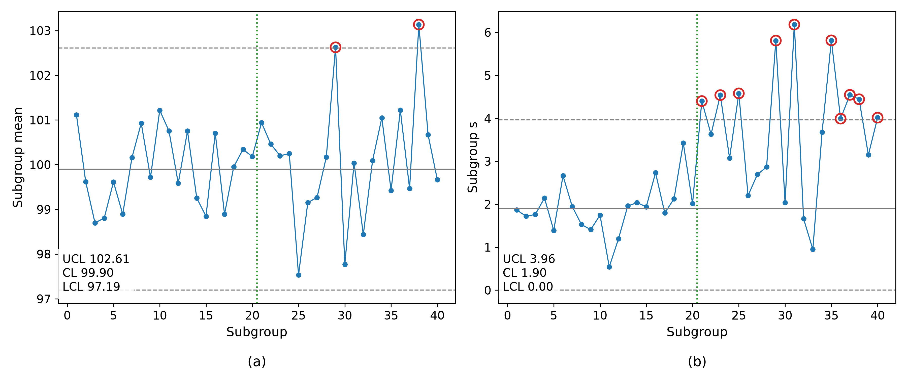
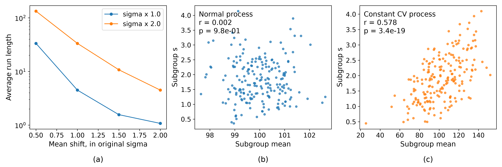

# The xbar-s Control Chart
Rev. 9 | Created: 2026-09-05 | Updated: 2026-09-05 08:29 CDT

> 부분군의 평균과 표준편차를 두 장으로 함께 관리하는 xbar-s 관리도에 대한 기록. 두 관리도가 서로에게
> 무엇을 하는지, 산포가 평균에 닿는 경로를 어떻게 가려내는지, 그리고 평균이 그대로인 채 산포만 커진
> 경우를 이상으로 볼 것인지를 다룬다.

## 1. Scope

공정의 상태는 한 수로 요약되지 않는다. 분포의 중심이 어디에 있는지와 그 분포가 얼마나 넓은지는 서로
다른 질문이고, 원인도 대응도 다르다. xbar-s 관리도는 그 둘을 두 장의 관리도로 나누어 같은 부분군에서
동시에 읽는 방법이다.

이 쌍이 필요한 이유는 평균이 그대로인 채 산포만 갑자기 커지는 경우에서 가장 잘 드러난다. 제품은 아직
규격 안에 있고 평균 관리도는 조용하므로 넘어가기 쉬운데, 이때 물어야 할 것은 규격을 벗어났는가가 아니라
공정이 어제와 같은가이다. Excursion 의 선언은 규격이 아니라 관리도에서 나오므로, 규격 안에 있는 공정도
선언 대상이 된다. 그 판정을 [Appendix C](#appendix-c-case-study) 가 한 사례로 다룬다.

이 문서는 그 쌍을 정리한다. 두 관리도의 통계량과 관리한계, 읽는 순서, 산포가 평균 관리도에 닿는 두
가지 경로, 그리고 그 경로를 실제 자료에서 가려내는 방법을 다룬다. 식 (1) 부터 식 (6) 까지의 유도는
[Appendix B](#appendix-b-derivation-of-equations-1-to-6) 에 있고, 본문에서 정의 없이 쓴 용어는
[Appendix A](#appendix-a-terminology) 에 모았다.

## 2. The Chart Pair

부분군이 클 때 이 쌍을 쓴다. 산포를 부분군 범위로 찍는 xbar-R 관리도는 최댓값과 최솟값 둘만 읽으므로
부분군이 커질수록 나머지 관측값을 버리는 대가가 커지고, 통상 $n \gt 10$ 이면 s 로 옮긴다. 부분군 크기가
매번 다를 때도 s 를 쓴다. 범위는 크기가 다르면 서로 비교할 수 없지만 $s$ 는 이미 $n$ 으로 나누어져 있기
때문이다.

### 2.1. Statistics and Limits

크기 $n$ 의 부분군 $j$ 에서 관측값을 $x_{1}, \ldots, x_{n}$ 이라 하면, 두 관리도는 같은 관측값에서 나온
두 통계량을 찍는다. 평균 관리도는 $\bar{x}_j$ 를, s 관리도는 표본표준편차를 찍는다.

$$s_j = \sqrt{\frac{1}{n-1} \sum_{i=1}^{n} \left( x_{i} - \bar{x}_j \right)^{2}} \hspace{19em} (1)$$

정규모집단에서 $s$ 의 기댓값은 $\sigma$ 보다 작고 그 비가 $c_4$ 이므로, 공정 표준편차는 부분군
표준편차의 평균 $\bar{s}$ 를 $c_4$ 로 나누어 추정한다.

$$\hat{\sigma} = \frac{\bar{s}}{c_4}, \qquad c_4 = \sqrt{\frac{2}{n-1}} \cdot \frac{\Gamma(n/2)}{\Gamma\left( (n-1)/2 \right)} \hspace{19em} (2)$$

두 관리도의 한계는 각 통계량의 중심에서 3 표준편차 떨어진 자리이며, 식 (2) 를 넣으면 둘 다 $\bar{s}$
의 배수가 된다. 그 배수가 관리도표의 상수이다.

$$UCL_s = B_4 \bar{s}, \qquad LCL_s = B_3 \bar{s}, \qquad B_{3,4} = 1 \mp \frac{3}{c_4}\sqrt{1 - c_4^{2}} \hspace{19em} (3)$$

$$UCL_{\bar{x}} = \bar{\bar{x}} + A_3 \bar{s}, \qquad LCL_{\bar{x}} = \bar{\bar{x}} - A_3 \bar{s}, \qquad A_3 = \frac{3}{c_4 \sqrt{n}} \hspace{19em} (4)$$

Table 1. Chart constants and the relative variability of a single s, by subgroup size

| n | c4 | B3 | B4 | A3 | CV of s |
|---:|---:|---:|---:|---:|---:|
| 2 | 0.7979 | 0.000 | 3.267 | 2.659 | 0.756 |
| 3 | 0.8862 | 0.000 | 2.568 | 1.954 | 0.523 |
| 4 | 0.9213 | 0.000 | 2.266 | 1.628 | 0.422 |
| 5 | 0.9400 | 0.000 | 2.089 | 1.427 | 0.363 |
| 6 | 0.9515 | 0.030 | 1.970 | 1.287 | 0.323 |
| 8 | 0.9650 | 0.185 | 1.815 | 1.099 | 0.272 |
| 10 | 0.9727 | 0.284 | 1.716 | 0.975 | 0.239 |
| 15 | 0.9823 | 0.428 | 1.572 | 0.789 | 0.191 |
| 20 | 0.9869 | 0.510 | 1.490 | 0.680 | 0.163 |
| 25 | 0.9896 | 0.565 | 1.435 | 0.606 | 0.145 |

### 2.2. Reading Order

읽는 순서는 s 관리도가 먼저이다. 식 (4) 의 한계 폭이 $\bar{s}$ 로 만들어지므로, 산포가 관리 상태가
아니면 평균 관리도의 눈금 자체가 근거를 잃는다. s 가 관리 상태임을 확인한 뒤에야 평균 관리도의 신호를
평균의 신호로 읽을 수 있다.

## 3. How Dispersion Reaches the Mean Chart

### 3.1. Structural Coupling

산포는 평균 관리도에 두 번 닿는다. 먼저 점의 흩어짐을 키우고, 그 산포를 정상으로 받아들이면 이번에는
한계 폭을 넓힌다. 두 경로가 정반대의 결과를 낳으므로 나누어 본다.

관리한계를 baseline 에 그대로 두고 공정 표준편차만 $\rho$ 배가 되면, 평균은 그대로여도 부분군 평균이
한계 밖으로 나가는 확률이 커진다. $\bar{x}$ 의 표준편차가 $\rho\sigma/\sqrt{n}$ 이 되었기 때문이다.

$$p_{\bar{x}} = 2\Phi\left( -\frac{3}{\rho} \right) \hspace{19em} (5)$$

Table 2. Signal probability of one subgroup when only the spread grows, on limits held at baseline,
for n = 5

| Sigma multiplier | s chart | s chart ARL | Mean chart | Mean chart ARL |
|---:|---:|---:|---:|---:|
| 1.00 | 0.0039 | 256.5 | 0.0027 | 370.4 |
| 1.25 | 0.0427 | 23.4 | 0.0164 | 61.0 |
| 1.50 | 0.1438 | 7.0 | 0.0455 | 22.0 |
| 2.00 | 0.4259 | 2.3 | 0.1336 | 7.5 |
| 3.00 | 0.7882 | 1.3 | 0.3173 | 3.2 |

Table 2 의 마지막 두 열이 첫 번째 경로이다. 평균이 한 번도 움직이지 않았는데 평균 관리도가 신호를
낸다. $\rho = 2$ 에서 평균 관리도의 ARL 은 370 에서 7.5 로 떨어지고, 이 신호를 평균이 이동한 것으로
읽으면 없는 원인을 쫓게 된다. 같은 부분군에서 s 관리도가 먼저 신호를 내고 있는지 확인하는 것이 이
오독을 막는 유일한 장치이다.

두 번째 경로는 넓어진 산포를 새 baseline 으로 받아들인 뒤에 온다. 식 (4) 의 한계가 $\rho$ 배로 넓어지므로,
이후에 실제로 평균이 $\delta\sigma$ 만큼 이동해도 잘 잡히지 않는다.

$$ARL = \frac{1}{\Phi(k-3) + \Phi(-k-3)}, \qquad k = \frac{\delta\sqrt{n}}{\rho} \hspace{19em} (6)$$

Table 3. ARL of the mean chart to a mean shift, once its limits carry the widened spread, for n = 5

| Mean shift, in original sigma | Sigma x 1.0 | Sigma x 2.0 |
|---:|---:|---:|
| 0.5 | 33.4 | 133.2 |
| 1.0 | 4.5 | 33.4 |
| 1.5 | 1.6 | 10.8 |
| 2.0 | 1.1 | 4.5 |

$1\sigma$ 이동을 잡는 데 걸리는 부분군 수가 4.5 에서 33.4 로 늘어나고, Fig 2 (a) 가 그 차이를 이동
크기에 걸쳐 보여 준다. 산포가 커진 것을 정상으로 받아들이는 순간 평균 관리도는 감시 능력을 잃는 것이다.
이것이 산포가 평균에 미치는 영향의 본체이며, 평균값이 아니라 평균의 판정 능력이 대상이다.

Fig 1. The mean chart (a) and the s chart (b) of 40 subgroups of five, with the process standard
deviation doubling at the dotted line while the mean is held fixed. Limits are estimated from the
first 20 subgroups. Circled points fall outside the limits.

Fig 1 은 $n = 5$, $\sigma = 2$, $\mu = 100$ 인 공정에서 21 번째 부분군부터 표준편차만 두 배가 된 경우
이다. 앞 20 개에서 추정한 $\bar{s} = 1.898$ 로 s 관리도는 $UCL = 3.96$, 평균 관리도는
$UCL = 102.61$, $LCL = 97.19$ 이다. 뒤 20 개 가운데 s 관리도는 열 개, 평균 관리도는 두 개가 한계 밖으로
나갔고, 이는 Table 2 의 $\rho = 2$ 행이 예측하는 8.5 개와 2.7 개에 각각 들어맞는다. 평균은 한 번도
움직이지 않았지만 평균 관리도에는 신호가 두 개 찍혔다.

### 3.2. Statistical Independence

구조적 결합과 달리, 정규모집단에서 $\bar{x}$ 와 $s$ 는 통계적으로 독립이다 [[1](#ref-1)]. 한 부분군에서
평균이 높게 나왔다는 사실은 그 부분군의 $s$ 에 대해 아무것도 말해 주지 않는다.

그래서 자료에서 둘이 함께 움직이는 것이 관측되면, 그 자체가 정보이다. 정규 가정이 깨졌거나, 두 통계량을
동시에 움직이는 공통 원인이 있다는 뜻이다. 가장 흔한 것은 산포가 수준에 비례하는 곱셈형 잡음이다.

Fig 2. The run length the mean chart pays for a widened limit (a), and the subgroup mean against the
subgroup s for a normal process (b) and for a process whose spread is a fixed fraction of its level
(c), on 200 subgroups of five each.

Fig 2 (b) 와 (c) 가 그 대비이다. 정규 공정에서는 $r = 0.002$, $p = 0.98$ 로 두 통계량 사이에 아무 관계가
없다. 산포가 수준의 2 percent 로 고정된 공정에서는 같은 부분군 크기에서 $r = 0.578$,
$p = 3.4 \times 10^{-19}$ 가 나온다. 상관의 크기보다 유의성을 보는 것이 중요한데, $s$ 자체의 변동이 커서
실제 결합이 있어도 $r$ 은 잘 커지지 않기 때문이다.

### 3.3. Diagnostics

Table 4. Ways to judge whether the spread is reaching the mean

| Method | What it reads | Verdict |
|---|---|---|
| Signal timing overlay | 두 관리도의 신호가 찍힌 부분군 번호 | 같은 부분군에서 동시 신호. 두 통계량을 함께 움직이는 공통 원인 |
| Correlation test | $\bar{x}_j$ 와 $s_j$ 의 Pearson 상관과 유의확률 | 유의한 상관. 정규 가정 위반 또는 평균과 산포의 결합 |
| Coefficient of variation | 수준 대비 산포의 비 | 수준이 달라져도 일정. 곱셈형 잡음이므로 log 변환 대상 |
| Levene test | 층별 분산의 동일성 | 층 사이 분산 차이. 하나의 부분군으로 묶을 수 없는 층 |
| Nested ANOVA | wafer 내, wafer 간, lot 간의 변동 성분 | 커진 성분의 위치. 어느 계층에서 온 산포인지 |
| Subgroup regrouping | 층별로 나눈 뒤의 s 관리도 | 나누면 정상화. 산포가 아니라 층 사이의 평균 차이가 원인 |

마지막 행이 실무에서 가장 자주 답을 준다. 평균이 서로 다른 두 chamber 를 한 부분군으로 묶으면 그
차이가 부분군 안의 산포로 들어가 $s$ 를 부풀린다. 이때는 산포 증가가 결과이고 평균 차이가 원인이므로,
chamber 별로 나누어 다시 그리면 $s$ 가 제자리로 돌아온다. 반대로 나누어도 $s$ 가 그대로면 산포 증가는
층 구성과 무관한 진짜 변화이다.

## References

[1] Casella, G., & Berger, R. L. (2002). *Statistical Inference* (2nd ed.). Duxbury.
ISBN 978-0-534-24312-8. 

[2] Montgomery, D. C. (2020). *Introduction to Statistical Quality Control* (8th ed.). Wiley.
ISBN 978-1-119-72309-7. 

[3] Shewhart, W. A. (1931). *Economic Control of Quality of Manufactured Product*. Van Nostrand.
ASQ 50th anniversary reissue, ISBN 978-0-87389-076-2.

---

## Appendix A. Terminology

- **ARL**: Average Run Length. 신호가 나올 때까지 걸리는 부분군 수의 기댓값이며, 관리 상태에서는
  클수록, excursion 이 있을 때는 작을수록 좋다.
- **Baseline**: 관리한계를 추정한 기준 기간과 그 기간의 통계량.
- **Chart constant**: 관리한계를 통계량의 평균에 대한 배수로 적기 위해 부분군 크기마다 표로 주어지는
  수이며, $B_3$, $B_4$, $A_3$ 가 그것이다.
- **Chi-square distribution**: 독립인 표준정규 확률변수를 제곱하여 더한 값이 따르는 분포이며,
  자유도는 더한 개수이다.
- **Control limit**: 공정 자료에서 추정한, 관리도의 위아래 경계.
- **Cp**: 규격 폭을 공정 산포 $6\sigma$ 로 나눈 공정능력지수이며, 중심의 위치는 보지 않는다.
- **Cpk**: 중심이 규격 가운데에서 벗어난 정도까지 반영한 공정능력지수이며, 두 규격까지의 거리
  가운데 가까운 쪽으로 정해진다.
- **CV**: Coefficient of Variation. 표준편차를 평균으로 나눈 값.
- **Excursion**: 공정이 확립된 거동에서 벗어난 상태이며, 생산을 멈추고 원인을 찾아 제거한 뒤 그
  구간의 생산물을 따로 처분해야 하는 사건.
- **Gauge R&R**: 측정계의 반복성과 재현성을 나누어 측정 산포를 추정하는 절차.
- **In control**: 관리도에 excursion 의 신호가 없는 상태.
- **Levene test**: 여러 집단의 분산이 같은지 검정하는 방법.
- **Nested ANOVA**: 변동을 계층 구조를 따라 성분으로 나누는 분산분석.
- **ppm**: parts per million. 백만 개당 개수로 적은 불량률.
- **Standard normal cdf**: 평균 0, 표준편차 1 인 정규분포의 누적분포함수이며 $\Phi$ 로 적는다.
- **Subgroup**: 한 시점에서 함께 뽑아 하나의 통계량으로 요약하는 관측값의 묶음.

## Appendix B. Derivation of Equations (1) to (6)

식 (1) 은 통계량의 정의이므로 유도할 것이 없고, 나머지 다섯은 두 곳에서 나온다. 식 (2) 부터 식 (4)
까지는 정규모집단에서 $s$ 가 따르는 분포에서 나오고, 식 (5) 와 식 (6) 은 부분군 평균의 정규분포에서
나온다. 아래는 그 순서를 따라간다.

### B.1. The Divisor of Equation (1)

식 (1) 이 $n$ 이 아니라 $n-1$ 로 나누는 것은 $s^2$ 이 $\sigma^2$ 의 불편추정량이 되게 하려는 것이다.
$\sum (x_i - \bar{x})^2 = \sum (x_i - \mu)^2 - n(\bar{x} - \mu)^2$ 에 기댓값을 취하고,
$E[(x_i - \mu)^2] = \sigma^2$ 과 $E[(\bar{x} - \mu)^2] = \sigma^2 / n$ 을 넣는다.

$$E\left[ \sum_{i=1}^{n} (x_i - \bar{x})^{2} \right] = n\sigma^{2} - n \cdot \frac{\sigma^{2}}{n} = (n-1)\sigma^{2} \hspace{19em} (7)$$

양변을 $n-1$ 로 나누면 $E[s^2] = \sigma^2$ 이다. 표본평균을 쓰느라 자유도 하나를 잃었고, 나누는 수가 그
자유도이다.

### B.2. The c4 Constant of Equation (2)

$s^2$ 이 불편이라고 해서 $s$ 가 불편이 되지는 않는다. 제곱근이 비선형이므로 기댓값이 그대로 넘어가지
않기 때문이며, 얼마나 어긋나는지는 $s$ 의 분포에서 나온다. 정규모집단에서 성립하는 결과는 다음
하나이다 [[1](#ref-1)].

$$W = \frac{(n-1)s^{2}}{\sigma^{2}} \sim \chi^{2}_{n-1} \hspace{19em} (8)$$

따라서 $s = \sigma\sqrt{W/(n-1)}$ 이고, 자유도 $k$ 의 chi-square 확률변수 $V$ 가
$E[\sqrt{V}] = \sqrt{2} \cdot \Gamma((k+1)/2) / \Gamma(k/2)$ 를 만족하므로 $k = n-1$ 을 넣어 정리한다.

$$E[s] = \frac{\sigma}{\sqrt{n-1}} E\left[ \sqrt{W} \right] = \sigma \sqrt{\frac{2}{n-1}} \cdot \frac{\Gamma(n/2)}{\Gamma\left( (n-1)/2 \right)} = c_4 \sigma \hspace{19em} (9)$$

이것이 식 (2) 의 $c_4$ 이며, $\bar{s}$ 를 $c_4$ 로 나누어야 $\sigma$ 의 추정값이 되는 이유이다.

### B.3. The Chart Constants of Equations (3) and (4)

관리한계는 찍는 통계량의 기댓값에서 그 통계량의 표준편차 3 배만큼 떨어진 자리이므로, $s$ 의 표준편차가
필요하다. 식 (7) 에서 $E[s^2] = \sigma^2$ 이고 식 (9) 에서 $E[s] = c_4\sigma$ 이므로 둘의 차로 얻는다.

$$\sigma_s^{2} = E[s^{2}] - \left( E[s] \right)^{2} = \sigma^{2}\left( 1 - c_4^{2} \right) \hspace{19em} (10)$$

s 관리도의 한계 $c_4\sigma \pm 3\sigma\sqrt{1 - c_4^{2}}$ 에 식 (2) 의 $\sigma = \bar{s}/c_4$ 를 넣으면
$\bar{s}$ 의 배수가 되고, 그 배수가 식 (3) 의 $B_3$ 와 $B_4$ 이다.

$$c_4\sigma \pm 3\sigma\sqrt{1 - c_4^{2}} = \bar{s}\left( 1 \pm \frac{3}{c_4}\sqrt{1 - c_4^{2}} \right) \hspace{19em} (11)$$

평균 관리도도 같은 방법이다. $\bar{x}$ 의 표준편차는 $\sigma/\sqrt{n}$ 이므로 한계는
$\bar{\bar{x}} \pm 3\sigma/\sqrt{n}$ 이고, 여기에 다시 $\sigma = \bar{s}/c_4$ 를 넣으면 식 (4) 의 $A_3$
이 나온다.

$$\bar{\bar{x}} \pm \frac{3\sigma}{\sqrt{n}} = \bar{\bar{x}} \pm \frac{3}{c_4\sqrt{n}}\bar{s} \hspace{19em} (12)$$

$B_3$ 가 $n \le 5$ 에서 음수가 되는 것도 식 (11) 에서 바로 읽힌다. $c_4$ 가 작을수록
$3\sqrt{1 - c_4^{2}} / c_4$ 가 1 을 넘기 때문이며, 표준편차는 음수가 될 수 없으므로 0 으로 자른다.

### B.4. The Signal Probabilities of Equations (5) and (6)

식 (5) 는 관리한계를 baseline 에 그대로 두고 공정 표준편차만 $\rho$ 배가 된 경우이다. 한계는
$\mu \pm 3\sigma/\sqrt{n}$ 에 머물러 있고 부분군 평균은 $\bar{x} \sim N(\mu, \rho^{2}\sigma^{2}/n)$ 을
따르므로, $Z = (\bar{x} - \mu)\sqrt{n} / (\rho\sigma)$ 로 표준화하면 한계는 $\pm 3/\rho$ 로 옮겨간다.

$$P\left( |Z| \gt \frac{3}{\rho} \right) = 2\Phi\left( -\frac{3}{\rho} \right) \hspace{19em} (13)$$

식 (6) 은 그 넓어진 산포를 새 baseline 으로 받아들인 뒤이다. 한계가
$\mu_0 \pm 3\rho\sigma/\sqrt{n}$ 로 넓어진 상태에서 평균이 $\delta\sigma$ 만큼 옮겨가면 같은 표준화에서
$Z \sim N(k, 1)$ 이 되고, $k = \delta\sqrt{n}/\rho$ 는 이동을 넓어진 한계의 폭으로 잰 값이다.

$$P\left( |Z| \gt 3 \right) = \Phi(k - 3) + \Phi(-k - 3) \hspace{19em} (14)$$

부분군은 서로 독립이므로 첫 신호가 나오는 부분군의 번호는 성공확률 $p$ 의 기하분포를 따르고, 그
기댓값이 식 (6) 의 ARL 이다.

$$ARL = \sum_{m=1}^{\infty} m (1-p)^{m-1} p = \frac{1}{p} \hspace{19em} (15)$$

식 (13) 을 식 (15) 의 $p$ 로 넣으면 Table 2 의 평균 관리도 두 열이, 식 (14) 를 넣으면 Table 3 이
나온다. Table 2 의 s 관리도 두 열은 같은 방법을 식 (8) 의 분포에 적용한 것이다.

## Appendix C. Case Study

### C.1. Is an Abrupt Spread Increase at a Constant Mean an Excursion?

#### Verdict

**Excursion 으로 본다.** 평균이 규격 중심에 그대로 있어도 그렇다. 근거는 넷이다.

첫째, 관리도가 관리하는 대상이 평균이 아니라 분포이기 때문이다. 관리 상태란 분포가 변하지 않는 상태를
뜻하고, 산포가 커졌다는 것은 분포가 변했다는 것이다. s 관리도를 따로 두는 이유가 바로 이 변화를 평균과
무관하게 잡기 위해서이다.

둘째, 불량률이 평균이 아니라 산포로 정해지기 때문이다. 규격이 그대로인데 $\sigma$ 가 $\rho$ 배가 되면
$C_p$ 는 $\rho$ 로 나누어진다.

Table 5. Capability and defect rate of a centred process whose spread grows, from a baseline
$C_p = 1.33$

| Sigma multiplier | Cp | Defect rate, ppm |
|---:|---:|---:|
| 1.00 | 1.330 | 66 |
| 1.25 | 1.064 | 1,413 |
| 1.50 | 0.887 | 7,814 |
| 2.00 | 0.665 | 46,043 |
| 3.00 | 0.443 | 183,518 |

표준편차가 두 배가 되는 동안 평균은 한 번도 움직이지 않았는데 불량률은 66 ppm 에서 46,043 ppm 으로
700 배가 된다. 평균이 중심에 있다는 사실은 이 손실에 대해 아무 보호도 하지 못한다.

셋째, section 3.1 의 감시 능력 손실 때문이다. 넓어진 산포를 새 baseline 으로 받아들이면 이후의 평균
이동을 잡는 능력이 Table 3 만큼 떨어진다. 산포 증가를 excursion 으로 선언하지 않으면 다음 것도 놓친다.

넷째, 재현이 깨진 조건은 안정시켜야 하기 때문이다. 산포가 커졌다는 것은 같은 조건에서 같은 결과가 다시
나오지 않는다는 뜻이고, 그런 조건 위에서는 관리한계도 $C_{pk}$ 도 다음 기간을 예고하지 못한다. Excursion
선언은 그 조건을 안정시키는 일을 시작하라는 신호이며, 그 일이 끝나야 나머지 판단이 근거를 얻는다.

#### Before Calling It

Excursion 을 선언하기 전에 배제해야 하는 것이 넷 있다. 산포가 커 보이는 것과 산포가 커진 것은 다르다.

첫째, $s$ 한 점의 변동이다. $s$ 자체의 상대 변동은 $c_4$ 하나로 적힌다.

$$\frac{\sigma_s}{E[s]} = \frac{\sqrt{1 - c_4^{2}}}{c_4} \hspace{19em} (16)$$

Table 1 의 마지막 열이 그 값이며, $n = 5$ 에서 0.363 이다. 부분군 다섯 개짜리 관리도에서는 공정이
완전히 정상이어도 $s$ 가 평균의 36 percent 폭으로 오르내린다. 한 점이 올라간 것은 증거가 아니고,
연속된 여러 점의 무늬로 읽어야 한다.

둘째, 부분군 구성의 변화이다. 측정점 수가 바뀌었거나 chamber 가 추가되었으면 부분군이 담는 변동원 자체가
달라진 것이므로, Table 4 의 마지막 행으로 먼저 확인한다.

셋째, 측정계의 변화이다. 관측된 산포는 공정 산포와 측정 산포의 합이므로, gauge R&R 이 나빠졌으면 공정은
그대로여도 $s$ 가 커진다.

넷째, baseline 추정의 불확실성이다. 관리한계가 짧은 기간에서 추정되었으면 $\bar{s}$ 자체가 낮게 잡혔을
수 있고, 그러면 정상 공정도 한계를 넘는다.

이 넷을 배제하고도 $s$ 가 계속 높으면, 평균이 어디에 있든 excursion 이다.

#### Response Order

- 해당 조건의 생산 중단. s 관리도의 신호를 excursion 으로 선언하고 그 조건을 hold.
- Excursion 구간 생산물의 처분. 관리도가 아니라 규격 대비 실측으로 정하고, 현재 산포로 $C_p$ 와 $C_{pk}$ 를
  다시 계산.
- 원인 조사와 제거. 평균 관리도의 동시 신호는 원인이 아니라 결과로 취급.
- 원인이 제거될 때까지 관리한계를 다시 추정하지 않음. 넓어진 $\bar{s}$ 로 한계를 갱신하면 excursion 이
  정상이 됨.
- 재가동 후 새 자료로 한계를 재추정하고 baseline 을 갱신.

네 번째 항목이 실무에서 가장 자주 어긋난다. 신호가 계속 나오는 것이 번거로워 한계를 다시 잡으면
관리도는 조용해지지만, 그 조용함은 공정이 좋아진 것이 아니라 눈금이 넓어진 것이다.
