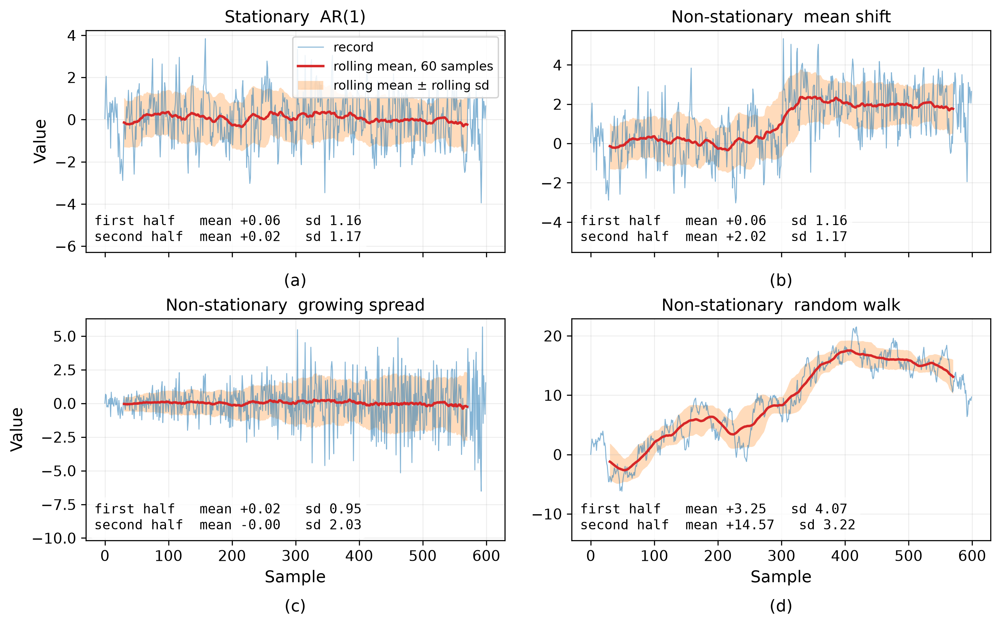

# Stationarity in Engineering Data
Rev. 11 | Created: 2026-09-07 | Updated: 2026-09-07 16:40 CDT

> 계측 데이터의 정상성 (stationarity) 에 대한 기록. 통계적 정의와 물리적 읽기, 실무에서 만나는 여러
> 형태, 신호처리와 상태진단과 구조신뢰성 각각에서 그것이 무엇을 보장하는지, 그리고 유한한 기록 하나로
> 그것을 판정하고 깨졌을 때 다루는 방법을 다룬다.

## 1. Scope

계측 데이터를 해석하는 고전적 도구는 거의 모두 하나의 전제 위에 서 있다. 자료를 만들어 낸 계가
관측하는 동안 같은 계였다는 것이다. 정상성 (stationarity) 은 그 전제에 붙인 이름이고, 현장의 말로
옮기면 "어제 잰 값과 오늘 잰 값이 같은 계를 대표하는가" 이다. 계를 지배하는 물리적 메커니즘과 그것을
움직이는 외부 동인이 시간에 따라 변하지 않을 때 그 답이 "그렇다" 가 된다.

이 전제는 눈에 잘 띄지 않는다. 스펙트럼을 그리고 필터를 설계하고 관리한계를 긋는 동안 아무도 그것을
입 밖에 내지 않지만, 그것이 깨지면 계산은 그대로 나오면서 의미만 사라진다. 결과가 틀렸다는 신호가
계산 쪽에서 오지 않으므로, 전제는 자료를 보기 전에 따로 확인해야 한다.

이 문서는 그 전제를 정리한다. 통계적 정의와 그 물리적 대응, 실무에서 만나는 정상성의 형태, 분야별로
무엇이 불변이라고 가정하는지, 정상성이 해석에 되돌려 주는 것, 유한한 기록 하나로 그것을 판정하는
방법, 그리고 비정상 기록을 다루는 방법을 차례로 다룬다. 본문에서 정의 없이 쓴 용어는
[Appendix A](#appendix-a-terminology) 에 모았다.

## 2. Definition

### 2.1 Strict and Weak Stationarity

엄밀한 정의는 분포에 대한 것이다. 어떤 확률과정의 유한 차원 결합분포가 시간을 $h$ 만큼 옮겨도
그대로이면 그 과정을 strict stationary 라 한다.

$$F(x_1, \ldots, x_k; t_1, \ldots, t_k) = F(x_1, \ldots, x_k; t_1 + h, \ldots, t_k + h) \hspace{19em} (1)$$

이 조건은 유한한 기록으로 확인할 수 없다. 모든 차수의 결합분포를 요구하는데 손에 있는 것은 한 개의
실현뿐이기 때문이다. 그래서 공학에서 쓰는 것은 2차 통계량까지만 요구하는 약한 형태이며, 이것을 weak
stationarity 또는 wide-sense stationarity 라 한다. 여기서 2차 통계량은 평균 같은 1차 moment 와 분산이나
autocovariance 같은 2차 moment 를 함께 이르는 말이다. Skewness 나 kurtosis 처럼 3차 이상의 moment 는
여기에 들지 않으므로, 그것들은 시각에 따라 움직여도 무방하다. 조건은 두 가지다.

$$E[x(t)] = \mu \hspace{19em} (2)$$

$$R(t,\, t+\tau) = E\big[(x(t)-\mu)\,(x(t+\tau)-\mu)\big] = R(\tau) \hspace{19em} (3)$$

식 (2) 는 평균이 시각에 의존하지 않는다는 것이고, 식 (3) 은 두 시점의 autocovariance 가 두 시점이
어디인지가 아니라 그 시차 $\tau$ 에만 의존한다는 것이다. 분산은 $\sigma^2 = R(0) \lt \infty$ 로 유한해야
한다.

여기서 흔한 오해 하나를 짚어 둔다. 정상성을 평균과 표준편차가 일정한 상태로만 기억하면 식 (3) 의
대부분이 빠진다. 식 (3) 은 시차와 시각 두 축을 함께 다룬다. 분산이 일정하다는 말은 그중 $\tau = 0$
이라는 시차 하나를 골라 그 자리의 $R(0)$ 이 어느 시각에나 같음을 확인했다는 뜻이고, 식 (3) 은 나머지
모든 시차에서도 같은 불변을 요구한다. 평균과 분산이 일정하면서도 $\tau \neq 0$ 에서의 상관이 시각에
따라 변하는 신호는 얼마든지 있고, 그런 신호에 스펙트럼 해석을 걸면 결과는 나오지만 그 결과가 어느
시각의 것인지 말할 수 없다. 정상성이 요구하는 것은 두 수치가 아니라 모든 시차에 걸친 $R(\tau)$ 의
시간 불변성이다.

Gaussian process 에서는 이 구별이 사라진다. 결합분포가 평균 vector (1차 moment) 와 covariance matrix
(2차 moment) 의 2차 통계량으로 완전히 결정되므로, weak stationarity 가 곧 strict stationarity 이다
[[1](#ref-1)].

### 2.2 The Physical Reading

같은 것을 물리 쪽에서 읽으면 동적 평형 (dynamic equilibrium) 이다. 외부에서 들어오는 에너지와 내부에서
소산되는 에너지가 통계적으로 균형을 이루면, 계 안의 개별 운동은 여전히 무작위이지만 계 전체의 통계적
에너지 분포는 고정된다. 일정한 유량으로 흐르는 관 안의 난류가 그렇고, 일정한 온도로 가열되며 일정
유량을 유지하는 열전달이 그렇다.

읽는 방법을 하나 더 붙이면 시간 불변성 (time-invariance) 이다. 측정을 언제 시작했는가가 결과에 아무런
영향을 주지 않는 상태를 말한다. $t = 0$ 에서 10 초를 재든 $t = 100$ 에서 10 초를 재든 두 기록의 확률적
성질이 같으면, 시작 시각은 자료의 어느 수치에도 나타나지 않는다.

Table 1. Stationary and non-stationary states

| State | Example |
|-------|---------|
| Stationary | 정속 운전 중인 회전기계의 진동. 일정 유량에서의 난류 압력. 고정된 채널의 열잡음. 세기가 고른 바람 |
| Non-stationary | 시동과 가속 구간의 진동 transient. 지진파. 마모로 서서히 나빠지는 장비. 조건이 자리를 잡아 가는 중인 공정 |

같은 구별을 기록 위에서 보면 Fig 1 과 같다. 네 기록은 같은 innovation 열 하나에서 만든 것이어서 서로
다른 점은 그 열을 어떻게 다루었는가뿐이며, (a) 만 정상이고 나머지 셋은 각각 평균과 산포와 누적 구조에서
정상성을 잃는다. 굵은 선은 60 sample 창의 이동평균이고 띠는 같은 창의 이동표준편차이다.

Fig 1. One stationary record and three ways a record stops being one

(a) 에서는 두 통계량이 모두 제자리에 머문다. (b) 는 이동평균이 중간에서 계단을 밟고, (c) 는 이동평균이
그대로인 채 띠만 벌어지며, (d) 는 이동평균이 어디에도 머물지 않는다. 여기서 눈여겨볼 것은 (b) 의
산포가 (a) 와 다르지 않고 (c) 의 평균도 (a) 처럼 움직이지 않는다는 점이다. 한 수치만 보아서는 둘 중
하나를 정상으로 읽게 된다. 식 (3) 이 평균이나 분산 하나가 아니라 두 시점 사이의 관계를 조건으로 삼은
이유가 그림에 그대로 나와 있다.

### 2.3 Distinctions

정상성과 붙어 다니지만 같지 않은 것들이 있다. 이 셋을 구별해야 뒤의 논의가 어긋나지 않는다.

- 무상관과의 구별: 정상 과정은 자기상관을 가질 수 있다. 계수의 절댓값이 1 보다 작은 AR(1) 은 이웃한
  값끼리 강하게 묶여 있으면서도 정상이며, 값이 서로 무상관인 white noise 는 정상 과정의 한 특수한
  경우일 뿐이다.
- Ergodicity 와의 구별: 시간 평균이 집단 평균과 같아지는 것은 정상성과 별개의 추가 가정이다. 실현마다
  다른 상수 offset 을 갖는 과정은 정상이면서 ergodic 이 아니다. 한 기록을 아무리 길게 재도 그 offset 은
  평균되어 사라지지 않는다.
- 규격과의 구별: 정상성은 계가 어제와 같은가에 대한 것이고, 규격은 값이 허용 범위 안에 있는가에 대한
  것이다. 규격 안에 있으면서 비정상인 공정이 있고, 규격을 벗어나 있으면서 정상인 공정도 있다.

## 3. Forms of Stationarity

실무에서 "정상이다" 라는 말은 서로 다른 여러 가지를 가리킨다. 어느 형태를 뜻하는지 정해 두어야
그다음에 고를 도구가 정해진다.

Table 2. Forms of stationarity and where each is met

| Form | Condition | Typical case |
|------|-----------|--------------|
| Strict | 모든 결합분포의 시간 이동 불변 | 이론상의 기준. 검증 대상이 아님 |
| Weak | 평균 일정. Autocovariance 가 시차만의 함수 | 스펙트럼 해석과 선형 필터 설계의 전제 |
| Cyclostationary | 통계량이 시간에 대해 주기적 | 회전기계 진동. 변조된 통신 신호 |
| Quasi-stationary | 짧은 창 안에서만 근사적으로 정상 | 운전 조건이 천천히 변하는 설비 |
| Difference-stationary | 차분하면 정상. Unit root 보유 | 누적되는 drift. 계측기 offset 의 표류 |
| Trend-stationary | 결정론적 추세를 빼면 정상 | 선형으로 오르는 열 drift |

마지막 두 형태는 겉보기가 비슷하지만 처방이 반대이므로 구별이 중요하다. Difference-stationary 과정은
충격이 영구히 남는 누적 구조이고,

$$x_t = x_{t-1} + \varepsilon_t \hspace{19em} (4)$$

trend-stationary 과정은 결정론적 추세 둘레에서 되돌아오는 구조이다.

$$x_t = a + b\,t + \varepsilon_t \hspace{19em} (5)$$

식 (4) 를 추세로 보고 회귀 잔차를 취하면 잔차에 강한 자기상관이 남고, 식 (5) 를 차분하면 없던
음의 상관이 생긴다. 어느 쪽인지 먼저 가리고 나서 손을 대야 한다.

Cyclostationary 과정은 통계량이 아무렇게나 변하는 것이 아니라 주기라는 구조를 하나 더 가진 것이며,
그 주기를 알면 위상별로 묶어 정상 과정처럼 다룰 수 있다 [[2](#ref-2)]. Quasi-stationary 과정은 창을
짧게 잡아 그 안에서만 정상으로 보는 취급이고, 시간-주파수 해석의 근거가 여기에 있다 [[3](#ref-3)].

## 4. Engineering Domains

분야마다 부르는 이름이 다를 뿐, 정상성이 요구하는 것은 하나다. 해석의 근거로 삼은 통계량이 관측
구간 내내 같은 값이어야 한다는 것이다. 무엇을 그 통계량으로 삼는지가 분야를 가른다.

### 4.1 Signal Processing and Communications

여기서 정상성은 채널의 특성과 잡음의 통계적 성질이 시간에 따라 일정하다는 뜻이다. 이 가정이 서면
최적 필터를 한 번만 설계하면 된다. Wiener filter 의 계수는 신호와 잡음의 2차 통계량에서 나오므로,
그 통계량이 불변인 동안에는 같은 계수가 계속 최적이다.

채널이 비정상이면 설계 시점의 통계로 만든 필터가 현재의 채널과 어긋나고, 어긋난 만큼 잡음이 남아
복호 성능이 떨어진다. 대응은 필터를 시간에 따라 다시 맞추는 것이며, 적응 필터가 하는 일이 그것이다.

### 4.2 Vibration and Condition Monitoring

여기서 정상성은 설비가 정속 운전 (steady-state operation) 중이라는 뜻이다. 회전수와 부하가 일정한
동안 발생하는 진동과 음향은 통계량이 변하지 않고, 그래야 그 신호의 주파수 성분을 설비의 고유한
특성으로 읽을 수 있다. 베어링이나 기어에 결함이 생기면 이 스펙트럼 패턴이 달라지고, 상태 진단은
그 차이를 본다.

한 가지 단서를 붙여야 한다. 회전기계의 진동은 엄밀히는 정상 과정이 아니라 회전 주기에 묶인
cyclostationary 과정이다. 결함이 만드는 충격이 회전에 맞추어 반복되므로, 통계량 자체가 회전 위상의
함수가 된다. 결함 성분이 평균 스펙트럼에 잘 나타나지 않으면서 envelope spectrum 에서 선명하게 보이는
이유가 여기에 있다 [[4](#ref-4)].

### 4.3 Structural and Reliability Engineering

구조 신뢰성에서 불변이어야 하는 것은 구조물에 가해지는 하중의 통계적 가혹도이다. 교량이나 해상
구조물의 설계는 파랑과 바람을 확정된 시간 이력이 아니라 random vibration 으로 다루고, 하중의 power
spectral density 로부터 피로 손상을 누적한다.

이 계산은 과거 자료가 미래를 대표한다는 가정 위에서만 성립한다. 그런데 파랑과 바람에는 계절 주기가
있어 수십 년 기록 전체를 하나의 정상 과정으로 보기 어렵다. 실무는 그래서 자료를 sea state 처럼
조건이 고른 구간으로 나누어 각 구간을 정상으로 취급하고, 구간별 손상을 발생 빈도로 가중해 합친다.

Table 3. What each domain assumes to be time-invariant

| Domain | Time-invariant quantity | Tool that depends on it |
|--------|-------------------------|-------------------------|
| Signal processing | 잡음과 채널의 2차 통계량 | 고정 계수 최적 필터 |
| Condition monitoring | 정속 운전 중의 진동 통계량 | 스펙트럼 기준선과 그 이탈 판정 |
| Reliability | 하중의 power spectral density | 스펙트럼 기반 피로 수명 계산 |

## 5. Consequences for Analysis

### 5.1 Ergodicity

정상성 위에 ergodicity 를 더하면 시간 평균이 집단 평균과 같아진다.

$$\lim_{T \to \infty} \frac{1}{T} \int_{0}^{T} x(t)\,dt = E[x(t)] = \mu \hspace{19em} (6)$$

공학적으로 이것은 시험 비용을 결정하는 성질이다. 설비 한 대를 오래 관측한 결과가 같은 설비 여러
대를 잠깐 관측한 결과와 같으므로, 한 대만 놓고도 모집단의 성능을 말할 수 있다. 다만 2.3 에서 적었듯
이것은 정상성에서 따라 나오는 것이 아니라 별도의 가정이다.

### 5.2 Spectral Analysis

정상 과정에서 autocovariance 함수와 power spectral density 는 Fourier 변환 쌍을 이룬다
[[5](#ref-5)].

$$S(f) = \int_{-\infty}^{\infty} R(\tau)\, e^{-j 2\pi f \tau}\, d\tau \hspace{19em} (7)$$

$$\sigma^2 = R(0) = \int_{-\infty}^{\infty} S(f)\, df \hspace{19em} (8)$$

식 (8) 이 스펙트럼을 공학의 언어로 옮겨 준다. 신호의 분산이 주파수축 위에 어떻게 나뉘어 있는지를
$S(f)$ 가 보여 주므로, 어느 대역이 진동 에너지를 얼마나 갖고 있는지를 그대로 읽을 수 있다.

비정상 신호에서 무너지는 것이 무엇인지는 정확히 말해 둘 필요가 있다. 유한한 기록의 DFT 는 언제나
계산되고 그래프도 그려진다. 무너지는 것은 계산이 아니라 해석이다. 식 (7) 의 $R(\tau)$ 가 시각에 따라
달라지면 추정한 스펙트럼이 어느 시각의 스펙트럼인지 말할 수 없게 되고, 기록을 길게 잡을수록 추정이
좋아진다는 보장도 사라진다. 그래서 비정상 신호에는 창을 짧게 끊어 각 창을 정상으로 보는 STFT 나
wavelet 같은 시간-주파수 기법을 쓴다.

### 5.3 Transfer of a Model Across Time

과거 자료로 정한 것이 미래에도 유효하다는 보장 역시 정상성에서 나온다. 필터 계수, 관리한계, 회귀
모델의 계수는 모두 추정할 당시의 통계량을 담고 있으므로, 그 통계량이 변하면 값 자체는 그대로인 채
근거만 없어진다. 재현성과 예측 가능성을 정상성의 결과로 묶어 두는 이유가 이것이다.

## 6. Assessment on a Finite Record

### 6.1 The Observation Window

판정에 앞서 창의 길이를 정해야 한다. 정상성은 자료가 절대적으로 갖는 성질이 아니라 관측 구간에
상대적인 성질이기 때문이다. 1 초 창에서 정상인 진동이 8 시간 창에서는 온도 drift 때문에 비정상이 되고,
한 lot 안에서 정상인 계측값이 분기 단위로 보면 추세를 갖는다. "이 신호는 정상인가" 는 답할 수 없는
물음이고, "이 신호는 이 창에서 정상인가" 가 답할 수 있는 물음이다.

### 6.2 Checks

Table 4. Checks for stationarity on a single record

| Check | Null hypothesis | What it catches |
|-------|-----------------|-----------------|
| Run chart | 없음. 육안 판정 | 수준 이동. 눈에 띄는 분산 변화 |
| Split-record comparison | 두 구간의 평균과 분산과 스펙트럼이 동일 | 느린 drift |
| Reverse arrangements test | 값의 순서가 무작위 | 단조 추세 |
| ADF test | Unit root 존재. 즉 비정상 | 확률적 추세 |
| KPSS test | 정상 | ADF 단독으로는 갈리지 않는 경우 |

Split-record comparison 은 도구가 없어도 되는 검사이므로 먼저 한다. 기록을 앞뒤로 나누어 평균과 분산,
그리고 스펙트럼을 겹쳐 보는 것으로 대부분의 실무적 비정상은 드러난다. Fig 1 의 각 panel 이 적어 둔
전후 반씩의 평균과 표준편차가 그 비교이며, (b) 와 (d) 는 평균에서, (c) 는 표준편차에서 갈린다. 전후가
모두 붙는 것은 (a) 뿐이다. Reverse arrangements test 는 그 육안 판정을 추세에 대해 수치화한 것이다
[[1](#ref-1)].

ADF test 는 다음 회귀에서 $\gamma = 0$ 을 귀무가설로 놓고 검정한다 [[6](#ref-6)].

$$\Delta x_t = \alpha + \beta t + \gamma\, x_{t-1} + \sum_{i=1}^{p} \delta_i\, \Delta x_{t-i} + \varepsilon_t \hspace{19em} (9)$$

$\gamma = 0$ 이면 식 (4) 의 누적 구조가 남아 있다는 뜻이므로, 귀무가설의 기각이 정상성 쪽의 증거가
된다. KPSS test 는 귀무가설을 반대로 놓아 정상성을 귀무가설로 삼는다 [[7](#ref-7)].

귀무가설이 서로 반대이므로 둘을 함께 돌려 네 가지 조합으로 읽는다. ADF 를 기각하고 KPSS 를 기각하지
못하면 정상으로 본다. 그 반대이면 unit root 가 있는 것으로 본다. 둘 다 기각하면 결정론적 추세와
확률적 추세가 섞여 있는 경우이므로 추세 제거와 차분을 함께 검토한다. 둘 다 기각하지 못하면 기록이
짧아 어느 쪽도 가리지 못한 것이며, 이때 필요한 것은 결론이 아니라 더 긴 기록이다.

### 6.3 Power of the Tests

검정 결과를 자료의 성질로 곧바로 읽지 않도록 주의한다. 이 검정들의 검정력은 기록 길이에 크게 좌우되어,
짧은 기록에서는 비정상을 놓치기 쉽고 매우 긴 기록에서는 실무적으로 무시할 만한 drift 도 유의하게
나온다. 검정은 육안 판정과 공정 지식을 대체하는 것이 아니라 그것에 수치를 붙이는 도구이다.

## 7. Handling of a Non-stationary Record

비정상이 확인되었다고 해서 기록을 버리지는 않는다. 비정상의 원인이 무엇인지에 따라 처방이 정해진다.

Table 5. Cause of non-stationarity and the corresponding treatment

| Cause | Treatment |
|-------|-----------|
| 결정론적 추세 | 추세 회귀 후 잔차 사용 |
| Unit root drift | 차분 [[8](#ref-8)] |
| 수준에 비례하는 분산 | 로그 변환 또는 Box-Cox 변환 |
| 운전 조건의 변화 | 조건별 분할 후 구간마다 별도 해석 |
| 회전수 변동 | Order tracking 으로 각도축에서 다시 sampling |
| 본질적인 시변 구조 | STFT, wavelet, evolutionary spectrum [[3](#ref-3)] |

마지막으로 방향을 하나 뒤집어 둔다. 비정상성은 제거해야 할 결함만이 아니라 그 자체가 정보인 경우가
많다. 시동 구간의 transient 는 정속 운전에서 보이지 않는 공진을 드러내고, 계측값의 완만한 drift 는
소모품의 수명을 알려 준다. 정상성을 확인하는 일의 목적은 자료를 정상으로 만드는 데 있지 않고, 지금
보고 있는 것이 계의 안정된 특성인지 아니면 계가 변하고 있다는 증거인지를 가르는 데 있다.

## References

[1] Bendat, J. S., & Piersol, A. G. (2010). [Random Data: Analysis and Measurement Procedures](https://doi.org/10.1002/9781118032428) (4th ed.). Wiley. 

[2] Antoni, J. (2009). [Cyclostationarity by examples](https://doi.org/10.1016/j.ymssp.2008.10.010). *Mechanical Systems and Signal Processing*, 23(4), 987–1036. 

[3] Priestley, M. B. (1965). [Evolutionary Spectra and Non-Stationary Processes](https://doi.org/10.1111/j.2517-6161.1965.tb01488.x). *Journal of the Royal Statistical Society: Series B*, 27(2), 204–229. 

[4] Randall, R. B., & Antoni, J. (2011). [Rolling element bearing diagnostics — A tutorial](https://doi.org/10.1016/j.ymssp.2010.07.017). *Mechanical Systems and Signal Processing*, 25(2), 485–520. 

[5] Khintchine, A. (1934). [Korrelationstheorie der stationären stochastischen Prozesse](https://doi.org/10.1007/BF01449156). *Mathematische Annalen*, 109, 604–615. 

[6] Dickey, D. A., & Fuller, W. A. (1979). [Distribution of the Estimators for Autoregressive Time Series with a Unit Root](https://doi.org/10.1080/01621459.1979.10482531). *Journal of the American Statistical Association*, 74(366), 427–431. 

[7] Kwiatkowski, D., Phillips, P. C. B., Schmidt, P., & Shin, Y. (1992). [Testing the null hypothesis of stationarity against the alternative of a unit root](https://doi.org/10.1016/0304-4076%2892%2990104-Y). *Journal of Econometrics*, 54(1–3), 159–178. 

[8] Box, G. E. P., Jenkins, G. M., & Reinsel, G. C. (2008). [Time Series Analysis: Forecasting and Control](https://doi.org/10.1002/9781118619193) (4th ed.). Wiley.

---

## Appendix A. Terminology

- **adaptive filter**: 신호와 잡음의 통계량이 변하는 동안 계수를 계속 갱신하는 필터.
- **ADF test**: Unit root 의 존재를 귀무가설로 놓는 검정. 기각이 정상성 쪽의 증거가 된다.
- **AR(1)**: 직전 한 시점의 값에만 의존하는 1차 자기회귀 과정.
- **autocovariance**: 한 신호의 두 시점 값 사이의 공분산. 정상 과정, 곧 통계적 성질이 시간이 지나도 달라지지 않는 과정에서는 두 시점이 어디인지와 무관하게 그 시차만의 함수가 된다.
- **Box-Cox transform**: 분산이 수준에 따라 변하는 자료를 거듭제곱 계열의 변환으로 안정시키는 처리.
- **cyclostationarity**: 통계량이 시간에 대해 주기적으로 변하는 성질.
- **DFT**: 유한한 길이의 이산 신호를 주파수 성분으로 분해하는 변환.
- **difference-stationary**: 차분한 뒤에 정상이 되는 성질. Unit root 를 갖는 과정이 이에 해당한다.
- **drift**: 계의 수준이나 산포가 한 방향으로 서서히 옮겨 가는 변화.
- **dynamic equilibrium**: 유입 에너지와 소산 에너지가 통계적으로 균형을 이루어 계의 통계적 상태가 고정된 상태.
- **envelope spectrum**: 신호의 포락선을 취한 뒤 구한 스펙트럼. 반복되는 충격 성분을 드러낸다.
- **ergodicity**: 하나의 실현을 오래 관측한 시간 평균이 여러 실현의 집단 평균과 일치하는 성질.
- **evolutionary spectrum**: 시각에 따라 달라지는 스펙트럼. 비정상 과정에 스펙트럼 개념을 확장한 것이다.
- **Gaussian process**: 임의의 유한 개 시점을 뽑아도 그 결합분포가 정규분포인 확률과정.
- **innovation**: 확률과정의 각 시점에 새로 들어오는, 과거와 무관한 무작위 입력.
- **KPSS test**: 정상성을 귀무가설로 놓는 검정. ADF test 와 반대 방향에서 같은 물음을 본다.
- **moment**: 분포의 모양을 차수별로 요약한 값. 1차는 평균이고, 평균을 중심으로 잰 2차는 분산, 3차는 skewness, 4차는 kurtosis 이다.
- **order tracking**: 회전수 변동을 없애기 위해 신호를 시간축이 아니라 회전 각도축에서 다시 sampling 하는 처리.
- **power spectral density**: 신호의 분산이 주파수축 위에 어떻게 분포하는지를 나타내는 함수.
- **quasi-stationarity**: 짧은 구간 안에서만 근사적으로 정상인 성질.
- **random vibration**: 시간 이력이 아니라 확률적 성질로 규정되는 진동 하중.
- **reverse arrangements test**: 값의 순서가 무작위라는 귀무가설 아래 단조 추세의 유무를 세어 판정하는 검정.
- **run chart**: 관측값을 시간 순서로 찍어 추세와 수준 이동을 눈으로 보는 그림.
- **sea state**: 파고와 주기가 고른 것으로 보는 해상 조건의 구간.
- **split-record comparison**: 기록을 구간으로 나누어 구간별 평균과 분산과 스펙트럼을 맞대어 보는 검사.
- **steady-state operation**: 회전수와 부하가 일정하게 유지되는 설비의 운전 상태.
- **STFT**: 신호를 짧은 창으로 끊어 창마다 스펙트럼을 구하는 시간-주파수 해석.
- **strict stationarity**: 모든 유한 차원 결합분포가 시간 이동에 대해 불변인 성질.
- **time-invariance**: 측정을 시작한 시각이 결과의 확률적 성질에 영향을 주지 않는 성질.
- **transient**: Steady-state operation 에 이르기 전이나 조건이 바뀌는 동안 나타나는 과도 구간의 신호.
- **trend-stationary**: 결정론적 추세를 제거한 뒤에 정상이 되는 성질.
- **unit root**: 충격이 감쇠하지 않고 누적되는 자기회귀 구조. 식 (4) 가 그 기본형이다.
- **wavelet**: 시간과 주파수를 함께 국소화한 기저로 신호를 분해하는 해석.
- **weak stationarity**: 평균이 일정하고 autocovariance 가 시차만의 함수인 성질. Wide-sense stationarity 라고도 한다.
- **white noise**: 서로 다른 시점의 값이 상관되지 않고 스펙트럼이 평탄한 정상 과정.
- **Wiener filter**: 신호와 잡음의 2차 통계량으로부터 계수가 정해지는 선형 최적 필터.
