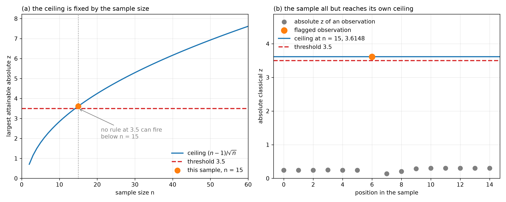

# Ceiling of the Classical z-Score
Rev. 3 | Created: 2026-08-18 | Updated: 2026-09-04 20:10 UTC

> A note on the largest absolute z-score a sample of a given size can produce, the derivation of
> that bound, and what it costs a rule that flags observations by comparing a z-score against a
> fixed cut-off.

## 1. Scope

The most common way to call an observation extreme is to divide its deviation from the mean by
the standard deviation and compare the result against a cut-off. Both the centre and the scale
in that ratio come from the same sample the observation belongs to, so the observation under test
sits inside its own denominator.

That self-reference has a consequence that is easy to miss. The ratio has a ceiling, and the
ceiling is fixed by the sample size alone. For a small enough sample it falls below the cut-off,
and the rule then flags nothing, whatever the data are.

This document gives that ceiling, derives it, and shows what it costs a rule at a fixed cut-off.
It is about the arithmetic of the score, not about what should be done with an outlier once one
is found.

## 2. Bound

### 2.1. Statement

Write $x_1, \ldots, x_n$ for the sample, $\bar{x}$ for its mean, $s$ for its standard deviation,
and $z_i = (x_i - \bar{x}) / s$ for the classical score of observation $i$.

$$\max_i \left| z_i \right| \le \frac{n-1}{\sqrt{n}}$$

The bound is due to Shiffler (1988). It is arithmetic rather than a property of any sample, and
it holds for every set of $n$ numbers.

### 2.2. Derivation

The derivation needs two identities. Deviations from the mean sum to zero, and the sample
standard deviation is defined from their squares.

$$\sum_{j=1}^{n} \left( x_j - \bar{x} \right) = 0, \qquad \sum_{j=1}^{n} \left( x_j - \bar{x} \right)^2 = (n-1)s^2$$

Fix one observation and write $d = x_i - \bar{x}$. The first identity says the other $n-1$
deviations sum to $-d$. By the Cauchy-Schwarz inequality, $n-1$ numbers whose sum is $-d$ have a
sum of squares of at least $d^2 / (n-1)$. Splitting the second identity at observation $i$ and
applying that lower bound gives the result in one line.

$$(n-1)s^2 = d^2 + \sum_{j \ne i} \left( x_j - \bar{x} \right)^2 \ \ge \ d^2 + \frac{d^2}{n-1} \ = \ \frac{n}{n-1} d^2$$

Rearranging gives $d^2 \le (n-1)^2 s^2 / n$, and dividing by $s$ leaves the bound.

Only the second identity involves $s$, so it is the one that carries the self-reference of
section 1. That identity alone already bounds the score: drop the sum over $j \ne i$ from the
display and $d^2 \le (n-1)s^2$ remains. The self-reference is therefore what makes the score
bounded at all, and the zero sum of the deviations is what sharpens the constant to
$(n-1)/\sqrt{n}$.

### 2.3. Equality

The Cauchy-Schwarz step is an equality when the $n-1$ deviations other than $d$ are all equal. A
sample of that shape is one observation set apart from $n-1$ tied ones, and it reaches the bound
exactly.

The ceiling is therefore attained rather than approached, which is what makes it worth stating. A
bound no sample comes near would say little about the rules built on the score.

## 3. Consequence

### 3.1. Cut-offs a Small Sample Cannot Reach

A rule that flags an observation when $\left| z_i \right| \gt k$ can only fire in a sample whose
ceiling sits above $k$. In any smaller sample the rule is inert.

**Table 1. The ceiling at several sample sizes**

| Sample size n | Largest attainable absolute z | A rule at 3.5 |
|---|---|---|
| 10 | 2.8460 | Can never fire |
| 14 | 3.4744 | Can never fire |
| 15 | 3.6148 | Can fire, barely |
| 20 | 4.2485 | Can fire |
| 54 | 7.2124 | Can fire |

The smallest sample a rule can fire in follows from its cut-off. A cut-off of 3 needs at least 11
observations, and a cut-off of 3.5 needs at least 15. Test fourteen observations at 3.5 and the
answer is settled before the data are read.

The danger is that nothing says so. No part of the output distinguishes a sample carrying no
extreme observation from a sample too small for the rule to report one.

### 3.2. Divisor of the Scale

The constant $(n-1)/\sqrt{n}$ is written for the sample standard deviation, which divides the sum
of squares by $n-1$. Dividing by $n$ instead gives a smaller $s$ and a larger score, and the same
derivation then yields $\sqrt{n-1}$ as the sharp bound.

The two differ by enough to matter near a cut-off. A score computed with `numpy.std` at its
default `ddof=0` is measured against $\sqrt{n-1}$ rather than $(n-1)/\sqrt{n}$, so the size at
which a rule becomes capable of firing shifts with a setting that is easy to leave unexamined.

## References

<a id="ref-1"></a>
[1] Shiffler, R. E. (1988). [Maximum Z Scores and Outliers](https://doi.org/10.1080/00031305.1988.10475530). *The American Statistician*, 42(1), 79–80.<br>
<a id="ref-2"></a>
[2] Barnett, V., & Lewis, T. (1994). *Outliers in Statistical Data*, 3rd edition. Wiley, Chichester. [https://www.wiley.com](https://www.wiley.com). ISBN 978-0-471-93094-5.

---

## Appendix A. Terminology

- **ceiling** — The largest value a statistic can take over all samples of a given size, as opposed to a critical value, which is a cut-off chosen to control an error rate.
- **degrees of freedom correction (ddof)** — The amount subtracted from the sample size to form the divisor of the sum of squared deviations. A correction of 1 gives the sample standard deviation and a correction of 0 gives the population form.
- **outlier** — An observation that is inconsistent with the distribution the rest of the sample follows, in the sense used by Barnett and Lewis (1994). The label concerns consistency with a model and does not by itself establish that the observation is wrong.
- **z-score** — The deviation of an observation from the sample mean, divided by the sample standard deviation.

## Appendix B. Reference Implementation

The block below is `z_score_ceiling.py`, in the folder of this document. It is that file as
written, without the module docstring and the `if __name__ == '__main__':` guard.

The file holds the score and its ceiling and nothing else. Tabulating them and drawing them are
left to whatever calls it.

```python
# Applied-Statistics/ZScore/z_score_ceiling.py
__author__ = 'yRocket'
__version__ = "0.0.0.2026.8.18"  # Semantic Versioning: Major.Minor.Patch.Date(YYYY.M.D)

# Everything this module offers. The names beginning with an underscore are internal.
__all__ = [
    'DEFAULT_DDOF',
    'classical_z_scores',
    'max_attainable_z',
]

import numpy as np

# The divisor of the sum of squares is n - ddof. The sample standard deviation uses ddof = 1, and
# the ceiling below is written for it; ddof = 0 is the population form and has its own ceiling.
DEFAULT_DDOF = 1


def _as_ddof(ddof: int = DEFAULT_DDOF) -> int:
    """Return the divisor correction, refusing a value the ceiling is not defined for."""
    if ddof not in (0, 1):
        raise ValueError(f"ddof must be 0 or 1, got {ddof}.")
    return int(ddof)


def _as_sample(data: np.ndarray = None) -> np.ndarray:
    """Return the sample as a 1-D float array, refusing input a z-score cannot be taken in."""
    values = np.asarray(data, dtype=float)
    if values.ndim != 1:
        raise ValueError(f"data must be 1-D, got shape {values.shape}.")
    if values.size < 2:
        raise ValueError(f"a z-score needs at least 2 observations to have a scale, got {values.size}.")
    if not np.all(np.isfinite(values)):
        raise ValueError(f"data carries {int((~np.isfinite(values)).sum())} non-finite values; "
                         f"remove or impute them before scoring.")
    return values


def classical_z_scores(data: np.ndarray = None, ddof: int = DEFAULT_DDOF) -> np.ndarray:
    """Deviation of every observation from the mean, divided by the standard deviation.

    Args:
        data: the sample, shape (n,).
        ddof: the divisor correction, 1 for the sample standard deviation and 0 for the
            population form.

    Returns:
        The classical z-scores, shape (n,).
    """
    values = _as_sample(data=data)
    correction = _as_ddof(ddof=ddof)
    scale = float(values.std(ddof=correction))
    if scale == 0.0:
        # Every observation equals the mean, so no observation is any distance from it at all.
        # Returning zeros would report a clean sample where the score is simply not defined.
        raise ValueError(f"the standard deviation is 0 because all {values.size} observations are "
                         f"{float(values[0])}; the classical score is undefined.")
    return (values - values.mean()) / scale


def max_attainable_z(size: int = None, ddof: int = DEFAULT_DDOF) -> float:
    """Largest absolute z-score a sample of the given size can produce, whatever its values.

    The bound is arithmetic rather than a property of any data, and it is attained: one
    observation set apart from size - 1 tied ones reaches it exactly.

    Args:
        size: the number of observations.
        ddof: the divisor correction, as in classical_z_scores.

    Returns:
        The ceiling on the absolute z-score.
    """
    correction = _as_ddof(ddof=ddof)
    if not isinstance(size, (int, np.integer)):
        raise ValueError(f"size must be an integer, got {type(size).__name__}.")
    if size < 2:
        raise ValueError(f"size must be at least 2, got {size}.")
    if correction == 1:
        return float((size - 1) / np.sqrt(size))
    return float(np.sqrt(size - 1))
```

## Appendix C. Worked Example

Every number in this appendix is produced by `z_score_worked_example.py`, invoked as
`python3 z_score_worked_example.py --threshold 3.5`. The script reads the sample from
`EDA/Outlier/data/1d_esc_current.csv` and writes the points behind the figure beside the figure
as CSV.

The sample is fifteen current measurements. Fourteen of them sit near 0.02 and one is 0.6532,
which is the shape section 2.3 describes: one observation set apart from a tight group. It
therefore sits close to the configuration that attains the ceiling, which here is nothing
distant: it stands a few thousandths above the largest score in the sample.

**Table 2. The sample against its ceiling, and the ceiling one observation lower**

| Quantity | Value |
|---|---|
| Observations | 15 |
| Mean | 0.062913 |
| Standard deviation | 0.163469 |
| Largest absolute z | 3.611012 |
| Ceiling at n = 15 | 3.614784 |
| Share of the ceiling reached | 99.90% |
| Ceiling at n = 14 | 3.474396 |

A rule at 3.5 flags that largest score, but it clears the cut-off by 0.111 while sitting only
0.004 below the ceiling. The verdict rests on the sample size almost as much as on the
measurement.

Removing one observation makes that plain. At fourteen the ceiling is 3.474396, below the
cut-off, so the same measurement in a sample one smaller could not be flagged at 3.5 at all.



**Fig 1. The ceiling against sample size, and the scores this sample reaches under it**

Panel (a) draws $(n-1)/\sqrt{n}$ against $n$ and marks where it crosses 3.5, which is the first
sample size at which a rule at that cut-off can fire. Panel (b) draws the fifteen absolute scores
against the ceiling for a sample of fifteen: fourteen of them lie below 0.31, and the flagged one
sits just under the line it cannot cross.
