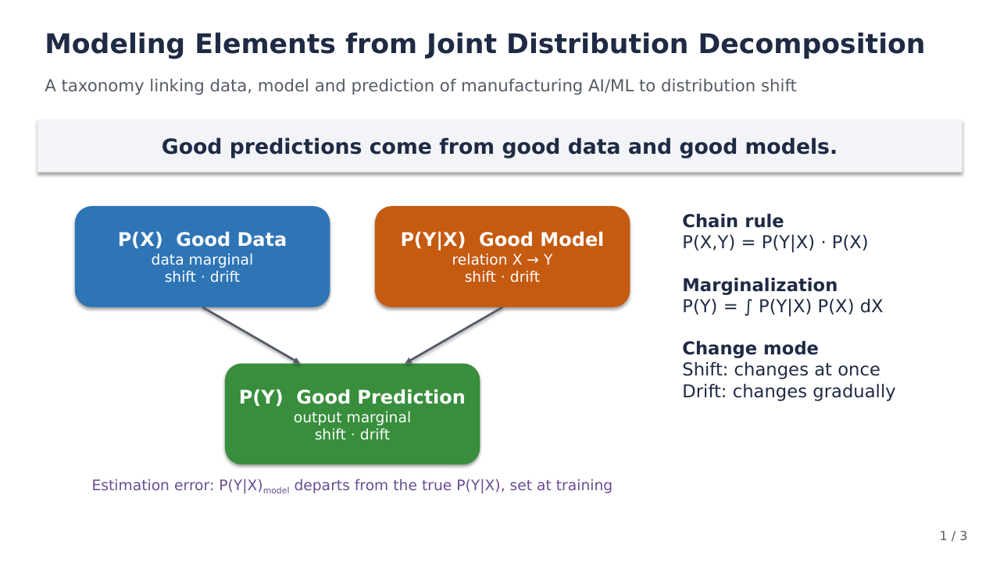
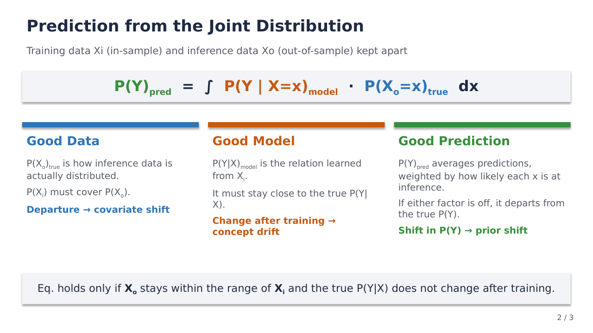
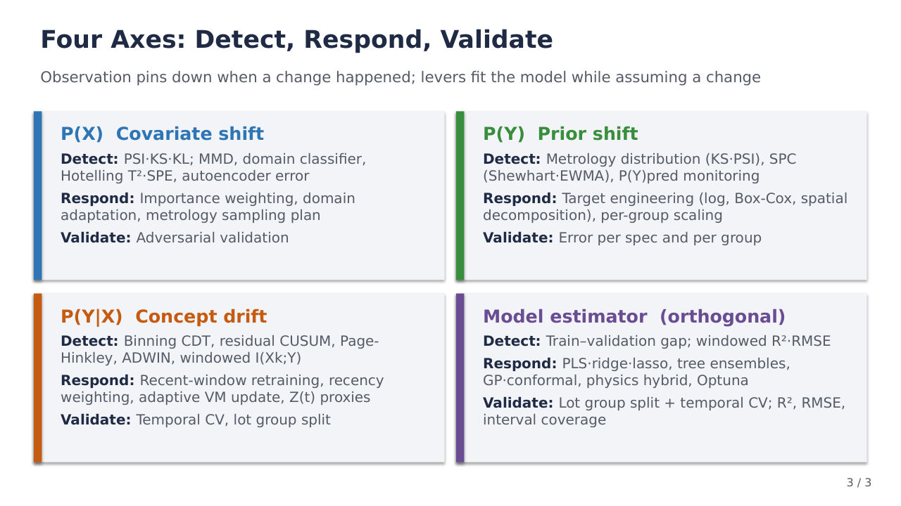

# Modeling Elements from Joint Distribution Decomposition for Manufacturing Data
Rev. 17 | Created: 2026-10-03 | Updated: 2026-10-03 11:23 CDT

- [1. Purpose](#1-purpose)
- [2. Summary](#2-summary)
- [3. Taxonomy and its Hierarchy](#3-taxonomy-and-its-hierarchy)
  - [3.1 Placement](#31-placement)
- [4. Prediction from the Joint Distribution](#4-prediction-from-the-joint-distribution)
- [5. Physical Meaning](#5-physical-meaning)
  - [5.1 P(X) Covariate Shift](#51-px-covariate-shift)
  - [5.2 P(Y) Prior Shift](#52-py-prior-shift)
  - [5.3 P(Y|X) Concept Drift](#53-pyx-concept-drift)
- [References](#references)
- [Appendix A. Terminology](#appendix-a-terminology)
- [Appendix B. Detection and Implementation by Axis](#appendix-b-detection-and-implementation-by-axis)
  - [B.1 P(X) Covariate Shift](#b1-px-covariate-shift)
  - [B.2 P(Y) Prior Shift](#b2-py-prior-shift)
  - [B.3 P(Y|X) Concept Drift](#b3-pyx-concept-drift)
  - [B.4 Model Estimator](#b4-model-estimator)
- [Appendix C. Benchmarking](#appendix-c-benchmarking)
- [Appendix D. Prior in Bayes' Theorem](#appendix-d-prior-in-bayes-theorem)
- [Appendix E. Talk Slides](#appendix-e-talk-slides)

## 1. Purpose

- **Problem Statement**: There is no framework that ties together the elements needed to build an AI/ML model.
- **Goal**: Present a framework that, through the decomposition of the joint probability distribution $P(X,Y) = P(Y\vert{}X) \cdot P(X)$, clearly connects the elements of AI/ML on manufacturing process data (data, model, prediction) with the phenomena that act on them (covariate shift, concept drift, prior shift).
- **Non-Goal**: The Model axis (estimator and optimization), which lies outside the joint distribution, and the diagnostic figures of any specific project are out of scope.

## 2. Summary

> ### Good predictions come from good data and good models.

- **Taxonomy**: Factorizing the joint distribution P(X,Y) by the chain rule yields the three elements of AI/ML on manufacturing data: data P(X), model P(Y|X) and prediction P(Y) (section 3, section 4).
- **Change**: A change in each element is covariate shift, concept drift and prior shift respectively; in a manufacturing process, which has an X → Y structure, a shift in P(Y) is mostly the result of a change in P(X) or P(Y|X) (section 5).
- **Reading rule**: The three elements are read as **points of observation and intervention** rather than an exclusive classification, and they rest on the premises of uncertainty sources, sample selection and the i.i.d. assumption (section 3).

## 3. Taxonomy and its Hierarchy

The joint distribution factorizes into the product of the relation P(Y|X) and the data distribution P(X), and the output P(Y) is obtained by integrating that product over X ([Fig 1](#fig-1)).

```text
                 P(X, Y)   joint distribution
                    |
      factorize     |   P(X, Y) = P(Y|X) * P(X)
          +---------+---------+
          |                   |
        P(X)               P(Y|X)
   data marginal       conditional relation
   good data           good model
   covariate shift     concept drift
          |                   |
          +---------+---------+
      marginalize   |   integrate over X
                    |
                  P(Y)
            output marginal
            good prediction
            prior shift

  Model (estimator): orthogonal axis, how P(Y|X) is estimated
  reverse factorization: P(X, Y) = P(X|Y) * P(Y), defines prior shift (Y -> X structure)
  premises: uncertainty sources, sample selection, i.i.d. and lot / chamber hierarchy
```

<a id="fig-1"></a>
Fig 1. Taxonomy and hierarchy of the joint distribution

- P(X) and P(Y|X) in the upper layer are the two factors that make up the joint distribution.
- P(Y) in the lower layer is a marginal distribution derived from the two factors, so a change in P(X) or P(Y|X) can carry over into P(Y).
- The Model axis is the estimation method (algorithm and optimization) that produces P(Y|X)<sub>model</sub>. The three elements fix what is estimated and the Model axis fixes how it is estimated, so the two are orthogonal.

In this document P(·) denotes a probability distribution: a probability mass function for a discrete variable and a probability density function for a continuous one. From the definition of the conditional distribution, P(Y|X) = P(X,Y) / P(X), the joint distribution factorizes by the chain rule of eq. (1).

```math
P(X, Y) = P(Y \mid X) \cdot P(X) \hspace{19em} (1)
```

```math
P(Y) = \int P(Y \mid X)\, P(X)\, dX \hspace{19em} (2)
```

Integrating both sides of eq. (1) over X gives eq. (2). The left side, ∫ P(X,Y) dX, is the marginal distribution P(Y) of Y with X integrated out, and the right side is the conditional distribution P(Y|X) averaged with the distribution P(X) as weight. This integration is called marginalization: eq. (1) splits the joint distribution into two factors, and eq. (2) recovers P(Y) from those two factors.

The three elements of the quote in section 2 take the three places of eqs. (1) and (2).

- **$`P(Y)`$ (Good Prediction):** good prediction; the marginal distribution obtained by integrating the joint distribution P(X,Y), the product of the two factors, over X (eq. (2)).
- **$`P(X)`$ (Good Data):** good data; a factor of eq. (1), the distribution of the measured data.
- **$`P(Y \mid X)`$ (Good Model):** good model; a factor of eq. (1), the conditional relation of the metrology value given the measured data.

The joint distribution also factorizes in the direction opposite to eq. (1).

```math
P(X, Y) = P(X \mid Y) \cdot P(Y) \hspace{19em} (3)
```

Prior shift is defined in eq. (3) as a change in P(Y) alone while P(X|Y) stays fixed. This definition holds in a causal structure where Y causes X (Y → X), whereas a manufacturing process, in which the process runs, leaves measured data X behind and then yields the metrology value Y, has an X → Y structure. In an X → Y structure a process change alters P(X|Y) through P(Y|X) and P(X), so the prior shift premise that P(X|Y) stays fixed often fails. When it fails, a correction that assumes prior shift (label shift correction) loses its basis.

The three elements rest on the three premises below.

- **Sources of uncertainty**: The metrology value is Y<sub>obs</sub> = Y + ε<sub>m</sub> and the measured data is X<sub>obs</sub> = X + ε<sub>x</sub>. The spread of P(Y<sub>obs</sub>|X<sub>obs</sub>) that the model learns contains intrinsic process variation, metrology error ε<sub>m</sub> (label noise) and sensor measurement error ε<sub>x</sub>, all three of which are aleatoric uncertainty that more data does not reduce. Beyond widening the spread, ε<sub>x</sub> pulls the slope of the estimated relation toward 0 (regression dilution) and so distorts the estimate of P(Y|X). Only the model's uncertainty from too little training data (epistemic uncertainty) shrinks with more data, and the accuracy ceiling a good model can reach is set by intrinsic process variation and the two measurement errors.
- **Sample selection**: Metrology samples only some wafers, so the distribution P(X<sub>i</sub>) of the training data X<sub>i</sub> is that of the measured wafers and can differ from P(X) over all wafers (selection bias). Inference runs on wafers that were not measured, so this difference becomes covariate shift as it stands. When metrology goes missing depending on the value of X or Y, P(X<sub>i</sub>) or the P(Y) of the training data is skewed in the same way.
- **i.i.d. assumption and hierarchy**: Obtaining predictions for inference data from training data through eq. (4) rests on the assumption that wafers are independent and drawn from the same distribution (i.i.d.). Process data carries temporal autocorrelation and a lot and chamber hierarchy in which wafers from the same lot or chamber resemble each other; splitting training and validation while ignoring this structure puts the same lot on both sides and makes performance look better than it is.

### 3.1 Placement

Table 1 places the three elements on six lenses: decomposition, change, intervention, question, observation and lever.

Table 1. Six lenses on P(X), P(Y) and P(Y|X)

| Lens                        | P(X)                                                                          | P(Y)                                                                    | P(Y\|X)                                                                            |
| :-------------------------: | :---------------------------------------------------------------------------: | :---------------------------------------------------------------------: | :--------------------------------------------------------------------------------: |
| Decomposition               | Marginal distribution of measured data                                        | Marginal distribution of output                                         | Conditional (relation)                                                             |
| Distribution change (shift) | Covariate shift                                                               | Prior / label shift                                                     | Concept drift                                                                      |
| Intervention point          | Data space                                                                    | Target engineering (transform, decomposition)                           | Model and algorithm space (relation learning)                                      |
| Question                    | Has inference data X<sub>o</sub> moved away from training data X<sub>i</sub>? | Has the metrology value distribution changed?                           | Has the relation between measured data and metrology value changed since training? |
| Observation (detection)     | PSI·KS·KL, domain classifier                                                  | Metrology value distribution comparison                                 | Binning CDT, windowed I(X<sub>k</sub>;Y), residual CUSUM·Page-Hinkley              |
| Lever                       | Feature selection and augmentation, importance weighting, domain adaptation   | Target transform and decomposition, per-group scaling, prior correction | Retraining interval, recency weighting, detrending, drift adaptation               |

The observation row lists ways to measure a change, and the lever row lists ways to fit the model while assuming a change. Only the methods in the observation row pin down when a change happened. The detection, response and validation methods for the four axes are collected in [Appendix B](#appendix-b-detection-and-implementation-by-axis). Cases in which research and industry use this classification are collected in [Appendix C](#appendix-c-benchmarking).

## 4. Prediction from the Joint Distribution

Eq. (4) writes the relation of the three elements when a trained model is used for inference, keeping training data X<sub>i</sub> and inference data X<sub>o</sub> apart. X<sub>i</sub> is in-sample, the data used to train the model, and X<sub>o</sub> is out-of-sample, the new data that arrives at inference.

```math
P(Y)_{\mathrm{pred}} = \int P(Y \mid X = x;\, X_{i})_{\mathrm{model}} \cdot P(X_{o} = x)_{\mathrm{true}}\, dx \hspace{19em} (4)
```

- **$`P(Y)_{\mathrm{pred}}`$ (Overall Predicted Distribution):** the final distribution of the target variable $`Y`$ expected on out-of-sample inference data; a marginal distribution with the measured data integrated out.
- **$`P(Y \mid X = x;\, X_i)_{\mathrm{model}}`$ (Model's Conditional Prediction):** the predictive model itself. It is trained on in-sample training data $`X_i`$ and, given a measured data value $`x`$, returns the conditional distribution of $`Y`$. The subscript `model` marks it as an estimated, learned function that may differ from the true distribution. The $`X_i`$ after `;` marks the data the model was trained on, set apart from the conditioning variable after `|`. Elsewhere in this document it is shortened to P(Y|X)<sub>model</sub>.
- **$`P(X_o = x)_{\mathrm{true}}`$ (True Distribution of Out-of-Sample Data):** the true probability density that out-of-sample inference data $`X_o`$ takes the value $`x`$. It describes how $`X_o`$ is actually distributed when the model is used for inference.
- **$`\int \ldots dx`$ (Marginalization over $`x`$):** sums the predictions over every value $`x`$ the inference data can take. Each value is weighted by how likely it is at inference time, so the result is a weighted average of the predictions.

Eq. (4) carries the output marginal distribution of eq. (2) over to prediction. For eq. (4) to match the true P(Y), X<sub>o</sub> must stay within the range of X<sub>i</sub> and the true P(Y|X) must not change after training.

Read through the three terms of eq. (4), the three elements are as follows.

- **Good prediction**: P(Y)<sub>pred</sub> is derived from the two factors, so if either one is off it departs from the true P(Y).
- **Good data**: X<sub>i</sub> is training data measured by equipment sensors and paired with wafer metrology values for model training, and P(X<sub>o</sub>)<sub>true</sub> is the distribution of the inference data actually measured at inference. P(X<sub>i</sub>) must cover P(X<sub>o</sub>), and a P(X<sub>o</sub>) that departs from P(X<sub>i</sub>) is covariate shift.
- **Good model**: P(Y|X)<sub>model</sub> is the conditional relation the model estimates from training data X<sub>i</sub>. It must be close to the true P(Y|X), and a change in the true relation after training is concept drift.

## 5. Physical Meaning

In a manufacturing process the three elements correspond to measured data, metrology results and the conditional relation between measured data and metrology values. Table 2 collects that correspondence and the role of each element in eq. (4).

Table 2. Physical meaning of each term

| Term    | Role in eq. (4)                                              | Physical meaning                                                                             | Shift between training and inference                                                                                   |
| :-----: | :----------------------------------------------------------: | :------------------------------------------------------------------------------------------: | :--------------------------------------------------------------------------------------------------------------------: |
| P(X)    | Good data: P(X<sub>i</sub>), P(X<sub>o</sub>)<sub>true</sub> | Distribution of data measured by equipment sensors                                           | Covariate shift: P(X<sub>o</sub>) ≠ P(X<sub>i</sub>) (new equipment, sensor drift, new recipe)                         |
| P(Y)    | Good prediction: P(Y)<sub>pred</sub>                         | Distribution of wafer metrology values (measurement map, spatial decomposition coefficients) | Prior shift: shift of the true P(Y) (target spec change, coefficient distribution shift from a recipe change)          |
| P(Y\|X) | Good model: P(Y\|X)<sub>model</sub>                          | Conditional relation that process physics leaves between measured data and metrology values  | Concept drift: change of the true P(Y\|X) after training (change of the unobserved chamber state Z(t): aging, residue) |

### 5.1 P(X) Covariate Shift

- Meaning: the distributions of training data X<sub>i</sub> and inference data X<sub>o</sub> differ (P(X<sub>o</sub>) ≠ P(X<sub>i</sub>)). The relation P(Y|X) may stay the same.
- Interpretation: the model has learned the relation, but inference data has moved into a region that training data covers sparsely, breaking the good data of eq. (4).
- Scope: work in the data space covers feature selection and generation in general, along with responses to shift.

### 5.2 P(Y) Prior Shift

- Meaning: the output marginal distribution moves (label shift, prior probability shift). It is defined in eq. (3) as a change in P(Y) alone while P(X|Y) stays fixed, and the definition holds in a Y → X causal structure.
- Reading in a manufacturing process: in an X → Y structure an observed shift in P(Y) mostly appears as the result of a shift in P(X) (covariate shift) or a change in P(Y|X) (concept drift). P(Y) itself changes when the definition or reference of Y changes, as when a metrology target spec changes the reference Y, or a recipe change moves the distribution of spatial decomposition coefficients.
- Target engineering: an intervention on P(Y) changes the definition and structure of the output, and covers target transforms (log, Box-Cox), spatial decomposition and multi-task target reformulation.
- Spatial decomposition: target engineering that turns a wafer measurement map into coefficients on a spatial basis. The output becomes smooth, physically meaningful coefficients, which makes P(Y|X) easier to learn.

### 5.3 P(Y|X) Concept Drift

Concept drift is a change after training in the relation between measured data and metrology values itself, where P(Y|X)<sub>model</sub> of eq. (4) drifts away from the true P(Y|X) at inference time and the good model breaks. It is the hardest of the three to handle.

From a process physics view, concept drift is the change of P(Y|X) over time caused by a change in an unobserved chamber state variable Z(t) (aging, residue), and eq. (5) writes that relation.

```math
P(Y \mid X, t) = \int P(Y \mid X, Z)\, P(Z \mid t)\, dZ \hspace{19em} (5)
```

Z is a latent variable. Eq. (5) holds on the premise that Z is independent of X at a given t (Z ⫫ X | t); when the premise fails, the integral must use P(Z|X,t) in place of P(Z|t). Even when the relation P(Y|X,Z) given the chamber state does not change over time, Z is not in the measured data X, so the model sees a change in P(Z|t) only as a change in P(Y|X). Concept drift has two paths, response and observation.

- **Response**: detrending, recency sample weighting, recent drift windowing. These assume the relation changes and give more weight to recent samples, and their effect is checked in time order with temporal CV. They cannot pin down when a change happened.
- **Observation**: measures the change and pins down when it happened.

Observation methods differ in how directly they look at P(Y|X).

- **Binning CDT**: splits X into bins and tests P(Y|bin) per time window to pin down when a change happened. It looks at P(Y|X) most directly.
- **Residual CUSUM, Page-Hinkley**: reports the time at which a statistic of the prediction residuals crosses a threshold.
- **I(X;Y)**: total amount of dependence (a macro indicator). Used alone it picks up changes in P(X), P(Y) and the relation together, so it comes closer to concept drift only when tracked per time window. For high-dimensional X it is hard to estimate accurately per window, so it is narrowed to I(X<sub>k</sub>;Y) over the top K variables X<sub>k</sub> by importance.

## References

<a id="ref-1"></a>
[1] Kang, S., & Kang, P. (2017). [An intelligent virtual metrology system with adaptive update for semiconductor manufacturing](https://doi.org/10.1016/j.jprocont.2017.02.002). *Journal of Process Control*, 52, 66–74.<br>
<a id="ref-2"></a>
[2] Quiñonero-Candela, J., Sugiyama, M., Schwaighofer, A., & Lawrence, N. D. (Eds.). (2009). [Dataset Shift in Machine Learning](https://mitpressbookstore.mit.edu/book/9780262170055). MIT Press. ISBN 978-0-262-17005-5.<br>
<a id="ref-3"></a>
[3] Moreno-Torres, J. G., Raeder, T., Alaiz-Rodríguez, R., Chawla, N. V., & Herrera, F. (2012). [A unifying view on dataset shift in classification](https://doi.org/10.1016/j.patcog.2011.06.019). *Pattern Recognition*, 45(1), 521–530.<br>
<a id="ref-4"></a>
[4] Gama, J., Žliobaitė, I., Bifet, A., Pechenizkiy, M., & Bouchachia, A. (2014). [A survey on concept drift adaptation](https://doi.org/10.1145/2523813). *ACM Computing Surveys*, 46(4), 44.<br>
<a id="ref-5"></a>
[5] Amazon Web Services. [Data and model quality monitoring with Amazon SageMaker Model Monitor](https://docs.aws.amazon.com/sagemaker/latest/dg/model-monitor.html). *Amazon SageMaker AI Developer Guide*.<br>
<a id="ref-6"></a>
[6] Google Cloud. [Introduction to Vertex AI Model Monitoring](https://docs.cloud.google.com/vertex-ai/docs/model-monitoring/overview). *Vertex AI documentation*.<br>
<a id="ref-7"></a>
[7] Evidently AI. [Concept drift in ML](https://www.evidentlyai.com/ml-in-production/concept-drift). *ML in Production guide*.

---

## Appendix A. Terminology

- **aleatoric uncertainty**: uncertainty from the spread inherent in the data. More data does not reduce it.
- **covariate**: an input variable X of the model. Variate is the general word for a single random variable and applies to both X and Y; the "co-" marks a variable that varies together (co-varies) with Y, the variable of main interest, that is, a variable observed alongside Y to explain it. In this document it is the data measured by equipment sensors, and a change in its distribution P(X) between training and inference is called covariate shift.
- **CUSUM (Cumulative Sum)**: a control chart that accumulates deviations from a reference and flags the time the sum crosses a threshold as a change point.
- **epistemic uncertainty**: uncertainty the model carries because training data is insufficient. More data reduces it.
- **I(X;Y)**: mutual information. A macro indicator of the total dependence between X and Y.
- **i.i.d. (independent and identically distributed)**: the assumption that each sample is independent and drawn from the same distribution.
- **label noise**: noise mixed into the target value Y, such as metrology error.
- **latent variable**: a variable that affects the outcome but is not observed directly, such as the aging or residue buildup of a chamber.
- **marginal distribution (주변분포)**: the distribution left for Y alone after integrating X out of the joint distribution P(X,Y). P(Y) = ∫ P(X,Y) dX, describing how Y is distributed regardless of the value of X.
- **regression dilution**: the shrinking of an estimated regression slope toward 0 when the input X carries measurement error.
- **selection bias**: a skew in which the sample distribution departs from the population distribution because of how the sample is chosen.
- **spatial decomposition**: decomposing a wafer measurement map onto a spatial basis (polynomials) and predicting its coefficients (a1, …).
- **target engineering**: transforming, decomposing or reformulating the prediction target Y into a form the model learns more easily.
- **temporal CV**: time-ordered cross-validation that trains on the past and validates on the future.

## Appendix B. Detection and Implementation by Axis

For each of the four axes, this appendix collects how to detect the change (Detection) and which models and techniques respond to it and how they are validated (Response). The Model Estimator axis lies outside the joint distribution and is a Non-Goal of the main text, but it has to be settled alongside the others in practice, so it is placed here.

### B.1 P(X) Covariate Shift

Univariate methods compare each variable's distribution separately and miss changes in the correlation between variables. Manufacturing data with hundreds of sensor variables calls for multivariate methods alongside them.

#### Univariate

- **PSI (Population Stability Index)**: compares, per variable, the binned proportions of training and inference data to measure how far P(X) has moved.
- **KS test (Kolmogorov–Smirnov test)**: tests, per variable, whether two data sets share a distribution by the maximum gap between their cumulative distributions.
- **KL divergence (Kullback–Leibler divergence)**: measures, in information terms, how far the inference data distribution is from the training data distribution.

#### Multivariate

- **MMD (Maximum Mean Discrepancy)**: tests multivariate distribution difference by the gap between the means of two data sets in a kernel space.
- **Domain classifier**: trains a classifier to separate training from inference data; the further the AUC rises above 0.5, the more the two distributions differ.
- **Hotelling T²·SPE (PCA-based)**: checks whether T² and the residual SPE of inference data exceed control limits in a PCA model built on training data.
- **Autoencoder reconstruction error**: checks whether the reconstruction error of inference data exceeds a control limit in an autoencoder built on training data.

#### Response

- **Methods**: importance weighting that weights training samples by a density ratio estimated with a domain classifier, domain adaptation that aligns training and inference input distributions, and a metrology sampling plan adjusted so that training data covers the inference range.
- **Validation**: adversarial validation, which builds the validation set from training samples that resemble inference data.

### B.2 P(Y) Prior Shift

#### Detection

- **Metrology value distribution comparison**: compares the distribution of training metrology values with recent ones by KS test or PSI.
- **SPC control chart (Shewhart·EWMA)**: watches for the time the mean and spread of metrology values leave their control limits.
- **Prediction distribution monitoring**: when metrology values arrive late, watches the shift of P(Y)<sub>pred</sub> first to give early warning of a shift in P(Y).

#### Response

- **Methods**: target engineering (log and Box-Cox transforms, spatial decomposition), per-group scale normalization, and redefining the target and retraining when the target spec changes.
- **Validation**: evaluating error separately per spec and per group.

### B.3 P(Y|X) Concept Drift

#### Detection

- **Binning CDT (Conditional Distribution Test)**: splits X into bins and tests P(Y|bin) per bin and per time window to pin down when a change happened.
- **Residual CUSUM**: takes the time the cumulative sum of prediction residuals crosses a threshold as the time the relation changed.
- **Page-Hinkley**: flags a change in the mean when the gap between the cumulative deviation of prediction residuals and its minimum crosses a threshold.
- **ADWIN (Adaptive Windowing)**: splits the error window in two and, if the means differ significantly, drops the older part and flags a change.
- **Windowed performance monitoring**: computes R²·RMSE per time window to find when performance degrades. It requires metrology values.
- **Windowed I(X<sub>k</sub>;Y)**: tracks dependence changes by computing, per time window, the mutual information between the top K variables X<sub>k</sub> by importance and the metrology value. I(X;Y) over all of a high-dimensional X is hard to estimate accurately per window because the dimension is large relative to the sample size. I(X<sub>k</sub>;Y) can change from a shift in P(X) alone, so it is read together with the covariate shift results of B.1.

#### Response

- **Methods**: periodic retraining on a recent window, recency weighting, adaptive update that measures only low-reliability wafers and updates the model at once [[1](#ref-1)], and proxies for the chamber state Z(t) (time since PM, accumulated RF hours) added as features.
- **Validation**: temporal CV that trains on the past and validates on the future, and a group split by lot.

### B.4 Model Estimator

#### Detection

- **Train–validation gap**: reveals overfitting from the difference between training and validation performance. Degradation over time is watched with the Windowed performance monitoring of B.3.

#### Response

- **Methods**: regularized linear models such as PLS, ridge and lasso when samples are fewer than variables; tree ensembles such as LightGBM, XGBoost and CatBoost for nonlinear relations; Gaussian process, quantile regression or conformal prediction when uncertainty is needed. Physics knowledge enters through monotone constraints or a hybrid that learns only the residual on top of a physics equation, and hyperparameters are searched with Bayesian optimization such as Optuna.
- **Validation**: group split by lot together with temporal CV, reading R², RMSE and the coverage of prediction intervals.

## Appendix C. Benchmarking

Table 3 collects cases in which the classification of this document appears in the dataset shift literature and in industry model monitoring tools.

Table 3. Use of the shift taxonomy in research and industry

| Source                                       | Kind             | Terms used                                              | Term in this document                                                 |
| :------------------------------------------: | :--------------: | :-----------------------------------------------------: | :-------------------------------------------------------------------: |
| Quiñonero-Candela et al. [[2](#ref-2)]       | Book             | dataset shift, covariate shift                          | P(X,Y) difference between training and inference, P(X) shift          |
| Moreno-Torres et al. [[3](#ref-3)]           | Paper            | covariate shift, prior probability shift, concept shift | The three shifts of P(X), P(Y), P(Y\|X)                               |
| Gama et al. [[4](#ref-4)]                    | Survey           | concept drift detection, adaptation                     | Observation and response in 5.3                                       |
| Kang & Kang [[1](#ref-1)]                    | Paper            | virtual metrology adaptive update                       | Response to P(Y\|X) change in manufacturing data                      |
| Amazon SageMaker Model Monitor [[5](#ref-5)] | Industry tool    | data quality drift, model quality drift                 | P(X) shift, loss of good prediction performance                       |
| Vertex AI Model Monitoring [[6](#ref-6)]     | Industry tool    | training-serving skew, inference drift                  | P(X<sub>o</sub>) ≠ P(X<sub>i</sub>), P(X<sub>o</sub>) shift over time |
| Evidently AI [[7](#ref-7)]                   | Open-source tool | data drift, prediction drift, concept drift             | P(X), P(Y)<sub>pred</sub>, P(Y\|X)                                    |

- **Research**: dataset shift is defined as a change in the joint distribution P(X,Y) between training and inference [[2](#ref-2)]. Moreno-Torres et al. organized covariate shift (P(X) moves, P(Y|X) stays), prior probability shift (P(Y) moves, P(X|Y) stays) and concept shift by which term of the joint distribution changes [[3](#ref-3)], and eq. (3) and the three-shift classification of this document follow that work.
- **Manufacturing data**: in semiconductor virtual metrology, wafer characteristics change over time and prediction performance degrades, so an adaptive update was proposed that measures only wafers with low prediction reliability and updates the model at once with those results [[1](#ref-1)]. Gama et al. surveyed methods for detecting and adapting to concept drift [[4](#ref-4)].
- **Industry tools**: model monitoring tools watch the P(X) shift that is visible without ground truth under the names data quality drift [[5](#ref-5)], training-serving skew and inference drift [[6](#ref-6)], and data drift [[7](#ref-7)]. Once ground truth arrives, they check model quality drift [[5](#ref-5)] or concept drift [[7](#ref-7)] from the gap between predictions and ground truth.
- **Framework of this document**: the three-shift classification is a standard concept in research and industry. Mapping the three terms to the good data, good model and good prediction of eq. (4) is this document's own framing and is not a named standard framework in the sources above.

## Appendix D. Prior in Bayes' Theorem

Written in the variables of this document, Bayes' theorem is eq. (6). The unknown the model infers is the metrology value Y, and the measured data X is the evidence for that inference.

```math
P(Y \mid X) = \frac{P(X \mid Y) \cdot P(Y)}{P(X)} \hspace{19em} (6)
```

The terms mean the following.

- **Prior**: P(Y). The prior probability: the distribution held for the metrology value Y before the measured data X is seen.
- **Likelihood**: P(X|Y). The probability that the measured data X appears, assuming the metrology value Y is given.
- **Posterior**: P(Y|X). The posterior probability: the distribution of Y updated after the measured data X is observed, which is the conditional distribution the model sets out to estimate.
- **Evidence**: P(X). The marginal distribution of the measured data, a normalizing constant that makes the posterior a probability distribution.

The prior belongs to the unknown being inferred, the metrology value Y, so the prior of prior shift is P(Y). The numerator P(X|Y)·P(Y) of eq. (6) equals the right side of eq. (3), so prior shift, in which P(Y) alone changes while P(X|Y) of eq. (3) stays fixed, is a change of this prior. Label shift names the same shift in P(Y) after the label Y. Both names come from classification problems with a Y → X structure, in which Y produces X. Such a problem picks the cause class from the effect, as when the disease Y is identified from the symptoms X it causes. A manufacturing process runs the other way, with the process data X as the cause and the metrology value Y as the effect in an X → Y structure, so the names do not fit it as they stand. A shift in P(Y) observed in a manufacturing process therefore mostly results from a change in P(X) or P(Y|X) (section 5.2).

## Appendix E. Talk Slides

Three slides present this document, and the source file is [modeling-elements-invited-talk.pptx](talk-slides/modeling-elements-invited-talk.pptx).

The first slide shows the taxonomy of section 3 ([Fig 2](#fig-2)).



<a id="fig-2"></a>
Fig 2. Talk slide 1, taxonomy from the joint distribution

The joint distribution is split into P(X), P(Y|X) and P(Y), and eqs. (1) and (2) connect the three elements.

The second slide shows eq. (4) of section 4 ([Fig 3](#fig-3)).



<a id="fig-3"></a>
Fig 3. Talk slide 2, prediction from the joint distribution

The three terms of eq. (4) are read as good data, good model and good prediction, and a schematic under each shows the shift that breaks it: covariate shift, concept drift and prior shift. The bottom of the slide states the two conditions under which eq. (4) holds.

The third slide condenses [Appendix B](#appendix-b-detection-and-implementation-by-axis) ([Fig 4](#fig-4)).



<a id="fig-4"></a>
Fig 4. Talk slide 3, detection, response and validation by axis

Each of the four axes has one panel with its detection, response and validation methods.
