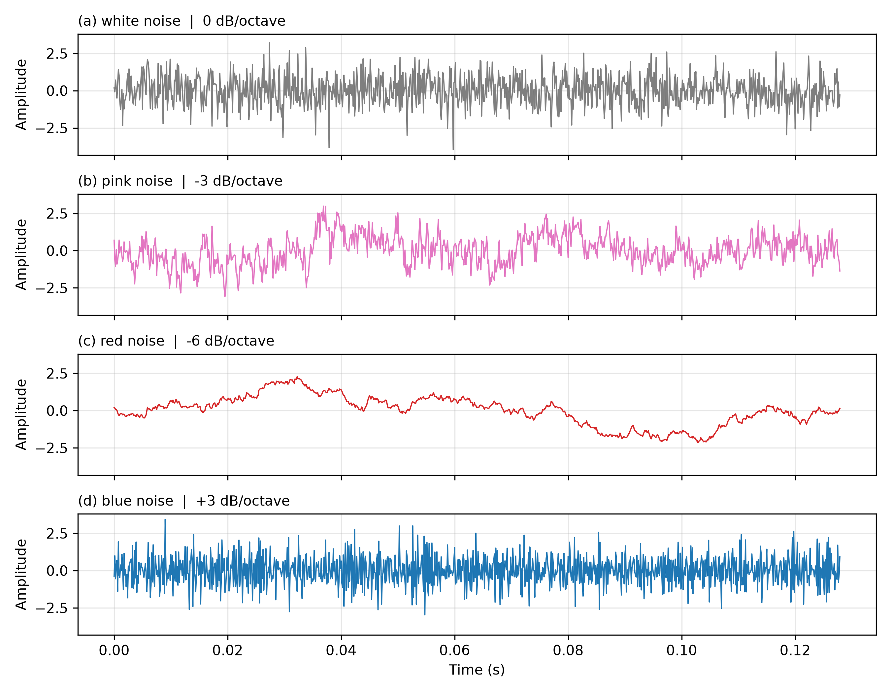
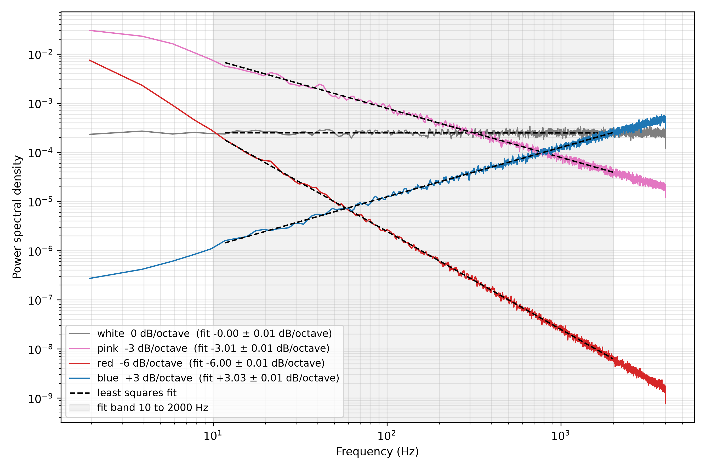
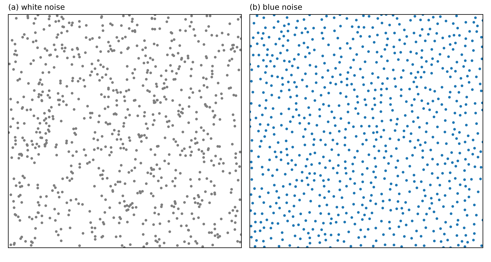

# Noise Color Taxonomy
Rev. 5 | Created: 2026-08-20 | Updated: 2026-08-22 04:41 UTC

노이즈에 붙은 색 이름은 주파수 대역에 에너지가 어떻게 나뉘어 있는지를 가리킨다. 저주파에 에너지가 몰릴수록 붉은 계열로 부르고, 고주파에 몰릴수록 푸른 계열로 부른다. 이 문서는 네 가지 색을 파형, 기울기, 청각, 공간 패턴, 활용의 순서로 정리한다.

## 1. Waveform

네 색을 같은 길이와 같은 세로 눈금으로 그리면 차이가 바로 드러난다.

Fig 1. Waveform of each noise color

Red 는 값이 천천히 오르내려 선이 매끄럽고, Blue 는 이웃한 표본끼리 값이 자주 뒤집혀 선이 가장 촘촘하다. White 는 그 둘 사이에 있고, Pink 는 White 같은 잔 움직임 위에 Red 같은 느린 흔들림이 얹혀 있다. 네 신호는 모두 표준편차를 1 로 맞추었으므로, 다른 것은 세로 폭이 아니라 값이 변하는 빠르기이다. 각 panel 제목에 함께 적은 기울기가 그 빠르기를 한 수로 줄인 값이며, 그 수가 어디서 나오는지는 2 절에서 다룬다.

## 2. Spectral Slope

Power spectral density 는 신호가 가진 power 를 주파수 축에 나누어 놓은 것이다. 읽을 때 보는 것은 곡선의 높이가 아니라 곡선 아래의 면적이다. 두 주파수 사이의 면적이 그 대역이 담고 있는 power 이고, 전 대역의 면적을 모두 더하면 신호의 분산이 된다. 세로축의 단위가 신호 단위의 제곱을 Hz 로 나눈 밀도인 이유도 여기에 있다.

1 절의 네 신호는 표준편차가 서로 같으므로 이 면적의 총합도 서로 같다. 그러므로 색이 다르다는 것은 크기가 다르다는 뜻이 아니라, 같은 크기의 면적을 주파수 축 위에 서로 다르게 나누어 가졌다는 뜻이다.

색을 가르는 기준은 그 나누어진 모양을 한 수로 줄인 값, 곧 octave 마다 에너지가 몇 dB 변하는지이다. Octave 가 주파수 축을 일정한 배수로 훑으므로, 이 기울기 하나가 전 대역의 에너지 분포를 정한다. dB 와 octave 의 정의는 [Appendix A](#appendix-a-terminology) 에 있고, dB 를 power 와 전압에 각각 적용하는 방법은 [Appendix B](#appendix-b-decibel-and-ratio) 에서 다룬다.

Table 1. Spectral slope by noise color

| Color | Slope | Slope range | Power spectral density | Energy distribution |
|-------|-------|-------------|------------------------|---------------------|
| White | 0 dB/octave | -1.5 ~ +1.5 dB/octave | `1/f^0` | 모든 대역이 같은 에너지를 갖는다 |
| Pink | -3 dB/octave | -4.5 ~ -1.5 dB/octave | `1/f` | 주파수에 반비례해 줄어든다 |
| Red | -6 dB/octave | -7.5 ~ -4.5 dB/octave | `1/f^2` | 고주파가 급격히 줄어든다 |
| Blue | +3 dB/octave | +1.5 ~ +4.5 dB/octave | `f` | 주파수에 비례해 늘어난다 |

Red 는 brown noise 라고도 부른다. 기울기가 -6, -3, 0, +3 으로 이어지므로 네 색은 하나의 축 위에 놓이고, White 의 0 이 나머지 셋을 재는 기준이 된다.

Slope 열은 색마다 붙은 이름값이고, Slope range 열은 잰 기울기가 얼마나 벗어나도 그 색으로 부르는지를 적은 것이다. 네 색이 3 dB/octave 간격으로 놓여 있으므로 이웃한 두 색의 한가운데인 ±1.5 dB/octave 까지가 한 색의 몫이 된다. 이 범위는 규격이 정한 허용치가 아니라 간격을 반으로 나눈 구획이다. 실제로 잰 신호의 기울기는 네 값 사이 아무 곳에나 놓이므로, 범위가 없으면 -4 dB/octave 인 신호를 어느 색으로 부를지 정할 수 없다. 같은 표를 제어 분야의 눈금으로 옮긴 것은 [Appendix C](#appendix-c-slope-in-decibel-per-decade) 에 있다.

네 값이 모두 같은 무게를 갖지는 않는다. Pink 는 음향 기기 측정에 쓰는 시험 신호로 IEC 60268-1 에 -3 dB/octave 로 올라 있다 [1](#ref-1). White, Pink, Blue 라는 이름 자체는 Federal Standard 1037C 의 통신 용어집에 항목으로 실려 있으나, 그 용어집은 이름을 풀이할 뿐 기울기 값을 정하지는 않는다 [2](#ref-2). Red 의 -6 은 Brownian motion 의 스펙트럼에서 나온 관례일 뿐 그 값을 정하는 규격 문서가 없다. 거듭제곱 잡음을 규격으로 다루는 IEEE Std 1139 는 같은 기울기들을 색 이름 대신 white, flicker, random walk 로 부른다 [3](#ref-3). 그러므로 네 값은 널리 쓰이는 관례이고, 그중 Pink 만 측정 규격이 값까지 정해 둔다.

Fig 2. Power spectral density and fitted slope of each noise color

가로와 세로가 모두 로그 눈금이므로 주파수의 거듭제곱은 직선으로 나타나고, 그 직선의 기울기가 Table 1 의 값이다. 회색 띠는 기울기를 잰 구간이고, 검은 점선은 그 구간의 점에 최소제곱으로 맞춘 직선이다. 범례에는 색마다 Table 1 의 값과 잰 값을 나란히 적었으며, 네 색 모두 잰 값이 Table 1 의 값에서 0.02 dB/octave 안에 든다. White 만 수평이고 Pink 와 Red 는 내려가며 Blue 는 올라간다. 1 절에서 Red 의 선이 매끄럽고 Blue 의 선이 촘촘했던 것이 여기서는 두 곡선이 서로 반대 방향으로 기우는 것으로 나타난다.

가장 낮은 몇 Hz 에서 Pink 와 Blue 의 곡선이 수평 쪽으로 눕는데, 이는 그 구간에서 평균할 표본이 적어 추정이 거칠어진 것이지 기울기가 달라진 것이 아니다. 잰 구간이 그 아래를 비우고 시작하는 이유도 여기에 있다.

## 3. Auditory Character

White 는 TV 의 무신호 화면에서 나는 찌직 소리에 가깝다. 대역마다 에너지가 같아도 사람의 귀는 높은 대역을 더 크게 듣기 때문에, 평탄한 신호인데도 고음이 강조되어 들린다.

Pink 는 빗소리나 바람 소리처럼 들린다. 사람이 느끼는 음높이가 주파수의 로그에 비례하므로, 주파수에 반비례해 줄어드는 이 기울기가 귀에는 대역마다 고르게 들린다. 네 색 중 가장 자연스럽고 편안하게 느껴지는 이유가 여기에 있다.

Red 는 묵직한 폭포 소리나 둥둥거리는 천둥 소리에 가깝다. 고주파가 가장 빨리 줄어들어 저음만 남으므로 소리가 안정적이다.

Blue 는 쌕 하는 고음역 위주의 날카로운 소리이다. Red 와 정반대로 에너지가 고주파에 몰려 있다.

## 4. Spatial Pattern

같은 기울기를 소리가 아니라 점의 배치에 적용하면 색마다 다른 무늬가 나온다.

White 는 점이 완전히 무작위로 놓이므로 뭉치는 곳과 비어 있는 곳이 함께 생긴다. 무작위가 곧 고른 배치는 아니라는 것이 여기서 드러난다.

Pink 는 저주파 성분이 살아 있어 뭉침이 남고, Red 는 저주파가 더 강해 뭉침이 넓고 굵어진다.

Blue 는 저주파 성분이 가장 약하므로 뭉침이 생기지 않는다. 점들이 서로 밀어내는 것처럼 고르게 흩어진다.

Fig 3. Point pattern of white and blue noise sampling

두 panel 은 같은 넓이에 같은 개수의 점을 놓은 것이다. (a) 는 점마다 자리를 독립으로 뽑았고, (b) 는 후보를 여럿 뽑아 이미 놓인 점에서 가장 먼 것을 고르는 방식으로 놓았다. 개수가 같은데도 (a) 에는 점이 겹친 곳과 빈 곳이 함께 보이고 (b) 에는 그런 곳이 없다. Pink 와 Red 는 (a) 와 같은 방향이되 뭉침이 더 크고 굵을 뿐이므로 따로 싣지 않았다.

## 5. Application

Table 2. Application by noise color

| Color | Field | Purpose |
|-------|-------|---------|
| White | 오디오 장비 측정, 집중력 향상, 소음 차단 | 평탄한 기준 신호로 응답을 재거나 주변 소리를 덮는다 |
| Pink | 음향 기기 calibration, 수면 유도, 음향 치료 | 귀에 고르게 들리는 성질을 기준으로 삼는다 |
| Red | 깊은 수면 유도, tinnitus 완화, 중저음 강조 시험 | 저음이 강하고 안정적인 소리를 만든다 |
| Blue | Computer graphics sampling, halftoning, dithering | 점이 뭉치지 않는 배치를 얻는다 |

앞의 셋은 소리로 쓰이고 Blue 만 점의 배치로 쓰인다. Blue 를 쓰는 세 분야가 모두 표본이나 점을 고르게 흩어 놓아야 하는 일이기 때문이다.

## References

[1] International Electrotechnical Commission. [IEC 60268-1:1985, Sound system equipment - Part 1: General](https://webstore.iec.ch/en/publication/1204). 1985.

[2] General Services Administration. [Federal Standard 1037C, Telecommunications: Glossary of Telecommunication Terms](https://its.ntia.gov/about/resources/federal-standard-1037c/). 1996.

[3] Institute of Electrical and Electronics Engineers. [IEEE Std 1139-2008, IEEE Standard Definitions of Physical Quantities for Fundamental Frequency and Time Metrology - Random Instabilities](https://doi.org/10.1109/IEEESTD.2008.4797525). 2008.

[4] International Electrotechnical Commission. [IEC 61260-1:2014, Electroacoustics - Octave-band and fractional-octave-band filters - Part 1: Specifications](https://webstore.iec.ch/en/publication/5063). 2014.

---

## Appendix A. Terminology

- **Decibel (dB)** 은 두 양의 비를 로그로 옮긴 값이다. Power 를 기준으로 하면 $10 \log_{10}(P_2 / P_1)$ 이며, 전압에 쓸 때 달라지는 점은 [Appendix B](#appendix-b-decibel-and-ratio) 에 있다.
- **Dithering** 은 색이나 밝기의 단계를 줄일 때 생기는 띠를 없애려고 의도적으로 노이즈를 더하는 기법이다.
- **Halftoning** 은 농담을 점의 밀도로 바꾸어 두 색만으로 중간 밝기를 표현하는 기법이다.
- **Octave** 는 주파수가 두 배가 되는 구간이다. 20 Hz 에서 40 Hz 까지와 1 kHz 에서 2 kHz 까지가 모두 한 octave 이며, 이 구간을 나누는 filter 의 규격은 IEC 61260-1 에 있다 [4](#ref-4).
- **Tinnitus** 는 외부에 소리가 없는데도 귀에서 소리가 들리는 증상이다.

## Appendix B. Decibel and Ratio

dB 는 그 자체로 크기를 갖는 단위가 아니라 두 양의 비를 로그로 옮긴 값이다. 그러므로 무엇의 비인지에 따라 로그 앞에 붙는 수가 달라진다.

Power 를 기준으로 잴 때는 $10 \log_{10}(P_2 / P_1)$ 을 쓴다. +10 dB 는 power 가 10 배, +20 dB 는 100 배가 되었다는 뜻이다.

전압이나 음압처럼 제곱해야 power 가 되는 양은 $20 \log_{10}(V_2 / V_1)$ 을 쓴다. 앞의 수가 20 인 것은 $P \propto V^2$ 이어서 $10 \log_{10}(V^2) = 20 \log_{10}(V)$ 이기 때문이다. 그러므로 10 과 20 은 서로 다른 두 종류의 dB 가 아니라 같은 dB 를 서로 다른 양에 적용한 것이며, 같은 물리적 변화라면 두 식은 같은 값을 준다.

이 때문에 전압에서는 +10 dB 가 10 배가 아니라 약 3.16 배가 된다. 배수 $x$ 는 $10 = 20 \log_{10}(x)$ 를 풀어서 얻는다. 양변을 20 으로 나누면 $\log_{10}(x) = 0.5$ 이고, 이를 지수로 옮기면 $x = 10^{0.5} = \sqrt{10} \approx 3.1623$ 이다. 곧 3.16 은 10 의 제곱근이다.

Table 3. Decibel and ratio

| Decibel | Power ratio | Voltage ratio |
|---------|-------------|---------------|
| +3 dB | 2.00 | 1.41 |
| +6 dB | 3.98 | 2.00 |
| +10 dB | 10.00 | 3.16 |
| +20 dB | 100.00 | 10.00 |

이 문서의 기울기는 power spectral density 를 dB 로 옮긴 값이므로 $10 \log_{10}$ 을 쓴 쪽이다. Pink 의 -3 dB/octave 는 주파수가 두 배가 될 때 밀도가 절반이 된다는 뜻이고, 그 사이 octave 의 폭도 두 배가 되므로 한 octave 가 담는 power 는 그대로 남는다.

## Appendix C. Slope in Decibel per Decade

Table 1 은 오디오 관례를 따라 octave 를 눈금으로 삼는다. 반도체 장비의 제어 loop 는 [Bode plot](https://en.wikipedia.org/wiki/Bode_plot) 으로 이득과 위상을 읽으므로 같은 기울기를 decade 로 적는다. Decade 는 주파수가 열 배가 되는 구간이므로 한 decade 는 $\log_2(10) \approx 3.3219$ octave 이며, dB/octave 값을 $\log_{10} 2$ 로 나누면 dB/decade 값이 된다.

Table 4. Spectral slope by noise color in decibel per decade

| Color | Slope | Slope range | Power spectral density |
|-------|-------|-------------|------------------------|
| White | 0 dB/decade | -5 ~ +5 dB/decade | `1/f^0` |
| Pink | -10 dB/decade | -15 ~ -5 dB/decade | `1/f` |
| Red | -20 dB/decade | -25 ~ -15 dB/decade | `1/f^2` |
| Blue | +10 dB/decade | +5 ~ +15 dB/decade | `f` |

이 눈금에서는 값이 반올림 없이 떨어진다. Table 1 의 -3 과 -6 은 반올림한 값이고 정확히는 -3.0103 과 -6.0206 이며, 간격의 정확한 절반도 ±1.5 가 아니라 ±1.5052 이다. 이를 decade 로 옮기면 각각 -10, -20, ±5 가 되어 제어 쪽 표기가 오히려 정수로 맞는다. 네 색이 10 dB/decade 간격으로 놓이므로 이웃과의 한가운데도 ±5 dB/decade 로 떨어진다.

-20 dB/decade 는 극점 하나짜리 filter 가 차단 주파수 위에서 내려가는 기울기와 같다. 그러므로 Red 는 White 를 그런 filter 에 통과시킨 것과 같은 모양이고, Pink 는 그 절반에 해당하는 기울기이다.
