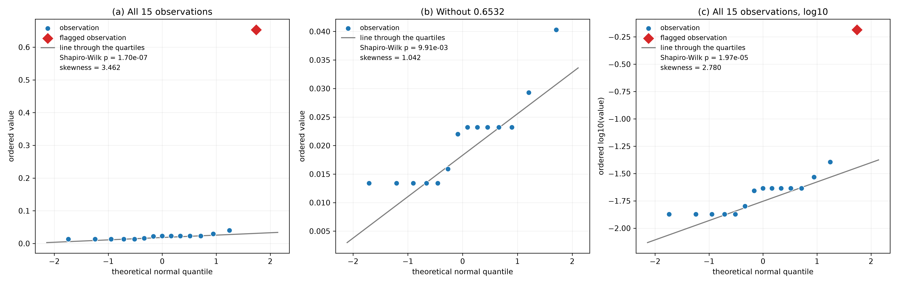
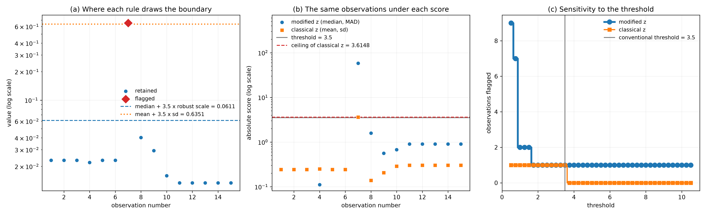
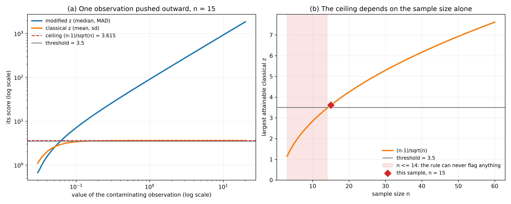

# Hampel Identifier — Flagging Outliers with the Median and the MAD
Rev. 4 | Created: 2026-08-17 | Updated: 2026-08-18 00:16 CDT

> A note on the modified z-score built from the median and the median absolute deviation,
> organized as principle, procedure, parameters, treatment, and limits.

## 1. Scope

The classical way to call an observation extreme is to divide its deviation from the mean by
the standard deviation and compare the result against a threshold. Both the centre and the scale
in that ratio are computed from the same sample the observation belongs to, so an outlier
inflates the quantity it is being measured against.

The Hampel identifier replaces the pair with the median and the median absolute deviation. Those
two are unmoved by a minority of contaminating observations, so the scale stays a description of
the bulk of the sample rather than of the observation under test.

This document describes that identifier and the threshold of 3.5 conventionally used with it.
The method is not part of ISO 16269-4; that standard specifies normal-theory tests and modified
box plots, and its robust material concerns accommodation rather than detection. Where the
scale of a robust estimator is standardized, it is in ISO 13528 for proficiency testing, whose
Algorithm A starts from the same rescaled MAD used here.

## 2. Principle

### 2.1. Contaminated Scale

A sample standard deviation is a mean of squared deviations, so a single distant observation
enters it quadratically. The larger the outlier, the larger the denominator it is divided by,
and the two effects work against each other.

The median absolute deviation is a median of absolute deviations. Moving one observation
arbitrarily far changes which value sits at the middle of that list by at most one position, and
if the sample is large enough it does not change it at all.

### 2.2. Breakdown Point

The breakdown point of an estimator is the fraction of the sample that has to be corrupted
before the estimate can be driven anywhere at all.

**Table 1. Breakdown point of the two pairs**

| Estimator | Breakdown point | Consequence |
|---|---|---|
| Mean and standard deviation | 0% | One observation moved far enough drags both without limit |
| Median and MAD | 50% | Nothing short of half the sample can move either |

This is the whole of the method. Everything below is the arithmetic of putting the robust pair
on a scale that a threshold can be read against.

### 2.3. Ceiling of the Classical Score

The self-reference of section 2.1 has a consequence that is easy to miss. For a sample of size $n$ the
largest attainable absolute z-score is bounded, whatever the data are.

$$\max_i \left| z_i \right| \le \frac{n-1}{\sqrt{n}}$$

The bound is due to Shiffler (1988). It does not describe the data; it is arithmetic, and it
holds for every sample of that size.

**Table 2. The bound at several sample sizes**

| Sample size n | Largest attainable absolute z | A threshold of 3.5 |
|---|---|---|
| 10 | 2.8460 | Can never be reached |
| 14 | 3.4744 | Can never be reached |
| 15 | 3.6148 | Reachable, barely |
| 20 | 4.2485 | Reachable |
| 54 | 7.2124 | Reachable |

For $n \le 14$ a rule that flags an observation when its classical z-score exceeds 3.5 cannot
flag anything, no matter how extreme the sample is. The modified score of section 3.2 carries no such
bound, because its denominator stops responding to the observation in the numerator.

## 3. Procedure

### 3.1. Assumptions

The sample is univariate. Contamination is a minority: fewer than half the observations are
outliers, which is the condition section 2.2 buys and not one that can be dispensed with.

Normality is not assumed for the detection to be meaningful, and this is the difference from the
normal-theory tests. Normality enters only in the calibration of section 4.2, which is what makes the
number 3.5 interpretable. On a sample that is not normal the identifier still measures how far
an observation sits from the bulk in units of the bulk's own spread; what is lost is the
reading of the threshold as a false-positive rate.

### 3.2. Statistic

Let $\tilde{x}$ be the median of the sample.

$$\mathrm{MAD} = \mathrm{median}\left( \left| x_1 - \tilde{x} \right|, \ldots, \left| x_n - \tilde{x} \right| \right)$$

$$M_i = \frac{x_i - \tilde{x}}{\mathrm{MAD} / \Phi^{-1}(0.75)}$$

Here $\Phi^{-1}(0.75) = 0.674490$ is the third quartile of the standard normal distribution, and
the denominator as a whole is the robust scale. The quantity $M_i$ is the modified z-score.

### 3.3. Decision Rule

An observation is flagged when its modified z-score exceeds the threshold $k$ in absolute value.

$$\left| M_i \right| \gt k$$

The threshold $k$ is 3.5 by convention.

Equivalently, the retained interval is $\tilde{x} \pm k \cdot \mathrm{MAD} / \Phi^{-1}(0.75)$.

Every observation is scored once, against a centre and a scale computed once. There is no
iteration and no removal, because the estimates the scores are built on were never contaminated
in the first place.

## 4. Parameters

### 4.1. Threshold

**Table 3. What the threshold costs on genuinely normal data**

| Threshold | Probability one observation is flagged | Expected false flags in n = 15 |
|---|---|---|
| 2.5 | 0.012419 | 0.186 |
| 3.0 | 0.002700 | 0.041 |
| 3.5 | 0.000465 | 0.007 |

The value 3.5 is the recommendation of Iglewicz and Hoaglin (1993). It is conservative by
construction: a sample of 100 normal observations produces one spurious flag about once in
twenty samples. A threshold of 3.0 is also seen and is roughly six times looser.

The threshold is a choice and should be fixed before the data are seen. Its influence on a given
result is worth reporting, since a verdict that changes between 3.0 and 3.5 rests on the choice
rather than on the data.

### 4.2. Consistency Constant

For a normal sample the MAD converges to $\Phi^{-1}(0.75)\,\sigma$ rather than to $\sigma$, so
the raw MAD understates the spread by about a third. Dividing by $\Phi^{-1}(0.75)$, equivalently
multiplying by 1.482602, removes that bias and is what makes the modified score comparable to a
classical z-score.

The constant is the only place normality enters the method, and it is a calibration rather than
an assumption: changing it rescales every score by the same factor and reorders nothing. Its
purpose is to let the threshold of section 4.1 be read as a false-positive rate.

## 5. Treatment

The identifier settles whether an observation is far from the bulk. It does not settle whether
the observation is wrong, and the two questions should not be merged.

- Investigate the cause before acting. A flag traced to a recording error, an instrument fault, or a documented disturbance can be corrected or removed on that evidence.
- Retain a flag with no assignable cause, because a value that is genuinely part of the process carries information that removing it destroys.
- Report what was removed, the threshold used, and the change removal made to the estimates.
- Prefer accommodation to deletion when flags recur. A robust estimator limits the influence of extreme observations without discarding them, and the median and MAD used here are already such estimators.

Re-running the identifier on the sample left after removal is not a treatment. The centre and the
scale are recomputed on cleaned data, so the second pass measures a different thing from the
first.

## 6. Limits

**Table 4. Conditions that limit the identifier**

| Condition | Consequence | What to do instead |
|---|---|---|
| More than half the sample takes one value | The MAD is 0 and the score is undefined | Use a scale estimator that tolerates ties, such as Sn or Qn |
| Contamination at or above half the sample | The median and the MAD describe the contamination | No detection rule recovers this; the sample needs a different source of truth |
| Multivariate data | The score is defined on one variable at a time | Use a distance-based method such as Mahalanobis distance |
| Serial correlation | Neighbouring observations are not exchangeable | Model the correlation, or score the residuals |
| A threshold read as a false-positive rate on non-normal data | The rate does not hold | Report the score and the margin rather than a nominal rate |

The first row is the failure this method has and the normal-theory tests do not, and it is
common in data recorded at coarse resolution. It is a hard failure rather than a degradation:
the score is undefined, not merely inaccurate, and an implementation that returns zero scores
in that case reports a clean sample when it should report that it cannot answer.

## 7. Summary

The Hampel identifier scores each observation as its distance from the median divided by the
rescaled MAD, and flags the observation when that score exceeds 3.5 in absolute value. The
robust pair has a breakdown point of 50% against 0% for the mean and standard deviation, which
is why the method needs no iteration and why it is unaffected by the ceiling that bounds every
classical z-score at $(n-1)/\sqrt{n}$. It assumes contamination is a minority rather than
assuming normality, it fails outright when more than half the sample takes one value, and like
every detection rule it answers how far an observation sits from the bulk and not what should be
done about it.

## References

<a id="ref-1"></a>
[1] Hampel, F. R. (1974). [The Influence Curve and Its Role in Robust Estimation](https://doi.org/10.1080/01621459.1974.10482962). *Journal of the American Statistical Association*, 69(346), 383–393.

<a id="ref-2"></a>
[2] Iglewicz, B., & Hoaglin, D. C. (1993). *How to Detect and Handle Outliers*. The ASQC Basic References in Quality Control: Statistical Techniques, Vol. 16. ASQC Quality Press, Milwaukee. [https://asq.org/quality-press](https://asq.org/quality-press). ISBN 978-0-87389-247-6.

<a id="ref-3"></a>
[3] Shiffler, R. E. (1988). [Maximum Z Scores and Outliers](https://doi.org/10.1080/00031305.1988.10475530). *The American Statistician*, 42(1), 79–80.

<a id="ref-4"></a>
[4] Rousseeuw, P. J., & Croux, C. (1993). [Alternatives to the Median Absolute Deviation](https://doi.org/10.1080/01621459.1993.10476408). *Journal of the American Statistical Association*, 88(424), 1273–1283.

<a id="ref-5"></a>
[5] Leys, C., Ley, C., Klein, O., Bernard, P., & Licata, L. (2013). [Detecting outliers: Do not use standard deviation around the mean, use absolute deviation around the median](https://doi.org/10.1016/j.jesp.2013.03.013). *Journal of Experimental Social Psychology*, 49(4), 764–766.

<a id="ref-6"></a>
[6] ISO 13528:2022, *Statistical methods for use in proficiency testing by interlaboratory comparison*. International Organization for Standardization. [https://www.iso.org/standard/78879.html](https://www.iso.org/standard/78879.html)

---

## Appendix A. Terminology

- **accommodation** — Handling an outlier by limiting its influence on the estimates rather than by removing it.
- **breakdown point** — The smallest fraction of a sample that has to be corrupted before an estimator can be driven to an arbitrary value.
- **consistency constant** — A factor applied to a robust scale estimate so that it converges to the standard deviation under an assumed distribution.
- **contamination** — The fraction of a sample that does not come from the assumed distribution.
- **exchangeable** — A property of observations whose joint distribution is unchanged by reordering them, which serial correlation breaks.
- **Mahalanobis distance** — A distance from the centre of a multivariate sample that accounts for the covariance among the variables.
- **median absolute deviation** — The median of the absolute deviations from the sample median, used as a scale estimate that a few extreme observations cannot inflate.
- **modified z-score** — The deviation from the median divided by the rescaled MAD.
- **Qn** — A robust scale estimator taking an order statistic of the pairwise distances between observations, with a 50% breakdown point and better behaviour than the MAD under ties.
- **Sn** — A robust scale estimator built from a median of medians of pairwise distances, with a 50% breakdown point and no assumption of symmetry.
- **z-score** — The deviation from the mean divided by the sample standard deviation.

## Appendix B. Reference Implementation

The implementation is `hampel_identifier.py`, in the folder of this document. The block below is
an excerpt: the docstrings are abridged to their opening paragraph, and the tabulation, sweep,
reporting and command line parts of the file are omitted. It is otherwise the file as written and
runs as printed.

### B.1. Implementation

```python
# EDA/Outlier/Hampel/hampel_identifier.py
from dataclasses import dataclass

import numpy as np
from scipy import stats

# The MAD of a normal sample converges to this multiple of sigma, so dividing by it puts the
# modified score on the same scale as a classical z-score. It is the third quartile of N(0, 1).
NORMAL_QUARTILE = float(stats.norm.ppf(0.75))

# The cut-off recommended by Iglewicz and Hoaglin for the modified z-score.
DEFAULT_THRESHOLD = 3.5


@dataclass
class HampelResult:
    """Outcome of the Hampel identifier on one sample."""

    values: np.ndarray
    centre: float
    mad: float
    scale: float
    scores: np.ndarray
    threshold: float
    positions: np.ndarray

    @property
    def count(self) -> int:
        """Number of flagged observations."""
        return int(self.positions.size)

    def bounds(self) -> tuple[float, float]:
        """The interval outside which an observation is flagged."""
        return self.centre - self.threshold * self.scale, self.centre + self.threshold * self.scale


def median_absolute_deviation(data: np.ndarray = None) -> float:
    """Median of the absolute deviations from the sample median."""
    values = np.asarray(data, dtype=float)
    return float(np.median(np.abs(values - np.median(values))))


def classical_z_scores(data: np.ndarray = None) -> np.ndarray:
    """Deviation from the mean divided by the sample standard deviation, with ddof = 1."""
    values = np.asarray(data, dtype=float)
    deviation = values.std(ddof=1)
    if deviation == 0.0:
        raise ValueError(f"all {values.size} observations are equal, so the classical z-score is undefined.")
    return (values - values.mean()) / deviation


def max_attainable_z(sample_size: int = None) -> float:
    """Largest absolute classical z-score a sample of this size can produce."""
    if sample_size < 2:
        raise ValueError(f"a z-score needs at least 2 observations, got {sample_size}.")
    return (sample_size - 1) / np.sqrt(sample_size)


def hampel_test(data: np.ndarray = None, threshold: float = DEFAULT_THRESHOLD,
                quartile: float = NORMAL_QUARTILE) -> HampelResult:
    """Flag observations whose modified z-score exceeds the threshold in absolute value."""
    values = np.asarray(data, dtype=float)
    if values.ndim != 1:
        raise ValueError(f"data must be 1-D, got shape {values.shape}.")
    if values.size < 3:
        raise ValueError(f"the identifier needs at least 3 observations to have a usable median, got {values.size}.")
    if not np.all(np.isfinite(values)):
        raise ValueError(f"data carries {int((~np.isfinite(values)).sum())} non-finite values; "
                         f"remove or impute them before testing.")
    if threshold <= 0.0:
        raise ValueError(f"threshold must be positive, got {threshold}.")
    if quartile <= 0.0:
        raise ValueError(f"quartile must be positive, got {quartile}.")

    centre = float(np.median(values))
    mad = median_absolute_deviation(data=values)
    if mad == 0.0:
        # More than half the sample sits on one value, so the MAD carries no scale at all.
        # Returning zero scores here would report a clean sample, which is the opposite of the truth.
        repeated = int((values == centre).sum())
        raise ValueError(f"the MAD is 0 because {repeated} of {values.size} observations equal the median "
                         f"{centre}; the modified z-score is undefined. Use a scale estimator that tolerates "
                         f"ties, such as Sn or Qn, or report that the sample cannot support the test.")

    scale = mad / quartile
    scores = (values - centre) / scale
    return HampelResult(values=values, centre=centre, mad=mad, scale=scale, scores=scores,
                        threshold=threshold, positions=np.flatnonzero(np.abs(scores) > threshold))
```

### B.2. Design Notes

The consistency constant is computed from `scipy.stats` rather than written as 0.674490, so the
calibration of section 4.2 cannot drift from the value the code actually applies.

`HampelResult` carries the centre and the scale alongside the scores rather than discarding them,
because a score on its own cannot be checked against anything. Its omitted `to_frame` method
tabulates the sample against both scores, which is what the worked example prints.

The zero-MAD branch is the one that matters. It is the failure of section 6, and the alternative
to raising is to divide by zero or to return scores of zero, either of which reports a clean
sample on data the method cannot read. The message names the count of tied observations so the
caller can see why.

`classical_z_scores` and `max_attainable_z` exist for the comparison rather than for the method.
Carrying the bound as a function rather than as a number in the document keeps section 2.3
checkable: the claim about any sample size can be evaluated instead of trusted.

### B.3. Invocation

```bash
python3 hampel_identifier.py --input-csv <PATH> --column value --threshold 3.5
python3 hampel_sample_outliers.py --threshold 3.5
```

Running either with no option prints the usage. The first tests a column of a file; the second
reproduces Appendix C exactly and writes both figures with the samples behind them to
`hampel-identifier_fig/`.

## Appendix C. Worked Example

Every number in this appendix is produced by `hampel_sample_outliers.py`, invoked as
`python3 hampel_sample_outliers.py --threshold 3.5`. The sample is fixed inside the script and
the points behind the figures are written beside them as CSV.

Two rules are applied to the same data throughout. **The identifier** is the method of section 3,
which scores an observation against the median and the MAD. **The classical rule** scores it
against the mean and the standard deviation instead, and flags at the same threshold of 3.5. The
scores they produce are the modified z of section 3.2 and the ordinary z-score.

### C.1. Sample

The sample is 15 measurements taking only 7 distinct values, with 0.0134 and 0.0232 each
appearing 5 times. Its median is 0.0232 and the values run from 0.0134 to 0.6532.

**Table 5. Every observation with its score under each rule**

| Observation | Value | Modified z | Classical z | Flagged |
|---|---|---|---|---|
| 1 | 0.0232 | 0.0000 | −0.2429 | No |
| 2 | 0.0232 | 0.0000 | −0.2429 | No |
| 3 | 0.0232 | 0.0000 | −0.2429 | No |
| 4 | 0.0220 | −0.1109 | −0.2503 | No |
| 5 | 0.0232 | 0.0000 | −0.2429 | No |
| 6 | 0.0232 | 0.0000 | −0.2429 | No |
| 7 | **0.6532** | **58.2094** | **3.6110** | **Yes** |
| 8 | 0.0403 | 1.5800 | −0.1383 | No |
| 9 | 0.0293 | 0.5636 | −0.2056 | No |
| 10 | 0.0159 | −0.6745 | −0.2876 | No |
| 11 | 0.0134 | −0.9055 | −0.3029 | No |
| 12 | 0.0134 | −0.9055 | −0.3029 | No |
| 13 | 0.0134 | −0.9055 | −0.3029 | No |
| 14 | 0.0134 | −0.9055 | −0.3029 | No |
| 15 | 0.0134 | −0.9055 | −0.3029 | No |

The modified z is 0 at the five observations equal to the median, which is what a deviation from
the median gives. The classical z is negative at all fourteen retained observations, because the
mean has been pulled above every one of them by the fifteenth.

**Table 6. The centre and the scale each rule computes**

| Quantity | Classical rule | Identifier |
|---|---|---|
| Centre | mean = 0.062913 | median = 0.023200 |
| Raw scale | sd = 0.163469 | MAD = 0.007300 |
| Scale used in the score | sd = 0.163469 | MAD / 0.674490 = 0.010823 |
| Upper boundary at 3.5 | mean + 3.5 sd = 0.635053 | median + 3.5 (MAD / 0.674490) = 0.061080 |

The MAD is the median of the absolute deviations from 0.023200. Sorted, those 15 deviations are
0 five times, then 0.0012, 0.0061, 0.0073, 0.0098 five times, 0.0171 and 0.6300. The eighth of
fifteen is 0.0073, which is the MAD, and it comes from the observation 0.0159. Dividing it by
0.674490 as section 4.2 requires gives the 0.010823 the score divides by.

The two scales differ by a factor of 15.1, and the whole of that gap is the single observation
0.6532 entering the standard deviation. The scale of the identifier describes the other 14
observations; the classical scale describes the outlier.

### C.2. Normality

Section 3.1 states that the identifier does not need normality for its detection to be
meaningful, and section 4.2 states that normality is what makes the threshold readable as a
false-positive rate. This sample is the case where the distinction matters, because it is not
normal.



**Fig 1. Normal quantile plots of the sample, of the sample without its extreme value, and of the sample on a log scale**

The reference line runs through the first and third quartiles rather than being fitted by least
squares, so the extreme observation cannot rotate it and flatten the departure the panel is drawn
to show.

**Table 7. Normality of the three views**

| View | Count | Skewness | Shapiro-Wilk p |
|---|---|---|---|
| All observations | 15 | 3.462 | 1.70e-07 |
| Without 0.6532 | 14 | 1.042 | 9.91e-03 |
| All observations, log10 | 15 | 2.780 | 1.97e-05 |

Every view is rejected at α = 0.05, and every view is rejected at α = 0.01 as well, though the
middle row falls below the stricter level by only 0.0001 and should not be read as decisive
there. Panel (b) shows why removing the extreme value does not rescue the sample: the remaining
14 observations take only 6 distinct values, so the plot rises in steps rather than along the
line. Panel (c) shows that a log transform does not rescue it either, with skewness falling only
from 3.462 to 2.780.

The p-values are approximate rather than exact here, because two thirds of the observations are
tied and the Shapiro-Wilk statistic assumes a continuous distribution. The size of the departure
does not rest on that approximation.

### C.3. Scores

**Table 8. The two scores on the extreme observation**

| Score | 0.6532 | Largest among the other 14 | Margin over the threshold 3.5 |
|---|---|---|---|
| Modified z, from the median and the MAD | 58.2094 | 1.5800 | 54.7094 |
| Classical z, from the mean and the sd | 3.6110 | 0.3029 | 0.1110 |

Both rules flag 0.6532 at a threshold of 3.5, so on this sample they agree. They do not agree on
how strongly.

The classical z reaches 3.6110 against a ceiling of 3.6148 for n = 15, which is 99.9% of the
largest value the arithmetic permits. It flags the observation with 0.1110 to spare, and it does
so only because n = 15 puts the ceiling just above the threshold; at n = 14 the same rule on the
same kind of data could not have flagged anything at all. The modified z reaches 58.2094 and
clears the threshold by 54.7094.



**Fig 2. The sample under the identifier and the classical rule, with the threshold swept**

Panel (a) draws the two boundaries of Table 6 against the data on a log axis. The boundary of the
identifier sits at 0.0611, above every retained observation and well below 0.6532. The classical
boundary sits at 0.6351, which is above 14 of the 15 observations because the outlier pushed it
there; the flagged point clears it by a margin too small to see at this scale.

Panel (b) scores every observation under both rules, which is Table 5 drawn. The ceiling and the
threshold appear as two nearly coincident lines, the visual form of the previous paragraph: for
this sample size the classical rule has almost no room between the threshold it must clear and the
largest value it can produce.

Panel (c) sweeps the threshold. The modified z reports exactly one outlier for every threshold
from 1.58 to 58.21, a band spanning a factor of 37 that the conventional 3.5 sits well inside. The
classical z reports one only up to 3.61 and none above it, so a threshold of 3.5 sits 0.11 from
flipping the answer.

### C.4. Breakdown in Motion

The 14 retained observations are held fixed and a fifteenth is inserted, then pushed outward.
Each rule is asked how extreme that inserted observation is.



**Fig 3. What each rule reports as one observation is pushed outward**

Panel (a) is the breakdown point of section 2.2 made visible. The modified z grows without limit,
reaching 1845.8 when the contaminant is 20. The classical z rises at first, then flattens
against the ceiling of 3.6148 and stays there however far the observation is pushed. Past that
point the classical rule cannot distinguish an observation ten times too large from one a
thousand times too large, because the contaminant is inflating its own denominator as fast as
its numerator.

The crossing near the left of panel (a) is worth noting. The classical z passes 3.5 when the
contaminant reaches 0.1385 and the modified z passes it at 0.0645, so the robust rule reacts
at less than half the distance and then keeps going while the other saturates.

Panel (b) plots the ceiling against the sample size. The shaded region marks $n \le 14$, where a
threshold of 3.5 on the classical z can never be reached. The sample of this appendix sits at
n = 15, just past that edge, which is the accident that let the classical rule work here at all.

### C.5. Reading

On this sample the two rules give the same verdict and the identifier gives it far more securely.
The verdict does not depend on the threshold anywhere in a band spanning a factor of 37, it does
not depend on normality, and it is not near a ceiling.

The sample does not satisfy normality, with or without 0.6532, as C.2 shows. That is what makes
the identifier the appropriate rule here rather than merely the more comfortable
one: a test whose critical
values are derived from the normal distribution loses its basis on this data, while the
identifier only loses the reading of 3.5 as a false-positive rate, which is not what the verdict
rests on.

The margin of safety against the failure of section 6 is smaller than it looks. The largest tie is 5
observations of 15; the MAD becomes 0 at 8, so three more tied observations would leave the
method unable to answer. Coarse measurement resolution moves a sample toward that boundary, and
it is worth checking the tie count before relying on this rule.
