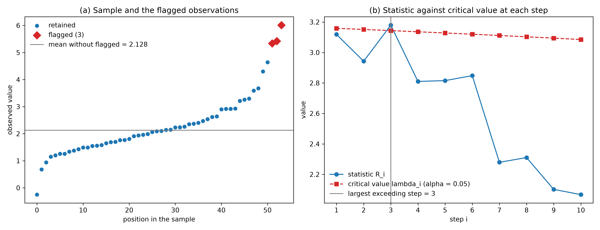
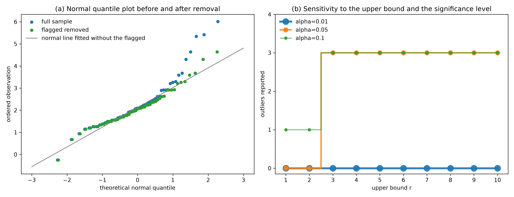

# Generalized ESD — Detecting an Unknown Number of Outliers
Rev. 0 | Created: 2026-08-17 | Updated: 2026-08-17 15:20 CDT

> A note on the generalized extreme studentized deviate procedure specified in the informative
> Annex A of ISO 16269-4:2010, organized as principle, procedure, parameters, treatment, and limits.

## 1. Scope

ISO 16269-4:2010 covers the detection and treatment of outliers in data obtained from a
measurement process, and it is written mainly for univariate data. It carries two families of
test. Single-outlier tests such as Grubbs and Dixon are built to find one discordant
observation and are not meant to be applied repeatedly to find several. The generalized
extreme studentized deviate procedure, given as an algorithm in the informative Annex A, is
the many-outlier member of that set: it takes an upper bound on how many outliers might be
present and reports how many there actually are.

This document describes that procedure alone. The single-outlier tests appear only where the
contrast explains a design decision.

The problem the procedure solves is that the number of outliers is not known before the data
are examined. A test that assumes exactly one outlier has to be told the answer it is supposed
to find. The generalized form removes that requirement, asking only for a ceiling.

## 2. Principle

### 2.1. Extreme Studentized Deviate

The extreme studentized deviate is the largest absolute deviation from the sample mean,
divided by the sample standard deviation. It measures how far the most distant observation
sits from the centre, in units of the scatter of the sample itself.

The weakness of that measure is that the outlier participates in both the centre and the
scatter it is being compared against. One distant observation pulls the mean toward itself and
inflates the standard deviation, so the ratio understates how distant it really is. With
several outliers the effect compounds.

### 2.2. Masking and Swamping

Two failure modes follow from that self-reference, and they are the reason the procedure is
built the way it is.

- **Masking** — Several outliers together inflate the standard deviation so much that none of them stands out individually. A single-outlier test then reports a clean sample. This is the failure the many-outlier procedure exists to defeat.
- **Swamping** — One extreme outlier displaces the mean far enough that a sound observation on the opposite side appears discordant. The count is then too large rather than too small.

Masking is what makes an early stop unsafe. The statistic of the first step can fall below its
critical value while the statistic of a later step, computed after the worst offenders have
been set aside, exceeds it. A procedure that halts at the first non-significant step never
reaches that later step and returns zero. The worked example in
[Appendix C. Worked Example](#appendix-c-worked-example) is exactly this case.

### 2.3. Design Consequence

Removing one observation per step is what undoes the inflation. Each removal takes a
contaminating value out of the mean and the standard deviation that the next step will
studentize against, so the denominator shrinks toward the scatter of the uncontaminated
observations and a value that was hidden at step 1 becomes measurable at step 3. The procedure
therefore separates iteration from decision, computing all r steps before reading off the
count.

## 3. Procedure

### 3.1. Assumptions

The sample is univariate and drawn from an approximately normal distribution, apart from the
outliers under test. The critical values are derived from the t distribution under that
assumption, so a sample that is skewed or heavy-tailed by nature produces flags that record
the shape of the distribution rather than any discordance. Normality should be inspected
before the test, and a transformation applied first if it is required.

The observations are independent. Serially correlated data, such as a signal sampled over
time, violate this and need a method that accounts for the correlation.

### 3.2. Test Statistic

Let the sample be $x_1, \ldots, x_n$ and let $r$ be the upper bound on the number of outliers.
At step $i = 1, \ldots, r$ the statistic is computed over the observations that are still
present.

$$R_i = \frac{\max_j \left| x_j - \bar{x} \right|}{s}$$

Here $\bar{x}$ and $s$ are the mean and the sample standard deviation, with $s$ computed on
$n - i + 1$ observations using the divisor $n - i$. The observation attaining the maximum is
removed, and step $i + 1$ repeats the calculation on what remains.

### 3.3. Critical Values

Each step carries its own critical value, computed from the t distribution.

$$\lambda_i = \frac{(n-i)\, t_{p,\, n-i-1}}{\sqrt{\left(n-i-1+t_{p,\, n-i-1}^{2}\right)\left(n-i+1\right)}}$$

$$p = 1 - \frac{\alpha}{2\left(n-i+1\right)}$$

The term $t_{p,\nu}$ is the $p$-th percentile of the t distribution with $\nu$ degrees of
freedom. The percentile carries a Bonferroni correction by the number of observations still
present, which is what holds the type I error of the whole procedure near $\alpha$ rather than
letting it accumulate across the r steps.

The critical values decrease slowly as $i$ grows, because each step tests a smaller sample.
They depend only on $n$, $i$ and $\alpha$, never on the data, so the whole sequence can be
tabulated before the sample is seen.

### 3.4. Decision Rule

The number of outliers is the **largest** $i$ for which $R_i \gt \lambda_i$.

$$\hat{k} = \max \left\{ i : R_i \gt \lambda_i \right\}$$

When no step exceeds its critical value the set is empty and $\hat{k}$ is 0.

The outliers are the observations removed at steps $1$ through $\hat{k}$, including any whose
own step was not significant. Step 2 of the worked example is such an observation: it is
declared an outlier because step 3 was significant, not because step 2 was.

The word largest carries the whole method. Taking the smallest such $i$, or stopping at the
first failure, reduces the procedure to a repeated single-outlier test and reintroduces
masking.

## 4. Parameters

### 4.1. Upper Bound

The upper bound $r$ is the number of steps to compute, not a claim about the data. It must
satisfy $1 \le r \le n - 2$, since step $i$ needs $n - i - 1 \ge 1$ degrees of freedom.

Setting $r$ too low is the one error that cannot be recovered from: an outlier beyond the
bound is never reached, and the report is silently short. Setting it too high costs only
computation, because the extra steps simply fail to be significant. The bound should therefore
be generous. A common working choice is the larger of a small fixed number and a few percent
of $n$.

Within the bound the reported count is stable. Raising $r$ from 5 to 10 does not change the
answer unless a step between 6 and 10 turns out to be significant, and in that case the
smaller bound was wrong. Panel (b) of Fig 2 in
[Appendix C. Worked Example](#appendix-c-worked-example) shows this: the count moves once, as
$r$ crosses the true number of outliers, and is flat thereafter.

### 4.2. Significance Level

The level $\alpha$ applies to the whole procedure rather than to a single step, which is what
the Bonferroni correction in section 3.3 buys. Lowering it raises every critical value and makes the
procedure more conservative.

**Table 1. Effect of the two parameters**

| Parameter | Raising it | Lowering it | Failure it causes |
|---|---|---|---|
| Upper bound r | Costs computation only | Truncates the search | An outlier beyond the bound is never reported |
| Significance level alpha | Flags more observations | Flags fewer observations | Either a sound observation is discarded or a real one is kept |

The two parameters are not symmetric. A generous $r$ is nearly free, whereas $\alpha$ is a
genuine trade-off between the two kinds of error and should be fixed before the data are seen.

## 5. Treatment

Detection and treatment are separate decisions, and the test settles only the first. A flagged
observation is a statistical statement that the value is discordant with a normal model, not a
finding that it is wrong.

- Investigate the cause first. A flag traced to a recording error, an instrument fault, or a documented disturbance is a defect and can be corrected or removed on that evidence.
- Retain a flag with no assignable cause. It may be a genuine feature of the process, and discarding it because it is inconvenient biases both the mean and the scatter of what remains.
- Report the treatment explicitly. The count removed, the rule used, and the resulting change in the estimates belong with the results, since an analysis that silently drops observations cannot be reproduced.
- Prefer an accommodating method when values are rejected repeatedly. A robust estimator that limits the influence of extreme observations answers the underlying need without deleting data.

Removing flagged values and then re-running the test on the remainder is not a treatment. The
critical values of the second pass are computed for a sample that was already cleaned, so the
level no longer holds.

## 6. Limits

**Table 2. Conditions under which the procedure does not apply**

| Condition | Consequence | What to do instead |
|---|---|---|
| Non-normal distribution | Flags record skew or heavy tails, not discordance | Transform first, or use a distribution-free method |
| Serial correlation | The independence the critical values assume is absent | Model the correlation, or test the residuals |
| Very small sample | The bound n - 2 leaves few usable steps and power is low | Report that the sample cannot support the test |
| Multivariate data | The statistic is defined on one variable at a time | Use a distance-based method such as Mahalanobis distance |
| Heavy contamination | The remaining observations no longer define the centre and the scatter | Use a robust estimator rather than a detection test |

The last row is the boundary of the idea rather than of this procedure. Every step still
studentizes against a mean and a standard deviation computed from the contaminated sample, and
once contamination is heavy enough those two quantities describe the contamination itself. The
bound $r \le n - 2$ is the only hard limit the procedure states; how far below it the method
stays trustworthy depends on the data and is not fixed by the standard.

## 7. Comparison

**Table 3. Single-outlier tests against the generalized form**

| Aspect | Grubbs, Dixon | Generalized ESD |
|---|---|---|
| Outliers assumed | Exactly one | Any number up to r |
| Input needed | The sample | The sample and an upper bound r |
| Behaviour under masking | Reports a clean sample | Reaches the later step and reports the count |
| Repeated application | Not intended; the level is lost | Not needed; the iteration is part of the definition |
| Cost | One statistic | r statistics and r critical values |

The generalized form reduces to Grubbs' test at $r = 1$, so nothing is given up by using it.
Its only additional demand is the bound, and section 4.1 shows that the bound is cheap to set
generously.

## 8. Summary

The generalized ESD procedure computes the extreme studentized deviate $r$ times, removing one
observation per step, and reports as outliers everything removed up to the largest step whose
statistic exceeded its own critical value. Computing all steps before deciding is what defeats
masking, and the Bonferroni-corrected percentile is what keeps the level of the whole procedure
at $\alpha$. The method needs approximate normality, independence, and light contamination; it
answers how many observations are discordant, and it does not answer what should be done with
them.

## References

<a id="ref-1"></a>
[1] ISO 16269-4:2010, *Statistical interpretation of data — Part 4: Detection and treatment of outliers*. International Organization for Standardization. [https://www.iso.org/standard/44396.html](https://www.iso.org/standard/44396.html)

<a id="ref-2"></a>
[2] Rosner, B. (1983). [Percentage Points for a Generalized ESD Many-Outlier Procedure](https://doi.org/10.1080/00401706.1983.10487848). *Technometrics*, 25(2), 165–172.

<a id="ref-3"></a>
[3] Grubbs, F. E. (1969). [Procedures for Detecting Outlying Observations in Samples](https://doi.org/10.1080/00401706.1969.10490657). *Technometrics*, 11(1), 1–21.

<a id="ref-4"></a>
[4] NIST/SEMATECH e-Handbook of Statistical Methods, section 1.3.5.17.1, *Generalized Extreme Studentized Deviate Test for Outliers*. [https://doi.org/10.18434/M32189](https://doi.org/10.18434/M32189)

---

## Appendix A. Terminology

- **accommodation** — Handling an outlier by limiting its influence on the estimates rather than by removing it.
- **Bonferroni correction** — Dividing the significance level by the number of comparisons, so that the error rate of a family of tests stays near the intended level.
- **contamination** — The fraction of a sample that does not come from the assumed distribution.
- **discordant observation** — An observation that is inconsistent with the model assumed for the rest of the sample. It is a statistical verdict and carries no claim that the value is erroneous.
- **Dixon test** — A single-outlier test based on the ratio of the gap between the two most extreme observations to the range of the sample.
- **extreme studentized deviate** — The largest absolute deviation from the sample mean, divided by the sample standard deviation.
- **Grubbs test** — A single-outlier test that compares the extreme studentized deviate against a critical value derived from the t distribution.
- **Mahalanobis distance** — A distance from the centre of a multivariate sample that accounts for the covariance among the variables.
- **masking** — The failure in which several outliers jointly inflate the standard deviation so that none of them is individually detected.
- **normal quantile plot** — A plot of ordered observations against the quantiles a normal distribution would produce, on which a normal sample falls near a straight line.
- **studentize** — To divide a deviation by an estimate of the standard deviation computed from the same sample.
- **swamping** — The failure in which an extreme outlier shifts the mean far enough that a sound observation is flagged.
- **type I error** — Declaring an observation an outlier when it is not.

## Appendix B. Reference Implementation

The implementation is `gesd_outlier_detection.py`, in the folder of this document. It follows
section 3.2 through section 3.4 directly: `gesd_critical_value` evaluates $\lambda_i$,
`gesd_test` runs all r steps and then applies the decision rule, and neither function stops
early.

The blocks below are excerpts. The docstrings are abridged to their opening paragraph, and the
plotting and command line parts of the file are omitted; the file itself is the authority.

### B.1. Core Routine

```python
# EDA/Outlier/gesd_outlier_detection.py
def gesd_critical_value(sample_size: int = None, step: int = None, alpha: float = None) -> float:
    """Critical value lambda_i of one iteration of the generalized ESD procedure.

    The percentile is Bonferroni-corrected by the number of observations still present, which is
    what keeps the overall type I error at alpha across the r iterations rather than at each one.
    """
    degrees_of_freedom = sample_size - step - 1
    if degrees_of_freedom < 1:
        raise ValueError(f"step {step} leaves {degrees_of_freedom} degrees of freedom for n = {sample_size}; "
                         f"the largest usable step is n - 2 = {sample_size - 2}.")
    percentile = 1.0 - alpha / (2.0 * (sample_size - step + 1))
    quantile = float(stats.t.ppf(percentile, degrees_of_freedom))
    return ((sample_size - step) * quantile
            / np.sqrt((degrees_of_freedom + quantile ** 2) * (sample_size - step + 1)))


def gesd_test(data: np.ndarray = None, max_outliers: int = None, alpha: float = 0.05) -> GesdResult:
    """Detect up to max_outliers outliers in an approximately normal univariate sample.

    The procedure never stops early. All r iterations are computed and the decision is taken
    afterwards, because an iteration whose statistic falls below its critical value can still be
    followed by one that exceeds it; stopping at the first failure is what masking exploits.
    """
    values = np.asarray(data, dtype=float)
    if values.ndim != 1:
        raise ValueError(f"data must be 1-D, got shape {values.shape}.")
    if not np.all(np.isfinite(values)):
        raise ValueError(f"data carries {int((~np.isfinite(values)).sum())} non-finite values; "
                         f"remove or impute them before testing.")
    if not 0.0 < alpha < 1.0:
        raise ValueError(f"alpha must lie strictly between 0 and 1, got {alpha}.")
    sample_size = values.size
    if not 1 <= max_outliers <= sample_size - 2:
        raise ValueError(f"max_outliers must lie between 1 and n - 2 = {sample_size - 2}, got {max_outliers}.")

    survivors = np.arange(sample_size)                       # positions in the original array
    steps: list[GesdStep] = []
    for step in range(1, max_outliers + 1):
        present = values[survivors]
        mean = float(present.mean())
        deviation = float(present.std(ddof=1))
        if deviation == 0.0:
            raise ValueError(f"the {present.size} observations left at step {step} are all equal, so the "
                             f"studentized deviate is undefined; the sample is not usable for this test.")
        offsets = np.abs(present - mean)
        extreme = int(np.argmax(offsets))
        steps.append(GesdStep(step=step, position=int(survivors[extreme]), value=float(present[extreme]),
                              mean=mean, deviation=deviation, statistic=float(offsets[extreme] / deviation),
                              critical=gesd_critical_value(sample_size=sample_size, step=step, alpha=alpha)))
        survivors = np.delete(survivors, extreme)

    exceeding = [one_step.step for one_step in steps if one_step.statistic > one_step.critical]
    count = max(exceeding) if exceeding else 0
    positions = np.sort(np.array([one_step.position for one_step in steps[:count]], dtype=int))
    return GesdResult(steps=steps, count=count, positions=positions, alpha=alpha)
```

The two guards that matter are the bound on `max_outliers`, which refuses a request that would
leave no degrees of freedom, and the zero-deviation check, which refuses a sample on which the
statistic is undefined instead of emitting a division by zero. The loop keeps `survivors` as
positions in the original array rather than as values, so a flagged observation can be reported
at the place it came from even after several removals.

### B.2. Result Carrier

```python
# EDA/Outlier/gesd_outlier_detection.py
@dataclass
class GesdStep:
    """One iteration of the procedure, before the number of outliers has been decided."""

    step: int
    position: int
    value: float
    mean: float
    deviation: float
    statistic: float
    critical: float


@dataclass
class GesdResult:
    """Outcome of the procedure over all r iterations."""

    steps: list[GesdStep]
    count: int
    positions: np.ndarray
    alpha: float
```

Every step is retained rather than only the significant ones, because the sequence of
$R_i$ against $\lambda_i$ is the diagnostic. A result that reported only the count would not
let a reader see how close the decision was, and panel (b) of Fig 1 could not be drawn from it.

### B.3. Invocation

```bash
python3 gesd_outlier_detection.py --max-outliers 10 --alpha 0.05
```

Running with no option prints the usage. The `--input-csv` and `--column` options test a
column of a file instead of the built-in sample; without them the worked example of Appendix C
is reproduced exactly. The figures and the samples behind them are written to
`generalized-esd-outlier-detection_fig/`.

## Appendix C. Worked Example

Every number in this appendix is produced by `gesd_outlier_detection.py`, invoked as
`python3 gesd_outlier_detection.py --max-outliers 10 --alpha 0.05`. The sample is fixed inside
the script, so the values reproduce exactly. The samples the figures were drawn from are
written next to them as `sample.csv`, `steps.csv` and `sensitivity.csv`.

### C.1. Sample

The sample has n = 54 observations, a mean of 2.3207 and a standard deviation of 1.1829, with
values from −0.25 to 6.01. It is stored in ascending order, which is why panel (a) of Fig 1
rises monotonically with position; the order carries no information and the test is
indifferent to it.

The procedure is run with an upper bound of r = 10 at α = 0.05.

### C.2. Steps

**Table 4. The ten steps of the procedure**

| Step | Removed value | Mean | Std deviation | Statistic | Critical value | Exceeds |
|---|---|---|---|---|---|---|
| 1 | 6.01 | 2.3207 | 1.1829 | 3.1189 | 3.1588 | No |
| 2 | 5.42 | 2.2511 | 1.0768 | 2.9430 | 3.1514 | No |
| 3 | 5.34 | 2.1902 | 0.9907 | 3.1794 | 3.1439 | **Yes** |
| 4 | 4.64 | 2.1284 | 0.8937 | 2.8102 | 3.1362 | No |
| 5 | −0.25 | 2.0782 | 0.8269 | 2.8156 | 3.1282 | No |
| 6 | 4.30 | 2.1257 | 0.7634 | 2.8482 | 3.1201 | No |
| 7 | 3.68 | 2.0804 | 0.7018 | 2.2793 | 3.1118 | No |
| 8 | 3.59 | 2.0464 | 0.6681 | 2.3104 | 3.1032 | No |
| 9 | 0.68 | 2.0128 | 0.6342 | 2.1016 | 3.0945 | No |
| 10 | 3.30 | 2.0424 | 0.6083 | 2.0672 | 3.0854 | No |

Only step 3 is significant, so the count is 3 and the outliers are the values removed at steps
1, 2 and 3: 5.34, 5.42 and 6.01. Steps 1 and 2 are included even though neither was
significant on its own, which is the decision rule of section 3.4 at work.

### C.3. Masking Made Visible

This sample is a direct instance of the masking described in section 2.2, and the mechanism can be
read from the table.

- At step 1 the statistic is 3.1189 against a critical value of 3.1588. The largest observation, 6.01, is not significant. A single-outlier test on this sample reports nothing.
- Removing 6.01 and 5.42 drops the standard deviation from 1.1829 to 0.9907, a fall of 16%. The mean also moves from 2.3207 down to 2.1902.
- At step 3 the same kind of observation, 5.34, is now measured against that smaller scatter and reaches 3.1794 against 3.1439. It is significant.

The three values were hiding each other. Each one inflated the denominator that the others
were being tested against, and only after two of them were set aside did the third become
visible. A procedure that had stopped at step 1, or even at step 2, would have returned zero
outliers on a sample that contains three.



**Fig 1. The sample and the decision at each step**

Panel (a) marks the three flagged observations against the rest, together with the mean of what
remains. Panel (b) is the decision. The critical values fall almost linearly, while the
statistic dips at step 2 and then rises above the critical curve at step 3 before collapsing.
That single crossing at step 3, after a failure at step 1, is the shape masking produces, and
it is why the rule of section 3.4 takes the largest crossing rather than the first.

### C.4. Effect of Removal

Removing the three flagged values leaves 51 observations with a mean of 2.1284 and a standard
deviation of 0.8937. The mean falls by 0.19 and the standard deviation by 24%, so the three
observations were carrying a quarter of the apparent scatter of the sample.



**Fig 2. Distributional check and parameter sensitivity**

Panel (a) is the normal quantile plot before and after removal. In the full sample the upper
tail bends away from the fitted line, which is the departure from normality the three values
produce. After removal the remaining points follow the line closely, so the normality that
section 3.1 requires holds for what is left. The departure is one-sided: 6.01 sits 1.85 above the
fitted line, whereas −0.25, the most distant observation below the mean, sits 0.37 below it.
Step 5 tested that lower value at 2.8156 against 3.1282 and did not flag it.

Panel (b) sweeps the two parameters of section 4. At α = 0.05 the count is 0 for r = 1 and r = 2 and
jumps to 3 at r = 3, where it stays through r = 10. This is the guidance of section 4.1 in one picture:
a bound below the true number truncates the answer, and any bound above it gives the same
result. At α = 0.10 the first step alone is already significant, so a bound of 1 reports one
outlier and the count still settles at 3. At α = 0.01 nothing is significant at any bound; the
critical values run from 3.4354 upward, above the largest statistic the sample produces, and
the sample is reported clean.

### C.5. Summary

**Table 5. What the sample looks like before and after treatment**

| Quantity | Full sample | Flagged removed |
|---|---|---|
| Count | 54 | 51 |
| Mean | 2.3207 | 2.1284 |
| Standard deviation | 1.1829 | 0.8937 |
| Largest observation | 6.01 | 4.64 |

The finding is not the three values themselves but the fact that no single-outlier test would
have found them. The statistic at step 1 fell short of its critical value by 0.04, and that
near miss is what a repeated Grubbs test would have reported as a clean sample. Under the
treatment guidance of section 5 the three values are candidates for investigation, not for automatic
deletion; the table records what would change if they were removed, which is the information
that belongs in the report either way.
