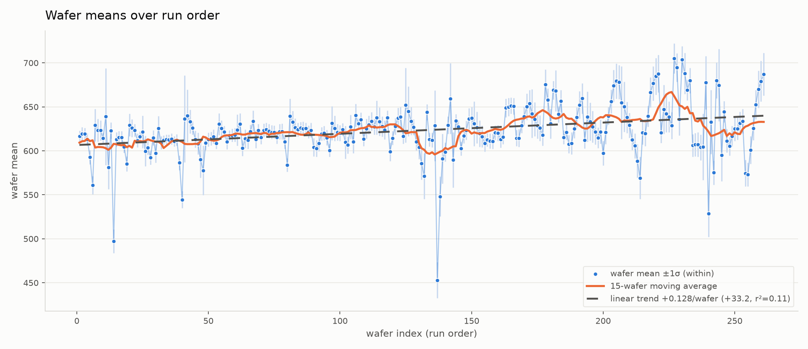

# Within-Wafer and Wafer-to-Wafer Variance Decomposition
Rev. 1 | Created: 2026-09-03 | Updated: 2026-09-03 12:48 CDT

> ANOVA (analysis of variance) 는 관측치의 전체 산포를 몇 개의 원인으로 나누어, 어느 원인이 얼마나 기여하는지 수치로 보이는 방법이다.

측정값이 여러 층으로 묶여 있을 때 각 층이 산포에 얼마나 기여하는지는 눈으로 가려낼 수 없다. ANOVA 는 전체 제곱합을 층별 제곱합으로 쪼개어 이 물음에 답한다. 한 층 안에서 값이 흩어진 정도와 층 사이에서 평균이 벌어진 정도를 각각의 자유도로 나누어 평균제곱으로 만들고, 그 비를 F 통계량으로 삼아 층 사이의 차이가 층 안의 산포만으로 설명되는지 판정한다. 이 문서는 wafer 를 층으로 두어 measurement 산포를 within-wafer 성분과 wafer-to-wafer 성분으로 나눈다.

## 1. Data

측정 자료는 [marathon_13pts.csv](marathon_13pts.csv) 이며 261 행 14 열이다. 한 행이 한 장의 wafer 이고, 열 `wafer_id` 는 `wf0001` 부터 `wf0261` 까지의 일련번호로 파일의 행 순서, 곧 run order 를 나타낸다. 나머지 열 `S1`~`S13` 은 그 wafer 위의 13 개 site 이다. 결측은 없고 전체 관측치는 3393 개이다.

- 전체 site 값: 평균 622.1, 표준편차 32.45, 최소 435.10, 최대 734.68.
- Wafer 평균: 최소 452.9, 최대 705.0, 표준편차 28.70.
- Within-wafer range: 평균 41.32, 최대 123.46.

Wafer 를 run order 로 15 장씩 묶어 그 안의 site 값 분포를 violin 으로 그리면, 분포의 위치와 폭이 함께 움직이는 것이 보인다. 앞쪽 구간의 중앙값은 610 대에 머물다가 뒤쪽 구간에서 650 근처까지 올라가고, 아래로 길게 뻗은 꼬리는 그 구간에 값이 크게 낮은 wafer 가 섞여 있다는 뜻이다.

Fig 1. Distribution of site values in bins of 15 consecutive wafers along run order

## 2. Variance Decomposition

Wafer 를 인자로 둔 일원 ANOVA 로 wafer 간 성분과 wafer 내 성분을 나눈다.

Table 1. One-way ANOVA with wafer as the factor

| Source | SS | df | MS | F | p |
|---|---:|---:|---:|---:|---:|
| Between wafer | 2,783,290 | 260 | 10,705.0 | 42.48 | ~0 |
| Within wafer | 789,202 | 3132 | 252.0 | | |

표의 각 열이 뜻하는 바는 아래와 같다.

- SS: sum of squares. 해당 성분이 만든 편차의 제곱합. Between wafer 는 wafer 평균이 전체 평균에서 벗어난 정도, within wafer 는 site 값이 제 wafer 평균에서 벗어난 정도.
- df: degrees of freedom. 그 제곱합이 담은 독립한 정보의 개수. Wafer 261 장이므로 between 은 260, wafer 마다 site 13 개에서 평균 하나를 뺀 12 를 261 배 하여 within 은 3132.
- MS: mean square. SS 를 df 로 나눈 값이며 분산의 추정치. Within 의 252.0 은 site 한 점의 산포, between 의 10,705.0 은 wafer 평균의 산포에 site 산포가 얹힌 크기.
- F: 두 MS 의 비. 여기서는 10,705.0 / 252.0 = 42.48. wafer 사이에 차이가 없다면 1 근처에 머무는 값.
- p: wafer 사이에 차이가 없다는 가정 아래 그만큼 큰 F 가 나올 확률. 여기서는 0 에 가까워, 차이가 없다는 가정을 버린다.

분산성분은 `sigma_within` = 15.87, `sigma_wafer` = 28.36 이다. 앞의 것은 MS within 의 제곱근이고, 뒤의 것은 between 의 MS 에서 within 의 MS 를 빼고 site 수 13 으로 나눈 뒤 제곱근을 취한 값이다.

Table 2. Variance components

| Component | Sigma | Variance | Share |
|---|---:|---:|---:|
| Wafer-to-wafer | 28.36 | 804.1 | 76.1% |
| Within-wafer | 15.87 | 252.0 | 23.9% |
| Total | 32.50 | 1056.1 | 100% |

두 성분을 더한 32.50 은 section 1 의 관측 표준편차 32.45 와 거의 같으며, 차이는 성분 추정에서 온다.

ICC (intraclass correlation) 는 전체 분산 중 wafer 간 분산이 차지하는 비율로, 804.1 / 1056.1 = 0.761 이다. 값이 1 에 가까울수록 같은 wafer 에서 뽑은 두 site 값이 서로 닮았다는 뜻이고, 0 에 가까울수록 어느 wafer 에서 뽑았는지가 값을 예측하는 데 도움이 되지 않는다는 뜻이다. 0.761 은 site 한 점의 산포 중 76.1% 를 그 점이 놓인 wafer 가 결정한다는 것이므로, 산포를 줄이려면 site 단위 균일도보다 wafer 단위 조건을 먼저 봐야 한다.

## 3. Drift of Wafer Means

Wafer 평균을 run order 로 늘어놓으면 앞쪽의 약 608 에서 뒤쪽의 약 640 까지 오른다. 선형 추세는 wafer 당 +0.128 이고 261 장 누적 +33.2 이며, r² = 0.11, p = 2.7e-08 이다. 추세는 유의하지만 wafer 평균 변동의 11% 만 설명하며, 이동평균을 보면 단조 상승이 아니라 중간의 급락과 뒤쪽의 봉우리 같은 계단이 겹쳐 있다.

Fig 2. Wafer means over run order with a 15-wafer moving average and a linear trend

## 4. Cumulative Standard Deviation Check

처음 n 장의 wafer 평균으로 계산한 표준편차 `stdev_n` 을 n = 3 부터 261 까지 구해, 이것이 `sigma_total`/√13 = 9.01 을 따르는 구간이 있는지 확인했다. 그런 구간은 없다. `stdev_n` 은 n = 5 에서 이미 11.13 이고 그것이 n ≥ 5 구간의 최솟값이며, 이후 18.6 에서 28.7 사이에 머문다.

`sigma_total`/√(13n) 곡선과도 맞지 않는다. 이 곡선은 n = 3 에서 5.20, n = 261 에서 0.56 으로 내려가지만 관측값은 올라가서 끝에서 51 배 벌어지고, 두 곡선이 만나는 곳은 n = 4 하나뿐이다.

관측값을 설명하는 식은 아래와 같다. 여기서 `s_mu` 는 처음 n 장의 wafer 고유 수준의 표준편차이다.

$$\mathrm{stdev}_n = \sqrt{\frac{\sigma_{within}^2}{13} + s_{\mu}^2(1..n)}$$

첫 항 `sigma_within`²/13 = 19.38 은 site 평균화로도 없앨 수 없는 바닥이며, 그 제곱근 4.40 이 Fig 3 의 아래쪽 기준선이다. n = 261 에서 √(28.70² − 4.40²) = 28.36 이 나와 section 2 의 `sigma_wafer` 와 일치한다. 따라서 곡선은 아래로 4.40 에 갇히고 위로 √(`sigma_wafer`² + `sigma_within`²/13) = 28.70 으로 수렴한다.

n 만의 매끄러운 함수로는 설명되지 않는다. n ≥ 10 구간에서 상수 모형의 R² 는 0, random walk 모형의 R² 는 0.02, 선형 drift 모형의 R² 는 0.11 이며, 실제 오르내림은 연속한 wafer 묶음이 만드는 계단에서 온다.

Fig 3. Cumulative standard deviation of wafer means against the floor, the asymptote, and the 1/√(13n) curve

## 5. Wafers with Inflated Within-Wafer Spread

각 wafer 의 `s_i`² 를 pooled MS within = 251.98 과 χ² (df = 12) 로 비교해, Bonferroni 보정으로 (기준 p 값 1.9e-04) 유의한 wafer 18 장을 골랐다. 이들의 표준오차 `s_i`/√13 은 7.9 에서 15.3 으로 전체 중앙값 3.18 의 2.5 배에서 5 배이다.

Table 3. Top five wafers by within-wafer standard error

| Wafer | Mean | Sd within | SE | Worst site | Shift when the worst site is dropped |
|---|---:|---:|---:|---|---:|
| wf0011 | 638.9 | 55.04 | 15.27 | S1 | 6.52 |
| wf0041 | 636.4 | 49.52 | 13.73 | S1 | 6.35 |
| wf0125 | 651.8 | 42.39 | 11.76 | S1 | 5.48 |
| wf0207 | 654.7 | 41.36 | 11.47 | S1 | 5.35 |
| wf0244 | 674.5 | 41.12 | 11.41 | S1 | 5.01 |

Table 3 의 다섯 장은 모두 S1 이 원인이고, 18 장 전체로는 S1 또는 S2 한 점이 원인이다. 그 site 를 빼면 wafer 평균이 4 에서 6.5 만큼 움직인다. 이 이동폭은 `sigma_wafer` = 28.36 에 비하면 작으므로, 이 wafer 들을 빼도 wafer-to-wafer 가 지배하는 구조는 바뀌지 않는다.

Fig 4. Wafer means with the 18 wafers whose within-wafer variance is inflated

## 6. Conclusion

- Site 한 점 기준 분산 배분: wafer-to-wafer 76.1%, within-wafer 23.9%, ICC 0.761.
- Wafer 평균 분산 28.70² = 823.5 중 28.36² = 804.1 (97.6%) 이 wafer 고유 수준, 19.38 (2.4%) 이 site 평균화 후 남는 within 기여.
- 산포 축소의 우선 대상: wafer 단위 조건.
- `sigma_total`/√13 이나 `sigma_total`/√(13n) 은 이 자료의 wafer 평균 산포를 설명하지 못함.

---

## Appendix A. Terminology

- **ANOVA**: analysis of variance. 전체 제곱합을 원인별 제곱합으로 나누고, 각각을 자유도로 나눈 평균제곱의 비로 원인의 유의성을 판정하는 방법.
- **ICC**: intraclass correlation. 전체 분산 중 group 간 분산이 차지하는 비율. 같은 group 에서 뽑은 두 관측치가 얼마나 닮았는지를 0 에서 1 사이로 나타내며, 이 문서의 group 은 wafer 이다.
- **run order**: 자료 파일의 행 순서. 측정 순서를 따르므로 시간 축으로 사용.
- **site**: 한 wafer 위의 측정 지점. 열 `S1`~`S13` 에 해당.
- **w2w**: wafer-to-wafer. wafer 사이의 변동.
- **WiW**: within-wafer. 한 wafer 안 site 사이의 변동.
