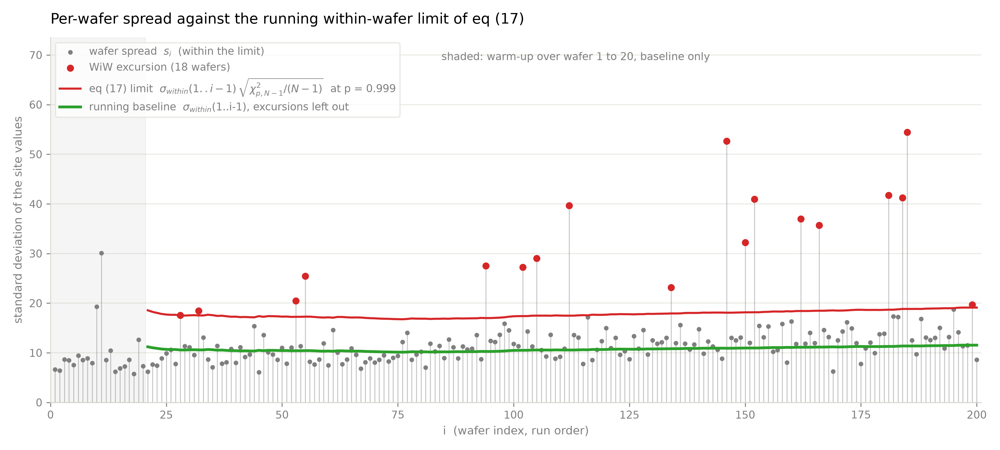

# Within-Wafer and Wafer-to-Wafer Variance Decomposition
Rev. 47 | Created: 2026-09-01 | Updated: 2026-09-03 18:58 CDT

> ANOVA (analysis of variance) 는 관측치의 전체 산포를 몇 개의 원인으로 나누어, 어느 원인이 얼마나 기여하는지 수치로 보이는 방법이다.

측정값이 여러 층으로 묶여 있을 때 각 층이 산포에 얼마나 기여하는지는 눈으로 가려낼 수 없다. ANOVA 는 전체 제곱합을 층별 제곱합으로 쪼개어 이 물음에 답한다. 한 층 안에서 값이 흩어진 정도와 층 사이에서 평균이 벌어진 정도를 각각의 자유도로 나누어 평균제곱으로 만들고, 그 비를 F 통계량으로 삼아 층 사이의 차이가 층 안의 산포만으로 설명되는지 판정한다. 이 문서는 wafer 를 층으로 두어 measurement 산포를 within-wafer 성분과 wafer-to-wafer 성분으로 나눈다.

## 1. Theory

### 1.1 Notation

Wafer $`K`$ 장을 장당 $`N`$ 개 site 에서 재면 관측치는 $`M = K N`$ 개이다.

- $`X_{ij}`$: $`i`$ 번째 wafer 의 $`j`$ 번째 site 측정값.
- $`\bar{X}_i`$: $`i`$ 번째 wafer 의 평균.
- $`\bar{X}`$: 전체 $`M`$ 개의 총평균.
- $`s_i^2`$: $`i`$ 번째 wafer 안 site 값의 표본분산. within-wafer 성분.
- $`S_{\mathrm{total}}^2`$: 전체 $`M`$ 개의 표본분산.

### 1.2 Decomposition Identity

전체 제곱합은 wafer 안의 편차와 wafer 평균의 편차로 남김없이 갈라진다. 이것이 ANOVA 가 딛는 항등식이다.

$$\mathrm{SST} = \mathrm{SSW} + \mathrm{SSB} \hspace{19em} (1)$$

- SST: total sum of squares. 전체 변동. 모든 관측치가 총평균에서 벗어난 정도.
- SSW: within-group sum of squares. wafer 내 변동. 각 site 값이 제 wafer 평균에서 벗어난 정도. 모형이 설명하지 못하고 남은 몫이므로 SSE (error sum of squares) 로도 쓴다.
- SSB: between-group sum of squares. wafer 간 변동. 각 wafer 평균이 총평균에서 벗어난 정도. 인자가 설명하는 몫이므로 SSA (factor sum of squares) 로도 쓴다.

세 제곱합을 풀어쓰면 아래와 같다.

$$\sum_{i}\sum_{j} (X_{ij} - \bar{X})^2 = \sum_{i}\sum_{j} (X_{ij} - \bar{X}_i)^2 + N \sum_{i} (\bar{X}_i - \bar{X})^2 \hspace{19em} (2)$$

각 제곱합을 제 자유도로 나누면 평균제곱 (mean square, MS) 이 되고, 그것이 곧 분산이다. 우변의 두 항을 각각 within-wafer 분산의 평균과 wafer 평균의 분산으로 바꾸면 아래와 같다.

$$\overline{S_{\mathrm{within}}^2} = \frac{1}{K} \sum_{i=1}^{K} s_i^2, \qquad S_{\mathrm{between}}^2 = \frac{1}{K-1} \sum_{i=1}^{K} (\bar{X}_i - \bar{X})^2 \hspace{19em} (3)$$

$$S_{\mathrm{total}}^2 = \frac{K(N-1)}{M-1} \overline{S_{\mathrm{within}}^2} + \frac{N(K-1)}{M-1} S_{\mathrm{between}}^2 \hspace{19em} (4)$$

두 계수는 $`K`$ 와 $`N`$ 이 커질수록 1 에 가까워지므로, 흔히 쓰는 형태는 계수를 떼어낸 아래 근사식이다. 계수가 1 로 가는 과정은 [Appendix B](#appendix-b-limits-of-the-decomposition-coefficients) 에 적었다.

$$S_{\mathrm{total}} \approx \sqrt{\overline{S_{\mathrm{within}}^2} + S_{\mathrm{between}}^2} \hspace{19em} (5)$$

### 1.3 Interpretation

- $`S_{\mathrm{between}}^2 = 0`$ 일 때: wafer 평균이 모두 같은 경우이며, 전체 표준편차는 wafer 내 표준편차의 제곱평균제곱근으로 줄어든다.
- $`S_{\mathrm{between}}^2 \gt 0`$ 일 때: wafer 내 표준편차가 아무리 작아도 wafer 평균이 서로 벌어져 있으면 전체 표준편차는 개별 wafer 의 표준편차보다 훨씬 커진다.
- 공정 관리에서의 쓰임: 전체 산포를 wafer 내 균일도 문제와 wafer 간 재현성 문제로 갈라 원인을 찾는 것.

## 2. Data

측정 자료는 [example.csv](example.csv) 이며 261 행 14 열이다. 한 행이 한 장의 wafer 이고, 열 `wafer_id` 는 `wf0001` 부터 `wf0261` 까지의 일련번호로 파일의 행 순서, 곧 run order 를 나타낸다. 나머지 열 `S1`~`S13` 은 그 wafer 위의 13 개 site 이다. 결측은 없고 전체 관측치는 3393 개이다.

- 전체 site 값: 평균 622.1, 표준편차 32.45, 최소 435.10, 최대 734.68.
- Wafer 평균: 최소 452.9, 최대 705.0, 표준편차 28.70.
- Within-wafer range: 평균 41.32, 최대 123.46.
- Wafer uniformity $`s_i / \mu_i`$: 중앙값 1.81%, 최소 0.87% (wf0033), 최대 8.62% (wf0011).

Wafer 한 장을 violin 하나로 두고 run order 로 늘어놓으면, 분포의 위치와 폭이 wafer 마다 함께 움직이는 것이 보인다. 앞쪽 wafer 는 610 대에 모여 있다가 뒤쪽에서 650 근처까지 올라가고, 아래로 홀로 처진 wafer 는 그 자리에서 값이 크게 낮았다는 뜻이다. wafer 당 site 가 13 개뿐이라 violin 의 모양 자체는 거칠어서 site 값 13 점을 그대로 겹쳐 찍었다. 겹쳐 그린 선은 wafer 평균을 이은 것으로, 위치가 wafer 마다 얼마나 튀는지 보여준다.

Fig 1. Distribution of the site values on each wafer along run order, with the wafer means traced

## 3. Variance Decomposition

Wafer 를 인자로 둔 일원 ANOVA 로 wafer 간 성분과 wafer 내 성분을 나눈다.

Table 1. One-way ANOVA with wafer as the factor

| Source | SS | df | MS | F | p |
|---|---:|---:|---:|---:|---:|
| Between wafer | 2,783,290 | 260 | 10,705.0 | 42.48 | ~0 |
| Within wafer | 789,202 | 3132 | 252.0 | | |

표의 각 열이 뜻하는 바는 아래와 같다.

- SS: sum of squares. Between wafer 행이 section 1.2 의 SSB, within wafer 행이 SSW 이며, 둘을 더하면 SST 3,572,492 가 된다.
- df: degrees of freedom. 그 제곱합이 담은 독립한 정보의 개수. Wafer 261 장이므로 between 은 260, wafer 마다 site 13 개에서 평균 하나를 뺀 12 를 261 배 하여 within 은 3132.
- MS: mean square. SS 를 df 로 나눈 값이며 분산의 추정치. Within 의 252.0 은 site 한 점의 산포, between 의 10,705.0 은 wafer 평균의 산포에 site 산포가 얹힌 크기.
- F: 두 MS 의 비. 여기서는 10,705.0 / 252.0 = 42.48. wafer 사이에 차이가 없다면 1 근처에 머무는 값.
- p: wafer 사이에 차이가 없다는 가정 아래 그만큼 큰 F 가 나올 확률. 여기서는 0 에 가까워, 차이가 없다는 가정을 버린다.

분산성분은 `sigma_within` = 15.87, `sigma_between` = 28.36 이다. 앞의 것은 MS within 의 제곱근이고, 뒤의 것은 between 의 MS 에서 within 의 MS 를 빼고 site 수 13 으로 나눈 뒤 제곱근을 취한 값이다.

Table 2. Variance components

| Component | Sigma | Variance | Share |
|---|---:|---:|---:|
| Wafer-to-wafer | 28.36 | 804.1 | 76.1% |
| Within-wafer | 15.87 | 252.0 | 23.9% |
| Total | 32.50 | 1056.1 | 100% |

두 성분을 더한 32.50 은 section 2 의 관측 표준편차 32.45 와 0.05 만큼 다르다. section 1.2 에서 본 대로 두 성분의 단순 합은 근사식이고, 정확한 관계에는 1 보다 작은 계수가 붙기 때문이다.

ICC (intraclass correlation) 는 전체 분산 중 wafer 간 분산이 차지하는 비율로, 804.1 / 1056.1 = 0.761 이다. 값이 1 에 가까울수록 같은 wafer 에서 뽑은 두 site 값이 서로 닮았다는 뜻이고, 0 에 가까울수록 어느 wafer 에서 뽑았는지가 값을 예측하는 데 도움이 되지 않는다는 뜻이다. 0.761 은 site 한 점의 산포 중 76.1% 를 그 점이 놓인 wafer 가 결정한다는 것이므로, 산포를 줄이려면 site 단위 균일도보다 wafer 단위 조건을 먼저 봐야 한다.

Table 2 의 두 성분은 261 장 전체를 한 번에 본 값이다. Wafer 한 장에서는 wafer 간 변동을 잴 수 없으므로, 창의 왼쪽 끝을 첫 wafer 에 고정하고 오른쪽 끝만 한 장씩 늘리며 (expanding window) 창마다 두 성분을 다시 구하면 그 값이 몇 장째에 자리를 잡는지 보인다. 두 성분 모두 앞쪽 몇십 장에서 크게 흔들리다가 (w2w 는 $`n = 14`$ 에서 36.55 까지 치솟는다) 표본이 쌓이면서 잦아들어, $`n = 261`$ 에서 각각 28.36 과 15.87 로 Table 2 의 값에 닿는다. $`n \ge 100`$ 에서 WiW 는 12.78~15.88 안에 머물러 일찍 안정되지만, w2w 는 18.28 에서 28.36 으로 계속 올라간다 — 뒤쪽 wafer 가 앞쪽과 다른 수준에 있었다는 뜻이며, 그래서 wafer 간 산포는 표본을 더 모을수록 커진다.

## 4. Cumulative Standard Deviation and WiW Excursion Detection

### 4.1 Formula and Its Closed Forms

처음 $`n`$ 장의 wafer 평균으로 계산한 표준편차 $`\sigma_{\mu_n}`$ 을 구하려고 한다. 측정값을 wafer 간의 변동과 wafer 내의 변동으로 가르면 그 값이 따라 나온다.  Wafer $`i`$ 의 고유 수준을 $`\mu_i`$, site 오차를 $`e_{ij}`$ 로 두면 측정값은 두 항의 합이다.

$$X_{ij} = \mu_i + e_{ij}, \qquad \mathrm{Var}(e_{ij}) = \sigma_{within}^2 \hspace{19em} (6)$$

Wafer 평균에서는 site 오차가 $`N`$ 개 평균되므로 그 분산이 $`N`$ 분의 1 로 줄어든다.

$$\bar{X}_i = \mu_i + \bar{e}_i, \qquad \mathrm{Var}(\bar{e}_i) = \frac{\sigma_{within}^2}{N} \hspace{19em} (7)$$

$`\mu_i`$ 와 $`\bar{e}_i`$ 는 독립이므로 처음 $`n`$ 장의 wafer 평균의 분산은 두 분산의 합이고, 여기서 $`s_{\mu}(1..n)`$ 은 처음 $`n`$ 장의 wafer 고유 수준의 표준편차이다.

$$\mathrm{Var}(\bar{X}_1, \dots, \bar{X}_n) = s_{\mu}^2(1..n) + \frac{\sigma_{within}^2}{N} \hspace{19em} (8)$$

제곱근을 취하면 관측값을 설명하는 식이 된다.

$$\sigma_{\mu_n} = \sqrt{\frac{\sigma_{within}^2}{N} + s_{\mu}^2(1..n)} \hspace{19em} (9)$$

식 (9) 의 $`s_{\mu}(1..n)`$ 이 전체 wafer-to-wafer 성분과 같을 때, 곧 $`s_{\mu}^2(1..n) = \sigma_{between}^2 = S_{\mathrm{total}}^2 - \sigma_{within}^2`$ 일 때는 식 (9) 를 전체 표준편차만으로 다시 쓸 수 있다. 처음 $`n`$ 장이 전체를 대표하면 성립하며, $`n = K`$ 는 정의상 그 조건을 만족한다.

$$\sigma_{\mu_K} = \sqrt{S_{\mathrm{total}}^2 - \frac{N-1}{N} \sigma_{within}^2} = S_{\mathrm{total}} \sqrt{\mathrm{ICC} + \frac{1 - \mathrm{ICC}}{N}} \hspace{19em} (10)$$

Table 2 의 wafer-to-wafer 성분 $`\sigma_{between}`$ 에 대해 $`\sigma_{within}^2 = S_{\mathrm{total}}^2 - \sigma_{between}^2`$ 이므로, 같은 식을 within 대신 between 으로도 적을 수 있고, 그 과정은 [Appendix C](#appendix-c-derivation-of-the-between-component-form) 에 적었다.

$$\sigma_{\mu_K} = \sqrt{\frac{S_{\mathrm{total}}^2 + (N-1) \sigma_{between}^2}{N}} = S_{\mathrm{total}} \sqrt{\frac{1 + (N-1) \mathrm{ICC}}{N}} \hspace{19em} (11)$$

Wafer 평균이 모두 같아 $`\sigma_{between} = 0`$, 곧 ICC = 0 이면 식 (11) 의 둘째 항이 사라져 wafer 평균의 산포는 표준오차만 남는다.

$$\sigma_{\mu_K} = \frac{S_{\mathrm{total}}}{\sqrt{N}} \hspace{19em} (12)$$

이것이 흔히 기대하는 $`\sqrt{N}`$ 법칙이며, 이 자료에서는 32.50/√13 = 9.01 로 관측한 28.70 의 3 분의 1 도 되지 않는다.

### 4.2 W2W Detection Point

식 (9) 의 두 항은 서로 다른 것을 잰다. 왼쪽 항 $`\sigma_{within}(1..n)/\sqrt{N}`$ 은 site 를 $`N`$ 개 평균해도 wafer 평균에 남는 측정 잡음이며, wafer 가 모두 같아도 사라지지 않는 바닥이다. 오른쪽 항 $`s_{\mu}(1..n)`$ 은 wafer 마다 다른 고유 수준의 산포, 곧 wafer 간의 변동 그 자체이다. 관측되는 wafer 평균의 산포는 이 둘의 제곱합의 제곱근이므로, 둘 중 어느 쪽이 큰가가 그 산포를 무엇으로 읽을지를 정한다.

$`S_{\mathrm{total}} = 32.50`$, $`\sigma_{within} = 15.87`$, $`\sigma_{between} = 28.36`$, ICC = 0.761 을 넣으면 식 (10) 과 식 (11) 이 모두 28.70 으로, 관측한 $`\sigma_{\mu_{261}}`$ 과 같다. 앞쪽 $`n`$ 장에 drift 나 계단이 섞여 $`s_{\mu}(1..n)`$ 이 $`\sigma_{between}`$ 과 어긋나면 그 $`n`$ 에서는 이렇게 쓸 수 없다.

Fig 2 는 식 (9) 의 두 항을 함께 보인다. 식 (9) 자체를 그리면 $`s_{\mu}(1..n)`$ 을 자료에서 $`\sqrt{\sigma_{\mu_n}^2 - \sigma_{within}^2(1..n)/N}`$ 로 얻으므로 관측 곡선과 겹치며, 대신 그 두 항을 나눠 그리면 관측값이 둘의 제곱합의 제곱근임이 보인다. 모든 곡선은 각 $`n`$ 에서 처음 $`n`$ 장만으로 계산했다. $`n`$ 뒤의 wafer 를 끌어다 쓰면 그 $`n`$ 에서 아직 알 수 없는 값을 쓰는 것이 되기 때문이며, 그래서 왼쪽 항도 상수가 아니라 곡선이다. $`\sigma_{within}(1..n)`$ 은 처음 5 장에서 7.28 로 낮았다가 $`n = 50`$ 에서 15.75, $`n = K`$ 에서 15.87 로 자리를 잡는다.

이 자료는 $`N = 13`$ 이므로 왼쪽 항의 제곱은 `sigma_within`²/13 = 19.38 로 수렴하고, 그 제곱근 4.40 이 Fig 2 에서 왼쪽 항이 다다르는 값이다. $`n = 261`$ 에서 √(28.70² − 4.40²) = 28.36 이 나와 section 3 의 `sigma_between` 과 일치한다. 따라서 관측 곡선은 아래로 4.40 에 갇히고 위로 √(`sigma_between`² + `sigma_within`²/13) = 28.70 으로 수렴한다.

Fig 2. Cumulative standard deviation of the wafer means with the two terms of equation (9) and the w2w detection point, each computed from the first n wafers only

Fig 2 에서 그 크기가 뒤집히는 곳을 w2w detection point 라 부르며, 오른쪽 항이 관측값의 98% 를 넘는 첫 $`n`$ 으로 잡으면 이 자료에서는 $`n = 5`$ 이다 ($`n = 4`$ 에서 74%, $`n = 5`$ 에서 98%). 그 앞의 $`n \le 4`$ 에서는 오른쪽 항이 왼쪽 항과 같은 크기 ($`n = 4`$ 에서 2.18 대 1.97) 이고 $`n = 3`$ 에서는 관측값이 왼쪽 항보다도 작아 아예 정의되지 않으니, 그 구간의 흔들림은 측정 잡음만으로 설명되고 wafer 사이에 진짜 차이가 있는지 가릴 수 없다. $`n = 5`$ 부터는 오른쪽 항이 10.95 로 왼쪽 항 2.02 의 5.4 배가 되고 $`n = 6`$ 에서 10 배를 넘어, 이후 관측 곡선은 사실상 wafer 고유 수준의 산포 그 자체이다.

공정 관리로 옮기면 w2w detection point 는 판단에 필요한 최소 표본이다. 그 앞에서 잰 산포는 wafer-to-wafer 를 볼 수 없으므로 그 값으로 관리 한계선을 세우면 산포를 크게 낮춰 잡게 되고, 이 점을 넘어서야 "이 산포는 site 균일도가 아니라 wafer 단위 조건에서 온다" 는 판정이 성립한다. 거꾸로 그 앞 구간에서 산포가 작게 나왔다고 공정이 안정된 것으로 읽으면 안 된다 — 아직 볼 수 있는 것이 측정 잡음뿐이기 때문이다.

### 4.3 WiW Excursion Detection

Wafer 한 장의 산포가 그때까지 본 wafer 내 산포에서 크게 벗어나면 그 wafer 를 WiW excursion 으로 본다. Wafer $`i`$ 를 판정할 때 앞선 wafer 만으로 구한 $`\sigma_{within}(1..i-1)`$ 을 기준선으로 두고, 그 wafer 의 site 표준편차 $`s_i`$ 가 아래 한계를 넘는지 본다. 한계는 표본표준편차의 분포에서 나오며, 유도는 [Appendix D](#appendix-d-derivation-of-the-screening-limit) 에 적었다.

$$s_i \gt \sigma_{within}(1..i-1) \sqrt{\frac{\chi^2_{p,\, N-1}}{N-1}} \hspace{19em} (13)$$

Fig 3 이 그 판정이다. 회색 점이 wafer 한 장의 $`s_i`$, 초록 선이 기준선, 빨간 선이 식 (13) 의 한계이고, 한계를 넘은 wafer 를 빨간 점으로 표시했다. 세 값 모두 site 값의 표준편차라 단위가 같으므로 오른쪽 축을 따로 두지 않고 한 축에 겹쳐 그렸다.

Fig 3. Site value spread of each wafer against the running baseline and the screening limit of equation (13)

$`N = 13`$, $`p = 0.999`$ 에서 계수는 1.656 이고, 판정한 241 장 중 42 장 (17.4%) 이 한계를 넘는다. 기준선은 판정을 시작하는 wafer 21 에서 16.44 로 출발해 11.14 까지 내려갔다가 12.07 로 끝나고, 한계는 그에 따라 18.45 에서 27.23 사이를 움직인다. 한계를 처음 넘는 것은 wf0041 로 $`s_i`$ = 49.52 가 그 시점의 한계 22.26 의 2.22 배이며, 가장 크게 벗어난 wf0125 는 42.39 로 한계 18.67 의 2.27 배이다. $`p`$ 는 오경보를 얼마나 허용할지로 정한다. 241 번 판정하므로 $`p = 0.999`$ 에서 우연히 걸리는 wafer 는 0.24 장이지만, $`p = 0.99`$ 로 낮추면 2.4 장이 되어 걸린 wafer 중 몇 장은 헛것이 된다.

판정된 wafer 는 기준선 갱신에서 뺀다. 그대로 담으면 excursion 이 기준선을 끌어올려 뒤의 excursion 을 가리므로, 이상이 잦을수록 자가 스스로 무뎌진다. 261 장을 다 담은 pooled `sigma_within` 15.87 과 견주면 이렇게 얻은 기준선은 12.07 로 3.8 이 낮은데, 그 차이가 excursion 이 pooled 값에 실어 놓은 몫이다.

처음 20 장은 기준선을 쌓는 데만 쓰고 판정하지 않는다. 표본 몇 장 위에 선 기준선은 그 자체가 크게 흔들려 판정이 우연에 좌우되기 때문이며, 그 대가로 uniformity 가 가장 나빴던 wf0011 이 $`s_i`$ = 55.04 로 이 자료에서 가장 큰 산포인데도 판정 대상에서 빠진다.

---

## Appendix A. Terminology

- **ANOVA**: analysis of variance. 전체 제곱합을 원인별 제곱합으로 나누고, 각각을 자유도로 나눈 평균제곱의 비로 원인의 유의성을 판정하는 방법.
- **ICC**: intraclass correlation. 전체 분산 중 group 간 분산이 차지하는 비율. 같은 group 에서 뽑은 두 관측치가 얼마나 닮았는지를 0 에서 1 사이로 나타내며, 이 문서의 group 은 wafer 이다.
- **run order**: 자료 파일의 행 순서. 측정 순서를 따르므로 시간 축으로 사용.
- **running baseline**: wafer 한 장을 판정할 때 쓰는 기준선. 그 wafer 앞에 있으면서 excursion 으로 판정되지 않은 wafer 만으로 구한 within-wafer 성분이다.
- **site**: 한 wafer 위의 측정 지점. 열 `S1`~`S13` 에 해당.
- **Var**: variance. 값이 제 평균에서 벗어난 정도를 제곱하여 평균한 값이며, 표준편차의 제곱이다. 관측 수 $`m`$ 인 표본에서는 $`\mathrm{Var}(Y) = \frac{1}{m-1} \sum_{i=1}^{m} (Y_i - \bar{Y})^2`$ 로 계산한다.
- **sigma_between**: wafer 간 분산성분의 표준편차. Table 2 의 wafer-to-wafer 값이며, wafer 평균의 표본표준편차 $`S_{\mathrm{between}}`$ 과 달리 site 오차의 몫을 뺀 값이다.
- **sigma_within**: wafer 내 분산성분의 표준편차. MS within 의 제곱근이다.
- **w2w**: wafer-to-wafer. wafer 사이의 변동.
- **w2w detection point**: 오른쪽 항이 관측된 wafer 평균 산포의 98% 를 넘는 첫 $`n`$. 그 앞에서는 wafer 사이의 차이가 측정 잡음에 묻혀 분리되지 않는다.
- **WiW**: within-wafer. 한 wafer 안 site 사이의 변동.
- **WiW excursion**: site 표준편차가 running baseline 이 세운 한계를 넘은 wafer.

## Appendix B. Limits of the Decomposition Coefficients

Section 1.2 의 두 계수를 $`a`$ 와 $`b`$ 로 두면 아래와 같다.

$$a = \frac{K(N-1)}{M-1} = \frac{KN-K}{KN-1}, \qquad b = \frac{N(K-1)}{M-1} = \frac{KN-N}{KN-1} \hspace{19em} (14)$$

분자와 분모가 모두 $`KN`$ 에서 시작하므로, 1 에서 얼마나 모자라는지를 보는 편이 빠르다.

$$1 - a = \frac{K-1}{KN-1}, \qquad 1 - b = \frac{N-1}{KN-1} \hspace{19em} (15)$$

두 결손항은 각각 한쪽 크기에만 매인다. $`1-a`$ 의 분자와 분모를 $`K`$ 로, $`1-b`$ 의 분자와 분모를 $`N`$ 으로 나누면 아래 꼴이 된다.

$$1 - a = \frac{1 - 1/K}{N - 1/K}, \qquad 1 - b = \frac{1 - 1/N}{K - 1/N} \hspace{19em} (16)$$

$`K`$ 를 아무리 키워도 $`1-a`$ 는 $`1/N`$ 에서 멈추고, $`N`$ 을 아무리 키워도 $`1-b`$ 는 $`1/K`$ 에서 멈춘다.

$$\lim_{K \to \infty} (1 - a) = \frac{1}{N}, \qquad \lim_{N \to \infty} (1 - b) = \frac{1}{K} \hspace{19em} (17)$$

곧 한쪽만 키운 극한에서 계수는 1 이 아니라 아래 값에 멈춘다.

$$\lim_{K \to \infty} a = 1 - \frac{1}{N}, \qquad \lim_{N \to \infty} b = 1 - \frac{1}{K} \hspace{19em} (18)$$

따라서 $`a`$ 를 1 로 보내는 것은 wafer 당 site 수 $`N`$ 이고, $`b`$ 를 1 로 보내는 것은 wafer 수 $`K`$ 이며, 둘이 함께 커져야 두 계수가 같이 1 이 된다.

$$\lim_{N \to \infty} a = 1, \qquad \lim_{K \to \infty} b = 1, \qquad \lim_{K, N \to \infty} S_{\mathrm{total}}^2 = \overline{S_{\mathrm{within}}^2} + S_{\mathrm{between}}^2 \hspace{19em} (19)$$

이 문서의 $`K = 261`$, $`N = 13`$ 에서는 $`1 - a = 260/3392 = 0.0767`$ 로 $`1/N = 0.0769`$ 에 거의 같고, $`1 - b = 12/3392 = 0.0035`$ 로 $`1/K = 0.0038`$ 에 거의 같다. 즉 $`b`$ 는 이미 1 로 보아도 되지만 $`a`$ 는 7.7% 모자라며, site 를 13 개만 재는 한 이 결손은 wafer 를 아무리 더 재도 줄지 않는다. 이 자료에서 $`\overline{S_{\mathrm{within}}^2} = 251.98`$ 과 $`S_{\mathrm{between}}^2 = 823.46`$ 을 그냥 더하면 $`S_{\mathrm{total}} = 32.79`$ 가 되어 관측값 32.45 를 넘지만, 두 계수를 붙이면 관측값과 같아진다.

## Appendix C. Derivation of the Between-Component Form

식 (10) 은 within 성분으로 적혀 있다.

$$\sigma_{\mu_K}^2 = S_{\mathrm{total}}^2 - \frac{N-1}{N} \sigma_{within}^2 \hspace{19em} (20)$$

성분 분해에서 $`S_{\mathrm{total}}^2 = \sigma_{within}^2 + \sigma_{between}^2`$ 이므로 within 성분을 나머지 둘로 바꿀 수 있다.

$$\sigma_{within}^2 = S_{\mathrm{total}}^2 - \sigma_{between}^2 \hspace{19em} (21)$$

이를 대입하고 $`S_{\mathrm{total}}^2`$ 의 계수를 정리하면 아래와 같다.

$$\sigma_{\mu_K}^2 = S_{\mathrm{total}}^2 \left(1 - \frac{N-1}{N}\right) + \frac{N-1}{N} \sigma_{between}^2 = \frac{S_{\mathrm{total}}^2 + (N-1) \sigma_{between}^2}{N} \hspace{19em} (22)$$

ICC 의 정의 $`\mathrm{ICC} = \sigma_{between}^2 / S_{\mathrm{total}}^2`$ 를 넣어 $`\sigma_{between}^2`$ 을 지우면 두 번째 형태가 나오고, 제곱근을 취한 것이 식 (11) 이다.

$$\sigma_{\mu_K}^2 = S_{\mathrm{total}}^2 \frac{1 + (N-1) \mathrm{ICC}}{N} \hspace{19em} (23)$$

$`N = 1`$ 이면 두 형태 모두 $`\sigma_{\mu_K} = S_{\mathrm{total}}`$ 이 되고, $`N`$ 이 커지면 $`\sigma_{\mu_K}`$ 는 $`\sigma_{between}`$ 으로 수렴한다. site 를 많이 잴수록 wafer 평균에서 within 성분이 지워진다는 뜻이다.

## Appendix D. Derivation of the Screening Limit

아래에서 $`i`$ 는 wafer 번호, $`j`$ 는 그 wafer 위의 site 번호로 section 1.1 의 표기를 그대로 쓴다. 곧 $`X_{ij}`$ 는 wafer $`i`$ 의 $`j`$ 번째 site 측정값이고, $`\bar{X}_i`$ 는 그 wafer 의 평균, $`s_i^2`$ 은 그 wafer 안 site 값의 표본분산이다. 한 wafer 안의 site 값이 서로 독립이고 같은 정규분포를 따른다고 둔다.

$$X_{ij} \sim \mathcal{N}(\mu_i,\ \sigma_{within}^2), \qquad s_i^2 = \frac{1}{N-1} \sum_{j=1}^{N} (X_{ij} - \bar{X}_i)^2 \hspace{19em} (24)$$

카이제곱 분포는 서로 독립인 표준정규 변수를 제곱해 더한 것의 분포이고, 더한 개수가 그 자유도이다. 그러므로 $`s_i^2`$ 이 카이제곱을 따르는지는 그것을 표준정규의 제곱합으로 적을 수 있는지의 문제가 된다. 측정값에서 그 wafer 의 수준을 빼고 표준편차로 나누면 표준정규가 된다.

$$Z_{ij} = \frac{X_{ij} - \mu_i}{\sigma_{within}} \sim \mathcal{N}(0, 1) \hspace{19em} (25)$$

$`X_{ij} - \bar{X}_i = \sigma_{within}(Z_{ij} - \bar{Z}_i)`$ 이므로 식 (24) 의 제곱합은 $`Z`$ 의 제곱합으로 바뀌고, 제곱을 풀어 정리하면 표준정규 제곱합에서 평균의 몫을 뺀 꼴이 된다.

$$\frac{(N-1) s_i^2}{\sigma_{within}^2} = \sum_{j=1}^{N} (Z_{ij} - \bar{Z}_i)^2 = \sum_{j=1}^{N} Z_{ij}^2 - N \bar{Z}_i^2 \hspace{19em} (26)$$

우변의 첫 항은 표준정규 $`N`$ 개의 제곱합이므로 정의에 따라 $`\chi^2_N`$ 이다. $`\bar{Z}_i`$ 는 평균 0, 분산 $`1/N`$ 의 정규분포를 따라 $`\sqrt{N}\,\bar{Z}_i`$ 가 표준정규이므로 둘째 항은 $`\chi^2_1`$ 이다. 정규 표본에서 표본평균과 표본분산은 서로 독립이라 두 몫이 겹치지 않으므로, 자유도는 그대로 빼진다.

$$\frac{(N-1) s_i^2}{\sigma_{within}^2} \sim \chi^2_{N-1} \hspace{19em} (27)$$

자유도가 $`N`$ 이 아니라 $`N-1`$ 인 까닭은 편차 $`X_{ij} - \bar{X}_i`$ 가 합이 0 이라는 제약 하나에 묶여 $`N`$ 개 중 $`N-1`$ 개만 자유롭기 때문이다.

$`\chi^2_{p,\,N-1}`$ 을 자유도 $`N-1`$ 인 카이제곱 분포의 $`p`$ 분위, 곧 그보다 작을 확률이 $`p`$ 인 점으로 두면, 식 (27) 의 좌변이 그 점을 넘을 확률은 나머지인 $`1-p`$ 이다.

$$P\left( \frac{(N-1) s_i^2}{\sigma_{within}^2} \gt \chi^2_{p,\, N-1} \right) = 1 - p \hspace{19em} (28)$$

괄호 안을 $`s_i`$ 에 대해 풀고 참값 $`\sigma_{within}`$ 자리에 running baseline 을 놓으면 식 (13) 이 된다. 곧 식 (13) 을 넘은 wafer 는, 그 wafer 의 산포가 기준선과 같았다면 $`1-p`$ 의 확률로만 나올 값을 낸 wafer 이다.

기준선은 참값이 아니라 앞선 wafer 로 추정한 값이므로, 엄밀하게는 두 분산의 비가 F 분포를 따른다. 기준선이 wafer $`m`$ 장 위에 서 있으면 그 자유도는 $`\nu = m(N-1)`$ 이다.

$$\frac{s_i^2}{\sigma_{within}^2(1..i-1)} \sim F(N-1,\ \nu) \hspace{19em} (29)$$

$`\nu`$ 가 커지면 $`F(N-1, \nu)`$ 의 $`p`$ 분위는 $`\chi^2_{p,\,N-1}/(N-1)`$ 로 수렴하므로 식 (13) 을 그대로 쓸 수 있다. 이 자료의 $`N = 13`$, $`p = 0.999`$ 에서 계수는 카이제곱으로 1.656 이고, 판정을 시작하는 wafer 21 에서 $`\nu = 240`$ 을 넣은 F 로는 1.696, 마지막 wafer 에서는 1.660 이다. 곧 판정 초반에 한계를 2.4% 낮게 잡는 것이 카이제곱을 쓰는 대가이다.
