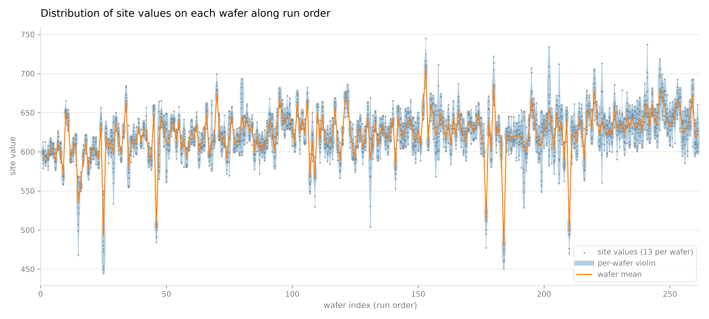
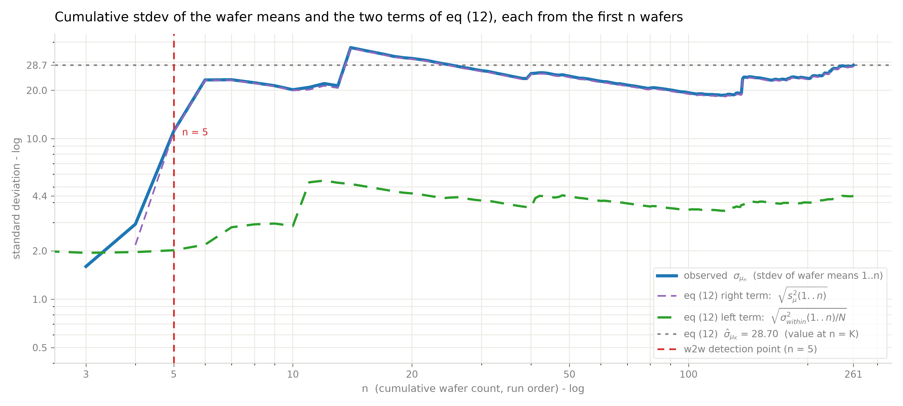
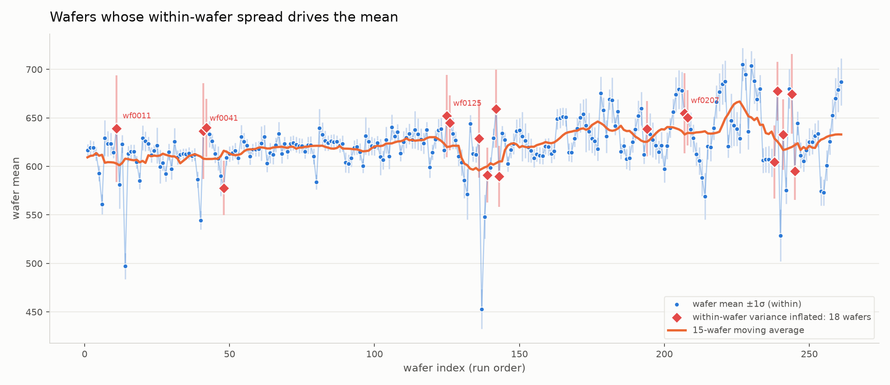

# Within-Wafer and Wafer-to-Wafer Variance Decomposition
Rev. 17 | Created: 2026-09-01 | Updated: 2026-09-03 13:42 CDT

> ANOVA (analysis of variance) 는 관측치의 전체 산포를 몇 개의 원인으로 나누어, 어느 원인이 얼마나 기여하는지 수치로 보이는 방법이다.

측정값이 여러 층으로 묶여 있을 때 각 층이 산포에 얼마나 기여하는지는 눈으로 가려낼 수 없다. ANOVA 는 전체 제곱합을 층별 제곱합으로 쪼개어 이 물음에 답한다. 한 층 안에서 값이 흩어진 정도와 층 사이에서 평균이 벌어진 정도를 각각의 자유도로 나누어 평균제곱으로 만들고, 그 비를 F 통계량으로 삼아 층 사이의 차이가 층 안의 산포만으로 설명되는지 판정한다. 이 문서는 wafer 를 층으로 두어 measurement 산포를 within-wafer 성분과 wafer-to-wafer 성분으로 나눈다.

## 1. Theory

### 1.1 Notation

Wafer $K$ 장을 장당 $N$ 개 site 에서 재면 관측치는 $M = K N$ 개이다.

- $X_{ij}$: $i$ 번째 wafer 의 $j$ 번째 site 측정값.
- $\bar{X}_i$: $i$ 번째 wafer 의 평균.
- $\bar{X}$: 전체 $M$ 개의 총평균.
- $S_i^2$: $i$ 번째 wafer 안 site 값의 표본분산. within-wafer 성분.
- $S_{\mathrm{total}}^2$: 전체 $M$ 개의 표본분산.

### 1.2 Decomposition Identity

전체 제곱합은 wafer 안의 편차와 wafer 평균의 편차로 남김없이 갈라진다. 이것이 ANOVA 가 딛는 항등식이다.

$$\mathrm{SST} = \mathrm{SSW} + \mathrm{SSB} \hspace{25.632em} (1)$$

- SST: total sum of squares. 전체 변동. 모든 관측치가 총평균에서 벗어난 정도.
- SSW: within-group sum of squares. wafer 내 변동. 각 site 값이 제 wafer 평균에서 벗어난 정도. 모형이 설명하지 못하고 남은 몫이므로 SSE (error sum of squares) 로도 쓴다.
- SSB: between-group sum of squares. wafer 간 변동. 각 wafer 평균이 총평균에서 벗어난 정도. 인자가 설명하는 몫이므로 SSA (factor sum of squares) 로도 쓴다.

세 제곱합을 풀어쓰면 아래와 같다.

$$\sum_{i}\sum_{j} (X_{ij} - \bar{X})^2 = \sum_{i}\sum_{j} (X_{ij} - \bar{X}_i)^2 + N \sum_{i} (\bar{X}_i - \bar{X})^2 \hspace{5.099em} (2)$$

각 제곱합을 제 자유도로 나누면 평균제곱 (mean square, MS) 이 되고, 그것이 곧 분산이다. 우변의 두 항을 각각 within-wafer 분산의 평균과 wafer 평균의 분산으로 바꾸면 아래와 같다.

$$\overline{S_{\mathrm{within}}^2} = \frac{1}{K} \sum_{i=1}^{K} S_i^2, \qquad S_{\mathrm{between}}^2 = \frac{1}{K-1} \sum_{i=1}^{K} (\bar{X}_i - \bar{X})^2 \hspace{6.962em} (3)$$

$$S_{\mathrm{total}}^2 = \frac{K(N-1)}{M-1} \overline{S_{\mathrm{within}}^2} + \frac{N(K-1)}{M-1} S_{\mathrm{between}}^2 \hspace{12.087em} (4)$$

두 계수는 $K$ 와 $N$ 이 커질수록 1 에 가까워지므로, 흔히 쓰는 형태는 계수를 떼어낸 아래 근사식이다. 계수가 1 로 가는 과정은 [Appendix B](#appendix-b-limits-of-the-decomposition-coefficients) 에 적었다.

$$S_{\mathrm{total}} \approx \sqrt{\overline{S_{\mathrm{within}}^2} + S_{\mathrm{between}}^2} \hspace{21.939em} (5)$$

### 1.3 Interpretation

- $S_{\mathrm{between}}^2 = 0$ 일 때: wafer 평균이 모두 같은 경우이며, 전체 표준편차는 wafer 내 표준편차의 제곱평균제곱근으로 줄어든다.
- $S_{\mathrm{between}}^2 \gt 0$ 일 때: wafer 내 표준편차가 아무리 작아도 wafer 평균이 서로 벌어져 있으면 전체 표준편차는 개별 wafer 의 표준편차보다 훨씬 커진다.
- 공정 관리에서의 쓰임: 전체 산포를 wafer 내 균일도 문제와 wafer 간 재현성 문제로 갈라 원인을 찾는 것.

## 2. Data

측정 자료는 [example.csv](example.csv) 이며 261 행 14 열이다. 한 행이 한 장의 wafer 이고, 열 `wafer_id` 는 `wf0001` 부터 `wf0261` 까지의 일련번호로 파일의 행 순서, 곧 run order 를 나타낸다. 나머지 열 `S1`~`S13` 은 그 wafer 위의 13 개 site 이다. 결측은 없고 전체 관측치는 3393 개이다.

- 전체 site 값: 평균 622.1, 표준편차 32.45, 최소 435.10, 최대 734.68.
- Wafer 평균: 최소 452.9, 최대 705.0, 표준편차 28.70.
- Within-wafer range: 평균 41.32, 최대 123.46.

Wafer 를 run order 로 15 장씩 묶어 그 안의 site 값 분포를 violin 으로 그리면, 분포의 위치와 폭이 함께 움직이는 것이 보인다. 앞쪽 구간의 중앙값은 610 대에 머물다가 뒤쪽 구간에서 650 근처까지 올라가고, 아래로 길게 뻗은 꼬리는 그 구간에 값이 크게 낮은 wafer 가 섞여 있다는 뜻이다. 겹쳐 그린 wafer 평균의 선형 추세선은 같은 상승을 한 줄로 요약한다.

Fig 1. Distribution of site values in bins of 15 consecutive wafers along run order, with the linear trend of the wafer means

## 3. Variance Decomposition

Wafer 를 인자로 둔 일원 ANOVA 로 wafer 간 성분과 wafer 내 성분을 나눈다.

Table 1. One-way ANOVA with wafer as the factor

| Source | SS | df | MS | F | p |
|---|---:|---:|---:|---:|---:|
| Between wafer | 2,783,290 | 260 | 10,705.0 | 42.48 | ~0 |
| Within wafer | 789,202 | 3132 | 252.0 | | |

표의 각 열이 뜻하는 바는 아래와 같다.

- SS: sum of squares. Between wafer 행이 section 1.2 의 SSB, within wafer 행이 SSW 이며, 둘을 더하면 SST 3,572,492 가 된다.
- df: degrees of freedom. 그 제곱합이 담은 독립한 정보의 개수. Wafer 261 장이므로 between 은 260, wafer 마다 site 13 개에서 평균 하나를 뺀 12 를 261 배 하여 within 은 3132.
- MS: mean square. SS 를 df 로 나눈 값이며 분산의 추정치. Within 의 252.0 은 site 한 점의 산포, between 의 10,705.0 은 wafer 평균의 산포에 site 산포가 얹힌 크기.
- F: 두 MS 의 비. 여기서는 10,705.0 / 252.0 = 42.48. wafer 사이에 차이가 없다면 1 근처에 머무는 값.
- p: wafer 사이에 차이가 없다는 가정 아래 그만큼 큰 F 가 나올 확률. 여기서는 0 에 가까워, 차이가 없다는 가정을 버린다.

분산성분은 `sigma_within` = 15.87, `sigma_wafer` = 28.36 이다. 앞의 것은 MS within 의 제곱근이고, 뒤의 것은 between 의 MS 에서 within 의 MS 를 빼고 site 수 13 으로 나눈 뒤 제곱근을 취한 값이다.

Table 2. Variance components

| Component | Sigma | Variance | Share |
|---|---:|---:|---:|
| Wafer-to-wafer | 28.36 | 804.1 | 76.1% |
| Within-wafer | 15.87 | 252.0 | 23.9% |
| Total | 32.50 | 1056.1 | 100% |

두 성분을 더한 32.50 은 section 2 의 관측 표준편차 32.45 와 0.05 만큼 다르다. section 1.2 에서 본 대로 두 성분의 단순 합은 근사식이고, 정확한 관계에는 1 보다 작은 계수가 붙기 때문이다.

ICC (intraclass correlation) 는 전체 분산 중 wafer 간 분산이 차지하는 비율로, 804.1 / 1056.1 = 0.761 이다. 값이 1 에 가까울수록 같은 wafer 에서 뽑은 두 site 값이 서로 닮았다는 뜻이고, 0 에 가까울수록 어느 wafer 에서 뽑았는지가 값을 예측하는 데 도움이 되지 않는다는 뜻이다. 0.761 은 site 한 점의 산포 중 76.1% 를 그 점이 놓인 wafer 가 결정한다는 것이므로, 산포를 줄이려면 site 단위 균일도보다 wafer 단위 조건을 먼저 봐야 한다.

## 4. Cumulative Standard Deviation Check

처음 n 장의 wafer 평균으로 계산한 표준편차를 `stdev_n` 이라 한다. Wafer $i$ 의 고유 수준을 $\mu_i$, site 오차를 $e_{ij}$ 로 두면 측정값은 두 항의 합이다.

$$X_{ij} = \mu_i + e_{ij}, \qquad \mathrm{Var}(e_{ij}) = \sigma_{within}^2 \hspace{16.433em} (6)$$

Wafer 평균에서는 site 오차가 $N$ 개 평균되므로 그 분산이 $N$ 분의 1 로 줄어든다.

$$\bar{X}_i = \mu_i + \bar{e}_i, \qquad \mathrm{Var}(\bar{e}_i) = \frac{\sigma_{within}^2}{N} \hspace{17.333em} (7)$$

$\mu_i$ 와 $\bar{e}_i$ 는 독립이므로 처음 $n$ 장의 wafer 평균의 분산은 두 분산의 합이고, 여기서 $s_{\mu}(1..n)$ 은 처음 $n$ 장의 wafer 고유 수준의 표준편차이다.

$$\mathrm{Var}(\bar{X}_1, \dots, \bar{X}_n) = s_{\mu}^2(1..n) + \frac{\sigma_{within}^2}{N} \hspace{16.339em} (8)$$

$N = 13$ 을 넣고 제곱근을 취하면 관측값을 설명하는 식이 된다.

$$\mathrm{stdev}_n = \sqrt{\frac{\sigma_{within}^2}{13} + s_{\mu}^2(1..n)} \hspace{20.428em} (9)$$

첫 항 `sigma_within`²/13 = 19.38 은 site 평균화로도 없앨 수 없는 바닥이며, 그 제곱근 4.40 이 Fig 2 의 아래쪽 기준선이다. n = 261 에서 √(28.70² − 4.40²) = 28.36 이 나와 section 3 의 `sigma_wafer` 와 일치한다. 따라서 곡선은 아래로 4.40 에 갇히고 위로 √(`sigma_wafer`² + `sigma_within`²/13) = 28.70 으로 수렴한다.

Fig 2. Cumulative standard deviation of wafer means against the floor, the asymptote, and the 1/√(13n) curve

## 5. Wafers with Inflated Within-Wafer Spread

각 wafer 의 `s_i`² 를 pooled MS within = 251.98 과 χ² (df = 12) 로 비교해, Bonferroni 보정으로 (기준 p 값 1.9e-04) 유의한 wafer 18 장을 골랐다. 이들의 표준오차 `s_i`/√13 은 7.9 에서 15.3 으로 전체 중앙값 3.18 의 2.5 배에서 5 배이다.

Table 3. Top five wafers by within-wafer standard error

| Wafer | Mean | Sd within | SE | Worst site | Shift when the worst site is dropped |
|---|---:|---:|---:|---|---:|
| wf0011 | 638.9 | 55.04 | 15.27 | S1 | 6.52 |
| wf0041 | 636.4 | 49.52 | 13.73 | S1 | 6.35 |
| wf0125 | 651.8 | 42.39 | 11.76 | S1 | 5.48 |
| wf0207 | 654.7 | 41.36 | 11.47 | S1 | 5.35 |
| wf0244 | 674.5 | 41.12 | 11.41 | S1 | 5.01 |

Table 3 의 다섯 장은 모두 S1 이 원인이고, 18 장 전체로는 S1 또는 S2 한 점이 원인이다. 그 site 를 빼면 wafer 평균이 4 에서 6.5 만큼 움직인다. 이 이동폭은 `sigma_wafer` = 28.36 에 비하면 작으므로, 이 wafer 들을 빼도 wafer-to-wafer 가 지배하는 구조는 바뀌지 않는다.

Fig 3. Wafer means with the 18 wafers whose within-wafer variance is inflated

## 6. Conclusion

- Site 한 점 기준 분산 배분: wafer-to-wafer 76.1%, within-wafer 23.9%, ICC 0.761.
- Wafer 평균 분산 28.70² = 823.5 중 28.36² = 804.1 (97.6%) 이 wafer 고유 수준, 19.38 (2.4%) 이 site 평균화 후 남는 within 기여.
- 산포 축소의 우선 대상: wafer 단위 조건.
- `sigma_total`/√13 이나 `sigma_total`/√(13n) 은 이 자료의 wafer 평균 산포를 설명하지 못함.

---

## Appendix A. Terminology

- **ANOVA**: analysis of variance. 전체 제곱합을 원인별 제곱합으로 나누고, 각각을 자유도로 나눈 평균제곱의 비로 원인의 유의성을 판정하는 방법.
- **ICC**: intraclass correlation. 전체 분산 중 group 간 분산이 차지하는 비율. 같은 group 에서 뽑은 두 관측치가 얼마나 닮았는지를 0 에서 1 사이로 나타내며, 이 문서의 group 은 wafer 이다.
- **run order**: 자료 파일의 행 순서. 측정 순서를 따르므로 시간 축으로 사용.
- **site**: 한 wafer 위의 측정 지점. 열 `S1`~`S13` 에 해당.
- **w2w**: wafer-to-wafer. wafer 사이의 변동.
- **WiW**: within-wafer. 한 wafer 안 site 사이의 변동.

## Appendix B. Limits of the Decomposition Coefficients

Section 1.2 의 두 계수를 $a$ 와 $b$ 로 두면 아래와 같다.

$$a = \frac{K(N-1)}{M-1} = \frac{KN-K}{KN-1}, \qquad b = \frac{N(K-1)}{M-1} = \frac{KN-N}{KN-1} \hspace{3.328em} (10)$$

분자와 분모가 모두 $KN$ 에서 시작하므로, 1 에서 얼마나 모자라는지를 보는 편이 빠르다.

$$1 - a = \frac{K-1}{KN-1}, \qquad 1 - b = \frac{N-1}{KN-1} \hspace{14.455em} (11)$$

두 결손항은 각각 한쪽 크기에만 매인다. $1-a$ 의 분자와 분모를 $K$ 로, $1-b$ 의 분자와 분모를 $N$ 으로 나누면 아래 꼴이 된다.

$$1 - a = \frac{1 - 1/K}{N - 1/K}, \qquad 1 - b = \frac{1 - 1/N}{K - 1/N} \hspace{13.246em} (12)$$

$K$ 를 아무리 키워도 $1-a$ 는 $1/N$ 에서 멈추고, $N$ 을 아무리 키워도 $1-b$ 는 $1/K$ 에서 멈춘다.

$$\lim_{K \to \infty} (1 - a) = \frac{1}{N}, \qquad \lim_{N \to \infty} (1 - b) = \frac{1}{K} \hspace{14.014em} (13)$$

곧 한쪽만 키운 극한에서 계수는 1 이 아니라 아래 값에 멈춘다.

$$\lim_{K \to \infty} a = 1 - \frac{1}{N}, \qquad \lim_{N \to \infty} b = 1 - \frac{1}{K} \hspace{15.494em} (14)$$

따라서 $a$ 를 1 로 보내는 것은 wafer 당 site 수 $N$ 이고, $b$ 를 1 로 보내는 것은 wafer 수 $K$ 이며, 둘이 함께 커져야 두 계수가 같이 1 이 된다.

$$\lim_{N \to \infty} a = 1, \qquad \lim_{K \to \infty} b = 1, \qquad \lim_{K, N \to \infty} S_{\mathrm{total}}^2 = \overline{S_{\mathrm{within}}^2} + S_{\mathrm{between}}^2 \hspace{2.0em} (15)$$

이 문서의 $K = 261$, $N = 13$ 에서는 $1 - a = 260/3392 = 0.0767$ 로 $1/N = 0.0769$ 에 거의 같고, $1 - b = 12/3392 = 0.0035$ 로 $1/K = 0.0038$ 에 거의 같다. 즉 $b$ 는 이미 1 로 보아도 되지만 $a$ 는 7.7% 모자라며, site 를 13 개만 재는 한 이 결손은 wafer 를 아무리 더 재도 줄지 않는다. 이 자료에서 $\overline{S_{\mathrm{within}}^2} = 251.98$ 과 $S_{\mathrm{between}}^2 = 823.46$ 을 그냥 더하면 $S_{\mathrm{total}} = 32.79$ 가 되어 관측값 32.45 를 넘지만, 두 계수를 붙이면 관측값과 같아진다.
