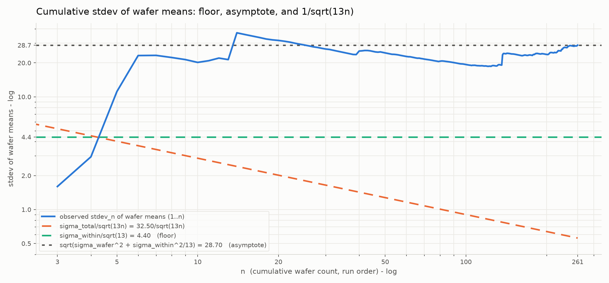
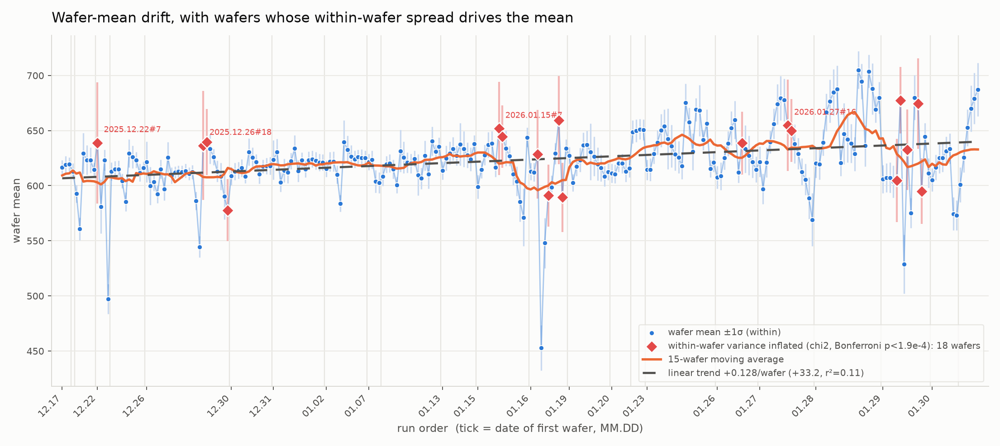

# Within-Wafer and Wafer-to-Wafer Variance Decomposition
Rev. 0 | Created: 2026-09-03 | Updated: 2026-09-03 12:33 CDT

## 1. Data

측정 자료는 261 행 13 열의 표이며, 한 행이 한 장의 wafer 이고 열 `S1`~`S13` 은 그 wafer 위의 13 개 site 이다. 행 식별자는 `<date>#<number>` 형태이므로 date 를 lot 으로 보아 24 개 lot 으로 묶었다. 결측은 없고 전체 관측치는 3393 개이다.

- 전체 site 값: 평균 622.1, 표준편차 32.45, 최소 435.10, 최대 734.68.
- Wafer 평균: 최소 452.9, 최대 705.0, 표준편차 28.70.
- Within-wafer range: 평균 41.32, 최대 123.46.

## 2. Variance Decomposition

### 2.1 One-way ANOVA by wafer

Wafer 를 인자로 둔 일원 ANOVA 로 wafer 간 성분과 wafer 내 성분을 나눈다.

Table 1. One-way ANOVA with wafer as the factor

| Source | SS | df | MS | F | p |
|---|---:|---:|---:|---:|---:|
| Between wafer | 2,783,290 | 260 | 10,705.0 | 42.48 | ~0 |
| Within wafer | 789,202 | 3132 | 252.0 | | |

분산성분은 `sigma_within` = 15.87, `sigma_wafer` = 28.36 이고 ICC 는 0.761 이다. 즉 site 한 점의 산포 중 76.1% 가 wafer 간, 23.9% 가 wafer 내에서 온다.

### 2.2 Nested ANOVA with lot

Wafer 간 성분을 lot 간 (drift) 과 lot 내 wafer 간으로 다시 나눈다.

Table 2. Nested ANOVA of lot / wafer / site

| Source | SS | df | MS | F | p |
|---|---:|---:|---:|---:|---:|
| Lot | 871,687 | 23 | 37,899.4 | 4.70 | 2.4e-10 |
| Wafer in lot | 1,911,603 | 237 | 8,065.8 | 32.01 | ~0 |
| Within wafer | 789,202 | 3132 | 252.0 | | |

Table 3. Variance components

| Component | Sigma | Variance | Share |
|---|---:|---:|---:|
| Lot-to-lot (drift) | 14.62 | 213.7 | 20.0% |
| Wafer-to-wafer in lot | 24.52 | 601.1 | 56.3% |
| Within-wafer | 15.87 | 252.0 | 23.6% |
| Total | 32.66 | 1066.8 | 100% |

Drift 를 따로 떼어내도 lot 내 wafer 간 성분이 가장 크다.

## 3. Drift of Wafer Means

Wafer 평균을 run order 로 늘어놓으면 12.17 의 약 608 에서 02.02 의 약 640 까지 오른다. 선형 추세는 wafer 당 +0.128 이고 261 장 누적 +33.2 이며, r² = 0.11, p = 2.7e-08 이다. 이동평균을 보면 단조 상승이 아니라 01.16 부근의 급락과 01.28 부근의 봉우리 같은 lot 단위 계단이 겹쳐 있다.

Fig 1. Wafer means over run order with a 15-wafer moving average and a linear trend

## 4. Cumulative Standard Deviation Check

처음 n 장의 wafer 평균으로 계산한 표준편차 `stdev_n` 을 n = 3 부터 261 까지 구해, 이것이 `sigma_total`/√13 = 9.01 을 따르는 구간이 있는지 확인했다. 그런 구간은 없다. `stdev_n` 은 n = 5 에서 이미 11.13 이고 그것이 n ≥ 5 구간의 최솟값이며, 이후 18.6 에서 28.7 사이에 머문다.

`sigma_total`/√(13n) 곡선과도 맞지 않는다. 이 곡선은 n = 3 에서 5.20, n = 261 에서 0.56 으로 내려가지만 관측값은 올라가서 끝에서 51 배 벌어지고, 두 곡선이 만나는 곳은 n = 4 하나뿐이다.

관측값을 설명하는 식은 아래와 같다. 여기서 `s_mu` 는 처음 n 장의 wafer 고유 수준의 표준편차이다.

$$\mathrm{stdev}_n = \sqrt{\frac{\sigma_{within}^2}{13} + s_{\mu}^2(1..n)}$$

첫 항 `sigma_within`²/13 = 19.38 은 site 평균화로도 없앨 수 없는 바닥이며, 그 제곱근 4.40 이 Fig 2 의 아래쪽 기준선이다. n = 261 에서 √(28.70² − 4.40²) = 28.36 이 나와 section 2.1 의 `sigma_wafer` 와 일치한다. 따라서 곡선은 아래로 4.40 에 갇히고 위로 √(`sigma_wafer`² + `sigma_within`²/13) = 28.70 으로 수렴한다.

n 만의 매끄러운 함수로는 설명되지 않는다. n ≥ 10 구간에서 상수 모형의 R² 는 0, random walk 모형의 R² 는 0.02, 선형 drift 모형의 R² 는 0.11 이며, 실제 오르내림은 lot 단위 계단이 만든다.

Fig 2. Cumulative standard deviation of wafer means against the floor, the asymptote, and the 1/√(13n) curve

## 5. Wafers with Inflated Within-Wafer Spread

각 wafer 의 `s_i`² 를 pooled MS within = 251.98 과 χ² (df = 12) 로 비교해, Bonferroni 보정으로 (기준 p 값 1.9e-04) 유의한 wafer 18 장을 골랐다. 이들의 표준오차 `s_i`/√13 은 7.9 에서 15.3 으로 전체 중앙값 3.18 의 2.5 배에서 5 배이다.

Table 4. Top five wafers by within-wafer standard error

| Wafer | Mean | Sd within | SE | Worst site | Shift when the worst site is dropped |
|---|---:|---:|---:|---|---:|
| 2025.12.22#7 | 638.9 | 55.04 | 15.27 | S1 | 6.52 |
| 2025.12.26#18 | 636.4 | 49.52 | 13.73 | S1 | 6.35 |
| 2026.01.15#7 | 651.8 | 42.39 | 11.76 | S1 | 5.48 |
| 2026.01.27#16 | 654.7 | 41.36 | 11.47 | S1 | 5.35 |
| 2026.01.29#11 | 674.5 | 41.12 | 11.41 | S1 | 5.01 |

대부분 S1 또는 S2 한 점이 원인이어서, 그 site 를 빼면 wafer 평균이 4 에서 6.5 만큼 움직인다. 이 이동폭은 `sigma_wafer` = 28.36 에 비하면 작으므로, 이 wafer 들을 빼도 wafer-to-wafer 가 지배하는 구조는 바뀌지 않는다.

Fig 3. Wafer means with the 18 wafers whose within-wafer variance is inflated

## 6. Conclusion

- Wafer 평균 분산 28.70² = 823.5 중 28.36² = 804.1 (97.6%) 이 wafer 고유 수준, 19.38 (2.4%) 이 site 평균화 후 남는 within 기여.
- Site 한 점 기준으로는 within 이 전체 분산의 23.6%, wafer-to-wafer 안에 lot 간 drift 20.0% 포함.
- 산포 축소의 우선 대상: wafer 단위 조건, 그 다음 lot drift.
- `sigma_total`/√13 이나 `sigma_total`/√(13n) 은 이 자료의 wafer 평균 산포를 설명하지 못함.

---

## Appendix A. Terminology

- **ICC**: intraclass correlation. 전체 분산 중 group 간 분산이 차지하는 비율.
- **lot**: 같은 date 를 가진 wafer 묶음. 이 자료에서는 행 식별자의 date 부분으로 정의.
- **run order**: 자료 파일의 행 순서. date 순으로 정렬되어 있어 시간 축으로 사용.
- **site**: 한 wafer 위의 측정 지점. 열 `S1`~`S13` 에 해당.
- **w2w**: wafer-to-wafer. wafer 사이의 변동.
- **WiW**: within-wafer. 한 wafer 안 site 사이의 변동.
