# Semiconductor Machine Signal Parameterization for ML Modeling: Shape-based Taxonomy

rev. 175

> 상위 문서: [README](./README.md)
>
> 짝 문서: [Continuous Signals](./semiconductor-machine-signal-parameterization-continuous.md) · [Quantized Signals](./semiconductor-machine-signal-parameterization-quantized.md)

## Contents

- [Goals](#goals)
- [1. Shape Vocabulary](#1-shape-vocabulary)
  - [1.1 Scope](#11-scope)
  - [1.2 Chart Class](#12-chart-class)
  - [1.3 Shape Axis](#13-shape-axis)
  - [1.4 Mapping Between The Two Vocabularies](#14-mapping-between-the-two-vocabularies)
  - [1.5 Activity](#15-activity)
- [2. MTSV](#2-mtsv)
  - [2.1 Chart Classes And Reconstruction Parameters](#21-chart-classes-and-reconstruction-parameters)
  - [2.2 Parameter Schematics](#22-parameter-schematics)
  - [2.3 Cycle Count](#23-cycle-count)
  - [2.4 Periodic Chart](#24-periodic-chart)
  - [2.5 Non-Periodic Chart](#25-non-periodic-chart)
- [3. Chart Classification](#3-chart-classification)
  - [3.1 Pre-Classification](#31-pre-classification)
  - [3.2 Notation](#32-notation)
  - [3.3 Likelihood Model](#33-likelihood-model)
  - [3.4 Raw Likelihood Alone Is Not a Decision Rule](#34-raw-likelihood-alone-is-not-a-decision-rule)
  - [3.5 Decision Rule — BIC](#35-decision-rule--bic)
  - [3.6 Effective Sample Size and Noise Model](#36-effective-sample-size-and-noise-model)
  - [3.7 STOCHASTIC Class — Whittle Likelihood](#37-stochastic-class--whittle-likelihood)
  - [3.8 Computation — Change Point Detection](#38-computation--change-point-detection)
  - [3.9 Outputs](#39-outputs)
- [4. Parameter Extraction Method](#4-parameter-extraction-method)
  - [4.1 Reading θ̂ from the Fit](#41-reading-θ-from-the-fit)
  - [4.2 Derived Diagnostic Parameters](#42-derived-diagnostic-parameters)
  - [4.3 When the Class Is Ambiguous](#43-when-the-class-is-ambiguous)
  - [4.4 Parameter Quality Control — Always Store Alongside](#44-parameter-quality-control--always-store-alongside)
- [5. Class Confidence — Reconstruction-Based Definition](#5-class-confidence--reconstruction-based-definition)
  - [5.1 Procedure](#51-procedure)
  - [5.2 Per-Class Reconstruction Models](#52-per-class-reconstruction-models)
  - [5.3 Ambiguity By-Product](#53-ambiguity-by-product)
- [6. Class Stability](#6-class-stability)
- [Appendix A — Terminology](#appendix-a--terminology)
  - [Definitions](#definitions)
  - [Details](#details)
- [Appendix B — Time Series Period Separation](#appendix-b--time-series-period-separation)
  - [B.1 Autocorrelation Function (ACF)](#b1-autocorrelation-function-acf)
  - [B.2 Welch Power Spectral Density (PSD)](#b2-welch-power-spectral-density-psd)
- [Appendix C — Chart Agreement Metrics](#appendix-c--chart-agreement-metrics)
  - [C.1 NRMSE — Adopted Aggregate Score](#c1-nrmse--adopted-aggregate-score)
  - [C.2 Alternative Metrics — Reviewed and Kept as Auxiliary](#c2-alternative-metrics--reviewed-and-kept-as-auxiliary)
- [Appendix D — Oscillation Chart Class](#appendix-d--oscillation-chart-class)
- [Appendix E — Nested Model Families](#appendix-e--nested-model-families)
  - [E.1 Where The Nesting Comes From](#e1-where-the-nesting-comes-from)
  - [E.2 Is The Nesting A Design Flaw?](#e2-is-the-nesting-a-design-flaw)
  - [E.3 What Screening Removes And What Remains](#e3-what-screening-removes-and-what-remains)
  - [D.1 Terminology](#d1-terminology)
  - [D.2 Schematics](#d2-schematics)
  - [D.3 Reading The Subtype Fit](#d3-reading-the-subtype-fit)

## Goals

본 문서의 목적은 다음 네 가지다.

1. **shape taxonomy로 domain knowledge 없이 chart class를 자동 분류한다.**
   센서가 무엇을 재는 물리량인지 몰라도 파형의 기하만으로 나눈다 (§1).
2. **chart class는 모든 wafer에서 일정하다.** 같은 센서는 웨이퍼가 바뀌어도
   같은 클래스여야 하며, 이것이 벡터 정의를 고정하는 전제다 (§2, §6).
3. **class classification은 shape taxonomy hierarchy로 구한다 — MLE.**
   Table 8의 클래스족을 모델족으로 보고 maximum likelihood로 적합한 뒤
   BIC argmin으로 채택한다 (§3).
4. **class confidence와 class stability로 classification의 정확도와 일관성을
   측정한다.** confidence는 트레이스 한 장의 재현 정확도(§5), stability는
   웨이퍼 축의 판정 일관성(§6)이다.

## 1. Shape Vocabulary

이 절은 형상을 부르는 두 어휘를 함께 세운다. 하나는 structured data manifest 가 열 하나에 붙이는 여섯 개의 class axis 이고, 다른 하나는 이 문서가 파형의 기하로 정의하는 chart class 다. **두 어휘는 경쟁하는 것이 아니라 같은 형상을 다른 해상도로 부르는 것이다.** Chart class 는 재현 파라미터까지 딸린 모델족이고, manifest 의 label 은 그 모델족을 몇 무리로 접은 이름표다.

접는 이유는 쓰는 자리가 다르기 때문이다. 열 하나에 label 하나를 적는 profile 은 파라미터를 담지 않으므로 `R1` 과 `R2` 를 가릴 필요가 없고, 반대로 벡터를 만드는 자리에서는 `n` 이 몇인지가 벡터 크기를 정하므로 반드시 갈라야 한다.

아래 다섯 절이 하는 일은 각각 이렇다. §1.1 은 판정 대상을 자른다 — manifest 의 여섯 axis 가운데 어느 값을 가진 열을 이 문서가 다루는지 밝힌다. §1.2 와 §1.3 은 두 어휘를 하나씩 세운다. 앞은 chart class 를 정의하고 뒤는 manifest 의 label 을 정의한다. §1.4 는 그렇게 세운 둘을 잇는 대응표다. §1.5 는 두 어휘가 같은 이름을 쓰면서 뜻이 갈리는 유일한 자리인 activity 를 다룬다.

재현 파라미터의 목록과 그 파라미터가 파형의 어디를 가리키는지는 벡터를 만드는 자리의 문제이므로 §2 에 둔다.

### 1.1 Scope

Table 1. The six class axes and what this document does with each

| Axis | Label | Handling here |
|---|---|---|
| `activity` | `active`, `inactive` | 이름은 같고 판정 기준이 다르다 (§1.5) |
| `value_type` | `category`, `ordinal`, `numeric`, `text`, `datetime` | `numeric` 인 열만 다룬다 |
| `structure` | `scalar`, `vector`, `matrix`, `trace` | `trace` 인 열만 다룬다 |
| `array_length` | `fixed`, `variable` | 형상 판정을 가르지 않는다 |
| `trace_quantum` | `q1`, `qn`, `infinite` | chart class 로 잇는다 (§1.4.2) |
| `trace_shape` | `flat`, `ramp`, `rectangle`, `triangle`, `oscillation`, `irregular` | chart class 로 잇는다 (§1.4.1) |

**이 문서의 판정 대상은 `value_type` 이 `numeric` 이고 `structure` 가 `trace` 인 열이다.** 크기를 갖지 않는 값에는 기울기도 진폭도 정의되지 않고, 시간 순서가 없는 배열에는 되돌릴 파형이 없다. 나머지 조합의 열은 이 문서의 어휘로 부를 수 없으며, manifest 에서 `trace_shape` 를 아예 갖지 않는 열이 그것이다.

`array_length` 는 label 이 무엇이든 형상 판정을 바꾸지 않는다. 임계값이 모두 무차원 비율이라 배열의 길이에 영향을 받지 않기 때문이다 (§1.3.2). 다만 `variable` 인 열은 window 가 행마다 다르므로, 판정에 쓴 window 를 행 단위로 남겨야 같은 label 이 같은 뜻을 갖는다.

### 1.2 Chart Class

Chart class는 **파형의 기하학적 정의와 재현 파라미터 집합만으로 정의**한다.
분류를 어떻게 구현하는가와 무관하게 성립하는 정의다 — 즉 어떤 분류 알고리즘을 쓰든 클래스 체계는
바뀌지 않는다. **parameter count가 곧 그 클래스의 최소 벡터 크기**이다.

계층의 최상위는 **INACTIVE** 와 **ACTIVE** 로 갈리고, ACTIVE 는 다시 **DETERMINISTIC** 과 **STOCHASTIC** 으로 나뉜다. 위쪽 분기는 형상을 가르는 것이 아니라 그 센서를 벡터에 넣을지 정하는 게이트이므로 §1.5 에서 다룬다.

```
Chart Class
├── INACTIVE   identical chart on every wafer → excluded from the vector; one representative value recorded once
│      └── typical: Q1 (a single constant value), and any class whose parameters are invariant across all wafers
│
└── ACTIVE     varies across wafers (= not INACTIVE) → vectorized
       ├── DETERMINISTIC   waveform itself is reconstructed — reconstruction parameter vector (§5.2)
       │      ├── S  STEP       (S1 single / S2 multi)
       │      ├── R  RECTANGLE     (R1 single / R2 multi)   — plateau ratio κ ≥ 0.7
       │      │      └── R1s RECTANGLE carrying a small signal on the plateau (§2.2.3)
       │      └── T  TRIANGLE   (T1 single / T2 sawtooth) — plateau ratio κ < 0.7
       └── STOCHASTIC      only statistics are reconstructed — spectral parameters (§3.7.1)
              ├── Q2…Q9  QUANTIZED OSCILLATION — quantum count m = 준위 개수
              │          (m = 1 is Q1 CONSTANT — DETERMINISTIC, no oscillation)
              └── O2 / O3 / O4  OSCILLATION (limit cycle / bang-bang / broadband)
```

*Fig. 1. Chart class hierarchy — top-level ACTIVE/INACTIVE split, with the
DETERMINISTIC/STOCHASTIC division inside ACTIVE.*

**중복 클래스는 두지 않는다.** 같은 평균함수를 파라미터 값만 달리해 표현하는
형상은 별도 클래스로 두지 않는다. 임계값 하나로 갈라놓아도 웨이퍼마다 그
임계값을 넘나들며 라벨이 흔들릴 뿐이다 (class_stability 저하). 완만한 엣지의
사다리꼴은 `t_rise`·`t_fall` 이 큰 `R1`, 램프는 `t_rise` 가 큰 `S1`, 좁은
봉우리는 폭이 작은 `T1` 이다 — 모두 상위 클래스의 파라미터 영역이며, 그 값
자체가 진단 파라미터다.

Fig. 1 의 클래스 사이에 남는 형상 경계는 하나다.

- **`R` vs `T`** — **평탄도 `κ = W_90 / W_50`** 로 가른다. `W_a` 는 신호가
  정점 높이의 `a` 이상에 머무는 표본 수다. 정상이 평탄하면 `R`, 뾰족하면 `T`.

```
κ = |{ i : y_i ≥ 0.9 }| / |{ i : y_i ≥ 0.5 }|

     y_i = (x_i − baseline) / A            polarity = +1  (peak)
     y_i = (baseline − x_i) / A            polarity = −1  (valley)

     polarity = +1 :  baseline = p5(x),    A = p99.5(x) − baseline
     polarity = −1 :  baseline = p95(x),   A = baseline − p0.5(x)
```

**`κ` 는 정류한 신호에서 잰다.** 극성은 `x` 와 `−x` 중 `|A|` 가 큰 쪽으로 정하며,
이렇게 두면 골짜기도 봉우리와 같은 척도로 평탄도를 얻는다. 정류하지 않으면
골짜기의 `W_50` 이 0 이 되어 `κ` 가 정의되지 않는다.

`κ` 는 정점 부근이 얼마나 평탄한가를 재며, 파형 모양에만 의존하고 진폭·단위·
시간축 길이에 무관하다. 이론값은 사각펄스 `1.000`, 삼각형 `0.200` 이다.

*Table 2. Plateau ratio `κ` and the boundary it sets*

| 형상 | `κ` 범위 (센서별 평균) | 판정 |
|---|---|---|
| 평탄한 정상 (사각 펄스·사다리꼴) | 0.896 ~ 0.998 | `κ ≥ 0.7` → `R1` |
| 뾰족한 정상 (삼각·좁은 봉우리) | 0.178 ~ 0.402 | `κ < 0.7` → `T1` |

두 무리 사이가 `0.55 ~ 0.89` 로 비어 있으므로 **경계는 `κ = 0.7`** 로 둔다.

적용 시점은 BIC 채택 뒤다 (§3.1 Fig. 3). 1·2순위가 `R1` 과 `T1` 이고
`ΔBIC < 5` (§4.3의 모호 기준)이면, `κ ≥ 0.7` 인 쪽으로 채택 클래스를 바꾼다.
두 클래스는 정점 부근의 평탄함만 다르고 BIC 는 그 차이를 `SSE` 로만 보므로
잡음 방향에 따라 순위가 뒤집히지만, `κ` 는 형상에만 의존해 안정적이다.
`κ` 가 BIC 를 뒤집은 경우 `ΔBIC` 는 음수로 기록되어 그 사실이 남는다.
`κ` 는 채택 클래스가 형상과 맞는지 검증하는 QC 파라미터(§4.4)이기도 하다.

§3의 분류 방법은 이 경계의 측정 수단일 뿐이며, 경계 정의 자체를 바꾸지 않는다.

### 1.3 Shape Axis

Shape axis 는 manifest 의 `trace_shape` axis 이고, 형상을 여섯 label 로 부른다.

#### 1.3.1 Labels

Table 3. `trace_shape` labels

| Label | Rule |
|---|---|
| `flat` | Window 에서 값이 변하지 않는다 |
| `ramp` | Window 에서 값이 한 방향으로만 변하는 구간 하나가 `ramp_fraction` 이상을 차지한다 |
| `rectangle` | 값이 두 level 사이를 오가고, 한 level 에 머무는 시간이 level 사이를 이동하는 시간보다 `dwell_ratio` 배 이상 길다 |
| `triangle` | 상승 구간과 하강 구간의 기울기 크기가 서로 비슷하고, 두 구간 사이에 평탄한 구간이 없으며, 정점이 뾰족하다 |
| `oscillation` | Autocorrelation 에 `acf_peak` 이상의 peak 이 일정한 간격으로 나타난다 |
| `irregular` | 위 다섯 규칙을 모두 만족하지 않는다 |

여섯 규칙은 서로 겹치므로 **판정 순서가 정의의 일부다.** 평탄한 trace 는 한 방향으로만 움직이는 구간이 window 전체를 덮기도 하고, pulse 열은 autocorrelation 에도 걸린다. 위 표의 순서대로, 가장 좁은 규칙부터 시험한다.

`triangle` 의 기준은 폭이 아니라 **정점의 뾰족함**이다. 시간축으로 아무리 넓어도 플랭크가 직선이고 정점이 뾰족하면 `triangle` 이고, 정점이 뾰족하지 않은 봉우리 — 둥근 언덕처럼 `κ` 가 삼각형 이론값(0.2)과 사각형(1.0) 사이 중간대에 놓이는 형상 — 는 `rectangle` 의 dwell 조건도 채우지 못하므로 `irregular` 다. 뾰족함도 `κ` 로 재며, `kappa` 임계값이 그 상한이다.

`irregular` 는 앞의 다섯이 받지 못한 trace 를 받아 모든 trace 가 이 axis 에서 label 하나를 갖게 한다. 다른 label 과 성격이 다른 점은 그 뜻이 자기 규칙이 아니라 앞의 다섯 규칙과 그 임계값에 매여 있다는 것이다.

#### 1.3.2 Thresholds

Table 4. Thresholds the labels depend on

| Threshold | Default | Used by |
|---|---|---|
| `ramp_fraction` | 0.8 | `ramp` — 단조 구간이 덮어야 하는 window 비율 |
| `dwell_ratio` | 5.0 | `rectangle` — 머문 표본 수 대 이동 표본 수의 하한 |
| `kappa` | 0.45 | `triangle` — 평탄도 `κ = W_90 / W_50` 의 상한 (§1.2). 뾰족한 정점의 실측 대역(≤ 0.402)을 덮고 둥근 정점의 중간대를 `irregular` 로 보낸다. §1.2 의 0.7 은 `R1` 대 `T1` 동률을 가르는 다른 자리의 값이다 |
| `slope_tolerance` | 3.0 | `triangle` — 두 플랭크 기울기 크기의 비의 상한 |
| `acf_peak` | 0.6 | `oscillation` — autocorrelation peak 높이의 하한 |
| `peak_jitter` | 0.25 | `oscillation` — peak 간격의 상대 편차 상한 |

임계값을 조정하면 `irregular` 로 판정되는 열의 수가 함께 움직이므로, **임계값을 보지 않고 `irregular` 만 읽으면 그 열이 어떤 trace 인지 알 수 없다.** 판정 결과를 적을 때는 위 값들을 함께 적는다.

`triangle` 은 §2.2.5 대로 `x` 와 `−x` 양쪽에서 시험한다. `A_peak` 가 부호를 갖는 것과 같은 사실이며, `κ` 는 정류한 신호에서 잰다 (§1.2).

### 1.4 Mapping Between The Two Vocabularies

#### 1.4.1 Trace Shape To Chart Class

Table 5. `trace_shape` label to chart class

| `trace_shape` | Chart class | Note |
|---|---|---|
| `flat` | `Q1` | 준위가 하나뿐이라 변할 곳이 없다. `trace_quantum` 의 `q1` 과 같은 사실이다 |
| `ramp` | `S1` (`t_rise` 가 큰 경우) | 램프는 전이가 window 를 덮을 만큼 완만한 `S1` 이다 (§2.2.2) |
| `rectangle` | `R1`, `R1s`, `R2` | 사다리꼴은 `t_rise`·`t_fall` 이 큰 `R1` 이므로 여기 속한다 |
| `triangle` | `T1`, `T2` | 좁은 봉우리는 폭이 작은 `T1`, 골짜기는 `A_peak` 가 음수인 `T1` 이다 |
| `oscillation` | `O2`, `O3`, `O4`, `Q2`~`Q9` | 격자 위의 왕복과 격자 밖의 진동이 이 label 로 함께 접힌다 |
| `irregular` | 없음 | 어느 class 도 형상을 설명하지 못한 경우이므로 대응하는 class 가 없다 |

**대응은 일대일이 아니고, 양쪽 모두에 빈자리가 있다.**

- `S1` 의 급준한 계단과 `S2` 는 `trace_shape` 에 대응하는 label 이 없다. 단조 구간이 짧아 `ramp` 에 걸리지 않고 두 level 에 머무는 시간이 조건을 채우지 못해 `rectangle` 에도 걸리지 않으므로 `irregular` 로 떨어진다. 계단이 흔한 데이터라면 `trace_shape` 만으로는 그 사실을 볼 수 없다.
- `irregular` 에 대응하는 class 가 없는 것은 설계상 그렇다. Table 8 은 형상을 주장하는 모델족의 목록이고, `irregular` 는 주장이 실패했다는 표시다.
- `Q2`~`Q9` 와 `O` 가 한 label 로 접히므로, 계측 아티팩트와 실제 물리 진동의 구분(§2.2.7)이 `trace_shape` 에서는 사라진다. 그 구분이 필요하면 `trace_quantum` 을 함께 읽어야 한다.

#### 1.4.2 Trace Quantum To Chart Class

Table 6. `trace_quantum` label to chart class

| `trace_quantum` | Chart class | Note |
|---|---|---|
| `q1` | `Q1` | 준위가 하나뿐이다. `trace_shape` 의 `flat` 과 같은 사실이다 |
| `qn` | `Q2`~`Q9` | LSB 격자 위 `m` 개 준위를 오간다. 이 문서는 `m <= 9` 까지만 격자로 보고 그 위는 `O` 로 넘긴다 (§2.2.7) |
| `infinite` | `S`, `R`, `T`, `O` 계열 전부 | 준위에 머물지 않으므로 `Q` 계열을 뺀 나머지가 모두 여기 속한다 |

두 어휘가 같은 경계를 쓴다. manifest 가 `qn` 과 `infinite` 를 가르는 기준은 값이 셀 수 있는 준위 위에 머무는가이고, 이 문서가 `Q` 계열과 나머지를 가르는 기준도 값이 LSB 격자 몇 칸에 갇히는가이다 (§2.2.7). 다른 점은 이 문서가 그 칸 수에 `m <= 9` 라는 상한을 두어, 준위가 그보다 많으면 격자를 주장하지 않고 진동으로 본다는 것이다.

`infinite` 는 열 개가 넘는 class 를 한 label 로 접으므로 형상에 대해서는 아무것도 말하지 않는다. 그 열의 형상은 `trace_shape` 가 답하고, 되돌릴 파라미터는 Table 8 이 답한다.

#### 1.4.3 Which Vocabulary To Use

Table 7. Choosing between the two

| Question | Vocabulary |
|---|---|
| 이 열에 무엇이 담겨 있는가 | `trace_shape` — label 하나로 답한다 |
| 이 트레이스를 되돌리려면 무엇을 저장해야 하는가 | Table 8 의 class — 재현 파라미터가 딸려 있다 |
| 이 센서가 웨이퍼마다 같은 형상인가 | Table 8 의 class — `class_stability`(§6)가 이 어휘 위에서 정의된다 |
| 열 백 개를 한 표로 훑어야 한다 | `trace_shape` — 여섯 칸이면 표가 읽힌다 |

`trace_shape` 로 적은 열을 나중에 벡터화하려면 Table 5 를 거슬러 올라가 class 를 다시 판정해야 한다. 접는 과정에서 `n` 과 파라미터가 버려지기 때문이며, 그래서 **`trace_shape` 는 요약이지 중간 산출물이 아니다.**

### 1.5 Activity

**INACTIVE** 는 모든 live wafer 에서 동일한 차트를 보이는 센서다 — 클래스도
파라미터 벡터도 웨이퍼에 따라 변하지 않는다. **ACTIVE** 는 그 여집합이다
(Fig. 1). 판정이 단일 트레이스가 아니라 **웨이퍼 축 전체**에서
(lot/period 전체 기준) 내려지므로 표가 아니라
**`chart_index.py --find active`(CLI)** 가 수행하며, INACTIVE 로 판정된 센서는
벡터에서 빼고 대표값 1회만 기록한다.

manifest 의 `activity` 는 결측을 뺀 행 사이에 서로 다른 cell 값이 둘 이상 있는지로 판정하고, 무엇과 무엇을 비교했는지를 `row` 와 `entity` 중 하나로 함께 남긴다.

**두 판정은 이름이 같고 견주는 것이 다르다.** manifest 는 cell 값을 그대로 견주므로 잡음만 실린 trace 도 값이 달라 `active` 가 된다. 이 문서는 적합된 class 와 파라미터를 견주므로 같은 trace 를 INACTIVE 로 볼 수 있다. 따라서 manifest 의 `active` 는 이 문서의 INACTIVE 를 배제하지 않으며, 두 값을 같은 뜻으로 읽으면 벡터에서 빼야 할 센서를 남기게 된다.

## 2. MTSV

MTSV의 벡터 크기는 Table 8의 parameter count로 결정된다. Events = 1 인
클래스는 이미 고정 크기 벡터이므로 추가 축소가 필요 없다. 반면
Events = n 인 클래스(`S2`, `R2`, `T2`, `O`)는 벡터 크기가 이벤트 수 n에
비례한다(3n류). 그래서 벡터를 만들기 전에 먼저 **cycle count**(§2.3)를 세어
반복이 있는지부터 가른다. 반복이 있고 그것이 **규칙적(periodic)**이면
이벤트 목록을 고정 크기 벡터로 줄일 수 있으므로 periodic(§2.4)으로,
불규칙하면 non-periodic(§2.5)으로 처리한다.

### 2.1 Chart Classes And Reconstruction Parameters

§1.2 가 정의한 class 마다 파형을 되돌리는 데 필요한 파라미터와 그 개수를 적는다. MTSV 의 벡터 크기를 정하는 parameter count 가 이 표의 한 열이다.

*Table 8. Chart classes and reconstruction parameters*

| Type | Code | Name | Events | Event<br>parameter | parameter<br>count | Reconstruction parameters |
|---|---|---|---|---|---|---|
| DET | `S1` | STEP (single) | 1 | `t_edge`, `t_rise`, `L1` | 4 | `L0`, `L1`, `t_edge`, `t_rise`; `t_edge = (t_rise_start + t_rise_end)/2` |
| DET | `S2` | STEP (multi) | n | `t_edge`, `t_rise`, `L_k` | 1+3n | `L0` + `(t_edge, t_rise, L_k)` × n |
| DET | `R1` | RECTANGLE (single) | 1 | `t_on`, `t_off`, `L_top` | 7 | `L_base`, `L_top`, `t_on`, `t_off`, `t_rise`, `t_fall`, `droop` |
| DET | `R1s` | RECTANGLE + small<br>signal | 1 | `t_on`, `t_off`, `L_top` | 9 | `R1` 의 7개 + `ss_freq`, `ss_p2p` (플래토 잔차, §2.2.3) |
| DET | `R2` | RECTANGLE (multi) | n | `t_on`, `t_off`, `L_top` | 2+3n | `L_base`, `droop` + `(t_on, t_off, L_top)` × n |
| DET | `T1` | TRIANGLE | 1 | `t_start`, `t_peak`, `t_end` | 5 | `baseline`, `t_start`, `t_peak`, `t_end`, `A_peak`. **`A_peak` 는 부호가 있다** — 양수면 봉우리, 음수면 골짜기 (§2.2.5) |
| DET | `T2` | SAWTOOTH | n | `t_start`, `t_peak`, `t_reset` | 3n | `(t_start, t_peak, t_reset)` × n. 공유 상수 `A_peak` 도 부호를 갖는다 |
| DET | `Q1` | CONSTANT | — | quantum value | 1 | `q_1`. quantum 이 하나면 오갈 준위가 없어 진동이 성립하지 않는다 (§2.2.7) |
| STO | `Q2`~`Q9` | QUANTIZED<br>OSCILLATION | — | quantum value | m | `q_1`…`q_m` (m = quantum count = 준위 개수, §2.2.7) |
| STO | `O2` | OSCILLATION<br>(limit cycle) | n | `center` knot | n+4 | `center (n)` + `A`, `ω_0`, `γ`, `σ_w²` (§3.7.1) |
| STO | `O3` | OSCILLATION<br>(bang-bang) | n | `center` knot | n+5 | `center (n)` + `A`, `ω_0`, `γ`, `D`, `σ_w²` (§3.7.1) |
| STO | `O4` | OSCILLATION<br>(broadband) | n | `center` knot | n+4 | `center (n)` + `σ_b²`, `ω_c`, `α`, `σ_w²` (§3.7.1) |

**`Events` 는 주기적 반복이 아니다.** `Events = n` 은 그 클래스의 **Event
parameter 블록이 n번 들어간다**는 뜻, 즉 모델 차수(model order)다. 이벤트의
정의는 클래스마다 다르다 — `L` 은 준위 전이(엣지), `R` 은 펄스(on–off 쌍),
`T` 는 정점, `O2`~`O4` 는 중심선 knot 이다. `Q1`~`Q9` 는 이벤트가 아니라 **quantum
count** 로 갈리므로 `Events` 가 없다. 그 이벤트들이 규칙적으로
반복되는지는 별도로 §2.3의 **cycle count** 로 세며, 그 값이 후보 클래스를
가른다 (§2.3, §3.8).

### 2.2 Parameter Schematics

| | | |
|:---:|:---:|:---:|
| 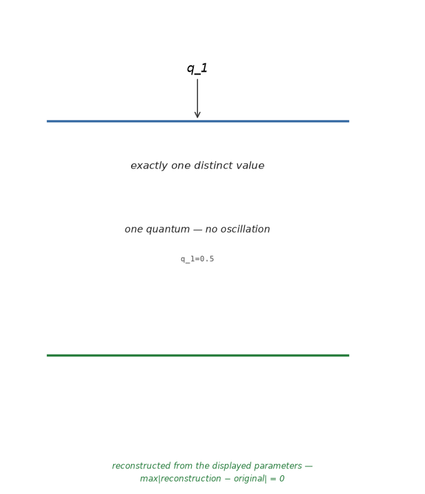<br>**(a)** `Q1` — CONSTANT, Param 1 | 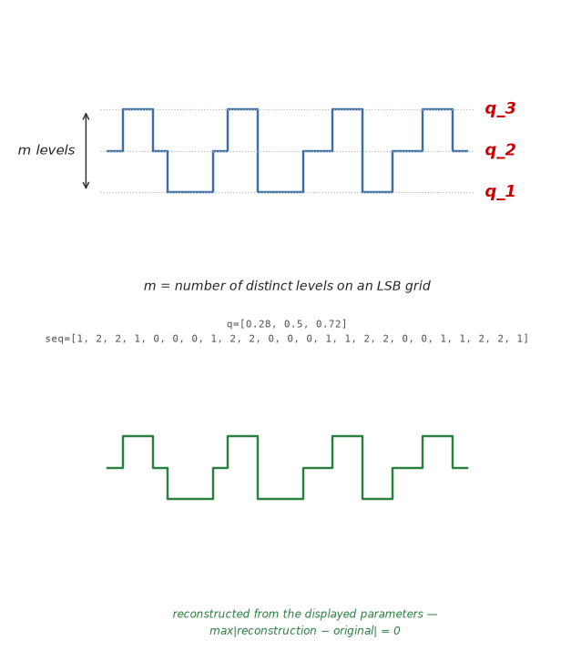<br>**(b)** `Q2…Q9` — QUANTIZED OSCILLATION, Param m | 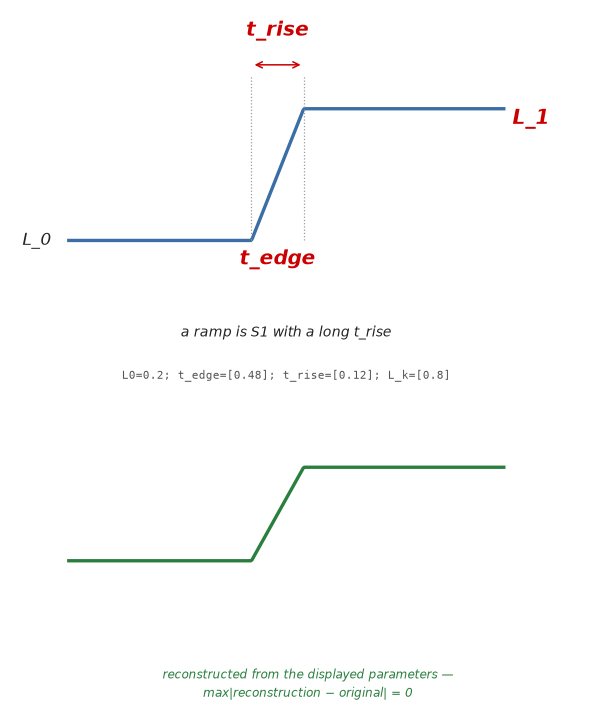<br>**(c)** `S1` — STEP (single), Param 4 |
| 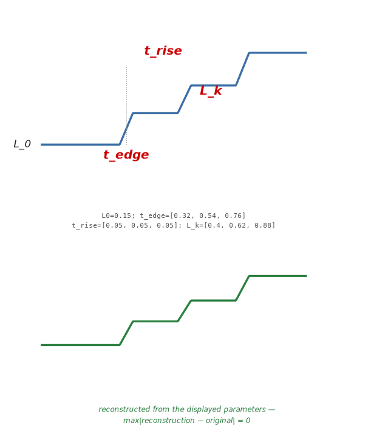<br>**(d)** `S2` — STEP (multi), Param 1+3n | 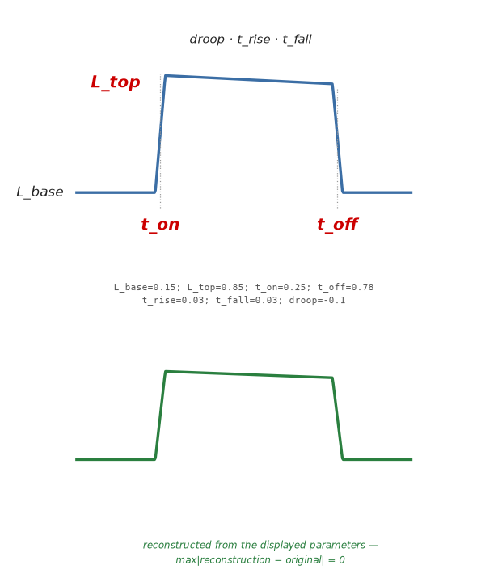<br>**(e)** `R1` — RECTANGLE (single), Param 7 | 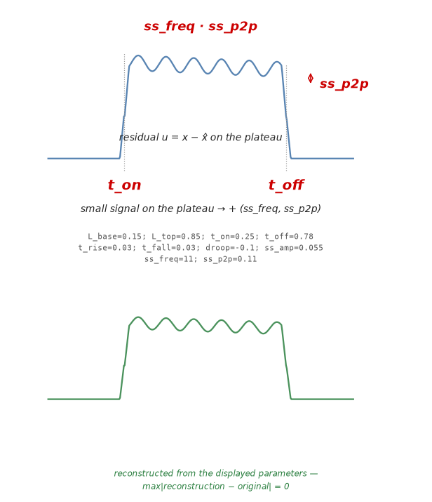<br>**(f)** `R1s` — RECTANGLE + small signal, Param 9 |
| 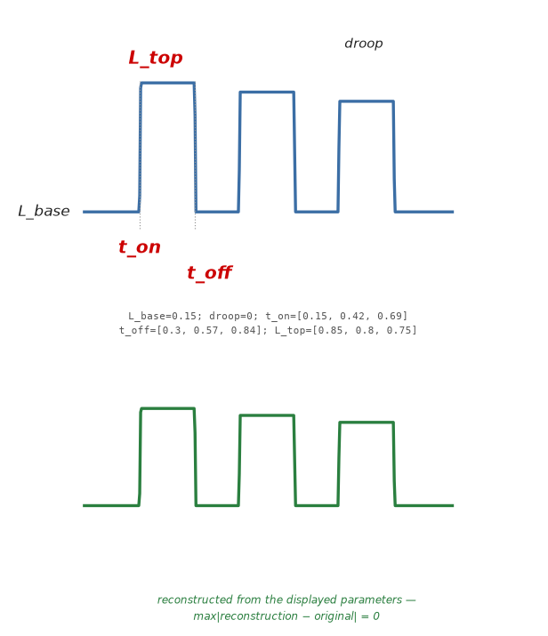<br>**(g)** `R2` — RECTANGLE (multi), Param 2+3n | 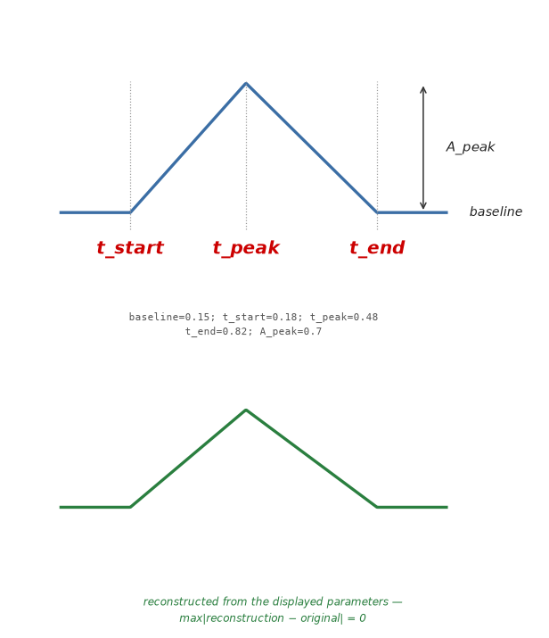<br>**(h)** `T1` — TRIANGLE, Param 5 | 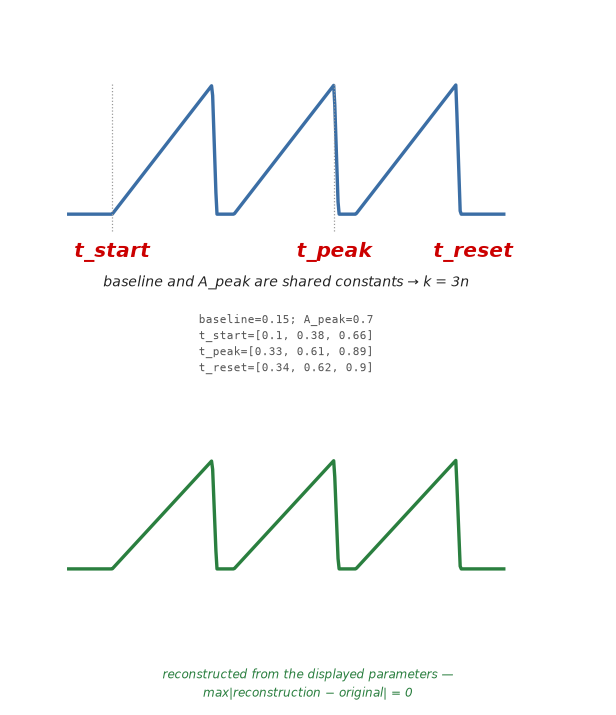<br>**(i)** `T2` — SAWTOOTH, Param 3n |
| 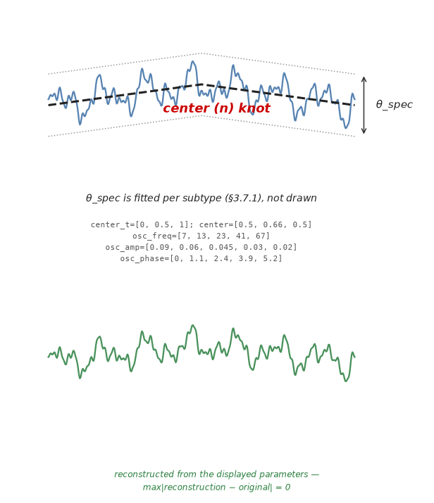<br>**(j)** `O2/O3/O4` — OSCILLATION, Param n+k_spec |  |  |

*Fig. 2. Location of each Table 8 reconstruction parameter on its chart
class waveform, one panel per class. **Red bold = Event parameter** (the block
that repeats n times); black italic = the remaining reconstruction parameters.
Dotted lines = level/time guides; double arrows = span dimensions. Each panel
is a separate file under `class/`, regenerated by `chart_class.py --mode files`
(the default); the panel label sits outside the image. `--mode a_file` draws the
same set as one 4-column sheet, and `--show-parameters true` prints the theta
used under each panel. `--show-reconstruction true` adds, under every panel, the
curve rebuilt by reading back only those printed values. **The time structure of
every class is itself a parameter** — the irregular-looking classes carry it
explicitly (`seq`, the level index per interval, for `Q2`~`Q9`; `osc_freq`,
`osc_amp`, `osc_phase` for `O`) rather than hiding it in the drawing code — so
every reconstruction matches its panel exactly
(`max|reconstruction − original| = 0` for all ten). `chart_class.py` asserts
this on every run, and also asserts that perturbing any single parameter
changes the curve, so the equality cannot be passed vacuously.
The output directory is cleared before writing. `chart_class.py` lives in the
`Claude-Code` repository under `Ultah/`, while the PNG files it produced are
checked in beside this document under `class/`.*

**Fig. 2 의 파형은 아래 평균함수에 예시 파라미터를 넣어 그린 것이다** —
`chart_class.py` 가 정의와 그림을 한 곳에서 내므로 도해와 적합이 어긋날 수
없다. 각 클래스의 파라미터가 파형의 어디를 가리키는지는 Fig. 2가, 정의와 계산식은
아래 목록이 정한다. 여기서 정의한 이름과 식을 §3의 적합과 §4의 추출이 그대로
쓴다. 각 절 머리의 `y = f(t)` 가 그 클래스의 **평균함수**이며, §3.3의 MLE 가
맞추는 대상이 바로 이 식이다.

엣지를 나타내는 공통 포화함수 (전이 하나를 0→1 로 선형 연결한다):

```
sat(u) = clip(u, 0, 1) = 0 (u < 0),  u (0 <= u <= 1),  1 (u > 1)
```

#### 2.2.1 CONSTANT (`Q1`)

```
y(t) = q_1                                    (Param 1)
```

값이 하나뿐이라 t 에 의존하지 않는다.

- `value` — `median(x)`. 툴 config 값.
- `residual_σ` — `std(x)`. 센서 잡음 바닥.
- `drift` — 선형회귀 기울기 × T / A. 상수여야 할 값의 서서한 변화.
- `valid` — `value ∈ physical_range`. `−275°C` 류 무효값 검출.

#### 2.2.2 STEP

```
y(t) = L_0 + SUM_{k=1..n} (L_k - L_{k-1}) * sat( (t - (t_edge,k - t_rise,k/2)) / t_rise,k )

     n = 1 -> S1  (Param 4),   n >= 2 -> S2  (Param 1+3n)
```

`t_edge,k` 는 전이의 중앙(50% 교차), `t_rise,k` 는 그 전이가 0→1 로 완결되는
폭이다. 램프는 `t_rise` 가 큰 `S1` 이다.

베이스라인 `L0`, 정착준위 `L1`, `ΔL = L1 − L0` 을 먼저 확정한 뒤:

- `t_edge` — 50% 교차 시각 (트레이스 상대 시간).
- `t_rise` — 10% → 90% 도달 시간.
- `slew` — `ΔL / t_rise`.
- `overshoot` — `(max − L1)/ΔL × 100 [%]`.
- `t_settle` — `abs(x − L1) < 0.02·A` 를 이후 계속 만족하는 최초 시각.
- `preshoot` — 엣지 직전 반대방향 편이량.
- `L1_droop` — 정착 후 구간 선형 기울기 × 구간길이 / ΔL.

**FDC 민감도가 가장 높은 3개: `t_edge`, `t_rise`, `overshoot`.**

#### 2.2.3 RECTANGLE (single)

```
up(t)  = sat( (t - (t_on  - t_rise/2)) / t_rise )
dn(t)  = sat( (t - (t_off - t_fall/2)) / t_fall )
top(t) = L_top + droop * (t - t_on)

y(t)   = L_base + ( top(t) - L_base ) * ( up(t) - dn(t) )     (R1, Param 7)
```

`up - dn` 이 ON 구간에서 1, 밖에서 0 인 게이트다. `droop` 은 플래토가
기울어지는 정도이며 사다리꼴은 `t_rise`·`t_fall` 이 큰 같은 식이다.

기본량:

- `L_base` — 하단 준위 구간의 median (초기값: p10 근방 샘플).
- `L_top` — 상단 준위 구간의 median (초기값: p90 근방 샘플).
- `A` — `L_top − L_base`.
- `t_on` / `t_off` — 상승 50% 교차 / 하강 50% 교차.
- `W` — `t_off − t_on` (펄스 폭).
- `D` — `W / T_step` (duty).

플래토 내부 파라미터가 실질적 정보다:

- `plateau_droop` — 상단 구간 회귀기울기 × W / A. **타깃 침식, 히터 열화, MFC 드리프트.**
- `plateau_ripple` — 상단 구간 detrend 후 std / A. 제어 안정성.
- `area` — `∫(x − L_base)dt`. **투입 총량 (가스 총유량, 총 전력량).**
- `t_rise`, `t_fall` — 10–90%. 액추에이터 응답성.
- `sym` — `t_rise / t_fall`. 상승·하강 비대칭.

**플래토의 small signal — `R1` vs `R1s`.** 플래토 위에 얹힌 작은 진동은
`plateau_ripple`(std)로 뭉뚱그리면 정보가 사라진다. 진동이 있으면 `R1s` 로
따로 분류하고 세 파라미터를 추가한다.

큰 신호를 빼는 방법은 **필터가 아니라 모델 잔차**다. `R1` 적합 결과 `x̂` 는
베이스라인·플래토 준위·엣지·`droop` 을 모두 가져가므로 잔차
`u = x − x̂` 자체가 small signal 이다. 차단주파수를 센서마다 튜닝해야 하는
고역통과 필터가 필요 없다. 엣지 전이가 잔차에 큰 스파이크를 남기므로
플래토 안쪽만 `guard = 5` 샘플 물려 잘라 쓴다
(`t_on + 5 < t < t_off − 5`).

- `ss_p2p` — `p99(u) − p1(u)`. 진동의 크기. 순수 `max−min` 은 이상치 하나에
  좌우되므로 백분위수로 잰다.
- `ss_freq` — `periodogram(u)` 최대 피크의 `f = ω/2π` [1/sample]. 제어 발진
  주파수. **PID 튜닝·공진의 직접 지표다.**
`ss_count` — `find_peaks(u, prominence = 0.25·ss_p2p, width = max(3,
0.02·M))` 의 개수 — 는 **파라미터가 아니라 판정 기준이다.** 읽기만 하는 값이라
`ss_freq`·`ss_p2p` 로 이미 재현되는 진동에 아무것도 더하지 않는다. 밸브
chattering 의 감시 지표로는 계속 쓴다 (§4).

판정: `ss_p2p > max(3·LSB, 0.02·A)` 이고 `ss_count ≥ 2` 이면 `R1s`,
아니면 `R1` 이다. **BIC 경쟁이 아니라 `R1` 이 채택된 뒤의 추가 분류**이며
(Fig. 3), `O` 의 하위형 판별과 같은 자리에 있다.

#### 2.2.4 RECTANGLE (multi) — Pulse Train

```
gate_k(t) = sat( (t - t_on,k) / w ) - sat( (t - t_off,k) / w ),   w = 0.02 * (t_off,k - t_on,k)

y(t) = L_base + SUM_{k=1..n} ( L_top,k + droop * (t - t_on,k) - L_base ) * gate_k(t)

                                                              (R2, Param 2+3n)
```

엣지 폭 `w` 는 펄스 폭의 2% 로 고정한다 — 펄스 열에서는 엣지가 급준하므로
파라미터로 두지 않는다.

개별 펄스 파라미터를 전부 뽑은 뒤 **집계 통계로 축약한다.**

- `n_pulse` — 펄스 개수 (레시피 설정값과 대조 검증).
- `T_period`, `jitter` — 펄스 간격 평균, `std(ΔT)/mean(ΔT)`.
- `D_mean`, `D_cv` — duty 평균 및 변동계수.
- `A_cv` — 펄스 진폭 변동계수.
- `t_on_total` — 총 ON 시간 = `Σ W`.
- `first/last_pulse_shift` — 첫·마지막 펄스 시각의 웨이퍼 간 편차.

개별 펄스 파라미터를 그대로 피처로 쓰면 차원이 폭발하고, 펄스 개수가 웨이퍼마다 다르면 정렬 자체가 불가능하다. **반드시 집계 통계로 고정 차원화한다.**

#### 2.2.5 TRIANGLE (single)

```
y(t) = baseline + A_peak * [ sat( (t - t_start) / (t_peak - t_start) )
                           - sat( (t - t_peak)  / (t_end  - t_peak ) ) ]

                                                              (T1, Param 5)
```

앞의 `sat` 이 상승 플랭크, 뒤의 `sat` 이 하강 플랭크다. 좁은 봉우리는
`t_end - t_start` 가 작은 같은 식이다.

**`A_peak` 는 부호를 갖는다 — 골짜기는 `A_peak < 0` 인 `T1` 이다.** 위 평균함수는
`A_peak` 가 음수여도 그대로 성립하며, `sat` 두 개의 차가 여전히 게이트이고 그
게이트에 음의 진폭이 곱해질 뿐이다. 그래서 골짜기를 받자고 클래스를 새로 두지
않는다 — §1.2의 "중복 클래스는 두지 않는다" 가 여기에도 적용되며, 봉우리와
골짜기는 같은 평균함수의 부호 차이일 뿐이다. 파라미터 수도 5 로 그대로다.

- `t_peak` — SG 평활 후 `|x − baseline|` 이 최대인 시각. 봉우리면 `argmax`,
  골짜기면 `argmin` 이 되며, 둘 중 편차가 큰 쪽이 정점이다.
- `baseline` — 정점 반대쪽 꼬리의 백분위수. 봉우리면 `p5(x)`, 골짜기면 `p95(x)`.
- `t_start`, `t_end` — `baseline` 에서 `A_peak` 의 5 % 를 지나는 교차 / 복귀 시각.
- `A_peak` — `x(t_peak) − baseline`. **부호가 곧 극성이다.**
- `k_up`, `k_dn` — 상승·하강 플랭크 회귀기울기.
- `asym` — `(t_peak − t_start)/(t_end − t_start)`. 0.5 대칭, →1 톱니형.
- `FWHM` — 반치 전폭. 봉우리의 폭 지표.
- `area` — `∫(x − baseline)dt`. **투입 열량 — 잡음에 가장 강건하다.**
- `R²_lin` — 플랭크 선형성. 형상 이상 지표.

정점이 완만한 채널에서 `A_peak`는 잡음에 민감하지만
`area`와 `t_peak`는 매우 안정적이다.
**피처 우선순위: `area` > `t_peak` > `FWHM` > `A_peak`.**

#### 2.2.6 TRIANGLE (multi) / SAWTOOTH

```
y(t) = baseline + A_peak * SUM_{k=1..n} [ sat( (t - t_start,k) / (t_peak,k - t_start,k) )
                                        - sat( (t - t_peak,k)  / (t_reset,k - t_peak,k) ) ]

                                                              (T2, Param 3n)
```

`baseline` 과 `A_peak` 는 사이클마다 두지 않고 트레이스에서 고정한 공유
상수다 — 그래서 파라미터 수가 `3n` 이다. `A_peak` 는 `T1` 과 같이 부호를 가지며,
음수이면 아래로 향하는 톱니다. 한 트레이스 안에서 극성이 사이클마다 바뀌는
파형은 `T2` 가 아니라 진동이므로 `O` 계열에서 다룬다.

- `n_cycle`, `T_period`, `T_jitter` — 사이클 수·주기·jitter.
- `saw_asym` — `t_rise/(t_rise + t_fall)`. 0.5=삼각, →1=톱니.
- `A_trend` — 사이클별 정점 진폭의 회귀 기울기 (사이클 간 드리프트).
- `k_up_cv` — 상승 기울기의 사이클 간 변동계수.

#### 2.2.7 CONSTANT (`Q1`), QUANTIZED OSCILLATION (`Q2`~`Q9`) and OSCILLATION (`O`)

진동을 단일 클래스로 두면 안 된다. **계측 아티팩트와 실제 물리 진동을 반드시 분리해야 한다.**
판별 도구: 값 히스토그램 + Welch PSD + 자기상관(ACF) 3종.

```
Qn :  y(t) in { q_1, ..., q_m }        m = number of distinct levels, 1..9
                                       (Param m;  m = 1 is the constant chart)

O  :  y(t) = center(t) + u(t)
      center(t) = interp(t; knots_t, knots_y)     piecewise linear, n knots
      u(t) ~ stationary process with spectrum S(w; theta_spec)   (§3.7.1)
                                       (Param n+4 for O2/O4, n+5 for O3)
```

`Qn` 은 파형이 아니라 **값이 놓이는 격자**가 모델이므로 `y = f(t)` 형태의
평균함수가 없다. `O` 는 평균함수가 중심선뿐이고, 나머지는 스펙트럼으로만
규정되는 확률과정이다 — 이것이 두 계열이 STOCHASTIC 인 이유다.

**`Q1` CONSTANT · `Q2`~`Q9` QUANTIZED OSCILLATION.** 값이 LSB 격자 위 몇 칸 안에서만 오가는
트레이스다. 형상이 아니라 **분해능 바닥의 왕복**이므로 결정형 모델로 적합할
것이 없고, BIC 가 아니라 정의로 판정한다.

```
quantum count   m = round(A / LSB),  1 <= m <= 9   ->  class Qm
```

`m` 은 준위 개수이므로 정수이고 임계값이 아니다. **`m = 1` 은 `Q1`
CONSTANT** — quantum 이 하나면 오갈 준위가 없어 진동이 성립하지 않으므로
DETERMINISTIC 이고 저장하는 것도 `q_1` 하나뿐이다(`k = 1`). **진동은
`Q2`부터**이며, 클래스가 `Q2`부터 `Q9`까지 나뉘는 이유는 **quantum count
자체가 센서 건전성 지표**이기 때문이다 — 같은 센서가 `Q2`에서 `Q4`로
넘어가면 밴드가 넓어졌다는 뜻이다.

파라미터 (`Q2`~`Q9`, parameter count = `m`):

- `q_1` … `q_m` — **quantum values.** 실제로 나타난 준위 값들. 격자
  자체가 형상이므로 준위 값을 그대로 저장한다.

이전 판에는 `freq`·`count`·`band_width`·`psd` 가 함께 있었으나 **모두 뺐다.**
넷 다 트레이스에서 읽기만 하는 값이라 파형을 되돌리는 데 쓰이지 않는다.
`psd` 는 정보조차 없다 — Parseval 에 의해 트레이스 분산 그 자체이며, 상수배만
다르다(그 상수는 `J = (N−1)/2` 로 자른 데서 온다). 파라미터는 **재현에 쓰이는
것만** 둔다.

따라서 `Q1`~`Q9` 는 `k = m` 하나로 통일된다 — `Q1` 은 `m = 1` 이라 `k = 1`
이고, 이는 CONSTANT 가 quantum 하나인 경우라는 정의와 그대로 맞는다.
`count` 는 여전히 계산하지만 **감시 지표**일 뿐 파라미터가 아니다 (§4).

**계측 아티팩트이므로 분산 계열 피처는 전량 폐기하고 위 파라미터만 쓴다.**
상수(`Q1`)와 밴드(`Q2`~`Q9`)를 같은 계열의 quantum count 로 두면 **경계가
임계값이 아니라 준위 개수라는 정수**가 되어 웨이퍼 간에 흔들리지 않는다.

**`O` OSCILLATION** 은 격자에 갇히지 않는 진동이며 하위형 셋으로 갈린다.

- `O2` 리미트 사이클 — PSD 우세 피크 (prominence > 10 dB), ACF 주기적 피크.
  추출: `f_dom`, 진폭, Q값. **제어 발진 — 실제 이상. PID 튜닝 / 공진.**
- `O3` 뱅뱅 제어 — 값 히스토그램 이봉(bimodal), 두 준위 간 전이.
  추출: duty, 전이 횟수, ON/OFF 시간 분포. **정상 동작 — 전이 횟수 급증 = 밸브 chattering.**
- `O4` 광대역 잡음 — PSD 피크 없음, 단봉 분포.
  추출: RMS, 포락선. 센서 잡음 또는 실제 난류.

##### Common Parameters

- `center` — 저역통과 후 이동중앙값 궤적.
- `env_hi` / `env_lo` — 국소 극대/극소점 보간 포락선.
- `bandwidth` — `mean(env_hi − env_lo)`.
- `ρ` — 전이 밀도 (분류 게이트값 재사용).
- `f_dom`, `spec_entropy` — Welch PSD 최대 피크 주파수 / 스펙트럼 엔트로피.

**웨이퍼 간 비교는 `center` 궤적으로만 수행하고, `bandwidth`는 별도 센서 건전성 지표로 분리 관리한다.**

### 2.3 Cycle Count

트레이스가 같은 형상을 몇 번 반복하는지를 세는 값이다. **분류(§3)에 앞서
정하며, cycle count 가 후보 클래스를 단일 이벤트 계열과 반복 계열로 가른다.**

세는 방법은 **극대(peak)·극소(valley)의 반복**이다. `scipy.signal.find_peaks`
를 그대로 쓰며, 지정하는 인자와 기본값으로 두는 인자는 구현 문서가 적는다.

1. 두 가지 문턱을 정한다. 진폭 `A = max(x) − min(x)`, 분해능
   `LSB`(Appendix C.1.1), 표본 수 `N` 에서
   `prominence = max(0.25·A, 3·LSB)` (얼마나 솟았는가) 와
   `width = max(3, 0.02·N)` (얼마나 머무는가) 다.
2. `find_peaks(x, prominence, width)` 로 극대를,
   `find_peaks(−x, prominence, width)` 로 극소를 뽑는다. 평탄한 정상(plateau)은
   이 함수가 중앙 1개로 돌려주므로 사각 펄스도 극대 1개다.
3. 두 목록을 시간순으로 합쳐 **극대·극소가 번갈아 나오는 열**로 정리한다.
   같은 극성이 연달아 나오면 더 극단인 것만 남긴다 (잡음이 만든 중복 극점 제거).
4. `cycle = max(극대 수, 극소 수)`, 최소 1.

읽는 법:

- `cycle = 1` — 반복 없음. `S1` 처럼 내부 극점이 없는 형상, 그리고
  단일 펄스·단일 정점(`R1`, `T1`)이 모두 여기 속한다.
- `cycle ≥ 2` — 반복 있음. 펄스 열(`R2`)·톱니(`T2`)·다중 준위 전이(`S2`)다.

**cycle count 는 Table 8 의 `Events` 와 다르다.** `Events = n` 은 모델 차수,
즉 이벤트(엣지·펄스·정점) 블록의 개수일 뿐이다. 상승부가 두 단계로 꺾인
펄스 하나는 엣지가 3개라 `Events = 3` 이지만 극대는 1개뿐이므로
`cycle = 1` 이다. 반복이 아닌 것을 반복 클래스로 판정하는 일을 막는 것이
cycle count 를 먼저 세는 이유다.

**`width` 하한이 필요한 이유**: `prominence` 만으로는 **진폭이 큰 불규칙
요동이 전부 반복으로 세어진다.** 극점 간격이 평균만큼 흔들리는 트레이스도
극점 개수만으로는 여러 사이클로 세어지며, 그러면 후보가 반복 계열로 잘못
제한된다. 한 사이클이라면 정점 부근에 최소한 트레이스의 2% 는 머문다는
것이 `width` 하한의 근거다.

**cycle count 는 웨이퍼별로 유지한다.** 트레이스마다 재는 측정값이므로 센서
하나로 접지 않는다. 최빈값으로 고정하면 그 센서가 실제로 반복 구조를 바꾼
웨이퍼를 다수결로 지우게 되는데, **그렇게 지워지는 웨이퍼가 바로 FDC 가
찾아야 할 것**이다. 웨이퍼 간 cycle 이 갈리는 것은 분류기 문제가 아니라
형상이 달라졌다는 신호로 읽는다. 값은 `cycle.csv` 에 웨이퍼 × 센서
매트릭스로 남긴다.

주기성 판별(periodic / non-periodic): cycle count 가 정해진 뒤 같은 극성
극점의 시각 `t_k` 로 `T_period = mean(Δt)`, `jitter = std(Δt)/mean(Δt)` 를
구해 `cycle ≥ 3` 이고 `jitter ≤ 0.1` 이면 periodic(§2.4), 그 외는
non-periodic(§2.5)이다. `O` 처럼 극점 경계가 불명확하면 ACF
([Appendix B.1](#b1-autocorrelation-function-acf))의 주기적 피크나 Welch PSD
([Appendix B.2](#b2-welch-power-spectral-density-psd))의 우세 피크로 보조
판정한다 (§2.2.7의 O2 판별과 같은 도구).

### 2.4 Periodic Chart

이벤트별 목록 대신 반복의 통계만 저장한다 (periodic summary). n이 아무리
커도 벡터 크기가 고정된다.

*Table 9. Periodic-summary vectors for Events = n classes*

| Code | List form (size) | Periodic-summary form (size) |
|---|---|---|
| `S2` | `(t_edge, t_rise, L_k)` × n (1+3n) | `L0`, `n`, `T_period`, `jitter`, `ΔL_mean`, `t_rise_mean` (6) |
| `R2` | `(t_on, t_off, L_top)` × n (2+3n) | `L_base`, `droop`, `n`, `T_period`, `jitter`, `D_mean`, `L_top_mean`, `A_trend` (8) |
| `T2` | `(t_start, t_peak, t_reset)` × n (3n) | `n`, `T_period`, `jitter`, `saw_asym`, `A_trend` (5) |

- `T_period` = mean(Δt), `jitter` = std(Δt)/mean(Δt), `A_trend` = 이벤트
  진폭의 회귀 기울기, `rate` = n / T.
- **검증 방식 전환**: 주기 요약은 위상(개별 이벤트 시각)을 버리므로 §5의
  파형 재현 검증이 불가능해진다. `O`처럼 통계 재현(이벤트 수·주기·duty
  분포의 일치)으로 confidence를 측정한다.

### 2.5 Non-Periodic Chart

이벤트 목록 = 이벤트마다 파라미터 튜플을 그대로 저장하는 형태
(예: `R2`의 `(t_on, t_off, L_top)` × n — 크기가 3n에 비례; 1+3n, 2+3n도 같은
계열). 불규칙 반복은 주기 요약으로 누르면 재현이 깨지므로,
목적에 따라 다음 방법 중에서 고른다.

- **방법 A — 이벤트 목록 유지 (기본)**
  - 위상(이벤트 시각)이 보존되어 §5 파형 재현 검증과 타이밍 FDC가
    그대로 성립한다. 크기는 3n류.
  - 적용: 타이밍 이동 자체가 FDC 신호인 센서 (`R2` 펄스 열 등).
- **방법 B — delta encoding (크기 절감 절충)**
  - 대표 주기 파라미터 + 이벤트별 잔차
    `Δt_k = t_k − (t_1 + (k−1)·T_period)` 만 저장한다.
  - 잔차가 샘플링 분해능 이하인 이벤트는 폐기(censored)하고 남는
    이벤트만 저장 — 위상 정보와 크기 절감을 동시에 얻는다.
- **방법 C — basic statistics (고정 9개 벡터)**
  - 이벤트 값 `y`(진폭 등)와 이벤트 간격 `Δt`의 기초 통계만 저장한다:
    `mu(y)`, `stdev(y)`, `min(y)`, `max(y)`, `count(y)`,
    `mu(Δt)`, `stdev(Δt)`, `min(Δt)`, `max(Δt)`.
  - n·주기성과 무관하게 항상 적용 가능한 최소 고정 벡터. 위상과 개별
    이벤트 정보를 포기하므로 검증은 통계 재현(§2.4와 동일)으로 한다.
- **방법 D — AUC (스칼라 1개)**
  - `AUC = ∫(x − baseline) dt` — 트레이스 전체(또는 이벤트별 면적의 합)의
    누적 면적으로, 총 투입량(총 유량·총 전력량·총 아킹 에너지)을 1개
    스칼라로 요약한다.
  - 이벤트 수·타이밍에 둔감해 non-periodic에서 가장 강건한 요약이며,
    VM의 총량 피처로 적합하다. 단독으로는 형상 정보가 없으므로 방법
    C와 병용을 권장한다 (C+D = 10개 고정 벡터).

선택 기준: 타이밍 FDC 필요 → A/B, 벡터 크기 고정이 우선 → C, 물리
총량만 중요 → D (권장 조합 C+D).

## 3. Chart Classification

트레이스 1개를 Table 8의 클래스 하나로 판정한다. 판정 원리는 **penalized
maximum likelihood**다 — 각 클래스를 하나의 모수적 모델로 보고 maximum
likelihood로 적합한 뒤, **파라미터 수로 penalize한 BIC가 최소인 클래스를
채택**한다. 클래스 체계(§1.2)와 재현 파라미터(Table 8)가 이미 모델족과
그 복잡도를 정의하고 있으므로, 분류에 새로 도입하는 것은 penalty 항
하나뿐이다.

분류가 훑는 탐색 공간은 다음 트리다. **이것은 잎 하나까지 걸어 내려가는
결정 트리가 아니라 후보를 줄이는 가지치기 구조다.**

- **별표 마디는 전부 선행 판별(§3.1)이다** — 적합 없이 정의로 정해진다.
  다만 하는 일이 두 가지다.
- `INACTIVE*`/`ACTIVE*`(§1.5의 Activity Check)·`Q1*`·`Qn*` 은 **클래스를
  확정**한다. 걸리면 거기서 끝이다.
- `cyclic*` / `acyclic*` 은 클래스를 고르는 것이 아니라 **후보 집합을 줄인다** —
  `cycle = 1` 이면 `{S1, R1, T1, O}`, `cycle ≥ 2` 면 `{S2, R2, T2, O}` 만 남는다.
- **남은 잎은 전부 적합한다.** 잎 하나하나가 `θ` 와 `k` 를 가진 모델족이며,
  그 전부를 §3.3의 MLE 로 맞춘 뒤 **§3.5의 BIC argmin 이 클래스를 고른다.**
  어떤 클래스인지 몰라서 전부 적합하는 것이고, 트리는 그 "전부"의 범위를
  좁히는 역할만 한다.

```
root
├── INACTIVE*          identical chart on every wafer  -> excluded from the vector
│                                                          (Activity Check, §1.5)
└── ACTIVE*            varies across wafers  (= not INACTIVE)
     │
     ├── Q1*           CONSTANT — one quantum, no oscillation
     │                 chart_class_Qn(),  m = 1
     │
     ├── Qn*           QUANTIZED OSCILLATION,  n = 2..9
     │                 n = number of distinct levels on an LSB grid  (§2.2.7)
     │                 chart_class_Qn()
     │
     ├── cyclic*       cycle >= 2  (§2.3)              -> repetition classes
     │    ├── S2        STEP (multi)
     │    ├── R2        RECTANGLE (multi)
     │    ├── T2        SAWTOOTH
     │    └── O         OSCILLATION (STOCHASTIC)
     │         ├── O2    limit cycle
     │         ├── O3    bang-bang
     │         └── O4    broadband
     │
     └── acyclic*      cycle = 1  (§2.3)               -> single-event classes
          ├── S1        STEP (single)
          ├── R1        RECTANGLE (single),  kappa >= 0.7
          │    ├── R1   no small signal on the plateau
          │    └── R1s  small signal present  -> + (freq, p2p)
          ├── T1        TRIANGLE,  kappa < 0.7
          └── O         OSCILLATION (STOCHASTIC)
               ├── O2    limit cycle
               ├── O3    bang-bang
               └── O4    broadband
```

*Fig. 3. Chart class search tree. **An asterisk marks a pre-classification
node (§3.1) — decided by definition alone, before any fitting.** Two kinds:
`INACTIVE*` / `ACTIVE*` (the Activity Check of §1.5), `Q1*` and `Qn*` **terminate** (the trace is classified there and
nothing below runs — no cycle count, no MLE fit, no BIC), while `cyclic*` and
`acyclic*` **prune** (they pick no class, they only cut the candidate set that
goes to the fit). Everything under the pruning nodes is fitted and settled by
BIC argmin (§3.5), so a wrong pruning decision cannot be recovered by the fit.
`R1s` and the `O` subtypes are refinements decided **after** their parent class
is adopted, not by competing in BIC.*

**`cyclic*` 아래의 `O` 와 `acyclic*` 아래의 `O` 는 나머지를 받는 자리다.**
`O2`~`O4` 는 cycle count 의 게이트를 받지 않고 **양쪽 가지 모두에 후보로
들어간다** — `center(n)` knot 수는 모델 차수이지 반복 횟수가 아니기 때문이다.
그리고 그 모델(구간 선형 중심선 + 잡음 스펙트럼)은 특정 형상을 주장하지
않으므로, **결정형 클래스 어느 것도 형상을 설명하지 못한 트레이스가 여기로
간다.**

다만 이것은 `else` 분기가 아니라 **BIC 경쟁**이다. `O` 는 다른 후보와 같은
자격으로 적합되고, `L`·`R`·`T` 가 형상을 설명하면 파라미터가 적은 쪽이 이겨
`O` 는 채택되지 않는다. "나머지를 받는다"는 것은 규칙이 아니라 **결과**다 —
설명할 형상이 없을 때만 `O` 의 BIC 가 최소가 된다.

가지를 치는 순서가 곧 §3.1의 선행 처리 순서다 —
`INACTIVE*` / `ACTIVE*` → `Q1*` → `Qn*` → `cyclic*` / `acyclic*`. **별표가 붙은 마디는
모두 적합 없이 정의로 정해진다.** 걸러지지
않은 것만 cycle count 로 갈라 BIC 로 겨루며, `R1` 아래의 `R1s` 와 `O` 아래의
하위형은 부모 클래스가 채택된 뒤에 정해진다 (BIC 경쟁이 아니다).

### 3.1 Pre-Classification

Fig. 3에서 별표가 붙은 마디(`INACTIVE*`·`ACTIVE*`·`Q1*`·`Qn*`·`cyclic*`·`acyclic*`)의 판정이다. 적합(§3.3)
이전에 **적합 없이 확정되는 것부터 먼저 처리한다** — 후보를 전부 적합해 BIC 를
비교하는 것은 비싸고, 어차피 결과가 정해져 있는 트레이스까지 그 비용을 낼
이유가 없다. 선행 처리는 세 가지이며 순서대로 진행한다. **2 번에서 확정되면 그
트레이스는 거기서 끝난다** — cycle count 도, 적합도, BIC 도 돌지 않는다.

1. **Activity Check** — INACTIVE 센서·웨이퍼를 먼저 제외한다 (§1.5). 값만
   읽어서 판정하므로 분류 비용이 들지 않고, 움직이지 않는 센서가 많은
   데이터에서는 여기서 빠지는 몫이 크다. 웨이퍼 축 전체를 봐야 내려지는
   판정이므로 트레이스 단위 처리보다 먼저 와야 한다.
2. **`Q1`~`Q9` 확정** (`chart_class_Qn()`) — 값이 LSB 격자 위 `m` 개 준위만
   가지면(`m ≤ 9`, `A ≤ (m−1+0.5)·LSB`) 형상이 아니라 분해능 바닥의
   왕복이므로 적합할 결정형 모델이 없다. **`Qm` 으로 확정하고
   `q_1`…`q_m` 을 바로 뽑는다** (§2.2.7).
   **`m = 1` 은 `Q1` CONSTANT 다** — quantum 이 하나면 진동이 성립하지
   않으므로 DETERMINISTIC 이고 `q_1` 하나만 저장한다(`k = 1`). 어떤 클래스로
   적합해도 잔차가 0이라 파라미터가 가장 적은 것이 이긴다. 표본이 너무
   적어(`N < 8`) 어떤 모델도 식별되지 않는 경우도 여기서 `Q1` 로 둔다.
3. **cycle count 확정** — 위에서 걸러지지 않은 트레이스만 대상이다. §2.3의
   cycle count 로 후보 집합 자체를 단일 이벤트 계열과 반복 계열로 가른다.
   적합 횟수가 절반 이하로 줄고, 반복이 아닌 트레이스가 반복 클래스로
   판정되는 일이 사라진다.

### 3.2 Notation

§3의 모든 수식이 쓰는 기호다. 이후 절에서 새로 등장하는 기호는 해당
절에서 정의한다.

- `x = (x_1, …, x_N)` — 판정 대상 트레이스. 웨이퍼 1장에서 센서 1개가 기록한 시계열 하나다.
- `N` — 트레이스의 샘플 수.
- `i` — 샘플 인덱스, `i = 1 … N`. Table 8의 반복 수 `n`과 구별한다.
- `t_i` — `i`번째 샘플의 시각.
- `x_i` — `t_i`에서의 관측값.
- `C` — Table 8이 정의하는 후보 클래스의 집합. `c ∈ C`가 개별 후보 클래스다.
- `θ_c` — 클래스 `c`의 **재현 파라미터 벡터**. 성분 목록은 Table 8의
  Reconstruction parameters 열이 클래스마다 지정한다 (예: `c = S1`이면
  `θ_c = (L0, L1, t_edge, t_rise)`). MTSV가 저장하는 벡터가 바로 이것이다.
- `k_c` — `θ_c`의 성분 개수 `dim(θ_c)`. Table 8의 parameter count 열과 같다.
- `f_c(t; θ_c)` — 클래스 `c`의 **평균함수**. `θ_c`만으로 결정되는 이상화된
  파형이며, §5.2의 클래스별 재현 모델과 같은 함수족이다.
- `ε_i` — `t_i`에서의 **잔차항**. 관측값이 평균함수에서 벗어난 양
  `ε_i = x_i − f_c(t_i; θ_c)`이며, 센서 측정 잡음과 모델 오차를 합쳐
  하나의 확률변수로 본 것이다. 평균 0, 분산 `σ²`의 정규분포를 따르고
  샘플 간 독립(iid)이라 가정한다.
- `σ²` — `ε_i`의 분산. 미지수이며 클래스마다 따로 추정한다.

### 3.3 Likelihood Model

```
x_i = f_c(t_i; θ_c) + ε_i ,   ε_i ~ N(0, σ²)   iid

SSE_c(θ) = Σ_{i=1..N} ( x_i − f_c(t_i; θ) )²
θ̂_c     = argmin_θ SSE_c(θ)
```

- `SSE_c(θ)` — 클래스 `c`의 평균함수를 파라미터 `θ`로 놓았을 때의 잔차제곱합.
- `θ̂_c` — `SSE_c`를 최소로 만드는 `θ`. Gaussian 가정에서 maximum likelihood
  추정과 일치한다.

Gaussian 가정에서 maximum likelihood 추정은 least squares와 일치하므로
클래스 내부의 파라미터 추정은 §4의 추출 규칙을 초기값으로 두고 비선형
최소제곱으로 정련하면 된다. `σ²`를 profile out 하면 클래스 `c`의 최대
log-likelihood는 `SSE_c(θ̂_c)`만의 함수로 남는다.

```
σ̂²_c = SSE_c(θ̂_c) / N
ℓ̂_c  = −(N/2) · [ log(2π · σ̂²_c) + 1 ]
```

- `σ̂²_c` — 클래스 `c`에서의 `σ²` maximum likelihood 추정치.
- `ℓ̂_c` — 클래스 `c`가 달성하는 **최대 log-likelihood**. `θ`와 `σ²`를 모두
  최적화한 뒤 남는 값이므로 `SSE_c(θ̂_c)`만의 함수다.
- 이하 표기를 줄여 `SSE_c ≡ SSE_c(θ̂_c)`로 쓴다.

### 3.4 Raw Likelihood Alone Is Not a Decision Rule

Table 8의 모델족은 **nested**다 — `S1 ⊂ R1 ⊂ R2`, `S1 ⊂ S2`,
`T1 ⊂ T2`처럼 상위 클래스는 하위 클래스를 파라미터의 특수해로 포함한다.
따라서 `argmax_c ℓ̂_c`는 **항상 `k_c`가 가장 큰 클래스를 고른다**.
`SSE_c`는 자유도가 늘면 단조 감소하므로 이 순위는 데이터가 무엇이든
바뀌지 않는다. 클래스 선택에는 복잡도 penalty가 반드시 필요하다.
포함 사슬의 전체 목록과 그것이 설계에서 어떻게 따라 나오는지는
[Appendix E](#appendix-e--nested-model-families)에 있다.

### 3.5 Decision Rule — BIC

```
BIC_c = N_eff · log(SSE_c / N) + k_c · log N_eff

class = argmin_{c ∈ C} BIC_c
```

- `BIC_c` — 클래스 `c`의 Bayesian Information Criterion 값. `−2·ℓ̂_c`에서
  클래스 공통 상수를 뺀 적합도 항과, `k_c`에 비례하는 penalty 항의 합이다.
  **작을수록 좋다.**
- `N_eff` — 유효 표본 수. 정의는 §3.6.
- `k_c`는 **Table 8의 parameter count 열을 그대로** 쓴다. 복잡도 정의를
  분류 절이 따로 만들지 않는다는 뜻이다.
- `σ²`가 더하는 자유도 1은 모든 클래스에 공통이므로 argmin 순위에
  영향을 주지 않는다. 생략해도 되고 넣어도 결과가 같다.
- Events = n 클래스(`S2`, `R2`, `T2`, `O`)는 이벤트 수 `n`도 모델
  차수이므로 `k_c(n)`(예: `S2`는 `1+3n`)을 써서 **`(c, n)` 쌍 전체에 대해
  argmin**을 취한다. 펄스 개수·이벤트 개수를 정할 별도 임계값이 필요 없다.
  구간 선형 클래스에서는 §3.8의 penalty `λ` 가 이 argmin을 분할 단계에서
  직접 수행하므로 `n` 을 따로 훑지 않아도 된다.
- 채택 클래스의 재현 잔차가 어느 클래스에서도 합격선(Appendix C)을
  넘지 못하면 모델족 밖의 트레이스이므로 재분류 후보로 표기한다.
- `ΔBIC = BIC_(2위) − BIC_(1위)` — 1순위와 2순위 클래스의 BIC 차이.
  경계 사례(`R1` vs `T1`)의 모호도를 그대로 준다 (§5.3과 같은
  목적, 같은 축). 값이 작을수록 모호하다.

**`BIC` 값 자체는 좋고 나쁨을 뜻하지 않는다.** `log(SSE/N)` 이 센서의 단위와
스케일에 좌우되므로 `−686` 같은 절대값은 비교 대상이 아니다 (`σ̂² < 1` 이면
그냥 음수다). 판단은 **같은 트레이스의 후보 사이의 차이 `ΔBIC`** 로만 한다.

*Table 10. `ΔBIC` interpretation*

| `ΔBIC` | 근거의 세기 (Kass & Raftery 1995) | 본 문서의 처리 |
|---|---|---|
| 0 ~ 2 | 사실상 동률 | 모호 — §4.3의 마스킹 대상 |
| 2 ~ 6 | 약함 (positive) | 모호 — §4.3의 마스킹 대상 |
| 6 ~ 10 | 강함 (strong) | 채택 |
| > 10 | 매우 강함 (very strong) | 확정 |

- `ΔBIC ≈ 2·log(Bayes factor)` 이므로 `ΔBIC = 10` 이면 1순위가 2순위보다
  약 150배 그럴듯하다는 뜻이다. §4.3의 모호 기준 `ΔBIC < 5` 가 여기서 온다.
- **파라미터 1개를 더 쓰는 비용은 `log N_eff`** 다. `N_eff ≈ 750` 이면 6.6이므로,
  파라미터를 하나 늘리려면 적합도 항이 그만큼 좋아져야 본전이다. 반대로 두
  후보의 `ΔBIC` 가 `log N_eff` 이하이면 파라미터 하나 차이로 순위가 뒤집힐 수
  있는 범위다.

### 3.6 Effective Sample Size and Noise Model

penalty가 제 역할을 하려면 표본 수가 **독립** 표본 수여야 한다. 센서
트레이스는 잔차가 자기상관을 가지므로 `N`을 그대로 쓰면 penalty가
과소평가되어 **복잡한 클래스가 다시 이긴다.** 잔차의 자기상관으로 유효
표본 수를 보정한다.

```
N_eff = N / ( 1 + 2 · Σ_{m=1..M} ρ_m )
```

- `m` — 자기상관의 lag(시간 지연) 인덱스, 단위는 샘플.
- `ρ_m` — 채택 후보의 잔차 `ε̂_i = x_i − f_c(t_i; θ̂_c)` 수열에 대한 lag `m`
  자기상관 계수. 정의는 Appendix B.1의 `r(τ)`에서 `x`를 `ε̂`로, `τ`를 `m`으로
  둔 것과 같다.
- `M` — 합산을 끊는 lag. `ρ_m`이 처음으로 `0` 이하가 되는 `m`에서 멈춘다.
- `N_eff` — 유효 표본 수. 잔차가 무상관이면 `ρ_m = 0`이므로 `N_eff = N`이 된다.

양자화가 지배적인 센서(LSB 단위로 계단이 보이는 신호)는 Gaussian 대신
LSB 이산 가능도를 쓰거나, 최소한 `σ̂_c = √(σ̂²_c)`에 하한 `LSB/√12`를
건다 — `LSB/√12`는 폭 `LSB`인 균등분포의 표준편차, 즉 양자화만으로
설명되는 잔차의 하한이다 (`LSB`의 정의는 Appendix A). 이 보정을 하지
않으면 양자화 잡음을 형상으로 오인해 `S2`·`R2` 같은 다중 이벤트 클래스가
과선택된다.

### 3.7 STOCHASTIC Class — Whittle Likelihood

`O`는 샘플 단위 평균함수가 없어 §3.3의 형태로는 likelihood를 쓸 수 없다.
주파수 영역에서 정상 확률과정의 log-likelihood를 근사하는 **Whittle
likelihood**를 쓰면 DETERMINISTIC 클래스와 **같은 축의 값**이 나오므로
하나의 BIC 비교에 함께 넣을 수 있다.

```
ℓ_Whittle(θ) = − Σ_{j=1..J} [ log S(ω_j; θ) + I(ω_j) / S(ω_j; θ) ]

ω_j = 2πj / N ,   J = ⌊(N−1)/2⌋
```

- `j` — Fourier 주파수 인덱스.
- `ω_j` — `j`번째 Fourier 주파수 (rad/sample).
- `J` — 합산에 쓰는 주파수 개수. Nyquist 아래의 양의 주파수만 센다.
- `I(ω_j)` — 트레이스의 periodogram 값, 즉 `ω_j`에서 관측된 전력
  (Appendix B.2의 `P_i(f)`를 세그먼트 분할 없이 전체 구간에 적용한 것).
- `S(ω; θ)` — 파라미터 `θ`가 정하는 **모델 스펙트럼 밀도**. `O`의 경우
  `θ = θ_O`이며 구체적 형태는 §3.7.1이 정의한다.
- `ℓ_Whittle(θ)` — 그 `θ`에서의 근사 log-likelihood. `ℓ̂_O = max_θ ℓ_Whittle(θ)`로
  두면 §3.5의 `BIC_c`에 DETERMINISTIC 클래스와 나란히 들어간다.

#### 3.7.1 Spectral Model `S(ω; θ_O)`

`O`의 트레이스를 **느린 중심선 + 정상 확률과정**으로 분해한다.

```
x_i = c(t_i; θ_center) + u_i
```

- `c(t; θ_center)` — 중심선. Table 8의 `center (n)`, 즉 `n`개 노드를 잇는
  조각선형 궤적이다. 파라미터 수는 `n`.
- `u_i` — 중심선을 뺀 나머지. 평균 0의 정상 확률과정으로 보고, 이
  과정의 스펙트럼 밀도가 `S(ω; θ_spec)`다.
- Whittle likelihood의 `I(ω_j)`는 **`u = x − c` 의 periodogram**을 쓴다.
  중심선을 빼지 않으면 저주파 전력이 백색 바닥 항으로 흡수되어 하위형
  판별이 무너진다.

모델 스펙트럼은 **백색 바닥 + 하위형별 성분**의 합이다. Whittle 합이
`ω_j > 0`만 쓰므로 아래 식은 양의 주파수에서만 정의한다.

*Table 11. `O` subtype spectral densities*

| Subtype | `S(ω; θ_spec)` | `θ_spec` | `k_spec` | 물리 의미 |
|---|---|---|---|---|
| `O2` 리미트 사이클 | `σ_w² + A²·γ² / ((ω − ω_0)² + γ²)` | `A`, `ω_0`, `γ`, `σ_w²` | 4 | 단일 협대역 peak. 제어 발진·공진 |
| `O3` 뱅뱅 | `σ_w² + Σ_{k≥1} A_k²·γ² / ((ω − k·ω_0)² + γ²)`,  `A_k = A·sin(πkD)/(πk)` | `A`, `ω_0`, `γ`, `D`, `σ_w²` | 5 | 구형파 고조파 열. `D`가 고조파 세기를 정하므로 duty가 스펙트럼에서 직접 추정된다 |
| `O4` 광대역 | `σ_w² + σ_b² / (1 + (ω / ω_c)^α)` | `σ_b²`, `ω_c`, `α`, `σ_w²` | 4 | peak 없는 감쇠 스펙트럼. 센서 잡음(α≈0) 또는 난류(α>0) |

- `ω_0` — 기본 각주파수 `2π·f_dom` (rad/sample). `f_dom`은 Table 8의 진동
  주파수와 같은 값이다.
- `γ` — peak의 반치 반폭(rad/sample). `Q = ω_0 / (2γ)`로 환산되며 값이
  작을수록 순수한 정현 진동이다.
- `A` — peak 성분의 진폭 척도. `bandwidth ≈ 2√2·A` 로 Table 8의
  `bandwidth`와 대응한다.
- `D` — duty (`O3`). 정의는 Appendix A.
- `σ_w²` — 주파수에 무관한 백색 바닥. 센서 잡음 + 양자화 잔여.
- `σ_b²`, `ω_c`, `α` — 광대역 성분의 세기 / 꺾임 각주파수 / 감쇠 지수.
- `m` — 양자화 밴드폭의 LSB 배수 (정수, 1~3). `LSB`의 정의는 Appendix A.

**파라미터 수**: `k_O = n + k_spec`. `O2`·`O4`는 `n+4`, `O3`는 `n+5`다. 하위형은
별도 임계값으로 고르지 않고 **`(하위형, n)` 조합 전체에 대한 §3.5의
argmin BIC** 안에서 함께 결정된다 — peak 하나로 설명되는 신호에 `O3`의
고조파 열을 쓰면 `k_spec`만 커져 BIC가 나빠지므로 자동으로 걸러진다.

**초기값** (Welch PSD, Appendix B.2):

```
sigma_w^2 = median( P(f),  f > 0.4 * f_Nyquist )     white-noise floor
omega_0   = 2*pi * argmax_f P(f)                     dominant peak
gamma     = half width at half maximum of the peak
A         = sqrt( max P − sigma_w^2 )
D         = solved from the 2nd/1st harmonic power ratio    (O3)
alpha, omega_c = slope and knee of log P vs log f regression  (O4)
```

이 초기값에서 `ℓ_Whittle(θ)`를 비선형 최적화로 최대화해 `θ̂_spec`을 얻는다.
`O`의 재현은 샘플 단위가 아니라 이 스펙트럼과 중심선의 재현이며, 일치도
판정도 같은 축에서 한다 (§5.2).

### 3.8 Computation — Change Point Detection

구간 선형 클래스(`S1`, `S2`, `R1`, `R2`, `T1`, `T2`)는
평균함수가 **세그먼트별 직선**이다. 이 모델족의 최대가능도 추정은 비선형
탐색이 아니라 **change point detection의 최적 분할**로 정확히 풀린다.

**무엇을 검출하는가** — 세그먼트 회귀계수 `(절편, 기울기)`가 바뀌는 지점이다.
준위 점프(`S`의 계단, `R`의 on/off)와 기울기 변화(`S1`의 전이 시작·끝, `T`의
정점)가 같은 기준으로 잡힌다. 세그먼트를 이어 붙이는 연결형(continuous)
모델을 쓰면 `L`의 불연속 점프가 뭉개지므로 **세그먼트마다 독립 직선
(비연결형)** 이어야 한다.

```
cost         C(a, b) = min_{alpha,beta} Sum_{i in [a,b)} ( x_i − alpha − beta*t_i )^2
partition    F(b) = min_{a < b} [ F(a) + C(a, b) + lambda ]        F(0) = −lambda
```

- `C(a, b)` — 구간 `[a, b)` 를 직선 하나로 적합했을 때의 잔차제곱합.
  누적합 `Σt`, `Σt²`, `Σx`, `Σx²`, `Σtx` 를 미리 계산해 두면 구간마다 `O(1)`이다.
- `λ` — 세그먼트 하나를 추가하는 penalty. §3.5의 BIC penalty와 같은 값
  (`λ = k_seg · log N_eff`, `k_seg` = 세그먼트당 파라미터 수)으로 두면
  분할 개수가 곧 BIC argmin이 된다.
- `F(b)` — `[0, b)` 를 최적 분할했을 때의 총 비용. 역추적하면 breakpoint
  집합과 세그먼트별 `(α̂, β̂)` 가 나온다.

알고리즘은 penalty로 개수를 정하는 **PELT**(pruned exact linear time) 또는
개수를 고정한 **optimal partitioning**을 쓴다. 어느 쪽도 국소 최적에 빠지지
않는 **전역 최적해**이므로 초기값이 필요 없다.

분할 결과에서 클래스 파라미터를 직접 읽는다 — breakpoint가 `t_edge`·`t_on`·
`t_off`·`t_start`·`t_peak`이고, 세그먼트 절편·기울기가 `L0`·`L1`·`L_base`·
`L_top`·`slope`·`droop`이다. 세그먼트 개수와 기울기 부호 패턴이 클래스를
가르며, 경계가 겹치는 클래스(`R1` vs `T1`)만 §1.2의 형상 경계로
갈라낸다.

**cycle count 로 후보를 먼저 가른다** (§2.3). 분할이 주는 것은 이벤트 수 `n`
의 상한일 뿐이어서, 반복이 없는 트레이스도 엣지만 여럿이면 `S2` 같은 반복
클래스가 후보로 들어온다. 이런 모델은 어떤 형상에나 잘 맞는 만능 적합이 되어
BIC 를 이기고, 형상 정보가 없는 라벨을 남긴다. 그래서 §2.3의 cycle count 로
후보 집합 자체를 제한한다.

- `cycle = 1` → `{S1, R1, T1}` 만 적합한다.
- `cycle ≥ 2` → `{S2, R2, T2}` 만 적합하고, 이벤트 수는 `n = cycle ± 1`
  범위에서만 찾는다.
- `O2`~`O4` 는 STOCHASTIC 계열이고 `center` knot 수가 반복 횟수가 아니므로 양쪽
  모두에서 후보로 남는다.

**이 방법이 닿지 않는 클래스**: `Q2`~`Q9` 와 `O` 는 구간 선형이 아니므로
§3.3의 비선형 적합을 그대로 쓴다. `O`는 §3.7의 스펙트럼 축에서 처리한다.

### 3.9 Outputs

판정된 클래스와 함께 `θ̂_c`(채택 클래스의 재현 파라미터 벡터 = MTSV 벡터),
전 후보의 `BIC_c`, `ΔBIC`, `N_eff`를 저장한다. 분류 신뢰도
`class_confidence`는 BIC가 아니라 재현 일치도로 따로 정의하며 §5에 있다 —
BIC는 **후보들 사이의 상대 순위**만 말하고, 채택된 모델이 트레이스를
실제로 설명하는지는 말하지 않기 때문이다.

## 4. Parameter Extraction Method

**MLE로 클래스를 특정하면 재현 파라미터는 이미 나와 있다.** §3.3의 적합이
`θ̂_c = argmin_θ SSE_c(θ)` 를 계산하므로, 채택된 클래스의 `θ̂` 가 그대로 MTSV
벡터다 — 분류와 별개인 추출 단계가 없다. 남는 일은 두 가지뿐이다.

- **파생 진단 파라미터** (`droop`, `overshoot`, `t_settle`, `area`, `ripple` 등)는
  `θ̂` 에 들어 있지 않으므로 적합 결과에서 따로 계산한다 (§4.2).
- **클래스가 모호하면** 값은 나와도 의미가 달라진다. `ΔBIC` 가 작은 경우의
  처리는 §4.3.

### 4.1 Reading θ̂ from the Fit

클래스 유형에 따라 `θ̂` 를 읽는 위치가 다르다.

| 클래스 | `θ̂` 를 읽는 곳 | 예 |
|---|---|---|
| 구간 선형 (`S1`, `S2`, `R1`, `R2`, `T1`, `T2`) | §3.8 최적 분할의 결과 | breakpoint → `t_edge`·`t_on`·`t_off`·`t_start`·`t_peak`, 세그먼트 회귀계수 `(α, β)` → `L0`·`L1`·`L_base`·`L_top`·`slope` |
| 확률형 (`O`) | §3.7.1의 중심선·스펙트럼 적합 | `center (n)` knot 값, `θ_spec` = (`m`) 또는 (`A`, `ω_0`, `γ`, `σ_w²`, `D`) |

`θ̂` 성분의 산술 조합으로 정의되는 값(`ΔL = L1 − L0`, `W = t_off − t_on`,
`τ_edge = (t_rise + t_fall)/W`, `D = W/T`)은 추가 계산이 아니라 유도값이다.

### 4.2 Derived Diagnostic Parameters

`θ̂` 만으로는 재현이 되지만, 이상 진단에는 잔차와 구간 통계가 더 필요하다.
정의는 §2.2의 클래스별 표에 있고, 계산은 적합이 끝난 뒤 한 번 더 훑어서 한다.

| 종류 | 계산 방법 | 해당 파라미터 |
|---|---|---|
| 플래토 통계 | 적합된 플래토 구간에서 회귀·detrend | `droop`, `plateau_ripple` |
| 전이 거동 | 엣지 이후 잔차에서 | `overshoot`, `preshoot`, `t_settle`, `slew` |
| 적분량 | `∫(x − baseline) dt` | `area` |
| 대칭·형상비 | `θ̂` 성분비 | `sym`, `asym`, `saw_asym`, `R²_lin`, `τ_decay` |
| 반복 집계 | 이벤트별 값의 통계 | `n_pulse`, `T_period`, `jitter`, `D_mean`, `D_cv`, `A_cv`, `A_trend` |

Events = n 클래스는 개별 이벤트 파라미터를 그대로 피처로 쓰면 차원이
폭발하고 이벤트 수가 웨이퍼마다 달라 정렬이 불가능하다. **반드시 집계 통계로
고정 차원화한다** (§2.4의 periodic summary와 같은 원리).

### 4.3 When the Class Is Ambiguous

`ΔBIC` 가 작으면 1순위와 2순위가 사실상 동률이다. 이때 `θ̂` 값 자체는 나오지만
**그 값이 무엇을 뜻하는지가 클래스마다 달라** 웨이퍼 축 비교가 깨진다 —
예를 들어 같은 정점 파형을 `R1` 으로 보면 `L_top`·`droop`(플래토 준위와
기울기)이, `T1` 로 보면 `A_peak`·`k_up`·`k_dn`(정점 높이와 플랭크 기울기)이
나온다.

- `ΔBIC < 5` 인 (웨이퍼 × 센서)는 **모호(ambiguous)** 로 표기하고 그대로 쓰지
  않는다. §6의 `class_stability` 집계에서도 분리한다.
- 형상 경계가 정의된 쌍(`R1` vs `T1`)은 §1.2의 경계 규칙
  (플랭크 선형성 `R²`, 평탄도 `κ = W_90/W_50`)으로 사후 확정한다.
- 실제 형상이 웨이퍼마다 다른 경우(`ΔBIC` 가 큰데도 클래스가 갈림)는 분류기
  문제가 아니라 FDC 신호다. `ΔBIC` 임계값으로 두 갈래를 먼저 분리한 뒤에야
  FDC 신호로 쓸 수 있다.

### 4.4 Parameter Quality Control — Always Store Alongside

추출된 파라미터를 무조건 신뢰하면 안 된다. 각 파라미터에 다음 메타데이터를 동반 저장한다.

*Table 12. Parameter quality metadata*

| Item | Reason |
|---|---|
| `class_confidence` | 채택 클래스의 재현 일치도 `1/(1 + log10 misfit)`. **낮으면 파라미터가 형상을 담지 못한 것**이므로 해당 (웨이퍼 × 센서) 피처를 마스킹한다. 정의는 §5 |
| `delta_bic` | 1순위와 2순위 클래스의 BIC 차이. `< 5` 이면 모호로 표기하고 §6 집계에서 분리한다 (§4.3) |
| `censored_flag` | `t_rise`가 2~3 샘플 미만이면 **샘플링 주파수 한계로 측정 불가.** 0으로 저장 금지, censored로 표기 |
| `class_stability` | 웨이퍼 간 동일 센서의 클래스 일치율. 정의와 해석은 §6 |
| `n_expected_match` | `n_pulse`, `n_cycle`이 레시피 설정과 일치하는지 |

## 5. Class Confidence — Reconstruction-Based Definition

분류가 맞았다면 그 클래스의 파라미터만으로 원 트레이스를 재현할 수 있어야
한다는 자기검증 원리다 — 분류가 틀리면 파라미터가 형상을 표현하지 못해
재현 오차가 반드시 커진다. MTSV 관점에서 이 검증은 **벡터가 '최소이면서
충분(minimal & sufficient)'함의 증명**이다 — 재현이 되면 그 벡터보다 더
필요한 정보가 없다는 뜻이고, 안 되면 벡터가 형상을 담지 못한 것이다.

### 5.1 Procedure

```
1. classify the trace into class c                      (§3)
2. extract the parameter vector theta by c's rules       (§4)
3. rebuild x_hat from theta alone                        (per-class model, §5.2)
4. s = agreement(x, x_hat)                               (metric of Appendix C)
5. class_confidence = s.  accept if s >= threshold;
   otherwise mask the (wafer x sensor) feature and flag it for reclassification
```

### 5.2 Per-Class Reconstruction Models

*Table 13. Per-class reconstruction models*

| Class | Reconstruction model (θ → x̂) |
|---|---|
| `Q1` | 상수 `q_1` (재현 잔차는 센서 잡음뿐) |
| `Q2`~`Q9` | 준위 격자 `q_1`…`q_m` — 파형이 아니라 **값 집합**의 재현이므로 표본별 비교 대신 격자 일치로 본다 |
| `S1`/`S2` | `L0` → (t_edge에서 t_rise에 걸쳐 선형 전이) → `L1` |
| `R1`/`R1s`/`R2` | `L_base` → 상승(t_on, t_rise) → `L_top`(+droop 기울기) → 하강(t_off, t_fall) → `L_base`. `R1s` 는 플래토에 `ss_freq`·`ss_p2p` 의 small signal 을 얹는다 |
| `T1`/`T2` | 정점(t_peak, 부호 있는 A_peak)과 선형 플랭크(k_up, k_dn). `A_peak` 가 음수이면 같은 식이 골짜기를 낸다 |
| `O2`~`O4` | **샘플 단위 재현 불가** — 중심선 `c(t; θ_center)` + 스펙트럼 `S(ω; θ_spec)` (§3.7.1)로 재현하고 스펙트럼 축에서 비교한다. 일치도는 **로그 스펙트럼 거리** `LSD = sqrt( mean_j [ log I(ω_j) − log S(ω_j; θ̂) ]² )` 로 재며, `confidence = 1 − LSD/5` 다 |

### 5.3 Ambiguity By-Product

1순위 클래스와 2순위 후보 클래스로 각각 재현해 confidence 차이를 보면
경계 사례(`R1` vs `T1`)의 모호도가 정량화된다. 차이가 작은
센서는 재분류 및 임계값 재검토 대상이다.

## 6. Class Stability

센서 하나가 웨이퍼 축에서 얼마나 같은 클래스로 판정되는가의 비율이다.
`class_confidence`(§5)가 트레이스 한 장 안에서의 적합도라면,
`class_stability` 는 **웨이퍼 축의 일관성**을 본다.

```
class_stability(s) = max_{c ∈ C}  | { w ∈ W : class(w, s) = c } |  /  |W|
```

기호:

- `s` — 대상 센서 하나 (`x_machine_` 컬럼 하나).
- `W` — 판정에 쓴 **ACTIVE wafer 의 집합**. INACTIVE wafer 는 넣지 않는다.
- `w` — `W` 의 원소, 즉 웨이퍼 1장.
- `C` — Table 8 의 클래스 코드 집합 `{Q1, Q2…Q9, S1, S2, R1, R1s, R2, T1, T2, O2, O3, O4}`.
- `c` — `C` 의 원소 하나, 즉 클래스 코드 하나.
- `class(w, s)` — 웨이퍼 `w` 의 센서 `s` 가 §3에서 받은 채택 클래스 코드.
- `{ w ∈ W : class(w, s) = c }` — `W` 중에서 센서 `s` 가 클래스 `c` 로 판정된
  웨이퍼들만 모은 **부분집합**.
- `|...|` — 집합의 **원소 개수**(cardinality)를 나타내는 표준 표기다. 같은
  세로줄이 절댓값에도 쓰이지만, 안에 집합이 오면 원소 개수를 뜻한다.
  `#(...)`, `card(...)`, `n(...)` 도 같은 의미로 쓰인다.
- `max_{c ∈ C}` — 클래스 코드 `c` 를 `C` 의 원소 하나씩 대입해 가며 바로 뒤의
  식 `| { w ∈ W : class(w, s) = c } |`, 즉 **센서 `s` 가 클래스 `c` 로 판정된
  ACTIVE wafer 의 개수**를 구하고, 그렇게 얻은 `|C|` 개의 개수 중
  **가장 큰 값**을 택한다는 뜻이다. 예를 들어 `c = Q1` 이면 `Q1` 로 판정된 웨이퍼
  수, `c = R1` 이면 `R1` 으로 판정된 웨이퍼 수를 세는 식이다. 최댓값을 주는
  그 `c` 가 major class 다.

읽는 법: 센서 `s` 에 대해 **클래스마다 그 클래스로 판정된 웨이퍼 수를 세고,
가장 많이 나온 클래스의 개수를 전체 ACTIVE wafer 수로 나눈다.** 이때 `max` 가
고른 그 클래스를 **major class** 라 부르고, `class_stability.csv` 의
`major_class` 열에 함께 저장한다.

예: `W` 가 100장이고 어떤 센서가 96장에서 `R1`, 4장에서 `T1` 로 판정되면
`max` 는 96 이므로 `class_stability = 96 / 100 = 0.96` 다.

값의 범위는 `1/|W| ≤ class_stability ≤ 1` 이다. 1이면 모든 웨이퍼에서 같은
클래스, 낮을수록 웨이퍼마다 형상이 달라진다는 뜻이다. 파라미터 이상치
검정으로는 잡히지 않는 변화를 드러내므로 **클래스 시퀀스 자체를 웨이퍼 축으로
모니터링**하는 것이 1순위 FDC 룰이다.

---

# Appendix

## Appendix A — Terminology

### Definitions

본 문서에서 정의 없이 사용된 용어. 알파벳순.

- **ACF** — Autocorrelation Function. 주기 판별 도구, 정의는 Appendix B.1.
- **Archetype** — chart class가 대표하는 이상화된 파형 원형. Fig. 2의 각 패널이 클래스별 archetype이다.
- **AUC** — Area Under Curve. `∫(x − baseline) dt`, 총 투입량을 1개 스칼라로 요약하는 피처 (§2.5 방법 D).
- **Baseline** — 이벤트(엣지·펄스·정점) 전후에 신호가 머무는 기준 준위.
- **BIC** — Bayesian Information Criterion. `N_eff·log(SSE/N) + k·log N_eff`. 클래스 선택의 판정 기준으로, 적합도와 파라미터 수를 함께 계산한다 (§3.5).
- **Censored** — 값이 샘플링 분해능 한계보다 작아 측정 불가로 판정된 파라미터의 표기 (0으로 저장 금지).
- **Changepoint** — 시계열의 통계적 성질(준위·기울기)이 바뀌는 시각. 후보 클래스 screening의 입력 (§3.8).
- **Chart class** — 트레이스 파형의 형상 분류 코드. 전체 목록은 Table 8.
- **class_stability** — 웨이퍼 간 동일 센서의 클래스 일치율. 최빈 클래스로 판정된 ACTIVE wafer 의 비율이며 정의는 §6.
- **Corridor** — `center(n) ± bandwidth/2` 밴드. STOCHASTIC 클래스의 재현·검증 단위.
- **DETERMINISTIC / STOCHASTIC** — 파형 자체를 재현하는 클래스 / 통계량만 재현하는 클래스 (Fig. 1).
- **Droop** — plateau의 완만한 기울기. 타깃 침식·히터 열화·MFC 드리프트의 지표.
- **DTW** — Dynamic Time Warping. 시간축을 뒤틀어 정렬하는 거리 척도 (Appendix C.2.1).
- **Duty (D)** — 한 주기에서 ON 준위가 차지하는 시간 비율 `D = W / T`.
- **Cycle count** — 트레이스가 같은 형상을 반복한 횟수. 극대(peak)·극소(valley)의 번갈아 나오는 개수로 세며, 분류 후보를 단일 이벤트 계열과 반복 계열로 가른다 (§2.3). **Events(모델 차수)와 다르다.**
- **Envelope** — 신호의 국소 극대/극소점을 이어 만든 상·하한 곡선.
- **Quantum count** — `m` = 고유 준위 개수. `Q1`~`Q9` 클래스를 가르며, `m = 1` 은 상수(`Q1`), `m ≥ 2` 가 양자화 진동이다 (§2.2.7).
- **Small signal** — 큰 신호(베이스라인·준위·엣지·`droop`)를 모델이 가져가고 남은 잔차 `u = x − x̂`. `R1` 플래토의 `u` 로 `R1s` 를 가른다 (§2.2.3).
- **FDC** — Fault Detection and Classification. 장비 센서로 공정 이상을 감지·분류하는 시스템.
- **FWHM** — Full Width at Half Maximum. 정점 높이의 절반에서 잰 파형 폭.
- **Jitter** — 반복 이벤트 주기의 상대 변동 `std(Δt) / mean(Δt)`.
- **Knot** — 구간 선형 중심선이 꺾이는 점. `O` 의 `center(n)` 을 이루는 n 개 마디이며, 상세는 Appendix A Details.
- **Live wafer** — 센서 트레이스 로깅이 존재하는 웨이퍼. 계측 결과만 있고 로깅이 없는 웨이퍼는 여기 들지 않는다.
- **LSB** — Least Significant Bit. 센서 분해능. 인접 고유값 간격의 중앙값으로 추정 (Appendix C.1.1).
- **L∞** — 최대 절대 잔차 `max|x − x̂|`. 평균이 아닌 최악값 기준의 오차 척도 (Appendix C.1.3).
- **Maximum likelihood** — 관측 데이터의 가능도를 최대로 만드는 파라미터 추정법. Gaussian 잡음 가정에서는 least squares와 일치한다 (§3.3).
- **MTSV** — Minimal Time-Series Vectorization. 형상 재현 파라미터만 남겨 벡터 크기를 최소화하는 벡터화 (§2).
- **N_eff** — Effective sample size. 잔차 자기상관을 반영한 독립 표본 수 (§3.6).
- **Nested model** — 상위 모델이 하위 모델을 파라미터의 특수해로 포함하는 관계. Table 8의 클래스족이 여기 해당하며, 사슬 전체와 그 유래는 Appendix E 에 있다 (§3.4).
- **NRMSE** — Normalized Root Mean Square Error. 파형 일치도 종합 점수, 정의는 Appendix C.
- **PELT** — Pruned Exact Linear Time. changepoint 검출용 dynamic programming 알고리즘 (§3.8).
- **Periodic / Non-periodic** — 반복 극점의 간격이 규칙적인가의 판정 결과 (§2.3).
- **Periodogram** — 단일 구간 FFT로 얻는 전력 스펙트럼 추정치 (Appendix B.2, §3.7).
- **Plateau** — 준위가 일정하게 유지되는 평탄 구간.
- **Polarity** — 정점이 baseline 위에 있는지 아래에 있는지. `A_peak` 의 부호로 적으며, 양수가 봉우리, 음수가 골짜기다. 별도 파라미터가 아니라 `A_peak` 의 부호다 (§2.2.5).
- **PSD** — Power Spectral Density. Welch 방법의 주기 판별, 정의는 Appendix B.2.
- **Events** — 트레이스 안의 이벤트(엣지·펄스·정점·중심선 knot) 개수, 즉 모델 차수. 1(single) 또는 n(multi) (Table 8). **주기적 반복을 뜻하지 않는다** — 상승부가 두 단계로 꺾인 펄스도 엣지가 2개이므로 Events = 2 지만 cycle count 는 1이다.
- **Sensor** — 웨이퍼 처리 동안 값을 기록한 계측 항목 하나이며, table 에서는 열 하나에 해당한다.
- **Trace** — 웨이퍼 1장을 처리하는 동안 센서 1개가 기록한 시계열 `x = (x_1, …, x_N)`. 분류·파라미터 추출·재현의 입력 단위다 (§3.2).
- **Whittle likelihood** — 주파수 영역에서 정상 확률과정의 log-likelihood를 근사하는 식. STOCHASTIC 클래스를 같은 BIC 축에 올리는 데 쓴다 (§3.7).
- **ε (허용오차)** — 형상 판정 허용 오차 `max(3·LSB, 0.02·A)`. 재현 합격선의 기준 (Appendix C.1.3).

### Details

용어 선택과 관계에 대한 보충.

- **BIC 는 업계 표준 용어다.** Schwarz(1978) 이래 통계·계량경제·신호처리에서
  공통으로 쓰이며, `SBC`(Schwarz criterion / Schwarz Bayesian Criterion)가
  동의어다. `AIC`(Akaike Information Criterion)와 짝으로 쓰인다.
- **penalized maximum likelihood 는 MLE 자체가 아니라 MLE 를 모델 선택에
  쓰기 위한 확장이다.** 클래스 하나 안에서 `θ̂` 를 구하는 것은 순수 MLE 이고,
  클래스 사이를 비교할 때 `k·log N_eff` penalty 를 붙인 것이 penalized ML 이다.
  penalty 없이 likelihood 만 비교하면 파라미터가 많은 클래스가 항상 이긴다 (§3.4).
- **`ΔBIC` 는 채택의 확신도이지 적합도가 아니다.** `BIC` 절대값은 센서의 단위와
  스케일에 좌우되므로 비교 대상이 아니고, 판단은 같은 트레이스 안의 후보
  사이의 차이로만 한다 (§3.5).
- **cycle count 와 `Events` 는 다른 값이다.** `Events` 는 모델 차수(파라미터
  블록 개수), cycle count 는 극대·극소의 반복 횟수다 (§2.3).
- **`knot` 은 구간 선형 중심선이 꺾이는 점이다.** 스플라인 이론의 표준
  용어로, 다항식 조각들이 이어 붙는 마디를 뜻한다. `O` 클래스는 진동의
  파형을 재현하지 않고 **중심선(trend)** 만 재현하는데, 그 중심선을 `n` 개
  점을 직선으로 이은 것으로 둔다.

  ```
  center(t) = np.interp(t, knots_t, knots_y)      # n 개 knot 사이는 직선
  ```

  `knots_t` 는 `linspace(0, N−1, n)` 으로 **시간축에 등간격 고정**이고,
  `knots_y` 는 각 knot 주변 창의 중앙값이다. 즉 **자유 파라미터는 y 값 `n`
  개뿐**이고, 그래서 Table 8 의 parameter count 가 `n + k_spec` 이다
  (시각은 파라미터가 아니다). `n` 이 클수록 중심선이 더 굽어질 수 있으므로
  **`n` 은 추세의 모델 차수이지 반복 횟수가 아니다** — Fig. 3 에서 `O` 가
  cycle count 게이트를 받지 않는 이유가 이것이다. `n` 은 `1 … 9` 를 각각
  후보로 적합해 BIC 가 고른다 (`KNOT_MAX = 9`).

- **class_confidence 와 class_stability 는 축이 다르다.** 전자는 트레이스 한
  장 안의 재현 정확도(§5), 후자는 웨이퍼 축의 판정 일관성(§6)이다.

## Appendix B — Time Series Period Separation

반복 이벤트의 주기성 판별(§2.3)에 쓰는 두 도구. 이벤트 경계가
불명확해 `Δt` 통계를 낼 수 없는 경우의 보조 판별이며, §2.2.7의 O2
판별에도 같은 도구를 쓴다.

### B.1 Autocorrelation Function (ACF)

신호가 시간 지연 τ 만큼 이동한 자기 자신과 얼마나 닮았는지를 재는 함수.
평균을 제거한 정규화 형태:

```
r(τ) = Σ_t (x_t − x̄)(x_{t+τ} − x̄) / Σ_t (x_t − x̄)²      (r(0) = 1)
```

- 주기 `T`인 신호는 `τ = T, 2T, …` 에서 피크가 반복된다. 첫 유의 피크의
  위치가 `T_period` 추정치다.
- 유의한 주기 피크가 없으면 non-periodic으로 판정한다 (§2.3의 보조 판별,
  §2.2.7 O2 판별에 사용).

### B.2 Welch Power Spectral Density (PSD)

전력 스펙트럼 밀도(PSD)를 세그먼트 평균으로 분산을 줄여 추정하는 방법.
신호를 길이 `L`의 세그먼트 `K`개로 나누고(통상 50% 중첩), 각 세그먼트에
window `w`를 곱해 periodogram을 만든 뒤 평균한다:

```
P_i(f) = (1 / (L·U)) · | Σ_t w_t · x_t · e^(−j2πft) |²,   U = (1/L) Σ_t w_t²
P̂(f)  = (1/K) Σ_i P_i(f)
```

- 우세 피크 주파수 `f_dom`의 역수 `1/f_dom`이 반복 주기다.
- 피크 prominence > 10 dB 이면 periodic(제어 발진 포함)으로 판정한다
  (§2.3의 보조 판별, §2.2.7 O2 판별에 사용). `scipy.signal.welch`로 계산.

## Appendix C — Chart Agreement Metrics

class confidence(§5)와 §3.5의 재분류 후보 판정에서 쓰는 파형 일치도
metric. C.1은 채택된 종합 점수, C.2는 검토했으나 보조로 남긴 대안 metric이다.

### C.1 NRMSE — Adopted Aggregate Score

종합 일치도 점수는 소프트 허용창 잔차를 센서 잡음 바닥으로 정규화한
`misfit` 이며, `confidence = 1/(1 + log10 misfit)` 로 환산한다
(Appendix C.1.3).

#### C.1.1 Definition

척도의 기준이 되는 센서 분해능 LSB는 인접 고유값 간격의 중앙값으로
추정한다 — `lsb = median(diff(sort(unique(x))))`. 물리 단위나 `σ`를
임계값으로 쓰면 센서마다 스케일이 달라 튜닝이 불가능하다.

```
NRMSE = sqrt( mean_i (x_i − x_hat_i)^2 ) / A     (A = max−min, range normalization)
confidence = 1 − NRMSE
```

- 시스템 식별/모델 검증 분야의 표준 적합도 지표다 (MATLAB
  `goodnessOfFit`의 fitness가 NRMSE 기반). 단 정규화 분모(range/mean/σ)가
  문헌마다 달라 **range(=A) 정규화임을 명시**해야 한다. σ 정규화는 양자화
  센서에서 파탄난다.

#### C.1.2 Limitation — y-Residual Only

NRMSE는 **y 잔차만 측정한다.** 수식에서 비교되는 것은 같은 샘플
인덱스 i에서의 y값 차이뿐이고, x(시간) 잔차라는 개념 자체가 없다. x축
어긋남은 직접 측정되지 않고 y 잔차로 **간접 변환**되어 나타날 뿐이다.
그 결과 두 가지 왜곡이 생긴다:

1. 급준 엣지가 1샘플(측정 한계)만 밀려도 그 구간 y 잔차가 진폭의 100%가
   되어 형상이 완벽히 일치해도 불합격 판정이 난다.
2. x로 2샘플 밀림(측정 한계)과 20샘플 밀림(실제 타이밍 이상)이 y 잔차
   크기로는 구분되지 않는다.

이 한계는 C.1.3의 허용창으로 완화하고, 남는 x·y 분해 진단은 C.2.2의
파라미터 잔차로 보완한다.

#### C.1.3 Correction — Soft Window and Noise-Normalized Score

```
err_i  = min_{j in [i−w, i+w]} | x_i − x_hat_j |     (w = 1..2 samples)
RMSE_soft = sqrt( mean err_i^2 )
```

허용창이 샘플링 양자화 수준의 x 어긋남만 면제하고, 그 이상의 어긋남은
여전히 벌점된다. 보조 지표 soft-L∞/A(허용창 적용 후 최대 잔차)를 함께
저장해 국소 결함(펄스 누락)이 평균에 희석되는 것을 막는다.

**정규화 분모는 진폭 `A` 가 아니라 달성 가능한 하한이다.** `A` 로 나누면
(C.1.1의 `NRMSE`) 값이 `0.95 ~ 1.0` 에 몰려 센서 간 순위가 보이지 않는다.
잘 맞는 적합과 아주 잘 맞는 적합의 차이가 `A` 에 묻히기 때문이다. 대신
**센서가 낼 수 있는 최소 잔차**로 나눈다.

```
sigma_noise = 1.4826 * median | x_(i+1) − x_i | / sqrt(2)
floor       = max( sigma_noise, LSB / sqrt(12) )
misfit      = RMSE_soft / floor
confidence  = 1 / (1 + log10 misfit),      misfit <= 1  ->  confidence = 1
```

- `sigma_noise` — 인접 표본 차분의 MAD 로 잰 잡음 표준편차. **차분은
  평균함수의 저주파 성분을 지우므로 어떤 모델을 적합했는지와 무관하다.**
  `sqrt(2)` 는 차분이 두 표본의 잡음을 합치는 것을 되돌린다.
- `LSB / sqrt(12)` — 양자화 잡음의 표준편차. 잔차가 이보다 작아질 수는
  없으므로 하한으로 둔다 (§3.6과 같은 바닥).
- `misfit` 은 **잡음의 몇 배로 틀렸는가**다. `1` 이면 센서가 잴 수 있는
  한계만큼 잘 맞은 것이고, `10` 이면 잡음의 10배로 틀린 것이다. 배수로
  벌어지므로 `A` 정규화보다 훨씬 민감하다.
- `log10` 으로 접어 `0 ~ 1` 축을 유지하므로 §4.3·§5의 기존 임계값과 그대로
  호환된다. `misfit` = 1 / 10 / 100 / 1000 이 각각
  `confidence` = 1.00 / 0.50 / 0.33 / 0.25 다.

*Table 14. `misfit` to `confidence`*

| `misfit` (잡음 대비 배수) | `confidence` | 해석 |
|---|---|---|
| ≤ 1 | 1.00 | 센서 분해능 한계까지 재현 |
| 3 | 0.68 | 잡음의 3배 — 형상은 맞으나 국소 어긋남 |
| 10 | 0.50 | 잡음의 10배 — 모델족이 형상을 절반만 설명 |
| 100 | 0.33 | 클래스가 틀렸을 가능성이 높다 |
| ≥ 1000 | ≤ 0.25 | 모델족 밖의 트레이스 |

합격선은 분류기와 같은 `ε` 에 묶는다: `RMSE_soft ≤ 2·ε` **and**
`L∞ ≤ 4·ε` (`ε` = classification tolerance, C.1.1).

#### C.1.4 L∞ Guard Band

L∞를 전 구간에서 집계하면 급준 엣지의 코너 샘플(재현은 계단, 관측은
2~3샘플에 걸친 중간값)과 턴온 오버슈트가 L∞를 독점해, NRMSE 가 0.01 을
밑도는 사실상 완벽한 재현도 불합격된다. **전이 구간 ±5샘플을
L∞ 집계에서 제외**하고 플래토 위에서만 국소 결함을 감시한다. NRMSE는
전 구간 유지(RMS는 한두 샘플에 강건). 오버슈트·정착 거동은 L∞가 아니라
§4.2의 `overshoot`/`t_settle` 파라미터로 따로 정량화되는 성분이다.

### C.2 Alternative Metrics — Reviewed and Kept as Auxiliary

#### C.2.1 DTW — Does It Measure Both x and y? **Only Half**

DTW(Dynamic Time Warping)는 두 시계열의 시간축을 뒤틀어(warping) 누적
y-거리가 최소가 되는 정렬을 찾는다. 검토 결론:

- **x를 명시적으로 모델링하기는 한다** — 최적 warping path가 각 샘플이
  x축으로 얼마나 이동했는지를 기록하므로, path에서 x 잔차 통계
  (예: `mean|i−j|`, `max|i−j|`)를 뽑을 수 있다.
- **그러나 표준 DTW 거리값은 정렬 후 y 잔차만 합산한다** — x 어긋남
  자체에는 벌점이 없다. 무제한 DTW는 엣지가 20샘플 밀린 것도 완전히
  면제해 버리므로, 타이밍 이상을 잡아야 하는 본 용도에는 **그대로 쓰면
  오히려 NRMSE보다 위험**하다.
- x 어긋남을 점수에 반영하려면 (a) Sakoe–Chiba 밴드 제약(w≈2)으로 허용
  이동량을 제한하고 — 이 경우 C.1.3의 소프트 허용창과 사실상 동일한
  효과를 O(n·w) 대신 더 큰 비용으로 얻는 셈 — (b) path 이탈 통계를 별도
  x-잔차 지표로 보고하거나 가중 DTW(path 이탈에 벌점)를 써야 한다.

**판정**: 종합 점수로는 소프트 허용창 NRMSE가 더 싸고 해석이 단순하다.
DTW는 `T` 클래스의 웨이퍼 간 거리 척도로는 유효하지만, 재현 검증
용도로는 밴드 제약 + path 통계를 붙여야만 x·y를 모두 반영한다.

#### C.2.2 Parameter Residuals — Separate x/y Diagnosis

x와 y 어긋남을 분리해 보고하려면 metric을 바꾸는 것보다 **파라미터
공간에서 직접 비교**하는 것이 실무적으로 가장 깔끔하다. 파이프라인이
어차피 파라미터를 추출하므로 추가 비용이 없다:

*Table 15. x/y residual metrics*

| Axis | Residual metric |
|---|---|
| x (타이밍) | `Δt_edge`, `Δt_peak`, `ΔW` |
| y (준위/진폭) | `ΔL0`, `ΔL1`, `ΔA_peak`, `Δdroop` |

종합 판정은 `misfit` 하나로, 분해 진단은 파라미터 잔차로 하는 2층
구조를 표준으로 한다. 공식 표준 준거가 필요한 보고서에는 파형 비교
규격인 **ISO/TS 18571**(corridor/phase/magnitude/slope 4점수) 또는
**Sprague & Geers**(magnitude·phase 분리) metric을 참조한다.

## Appendix D — Oscillation Chart Class

`O` 하위형 `O2`·`O3`·`O4` 의 용어 배경, 모델 스펙트럼, 실측값을 모았다.
하위형 판별 자체는 §3.7.1(Whittle 축 BIC argmin)이 하고, 여기서는 그 결과를
읽는 법을 정리한다.

### D.1 Terminology

**세 이름은 각 분야의 표준 용어를 그대로 가져온 것이고, 이 셋을 `O` 의
하위형으로 묶은 체계만 본 문서의 것이다.** 반도체 FDC 문헌에 규정된 진동
하위형 집합은 없다.

- **limit cycle** — 비선형 동역학·제어이론의 표준 용어. Poincaré 가 도입한
  개념으로, 외부 주기 입력 없이 계 자체가 유지하는 고립된 폐궤도를 뜻한다.
  피드백 루프의 이득이 과하거나 위상 여유가 부족하면 발생하므로 `O2` 의 물리
  (PID 발진·공진)와 정확히 맞는다.
- **bang-bang** — 제어공학의 표준 용어 (bang-bang control = on-off control =
  relay control). 조작량이 두 극값만 취하는 제어를 말한다. 밸브·히터의 on/off
  제어가 그대로 여기 해당하므로 `O3` 에 쓴다.
- **broadband** — 신호처리의 표준 용어 (broadband ↔ narrowband). 우세 피크
  없이 넓은 대역에 전력이 퍼진 잡음을 뜻한다. `O4` 는 이것을 `ω_c` 에서 꺾이는
  `1/ω^α` 바닥으로 모형화한다.

### D.2 Schematics

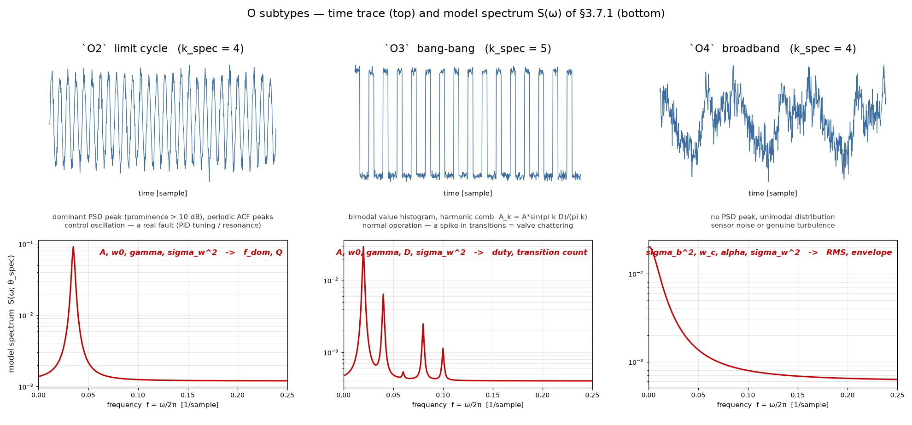

*Fig. 4. `O` subtype schematics — time trace (top) and the model spectrum
`S(ω; θ_spec)` of §3.7.1 (bottom). The spectra are drawn by calling
`S_O2` / `S_O3` / `S_O4` in `chart_index.py`, so they cannot drift from the
definitions in the text. Regenerated by `make_o_subtypes.py`.*

그림에 쓴 파라미터 값은 다음과 같다. 형상이 어떻게 스펙트럼으로 옮겨지는지
보이기 위한 값이며 실측값이 아니다.

*Table 16. Parameters used in Fig. 4*

| Subtype | `θ_spec` | Fig. 4 의 값 | 시간영역 형상 |
|---|---|---|---|
| `O2` | `A`, `ω_0`, `γ`, `σ_w²` | `0.30`, `2π·0.035`, `0.010`, `0.0012` | 진폭 0.30 의 정현파 + 잡음 |
| `O3` | `A`, `ω_0`, `γ`, `D`, `σ_w²` | `0.60`, `2π·0.020`, `0.006`, `0.35`, `0.0004` | 준위 0.20 ↔ 0.80, duty 0.35 |
| `O4` | `σ_b²`, `ω_c`, `α`, `σ_w²` | `0.020`, `2π·0.010`, `2.0`, `0.0006` | 피크 없는 저주파 우세 잡음 |

- `O2` 는 `ω_0` 에 Lorentzian 피크 하나가 선다. 폭이 `γ` 이고 `Q = ω_0/2γ` 다.
- `O3` 는 `ω_0` 의 정수배마다 피크가 서는 **빗살(comb)** 이다. 각 고조파의
  크기가 `A_k = A·sin(πkD)/(πk)` 이므로 **duty `D` 가 빗살의 포락선을
  정한다** — `D = 0.5` 면 짝수 고조파가 사라진다.
- `O4` 는 피크가 없고 `ω_c` 에서 기울기 `−α` 로 꺾인다.

### D.3 Reading The Subtype Fit

하위형 적합은 세 가지 방식으로 어긋나며, 셋 다 적합값만 보아서는 드러나지 않는다.

- **`O2` 로 나왔는데 피크가 DC 로 붕괴한 경우.** Lorentzian 은 `ω_0 → 0` 이면
  저주파 바닥과 구별되지 않으므로, 이때의 `O2` 는 리미트 사이클을 찾은 것이
  아니라 `O4` 를 `O2` 로 흉내 낸 것이다. **`f_dom` 이 주파수 분해능 `1/N` 보다
  작으면 `O2` 로 읽지 않는다.** 실질적으로 `O4` 다.
- **`Q < 1` 인 `O2`.** 반치 반폭이 중심 주파수만큼 넓다는 뜻이라 공진이라
  부르기 어렵다. 라벨은 남기되 우세 주파수를 주장하지 않는다.
- **`O3` 가 좀처럼 나오지 않는 것.** on/off 제어 채널은 진폭이 크면 `R2`
  RECTANGLE (multi) 로 잡히고, 진폭이 LSB 수준이면 `Q2`~`Q9` 로 먼저 걸러진다.
  `O3` 는 **둘 사이, 곧 진폭은 크지만 준위가 잡음에 묻히는 경우**에만 남는 좁은
  자리다. 나오지 않았다고 해서 모델이 틀린 것은 아니다.

`LSD`(로그 스펙트럼 거리, §5.2)는 결정형 클래스의 재현 오차보다 대체로 크다.
`LSD ≈ 1.8` 이면 모델 스펙트럼이 관측 periodogram 을 `e^1.8 ≈ 6배` 오차로
맞춘다는 뜻이므로, **하위형 라벨은 방향 지시로만 쓰고 `θ_spec` 의 절대값은
신뢰하지 않는다.**

## Appendix E — Nested Model Families

Table 8 의 클래스족이 서로를 파라미터의 특수해로 포함하는 관계(§3.4)를 여기에
모은다 — 포함이 어디서 생겼는지(E.1), 그것이 설계 결함인지(E.2), 그리고 그
비용을 어떻게 지불하는지(E.3)다.

### E.1 Where The Nesting Comes From

포함은 우연이 아니라 두 설계 결정의 직접 결과다.

1. **클래스는 개별 파형이 아니라 연속 파라미터족이다** (§1.2). `R1` 은 사각
   펄스 하나가 아니라 `t_rise`·`t_fall`·`droop` 이 움직이는 곡면 전체이고,
   사다리꼴·램프·좁은 봉우리가 전부 그 곡면 위의 영역이다.
2. **중복 클래스는 두지 않는다** (§1.2). 같은 평균함수를 파라미터 값만 달리해
   표현하는 형상에 별도 클래스를 만들지 않는다.

이 둘을 지키면 포함은 저절로 따라온다 — 파라미터족이 연속이므로 한 족의
경계값이 다른 족의 전체를 덮는 지점이 반드시 생긴다.

*Table 17. Nested chains and the special value that produces them*

| Chain | Special value | Meaning |
|---|---|---|
| `S1 ⊂ S2`, `R1 ⊂ R2`, `T1 ⊂ T2` | `n = 1` | 반복 하나짜리 multi 는 single 그 자체다 |
| `S1 ⊂ R1` | `t_off` 가 window 밖 | 관측 구간 안에서 내려오지 않는 펄스는 계단과 같은 곡선이다 |
| `R1 ⊂ R1s` | `ss_p2p = 0` | 진동 진폭이 0 인 small signal 은 없는 것과 같다 |
| `Q1 ⊂ Q2…Q9` | `m = 1` | 준위 하나짜리 격자는 상수다 |
| `O(n) ⊂ O(n+1)` | knot 하나 삭제 | 구간 선형 중심선은 knot 을 늘릴수록 어떤 형상이든 근사한다 |

포함 관계에서 상위 족의 최대 likelihood 는 하위보다 절대 나쁠 수 없으므로,
벌점 없는 비교는 데이터가 무엇이든 항상 상위를 고른다. 이것이 §3.4 의 결론이
나오는 자리다.

### E.2 Is The Nesting A Design Flaw?

**아니다 — 대안이 더 나쁘기 때문에 선택된 성질이다.** 포함을 없애는 길은
파라미터 곡면을 임계값으로 잘라 서로 겹치지 않는 클래스들로 나누는 것뿐이다.
그 길의 비용이 §1.2 에 이미 적혀 있다.

- 임계값 하나로 갈라 놓으면 웨이퍼마다 그 임계값을 넘나들며 라벨이 흔들린다
  (class_stability 저하). 사다리꼴을 `R1` 에서 떼어 내는 순간, `t_rise` 가
  경계 근방인 채널은 웨이퍼가 바뀔 때마다 다른 클래스를 받는다.
- 잘라낸 조각마다 클래스가 늘어나 같은 평균함수의 중복 클래스가 생긴다.
- 경계 임계값을 정하는 일 자체가 또 하나의 분류 문제라, 선택의 어려움이
  사라지는 것이 아니라 임계값 정의로 자리를 옮길 뿐이다.

즉 포함은 **연속 파라미터족 + 중복 금지의 대가**이고, 그 대가는 클래스 선택
단계 한 곳에만 나타나며, 거기서 벌점(§3.5)으로 지불된다. 파라미터 추출은
클래스가 정해진 뒤의 일이라 이 문제와 무관하다 — 족이 고정되면 비교할 상대가
없으므로 MLE 만으로 충분하다.

### E.3 What Screening Removes And What Remains

§3.1 의 선행 처리는 Table 17 의 사슬 일부를 적합 전에 끊는다.

- `Q1`·`Qn` 확정이 `Q1 ⊂ Q2…Q9` 사슬을 제거한다.
- cycle count 가 `n` 축 사슬 셋(`S1 ⊂ S2`, `R1 ⊂ R2`, `T1 ⊂ T2`)을 끊는다 —
  `cycle = 1` 이면 multi 가 후보에 들어오지 않는다.

**남는 것은 둘이다.** 후보 `{S1, R1, T1}` 안의 `S1 ⊂ R1` 과, 양쪽 가지에 모두
후보로 들어가는 `O` 의 knot 축이다. 이 둘 때문에 선행 처리를 다 하고도 벌점
없는 likelihood 는 `R1` 과 `O` 로 쏠리며, 최종 심판은 여전히 BIC 다. 선행
처리는 벌점을 대체하는 것이 아니라 벌점이 심판할 후보를 줄인다.
