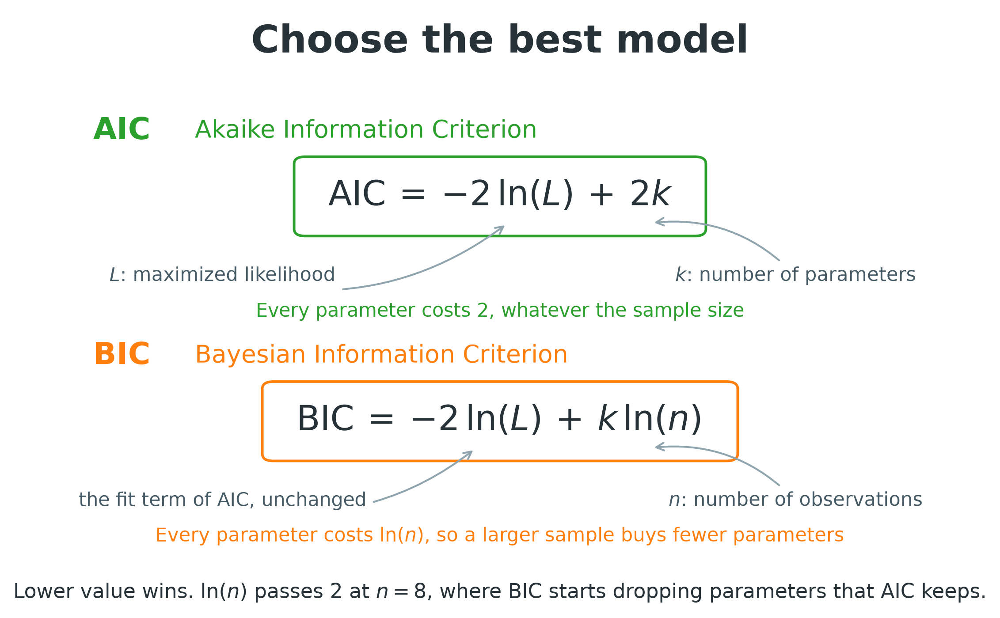
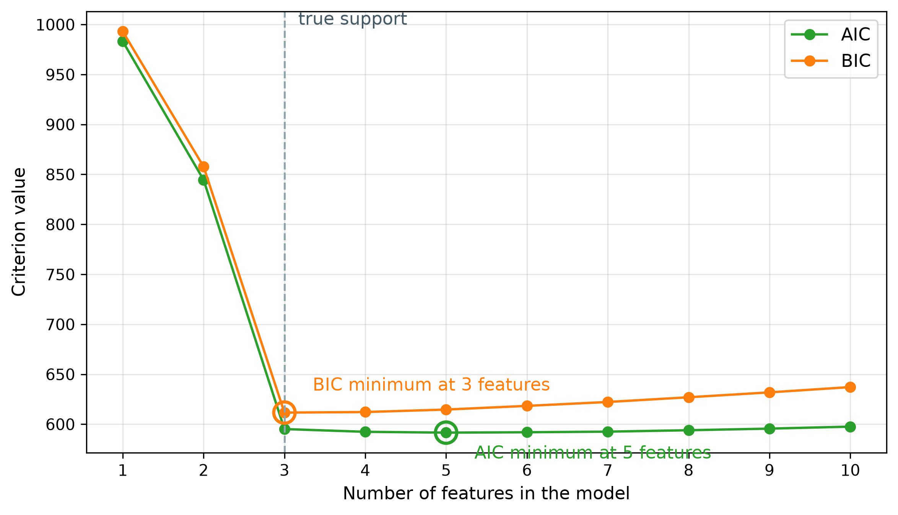

# Bayesian Information Criterion
Rev. 5 | Created: 2026-09-20 | Updated: 2026-09-23 11:29 CDT

- [1. Purpose](#1-purpose)
- [2. Summary](#2-summary)
- [3. Principle](#3-principle)
  - [3.1 From The Marginal Likelihood](#31-from-the-marginal-likelihood)
  - [3.2 Conditions](#32-conditions)
- [4. Application](#4-application)
  - [4.1 Linear Regression Form](#41-linear-regression-form)
  - [4.2 Use In Feature Selection](#42-use-in-feature-selection)
  - [4.3 Reading A Difference](#43-reading-a-difference)
- [References](#references)
- [Appendix A. Terminology](#appendix-a-terminology)
- [Appendix B. The Derivation Of The Criterion](#appendix-b-the-derivation-of-the-criterion)
- [Appendix C. AIC And BIC](#appendix-c-aic-and-bic)
- [Appendix D. The Deviance Of A Gaussian Linear Model](#appendix-d-the-deviance-of-a-gaussian-linear-model)
- [Appendix E. Worked Example](#appendix-e-worked-example)

## 1. Purpose

- **Problem Statement**: Parameter 가 많은 model 일수록 적합에 쓴 data 에서 더 높은 likelihood 에 닿으므로, likelihood 만으로 순위를 매기면 언제나 가장 큰 후보가 1 위가 된다.
- **Goal**: BIC 의 정의, 그 식이 읽는 값, 답이 성립하는 조건과 깨지는 조건을 정리하여, 주어진 data 에서 model 의 크기를 BIC 로 정할지 resampling 점수로 정할지 독자가 스스로 가릴 수 있게 한다.
- **Non-Goal**: Prior 설계와 Bayes factor 의 정확한 계산은 다루지 않는다. BIC 를 그 둘의 대표본 근사로 쓴다.

## 2. Summary

BIC 는 적합이 끝난 model 을 deviance 에 parameter 하나당 $\ln n$ 의 penalty 를 더한 값으로 채점하고, 점수가 가장 작은 후보를 고른다.

```math
\mathrm{BIC} = -2 \ln \hat{L} + k \ln n \hspace{19em} (1)
```

Table 1. The three values the formula reads

| Symbol      | Meaning                                                           | Read from                    |
| :---------: | :---------------------------------------------------------------: | :--------------------------: |
| $\hat{L}$   | 적합이 끝난 parameter 값에서의 likelihood                          | 채점하는 적합 자체           |
| $k$         | 자유 parameter 의 개수, intercept 와 noise variance 포함           | Model 의 설정                |
| $n$         | Likelihood 를 계산한 관측의 개수                                   | Data 집합                    |

BIC 값은 같은 관측과 같은 response 에서 계산한 다른 BIC 값과 견주어 읽으며, 두 값의 차이가 결과의 전부다.

Fig 1 은 같은 deviance 에 parameter 하나당 2 를 물리는 AIC 를 BIC 옆에 나란히 둔다.



Fig 1. AIC and BIC as one fit term under two penalties

AIC 는 표본 크기와 무관하게 parameter 하나당 2 를 물리고 BIC 는 $\ln n$ 을 물리므로, 두 값은 $\ln n = 2$ 인 자리에서 교차한다. 두 기준의 대조는 [Appendix C](#appendix-c-aic-and-bic) 에 두고, 본문은 BIC 를 따라간다.

## 3. Principle

Penalty $k \ln n$ 은 marginal likelihood 의 대표본 근사에서 나오며, 그래서 BIC 가 가장 작은 후보가 posterior probability 가 가장 큰 후보가 된다.

### 3.1 From The Marginal Likelihood

Bayesian 비교는 data $D$ 가 주어졌을 때의 posterior probability 로 후보 model $M$ 의 순위를 매긴다.

```math
p(M \mid D) \propto p(D \mid M)\, p(M) \hspace{19em} (2)
```

Marginal likelihood $p(D \mid M)$ 는 parameter 의 prior 에 대해 likelihood 를 적분한 값이다. 적분 안의 log 를 maximum likelihood 추정값 둘레에서 2 차까지 전개하고 그 Gaussian 을 적분하면 (Laplace approximation), $n$ 과 함께 커지는 항과 bounded 로 남는 나머지, 곧 $n$ 이 커져도 상수에 머무는 나머지가 갈린다.

```math
-2 \ln p(D \mid M) = -2 \ln \hat{L} + k \ln n + O(1) \hspace{19em} (3)
```

Schwarz 는 식 (3) 의 형태로 기준을 유도하고 bounded 한 나머지를 버렸다 [[1](#ref-1)]. 후보들의 prior probability 가 같으면, 식 (1) 의 순위는 $n$ 과 함께 커지지 않는 항을 빼고 posterior probability 의 순위와 같다. 식 (2) 에서 식 (3) 까지의 단계는 [Appendix B](#appendix-b-the-derivation-of-the-criterion) 에 있다.

### 3.2 Conditions

- 가정: model 이 적을 수 있는 likelihood, 독립으로 뽑힌 관측, 특이하지 않게 유지되는 Fisher information matrix, 그리고 $n$ 이 커지는 동안 고정된 parameter 개수 $k$.
- 설정값: $k$ 는 intercept 와 noise variance 를 포함하여 추정하는 parameter 를 모두 센다. $n$ 은 관측의 개수를 센다.
- 깨지는 조건: 전개가 성립하기에 너무 작은 표본, 후보가 모두 잘못 설정된 경우, parameter 개수가 정수가 아닌 penalized 적합, 그리고 관측의 개수와 독립 단위의 개수가 다른 집단 자료.
- 만나는 자리: 선택 경로에서의 부분집합 크기, mixture 의 component 개수, 시계열 model 의 lag 차수, model 기반 clustering 의 cluster 개수.

## 4. Application

BIC 는 한 data 집합에서 채점한 후보들 사이의 차이로 읽으며, 각 점수를 내는 적합은 그 후보가 어차피 한 번 해야 하는 적합이다.

### 4.1 Linear Regression Form

Gaussian error 를 가정한 linear model 에서 maximized likelihood 는 residual sum of squares 만의 함수이므로, 식 (1) 은 적합 잔차에서 바로 계산되는 형태가 된다.

```math
\mathrm{BIC} = n \ln \frac{\mathrm{RSS}}{n} + k \ln n + n (\ln 2\pi + 1) \hspace{19em} (4)
```

마지막 항은 같은 $n$ 개의 관측에 적합한 모든 후보에서 같은 값이므로 비교할 때마다 상쇄되고, 대부분의 구현이 마지막 항을 뺀 값을 내놓는다. 마지막 항을 뺀 점수와 남긴 library 의 점수는 서로 견줄 수 없다. Gaussian likelihood 에서 이 형태까지의 단계는 [Appendix D](#appendix-d-the-deviance-of-a-gaussian-linear-model) 에 있다.

### 4.2 Use In Feature Selection

기준은 model 의 크기를 정하고, 후보를 만들어 내는 탐색은 따로 고른다.

- 경로: forward 또는 backward selection 경로, regularization 경로, 또는 부분집합의 명시적 목록이 크기마다 후보 하나를 낸다.
- 채점: 후보마다 한 번 적합하고 식 (1) 로 채점하여, 점수가 가장 작은 크기를 남긴다.
- 비용: 후보 하나당 적합 한 번이며, cross-validation 점수는 후보 하나당 fold 수만큼 적합한다.
- Regularized 경로: Lasso 적합의 degrees of freedom 자리에 0 이 아닌 계수의 개수를 넣으며, `LassoLarsIC` 의 점수도 같은 개수를 읽는다 [[4](#ref-4)].

### 4.3 Reading A Difference

두 후보의 BIC 차이는 두 후보가 함의하는 Bayes factor 의 log 에 2 를 곱한 값이고, Bayes factor 의 눈금이 주어진 간격의 값어치를 정한다 [[3](#ref-3)].

Table 2. What a BIC difference in favour of the smaller score is worth

| Difference | Evidence against the higher-scoring candidate |
| :--------: | :-------------------------------------------: |
| 0 to 2     | 언급할 가치를 넘지 않음                       |
| 2 to 6     | 긍정적                                        |
| 6 to 10    | 강함                                          |
| Over 10    | 매우 강함                                     |

간격이 2 미만이면 두 후보는 동률이며, parameter 가 적은 쪽을 남긴다.

## References

<a id="ref-1"></a>[1] Schwarz, G. (1978). [Estimating the Dimension of a Model](https://doi.org/10.1214/aos/1176344136). *The Annals of Statistics*, 6(2), 461–464.<br>
<a id="ref-2"></a>[2] Akaike, H. (1974). [A New Look at the Statistical Model Identification](https://doi.org/10.1109/TAC.1974.1100705). *IEEE Transactions on Automatic Control*, 19(6), 716–723.<br>
<a id="ref-3"></a>[3] Kass, R. E., & Raftery, A. E. (1995). [Bayes Factors](https://doi.org/10.1080/01621459.1995.10476572). *Journal of the American Statistical Association*, 90(430), 773–795.<br>
<a id="ref-4"></a>[4] scikit-learn developers. [Lasso model selection: AIC-BIC / cross-validation](https://scikit-learn.org/stable/auto_examples/linear_model/plot_lasso_model_selection.html?utm_source=gemini). scikit-learn examples.<br>
<a id="ref-5"></a>[5] Displayr. [Information Criteria](https://docs.displayr.com/wiki/Information_Criteria?utm_source=gemini). Displayr documentation wiki.

---

## Appendix A. Terminology

- **Bayes factor**: 같은 data 에서 두 후보 model 의 marginal likelihood 비.
- **Bounded**: 표본이 아무리 커져도 어떤 상수 아래에 머무는 양.
- **Consistency**: Data 를 만든 model 이 후보 안에 있을 때, 표본이 커질수록 그 model 을 고를 확률이 1 로 가는 성질.
- **Deviance**: 적합이 끝난 model 의 maximized log-likelihood 에 $-2$ 를 곱한 값.
- **Laplace approximation**: 적분 안의 log 를 최댓값 둘레에서 2 차까지 전개하고 그 Gaussian 을 적분하여 얻는 적분값.
- **Marginal likelihood**: Parameter 를 그 prior 에 대해 적분하여 없앤 model 아래에서의 data 의 likelihood.
- **Regular model**: Maximum likelihood 추정값에서 Fisher information matrix 가 특이하지 않게 유지되는 model.

## Appendix B. The Derivation Of The Criterion

식 (1) 은 식 (3) 에서 bounded 한 항을 버린 것이고, 둘 사이에 있는 것이 marginal likelihood 의 Laplace approximation 이다.

가정: Parameter $k$ 개가 maximum likelihood 추정값 $\hat{\theta}$ 에서 양이고 연속인 prior 밀도 $\pi(\theta)$ 를 가지며, model 이 regular 하고, $n$ 이 커지는 동안 $k$ 가 고정된다.

식 (2) 의 marginal likelihood 는 likelihood $L(\theta)$ 를 그 prior 에 대해 적분한 값이다.

```math
p(D \mid M) = \int L(\theta)\, \pi(\theta)\, d\theta \hspace{19em} (5)
```

Log-likelihood 는 $\hat{\theta}$ 에서 gradient 가 0 이므로 2 차 전개에 이차항 하나만 남으며, 여기서는 관측당 observed information $I(\hat{\theta}) = -\frac{1}{n} \nabla^2 \ln L(\hat{\theta})$ 로 적는다.

```math
\ln L(\theta) \approx \ln \hat{L} - \frac{n}{2} (\theta - \hat{\theta})^{\top} I(\hat{\theta}) (\theta - \hat{\theta}) \hspace{19em} (6)
```

그러면 적분 안은 $\theta$ 에 대한 Gaussian 이어서 적분값이 닫힌 형태로 나오고, posterior 질량이 $\hat{\theta}$ 둘레의 $n^{-1/2}$ 로 줄어드는 영역에 모이므로 prior 는 $\hat{\theta}$ 에서의 값만 남긴다.

```math
p(D \mid M) \approx \hat{L}\, \pi(\hat{\theta}) \left(\frac{2\pi}{n}\right)^{k/2} \left| I(\hat{\theta}) \right|^{-1/2} \hspace{19em} (7)
```

식 (7) 의 log 에 $-2$ 를 곱하면 표본 크기를 담은 두 항이 나머지와 갈린다.

```math
-2 \ln p(D \mid M) \approx -2 \ln \hat{L} + k \ln n - k \ln 2\pi + \ln \left| I(\hat{\theta}) \right| - 2 \ln \pi(\hat{\theta}) \hspace{19em} (8)
```

식 (8) 의 마지막 세 항은 $n$ 이 커져도 상수에 머문다. $k \ln 2\pi$ 와 $-2 \ln \pi(\hat{\theta})$ 는 $n$ 에 의존하지 않고, $\ln | I(\hat{\theta}) |$ 는 관측당 Fisher information 의 log determinant 로 수렴한다. 세 항이 식 (3) 의 $O(1)$ 이며, 이것을 버리면 식 (1) 이 남는다.

Prior 는 버린 항에만 들어오므로 BIC 는 prior 를 정하지 않고도 읽힌다. 같은 이유로 정확도도 정해진다. BIC 가 내는 순위는 posterior probability 의 순위와 bounded 한 오차만큼 다르며, 그 오차는 0 으로 가지 않는다.

## Appendix C. AIC And BIC

두 기준은 같은 deviance 로 model 을 채점하고, parameter 하나의 값이 얼마인지에서 갈린다 [[5](#ref-5)].

```math
\mathrm{AIC} = -2 \ln \hat{L} + 2k \hspace{19em} (9)
```

Table 3. The two criteria against each other

| Criterion | Penalty per parameter | Target quantity                       | Large-sample property                         | Selected size   |
| :-------: | :-------------------: | :-----------------------------------: | :-------------------------------------------: | :-------------: |
| AIC       | 2                     | 표본 밖 deviance 의 기댓값             | Efficient 하고 consistent 하지 않음            | 더 큼           |
| BIC       | $\ln n$               | Model 의 posterior probability         | 후보가 data 를 만들었으면 consistent 함        | 더 작음         |

AIC 는 적합한 model 이 같은 크기의 새 표본에서 낼 deviance 를 추정하므로 예측 기준이다 [[2](#ref-2)]. BIC 는 model 의 posterior probability 를 추정하므로 식별 기준이다 [[1](#ref-1)]. 같은 적합에 대해 서로 다른 질문에 답하므로, 두 기준이 엇갈리면 둘 중 어느 질문을 하고 있었는지로 읽는다.

Penalty 는 $n = e^2 \approx 7.4$ 에서 교차하며, $n = 8$ 부터는 BIC 가 AIC 보다 parameter 하나당 더 많이 물린다. 그래서 같은 nested 경로에서 BIC 가 고르는 크기는 AIC 가 고르는 크기보다 커지지 않는다. [Appendix E](#appendix-e-worked-example) 는 크기 차이를 설계 하나에서 잰다.

## Appendix D. The Deviance Of A Gaussian Linear Model

식 (4) 가 담은 deviance 는 least squares 추정값과 likelihood 를 최대로 만드는 noise variance 에서 Gaussian likelihood 를 계산한 값이다.

Linear model 은 관측 $n$ 개의 결합 밀도를 곱으로 적으며, 그 지수부는 residual sum of squares $\mathrm{RSS}(\beta) = \sum_i (y_i - x_i^{\top} \beta)^2$ 로 모인다.

가정: 관측 $n$ 개가 독립이고, error 가 하나의 variance 를 공유하여 $\varepsilon_i \sim N(0, \sigma^2)$ 이며, design matrix 의 열이 full rank 다.

```math
L(\beta, \sigma^2) = (2\pi\sigma^2)^{-n/2} \exp\left(-\frac{\mathrm{RSS}(\beta)}{2\sigma^2}\right) \hspace{19em} (10)
```

Log 를 취하면 곱이 세 항의 합이 된다.

```math
\ln L(\beta, \sigma^2) = -\frac{n}{2}\ln(2\pi) - \frac{n}{2}\ln \sigma^2 - \frac{\mathrm{RSS}(\beta)}{2\sigma^2} \hspace{19em} (11)
```

계수 vector $\beta$ 는 $\mathrm{RSS}(\beta)$ 를 통해서만 들어오므로 likelihood 를 최대로 만드는 $\beta$ 는 least squares 추정값이고, 아래의 $\mathrm{RSS}$ 는 least squares 추정값의 잔차 제곱합이다. $\sigma^2$ 에 대한 미분을 0 으로 두면 likelihood 를 최대로 만드는 variance 가 나온다.

```math
\frac{\partial \ln L}{\partial \sigma^2} = -\frac{n}{2\sigma^2} + \frac{\mathrm{RSS}}{2\sigma^4} = 0
\quad \Longrightarrow \quad
\hat{\sigma}^2 = \frac{\mathrm{RSS}}{n} \hspace{19em} (12)
```

$\hat{\sigma}^2$ 을 식 (11) 에 되넣으면 마지막 항이 $n / 2$ 가 되고 가운데 항이 $\ln(\mathrm{RSS} / n)$ 이 되며, 여기에 $-2$ 를 곱하면 deviance 가 남는다.

```math
-2 \ln \hat{L} = n \left(\ln 2\pi + \ln \frac{\mathrm{RSS}}{n} + 1\right) \hspace{19em} (13)
```

식 (13) 에 $k \ln n$ 을 더하면 식 (4) 가 된다. Table 4 의 세 번째 행은 $\mathrm{RSS} = 218.3$ 과 $n = 200$ 이며, 식 (13) 에 넣으면 585.1 이 나온다.

Gaussian 계열 밖의 model 은 식 (1) 을 그대로 두고, 식 (13) 자리에 자기 likelihood 가 내는 deviance 를 넣는다. 적합 library 는 그 deviance 를 적합한 parameter 와 함께 보고한다.

## Appendix E. Worked Example

[`src/bic_model_selection.py`](src/bic_model_selection.py) 의 class 는 어느 feature 가 자료를 만들었는지 아는 data 를 만들고, linear model 을 feature 하나씩 키우며, 크기마다 두 기준으로 채점한다. 이 folder 에서 `python3 src/bic_model_selection.py` 를 실행하면 아래 표를 출력하고, 반복 추출에서 각 기준이 생성 feature 를 되찾는 횟수를 세며, Fig 2 를 쓴다.

Data 는 독립인 standard normal feature 10 개의 관측 200 개이고, $y = 3 x_0 - 2 x_1 + 1.5 x_2 + \varepsilon$ 에 $\varepsilon \sim N(0, 1)$ 이며, seed 2 로 뽑았다. 각 단계는 residual sum of squares 를 가장 많이 낮추는 feature 를 더하고, 그 단계의 parameter 개수는 feature 개수에 intercept 와 noise variance 를 더한 값이다.

Table 4. The forward path scored by both criteria

| Features | Added | RSS    | Deviance | AIC   | BIC   | Minimum |
| :------: | :---: | :----: | :------: | :---: | :---: | :-----: |
| 1        | x0    | 1549.9 | 977.1    | 983.1 | 993.0 |         |
| 2        | x1    | 767.5  | 836.5    | 844.5 | 857.7 |         |
| 3        | x2    | 218.3  | 585.1    | 595.1 | 611.6 | BIC     |
| 4        | x3    | 213.2  | 580.4    | 592.4 | 612.2 |         |
| 5        | x7    | 210.2  | 577.5    | 591.5 | 614.6 | AIC     |
| 6        | x6    | 208.5  | 575.9    | 591.9 | 618.3 |         |
| 7        | x4    | 207.1  | 574.5    | 592.5 | 622.2 |         |
| 8        | x8    | 206.5  | 574.0    | 594.0 | 626.9 |         |
| 9        | x5    | 206.1  | 573.6    | 595.6 | 631.8 |         |
| 10       | x9    | 206.1  | 573.5    | 597.5 | 637.1 |         |

AIC 의 최솟값은 feature 다섯 개 자리에 있으며, 생성 feature 세 개의 595.1 에 대해 591.5 다. 더해진 두 feature 는 deviance 를 평균 3.8 씩 낮추는데, AIC 가 물리는 parameter 당 2 보다는 크고 BIC 가 물리는 $\ln 200 = 5.3$ 보다는 작다.



Fig 2. Both criteria along the forward path, with the minimum of each circled

두 곡선은 생성 feature 가 아직 빠져 있는 동안 가파르게 내려가고, 경로가 feature 세 개를 지나면서 갈린다. BIC 곡선은 곧바로 올라가고, AIC 곡선은 feature 다섯 개까지 평평하게 가다가 돌아선다.

같은 설계를 연속한 seed 로 200 번 뽑으면 BIC 는 그 가운데 166 번을 정확히 $x_0$, $x_1$, $x_2$ 에서 멈추고 AIC 는 46 번 멈춘다. 166 대 46 의 차이는 Table 3 의 consistency 를 설계 하나에서 잰 값이며, 모든 설계에 대한 주장이 아니다.
