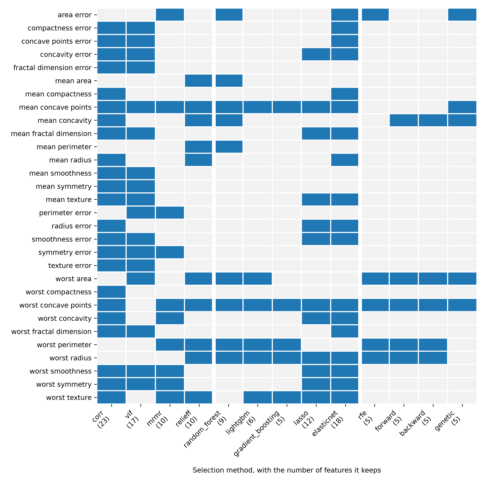

# Multivariate Feature Selection
Rev. 2 | Created: 2026-09-14 | Updated: 2026-09-14 18:49 CDT

## 1. Purpose

- **Problem Statement**: Scoring features one at a time handles neither the joint information nor the duplicated information between features, so the feature set is never optimized.
- **Goal**: Build and order a taxonomy and a hierarchy of the methods that read interaction and redundancy together, so that they can be applied to the situation at hand or used as a rule of thumb.
- **Non-Goal**: Testing features one at a time belongs to [Univariate Feature Selection](../univariate-feature-selection/univariate-feature-selection-ko.md).

### 1.1 Motivation

A combination of features sometimes explains the target better than the features alone, so selection has to work on combinations. $X_1$ and $X_2$ may each correlate weakly with the target $Y$ while their combination is a strong signal for $Y$, the XOR problem being the standard example.

Multivariate analysis has three purposes.

1️⃣ Removing the multicollinearity and the redundancy between features<br>
2️⃣ Finding the synergy between features<br>
3️⃣ Raising model performance and holding off overfitting

## 2. Taxonomy

Methods split along two lines: when the model is consulted (approach) and how interaction is handled (interaction).

```text
Multivariate feature selection taxonomy
|
+-- 1. Approach-based hierarchy
|   |
|   +-- Filter methods
|   |   +-- Correlation matrix and VIF ...... multicollinearity removal
|   |   +-- mRMR ........................... minimum redundancy maximum relevance
|   |   +-- ReliefF ........................ neighbour contrast
|   |
|   +-- Wrapper methods
|   |   +-- Forward selection / backward elimination
|   |   +-- RFE ........................... recursive feature elimination
|   |   +-- Genetic algorithm search
|   |
|   +-- Embedded methods
|       +-- Lasso (L1) / ElasticNet
|       +-- Tree-based importance ......... random forest, XGBoost, LightGBM
|
+-- 2. Interaction-based hierarchy
    +-- Redundancy reduction ............... removing duplicated information
    +-- Feature synergy .................... keeping features that matter together
    +-- Dimensionality tradeoff ............ trading dimension against signal
```

Fig 1. Two hierarchies of multivariate feature selection

Alongside the two hierarchies runs one more line, whether y is read. The correlation filter and VIF compute the correlation among X only and run without y, while mRMR, ReliefF, the embedded methods and the wrappers all score against y.

## 3. Approach-based Methods

The branch chosen fixes the computational cost and the selection criterion together, and that criterion fixes the model dependence of the chosen set. A filter's set is conditional on the data alone, a wrapper's on the scoring estimator and its search, an embedded method's on the fitted model.

### 3.1 Multivariate Filter Methods

Feature combinations are screened from the statistical properties of the data alone, without fitting a model. Unlike a univariate filter, the correlation between features is computed as well.

mRMR (Minimum Redundancy Maximum Relevance) is solved as an optimization that maximizes the mutual information with the target and minimizes the mutual information among the selected features.

```math
\max_{S} \left[ \frac{1}{|S|} \sum_{i \in S} I(x_i; y)
- \frac{1}{|S|^2} \sum_{i, j \in S} I(x_i; x_j) \right]
\hspace{10em} (1)
```

VIF (Variance Inflation Factor) regresses one feature on the remaining features and measures how well they explain it. Features with $\mathrm{VIF} \gt 10$ are removed one at a time.

### 3.2 Wrapper Methods

A chosen model serves as the judge, and a search algorithm looks for the feature subset that scores best.

The procedure of RFE (Recursive Feature Elimination) runs as follows.

- Fit the model on every feature
- Drop the feature of the smallest coefficient or importance
- Repeat until the target number of features is reached

A greedy search adds (forward) or removes (backward) one feature at a time and follows the change in the cross validation score. A genetic algorithm holds several subsets as one generation and builds the next generation by mixing the high scoring ones and swapping parts, reaching combinations a sequential search never visits.

### 3.3 Embedded Methods

Feature selection sits inside the learning algorithm of the model.

Lasso adds the sum of the absolute coefficients $\lambda \sum |\beta_i|$ to the loss as a penalty, driving the coefficients of unneeded features exactly to zero. ElasticNet mixes in the sum of the squared coefficients, so a group of correlated features is kept together where lasso leaves one member of it.

Tree-based importance reads a multivariate importance from the node split contribution of a tree model (MDI) or from the drop in performance when the values are shuffled (permutation importance). Random forest and the gradient boosting family XGBoost and LightGBM implement it, and all three report split contributions, so they go straight into `SelectFromModel`.

### 3.4 Comparison

Multivariate filter, wrapper and embedded move in opposite directions on computational cost and on how much interaction they carry.

Table 1. Comparison of the three approaches

| # | Aspect              | Multivariate filter             | Wrapper                  | Embedded              |
| :: | :-----------------: | :-----------------------------: | :----------------------: | :-------------------: |
| 1 | Computational cost  | Low                             | Very high                | Medium                |
| 2 | Overfitting risk    | Low                             | High                     | Medium                |
| 3 | Model dependence    | None (model-agnostic)           | Tied to the chosen model | Built into that model |
| 4 | Interaction carried | Limited (mostly 1:1 redundancy) | Very well                | Well                  |

## 4. Interaction-based Methods

Grouping the same methods by how they handle interaction gives the second hierarchy of section 2. A method can sit in two branches, and then what it does in each branch is written separately.

### 4.1 Redundancy Reduction

The branch that erases duplicated signal, which reads the correlation between features and may leave the target unread.

- Correlation filter: one feature of every pair above the limit removed
- VIF: the feature best explained by the rest removed one at a time
- The min-redundancy term of mRMR: the mutual information among the selected features charged as a penalty

### 4.2 Feature Synergy

The branch that keeps joint signal, which shows only when features are scored as a combination.

- Wrapper (RFE, forward and backward search): a candidate subset scored by the model, so the effect of the combination enters the score
- Tree-based importance: a split made inside a node already separated, so a contribution that depends on the values of other features is carried
- ReliefF: the nearest hit and the nearest miss of every sample compared over the distance of the whole feature vector, so a difference that shows only alongside other features enters the score. Class labels only, with RReliefF as the separate algorithm for a regression target

### 4.3 Dimensionality Tradeoff

The branch that trades the number of kept dimensions against signal, which decides where to cut the ranking the first two branches produced.

- $\lambda$ of lasso: the larger the value, the more coefficients reach zero and the fewer dimensions remain
- Target feature count of RFE: the kept dimension given directly
- Threshold of tree-based importance: the cut placed by a rule such as the mean importance

## 5. Target Kind

Classification and regression are properties of the target, orthogonal to the approach hierarchy of section 3 and to the interaction hierarchy of section 4. One method keeps its criterion and substitutes only the estimator that matches the target.

Table 2. What each method changes when the target is regression instead of classification

| Section                  | Method                         | Uses y | Classification target           | Regression target                       |
| :----------------------: | :----------------------------: | :----: | :-----------------------------: | :-------------------------------------: |
| 3.1 Filter               | corr, VIF                      | No     | Correlation among X only        | Correlation among X only                |
| 3.1 Filter               | mRMR                           | Yes    | `mutual_info_classif`           | `mutual_info_regression`                |
| 3.1 Filter / 4.2 Synergy | ReliefF                        | Yes    | hit/miss contrast               | None (RReliefF is a separate algorithm) |
| 3.3 Embedded             | random forest, LightGBM        | Yes    | Classifier                      | Regressor                               |
| 3.3 Embedded             | lasso, elastic net             | Yes    | Regression fit on the 0/1 label | Regression fit on y                     |
| 3.2 Wrapper              | RFE, forward/backward, genetic | Yes    | Scored by `LogisticRegression`  | Scored by `LinearRegression`            |

- Rows whose `Uses y` is No: the same computation under both targets
- Rows whose `Uses y` is Yes: the estimator and the model swapped for their regression form
- ReliefF: no counterpart to use in regression, so the algorithm itself splits

## 6. Selection Instability

Selection instability is the property that the kept columns change when the data or the method changes a little, while the score stays where it was and only the names differ. Two causes produce it.

- Interchangeable features: an equivalence class of columns so correlated that swapping them leaves the performance where it was
- Sampling noise: correlation and importance ranks wobbling from one resample to the next, which flips the features that sat near the threshold

The remedies replace one run of the selection with a selection frequency over repeats or with a treatment applied per correlated group.

- Stability selection: the selection repeated on every bootstrap sample, keeping the features whose selection frequency passes a threshold (0.6, say)
- Cluster representative: the features clustered by correlation and one member kept per cluster, which removes the swapping inside a cluster
- Group-wise selection: a correlated group kept together by ElasticNet or group lasso, which stops one member from standing for the group
- Selection frequency reporting: the selection frequency of every feature written beside the chosen set, which shows the columns that can stand in for one another

## 7. Workflow

Cheap methods cut the candidates down before the expensive ones run. The cost of a wrapper grows with the number of features left, so three steps come before it.

- Step 1 (constant removal): features holding one value across every sample removed first. Neither correlation nor importance is defined for them, and no later step has anything to weigh
- Step 2 (pre-filtering): the duplicated features above a correlation of 0.95 removed by a univariate statistic or by VIF
- Step 3 (embedded selection): the candidates narrowed by lasso or by random forest, XGBoost, LightGBM
- Step 4 (fine-tuning via wrapper): the final subset decided by RFE or sequential feature selection once the candidates are few

---

## Appendix A. Terminology

- **Cross Validation**: the procedure that splits the data into folds and uses each in turn for validation, measuring how the model generalizes.
- **MDI (Mean Decrease in Impurity)**: the sum of the impurity one feature removes over the node splits of a tree.
- **Multicollinearity**: the state where the input variables hold a strong linear relation, so a coefficient is not assigned uniquely to a single variable.
- **Mutual Information**: the amount by which the entropy of one variable falls once the other is known.
- **Overfitting**: the state where a model has learned the noise of the training data and performs worse on new data.
- **Permutation Importance**: the importance measured as the drop in performance when the values of one feature are shuffled.
- **XOR Problem**: the relation that is 1 only when two binary inputs differ. Each input has zero correlation with the output while the two together determine it completely.

## Appendix B. Implementation

The class below runs the four steps of section 7 with scikit-learn. `run` drops the constant features first and passes only the remaining columns through the other three steps. Each step takes its threshold from the constructor and returns the original column indices, so the names of the chosen features can be recovered at the end. Each step takes its method name as the `Literal` alias of that branch, whose members are declared on the class once and whose tuple of names is derived beside it with `get_args`. The filter step implements four names (`corr`, `vif`, `mrmr`, `relieff`), the embedded step four (`random_forest`, `lightgbm`, `lasso`, `elasticnet`) and the wrapper step four (`rfe`, `forward`, `backward`, `genetic`); a name outside a list raises `ValueError`. The `task` the constructor takes picks the model behind every step as Table 2 has it, and calling `relieff` under regression raises `ValueError` together with the filters that task can use.

The input is the breast cancer dataset shipped with scikit-learn, with one column holding 1.0 throughout appended so that the constant removal step is visible, giving 569 samples and 31 features. The original 30 features overlap heavily and all of them are standardized with `StandardScaler`. The label is binary, so the example is written with classification models; for a regression target the right column of Table 2 takes over.

```python
__author__ = "yRocket"
__version__ = "0.5.0+20260914"

import pathlib
from typing import Final, Literal, TypeAlias, get_args

import matplotlib
import numpy as np
from lightgbm import LGBMClassifier, LGBMRegressor
from matplotlib import pyplot as plt
from sklearn.datasets import load_breast_cancer
from sklearn.ensemble import RandomForestClassifier, RandomForestRegressor
from sklearn.feature_selection import (RFE, SelectFromModel, SequentialFeatureSelector,
                                       mutual_info_classif, mutual_info_regression)
from sklearn.linear_model import ElasticNet, Lasso, LinearRegression, LogisticRegression
from sklearn.model_selection import cross_val_score
from sklearn.neighbors import NearestNeighbors
from sklearn.preprocessing import StandardScaler

FIGURE_PATH = pathlib.Path("multivariate-feature-selection-ko_fig/fig2.png")
FIGSIZE: tuple = (9.0, 9.0)
REFERENCE_WIDTH: float = 9.0  # the width BASE_FONT_SIZE was chosen for
BASE_FONT_SIZE: float = 9.0


class MultivariateFeatureSelector:
    """Run the three steps of the workflow on one dataset, keeping the original column indices.

    Each step takes a method name typed by the Literal alias of that branch, which is where the
    members are declared on the class; the tuples beside them derive from it. A name outside the
    alias raises ValueError.

    The task decides which model stands behind a method: a classifier and the class label mutual
    information for classification, a regressor and the regression mutual information for
    regression. relieff compares hits and misses of a class label, so it has no regression form
    and refuses that task; filter_methods lists the filters the task supports.

    Args:
        task: whether y holds class labels or a continuous value.
        correlation_limit: absolute correlation above which one feature of a pair is dropped.
        vif_limit: variance inflation factor above which a feature is dropped, one at a time.
        penalty_alpha: weight of the lasso and elastic net penalty of the embedded step.
        elasticnet_ratio: share of the elastic net penalty that is L1, the rest being L2.
        filter_count: number of features the ranking filters (mrmr, relieff) keep.
        neighbour_count: number of hits and misses relieff compares per sample.
        forest_size: number of trees of the random forest used by the embedded step.
        fold_count: number of cross validation folds the sequential and genetic wrappers score on.
        population_size: number of subsets the genetic search holds in one generation.
        generation_count: number of generations the genetic search runs.
        mutation_rate: probability that a child of the genetic search has one feature swapped.
        final_count: number of features the wrapper step leaves.
        random_state: seed of the random forest and of the mutual information estimates.
    """

    FilterMethod: TypeAlias = Literal["corr", "vif", "mrmr", "relieff"]
    EmbeddedMethod: TypeAlias = Literal["random_forest", "lightgbm", "lasso", "elasticnet"]
    WrapperMethod: TypeAlias = Literal["rfe", "forward", "backward", "genetic"]
    Direction: TypeAlias = Literal["forward", "backward"]
    Task: TypeAlias = Literal["classification", "regression"]

    FILTER_METHODS: Final[tuple[FilterMethod, ...]] = get_args(FilterMethod)
    EMBEDDED_METHODS: Final[tuple[EmbeddedMethod, ...]] = get_args(EmbeddedMethod)
    WRAPPER_METHODS: Final[tuple[WrapperMethod, ...]] = get_args(WrapperMethod)
    TASKS: Final[tuple[Task, ...]] = get_args(Task)
    CLASS_ONLY_FILTERS: Final[tuple[FilterMethod, ...]] = ("relieff",)

    def __init__(self, task: Task = "classification",
                 correlation_limit: float = 0.95, vif_limit: float = 10.0,
                 penalty_alpha: float = 0.01, elasticnet_ratio: float = 0.5,
                 filter_count: int = 10, neighbour_count: int = 10,
                 forest_size: int = 200, fold_count: int = 5, population_size: int = 20,
                 generation_count: int = 10, mutation_rate: float = 0.2,
                 final_count: int = 5, random_state: int = 0) -> None:
        if task not in self.TASKS:
            raise ValueError(f"unknown task: {task=}, {self.TASKS=}")
        if not 0.0 < correlation_limit < 1.0:
            raise ValueError(f"correlation_limit must lie between 0 and 1: {correlation_limit=}")
        if vif_limit <= 1.0:
            raise ValueError(f"vif_limit must exceed 1: {vif_limit=}")
        if penalty_alpha <= 0.0:
            raise ValueError(f"penalty_alpha must be positive: {penalty_alpha=}")
        if not 0.0 < elasticnet_ratio <= 1.0:
            raise ValueError(f"elasticnet_ratio must lie in (0, 1]: {elasticnet_ratio=}")
        if fold_count < 2:
            raise ValueError(f"fold_count must be at least 2: {fold_count=}")
        if population_size < 4 or generation_count < 1:
            raise ValueError(f"the genetic search needs a population and a generation: "
                             f"{population_size=}, {generation_count=}")
        if not 0.0 <= mutation_rate <= 1.0:
            raise ValueError(f"mutation_rate must lie between 0 and 1: {mutation_rate=}")
        if filter_count < 1 or neighbour_count < 1 or final_count < 1:
            raise ValueError(f"counts must be at least 1: {filter_count=}, {neighbour_count=}, {final_count=}")
        self.task = task
        self.filter_methods: tuple = tuple(
            method for method in self.FILTER_METHODS
            if task == "classification" or method not in self.CLASS_ONLY_FILTERS)
        self.correlation_limit = correlation_limit
        self.vif_limit = vif_limit
        self.penalty_alpha = penalty_alpha
        self.elasticnet_ratio = elasticnet_ratio
        self.filter_count = filter_count
        self.neighbour_count = neighbour_count
        self.forest_size = forest_size
        self.fold_count = fold_count
        self.population_size = population_size
        self.generation_count = generation_count
        self.mutation_rate = mutation_rate
        self.final_count = final_count
        self.random_state = random_state

    def drop_constant(self, X: np.ndarray) -> np.ndarray:
        """Return the columns whose value changes across the samples, dropping the constant ones."""
        varying = np.where(np.ptp(X, axis=0) > 0.0)[0]
        if len(varying) == 0:
            raise ValueError(f"every feature holds one value: {X.shape=}")
        return varying

    def filter_step(self, X: np.ndarray, y: np.ndarray, columns: np.ndarray,
                    method: FilterMethod = "corr") -> np.ndarray:
        """Return the subset of columns the named filter keeps, as indices into the columns of X."""
        if method == "corr":
            return self._by_correlation(X=X, columns=columns)
        if method == "vif":
            return self._by_vif(X=X, columns=columns)
        if method == "mrmr":
            return self._by_mrmr(X=X, y=y, columns=columns)
        if method == "relieff":
            return self._by_relieff(X=X, y=y, columns=columns)
        raise ValueError(f"unknown filter method: {method=}, {self.FILTER_METHODS=}")

    def _by_correlation(self, X: np.ndarray, columns: np.ndarray) -> np.ndarray:
        """Drop the later feature of every pair whose absolute correlation exceeds the limit."""
        corr = np.abs(np.corrcoef(X[:, columns], rowvar=False))
        redundant = np.unique(np.where(np.triu(corr, k=1) > self.correlation_limit)[1])
        return columns[np.setdiff1d(np.arange(len(columns)), redundant)]

    def _by_vif(self, X: np.ndarray, columns: np.ndarray) -> np.ndarray:
        """Drop the feature of the largest variance inflation factor until every one is under the limit."""
        held = list(columns)
        while len(held) > 1:
            factors = [self._vif_of(X=X, columns=held, position=position) for position in range(len(held))]
            worst = int(np.argmax(factors))
            if factors[worst] <= self.vif_limit:
                break
            held.pop(worst)
        return np.asarray(held)

    def _vif_of(self, X: np.ndarray, columns: list, position: int) -> float:
        """Return 1 / (1 - R^2) of one feature regressed on the remaining ones."""
        target = X[:, columns[position]]
        others = X[:, [column for index, column in enumerate(columns) if index != position]]
        design = np.column_stack([np.ones(len(others)), others])
        residual = target - design @ np.linalg.lstsq(design, target, rcond=None)[0]
        unexplained = float(np.sum(residual ** 2) / np.sum((target - target.mean()) ** 2))
        return float("inf") if unexplained <= 0.0 else 1.0 / unexplained

    def _by_mrmr(self, X: np.ndarray, y: np.ndarray, columns: np.ndarray) -> np.ndarray:
        """Add the feature of the largest relevance minus mean redundancy, until filter_count are held."""
        subset = X[:, columns]
        relevance_of = mutual_info_classif if self.task == "classification" else mutual_info_regression
        relevance = relevance_of(subset, y, random_state=self.random_state)
        selected = [int(np.argmax(relevance))]
        while len(selected) < min(self.filter_count, len(columns)):
            rest = [position for position in range(len(columns)) if position not in selected]
            redundancy = np.array([
                np.mean([mutual_info_regression(subset[:, [position]], subset[:, chosen],
                                                random_state=self.random_state)[0] for chosen in selected])
                for position in rest])
            selected.append(rest[int(np.argmax(relevance[rest] - redundancy))])
        return columns[np.sort(np.asarray(selected))]

    def _by_relieff(self, X: np.ndarray, y: np.ndarray, columns: np.ndarray) -> np.ndarray:
        """Keep the features whose value separates nearest misses from nearest hits the most."""
        if self.task != "classification":
            raise ValueError(f"relieff compares hits and misses of a class label, so it has no form "
                             f"for {self.task=}; use one of {self.filter_methods}")
        subset = X[:, columns]
        span = np.ptp(subset, axis=0)
        score = np.zeros(len(columns))
        for label in np.unique(y):
            hits = self._neighbours_of(source=subset[y == label], pool=subset[y == label], skip_self=True)
            misses = self._neighbours_of(source=subset[y == label], pool=subset[y != label], skip_self=False)
            score += (misses - hits) / (span * len(subset))
        return columns[np.sort(np.argsort(score)[-min(self.filter_count, len(columns)):])]

    def _neighbours_of(self, source: np.ndarray, pool: np.ndarray, skip_self: bool) -> np.ndarray:
        """Return the mean absolute per-feature distance from each source sample to its nearest pool samples."""
        count = min(self.neighbour_count + int(skip_self), len(pool))
        finder = NearestNeighbors(n_neighbors=count).fit(pool)
        neighbours = finder.kneighbors(source, return_distance=False)[:, int(skip_self):]
        return np.abs(source[:, None, :] - pool[neighbours]).sum(axis=(0, 1))

    def embedded_step(self, X: np.ndarray, y: np.ndarray, columns: np.ndarray,
                      method: EmbeddedMethod = "random_forest") -> np.ndarray:
        """Return the columns the named embedded model keeps, as indices into the columns of X."""
        if method == "random_forest":
            return self._by_forest(X=X, y=y, columns=columns)
        if method == "lightgbm":
            return self._by_lightgbm(X=X, y=y, columns=columns)
        if method == "lasso":
            return self._by_penalty(X=X, y=y, columns=columns, l1_ratio=1.0)
        if method == "elasticnet":
            return self._by_penalty(X=X, y=y, columns=columns, l1_ratio=self.elasticnet_ratio)
        raise ValueError(f"unknown embedded method: {method=}, {self.EMBEDDED_METHODS=}")

    def _by_forest(self, X: np.ndarray, y: np.ndarray, columns: np.ndarray) -> np.ndarray:
        """Keep the columns whose random forest importance is above the mean importance."""
        forest_of = RandomForestClassifier if self.task == "classification" else RandomForestRegressor
        forest = forest_of(n_estimators=self.forest_size, random_state=self.random_state)
        selector = SelectFromModel(estimator=forest, threshold="mean").fit(X[:, columns], y)
        return columns[selector.get_support()]

    def _by_lightgbm(self, X: np.ndarray, y: np.ndarray, columns: np.ndarray) -> np.ndarray:
        """Keep the columns whose gradient boosting split gain is above the mean gain."""
        booster_of = LGBMClassifier if self.task == "classification" else LGBMRegressor
        booster = booster_of(n_estimators=self.forest_size, importance_type="gain",
                             random_state=self.random_state, verbose=-1)
        selector = SelectFromModel(estimator=booster, threshold="mean").fit(X[:, columns], y)
        return columns[selector.get_support()]

    def _by_penalty(self, X: np.ndarray, y: np.ndarray, columns: np.ndarray,
                    l1_ratio: float) -> np.ndarray:
        """Keep the columns whose penalized coefficient stays off zero.

        The penalized fit is a regression either way: a class label enters as 0 or 1. An L1 share
        of 1 is the lasso; a smaller share adds the L2 term of the elastic net, which keeps
        correlated features together instead of picking one of them.
        """
        estimator = (Lasso(alpha=self.penalty_alpha, random_state=self.random_state) if l1_ratio == 1.0
                     else ElasticNet(alpha=self.penalty_alpha, l1_ratio=l1_ratio,
                                     random_state=self.random_state))
        selector = SelectFromModel(estimator=estimator, threshold=1e-10).fit(X[:, columns], y)
        return columns[selector.get_support()]

    def wrapper_step(self, X: np.ndarray, y: np.ndarray, columns: np.ndarray,
                     method: WrapperMethod = "rfe") -> np.ndarray:
        """Return the columns the named search keeps, as indices into the columns of X."""
        if len(columns) < self.final_count:
            raise ValueError(f"the wrapper step got fewer columns than it must keep: "
                             f"{len(columns)=}, {self.final_count=}")
        if method == "rfe":
            return self._by_rfe(X=X, y=y, columns=columns)
        if method in ("forward", "backward"):
            return self._by_sequential(X=X, y=y, columns=columns, direction=method)
        if method == "genetic":
            return self._by_genetic(X=X, y=y, columns=columns)
        raise ValueError(f"unknown wrapper method: {method=}, {self.WRAPPER_METHODS=}")

    def _wrapper_estimator(self):
        """Return the linear model the wrapper searches score with: logistic for a label, least squares else."""
        return LogisticRegression(max_iter=5000) if self.task == "classification" else LinearRegression()

    def _by_rfe(self, X: np.ndarray, y: np.ndarray, columns: np.ndarray) -> np.ndarray:
        """Keep the columns left after dropping the smallest coefficient one feature at a time."""
        estimator = self._wrapper_estimator()
        selector = RFE(estimator=estimator, n_features_to_select=self.final_count).fit(X[:, columns], y)
        return columns[selector.get_support()]

    def _by_sequential(self, X: np.ndarray, y: np.ndarray, columns: np.ndarray,
                       direction: Direction) -> np.ndarray:
        """Keep the columns a greedy search holds, adding or removing one by cross validation score."""
        estimator = self._wrapper_estimator()
        selector = SequentialFeatureSelector(estimator=estimator, n_features_to_select=self.final_count,
                                             direction=direction, cv=self.fold_count).fit(X[:, columns], y)
        return columns[selector.get_support()]

    def _by_genetic(self, X: np.ndarray, y: np.ndarray, columns: np.ndarray) -> np.ndarray:
        """Keep the subset of the wanted size that a genetic search scores highest.

        Every individual is a subset of exactly final_count features, so the generations compare
        subsets of one size instead of trading size against score.
        """
        rng = np.random.default_rng(self.random_state)
        parent_count = max(2, self.population_size // 2)
        population = [np.sort(rng.choice(len(columns), size=self.final_count, replace=False))
                      for _ in range(self.population_size)]
        for _ in range(self.generation_count):
            parents = sorted(population, key=lambda held: -self._fitness_of(X=X, y=y, columns=columns[held]))
            parents = parents[:parent_count]
            population = parents + [self._child_of(parents=parents, position_count=len(columns), rng=rng)
                                    for _ in range(self.population_size - parent_count)]
        best = max(population, key=lambda held: self._fitness_of(X=X, y=y, columns=columns[held]))
        return columns[np.sort(best)]

    def _fitness_of(self, X: np.ndarray, y: np.ndarray, columns: np.ndarray) -> float:
        """Return the mean cross validation score of a model fitted on the given columns."""
        estimator = self._wrapper_estimator()
        return float(np.mean(cross_val_score(estimator, X[:, columns], y, cv=self.fold_count)))

    def _child_of(self, parents: list, position_count: int, rng: np.random.Generator) -> np.ndarray:
        """Draw a child from the union of two parents, then swap one of its features at random."""
        first, second = rng.choice(len(parents), size=2, replace=False)
        pool = np.union1d(parents[first], parents[second])
        child = rng.choice(pool, size=self.final_count, replace=False)
        outside = np.setdiff1d(np.arange(position_count), child)
        if rng.random() < self.mutation_rate and len(outside) > 0:
            child[rng.integers(len(child))] = rng.choice(outside)
        return np.sort(child)

    def run(self, X: np.ndarray, y: np.ndarray,
            filter_method: FilterMethod = "corr", embedded_method: EmbeddedMethod = "random_forest",
            wrapper_method: WrapperMethod = "rfe") -> dict:
        """Return the surviving column indices of each step, keyed by step name.

        The constant features go first: they carry nothing any later step can weigh.
        """
        varying = self.drop_constant(X=X)
        filtered = self.filter_step(X=X, y=y, columns=varying, method=filter_method)
        embedded = self.embedded_step(X=X, y=y, columns=filtered, method=embedded_method)
        wrapped = self.wrapper_step(X=X, y=y, columns=embedded, method=wrapper_method)
        return {"varying": varying, "filter": filtered, "embedded": embedded, "wrapper": wrapped}


def draw_matrix(kept: dict, names: np.ndarray, columns: np.ndarray, path: pathlib.Path) -> None:
    """Draw one cell per (feature, method) pair, filled where that method kept the feature.

    Args:
        kept: method name mapped to the column indices that method kept.
        names: feature name of every column of X.
        columns: the columns that reach the methods, drawn as the rows of the chart.
        path: file the chart is written to.
    """
    order = columns[np.argsort(names[columns])]
    methods = list(kept)
    grid = np.array([[1.0 if column in set(kept[method]) else 0.0 for method in methods] for column in order])

    font_size = BASE_FONT_SIZE * FIGSIZE[0] / REFERENCE_WIDTH
    fig, axes = plt.subplots(figsize=FIGSIZE)
    axes.imshow(grid, aspect="auto", vmin=0.0, vmax=1.0,
                cmap=matplotlib.colors.ListedColormap(["#f2f2f2", matplotlib.colors.TABLEAU_COLORS["tab:blue"]]))
    axes.set_xticks(range(len(methods)),
                    [f"{method}\n({len(kept[method])})" for method in methods],
                    rotation=45, ha="right", fontsize=font_size)
    axes.set_yticks(range(len(order)), names[order], fontsize=font_size)
    axes.set_xticks(np.arange(len(methods) + 1) - 0.5, minor=True)
    axes.set_yticks(np.arange(len(order) + 1) - 0.5, minor=True)
    axes.grid(which="minor", color="white", linewidth=1.5)
    axes.tick_params(which="minor", length=0)
    # Separate the three branches where the given methods change branch, whichever members are present
    filter_count = sum(method in MultivariateFeatureSelector.FILTER_METHODS for method in methods)
    embedded_count = sum(method in MultivariateFeatureSelector.EMBEDDED_METHODS for method in methods)
    for boundary in np.cumsum([filter_count, embedded_count]) - 0.5:
        axes.axvline(boundary, color="white", linewidth=5.0)
    for spine in axes.spines.values():
        spine.set_visible(False)
    axes.set_xlabel("Selection method, with the number of features it keeps", fontsize=font_size)
    fig.tight_layout()
    path.parent.mkdir(parents=True, exist_ok=True)
    fig.savefig(path, dpi=300)
    plt.close(fig)


if __name__ == "__main__":
    data = load_breast_cancer()
    # Append a column that never changes, to show the first step removing it
    X = np.column_stack([StandardScaler().fit_transform(data.data), np.full(len(data.data), 1.0)])
    names = np.asarray(list(data.feature_names) + ["constant probe"])
    selector = MultivariateFeatureSelector(correlation_limit=0.95, final_count=5)
    varying = selector.drop_constant(X=X)

    kept = {}
    for filter_method in selector.FILTER_METHODS:
        kept[filter_method] = selector.filter_step(X=X, y=data.target, columns=varying, method=filter_method)
    for embedded_method in selector.EMBEDDED_METHODS:
        kept[embedded_method] = selector.embedded_step(X=X, y=data.target, columns=varying,
                                                       method=embedded_method)
    for wrapper_method in selector.WRAPPER_METHODS:
        kept[wrapper_method] = selector.wrapper_step(X=X, y=data.target, columns=kept["random_forest"],
                                                     method=wrapper_method)

    workflow = selector.run(X=X, y=data.target, filter_method="corr",
                            embedded_method="random_forest", wrapper_method="rfe")
    draw_matrix(kept=kept, names=names, columns=varying, path=FIGURE_PATH)
    print(f"{X.shape[0]} samples and {X.shape[1]} features in, "
          f"{len(workflow['wrapper'])} out; chart written to {FIGURE_PATH}")
```

The constant column drops at the first step and reaches no filter. Of the 30 that remain the four filters keep 23, 17, 10 and 10, and the four embedded methods keep 9, 6, 12 and 18, so their answers differ; `elasticnet`, which mixes in L2, keeps a correlated group together and holds 6 more than `lasso`. The four wrappers each pick 5 out of the 9 the random forest left, where `forward` and `backward` reach the same combination while `rfe` and `genetic` each take their own. Following the `corr` → `random_forest` → `rfe` that `run` takes by default, the feature count falls 31, 30, 23, 6, 5, and the costliest step runs where only 6 are left.

Which method kept which feature is in Fig 2.



Fig 2. Which features each selection method keeps

- The rows are the 30 features left after constant removal, in name order, and the columns are the 12 methods in filter, embedded and wrapper order, with a wider gap between the three branches. A filled cell means that method kept that feature.
- The number in brackets under a column name is how many features that method kept, and the wrapper columns ran on the 9 the random forest left.
- `mean concave points` is filled in nine of the twelve columns and `worst concave points` in eleven. `worst compactness`, in contrast, survives in the corr column alone.

### B.1 Choosing Among Answers 🥑

Each method maximizes a different quantity, so the columns that survive differ. corr drops the later column of every pair above the limit, VIF drops the one the rest explain well, mRMR reads the overlap with what is already chosen, ReliefF the distance to the neighbours, Lasso the penalty that leaves one member of a group, ElasticNet the penalty that keeps the group, the tree family the split gain, and a wrapper the cross validation score of that model. What to use is settled by the validation score on a split that was not used for the selection.

A split answer rarely means a different performance. Where the data holds many interchangeable features several subsets score almost the same, and which of them is kept is settled by the tie-break rule of each criterion rather than by signal. The breast cancer data of this example has 21 pairs correlated above 0.9 among its 30 features, and `mean radius` and `mean perimeter` are the same column at 0.998.

Table 3. Cross validation score of each wrapper subset of the breast cancer example

| Wrapper  | Features it keeps<br>(input) | 10-fold accuracy<br>(output) | Selected features<br>(output)                                                                |
| :------: | :--------------------------: | :--------------------------: | :------------------------------------------------------------------------------------------: |
| rfe      | 5                            | 0.949 ± 0.025                | area error, worst area, <ins>worst concave points</ins>, worst perimeter, worst radius       |
| forward  | 5                            | 0.954 ± 0.037                | mean concavity, worst area, <ins>worst concave points</ins>, worst perimeter, worst radius   |
| backward | 5                            | 0.954 ± 0.037                | mean concavity, worst area, <ins>worst concave points</ins>, worst perimeter, worst radius   |
| genetic  | 5                            | 0.953 ± 0.039                | area error, mean concave points, mean concavity, worst area, <ins>worst concave points</ins> |

The four wrappers take the target count as an argument, and this example gives `final_count=5`. The four subsets are therefore the same size and the score differs only through what was chosen. That difference falls inside the standard deviation, so the score alone cannot pick one on this data. The order below takes over then.

1️⃣ Step 1 (agreement): keep the features several methods chose in common first. `worst concave points` is in all four subsets of Table 3<br>
2️⃣ Step 2 (stability): take the side that returns the same subset when the data is resampled. How it is measured is in section 6<br>
3️⃣ Step 3 (actionability): where a tie is left, take the feature the process can act on or a reader can make sense of
