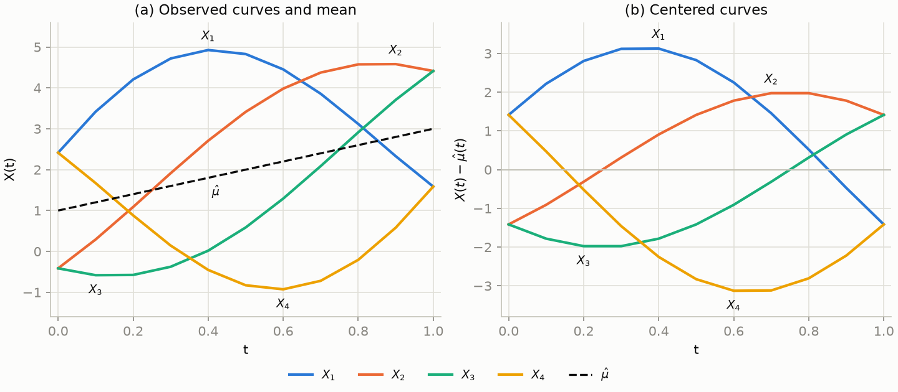
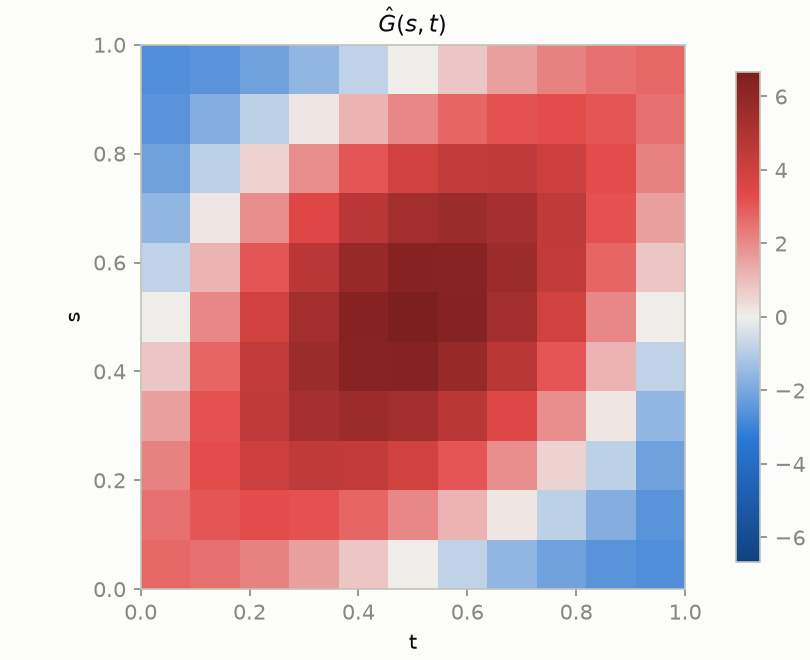
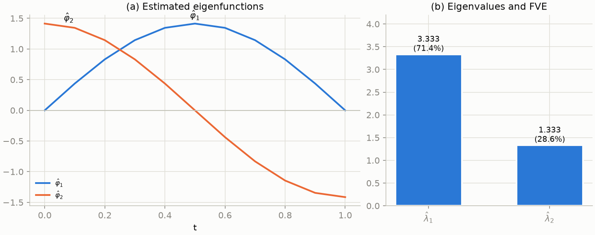
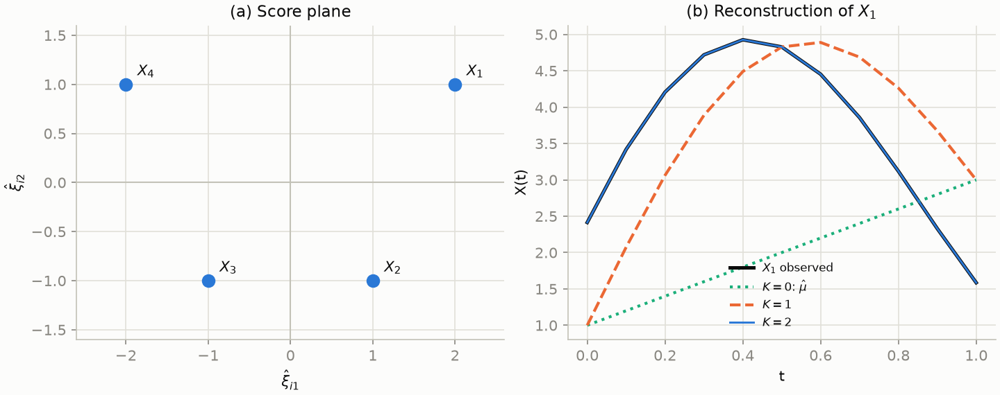

# FPCA Worked Example
Rev. 3 | Created: 2026-08-14 | Updated: 2026-09-04 23:53 CDT

> Every number in this document can be recomputed by hand: four curves are built from a known mean and two known eigenfunctions, and the FPCA pipeline is run on them step by step.
> The point is to watch each stage transform the numbers — data, mean, covariance, eigenpairs — until the pipeline hands back exactly the scores that were planted.
> The formulation follows the Wikipedia article [Functional principal component analysis](https://en.wikipedia.org/wiki/Functional_principal_component_analysis).

FPCA treats each observation as a curve $X_i(t)$ and decomposes the collection into a mean function plus a few dominant modes of variation, the Karhunen–Loève expansion:

$$
X_i(t) = \mu(t) + \sum_{k=1}^{\infty} \xi_{ik} \varphi_k(t)
$$

The $\varphi_k$ are the eigenfunctions of the covariance operator, the $\lambda_k$ their eigenvalues, and the score $\xi_{ik} = \int_0^1 \bigl( X_i(t) - \mu(t) \bigr) \varphi_k(t) dt$ is the coordinate of curve $i$ along mode $k$. The pipeline below estimates each of these objects in turn from sampled data. Because the example is built with known $\mu$, $\varphi_k$, and $\xi_{ik}$, every estimate can be checked against the value it is supposed to recover.

## 1. Notation

Table 1. Symbols used throughout

| Symbol | Shape | Meaning |
|---|---|---|
| $t_j$ | — | Grid points $0, 0.1, \ldots, 1.0$, eleven points on $[0, 1]$ |
| $w_j$ | — | Trapezoid quadrature weights $(0.05, 0.1, \ldots, 0.1, 0.05)$, which turn $\int_0^1 f(t) dt$ into $\sum_j w_j f(t_j)$ |
| $n$ | — | The number of curves, here $n = 4$ |
| $X_i(t_j)$ | $4 \times 11$ | The observed data, one row per curve |
| $\mu(t)$, $\hat{\mu}(t)$ | $11$ | The true and estimated mean function |
| $X_i^c(t_j)$ | $4 \times 11$ | The centered data $X_i(t_j) - \hat{\mu}(t_j)$ |
| $\hat{G}(s,t)$ | $11 \times 11$ | The sample covariance surface |
| $\varphi_k$, $\hat{\varphi}_k$ | $11$ | The true and estimated eigenfunctions |
| $\lambda_k$, $\hat{\lambda}_k$ | — | The true and estimated eigenvalues, ordered $\hat{\lambda}_1 \ge \hat{\lambda}_2 \ge \cdots$ |
| $\xi_{ik}$, $\hat{\xi}_{ik}$ | $4 \times 2$ | The planted and estimated scores of curve $i$ on mode $k$ |
| $K$ | — | The number of modes kept in a truncated reconstruction |

## 2. The Planted Curves

The example plants the answer first. The mean is a rising line, mode 1 is a bump that is largest mid-interval, and mode 2 is a tilt that trades the two ends against each other:

$$
\mu(t) = 1 + 2t, \qquad
\varphi_1(t) = \sqrt{2} \sin(\pi t), \qquad
\varphi_2(t) = \sqrt{2} \cos(\pi t)
$$

The two modes are orthonormal on $[0,1]$: $\int_0^1 \varphi_1^2 = \int_0^1 \varphi_2^2 = 1$ and $\int_0^1 \varphi_1 \varphi_2 = 0$, which is what the eigenfunctions of any covariance operator must satisfy. Each curve is then a mean plus a weighted sum of the two modes, with the weights — the scores — chosen as small integers:

$$
X_i(t) = \mu(t) + \xi_{i1} \varphi_1(t) + \xi_{i2} \varphi_2(t)
$$

Table 2. Planted scores

| Curve | $\xi_{i1}$ (bump) | $\xi_{i2}$ (tilt) |
|---|---|---|
| $X_1$ | $2$ | $1$ |
| $X_2$ | $1$ | $-1$ |
| $X_3$ | $-1$ | $-1$ |
| $X_4$ | $-2$ | $1$ |

Each column of Table 2 sums to zero, so the average of the four curves is exactly $\mu$, and the two columns are uncorrelated ($\sum_i \xi_{i1} \xi_{i2} = 2 - 1 + 1 - 2 = 0$), so neither mode leaks into the other's eigenvalue. With the $n-1$ convention the planted variances are $\lambda_1 = \frac{4+1+1+4}{3} = \frac{10}{3}$ and $\lambda_2 = \frac{1+1+1+1}{3} = \frac{4}{3}$; these are the numbers the eigendecomposition must hand back in section 5. Evaluating the model on the grid gives the data of Table 3, which is everything the pipeline is allowed to see.

Table 3. The functions and the data on the grid

| $t$ | $\mu(t)$ | $\varphi_1(t)$ | $\varphi_2(t)$ | $X_1$ | $X_2$ | $X_3$ | $X_4$ |
|---|---|---|---|---|---|---|---|
| 0.0 | 1.0 | 0.000 | 1.414 | 2.414 | −0.414 | −0.414 | 2.414 |
| 0.1 | 1.2 | 0.437 | 1.345 | 3.419 | 0.292 | −0.582 | 1.671 |
| 0.2 | 1.4 | 0.831 | 1.144 | 4.207 | 1.087 | −0.575 | 0.882 |
| 0.3 | 1.6 | 1.144 | 0.831 | 4.720 | 1.913 | −0.375 | 0.143 |
| 0.4 | 1.8 | 1.345 | 0.437 | 4.927 | 2.708 | 0.018 | −0.453 |
| 0.5 | 2.0 | 1.414 | 0.000 | 4.828 | 3.414 | 0.586 | −0.828 |
| 0.6 | 2.2 | 1.345 | −0.437 | 4.453 | 3.982 | 1.292 | −0.927 |
| 0.7 | 2.4 | 1.144 | −0.831 | 3.857 | 4.375 | 2.087 | −0.720 |
| 0.8 | 2.6 | 0.831 | −1.144 | 3.118 | 4.575 | 2.913 | −0.207 |
| 0.9 | 2.8 | 0.437 | −1.345 | 2.329 | 4.582 | 3.708 | 0.581 |
| 1.0 | 3.0 | 0.000 | −1.414 | 1.586 | 4.414 | 4.414 | 1.586 |

One check of the table against the model: at $t = 0.4$ the first curve is $X_1(0.4) = 1.8 + 2 \times 1.345 + 1 \times 0.437 = 4.927$, which matches the entry. Panel (a) of Fig 1 shows the four curves; $X_1$ bulges far above the mean line ($\xi_{11} = 2$) while $X_4$ dips below it ($\xi_{41} = -2$), and the pairs also differ in how they tilt end to end.

Fig 1. The data before and after centering. Panel (a) shows the four observed curves with the estimated mean $\hat{\mu}$ dashed. Panel (b) shows the same curves after subtracting $\hat{\mu}$; what remains is exactly $\xi_{i1} \varphi_1 + \xi_{i2} \varphi_2$, the material the covariance is computed from.

## 3. Mean And Centering

The mean function is estimated pointwise, by averaging the four curves at each grid point:

$$
\hat{\mu}(t_j) = \frac{1}{4} \sum_{i=1}^{4} X_i(t_j)
$$

At $t = 0.4$ this is $\frac{4.927 + 2.708 + 0.018 - 0.453}{4} = \frac{7.2}{4} = 1.8$, and the same happens at every grid point: $\hat{\mu} = (1.0, 1.2, \ldots, 3.0)$, exactly the planted line $1 + 2t$, because the planted scores in each column of Table 2 sum to zero. Subtracting $\hat{\mu}$ row by row gives the centered data of Table 4, drawn in panel (b) of Fig 1.

Table 4. Centered data $X_i^c(t_j) = X_i(t_j) - \hat{\mu}(t_j)$

| $t$ | $X_1^c$ | $X_2^c$ | $X_3^c$ | $X_4^c$ |
|---|---|---|---|---|
| 0.0 | 1.414 | −1.414 | −1.414 | 1.414 |
| 0.1 | 2.219 | −0.908 | −1.782 | 0.471 |
| 0.2 | 2.807 | −0.313 | −1.975 | −0.518 |
| 0.3 | 3.119 | 0.313 | −1.975 | −1.457 |
| 0.4 | 3.127 | 0.908 | −1.782 | −2.253 |
| 0.5 | 2.828 | 1.414 | −1.414 | −2.828 |
| 0.6 | 2.253 | 1.782 | −0.908 | −3.127 |
| 0.7 | 1.457 | 1.975 | −0.313 | −3.119 |
| 0.8 | 0.518 | 1.975 | 0.313 | −2.807 |
| 0.9 | −0.471 | 1.782 | 0.908 | −2.219 |
| 1.0 | −1.414 | 1.414 | 1.414 | −1.414 |

The symmetry visible in the columns — $X_3^c$ is $X_2^c$ reversed in time, $X_4^c$ is $X_1^c$ reversed and negated — comes from the planted score pattern and helps later hand checks.

## 4. The Covariance Surface

Where PCA forms a covariance matrix between variables, FPCA forms a covariance surface between time points:

$$
\hat{G}(s, t) = \frac{1}{n-1} \sum_{i=1}^{n} X_i^c(s) X_i^c(t)
$$

On the grid this is an $11 \times 11$ matrix. Three entries, computed from the columns of Table 4:

$$
\hat{G}(0, 0) = \tfrac{1.414^2 + (-1.414)^2 + (-1.414)^2 + 1.414^2}{3} = \tfrac{8}{3} = 2.667
$$

$$
\hat{G}(0.5, 0.5) = \tfrac{2.828^2 + 1.414^2 + (-1.414)^2 + (-2.828)^2}{3} = \tfrac{20}{3} = 6.667
$$

$$
\hat{G}(0, 1) = \tfrac{1.414 \times (-1.414) + (-1.414)(1.414) + (-1.414)(1.414) + 1.414 \times (-1.414)}{3} = -\tfrac{8}{3} = -2.667
$$

Each value agrees with the closed form the construction implies, $\hat{G}(s,t) = \lambda_1 \varphi_1(s) \varphi_1(t) + \lambda_2 \varphi_2(s) \varphi_2(t)$: the variance is largest mid-interval where the bump mode peaks ($\lambda_1 \varphi_1(0.5)^2 = \frac{10}{3} \times 2 = 6.667$), and the two ends are negatively correlated because only the tilt mode is active there and it moves them in opposite directions. Fig 2 shows the whole surface.

Fig 2. The covariance surface $\hat{G}(s,t)$ on the $11 \times 11$ grid. The dark ridge along the diagonal mid-interval is the bump mode; the negative corners at $(0,1)$ and $(1,0)$ are the tilt mode trading the two ends against each other.

## 5. Eigenvalues And Eigenfunctions

The continuous problem is the eigenequation of the covariance operator, $\int_0^1 \hat{G}(s,t) \varphi(s) ds = \lambda \varphi(t)$. Discretized with the quadrature weights it becomes a matrix eigenproblem: writing $W = \mathrm{diag}(w_1, \ldots, w_{11})$, the symmetric matrix $W^{1/2} \hat{G} W^{1/2}$ is eigendecomposed, and each eigenvector $u$ is mapped back to a function by $\hat{\varphi} = W^{-1/2} u$, which makes $\hat{\varphi}$ orthonormal under the quadrature inner product $\sum_j w_j f(t_j) g(t_j)$. On this grid that inner product reproduces the planted orthonormality exactly — $\sum_j w_j \varphi_1^2 = \sum_j w_j \varphi_2^2 = 1$ and $\sum_j w_j \varphi_1 \varphi_2 = 0$ — so no discretization error enters the example.

Table 5. Eigenvalues and fraction of variance explained

| $k$ | $\hat{\lambda}_k$ | Planted $\lambda_k$ | FVE | Cumulative FVE |
|---|---|---|---|---|
| 1 | 3.3333 | $10/3$ | 71.4% | 71.4% |
| 2 | 1.3333 | $4/3$ | 28.6% | 100.0% |
| 3–11 | 0.0000 | — | 0.0% | 100.0% |

The eigenvalues come back as exactly the planted score variances, and the nine remaining eigenvalues are zero to machine precision: four centered curves whose coefficients live in a two-dimensional space give a covariance of rank two. The estimated eigenfunctions match the planted ones to $10^{-15}$ at every grid point — panel (a) of Fig 3 is indistinguishable from a plot of $\sqrt{2} \sin(\pi t)$ and $\sqrt{2} \cos(\pi t)$. One caveat carries to any implementation: an eigenvector is only determined up to sign, so $-\hat{\varphi}_2$ is an equally valid answer, and choosing it would negate every mode-2 score while leaving all reconstructions unchanged. Here the sign is fixed by the convention that the first nonzero value of each eigenfunction is positive.

Fig 3. The estimated eigenstructure. Panel (a) shows $\hat{\varphi}_1$, the bump mode, and $\hat{\varphi}_2$, the tilt mode. Panel (b) shows the two nonzero eigenvalues with their fraction of variance explained.

## 6. Scores

The score is the integral of a centered curve against an eigenfunction, and with the quadrature weights it is a weighted sum the reader can add up:

$$
\hat{\xi}_{ik} = \int_0^1 X_i^c(t) \hat{\varphi}_k(t) dt
 \approx \sum_{j=1}^{11} w_j X_i^c(t_j) \hat{\varphi}_k(t_j)
$$

Table 6 spells the sum out for one score, curve 1 on mode 1. Each row multiplies three numbers already on the page: the centered value from Table 4, the eigenfunction value (equal to $\varphi_1$ from Table 3), and the weight.

Table 6. Term-by-term computation of $\hat{\xi}_{11}$

| $t$ | $X_1^c(t)$ | $\hat{\varphi}_1(t)$ | $w$ | $w \cdot X_1^c \cdot \hat{\varphi}_1$ |
|---|---|---|---|---|
| 0.0 | 1.414 | 0.000 | 0.05 | 0.00000 |
| 0.1 | 2.219 | 0.437 | 0.10 | 0.09698 |
| 0.2 | 2.807 | 0.831 | 0.10 | 0.23330 |
| 0.3 | 3.119 | 1.144 | 0.10 | 0.35691 |
| 0.4 | 3.127 | 1.345 | 0.10 | 0.42058 |
| 0.5 | 2.828 | 1.414 | 0.10 | 0.40000 |
| 0.6 | 2.253 | 1.345 | 0.10 | 0.30302 |
| 0.7 | 1.457 | 1.144 | 0.10 | 0.16670 |
| 0.8 | 0.518 | 0.831 | 0.10 | 0.04309 |
| 0.9 | −0.471 | 0.437 | 0.10 | −0.02058 |
| 1.0 | −1.414 | 0.000 | 0.05 | 0.00000 |
| Sum | | | | **2.00000** |

The sum is $\hat{\xi}_{11} = 2.000$ — the planted coefficient from Table 2, recovered by nothing more than multiply-and-add. The same sum over the other rows and modes fills Table 7, and every entry lands on its planted value.

Table 7. All estimated scores against the planted ones

| Curve | $\hat{\xi}_{i1}$ | Planted $\xi_{i1}$ | $\hat{\xi}_{i2}$ | Planted $\xi_{i2}$ |
|---|---|---|---|---|
| $X_1$ | 2.000 | 2 | 1.000 | 1 |
| $X_2$ | 1.000 | 1 | −1.000 | −1 |
| $X_3$ | −1.000 | −1 | −1.000 | −1 |
| $X_4$ | −2.000 | −2 | 1.000 | 1 |

The scores are the final numbers FPCA produces: each curve of 11 samples has been reduced to 2 coordinates, drawn in panel (a) of Fig 4. The plane is readable directly — moving right means a bigger mid-interval bulge, moving up means starting high and ending low — and downstream work (regression, clustering, monitoring) operates on these coordinates instead of the raw curves.

Fig 4. The output of the pipeline. Panel (a) places each curve at its score pair $(\hat\xi_{i1}, \hat\xi_{i2})$; the symmetric pattern is the planted Table 2. Panel (b) rebuilds $X_1$ from the scores: the mean alone ($K=0$), the mean plus the bump mode ($K=1$), and both modes ($K=2$), which lands exactly on the observed curve.

## 7. Reconstruction

Running the expansion forward with the estimated pieces rebuilds a curve from its scores:

$$
\hat{X}_i^{(K)}(t) = \hat{\mu}(t) + \sum_{k=1}^{K} \hat{\xi}_{ik} \hat{\varphi}_k(t)
$$

Panel (b) of Fig 4 shows the sequence for $X_1$. The mean alone misses the bump entirely; adding mode 1 captures the bulge but still misses the tilt; adding mode 2 reproduces the curve exactly. The integrated squared error $\int_0^1 (X_1 - \hat X_1^{(K)})^2 dt$ makes the progression numeric, and ties back to the scores: leaving out mode $k$ costs exactly $\hat\xi_{1k}^2$, which is the score decomposition of the curve's total deviation from the mean.

Table 8. Reconstruction error for $X_1$ by number of modes

| $K$ | Reconstruction | Integrated squared error |
|---|---|---|
| 0 | $\hat{\mu}$ | $5.000 = \hat{\xi}_{11}^2 + \hat{\xi}_{12}^2$ |
| 1 | $\hat{\mu} + 2.000 \hat{\varphi}_1$ | $1.000 = \hat{\xi}_{12}^2$ |
| 2 | $\hat{\mu} + 2.000 \hat{\varphi}_1 + 1.000 \hat{\varphi}_2$ | $0.000$ |

## 8. From The Example To Real Data

Three simplifications made the recovery exact, and each marks the spot where a real analysis does more work. First, the curves here are noise-free; measured curves carry noise, so the mean and the covariance are smoothed before the eigendecomposition, and the diagonal of the covariance — where noise variance concentrates — is handled separately. Second, the planted structure had exactly two modes, so truncation lost nothing; on real data the eigenvalues decay gradually and $K$ is chosen by a cumulative FVE threshold, commonly 90% or 99%. Third, every curve here is observed on the same complete grid, which is what lets the score be a quadrature sum; when curves are observed sparsely or irregularly, that integral cannot be formed and the scores are estimated by PACE, which replaces the integral with a conditional expectation given the few points available. None of these change the objects involved: the pipeline is still mean, covariance, eigenpairs, scores, in that order.

## Appendix A. Terminology

- **Covariance operator** is the map $f \mapsto \int G(s,\cdot) f(s) ds$ whose eigenfunctions and eigenvalues FPCA estimates; the covariance surface $G$ is its kernel.
- **Eigenfunction** is the function-valued analogue of an eigenvector: a unit-norm function $\varphi$ satisfying $\int G(s,t) \varphi(s) ds = \lambda \varphi(t)$.
- **FPCA** is Functional PCA, which treats an observation as a curve rather than a vector when taking components.
- **FVE** is the fraction of variance explained, $\lambda_k / \sum_m \lambda_m$ for one mode and the running total of that ratio cumulatively.
- **Integrated squared error** is $\int (X - \hat{X})^2 dt$, the squared distance between a curve and its reconstruction accumulated over the whole interval.
- **Karhunen–Loève expansion** is the representation of a random curve as its mean plus an infinite weighted sum of the covariance operator's eigenfunctions, with uncorrelated weights.
- **Mode** is one eigenfunction together with its eigenvalue, viewed as one direction of variation among the curves.
- **PACE** is Principal Analysis by Conditional Expectation, the estimator that computes scores as conditional expectations when curves are observed too sparsely for the score integral.
- **Quadrature** is the approximation of an integral by a weighted sum over grid points; the trapezoid rule used here weights interior points by the grid spacing and the two endpoints by half of it.
- **Score** is the coordinate of one sample — for FPCA, one curve — along one principal direction.
