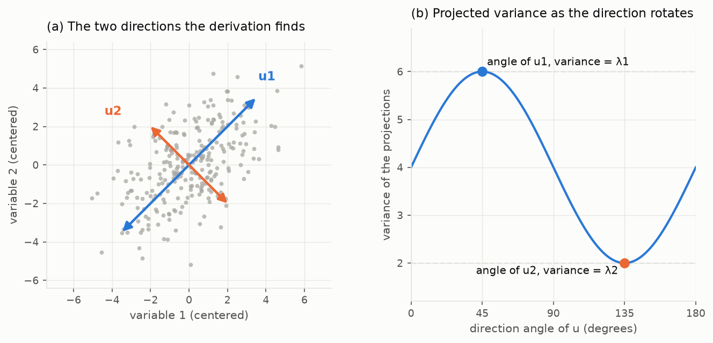
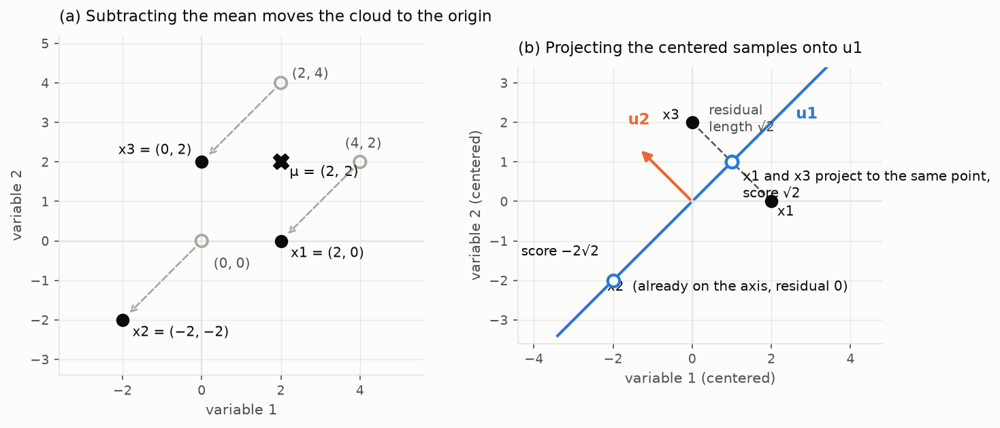

# PCA Derivation
Rev. 3 | Created: 2026-08-11 | Updated: 2026-08-12 18:44 CDT

> The procedure can be followed without knowing why its answer is right, and most uses never need to ask.
> This document is for when the question comes up: it derives, from the requirement of keeping as much variance as possible, that the axes PCA returns must be eigenvectors of the covariance matrix.

The whole derivation is one constrained maximization solved with a Lagrange multiplier, and it is short enough to check line by line. Working through it settles why centering is mandatory, why an eigenvalue is itself a variance, why the components come out ordered and orthogonal without anyone asking for that, and why maximizing the kept variance and minimizing the reconstruction error are the same act.

## 1. Notation

Table 1. Symbols used throughout

| Symbol | Shape | Meaning |
|---|---|---|
| `x_i` | `p × 1` | One centered sample, written as a column vector |
| `n` | — | The number of samples |
| `p` | — | The number of variables |
| `X_c` | `n × p` | The centered data, one sample per row |
| `C` | `p × p` | The covariance matrix, `C = X_cᵀ X_c / (n − 1)` |
| `u` | `p × 1` | A candidate direction, constrained to unit length |
| `λ` | — | The Lagrange multiplier, which turns out to be an eigenvalue and a variance |
| `u_j`, `λ_j` | — | The j-th eigenvector and eigenvalue of `C`, ordered so that `λ_1 ≥ λ_2 ≥ …` |
| `V` | `p × k` | The loadings matrix, the kept components stacked as columns `V = [u_1 … u_k]` |
| `k` | — | The number of components kept |

Two remarks keep the reading smooth. First, `C` is symmetric, because `(X_cᵀ X_c)ᵀ = X_cᵀ X_c`; the derivation leans on that fact twice, once in the gradient and once in the orthogonality argument. Second, the denominator `n − 1` is the unbiased convention, and nothing below depends on it — replacing it with `n` scales every eigenvalue by the same factor and leaves every eigenvector unchanged.

## 2. The Objective

The data is a cloud of `n` points in `p` dimensions, and the question is which single direction keeps the most of its variation.

Centering comes first, and it is not a convention but a precondition. Variance is spread about the mean, so the samples must satisfy `Σ_i x_i = 0` before the quantity below deserves the name; skip the centering and the same formula measures the second moment about the origin instead, and the winning direction points at the mean of the cloud rather than along it.

A direction is a unit vector `u`, and the coordinate of a sample along it is the scalar `uᵀ x_i`. The variance of those coordinates is the objective:

```text
Var(u) = (1/(n − 1)) Σ_i (uᵀ x_i)²
       = uᵀ [ (1/(n − 1)) Σ_i x_i x_iᵀ ] u
       = uᵀ C u
```

The constraint `uᵀ u = 1` is what makes the problem well posed. Doubling `u` quadruples `uᵀ C u`, so without the constraint the maximum is unbounded and meaningless; the object being chosen is a direction, and fixing the length to one removes everything that is not direction. The problem is therefore:

```text
maximize  uᵀ C u   subject to   uᵀ u = 1
```



Fig 1. The problem and its answer for a two-variable cloud with `C = [[4, 2], [2, 4]]`. Panel (a) shows the centered cloud with the two directions the derivation finds, drawn with lengths proportional to the spread along them. Panel (b) sweeps the direction `u` through 180 degrees and plots `uᵀ C u`; the extremes sit exactly at the angles of `u_1` and `u_2`, with heights `λ_1 = 6` and `λ_2 = 2`.

## 3. The Lagrange Condition

A constrained maximum is found by folding the constraint into the objective with a multiplier and asking where the combined function is stationary:

```text
L(u, λ) = uᵀ C u − λ (uᵀ u − 1)
```

Setting the derivative with respect to `λ` to zero recovers the constraint. Setting the gradient with respect to `u` to zero gives the condition that matters:

```text
∂L/∂u = 2 C u − 2 λ u = 0   ⟹   C u = λ u
```

The gradient identity `∂(uᵀ C u)/∂u = 2 C u` holds because `C` is symmetric; for a general matrix `A` the gradient is `(A + Aᵀ) u`, and the factor of two would not collapse.

This one line converts the optimization into linear algebra. The candidates for the best direction are not arbitrary vectors to be searched; they are exactly the eigenvectors of the covariance matrix, a finite list that the eigendecomposition produces outright.

## 4. The Choice Among Stationary Points

`C u = λ u` is satisfied by every eigenvector, so it marks all the stationary points and does not by itself name the maximum. One more line decides. Left-multiplying the condition by `uᵀ` and using `uᵀ u = 1`:

```text
uᵀ C u = λ uᵀ u = λ
```

At a stationary point the objective equals its own eigenvalue. Maximizing is therefore nothing more than picking the eigenvector with the largest eigenvalue, and the variance along that first principal direction is `λ_1` itself.

Two facts fall out of this line rather than being imposed. The eigenvalue is a variance, which is why `λ_j` is called the explained variance and carries the units of the data squared. And sorting the eigenvalues in decreasing order sorts the directions by how much variation each one carries, which is where the ordering of the components comes from. Panel (b) of Fig 1 is this section drawn: as `u` rotates, `uᵀ C u` peaks at the angle of `u_1` with height `λ_1` and bottoms out at the angle of `u_2` with height `λ_2`.

## 5. The Later Components

The second component answers the same question among the directions not yet used: maximize `uᵀ C u` subject to `uᵀ u = 1` and `uᵀ u_1 = 0`. The second constraint gets its own multiplier:

```text
L(u, λ, φ) = uᵀ C u − λ (uᵀ u − 1) − φ uᵀ u_1
∂L/∂u = 2 C u − 2 λ u − φ u_1 = 0
```

Left-multiplying by `u_1ᵀ` kills every term but one. `u_1ᵀ u = 0` by the constraint, and `u_1ᵀ C u = (C u_1)ᵀ u = λ_1 u_1ᵀ u = 0` by the symmetry of `C`, so the equation collapses to `φ = 0` — the new constraint costs nothing at the optimum — and the condition is `C u = λ u` again. The second component is once more an eigenvector, the best one still admissible: the eigenvector of the second-largest eigenvalue. Repeating the argument with orthogonality to all earlier picks makes the j-th component the eigenvector of the j-th largest eigenvalue, so the single eigendecomposition delivers the entire ordered basis at once.

The orthogonality was not a stylistic preference. Eigenvectors of a symmetric matrix belonging to distinct eigenvalues are orthogonal on their own, so the constraint and the answer agree. When two eigenvalues are equal the picture degrades honestly: any rotation of the pair inside their shared plane satisfies every condition equally well, so the individual directions stop being determined even though the plane they span still is.

There is also a fixed budget being divided. The trace of `C` is the sum of the individual variable variances and equals `Σ_j λ_j`, so each component claims a share of a total that no choice of basis can change. That total is the denominator of every explained variance ratio.

One more object falls out of this section. Stacking the kept components as columns gives the loadings matrix `V = [u_1 … u_k]` of shape `p × k`, and the two facts in hand — the unit length imposed in §2 and the orthogonality just proved — compress into the single statement `Vᵀ V = I_k`. A matrix with that property is called column-wise orthonormal, or semi-orthogonal; the unqualified name orthogonal matrix is reserved for the square case `k = p`, where `Vᵀ = V⁻¹` and the change of basis is a pure rotation that preserves every length and angle. The reversed product is a different object altogether: `V Vᵀ` is the `p × p` projection onto the span of the kept components — the `P` that §6 is about to use — and it cannot equal `I_p` while `k < p`, because its rank is only `k`. [Appendix C](#appendix-c-the-column-wise-orthonormal-matrix) lays the two products side by side.

## 6. The Reconstruction View

PCA is often introduced by a different requirement: choose the k-dimensional subspace that minimizes the average squared distance between each sample and its projection. The two requirements meet in one identity. With `P` the projection onto any subspace, each sample splits at a right angle:

```text
‖x_i‖² = ‖P x_i‖² + ‖x_i − P x_i‖²
```

Summing over the samples and dividing by `n − 1`, exactly as the variance does, turns this into an accounting rule: the total variance equals the variance kept in the subspace plus the mean squared reconstruction error. The left side is fixed by the data, so minimizing the error and maximizing the kept variance are the same act, and both are solved by the eigenvectors already found. Keeping the first `k` components keeps `λ_1 + … + λ_k` and loses exactly `λ_{k+1} + … + λ_p`, which is why the sum of the discarded eigenvalues is not merely correlated with the reconstruction error but equal to it.

## 7. The Bridge To The SVD

Implementations rarely form `C`, and the derivation explains what they do instead. Take the thin SVD of the centered data, `X_c = U S Vᵀ`, with the singular values `s_j` on the diagonal of `S`. Then:

```text
C = X_cᵀ X_c / (n − 1) = V (S² / (n − 1)) Vᵀ
```

This is already an eigendecomposition: the columns of `V` are the eigenvectors the derivation demands, with eigenvalues `λ_j = s_j² / (n − 1)`, and the `V` the SVD returns is exactly the column-wise orthonormal matrix that §5 built one column at a time. Decomposing `X_c` directly therefore returns the same axes without ever building the covariance matrix, and it is the preferred route because forming `C` squares the condition number of the problem before the eigensolver starts.

## 8. A Worked Example

Every claim above can be checked by hand on three samples of two variables.

```text
samples    (4, 2), (0, 0), (2, 4)
mean       μ = (2, 2)
centered   x_1 = (2, 0), x_2 = (−2, −2), x_3 = (0, 2)
```

Summed over the three centered samples, the squares of the first variable give 8, the squares of the second give 8, and the cross products give 4, so with `n − 1 = 2`:

```text
C = [ 4  2 ]
    [ 2  4 ]
```

The eigenvalues solve `det(C − λI) = (4 − λ)² − 4 = 0`, so `4 − λ = ±2` and `λ_1 = 6`, `λ_2 = 2`. Substituting back, `(C − 6I) u = 0` forces equal entries, and `(C − 2I) u = 0` forces opposite ones:

```text
u_1 = (1, 1) / √2      u_2 = (1, −1) / √2
```

The two are orthogonal without being asked to be, as §5 promised, and this `C` is the one drawn in Fig 1. The remaining claims each reduce to one line of arithmetic.

Table 2. The claims checked against the example

| Claim | Check | Result |
|---|---|---|
| The variance along `u_1` equals `λ_1` (§4) | The scores `u_1ᵀ x_i` are `√2, −2√2, √2`, with variance `(2 + 8 + 2) / 2` | `6 = λ_1` |
| The total variance equals `Σ λ_j` (§5) | The trace of `C` is `4 + 4` | `8 = 6 + 2` |
| The discarded `λ` equals the reconstruction error (§6) | Keeping only `u_1`, the residuals are the coordinates along `u_2`, namely `√2, 0, −√2`, with mean square `(2 + 0 + 2) / 2` | `2 = λ_2` |

The explained variance ratio of the first component is `6 / 8 = 0.75`, and the example is small enough that all of these numbers survive being recomputed on paper. [Appendix B](#appendix-b-the-worked-example-drawn) draws the same numbers in both coordinate systems.

## Appendix A. Terminology

The terms below appear in the body without being defined there.

- **Condition number** measures how much a matrix amplifies relative error, so a large one means fewer reliable digits in the result.
- **Covariance matrix** holds the pairwise covariances of the variables, with the variances on its diagonal.
- **Eigendecomposition** writes a symmetric matrix as its eigenvectors scaled by its eigenvalues.
- **Eigenvector and eigenvalue** are a vector that a matrix maps to a multiple of itself, and that multiple.
- **Gradient** is the vector of partial derivatives of a function, which vanishes where the function is flat.
- **Identity matrix** `I_k` is the `k × k` matrix with ones on the diagonal and zeros elsewhere, which maps every vector to itself.
- **Lagrange multiplier** is the extra variable that folds a constraint into an objective so that a constrained optimum appears as a stationary point.
- **Orthonormal** describes a set of vectors that each have unit length and are mutually orthogonal.
- **Projection** is the component of a vector along a direction or inside a subspace.
- **Rank** is the number of linearly independent directions a matrix spans.
- **Span** is the set of all linear combinations of a set of vectors.
- **Stationary point** is a point where the gradient vanishes, which covers maxima, minima, and saddle points alike.
- **SVD** decomposes a matrix into left singular vectors, singular values, and right singular vectors.
- **Thin SVD** returns only the singular vectors that correspond to non-zero singular values.
- **Trace** is the sum of the diagonal entries of a matrix, which equals the sum of its eigenvalues.

## Appendix B. The Worked Example Drawn



Fig 2. The worked example of §8 in pictures. Panel (a) shows the three samples, their mean `μ = (2, 2)`, and the centering that moves each sample by `−μ` so the cloud sits about the origin. Panel (b) shows the centered samples with the axis `u_1` and the direction `u_2`; the open circles are the projections onto `u_1`, whose positions along the axis are the scores `√2, −2√2, √2`, and the dashed segments are the residuals, whose average square `(2 + 0 + 2) / 2 = 2` equals the discarded `λ_2`.

Every number in Table 2 has a visible counterpart here. The scores are where the open circles sit along `u_1`, the spread of those circles is the `λ_1 = 6` the derivation maximized, and the dashed segments are what the one-component reconstruction gives up. Two details reward a second look. `x_2` lies on the axis already, so keeping one component reconstructs it exactly. And `x_1` and `x_3` land on the same projected point — two different samples that the one-component summary can no longer tell apart, which is what losing `λ_2` means in concrete terms.

## Appendix C. The Column-wise Orthonormal Matrix

The components of §5 are usually handled not one at a time but stacked into a single matrix, one component per column:

```text
       [  |    |          |  ]
V  =   [ u_1  u_2   ...  u_k ]    ∈  ℝ^(p × k)
       [  |    |          |  ]
```

Every entry of `Vᵀ V` is a product of one column with another, `(Vᵀ V)_ij = u_iᵀ u_j`, so the unit lengths of §2 fill the diagonal with ones and the orthogonality of §5 fills everything off the diagonal with zeros. No such argument exists for the rows, and the two products come out asymmetric:

```text
column test    Vᵀ V  =  I_k     (k × k)    the columns have length 1 and are mutually orthogonal
row test       V Vᵀ  ≠  I_p     (p × p)    fails whenever k < p, because the rank of V Vᵀ is only k
```

The asymmetry is why the naming is column-wise. A rectangular `V` that passes only the column test is called a column-wise orthonormal matrix, or a semi-orthogonal matrix; the unqualified name orthogonal matrix is reserved for the square case `k = p`, where both tests pass at once and `Vᵀ = V⁻¹`. The failed row test is not a defect but the point of the truncation: `V Vᵀ` is the projection onto the span of the kept components — the `P` of §6 — and a projection that changed nothing would have compressed nothing.

Table 3. The two products of the loadings matrix

| Product | Shape | Value | Reading |
|---|---|---|---|
| `Vᵀ V` | `k × k` | `I_k` always | The columns are unit length and mutually orthogonal |
| `V Vᵀ` | `p × p` | `I_p` only when `k = p` | The projection onto the span of the kept components, with rank `k` |

The worked example of §8 shows both cases in the smallest possible numbers. Keeping both components makes `V` square, and both tests pass; keeping only `u_1` leaves the column test intact while the row test produces the projection that drew the open circles of Fig 2:

```text
keep both      V  =  1/√2 [ 1   1 ]      Vᵀ V = I_2    and    V Vᵀ = I_2
                          [ 1  −1 ]

keep u_1 only  V  =  1/√2 [ 1 ]          Vᵀ V = [ 1 ]   but   V Vᵀ = 1/2 [ 1  1 ]  ≠  I_2
                          [ 1 ]                                         [ 1  1 ]
```

Applying that last `V Vᵀ` to `x_1 = (2, 0)` gives `(1, 1)`, which is exactly where the dashed segment of Fig 2 lands — the matrix that fails the row test is the same map that sent `x_1` and `x_3` to their shared projection.
