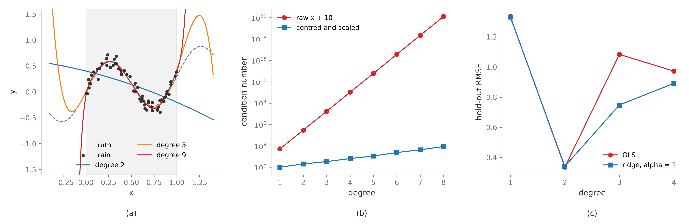

# Polynomial Feature Expansion (Korean)
Rev. 2 | Created: 2026-09-07 | Updated: 2026-09-09 21:06 UTC

## 1. Purpose

- **Problem Statement**: 선형 model 은 경계를 직선과 초평면으로만 그린다. 두 조건이 함께 높을 때만 나타나는 응답이나 정점을 지나 꺾이는 응답은 계수를 아무리 잘 추정해도 표현되지 않으며, 그 부족분은 잔차의 구조로 남아 model 이 틀렸다는 사실조차 드러나지 않는다.
- **Goal**: 원 변수의 곱과 거듭제곱을 새 열로 만들어 비선형 관계와 특성 간 상호작용을 선형 model 에 담되, 그 대가인 열 수 증가와 overfitting 을 degree 와 penalty 로 붙들 수 있게 한다.
- **Non-Goal**: 확장한 열에 붙는 model 의 학습 algorithm 은 다루지 않는다. 범주형 변수의 encoding 과 결측치 대체 방법도 다루지 않는다.

## 2. Summary

확장은 model 을 선형으로 둔 채 두 가지를 얻는 수단이다. 한 변수 안의 비선형 관계와 변수 사이의 상호작용이다. 값은 열로 치르며, 기본값 셋이 그 값을 감당 가능한 크기로 묶는다. degree 는 2, 확장 전에 원 변수를 중심화, 그리고 확장한 열에는 ridge 나 lasso 의 penalty 다.

셋 가운데 가장 자주 빠지는 것은 둘째와 셋째다. 중심화하지 않은 물리 단위에서 $x$ 와 $x^2$ 의 상관은 1 에 가깝고 (4.2 절), 확장이 만든 열은 원 변수가 서로 직교하더라도 서로 직교하지 않는다. 그래서 확장의 실패는 model 이 못 맞추는 모습이 아니라 계수의 부호가 표본마다 뒤집히는 모습으로 온다.

확장을 쓰지 않아야 하는 자리도 분명하다. 변수가 수십 개를 넘으면 열 수가 표본 수를 넘고, 한 변수 안에서 여러 번 꺾이는 모양이 필요하면 차수를 올리는 대신 spline 으로 가야 하며, 훈련 구간 밖을 예측해야 하면 다항식의 외삽 (extrapolation) 성질 자체가 위험이다. Table 1 이 그 갈림이다.

Table 1. Default choices and when they change

| Condition | Choice | Why |
| --- | --- | --- |
| Fewer than a few dozen variables, curvature and pairwise effects expected | Degree 2, centred, ridge | A term count below the row count |
| Curvature judged absent, only cross effects wanted | `interaction_only=True` | Squares dropped as a modelling decision, not as a saving |
| Many variables, few rows | Polynomial kernel or a sketch | Cost on rows rather than on columns |
| Repeated bends inside one variable | Spline or GAM | Local basis instead of a higher degree |
| Prediction outside the training range | Neither expansion nor a high degree | A polynomial governed by its top term outside the range |

## 3. Objective

확장이 노리는 것은 둘이다. 한 변수 안의 비선형 관계와 변수 사이의 상호작용이다. 선형 model 은 둘 다 표현하지 못하며, 확장은 그 둘을 열에 넣어 model 자체는 선형으로 남긴다.

### 3.1 Non-linear Relationship

원 특성 $x$ 에 $x^2$, $x^3$ 같은 다항 항을 더하면 model 은 방정식을 선형으로 유지한 채 곡선과 곡면을 적합한다. 변수 두 개를 2차로 확장했을 때 model 이 학습하는 식은 (1) 이다.

$$\hat{y} = \beta_0 + \beta_1 x_1 + \beta_2 x_2 + \beta_3 x_1^2 + \beta_4 x_1 x_2 + \beta_5 x_2^2 \hspace{19em} (1)$$

제곱항의 계수 $\beta_3$ 와 $\beta_5$ 가 한 변수 안의 곡률, 곧 정점이나 포화를 담는다. 계수는 여전히 선형으로 들어가므로 최소제곱과 그 위에 쌓인 추론·정칙화가 그대로 쓰인다. 비선형은 model 이 아니라 열에 들어 있으며, 이것이 확장을 표준적인 첫 수단으로 만드는 이유다.

### 3.2 Feature Interaction

곱항 $\beta_4 x_1 x_2$ 는 한 변수의 기울기를 다른 변수가 바꾸도록 허용한다. 식 (1) 을 $x_1$ 로 미분한 식 (2) 가 그 뜻이다.

$$\frac{\partial \hat{y}}{\partial x_1} = \beta_1 + 2 \beta_3 x_1 + \beta_4 x_2 \hspace{19em} (2)$$

$\beta_4$ 가 0 이 아니면 $x_1$ 의 효과는 $x_2$ 의 수준마다 다르다. 공정으로 옮기면 압력의 효과가 온도에 따라 달라진다는 문장이며, 주효과 두 개로는 적을 수 없다. 두 변수가 함께 작용할 때만 나타나는 효과가 놓일 자리가 여기뿐이다. 응답면 (response surface) 을 2차 다항식으로 적는 오랜 관행이 곡률과 상호작용의 조합이며, 최적 조건을 그 곡면의 정류점에서 읽는 방법이 거기서 나왔다 [[1](#ref-1)].

## 4. Mechanism

### 4.1 Expansion

확장은 원 변수로 만들 수 있는 단항식 (monomial) 을 새 열로 붙이는 연산이다. 변수가 $n$ 개이고 최고 차수를 $d$ 로 두면 새 열은 식 (3) 의 집합이다.

$$\Phi_d(\mathbf{x}) = \left\lbrace \prod_{i=1}^{n} x_i^{a_i} \ \middle|\ a_i \in \mathbb{Z}_{\ge 0}, \ 1 \le \sum_{i=1}^{n} a_i \le d \right\rbrace \hspace{19em} (3)$$

변수가 $[X_1, X_2]$ 이고 $d = 2$ 이면 절편을 포함한 열은 $[1, X_1, X_2, X_1^2, X_1 X_2, X_2^2]$ 이며, 식 (1) 이 적합되는 곳이 그 열이다. 변수가 $n$ 개인 2차 model 의 일반형은 식 (4) 이고, 3 장의 두 목적이 각각 제곱항과 곱항에 들어 있다.

$$y = \beta_0 + \sum_{i=1}^{n} \beta_i x_i + \sum_{1 \le i \le j \le n} \beta_{ij} x_i x_j + \varepsilon \hspace{19em} (4)$$

### 4.2 Centering And Conditioning

확장 전에 원 변수를 중심화한다. 이것이 확장에서 가장 값싸고 가장 큰 효과를 내는 조치다.

물리 단위의 값은 대개 0 에서 멀리 떨어져 있고, 그런 $x$ 와 $x^2$ 는 거의 같은 방향을 가리킨다. $[10, 11]$ 구간에 놓인 60 개 표본에서 둘의 상관은 0.9999 이며, 평균을 뺀 뒤에는 -0.15 이다. 중심화 뒤의 그 상관은 3차 중심적률에 비례하므로, 분포가 대칭이면 0 이 되고 표본에서는 그 근처에 놓인다.

조건수 (condition number) 로 보면 차이가 더 크다. 같은 표본에서 $d = 2$ 의 design matrix 조건수는 원 단위에서 $1.6 \times 10^5$, 중심화·표준화 뒤에는 2.8 이다. $d = 4$ 에서는 $3.4 \times 10^{10}$ 과 16 이고, $d = 8$ 에서는 $1.5 \times 10^{21}$ 과 $8.0 \times 10^{2}$ 이다 (Fig 1(b)). 배정도 부동소수의 유효 자릿수가 약 16 자리이므로, 원 단위의 $d = 8$ 은 푸는 시늉만 하는 문제다.

중심화의 두 번째 이유는 해석이다. 중심화한 자료에서 $\beta_1$ 은 다른 변수가 평균일 때의 기울기여서 읽을 수 있는 값이 된다. 중심화하지 않으면 그것은 다른 변수가 0 일 때의 기울기이고, 그 0 은 자료에 없는 점인 경우가 많다 [[2](#ref-2)].

다만 중심화는 상관을 낮출 뿐 없애지 못한다. 확장이 만든 collinearity 는 자료의 성질이 아니라 확장 자체의 성질이므로, penalty 가 함께 필요하다 (5.2 절).

### 4.3 Hierarchy

곱항을 남기면 그 곱을 이루는 주효과도 함께 남긴다. 이 규칙을 heredity 라 하며, 근거는 통계가 아니라 좌표계에 있다.

$y = \beta_{12} x_1 x_2$ 처럼 곱항만 있는 model 에 원점 이동 $x_1 = z_1 + a$, $x_2 = z_2 + b$ 를 넣으면 식 (5) 가 된다.

$$\beta_{12} (z_1 + a)(z_2 + b) = \beta_{12} z_1 z_2 + \beta_{12} b z_1 + \beta_{12} a z_2 + \beta_{12} ab \hspace{19em} (5)$$

주효과가 저절로 생긴다. 곧 주효과 없는 곱항 model 은 원점을 어디에 두었느냐에 따라 달라져, 온도를 섭씨로 재느냐 절대온도로 재느냐가 model 을 바꾼다. 주효과를 함께 두면 그 이동이 계수의 재배열로 흡수된다. 곱을 이루는 변수 가운데 하나만 있어도 된다는 약한 형태 (weak heredity) 를 근거로 주효과를 지우는 관행이 있으나, 그것이 정당화되는 조건은 실무에서 거의 성립하지 않는다 [[4](#ref-4)]. 변수 선택을 자동화할 때도 heredity 를 사전 (prior) 이나 제약으로 걸어 두는 편이 낫다 [[5](#ref-5)] [[6](#ref-6)].

`interaction_only=True` 는 제곱항을 지우는 option 이지 heredity 를 어기는 option 이 아니다. 1차 항은 그대로 남으므로, 변수 두 개에서 나오는 열은 $[X_1, X_2, X_1 X_2]$ 이다.

## 5. Caution

확장의 대가는 둘이다. 열 수가 폭증하여 overfitting 을 부르고 계산 비용을 올리는 것이 하나, 확장이 만든 열이 서로 닮아 계수가 흔들리는 것이 다른 하나다. 앞의 것은 degree 로, 뒤의 것은 penalty 로 다스린다.

### 5.1 Dimensionality And Overfitting

열의 수는 변수의 수에 대해 $d$ 차로 늘어난다. 절편을 뺀 전체 확장의 열 수는 식 (6), 서로 다른 변수의 곱만 남기는 `interaction_only` 의 열 수는 식 (7) 이다.

$$p_{\mathrm{full}} = \binom{n+d}{d} - 1 \hspace{19em} (6)$$

$$p_{\mathrm{inter}} = \sum_{j=1}^{\min(d,\ n)} \binom{n}{j} \hspace{19em} (7)$$

Table 2. Column count after expansion, bias column excluded

| Variables | Degree 2, full | Degree 2, interaction only | Degree 3, full | Degree 3, interaction only |
| --- | --- | --- | --- | --- |
| 5 | 20 | 15 | 55 | 25 |
| 10 | 65 | 55 | 285 | 175 |
| 20 | 230 | 210 | 1,770 | 1,350 |
| 50 | 1,325 | 1,275 | 23,425 | 20,875 |
| 100 | 5,150 | 5,050 | 176,850 | 166,750 |

Table 2 에서 읽을 것은 `interaction_only` 가 줄여 주는 몫이 작다는 사실이다. $d = 2$ 에서 그 차이는 제곱항 $n$ 개뿐이어서 $n = 100$ 의 5,150 이 5,050 이 될 뿐이다. 곧 이 option 은 열 수를 줄이려고 켜는 것이 아니라, 한 변수 안의 곡률을 model 에 넣지 않겠다는 판단을 적는 자리다.

열 수를 실제로 정하는 것은 degree 다. $d$ 를 2 에서 3 으로 올리면 $n = 20$ 에서 열은 230 에서 1,770 으로 늘어난다. 열 수가 행 수에 가까워지면 최소제곱의 해는 불안정해지고 넘어서면 유일하지 않으므로, 확장의 상한을 정하는 것은 degree 가 아니라 표본 수이다.

그래서 degree 는 이론이 아니라 held-out 오차로 고르며, 후보는 좁다. 실무의 거의 모든 경우에 2 이고, 3 이 필요한 자료는 드물며, 4 이상이 이기는 것처럼 보이면 확장이 아니라 다른 방법을 써야 한다는 신호다.



Fig 1. Degree and extrapolation, conditioning, and the cost of expansion

Fig 1(a) 는 첫 번째 이유다. 60 개 표본에 degree 2, 5, 9 를 맞춘 것으로, 훈련 구간 (회색) 안에서는 degree 5 와 9 가 모두 그럴듯하지만 구간을 벗어나면 차수가 높은 곡선이 먼저 폭주한다. 다항식의 바깥 거동은 최고차항이 지배하므로, 외삽이 필요한 곳에서 degree 를 올리는 것은 표현력이 아니라 위험을 사는 일이다.

Fig 1(b) 는 4.2 절의 조건수를 차수별로 그린 것이고, Fig 1(c) 는 항 수와 행 수의 관계다. 변수 5 개, 행 60 개, 참 model 이 곱항 하나인 자료에서 held-out RMSE 는 degree 1 의 1.34 에서 degree 2 의 0.34 로 내려갔다가 degree 3 에서 1.08 로 되돌아간다. degree 3 의 열 수는 55 로 행 수 60 에 거의 닿는다. 같은 자리에서 ridge 는 0.75 여서 그 악화의 절반 가까이를 막는다.

### 5.2 Regularization

확장한 열에는 penalty 를 당연한 것으로 함께 건다. 확장은 열 수를 늘리는 동시에 서로 닮은 열을 만드는데, penalty 없는 최소제곱은 그 닮음을 서로 상쇄하는 두 개의 큰 계수로 흡수하며, 그래서 자료가 조금만 흔들려도 적합이 크게 움직인다. Ridge 는 풀기 전에 대각에 작은 값을 더해 그것을 막는다 [[3](#ref-3)].

둘 중 기본은 ridge 다. Ridge 는 닮은 열들에 계수를 나누어 주어 예측을 안정시키고, lasso 는 그 가운데 하나만 남기고 나머지를 지운다. 확장한 열에서 lasso 는 곱항을 남기고 그 주효과를 지워 4.3 절의 heredity 를 깨뜨릴 수 있으므로, 홀로 쓰기보다 계층 제약과 함께 쓴다 [[6](#ref-6)].

Penalty 는 열의 크기에 걸리므로 확장한 열을 표준화한 뒤에 적용하며, 6.2 절의 pipeline 에 두 번째 표준화가 들어가는 이유가 그것이다.

### 5.3 Failure Modes

확장이 실패하는 모습은 여섯 가지로 정리된다. 대부분은 model 이 못 맞추는 모습이 아니라 계수나 예측이 불안정해지는 모습으로 온다.

Table 3. Failure modes of a polynomial expansion

| Symptom | Cause | Countermeasure |
| --- | --- | --- |
| Held-out error worse at degree 2 than at degree 1 | Term count close to the row count | Ridge or lasso, `interaction_only`, selective expansion |
| Coefficient signs flipping across resamples | Collinearity manufactured by the expansion | Centring, regularization, reading predictions instead of coefficients |
| Prediction diverging just outside the training range | Extrapolation behaviour of a polynomial | Spline, a range guard on the input, no extrapolation |
| A handful of rows dominating the fit | Squares amplifying leverage | Outlier handling before expansion, robust loss |
| Duplicate or all-zero columns | Binary and one-hot columns squared and crossed | `interaction_only=True`, expansion restricted to continuous columns |
| Imputed values amplified | Imputation error squared inside a product | Imputation before expansion, an indicator column for what was imputed |

다섯째 줄은 확장이 걸러 주지 않는 함정이라 따로 적는다. 0/1 열은 제곱이 자기 자신이어서 완전히 중복된 열이 되고, 같은 범주 변수에서 나온 두 dummy 의 곱은 언제나 0 이다. 확장은 그것을 알지 못하므로, 범주형에서 나온 열은 확장 대상에서 빼거나 `interaction_only` 로 다루어야 한다.

### 5.4 Diagnostics

확장이 도움이 되었는지는 네 가지로 확인한다.

- Degree 를 1 부터 올리며 그린 held-out 오차 곡선. 최저점이 2 를 넘지 않는지 본다.
- 확장한 design matrix 의 조건수와 열별 VIF (Variance Inflation Factor). 중심화 뒤에도 큰 값이면 정칙화가 필요하다.
- Bootstrap 재표본에서 계수 부호가 유지되는 비율. 곱항의 부호가 뒤집히면 그 항은 해석하지 않는다.
- 잔차를 곱항에 대해 그린 산점도. 확장 전에 남아 있던 구조가 사라졌는지 확인한다.

## 6. Implementation

### 6.1 Options

확장 자체는 `sklearn.preprocessing.PolynomialFeatures` 한 줄이며, 정할 것은 네 인자뿐이다 [[7](#ref-7)].

Table 4. PolynomialFeatures arguments

| Argument | Effect | Note |
| --- | --- | --- |
| `degree` | Highest degree of the monomials | A `(min, max)` tuple for the lowest degree as well, so `(2, 2)` for second-order terms only |
| `interaction_only` | Products of distinct variables only | First-order terms kept, powers of a single variable dropped |
| `include_bias` | A constant column of ones | False where the estimator carries its own intercept |
| `order` | Memory layout of the output array | 'C' or 'F', a choice of layout rather than of content |

```python
# Python
from sklearn.preprocessing import PolynomialFeatures

# interaction_only=True keeps X1*X2 and drops X1^2, X2^2
poly = PolynomialFeatures(degree=2, interaction_only=True, include_bias=False)
X_expanded = poly.fit_transform(X)
term_name = poly.get_feature_names_out()
```

`get_feature_names_out()` 이 돌려주는 이름은 계수를 다시 열에 되짚는 유일한 통로다. 확장 뒤에 이름을 잃으면 어느 계수가 어느 곱에 붙었는지 알 수 없고, 확장의 장점인 해석 가능성이 그 자리에서 사라진다.

### 6.2 Pipeline

확장은 홀로 쓰지 않고 표준화와 정칙화 사이에 둔다. 순서는 원 변수 표준화, 확장, 확장한 열의 재표준화, 그리고 penalized fit 이다.

앞의 표준화는 4.2 절의 조건수 문제를 없애고, 뒤의 표준화는 penalty 가 열마다 공평하게 걸리게 한다. 곱항의 분산은 원 변수 분산의 곱에 가까워 열마다 크게 벌어지므로, 재표준화 없이 ridge 를 걸면 penalty 가 사실상 분산이 큰 열에만 걸린다.

```python
# Python
from sklearn.linear_model import Ridge
from sklearn.model_selection import GridSearchCV
from sklearn.pipeline import Pipeline
from sklearn.preprocessing import PolynomialFeatures, StandardScaler

pipeline = Pipeline([
    ('raw_scale', StandardScaler()),
    ('expand', PolynomialFeatures(include_bias=False)),
    ('term_scale', StandardScaler()),
    ('fit', Ridge()),
])
grid = {'expand__degree': [1, 2, 3], 'fit__alpha': [0.1, 1.0, 10.0, 100.0]}
search = GridSearchCV(pipeline, grid, scoring='neg_root_mean_squared_error', cv=5)
search.fit(X, y)
```

확장을 pipeline 안에 두는 이유는 편의가 아니다. 확장 자체는 행마다 독립이라 누수 (leakage) 를 만들지 않지만, 앞뒤의 표준화는 fold 의 훈련 부분에서만 평균과 분산을 얻어야 한다. degree 와 penalty 를 함께 고르는 일도 pipeline 안에서만 한 번의 탐색으로 끝난다.

### 6.3 Cost

확장의 비용은 열 수에 선형이고, 그 열 수는 식 (6) 으로 늘어난다. 행 100,000, 변수 100, $d = 2$ 이면 열은 5,150 개이고 배정도 dense 행렬은 4.1 GB 다. 확장 결과를 memory 에 두지 않는 길이 둘 있다.

첫째는 kernel 이다. 다항 kernel 식 (8) 은 확장한 공간의 내적을 확장 없이 계산한다.

$$K(\mathbf{x}, \mathbf{z}) = (\gamma\, \mathbf{x}^{\top} \mathbf{z} + c)^{d} \hspace{19em} (8)$$

`KernelRidge(kernel='poly')` 가 그 형태이며, 비용이 열이 아니라 행에 걸리므로 변수가 많고 행이 적은 자료에 맞는다. 대가는 해석이다. 계수가 개별 단항식에 붙지 않아 어느 곱이 기여했는지 읽을 수 없다.

둘째는 근사다. `PolynomialCountSketch` 는 다항 kernel 의 특징 공간을 정해진 수의 열로 sketch 하고, `Nystroem` 은 표본의 부분집합으로 kernel 행렬을 근사한다. 둘 다 kernel 을 유한한 수의 열로 근사해 선형 model 의 속도를 지키는 계열이며 [[8](#ref-8)], 열 수를 사용자가 정한 값으로 묶는다.

희소 입력은 그대로 받는다. CSR 형식의 희소 행렬을 넣으면 확장 결과도 희소 행렬로 나오므로, one-hot 열이 많은 자료가 dense 로 부풀지 않는다.

### 6.4 Selective Expansion

모든 짝을 만들 필요는 없다. 곱할 열을 골라 넘기면 열 수는 Table 2 가 아니라 고른 개수로 끝난다.

```python
# Python
from sklearn.compose import ColumnTransformer
from sklearn.preprocessing import PolynomialFeatures

expand_column = ['temperature', 'pressure']
transformer = ColumnTransformer(
    [('expand', PolynomialFeatures(degree=2, include_bias=False), expand_column)],
    remainder='passthrough',
)
```

고를 근거는 셋이다. 공정이 이미 아는 상호작용, 잔차가 두 변수의 조합에서 구조를 보이는 경우, 그리고 tree ensemble 을 먼저 돌려 상호작용의 세기를 재고 상위 짝만 남기는 방법이다 [[9](#ref-9)]. 셋 다 없으면 전체 확장에 정칙화를 거는 편이 낫다. 근거 없이 고른 짝은 model 이 아니라 분석자의 취향이 들어간 자리가 된다.

## 7. Comparison

확장이 맞지 않는 자리는 셋이다. 변수가 많을 때, 한 변수 안에서 여러 번 꺾일 때, 그리고 외삽이 필요할 때다. Table 5 는 그 자리에서 무엇으로 갈아탈지를 정리한 것이다.

Table 5. Alternatives to a polynomial expansion

| Method | What it buys | When to prefer | Cost |
| --- | --- | --- | --- |
| Polynomial expansion | Explicit terms, a linear model kept intact | A few dozen variables, curvature and pairwise effects | Column count, fragile extrapolation |
| Spline and P-spline | Local flexibility, a bounded basis [[11](#ref-11)] | Repeated bends inside one variable | Tensor products for interactions, growing again |
| GAM | A sum of per-variable curves, readable | Non-linear main effects, few interactions | Interaction terms declared by hand |
| Polynomial kernel | The same space without materializing it | Many variables, few rows | No coefficient attached to a term |
| Random feature or sketch | Column count fixed by the user | Many rows and many variables | Approximation error |
| Factorization machine | Pairwise coefficients factorized [[12](#ref-12)] | Sparse high-cardinality categorical data | Interaction strength only, limited reading |
| Tree ensemble | Interactions found without being named | The form of the interaction unknown | A piecewise-constant surface, no extrapolation |
| Rule ensemble | Rules alongside linear terms [[9](#ref-9)] | Interpretable interactions wanted | Rule count to be tuned |

PLS 로 확장한 열을 받는 길도 있다. 확장이 만든 collinearity 를 정면으로 다루는 방법이며, 관측이 계수보다 적은 실험 자료에서 쓰인다. 어느 쪽을 고르든 판단의 순서는 같다. 먼저 표현력이 부족한지 확인하고, 부족하다면 그 부족이 곱항인지 곡률인지 가른 뒤에 방법을 고른다. 기저 확장 전체를 한 틀에서 견주는 정리가 있다 [[10](#ref-10)].

## 8. Further Work

- **Sparse polynomial chaos expansion** — 직교 다항식 기저 위에서 항을 희소하게 골라 고차 확장을 감당 가능한 크기로 줄이는 방법이다 [[13](#ref-13)]. 최소각 회귀 (least angle regression) 로 항을 고르는 절차가 자리 잡아 수백 개 후보에서 수십 개만 남기는 일이 계산으로 가능해졌다. 착수에는 입력 변수의 분포 가정 (기저가 그 분포에 따라 정해진다) 과 설계된 표본이 필요하다.
- **Hierarchical interaction selection at scale** — heredity 를 볼록 제약으로 걸어 곱항을 고르는 lasso 계열이다 [[6](#ref-6)]. 제약이 볼록이라 수백 변수까지 풀리므로, 4.3 절의 규칙을 사람이 지키는 대신 최적화가 지키게 할 수 있다. 착수에는 곱항 후보의 범위를 미리 좁히는 규칙과 계산 예산이 필요하다.
- **Learned basis** — 고정된 단항식 기저 대신 1차원 함수를 학습해 쌓는 model 이다 [[14](#ref-14)]. 2024 년에 spline 기반 구현이 공개되어 같은 자료에서 확장 + ridge 와 직접 견줄 수 있게 되었다. 착수에는 held-out 비교 절차와, 학습되는 기저가 표본 수에 비해 과하지 않은지 판단할 기준이 필요하다.

## References

<a id="ref-1"></a>
[1] Box, G. E. P. and Wilson, K. B. (1951). [On the Experimental Attainment of Optimum Conditions](https://doi.org/10.1111/j.2517-6161.1951.tb00067.x). *Journal of the Royal Statistical Society: Series B*, 13(1), 1–38.<br>
<a id="ref-2"></a>
[2] Marquardt, D. W. (1980). [Comment: You Should Standardize the Predictor Variables in Your Regression Models](https://doi.org/10.1080/01621459.1980.10477430). *Journal of the American Statistical Association*, 75(369), 87–91.<br>
<a id="ref-3"></a>
[3] Hoerl, A. E. and Kennard, R. W. (1970). [Ridge Regression: Biased Estimation for Nonorthogonal Problems](https://doi.org/10.1080/00401706.1970.10488634). *Technometrics*, 12(1), 55–67.<br>
<a id="ref-4"></a>
[4] Nelder, J. A. (1998). [The Selection of Terms in Response-Surface Models—How Strong is the Weak-Heredity Principle?](https://doi.org/10.1080/00031305.1998.10480588) *The American Statistician*, 52(4), 315–318.<br>
<a id="ref-5"></a>
[5] Chipman, H. (1996). [Bayesian variable selection with related predictors](https://doi.org/10.2307/3315687). *The Canadian Journal of Statistics*, 24(1), 17–36.<br>
<a id="ref-6"></a>
[6] Bien, J., Taylor, J. and Tibshirani, R. (2013). [A lasso for hierarchical interactions](https://doi.org/10.1214/13-AOS1096). *The Annals of Statistics*, 41(3), 1111–1141.<br>
<a id="ref-7"></a>
[7] Pedregosa, F., Varoquaux, G., Gramfort, A., Michel, V., Thirion, B., Grisel, O., Blondel, M., Prettenhofer, P., Weiss, R., Dubourg, V., Vanderplas, J., Passos, A., Cournapeau, D., Brucher, M., Perrot, M. and Duchesnay, É. (2011). [Scikit-learn: Machine Learning in Python](https://www.jmlr.org/papers/v12/pedregosa11a.html). *Journal of Machine Learning Research*, 12, 2825–2830.<br>
<a id="ref-8"></a>
[8] Rahimi, A. and Recht, B. (2007). [Random Features for Large-Scale Kernel Machines](https://proceedings.neurips.cc/paper/2007/hash/013a006f03dbc5392effeb8f18fda755-Abstract.html). *Advances in Neural Information Processing Systems*, 20.<br>
<a id="ref-9"></a>
[9] Friedman, J. H. and Popescu, B. E. (2008). [Predictive learning via rule ensembles](https://doi.org/10.1214/07-AOAS148). *The Annals of Applied Statistics*, 2(3), 916–954.<br>
<a id="ref-10"></a>
[10] Hastie, T., Tibshirani, R. and Friedman, J. (2009). [The Elements of Statistical Learning: Data Mining, Inference, and Prediction](https://doi.org/10.1007/978-0-387-84858-7) (2nd ed.). Springer. ISBN 978-0-387-84857-0.<br>
<a id="ref-11"></a>
[11] Eilers, P. H. C. and Marx, B. D. (1996). [Flexible smoothing with B-splines and penalties](https://doi.org/10.1214/ss/1038425655). *Statistical Science*, 11(2), 89–121.<br>
<a id="ref-12"></a>
[12] Rendle, S. (2010). [Factorization Machines](https://doi.org/10.1109/ICDM.2010.127). *2010 IEEE International Conference on Data Mining*, 995–1000.<br>
<a id="ref-13"></a>
[13] Blatman, G. and Sudret, B. (2011). [Adaptive sparse polynomial chaos expansion based on least angle regression](https://doi.org/10.1016/j.jcp.2010.12.021). *Journal of Computational Physics*, 230(6), 2345–2367.<br>
<a id="ref-14"></a>
[14] Liu, Z., Wang, Y., Vaidya, S., Ruehle, F., Halverson, J., Soljačić, M., Hou, T. Y. and Tegmark, M. (2024). [KAN: Kolmogorov-Arnold Networks](https://arxiv.org/abs/2404.19756). *arXiv:2404.19756*.

---

## Appendix A. Terminology

- **collinearity**: 두 개 이상의 열이 거의 같은 방향을 가리켜 계수를 따로 추정할 수 없는 상태.
- **condition number**: 행렬의 최대 특이값과 최소 특이값의 비. 입력의 작은 오차가 해에서 얼마나 커지는지를 나타낸다.
- **degree**: 확장이 허용하는 단항식의 최고 차수. $X_1^2 X_2$ 의 차수는 3 이다.
- **extrapolation**: 훈련 자료가 덮지 않는 입력 범위에 대한 예측.
- **heredity**: 곱항을 model 에 넣으면 그것을 이루는 낮은 차수 항도 함께 넣는 규칙.
- **leverage**: 한 관측이 자신의 예측값을 끌어당기는 정도. 입력이 중심에서 멀수록 커진다.
- **main effect**: 변수 하나의 1차 항 $\beta_i x_i$.
- **monomial**: 변수들의 거듭제곱을 곱한 항. $X_1^2 X_2$ 가 그 예다.
- **VIF**: 한 열을 나머지 열로 회귀했을 때의 $R^2$ 로 계산하는 분산 팽창 계수. $1/(1-R^2)$ 이다.

## Appendix B. Reproduction Code

Fig 1 과 본문이 인용한 수치는 아래 script 가 만든다.

```python
# Feature-Engineering/PFE/polynomial-feature-expansion.py
__author__ = 'yRocket'
__version__ = "0.0.0.2026.9.7"  # Semantic Versioning: Major.Minor.Patch.Date(YYYY.M.D)
import pathlib
from math import comb

import matplotlib
import numpy as np
from matplotlib import pyplot as plt
from matplotlib.colors import TABLEAU_COLORS
from sklearn.linear_model import LinearRegression, Ridge
from sklearn.metrics import root_mean_squared_error
from sklearn.pipeline import make_pipeline
from sklearn.preprocessing import PolynomialFeatures, StandardScaler

matplotlib.use('Agg')

N_TRAIN = 60                                     # samples of the one-variable demonstration
N_ROW = 60                                       # rows of the five-variable demonstration
N_VARIABLE = 5                                   # variables of the five-variable demonstration
X_OFFSET = 10.0                                  # location offset that stands for a physical unit
NOISE_SIGMA = 0.08                               # noise of the one-variable demonstration
DEGREE_DRAWN = [2, 5, 9]                         # degrees drawn in panel (a)
DEGREE_RANGE = list(range(1, 9))                 # degrees swept in panel (b)
DEGREE_SWEEP = list(range(1, 5))                 # degrees swept in panel (c)
RIDGE_ALPHA = 1.0                                # ridge penalty on standardized expanded columns
SEED = 0
VARIABLE_COUNT = [5, 10, 20, 50, 100]            # variable counts of the term-count table
TERM_DEGREE = [2, 3]                             # degrees of the term-count table

FIGSIZE: tuple = (13.5, 4.4)
REFERENCE_WIDTH: float = 13.5                    # the width BASE_FONT_SIZE was chosen for
BASE_FONT_SIZE: float = 11.0
FONT_SIZE = BASE_FONT_SIZE * FIGSIZE[0] / REFERENCE_WIDTH
OUT_PATH = pathlib.Path(__file__).parent / 'polynomial-feature-expansion_fig' / 'fig1.png'

INK_COLOR = '#333333'
MUTED_COLOR = '#767676'
DEGREE_COLOR = [TABLEAU_COLORS['tab:blue'], TABLEAU_COLORS['tab:orange'], TABLEAU_COLORS['tab:red']]
RAW_COLOR = TABLEAU_COLORS['tab:red']
CENTRED_COLOR = TABLEAU_COLORS['tab:blue']
OLS_COLOR = TABLEAU_COLORS['tab:red']
RIDGE_COLOR = TABLEAU_COLORS['tab:blue']


def truth_1d(x: np.ndarray) -> np.ndarray:
    """Smooth one-variable response the polynomial fits approximate."""
    return np.sin(2.0 * np.pi * x) * 0.5 + 0.3 * x


def truth_2d(x: np.ndarray) -> np.ndarray:
    """Five-variable response whose only non-linear part is one interaction term."""
    return 1.0 + 2.0 * x[:, 0] - 3.0 * x[:, 1] + 0.5 * x[:, 2] + 4.0 * x[:, 0] * x[:, 1]


def design_matrix(x: np.ndarray, degree: int) -> np.ndarray:
    """Column-wise powers 1 ... degree of x, with the intercept column in front."""
    return np.column_stack([np.ones_like(x)] + [x ** power for power in range(1, degree + 1)])


def term_count_full(variable: int, degree: int) -> int:
    """Number of monomials of degree 1 ... degree in the given number of variables."""
    return comb(variable + degree, degree) - 1


def term_count_interaction(variable: int, degree: int) -> int:
    """Number of products of distinct variables, up to the given degree."""
    return sum(comb(variable, order) for order in range(1, min(degree, variable) + 1))


rng = np.random.default_rng(SEED)

x_unit = np.sort(rng.uniform(0.0, 1.0, N_TRAIN))
y_1d = truth_1d(x_unit) + rng.normal(0.0, NOISE_SIGMA, N_TRAIN)
x_grid = np.linspace(-0.4, 1.4, 400)

x_pair = rng.uniform(-1.0, 1.0, (N_ROW * 2, N_VARIABLE))
y_2d = truth_2d(x_pair) + rng.normal(0.0, 0.3, N_ROW * 2)
x_fit, x_test = x_pair[:N_ROW], x_pair[N_ROW:]
y_fit, y_test = y_2d[:N_ROW], y_2d[N_ROW:]

fig, axes = plt.subplots(1, 3, figsize=FIGSIZE)

ax = axes[0]
ax.plot(x_grid, truth_1d(x_grid), color=MUTED_COLOR, linewidth=1.2, linestyle='--', label='truth')
ax.scatter(x_unit, y_1d, s=12, color=INK_COLOR, zorder=3, label='train')
for degree, color in zip(DEGREE_DRAWN, DEGREE_COLOR):
    coefficient = np.linalg.lstsq(design_matrix(x_unit, degree), y_1d, rcond=None)[0]
    ax.plot(x_grid, design_matrix(x_grid, degree) @ coefficient, color=color, linewidth=1.4,
            label=f"degree {degree}")
ax.axvspan(0.0, 1.0, color='#000000', alpha=0.05)
ax.set_ylim(-1.6, 1.6)
ax.set_xlabel('x', fontsize=FONT_SIZE, color=INK_COLOR)
ax.set_ylabel('y', fontsize=FONT_SIZE, color=INK_COLOR)
ax.legend(fontsize=FONT_SIZE * 0.85, frameon=False, loc='lower center', ncol=2)

ax = axes[1]
condition_raw, condition_centred = [], []
for degree in DEGREE_RANGE:
    x_shifted = x_unit + X_OFFSET
    condition_raw.append(np.linalg.cond(design_matrix(x_shifted, degree)))
    x_scaled = (x_shifted - x_shifted.mean()) / x_shifted.std()
    condition_centred.append(np.linalg.cond(design_matrix(x_scaled, degree)))
ax.semilogy(DEGREE_RANGE, condition_raw, marker='o', color=RAW_COLOR, linewidth=1.4, label='raw x + 10')
ax.semilogy(DEGREE_RANGE, condition_centred, marker='s', color=CENTRED_COLOR, linewidth=1.4,
            label='centred and scaled')
ax.set_xlabel('degree', fontsize=FONT_SIZE, color=INK_COLOR)
ax.set_ylabel('condition number', fontsize=FONT_SIZE, color=INK_COLOR)
ax.set_xticks(DEGREE_RANGE)
ax.legend(fontsize=FONT_SIZE * 0.85, frameon=False, loc='upper left')

ax = axes[2]
rmse_ols, rmse_ridge = [], []
for degree in DEGREE_SWEEP:
    for model, holder in ((LinearRegression(), rmse_ols), (Ridge(alpha=RIDGE_ALPHA), rmse_ridge)):
        pipeline = make_pipeline(StandardScaler(), PolynomialFeatures(degree=degree, include_bias=False),
                                 StandardScaler(), model)
        pipeline.fit(x_fit, y_fit)
        holder.append(root_mean_squared_error(y_test, pipeline.predict(x_test)))
ax.plot(DEGREE_SWEEP, rmse_ols, marker='o', color=OLS_COLOR, linewidth=1.4, label='OLS')
ax.plot(DEGREE_SWEEP, rmse_ridge, marker='s', color=RIDGE_COLOR, linewidth=1.4,
        label=f"ridge, alpha = {RIDGE_ALPHA:g}")
ax.set_xlabel('degree', fontsize=FONT_SIZE, color=INK_COLOR)
ax.set_ylabel('held-out RMSE', fontsize=FONT_SIZE, color=INK_COLOR)
ax.set_xticks(DEGREE_SWEEP)
ax.legend(fontsize=FONT_SIZE * 0.85, frameon=False, loc='lower right')

for ax in axes:
    ax.tick_params(labelsize=FONT_SIZE * 0.9, colors=MUTED_COLOR)
    for side in ('top', 'right'):
        ax.spines[side].set_visible(False)
    for side in ('left', 'bottom'):
        ax.spines[side].set_color('#d6d6d6')

fig.subplots_adjust(left=0.06, right=0.99, top=0.96, bottom=0.22, wspace=0.28)
for ax, label in zip(axes, ('(a)', '(b)', '(c)')):
    box = ax.get_position()
    fig.text(box.x0 + box.width / 2.0, 0.045, label, ha='center', va='center', fontsize=FONT_SIZE,
             color=INK_COLOR)

OUT_PATH.parent.mkdir(parents=True, exist_ok=True)
fig.savefig(OUT_PATH, dpi=300)

x_shifted = x_unit + X_OFFSET
x_centred = x_shifted - x_shifted.mean()
print("correlation between a variable and its square")
print(f"  raw x + {X_OFFSET:g} : {np.corrcoef(x_shifted, x_shifted ** 2)[0, 1]:.4f}")
print(f"  centred      : {np.corrcoef(x_centred, x_centred ** 2)[0, 1]:.4f}")

print("\ncondition number of the design matrix")
print(f"{'degree':>7}{'raw':>14}{'centred':>14}")
for degree, raw, centred in zip(DEGREE_RANGE, condition_raw, condition_centred):
    print(f"{degree:>7}{raw:>14.3e}{centred:>14.3e}")

print("\nheld-out RMSE against degree")
print(f"{'degree':>7}{'OLS':>10}{'ridge':>10}")
for degree, ols, ridge in zip(DEGREE_SWEEP, rmse_ols, rmse_ridge):
    print(f"{degree:>7}{ols:>10.3f}{ridge:>10.3f}")

print("\nterm count without the bias column")
print(f"{'n':>5}" + ''.join(f"{'d=' + str(degree) + ' full':>14}{'d=' + str(degree) + ' inter':>15}"
                            for degree in TERM_DEGREE))
for variable in VARIABLE_COUNT:
    row = ''.join(f"{term_count_full(variable, degree):>14}{term_count_interaction(variable, degree):>15}"
                  for degree in TERM_DEGREE)
    print(f"{variable:>5}" + row)

print(f"\nsaved {OUT_PATH}")
```
