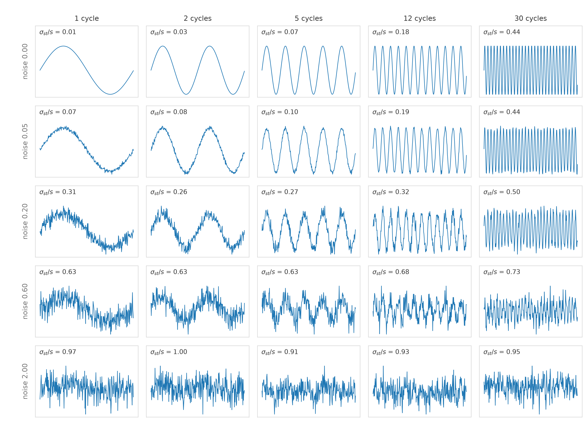

# Semiconductor Equipment Trace Non-Integral Summary Statistics
Rev. 17 | Created: 2026-07-29 | Updated: 2026-08-14 19:07 CDT

장비 trace 시계열을 wafer당 고정 길이 vector로 변환하는 특징 가운데, 적분 연산자를 쓰지 않는 non-integral 특징의 정의, 실패 모드, 차원 통제, 검증 규약을 정리한다.

Data는 [wafer, feature, trace] 의 dimension을 갖는다. 여기서 trace의 예로는 sensor 신호나 FDC data가 있다.

핵심 제약은 결과가 wide data, 즉 $p \gg n$ 이 되지 않아야 한다.

## 1. Non-Integral Statistics

단일 wafer trace를 $x(t)$, $t \in [0, T]$ 로 두고, $\bar{x}$ 를 그 산술평균으로 쓴다.

적분을 쓰지 않는 기본 특징으로, 해석성이 높고 계산 비용이 낮다. 특징은 잡는 축으로 묶이며, 축마다 core를 하나 두고 대체 가능한 특징이 있으면 option으로 함께 둔다. Option이 없는 축도 있다. Option은 core와 같은 축을 재므로 둘을 함께 넣으면 공선성이 생긴다. 축당 하나만 고르고, 어느 쪽을 고를지는 §5.1의 검사로 정한다.

Table 1. Non-integral features

| Feature | Axis | Captures | Role | Redundant with |
|---|---|---|---|---|
| `mean` | Location | Arithmetic center | Core | — |
| `median` | Location | Center robust to outliers | Option | `mean` |
| `std` | Dispersion | Spread over the whole trace | Core | — |
| `range` | Dispersion | Peak-to-peak amplitude | Option | `std` |
| `iqr` | Dispersion | Spread robust to outliers | Option | `std` |
| `slope` | Trend | First time moment | Core | — |
| `sigma_st` | Short-term variation | Step-to-step variation, SPC short-term sigma | Core | — |
| `max_delta` | Short-term variation | Largest single jump | Option | `sigma_st` |
| `slsr` | Roughness | Short-term over overall variation | Core | — |
| `zcr` | Roughness | Center-line crossing rate | Option | `slsr` |
| `peak_time_norm` | Timing | Relative time of the maximum | Core | — |
| `duration` | Length | Processing time | Core | — |

수식 정의는 [Appendix B](#appendix-b-feature-definitions) 에, 계산 절차는 [Appendix E](#appendix-e-implementation) 에 정리한다.

### 1.1 Short-Term Sigma and Roughness

`sigma_st` 는 MSSD를 2로 나눈 값의 제곱근이며, SPC의 I-MR chart가 쓰는 short-term sigma와 같은 양이다. `std` 가 전체 구간의 변동을 재는 데 반해 이쪽은 이웃 sample 사이의 변동만 재므로, 둘은 서로 다른 시간 scale을 본다.

두 양의 비 `slsr` 은 lag-1 autocorrelation $\rho_1$ 의 직접적인 추정량이다.

$$\frac{\sigma_{\text{st}}}{s} = \sqrt{1 - \hat{\rho}_1}$$

백색잡음이면 $\mathrm{MSSD} = 2s^2$ 이므로 비가 정확히 1이 된다. 임의로 문턱을 정할 필요 없이 이론값 1을 기준으로 읽으면 된다. 이 관계의 유도와 $\rho_1$ 의 정의는 [Appendix C](#appendix-c-lag-1-autocorrelation) 에, 파형별 실측값은 [Appendix D](#appendix-d-roughness) 에 있다.

- 비가 1보다 작으면 신호가 매끄럽다. 이웃 sample이 서로 닮아 있다.
- 비가 1이면 백색잡음이다.
- 비가 1보다 크면 sample 단위로 진동한다.

`slsr` 은 분자와 분모가 같은 단위라 gain drift와 chamber 간 scale 차이에 불변이다. 같은 축의 option인 `zcr` 은 중심선 교차를 세는 방식이라 진폭 outlier에 강건한 대신, ramp가 있는 trace에서는 중심선을 한 번만 지나므로 진동을 과소평가한다. 추세가 뚜렷한 trace에는 `slsr`, 진폭이 튀는 trace에는 `zcr` 이 맞다.

## 2. Failure Modes and Mitigations

### 2.1 Baseline Drift

Trace에 느린 offset $\delta$ 가 있으면 위치 특징인 `mean` 과 `median` 은 그만큼 통째로 이동한다. 반면 나머지 특징은 산포·차분·순위로 정의되어 offset에 불변이므로 drift의 영향을 받지 않는다. 위치 특징만 오염된다는 이 비대칭이 진단의 출발점이다.

- 초기 구간 중앙값을 pre-trace baseline으로 잡아 차감한 뒤 위치 특징을 계산한다.
- Chamber가 여러 대라면 chamber 내 중심화로 절대 offset을 제거한다.
- Drift 자체를 chamber 누적 가동 시간 등 별도 공변량으로 명시한다.

### 2.2 Timestamp and Missing Samples

`slope`, `sigma_st`, `max_delta` 는 sampling 간격에 직접 의존하므로 timestamp 품질에 민감하다.

- 명목 $\Delta t$ 대신 실제 timestamp 차분을 사용하여 sampling jitter를 흡수한다.
- 결측은 특징 계산 전에 선형보간한다. 보간하지 않으면 결측 위치의 큰 차분이 `sigma_st` 와 `max_delta` 를 부풀린다.
- trace 시작과 종료 경계의 transient 구간은 baseline 산출에서 제외한다.

`slsr` 과 `zcr` 도 sampling 주기에 의존한다. 매끄러운 신호에서는 $\Delta x \approx x' \Delta t$ 이므로 `slsr` 이 $\Delta t$ 에 비례하고, `zcr` 은 sample 쌍 단위의 비율이라 같은 물리적 진동이라도 주기를 촘촘히 하면 값이 낮아진다. 둘 다 진폭 단위로는 무차원이지만 시간 단위로는 아니므로, 주기가 다른 recipe나 chamber 사이에서는 직접 비교하지 않는다.

### 2.3 Unit Dependence

`mean`, `median`, `std`, `range`, `iqr`, `sigma_st`, `max_delta` 는 모두 trace의 물리 단위를 그대로 갖는다. 따라서 gain drift나 chamber 간 절대 offset에 취약하고, chamber 교차 검증에서 먼저 무너지는 쪽이 된다.

`slsr`, `zcr`, `peak_time_norm` 은 무차원이라 곱셈적 scale 변화에 불변이므로 이식성이 높다. 변동계수 $s/\bar{x}$ 처럼 비율로 만든 특징도 같은 성질을 갖는다. 다만 `slsr` 과 `zcr` 의 chamber 간 비교는 §2.2의 sampling 주기 조건을 만족할 때만 유효하다. 단위를 갖는 특징과 무차원 특징을 함께 두고, chamber 교차 검증에서 어느 쪽이 살아남는지로 오염 여부를 판정한다.

## 3. Dimensionality Control

### 3.1 Channel Pruning

다음에 해당하는 channel을 제거한다.

- 분산이 0에 가까운 상수 channel
- Setpoint 복제 channel
- 상호상관 $\lvert\rho\rvert \gt 0.98$ 인 중복 channel

Chamber가 여러 대라면 이 판정은 chamber별로 수행한다. 상수 channel은 `slsr` 의 분모를 0으로 만들므로 이 단계에서 반드시 걸러야 한다.

### 3.2 Taxonomy Group Pooling

평균과 산포는 가법적이지 않으므로, 그룹에 속한 channel의 특징을 그냥 더해도 물리량이 되지 않는다. 대신 다음과 같이 줄인다.

- 그룹 대표 channel 1개의 특징을 남긴다.
- 그룹 내 channel 간 비율이나 산포를 특징 1개로 요약한다.

### 3.3 Supervised Final Reduction

- Taxonomy를 group으로 하는 sparse group lasso는 물리적으로 해석 가능한 희소성을 준다. 개별 channel 전부를 lasso에 던지는 것보다 표본이 작을 때 선택 변동성이 훨씬 작다.
- PLS latent 변수를 쓴다.

표본이 작으면 이 단계 이후 규제 선형 model이나 PLS가 GBM보다 안정적이다.

## 4. Feature Selection

Table 1의 core 7개를 기본 세트로 삼는다. 일곱 축을 하나씩만 덮으므로 축 사이의 공선성이 구조적으로 없다.

Option은 core를 보태는 것이 아니라 **교체**하는 용도다. 축당 두 개를 함께 넣으면 §5.1의 검사에 걸린다. 교체 기준은 다음과 같다.

- 위치가 outlier에 흔들리면 `mean` 대신 `median` 을 쓴다.
- 산포가 outlier에 흔들리면 `std` 대신 `iqr` 을, 절대 진폭 자체가 규격 항목이면 `range` 를 쓴다.
- 단발 spike가 관심사면 `sigma_st` 대신 `max_delta` 를 쓴다. 전자는 spike 하나를 전체 구간에 평균해 버린다.
- 진폭이 크게 튀는 trace라면 `slsr` 대신 `zcr` 을 쓴다 (§1.1).

`duration` 은 trace 길이가 wafer마다 달라질 때만 정보를 가지므로, 길이가 고정된 recipe에서는 core에서 뺀다.

## 5. Validation Protocol

### 5.1 Redundancy Checks before Adding Features

Core와 option을 함께 넣었는지, 또는 core끼리 우연히 겹쳤는지를 다음으로 판정한다.

Table 2. Redundancy checks

| Check | Threshold | Action |
|---|---|---|
| corr(`median`, `mean`) | $\gt 0.98$ | 분포가 대칭, `median` 폐기 |
| corr(`iqr`, `std`) | $\gt 0.98$ | outlier 없음, `iqr` 폐기 |
| corr(`range`, `std`) | $\gt 0.95$ | `range` 폐기 |
| corr(`max_delta`, `sigma_st`) | $\gt 0.95$ | 단발 spike 없음, `max_delta` 폐기 |
| corr(`zcr`, `slsr`) | $\gt 0.95$ | 같은 거칠기를 잼, `zcr` 폐기 |
| corr(`sigma_st`, `std`) | $\gt 0.95$ | 단기와 전체 변동이 분리되지 않음, `sigma_st` 폐기 |
| var(`slsr`) (wafer 간) | $\approx 0$ | 거칠기가 일정, `slsr` 과 `zcr` 폐기 |
| var(`duration`) (wafer 간) | $\approx 0$ | 길이가 일정, 폐기 |

### 5.2 Performance Criteria

- Test $R^2$ 증분만 근거로 사용한다. Train $R^2$ 개선은 근거가 되지 않는다. 표본이 작으면 특징을 늘릴수록 train $R^2$ 는 거의 항상 올라간다.
- Nested time-series CV를 쓴다. Pruning 기준, scaler, 그룹 정의를 모두 train fold 내부에서만 산출한다.
- $R^2_{\max}$ 대비로 평가한다. 계측 반복성 $\sigma$ 로부터 잡음 천장을 계산하고, 그 대비 몇 %에 도달했는지로 판단한다. 천장의 80%를 넘으면 특징 추가를 멈추는 것이 합리적이다.
- Chamber 교차 검증을 한다. 한 chamber로 학습해 다른 chamber로 평가하며, 판정 기준은 §2.3과 같다.

### 5.3 Dimensionality Gate

최종 model 입력 특징 수 $p_{\text{final}}$ 이 $n/5$ 이하인지 확인한다.

## Appendix A. Terminology

- **Channel**: trace 하나가 기록되는 개별 측정 계열이다.
- **CV (Cross-Validation)**: 데이터를 여러 fold로 나눠 학습과 평가를 반복하는 model 검증 방법이다.
- **FDC (Fault Detection and Classification)**: 장비 신호로 공정 이상을 탐지하고 분류하는 체계다.
- **GBM (Gradient Boosting Machine)**: 얕은 결정 나무를 순차적으로 더해 가는 ensemble 학습 방법이다.
- **I-MR chart**: 개별값과 이동범위를 함께 보는 SPC 관리도다.
- **MSSD (Mean Square Successive Difference)**: 이웃 sample 차분의 제곱평균이다.
- **OLS (Ordinary Least Squares)**: 잔차 제곱합을 최소화하는 선형 회귀 적합 방법이다.
- **PLS (Partial Least Squares)**: 예측변수와 응답변수의 공분산을 최대화하는 latent 변수 회귀 방법이다.
- **SLSR (Short-term to Long-term Sigma Ratio)**: 단기 sigma를 전체 구간 sigma로 나눈 무차원 비다.
- **Sparse group lasso**: 그룹 단위와 개별 계수 단위의 희소성을 동시에 유도하는 규제 회귀 방법이다.
- **SPC (Statistical Process Control)**: 공정 변동을 통계적 관리한계로 감시하는 체계다.
- **Summary statistics**: trace 전체를 소수의 스칼라로 요약한 값이다.
- **Taxonomy**: trace를 가스, 전력, 압력, 온도 등 물리 계통으로 묶는 분류 체계다.
- **Trace**: 장비가 주기적으로 송출하는 시계열 기록이다.
- **Wide data**: 표본 수 $n$ 보다 변수 수 $p$ 가 많은 ($p \gt n$) 데이터를 가리킨다.
- **ZCR (Zero-Crossing Rate)**: 신호가 기준선을 가로지르는 빈도다.

## Appendix B. Feature Definitions

Trace를 $x_1, \dots, x_N$ 으로, timestamp를 $t_1, \dots, t_N$ 으로 두고 $T = t_N - t_1$ 로 쓴다. 차분은 $\Delta x_i = x_{i+1} - x_i$ 이며, $i$ 는 sample index, $N$ 은 sample 수다.

Variable 열은 그 행에서 새로 쓰는 기호만 밝힌다. 표시가 없는 행은 위의 공통 표기만 쓴다.

Table 3. Feature definitions

| Feature | Definition | Variable |
|---|---|---|
| `mean` | $\bar{x} = \dfrac{1}{N}\sum_{i=1}^{N} x_i$ | $\bar{x}$ 는 산술평균이며, 이후 행에서 그대로 쓴다 |
| `median` | 정렬한 $x$ 의 중앙값 | — |
| `std` | $s = \sqrt{\dfrac{1}{N-1}\sum_{i=1}^{N}(x_i - \bar{x})^2}$ | $s$ 는 표본표준편차이며, 이후 행에서 그대로 쓴다. 분모 $N-1$ 은 불편추정을 위한 자유도다 |
| `range` | $\max_i x_i - \min_i x_i$ | — |
| `iqr` | $Q_3 - Q_1$ | $Q_1$ 과 $Q_3$ 은 $x$ 의 제1·제3 사분위수다 |
| `slope` | $\dfrac{\sum_i (t_i - \bar{t})(x_i - \bar{x})}{\sum_i (t_i - \bar{t})^2}$ | $\bar{t}$ 는 timestamp의 산술평균이다 |
| `sigma_st` | $\sigma_{\text{st}} = \sqrt{\mathrm{MSSD}/2}$ | $\mathrm{MSSD} = \dfrac{1}{N-1}\sum_{i=1}^{N-1}(\Delta x_i)^2$ 는 이웃 차분 제곱의 평균이다. 2로 나누는 근거는 §1.1에 있다 |
| `max_delta` | $\max_i \lvert \Delta x_i \rvert$ | — |
| `slsr` | $\sigma_{\text{st}} / s$ | 두 값 모두 위 행에서 정의한 것이다 |
| `zcr` | $\dfrac{1}{N-1}\sum_{i=1}^{N-1} \mathbb{1}\big[\mathrm{sign}(x_i - \bar{x}) \neq \mathrm{sign}(x_{i+1} - \bar{x})\big]$ | $\mathbb{1}[\cdot]$ 은 조건이 참이면 1, 아니면 0인 지시함수다. $\mathrm{sign}$ 의 기준선은 $\bar{x}$ 다 |
| `peak_time_norm` | $(t_{i^*} - t_1) / T$ | $i^* = \arg\max_i x_i$ 는 최댓값이 나오는 sample index다 |
| `duration` | $T$ | — |

## Appendix C. Lag-1 Autocorrelation

$\rho_1$ 은 신호를 sample 하나만큼 밀어 자기 자신과 겹쳤을 때의 상관계수다. 이웃한 두 sample이 서로 얼마나 닮았는지를 재며, 값의 범위는 $[-1, 1]$ 이다.

표본 추정량은 다음과 같다.

$$\hat{\rho}_1 = \frac{\sum_{i=1}^{N-1}(x_i - \bar{x})(x_{i+1} - \bar{x})}{\sum_{i=1}^{N}(x_i - \bar{x})^2}$$

분자는 한 칸 어긋난 두 계열의 공분산이고, 분모는 분산이다. $\hat{\rho}_1 = 1$ 이면 이웃 sample이 완전히 같은 방향으로 움직이고, $0$ 이면 서로 무관하며, $-1$ 이면 매 sample마다 부호가 뒤집힌다.

#### Relation to SLSR

차분의 제곱을 전개하면 $\mathrm{MSSD}$ 가 $\rho_1$ 으로 표현된다. $x$ 를 평균 0, 분산 $\sigma^2$ 인 정상 신호로 두면

$$\mathbb{E}\big[(x_{i+1} - x_i)^2\big] = \mathbb{E}[x_{i+1}^2] - 2\,\mathbb{E}[x_i x_{i+1}] + \mathbb{E}[x_i^2] = 2\sigma^2 - 2\rho_1 \sigma^2 = 2\sigma^2 (1 - \rho_1)$$

이므로 $\mathrm{MSSD} \approx 2 s^2 (1 - \hat{\rho}_1)$ 이고, 여기에 §1.1의 정의를 넣으면 다음을 얻는다.

$$\sigma_{\text{st}} = \sqrt{\frac{\mathrm{MSSD}}{2}} = s\sqrt{1 - \hat{\rho}_1} \quad\Longrightarrow\quad \frac{\sigma_{\text{st}}}{s} = \sqrt{1 - \hat{\rho}_1}, \qquad \hat{\rho}_1 = 1 - \left(\frac{\sigma_{\text{st}}}{s}\right)^2$$

즉 두 양은 일대일 대응이며, `slsr` 을 재는 것은 $\rho_1$ 을 재는 것과 같다.

Table 4. Correspondence between the lag-1 autocorrelation and SLSR

| $\hat{\rho}_1$ | $\sigma_{\text{st}} / s$ | Waveform |
|---|---|---|
| 1.00 | 0.00 | 이웃 sample이 동일, 계단 없는 매끄러운 신호 |
| 0.90 | 0.32 | 매끄러운 추세에 약한 잡음 |
| 0.50 | 0.71 | 추세와 잡음이 비슷한 크기 |
| 0.00 | 1.00 | 백색잡음 |
| -0.50 | 1.22 | sample 단위 진동이 지배 |
| -1.00 | 1.41 | 매 sample마다 부호 반전, Nyquist 진동 |

비의 최댓값은 $\sqrt{2} \approx 1.41$ 이다.

이 유도는 정상성을 전제한다. 추세가 뚜렷한 trace에서는 $s$ 가 잡음이 아니라 추세의 진폭을 재므로 $\hat{\rho}_1$ 이 1 쪽으로 부풀고, 비는 그만큼 작게 나온다. 이때의 비는 "잡음 대비 추세의 우세" 를 읽는 값으로 해석해야 한다.

`slsr` 을 제곱해 2를 곱하면 $\mathrm{VN} = 2\,\text{slsr}^2 = \mathrm{MSSD}/s^2$ 로 von Neumann ratio가 된다. 이 통계량은 무작위성 검정의 임계값표가 정리되어 있으므로, 관측된 거칠기가 백색잡음과 유의하게 다른지를 눈대중이 아니라 검정으로 판정할 수 있다.

## Appendix D. Roughness

`slsr` 이 파형에 따라 실제로 어떤 값을 갖는지 보이기 위해, 진폭 1인 sine에 백색잡음을 더해 가며 계산했다. Trace 길이는 300 sample이고, 열은 trace 구간에 담기는 sine의 주기 수, 행은 진폭 대비 잡음 표준편차다.



Fig 1. Sine 주파수와 잡음 수준에 따른 $\sigma_{\text{st}}/s$. 열은 왼쪽부터 1, 2, 5, 12, 30 주기이고, 행은 위에서부터 잡음 표준편차 0, 0.05, 0.20, 0.60, 2.00이다. 각 panel의 값이 그 파형에서 계산한 비다.

읽어야 할 것은 세 가지다.

- **첫 행 (잡음 없음)** 에서 비가 0.01에서 0.44까지 오른다. 다섯 파형의 진폭은 모두 1로 같으므로, 이 비가 재는 것은 진폭이 아니라 주파수 구성이다. 순수 sine에서는 $\hat{\rho}_1 = \cos(2\pi f / N)$ 이므로 비가 $\sqrt{1 - \cos(2\pi f / N)}$ 이 되며, $f = 30$, $N = 300$ 을 넣으면 0.44로 실측값과 일치한다.
- **마지막 행 (잡음 지배)** 에서는 주파수와 무관하게 비가 0.91–1.00에 모인다. 백색잡음의 이론값 1이 실제로 관측되며, 이것이 기준값을 임의로 정하지 않아도 되는 근거다.
- **행을 따라 내려가면** 같은 주파수에서 비가 단조 증가한다. 1 주기 열은 0.01 → 0.07 → 0.31 → 0.63 → 0.97로, 잡음이 섞이는 정도를 그대로 따라간다.

30 주기 열도 0.44에 그친다. 비가 1을 넘으려면 sample 단위로 부호가 뒤집혀야 하는데, 300 sample에 30 주기면 주기당 10 sample이라 아직 매끄러운 축에 속하기 때문이다. 실제 trace에서 1을 넘는 값이 나오면 공정 진동이 아니라 계측계의 sample 단위 잡음을 의심하는 것이 맞다.

## Appendix E. Implementation

```python
# Python
import numpy as np

def non_integral_summary(x, t):
    """
    x, t : (N,) single-wafer trace. t holds real timestamps.
    """
    T        = t[-1] - t[0]
    q1, q3   = np.percentile(x, [25, 75])
    xc       = x - x.mean()                          # centered, for zero crossings
    dx       = np.diff(x)
    std      = x.std(ddof=1)
    mssd     = np.mean(dx ** 2)                      # mean square successive difference
    sigma_st = np.sqrt(mssd / 2)                     # SPC short-term sigma

    if std == 0:
        raise ValueError("constant trace: prune the channel before summarizing")

    return {
        'mean':           x.mean(),
        'median':         np.median(x),
        'std':            std,
        'range':          x.max() - x.min(),
        'iqr':            q3 - q1,
        'slope':          np.polyfit(t - t[0], x, 1)[0],   # OLS on the raw signal
        'sigma_st':       sigma_st,
        'max_delta':      np.max(np.abs(dx)),
        'slsr':    sigma_st / std,
        'zcr':            np.mean(np.signbit(xc[:-1]) != np.signbit(xc[1:])),
        'peak_time_norm': (t[np.argmax(x)] - t[0]) / T,
        'duration':       T,
    }
```
