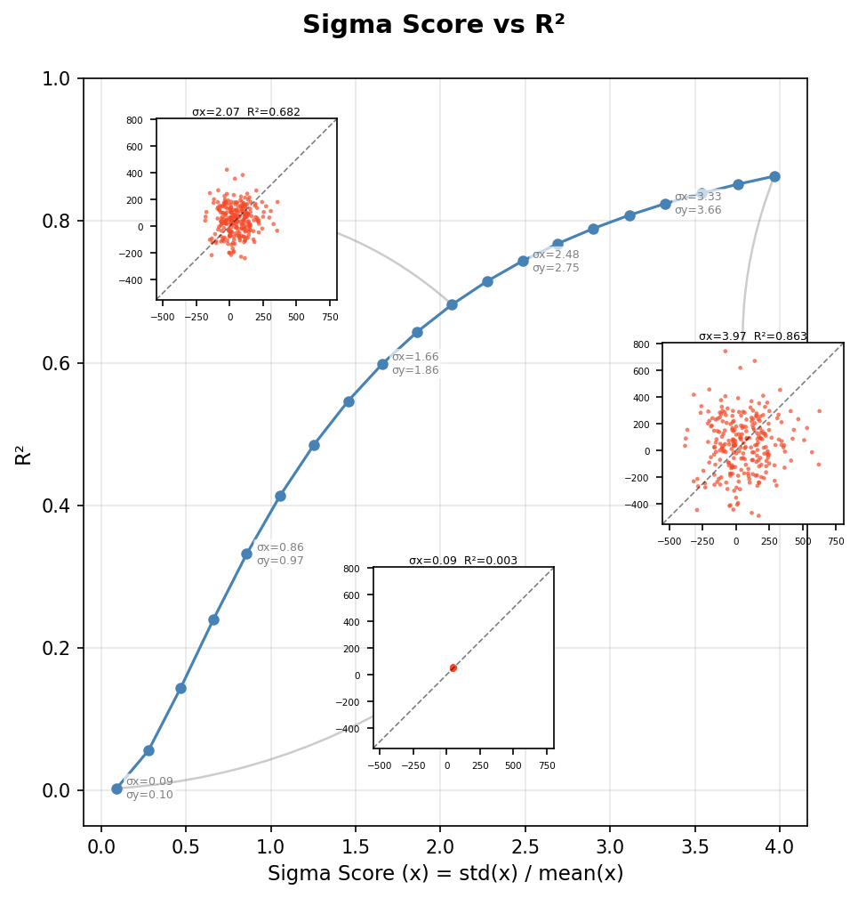

# The Impact of Variance Components on the Coefficient of Determination ($R^2$) (Korean)
Rev. 2 | Created: 2026-09-04 | Updated: 2026-09-04 23:58 CDT

> $R^2$ 가 잔차의 분산과 예측변수의 분산을 따라 움직이는 이유, 그리고 그것을 정확도의 절대 척도가
> 아니라 비율로 읽는 법에 대한 기록.

## 1. Executive Summary

결정계수 $R^2$ 는 선형회귀 model 의 적합도를 재는 데 가장 널리 쓰이는 지표 가운데 하나이다. 그러나
그 해석에는 오해가 잦은데, 특히 이 값이 model 의 옳고 그름만이 아니라 자료의 분포를 따라서도
흔들린다는 점이 그렇다. 이 문서는 분산의 변화가 — 구체적으로 잔차 분산 ($\sigma^2_{\epsilon}$) 과
예측변수 분산 ($\sigma^2_{x}$) 이 — 왜 $R^2$ 에 깊은 영향을 미치는지를 수학과 개념 양쪽에서 살핀다.
분산의 비를 뜯어보면 $R^2$ 가 model 정확도의 절대 척도가 아니라 상대적인 힘의 척도임이 드러난다.

## 2. Mathematical Definition Of $R^2$

분산이 왜 $R^2$ 의 거동을 좌우하는지 이해하려면 먼저 그것을 분산분석 (ANOVA) 의 눈으로 정의해야
한다. 표준 선형 model $Y = \beta_0 + \beta_1 X + \epsilon$ 에서 종속변수 $Y$ 의 총변동은 서로 다른
두 성분으로 나뉜다.

- 설명된 변동 `SS_reg` 는 $X$ 와 $Y$ 의 관계가 감당하는 변동이다.
- 설명되지 않은 변동 `SS_res` 는 잔차, 곧 잡음 $\epsilon$ 에서 오는 변동이다.

기본이 되는 항등식은 아래와 같다.

$$SS_{tot} = SS_{reg} + SS_{res} \hspace{19em} (1)$$

여기서 $R^2$ 는 $Y$ 의 총분산 가운데 $X$ 가 설명하는 비율로 정의된다.

$$R^2 = \frac{SS_{reg}}{SS_{tot}} = 1 - \frac{SS_{res}}{SS_{tot}} \hspace{19em} (2)$$

두 제곱합은 잔차제곱합과 총제곱합이다.

$$SS_{res} = \sum (y_i - \hat{y}_i)^2, \qquad SS_{tot} = \sum (y_i - \bar{y})^2 \hspace{19em} (3)$$

## 3. The Impact Of Increased Error Variance

첫 번째 경우는 참인 관계 $\beta_1$ 과 $X$ 의 범위가 그대로일 때 잔차의 분산
($\sigma^2_{\epsilon}$) 이 커지는 것이다.

### 3.1. The Mathematical Mechanism

자료의 잡음이 커지면 각 관측값 $y_i$ 가 회귀선 $\hat{y}_i$ 에서 더 멀어진다. 이것이 `SS_res` 항을
곧바로 부풀린다. 식 (2) 에서 그 분수의 분자가 커지면 분수 `SS_res / SS_tot` 전체가 커진다. 그 커진
값을 1 에서 빼므로 결과인 $R^2$ 는 작아진다.

### 3.2. Conceptual Interpretation

정보이론과 machine learning 의 맥락에서 $X$ 와 $Y$ 의 관계는 신호이고 잔차는 잡음이다. 오차 분산이
커지면 잡음이 신호를 덮는다. 바탕의 model 이 옳더라도, 곧 참인 $\beta_1$ 을 찾아냈더라도 예측력은
묽어진다.

> 잡음 또는 잔차 분산이 커지면 model 의 설명력이 줄고 $R^2$ 가 낮아진다.

이것은 $R^2$ 가 낮다고 해서 반드시 model 이 틀렸다는 뜻은 아님을 보여 준다. 환경 자체가 본래
시끄러워 종속변수를 높은 정밀도로 예측하기 어려운 것일 수도 있다.

## 4. The Impact Of Increased Predictor Variance

독립변수 $X$ 의 분산이 달라질 때는 더 뜻밖의 일이 벌어진다. $X$ 값의 범위를 넓혀 $\sigma^2_{x}$ 를
키우면, 오차 분산 $\sigma^2_{\epsilon}$ 이 정확히 그대로여도 $R^2$ 는 대개 커진다.

### 4.1. The Expansion Of The Denominator

단순 선형회귀에서 설명된 분산은 아래와 같이 적힌다.

$$SS_{reg} = \beta_1^2 \cdot \sum (x_i - \bar{x})^2 \hspace{19em} (4)$$

$X$ 의 분산이 커지면 $\sum (x_i - \bar{x})^2$ 가 커진다. 이것이 $SS_{reg}$ 를 키운다.
$SS_{tot} = SS_{reg} + SS_{res}$ 이고 $SS_{res}$ 는 그대로라고 두었으므로, 분모 $SS_{tot}$ 가
커지는 것은 주로 설명된 쪽이 커지기 때문이다.

분수 $\frac{SS_{res}}{SS_{tot}}$ 에서 분자는 그대로인데 분모가 커진다. 그러면 분수가 작아지고, 더
작은 수를 1 에서 빼므로 $R^2$ 가 높아진다.

### 4.2. The Strength Of The Trend

$X$ 를 더 넓은 범위에서 재면 전체 추세, 곧 기울기가 국소적인 흔들림에 견주어 더 지배적이 된다.
$Y$ 의 총산포가 이제 무작위 오차보다 $X$ 의 변화에 더 이끌리므로, model 이 그 산포의 더 큰 몫을
붙잡는다.

> 독립변수의 범위가 넓거나 분산이 크면 model 이 전체 추세의 더 큰 몫을 붙잡게 되어 $R^2$ 가 흔히
> 부풀려진다.

## 5. Summary Of Variance Effects On $R^2$

아래 표는 분산 성분과 그로부터 나오는 결정계수의 관계를 정리한 것이다.

Table 1. Variance components and their effect on $R^2$

| Scenario | Effect on $R^2$ | Statistical reason |
|----------|-----------------|--------------------|
| Higher residual variance ($\sigma^2_{\epsilon}$) | Decreases | 자료에서 설명되지 않는 몫 $SS_{res}$ 가 전체에서 차지하는 비율이 커진다. |
| Higher predictor variance ($\sigma^2_{x}$) | Increases | 설명되는 몫 $SS_{reg}$ 가 커져 잡음이 상대적으로 덜 중요해진다. |
| Lower total variance ($SS_{tot}$) | Decreases | $Y$ 의 총산포가 작으면 사소한 오차에도 $R^2$ 가 낮아진다. |

## 6. Practical Implications For Machine Learning Models

Machine learning 에서 $R^2$ 하나에만 기대는 것은 이런 분산 의존성 때문에 사람을 오도한다.

- Model 비교가 간단하지 않다. 좁은 자료에서 학습한 model 의 $R^2$ 는 다양하고 넓은 자료에서 학습한
  model 의 것과 곧바로 견주기 어렵다. 뒤의 것은 오로지 $X$ 의 분산 때문에 $R^2$ 가 높을 가능성이
  크기 때문이다.
- $X$ 의 분산이 크면 자료의 특정 구간에서의 나쁜 성능이 가려지기도 하며, 이는 수 하나로는 드러나지
  않는 overfitting 의 통로이다.
- Feature selection 은 본질적으로 설명된 분산 $SS_{reg}$ 를 키워 잔차의 상대적 비중을 떨어뜨리려는
  시도이다.

## 7. Conclusion

분산의 변화가 $R^2$ 에 영향을 주는 이유는 $R^2$ 가 비율이기 때문이다. 평균 제곱 오차나 평균 절대
오차 같은 절대 오차 척도는 오차 자체의 크기를 보고하므로 자료의 산포를 옮겨도 그대로 있다. $R^2$ 는
오차를 총산포에 견주어 보고하므로 그 비의 어느 쪽이 움직이든 함께 움직이며, Table 1 의 모든 경우가
바로 그것을 적어 놓은 것이다.

이 역학을 이해하면 잡음이 큰 환경에서 $R^2$ 가 낮은 model 을 내치거나, 독립변수의 범위를 인위적으로
넓혀 얻은 높은 $R^2$ 를 지나치게 믿는 흔한 함정을 피할 수 있다.

## 8. Variation With Sample Distributions Along The 1-To-1 Line

아래 chart 는 1 대 1 선 위에 놓인 표본에 대해 sigma score, 곧 변동계수 `std / mean` 을 0.1 에서
4.0 까지 훑으며 각 표본이 내는 $R^2$ 를 기록한 것이다. 대수식이 아니라 자료 쪽에서 같은 의존성을
보여 준다. 바탕의 관계는 전혀 변하지 않는데도 값이 표본의 산포를 따라 움직인다.

Fig 1. $R^2$ against the sigma score for samples placed along the 1-to-1 line

그림은 이 문서와 같은 folder 에 있는 `sigma_r2.py` 가 만든다.

---

## Appendix A. Terminology

- **Coefficient of determination**: 결정계수 $R^2$. 독립변수로부터 예측되는 종속변수 분산의 비율.
- **Explanatory power**: 설명력. 자료에 깔린 pattern 을 model 이 나타낼 수 있는 정도.
- **Mean absolute error**: 평균 절대 오차. 관측값과 예측값의 절대 차이의 평균이며, 관측값의 단위를
  가진다.
- **Mean squared error**: 평균 제곱 오차. 관측값과 예측값의 차이를 제곱한 것의 평균.
- **Residual variance**: 잔차 분산. 관측값과 예측값의 차이가 가지는 분산.
- **Signal-to-noise ratio**: 신호 대 잡음비. 원하는 신호의 크기를 배경 잡음의 크기에 견주는 척도.
