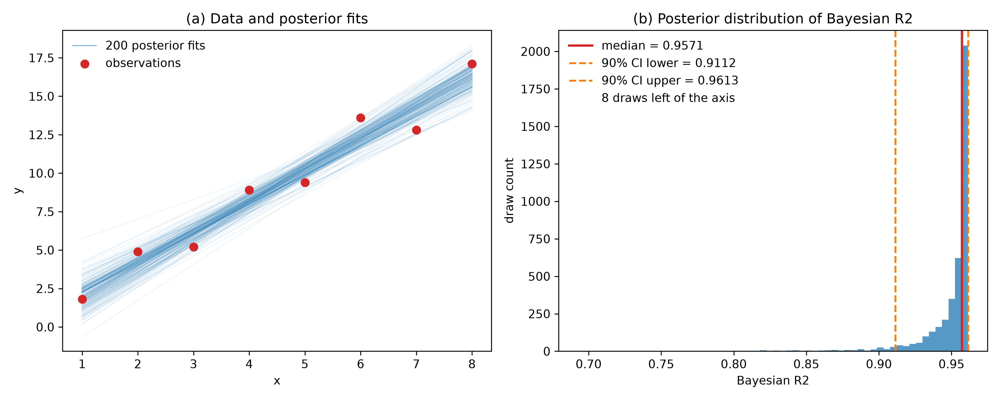

# Bayesian R² — Obtaining R² as a Distribution Instead of a Point (Korean)
Rev. 0 | Created: 2026-09-04 | Updated: 2026-09-04 14:55 CDT

> Posterior draw 마다 R² 를 하나씩 계산하여 R² 를 분포로 얻는 방법에 대한 기록이며, 정의, 계산,
> 해석, 적용 범위의 차례로 정리한다.

## 1. Motivation

표준 R² 는 결정계수 `1 − SS_res / SS_tot` 이며, 여기서 `SS_res` 는 잔차제곱합이고 `SS_tot` 는
관측값이 자기 평균에서 벗어난 정도의 제곱합이다. 예측값 한 벌에서 계산하므로 수 하나를 돌려준다.
어떤 적합이 `R² = 0.87` 이라 보고할 때, 그 수만으로는 표본이 조금만 달라져도 0.60 으로 무너질지
0.85 근처에서 단단히 버틸지 알 수 없다. 설명력의 크기와 그 크기에 대한 확신은 서로 다른 두 가지
정보인데, 표준 R² 는 앞의 것만 싣는다.

Bayesian R² 는 model 의 예측 불확실성을 R² 자체로 전파하여, R² 가 점이 아니라 분포로 나오게 한다.
결과가 `0.87 [0.81, 0.91]` 의 꼴을 띠는 이유가 여기에 있다.

**Table 1. Standard R² vs Bayesian R²**

| Aspect | Standard R² | Bayesian R² |
|---|---|---|
| Output | 스칼라 하나 | S 개 draw 에 대한 분포 |
| Uncertainty | 없음 | 구간으로 표현됨 |
| Range | 음수가 될 수 있고 1 을 넘지 않음 | 언제나 [0, 1] 안 |
| Input required | 예측값 한 벌 | Posterior draw S 벌 |
| Failure mode | 불안정성이 보이지 않음 | Draw 가 없으면 지표 자체를 계산할 수 없음 |

## 2. Core Idea

Posterior 분포에서 뽑은 draw s 마다 R² 를 하나씩 계산한다. Draw 가 S 개면 R² 값도 S 개이고, 그
모음이 R² 의 posterior 분포이다. Model parameter 가 불확실하면 예측값이 draw 마다 달라지고, 예측값이
달라지면 model 이 설명하는 변동의 양도 달라진다. Bayesian R² 는 그 움직임을 지우지 않고 보고한다.

## 3. Definition

### 3.1. Divergence Problem of the Standard Form

표준 정의 `R² = 1 − SS_res / SS_tot` 를 개별 posterior draw 에 적용하면 [0, 1] 밖의 값이 나온다.
최소제곱 적합에서는 잔차제곱합이 총제곱합을 넘을 수 없지만, 개별 posterior draw 는 그 자료의
최소제곱해가 아니다. Prior 나 계층 model 의 shrinkage 가 예측값을 자료에서 밀어내면 한 draw 의
잔차제곱합이 총제곱합을 넘을 수 있고, 그 draw 의 R² 는 음수가 된다. Draw 마다 부호가 뒤집히는 값의
모음에서는 해석 가능한 중앙값도 해석 가능한 구간도 나오지 않는다. 구체적인 사례는
[Appendix B. Worked Example](#appendix-b-worked-example) 에 있다.

### 3.2. Gelman Formulation

Gelman et al. (2019) 이 제안한 해법은 분모를 음이 아닌 두 양의 합으로 바꾸는 것이다. 뺄셈을 없애면
값이 발산할 수 있는 자리가 사라진다.

```text
             Var_fit^(s)                    explained variation
R2^(s) = ─────────────────────────  =  ────────────────────────────────────────
         Var_fit^(s) + Var_res^(s)      explained variation + residual variation
```

- `Var_fit` — draw s 의 예측값 `y_hat_i^(s)` 를 자료점 i 에 걸쳐 잰 분산이며, model 이 설명하는 변동.
- `Var_res` — draw s 가 설명하지 못하고 남긴 변동.

두 항 모두 분산이므로 음이 아니고, 분모가 그 합이므로 비는 구조적으로 [0, 1] 에 갇힌다. 분자가
사라지면 값은 0 이고, `Var_res` 가 0 에 가까워지면 1 에 다가간다. 표준 꼴과 달리 어떤 posterior
draw 도 값을 정의 밖으로 밀어낼 수 없다.

여기서 `Var` 는 자료점 i = 1 ... n 에 걸쳐 잰 표본분산을 뜻한다.

$$\mathrm{Var}(z) = \frac{1}{n-1}\sum_{i=1}^{n}\left(z_i - \bar{z}\right)^2$$

### 3.3. Choice of Residual Variance

`Var_res` 를 정의하는 방법은 둘이고, 어느 쪽을 고르는지가 R² 의 뜻을 바꾼다.

**Table 2. Two choices of residual variance**

| Variant | Definition | Meaning | Note |
|---|---|---|---|
| Empirical | `Var(y_i − y_hat_i^(s))` | 실제로 남은 잔차의 분산 | 관측값 y 가 필요하고 어느 model 계열에서나 쓸 수 있음 |
| Model-based | `(sigma^(s))^2` | Model 이 스스로 주장하는 잡음 분산 | 정규 likelihood 와 함께 쓰며 y 없이 계산됨 |

Model 이 잘 맞으면 두 값은 일치하고, 둘 사이의 간격 자체가 진단이 된다. Model-based 값이 눈에 띄게
작다면 model 이 자기 잡음을 과소평가한다는 뜻이고, 그러면 model-based R² 가 empirical 쪽보다 높게
읽힌다. 한 문서 안에서 두 변형을 섞지 않아야 하고, 어느 쪽을 골랐는지 밝혀야 한다.

## 4. Computation

### 4.1. Procedure

```text
1. Draw S posterior samples (MCMC, ensemble members, or dropout passes)
2. For each sample s:
     Var_fit  = variance of the predicted values over data points
     Var_res  = variance of the residuals, or the model noise variance
     R2^(s)   = Var_fit / (Var_fit + Var_res)
3. Collect {R2^(1) ... R2^(S)} as the posterior distribution of R2
     median   -> point estimate
     quantiles-> credible interval
```

입력은 행이 posterior draw 이고 열이 자료점인 `(S, n)` 모양의 행렬 하나이다. 분산은 열 방향, 곧
자료점에 걸쳐 계산하며 draw 에 걸쳐 계산하지 않는다. 다른 축을 잡으면 한 점에 대한 예측이 draw 마다
얼마나 움직이는지를 재게 되는데, 그것은 전혀 다른 양이며 R² 가 아니다.

### 4.2. Implementation

```python
# Python
import numpy as np


def bayesian_r2_empirical(y_pred_draws: np.ndarray = None, y_true: np.ndarray = None) -> np.ndarray:
    """Bayesian R2 using the variance of the residuals actually left over.

    Args:
        y_pred_draws: posterior draws of the predictive mean, shape (S, n).
        y_true: observations, shape (n,).

    Returns:
        R2 draws of shape (S,), every element inside [0, 1].
    """
    var_fit = y_pred_draws.var(axis=1, ddof=1)           # variance over data points
    var_res = (y_true[None, :] - y_pred_draws).var(axis=1, ddof=1)
    return var_fit / (var_fit + var_res)


def bayesian_r2_model_based(y_pred_draws: np.ndarray = None, sigma_draws: np.ndarray = None) -> np.ndarray:
    """Bayesian R2 using the noise variance the model claims for itself."""
    var_fit = y_pred_draws.var(axis=1, ddof=1)
    return var_fit / (var_fit + sigma_draws ** 2)


# posterior_mean_draws: shape (S, n), y_observed: shape (n,)
r2_draws = bayesian_r2_empirical(y_pred_draws=posterior_mean_draws, y_true=y_observed)
point = np.median(r2_draws)
lower, upper = np.quantile(r2_draws, [0.05, 0.95])       # 90% credible interval
```

산술은 분산 둘과 나눗셈 하나뿐이고, 이 방법의 비용은 전적으로 posterior draw 를 얻는 데 있다. 3.3 의
두 변형은 switch 를 둔 함수 하나가 아니라 별개의 함수 둘이므로, 부르는 쪽이 한 변형의 입력을 조용히
넣고 다른 변형의 결과를 받는 일이 생기지 않는다.

## 5. Interpretation

### 5.1. Point Estimate and Credible Interval

R² 의 posterior 분포는 대칭이 아니다. R² 가 1 에 가까울수록 위쪽이 1 이라는 천장에 막히고, 그만큼
왼쪽에 긴 꼬리가 남는다. 그런 분포에서는 평균이 꼬리 쪽으로 끌려가므로 중앙값을 점추정값으로 삼고
분위수로 구간을 정한다.

그 구간의 폭이 설명력에 대한 확신이다. `0.87 [0.85, 0.89]` 와 `0.87 [0.61, 0.95]` 는 점추정값이
같지만 전혀 다른 결과이며, 뒤의 것은 R² 를 근거로 model 을 받아들이기에는 자료가 너무 얇다는 뜻이다.

이 구간은 confidence interval 이 아니라 credible interval 이다. "R² 가 90% 의 확률로 이 구간에
있다" 고 그대로 읽는 것이 credible interval 을 구별짓는 성질이며, 그 정의는
[Appendix A. Terminology](#appendix-a-terminology) 에 있다.

### 5.2. Uncertainty Decomposition

결과 하나에는 갈라 볼 수 있는 두 종류의 불확실성이 실린다.

- R² 분포의 폭 — parameter 를 아직 좁히지 못한 데서 오는 불확실성이며, 자료가 늘면 줄어든다.
- `Var_res` 의 크기 — 자료에 본래 있는 잡음이며, 자료가 늘어도 줄지 않는다.

따라서 구간이 넓다면 표본을 더 모아야 하고, 낮은 R² 둘레의 구간이 좁다면 다른 입력 변수나 다른
model 구조가 필요하다. 표준 R² 는 이 둘을 갈라내지 못하고 두 상황 모두에서 같은 수를 돌려준다.

## 6. Tools

**Table 3. Available implementations**

| Environment | Interface | Note |
|---|---|---|
| R | `bayes_R2(fit)` — rstanarm, brms | 논문 저자들이 유지하며 기준 구현으로 삼음 |
| R | `loo_R2(fit)` — rstanarm, brms | Out-of-sample 보정을 지닌 변형 |
| Python | `az.r2_score()` — ArviZ | 예측 표본과 관측값을 받아 요약을 돌려줌 |
| Any | Custom implementation | 분산 둘과 나눗셈이므로 옮기는 데 품이 거의 들지 않음 |

직접 구현한 것은 먼저 같은 자료에서 기준 구현과 맞추어 보아야 한다. 어긋난다면 대개 3.3 에서 고른
변형이나 4.1 이 기술한 축 방향으로 거슬러 올라간다.

## 7. Prerequisites

발목을 잡는 제약은 정의가 아니라 적용 범위에 있다. Bayesian R² 에는 진짜 posterior draw 가 필요하다.

### 7.1. Applicable Models

**Table 4. Model applicability**

| Model type | Applicable | Reason |
|---|---|---|
| Bayesian models such as Stan, PyMC, brms | Yes | MCMC 가 posterior draw 를 바로 공급함 |
| Deep ensemble | Yes | 구성원 하나가 draw 하나의 역할을 함 |
| MC dropout | Yes | Forward pass 를 되풀이해 draw 를 만듦 |
| Bootstrap ensemble | Yes | 재표본마다 다시 적합하여 draw 를 만듦 |
| Single Gaussian head emitting one mu and one sigma | No | Draw 가 없으면 분포를 만들 수 없음 |
| Point-estimate models such as a plain GBM or a single network | No | 예측값이 한 벌뿐임 |

Deep ensemble 과 MC dropout 은 엄밀한 뜻의 posterior draw 를 주지는 않지만 예측 분포에서 뽑은 표본
구실을 하므로 같은 계산이 성립한다. 다만 구성원이 다섯 정도로 적으면 분위수가 불안정하므로 구간을
좁게 읽어서는 안 된다.

### 7.2. Inapplicable Models

`mu` 하나와 `sigma` 하나를 내놓는 model 은 예측 분포는 가졌지만 posterior draw 가 없다. 그 `sigma`
는 aleatoric uncertainty 를 나타낼 뿐이고, R² 를 움직이게 할 parameter 불확실성이 없으므로 R² 는
어떻게 해도 한 값에 고정된다. 그런 경우에는 draw 를 요구하지 않는 지표, 곧 8. Comparison 에서 다루는
CRPS Skill Score 같은 것이 필요하다.

## 8. Comparison

**Table 5. Bayesian R² vs CRPS Skill Score**

| Aspect | Bayesian R² | CRPS Skill Score |
|---|---|---|
| Output | 점추정값과 구간 | 점수 하나 |
| Interval | 있음 | 없음 |
| Sample requirement | Posterior draw S 개 | 예측 분포만 |
| Question answered | 설명력이 얼마나 크고 얼마나 확실한가 | 예측 분포가 얼마나 잘 맞았는가 |
| Baseline | 자료의 총변동 | 명시적으로 지정한 기준 model |

두 지표는 경쟁 관계가 아니라 적용 범위가 다르다. Posterior draw 를 얻을 수 있는 곳에서는 구간까지
주는 Bayesian R² 가 더 많은 정보를 싣고, 얻을 수 없는 곳에는 CRPS Skill Score 가 남는다.

## 9. Pitfalls

**Table 6. Common mistakes**

| Mistake | Consequence | Fix |
|---|---|---|
| Feeding posterior predictive samples into `Var_fit` | 잡음이 분자로 들어가 R² 를 부풀림 | 예측 평균의 posterior draw 를 씀 |
| Taking the variance along the draw axis | 결과가 R² 가 아닌 다른 양이 됨 | 자료점 축으로 계산함 |
| Using the mean as the point estimate | 왜도가 값을 아래로 끌어내림 | 중앙값을 씀 |
| Reporting a training-data value as generalization performance | 값이 낙관적으로 치우침 | Out-of-sample 자료나 loo 변형을 씀 |
| Reporting a narrow interval computed from few draws | 구간 자체가 불안정함 | Draw 수를 늘리고 수렴을 먼저 확인함 |
| Mixing the two variants when comparing | Model 사이의 비교가 뜻을 잃음 | 한 변형으로 고정하고 밝힘 |

첫 행이 가장 잦다. 대부분의 도구는 예측 평균의 posterior draw 와 그 위에 관측 잡음을 더한 posterior
predictive sample 을 함께 내놓는데, `Var_fit` 이 받아야 할 것은 앞의 것이다. 뒤의 것을 넣으면 설명되지
않은 변동이 설명된 항으로 옮겨 가므로 R² 가 실제보다 높게 읽힌다.

## 10. Summary

Bayesian R² 는 posterior draw s 마다 `Var_fit / (Var_fit + Var_res)` 를 계산하여 R² 를 분포로 얻는다.
분모가 음이 아닌 두 항의 합이므로 표준 R² 의 발산 문제가 구조적으로 사라지고, 점추정값과 credible
interval 을 함께 준다. 그 대가로 draw 를 뽑을 수 있는 Bayesian model 과 ensemble 계열 model 에만
쓸 수 있다.

---

## Appendix A. Terminology

- **aleatoric uncertainty** — 자료 자체의 잡음에서 비롯한 불확실성이며, 자료가 늘어도 줄지 않는다.
- **conjugate posterior** — Prior 와 같은 분포족에 머무는 posterior 이며, 닫힌 꼴이 있어 MCMC 없이 바로 표본을 뽑을 수 있다.
- **credible interval** — Posterior 분포의 분위수로 정의한 구간이며, parameter 가 그 안에 있을 확률로 그대로 읽는다.
- **CRPS** — Continuous Ranked Probability Score. 예측 분포 전체를 관측값 하나에 견주는 점수이며, 작을수록 좋다.
- **CRPS Skill Score** — CRPS 를 기준 model 의 CRPS 로 정규화하여 `1 − CRPS_model / CRPS_baseline` 의 꼴로 만든 것이며, 클수록 좋다.
- **deep ensemble** — 초기값이나 자료 순서를 달리하여 따로 학습한 여러 network 로 만든 예측 분포.
- **epistemic uncertainty** — Model 과 그 parameter 를 아직 특정하지 못한 데서 오는 불확실성이며, 자료가 늘면 줄어든다.
- **LOO** — Leave-One-Out cross-validation. 관측값을 하나씩 빼 가며 out-of-sample 성능을 추정하는 것.
- **MC dropout** — 추론 시점에도 dropout 을 켜 둔 채 forward pass 를 되풀이해 예측 표본을 얻는 것.
- **MCMC** — Markov Chain Monte Carlo. Posterior 분포에서 표본을 뽑는 표준 algorithm 계열.
- **OLS** — Ordinary Least Squares. 잔차제곱합을 최소화하는 적합.
- **Pearson R²** — 관측값과 예측값 사이 Pearson 상관계수의 제곱. 그 상관의 두 항이 각각 자기 평균으로 중심화되고 자기 표준편차로 나뉘므로, 기울기가 0 이 아닌 어떤 affine 변환에도 값이 변하지 않는다. 따라서 예측값이 관측값과 발을 맞추어 움직이는지만 보고할 뿐 얼마나 가까운지는 결코 말하지 않으며, 치우침과 척도에 눈이 멀어 있다. 절편이 있는 OLS 적합에서는 표준 R² 와 일치하는데 그래서 둘을 한 양으로 여기기 쉽고, 그 자료의 최소제곱해가 아닌 어떤 예측에서도 표준 R² 와 갈라진다.
- **posterior distribution** — 자료를 관측한 뒤의 parameter 분포.
- **posterior draw** — Posterior 분포에서 뽑은 표본 하나.
- **posterior predictive sample** — Posterior draw 위에 관측 잡음을 더해 만든, 관측값 척도의 표본.
- **reference prior** — 정보를 되도록 적게 싣도록 고른 prior 이며, posterior 가 prior 가 아니라 자료에 이끌리게 한다.
- **shrinkage** — Prior 나 계층 구조가 추정값을 공통의 중심 쪽으로 끌어당기는 힘.

## Appendix B. Worked Example

이 appendix 의 모든 수는 `bayesian_r2_example.py` 를 `python3 bayesian_r2_example.py --draws 4000`
으로 실행하여 얻은 것이다. Seed 가 script 안에 고정되어 있으므로 값이 그대로 재현된다.

### B.1. Data and Reference Fit

자료는 n = 8 개의 점이다. OLS 적합은 절편 −0.018 과 기울기 2.051 을 주며, 잔차는 model 이 재현하지
못한 값이다.

**Table 7. Worked example data and OLS fit**

| i | x | y | y_hat (OLS) | Residual |
|---|---|---|---|---|
| 1 | 1 | 1.8 | 2.033 | −0.233 |
| 2 | 2 | 4.9 | 4.085 | 0.815 |
| 3 | 3 | 5.2 | 6.136 | −0.936 |
| 4 | 4 | 8.9 | 8.187 | 0.713 |
| 5 | 5 | 9.4 | 10.238 | −0.838 |
| 6 | 6 | 13.6 | 12.289 | 1.311 |
| 7 | 7 | 12.8 | 14.340 | −1.540 |
| 8 | 8 | 17.1 | 16.392 | 0.708 |

관측값의 평균은 9.213 이고 표본분산은 26.301 이며, 이 적합의 표준 R² 는 0.9598 이다. 그 수 하나가
이 appendix 의 나머지를 견주는 기준이다.

### B.2. Posterior Draws

Posterior 는 reference prior `p(beta, sigma^2)` 가 `1 / sigma^2` 에 비례하는 선형 model 의
conjugate posterior 이며, 닫힌 꼴이 있어 MCMC 없이 정확히 표본을 뽑을 수 있다. Draw 는 4,000 개를
뽑는다. Draw 하나가 곧 완전한 model 이므로 각자 자기 R² 를 내며, 처음 다섯 개를 그대로 보인다.

**Table 8. First five posterior draws and their empirical-variant R²**

| s | a | b | sigma | Var_fit | Var_res | Bayesian R² |
|---|---|---|---|---|---|---|
| 1 | 0.369 | 1.903 | 1.826 | 21.740 | 1.188 | 0.9482 |
| 2 | 0.556 | 1.952 | 0.922 | 22.857 | 1.116 | 0.9534 |
| 3 | 0.754 | 1.757 | 1.142 | 18.524 | 1.576 | 0.9216 |
| 4 | 1.151 | 1.866 | 0.743 | 20.900 | 1.262 | 0.9431 |
| 5 | 0.266 | 2.007 | 0.844 | 24.164 | 1.069 | 0.9576 |

Draw 1 을 하나하나 짚어 본다. 그 예측값은 `0.369 + 1.903 x` 이고 여덟 점에 걸친 분산이 21.740 이며,
잔차의 분산은 1.188 이고, 비 `21.740 / (21.740 + 1.188)` 이 0.9482 를 준다.

### B.3. Credible Interval

이 방법의 요점은 구간이므로, 4,000 개 draw 전체의 요약이 정작 중요한 결과이다. 어느 draw 도 [0, 1]
을 벗어나지 않았다.

**Table 9. Bayesian R² over 4,000 posterior draws**

| Variant | Median | 90% credible interval | Full range of draws |
|---|---|---|---|
| Empirical | 0.9571 | [0.9112, 0.9613] | [0.0983, 0.9614] |
| Model-based | 0.9482 | [0.8294, 0.9780] | [0.0771, 0.9893] |

따라서 이 자료에 대해 보고할 결과는 empirical 변형에서 `0.9571 [0.9112, 0.9613]` 이다. 구간이야말로
표준 R² 가 줄 수 없는 것이다. OLS 의 수 0.9598 하나로는 이 여덟 점과 어울리는 posterior draw 가
변동의 91% 밖에 설명하지 못할 수도 있다는 것도, 극단의 꼬리가 0.10 까지 닿는다는 것도 알 수 없다.



**Fig 1. Posterior fits and the resulting distribution of Bayesian R²**

Panel (a) 는 자료 위에 posterior 적합 200 개를 겹쳐 그린 것이며, 부챗살처럼 벌어진 기울기가 산포의
근원이다. Panel (b) 는 그 적합들이 만드는 분포이다. 그 모양이 5.1 의 주장을 확인해 준다. 질량이
0.961 근처의 천장에 몰려 왼쪽으로 흘러 내려가므로 평균이 중앙값 아래에 앉고, 정직한 점추정값은
중앙값이다. 구간이 크게 비대칭인 것도 같은 이유이며, 아래 끝은 중앙값에서 0.046 떨어져 있고 위 끝은
0.004 밖에 떨어져 있지 않다.

두 변형은 반올림 이상으로 어긋난다. Model-based 중앙값은 0.9571 에 대해 0.9482 이고 구간은 대략 세
배 넓은데, `sigma` 자체가 불확실하고 그 불확실성이 분모로 곧장 들어가기 때문이다. 간격의 방향은
3.3 이 그린 경우와 반대이다. 점이 여덟 개뿐이라 `sigma^2` 의 posterior 가 오른쪽으로 치우쳐 그
중앙값 1.387 이 empirical 잔차분산의 중앙값 1.152 보다 위에 앉으므로, 여기서는 model 이 잔차가
보여 주는 것보다 잡음이 적다고 하는 대신 많다고 주장한다. 한 변형으로 만든 수치를 다른 변형으로 만든
수치에 견줄 수 없다.

### B.4. Constructed Predictors and the Range Boundary

잘 맞은 것에서 무너진 것까지, 예측기 넷을 손으로 만든다. 이것들은 posterior draw 가 아니라 치우침과
척도를 일부러 움직이려고 고른 것이다.

**Table 10. Two definitions on hand-constructed predictors**

| Predictor | a | b | Standard R² | Bayesian R² |
|---|---|---|---|---|
| Well calibrated | 0.10 | 2.05 | 0.9593 | 0.9598 |
| Mildly shrunk | 1.10 | 1.83 | 0.9480 | 0.9370 |
| Strongly shrunk | 4.60 | 1.05 | 0.7306 | 0.4833 |
| Collapsed to a wrong center | 12.00 | 0.20 | −0.4128 | 0.0110 |

Shrink 된 두 행에서 Gelman 꼴이 표준 꼴보다 빨리 떨어진다. 예측기를 shrink 하면 분산이 분자에서
빠져 분모로 더해지므로 Bayesian R² 는 두 경로로 반응하는 반면, 표준 꼴은 `SS_tot` 를 고정한 채
커지는 `SS_res` 하나로만 반응한다.

마지막 행이 표준 꼴이 자기 범위를 벗어나는 자리이다. 그 예측은 y 의 평균을 그냥 보고하는 것보다도
나빠서 `SS_res` 가 `SS_tot` 를 넘고 값이 −0.4128 로 내려간다. 이것이 3.1 이 기술한 실패이며, draw
마다 계산한 표준 R² 값을 모아 분포로 만들 수 없는 이유이다. Gelman 꼴은 같은 실패를 결코 벗어나지
않는 범위의 바닥 가까이인 0.0110 으로 기록한다.

### B.5. Summary of the Comparison

**Table 11. What each metric reports on this dataset**

| Metric | Value | What it answers |
|---|---|---|
| Standard R² on the OLS fit | 0.9598 | 단 하나의 최적 적합이 변동을 얼마나 설명하는가 |
| Bayesian R², median | 0.9571 | 전형적인 posterior draw 가 변동을 얼마나 설명하는가 |
| Bayesian R², 90% credible interval | [0.9112, 0.9613] | 그 설명력이 중앙값에서 얼마나 떨어질 수 있는가 |

두 정의는 잘 맞은 예측기에서는 일치하고, 예측이 치우치거나 shrink 되는 순간 갈라진다. 구간을 싣는
것은 Bayesian R² 뿐이며, 이 자료에서는 그 구간이 곧 발견이다. 여덟 개의 점은 0.957 이라는 중앙값은
받쳐 주지만, 0.9598 이라는 맨 수가 약속하는 듯한 정밀도는 받쳐 주지 않는다.
