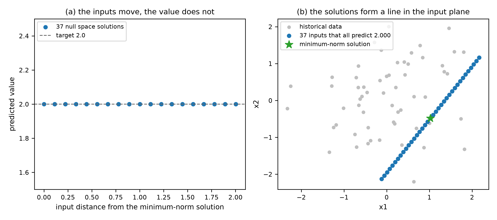
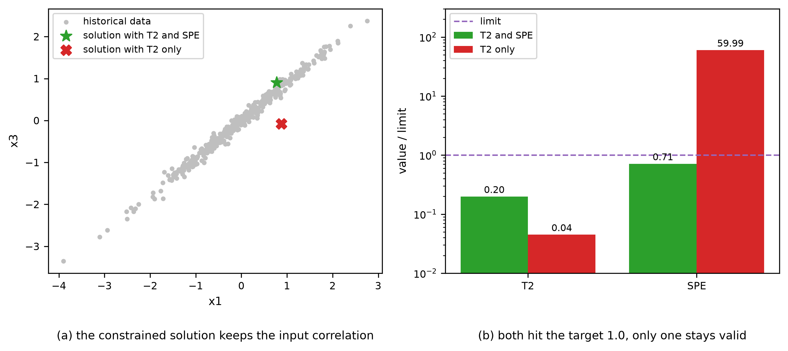

# Inverse Problem and Model Inversion
Rev. 3 | Created: 2026-08-28 | Updated: 2026-08-28 23:38 CDT

학습된 model 은 보통 입력에서 출력을 계산하는 방향으로 쓰인다. 원하는 출력을 먼저 정하고 그것을 만들어 내는 입력을 되찾는 문제가 inverse problem 이고, 이미 학습된 model 을 그 목적에 되돌려 쓰는 방법이 model inversion 이다. 이 문서는 두 용어를 정의하고, 해법을 다섯 축으로 분류한 다음, latent variable model inversion 의 고전적 결과와 model 종류별 inversion 방법을 정리한다.

## 1. Definition

### 1.1 Forward problem and inverse problem

Forward problem 은 입력 $\mathbf{x} \in \mathbb{R}^K$ 에서 출력 $\mathbf{y} \in \mathbb{R}^M$ 을 계산하는 문제이며, 물리 model 이든 데이터로 학습한 model 이든 $\mathbf{y} = f(\mathbf{x})$ 로 쓴다. Inverse problem 은 그 반대 방향으로, 관측되었거나 목표로 정한 $\mathbf{y}^{\ast}$ 가 주어졌을 때 그것을 만들어 내는 $\mathbf{x}$ 를 찾는 문제이다.

두 문제는 방향만 다른 것이 아니라 성질이 다르다. Forward 는 입력마다 하나의 출력을 주지만, inverse 는 답이 없거나 여러 개이거나 관측의 작은 잡음에 크게 흔들린다. Inverse problem 은 무엇을 되찾는가에 따라 두 갈래로 쓰인다.

- 관측형 inverse problem 은 측정된 $\mathbf{y}^{\ast}$ 에서 그 뒤에 있는 상태를 복원한다. Tomography, deconvolution 이 여기에 속한다.
- 설계형 inverse problem 은 목표 품질 $\mathbf{y}^{\ast}$ 를 먼저 정하고 그 품질을 내는 조건을 찾는다. Product design 과 inverse design 이 여기에 속한다.

### 1.2 Ill-posedness

Well-posed 문제는 해가 존재하고, 유일하며, 데이터에 연속적으로 의존한다는 세 조건을 모두 만족한다. 세 조건 중 하나 이상을 어기는 문제를 ill-posed 라고 하며, inverse problem 은 대부분 여기에 속한다 [\[1\]](#ref-1).

- 존재성은 $\mathbf{y}^{\ast}$ 가 $f$ 의 상 밖에 있으면 깨진다. 정확히 맞추는 대신 잔차를 최소화하는 해로 문제를 바꾸어 완화한다.
- 유일성은 $K \gt M$ 일 때 거의 항상 깨진다. 같은 출력을 주는 입력이 이루는 집합이 null space 이며, 이 자유도를 어떻게 쓸지가 설계형 문제의 핵심이 된다.
- 안정성은 $f$ 의 작은 특이값 방향에서 깨진다. 관측 잡음이 그 방향에서 크게 증폭되므로 regularization 으로 해의 크기를 눌러야 한다 [\[1\]](#ref-1).

### 1.3 Model inversion

Model inversion 은 이미 학습된 model 을 inverse problem 의 해법으로 쓰는 것을 뜻한다. 공정의 historical data 로 세운 latent variable model 을 뒤집어, 원하는 품질을 낼 수 있는 운전 조건의 창을 얻는 방법이 이 용어의 출발점이다 [\[2\]](#ref-2). 새로 실험을 설계하는 대신 이미 가진 model 을 반대 방향으로 읽는다는 점이 특징이며, 그래서 해의 신뢰 범위가 그 model 이 학습한 영역으로 제한된다.

비슷해 보이지만 다른 문제들이 같은 이름으로 불리는 경우가 있어, Table 1 에 경계를 정리한다.

Table 1. Terms adjacent to model inversion

| Term | Question it answers | Difference from model inversion |
| --- | --- | --- |
| Model inversion | 목표 출력을 내는 입력은 무엇인가 | 기준이 되는 문제이다 |
| Inverse design | 목표 성능을 갖는 설계안은 무엇인가 | 문제의 이름이며, model inversion 은 그 해법 중 하나이다 |
| Calibration | 관측을 설명하는 model parameter 는 무엇인가 | 되찾는 대상이 입력이 아니라 model parameter 이다 |
| Optimization | 목적 함수를 가장 좋게 하는 입력은 무엇인가 | 목표값 추종이 아니라 극값 탐색이며, 잔차를 목적 함수로 두면 inversion 을 포함한다 |
| Attribution | 출력이 어느 입력에 얼마나 반응하는가 | 국소 기여도를 설명할 뿐 목표를 만족하는 입력을 제시하지 않는다 |
| Model inversion attack | 학습 데이터에 무엇이 있었는가 | 목적이 설계가 아니라 privacy 침해이며, 복원 대상이 학습 표본이다 |

## 2. Taxonomy

Inverse problem 의 해법은 Fig 1 의 다섯 축으로 나뉜다. 한 방법은 각 축에서 하나씩 고른 조합이며, 축은 서로 배타적이지 않다.

Fig 1. Taxonomy of inverse problem solution approaches

```
Inverse problem (given a target y*, find the input x)
|
+-- Formulation (How to pose)
|   +-- Deterministic ......................... minimize the residual under constraints
|   +-- Bayesian .............................. posterior of x given y*, prior included
|
+-- Search space (Where to search)
|   +-- Input space ........................... x itself, constraints stated explicitly
|   +-- Latent space .......................... scores or codes, low dimensional
|
+-- Solution method (How to solve)
|   +-- Analytical inverse .................... pseudo-inverse, closed form for linear models
|   +-- Numerical optimization ................ gradient based or derivative free search
|   +-- Learned inverse map ................... a second model trained from y to x
|   +-- Posterior sampling .................... MCMC, conditional generative models
|
+-- Ambiguity handling (What fixes the answer)
|   +-- Null space ............................ directions that leave the prediction unchanged
|   +-- Regularization ........................ norm penalty, minimum-norm solution
|   +-- Validity constraint ................... T^2 and SPE limits, input bounds
|   +-- Prior ................................. probability mass on plausible inputs
|
+-- Answer form (What to return)
    +-- Point ................................. one input vector
    +-- Region ................................ design space, null space segment
    +-- Distribution .......................... posterior with uncertainty
```

### 2.1 Formulation (How to pose)

Deterministic 정식화는 잔차를 최소화하는 제약 최적화로 문제를 적는다.

$$\hat{\mathbf{x}} = \arg\min_{\mathbf{x}} \lVert f(\mathbf{x}) - \mathbf{y}^{\ast} \rVert^{2} + \lambda R(\mathbf{x})$$

여기서 $R$ 은 regularization 항이고 $\lambda$ 는 그 세기이다. Bayesian 정식화는 하나의 해 대신 사후분포를 구한다.

$$p(\mathbf{x} \mid \mathbf{y}^{\ast}) \propto p(\mathbf{y}^{\ast} \mid \mathbf{x})\, p(\mathbf{x})$$

두 정식화는 대응한다. 사후분포의 최빈값을 구하는 일은 음의 로그 우도를 잔차로, 음의 로그 사전분포를 regularization 으로 둔 최소화와 같다 [\[3\]](#ref-3). Deterministic 쪽은 계산이 싸고, Bayesian 쪽은 다중해와 불확실성을 그대로 보여 준다.

### 2.2 Search space (Where to search)

Input space 에서 직접 찾으면 model 종류를 가리지 않지만, 입력들 사이의 상관 구조를 지키라는 제약을 사람이 따로 넣어야 한다. Latent space 에서 찾으면 그 상관 구조가 이미 좌표계에 들어 있어, 차원이 줄고 물리적으로 있을 법한 후보만 탐색된다. PLS 의 score, autoencoder 의 code, normalizing flow 의 latent 변수가 모두 이 자리에 온다.

### 2.3 Solution method (How to solve)

- Analytical inverse 는 선형 model 에서 pseudo-inverse 로 해를 닫힌 형태로 준다. 가장 싸지만 비선형 model 에는 쓸 수 없다.
- Numerical optimization 은 $f$ 를 그대로 두고 잔차를 줄인다. 미분이 되면 gradient 를, 안 되면 derivative-free 탐색을 쓴다.
- Learned inverse map 은 $\mathbf{y}$ 에서 $\mathbf{x}$ 로 가는 model 을 따로 학습한다. 추론이 한 번의 forward 로 끝나지만, 다중해를 평균으로 뭉개면 어느 쪽도 아닌 답을 낸다 [\[4\]](#ref-4).
- Posterior sampling 은 해를 표본으로 뽑아 다중해를 그대로 드러낸다. 비용이 가장 크다.

### 2.4 Ambiguity handling (What fixes the answer)

답이 여럿일 때 무엇으로 하나를 고르는가가 방법을 가른다. Null space 는 예측을 바꾸지 않는 방향을 명시해 남은 자유도를 다른 목적에 쓰게 한다. Regularization 은 크기가 작은 해를 고른다. Validity constraint 는 historical data 가 덮은 영역 안으로 해를 가둔다. Prior 는 있을 법한 입력에 확률을 몰아준다. 앞의 셋은 deterministic 정식화에, 마지막은 Bayesian 정식화에 자연스럽게 붙는다.

### 2.5 Answer form (What to return)

Point 는 하나의 조건을 제시하므로 바로 실행할 수 있지만 여유가 없다. Region 은 규격을 만족하는 입력 영역을 주며, 공정에서는 design space 라는 이름으로 쓰인다. Distribution 은 사후분포를 그대로 주어, 규격을 만족할 확률로 판단하게 한다.

## 3. Latent Variable Model Inversion

PLS model 의 inversion 은 inverse problem 을 latent space 에서 푼 가장 오래된 산업 사례이며, 이후의 방법들이 되풀이하는 골격을 이미 갖추고 있다. 차원을 줄여 자유도를 정리하고, 줄인 공간에서 역해를 구하고, 유효 영역 제약으로 외삽을 막는 세 단계가 그것이다 [\[2\]](#ref-2), [\[5\]](#ref-5).

### 3.1 PLS inversion and the null space

PLS 는 입력 $\mathbf{X}$ 와 출력 $\mathbf{Y}$ 를 공통의 score $\mathbf{T}$ 로 분해한다. $A$ 는 latent 변수의 개수이다.

$$\mathbf{X} = \mathbf{T}\mathbf{P}^{\top} + \mathbf{E}, \qquad \mathbf{Y} = \mathbf{T}\mathbf{Q}^{\top} + \mathbf{F}$$

목표 품질 $\mathbf{y}^{\ast}$ 가 주어지면 score 에 대한 방정식 $\mathbf{Q}\mathbf{t} = \mathbf{y}^{\ast}$ 를 풀고, 얻은 score 를 loading 으로 되돌려 입력을 복원한다.

$$\mathbf{t}^{\ast} = \mathbf{Q}^{+}\mathbf{y}^{\ast}, \qquad \mathbf{x}^{\ast} = \mathbf{P}\mathbf{t}^{\ast}$$

$\mathbf{Q}^{+}$ 는 pseudo-inverse 이므로 $\mathbf{t}^{\ast}$ 는 최소 노름 해이다. $\mathbf{Q}$ 의 rank 가 $M$ 이고 $A \gt M$ 이면 $\mathbf{Q}\mathbf{t}_{n} = \mathbf{0}$ 을 만족하는 방향이 $A - M$ 개 남으며, 이 방향들이 이루는 부분공간이 null space 이다 [\[2\]](#ref-2).

- Null space 는 품질을 바꾸지 않고 움직일 수 있는 운전 자유도이다. 원가, 처리량, 에너지 같은 2차 목적을 이 자유도 위에서 최적화할 수 있다.
- Null space 를 따라 멀리 가면 historical data 가 뒷받침하지 않는 조건에 닿는다. 그래서 score 의 크기를 재는 Hotelling $T^{2}$ 와 model 평면까지의 거리를 재는 SPE 에 상한을 두고 그 안으로 해를 가둔다 [\[5\]](#ref-5).

$$T^{2} = \sum_{a=1}^{A} \frac{t_{a}^{2}}{s_{a}^{2}}, \qquad \mathrm{SPE} = \lVert \mathbf{x} - \mathbf{P}\mathbf{t} \rVert^{2}$$

Fig 2. Null space and the validity region in the score plane

```
        t2
         ^
         |        .............................
         |     ...                             ...
         |   ..                                   ..
         |  .        A * - - - t* - - - * B          .
    -----+--.------------------------------------.-----> t1
         |  .   (all t on A--B predict the same y*)  .
         |   ..                                   ..
         |     ...                             ...
         |        .............................
         |                 T^2 = limit

  the A--B segment is the null space direction;
  only the part inside the ellipse is supported by past data
```

이 절차를 그대로 실행하는 예시는 [Appendix B](#appendix-b-python-example-pls-model-inversion) 에 있다.

### 3.2 Design space and product transfer

같은 골격이 산업 문제로 확장되면서 다음 결과들이 쌓였다.

- 두 site 의 데이터를 하나의 latent space 로 묶는 Joint-Y PLS 는, 한 site 에서 검증된 조건을 다른 site 의 조건으로 옮기는 product transfer 를 inversion 문제로 만든다 [\[6\]](#ref-6).
- Model parameter 의 불확실성을 해에 전파하면 규격을 만족하는 영역이 좁아진다. 이 보수적인 영역이 pharmaceutical 공정에서 말하는 design space 이다 [\[7\]](#ref-7).
- 규격이 등식이 아니라 상하한으로 주어지거나, 일부 입력이 고정되거나, 목표가 여러 개인 경우가 모두 하나의 제약 최적화로 통합되었다 [\[8\]](#ref-8).
- 최근 정식화는 score 공간에서 풀 것인가 입력 공간에서 풀 것인가를 문제의 제약 구조로 결정하고, null space 를 유지한 채 $T^{2}$ 와 SPE 제약을 함께 넣는다 [\[9\]](#ref-9), [\[10\]](#ref-10).

## 4. Model-Specific Inversion Methods

Model 을 어떻게 뒤집을 수 있는지는 그 model 의 구조가 정한다. 선형 model 은 닫힌 해를 주고, 미분 가능한 model 은 입력에 대한 gradient 를 주며, 그 어느 쪽도 아닌 model 은 탐색에 기댄다. Table 2 가 model 별 방법을 정리하고, 이어지는 절이 계열별로 설명한다.

Table 2. Inversion method by model family

| Model | Inversion method | Characteristics |
| --- | --- | --- |
| PLS / PCR | 해석적 역해와 null space | 선형이고 해가 유일하지 않으므로 최소 노름 해 또는 제약 최적화로 고른다 |
| OLS / Ridge | Pseudo-inverse | 잠재공간 제약이 없어 외삽 위험이 크다. Ridge 는 해를 줄일 뿐 입력 상관 구조를 지키지 않는다 |
| PCA | Pre-image problem | 출력이 없으므로 재구성 관점이다. 선형은 닫힌 해, kernel PCA 는 pre-image 를 반복 최적화로 근사한다 |
| Kernel PLS | Latent space 역해와 pre-image | 비선형 관계를 담되 score 에서 입력으로 되돌리는 단계가 pre-image 문제로 남는다 |
| GP | 사후분포 기반 역설계 | 불확실성을 함께 주므로 Bayesian optimization 의 기반이 된다 |
| Random forest / GBM | Surrogate search, TreeSHAP 기반 국소 선형화 | 미분이 불가하여 이산 탐색이나 genetic algorithm 을 쓴다 |
| Neural network | 입력에 대한 역전파 | 가장 직접적이며 activation maximization 과 같은 계산이다. Regularization 이 필수이다 |
| Autoencoder / VAE | Latent space 탐색 후 디코딩 | 생성 model 방식의 역설계이며 제조 분야로 확산 중이다 |
| Invertible NN / Normalizing flow | 구조적으로 양방향 | cINN 은 사후분포를 한 번의 forward 로 준다 |
| Diffusion model | 사후 sampling | 잡음이 있는 비선형 문제에서 다중해를 표본으로 얻는다 |
| Model-agnostic | 수치 최적화 $\min \lVert f(\mathbf{x}) - \mathbf{y}^{\ast} \rVert^{2}$ 와 제약 | 어떤 $f$ 에도 적용되어 가장 범용이다 |

### 4.1 Linear projection models

PLS 와 PCR 은 3.1 의 절차로 뒤집힌다. OLS 와 Ridge 도 pseudo-inverse 로 같은 형태의 해를 주지만, 결정적인 차이는 해가 놓이는 자리에 있다. 투영 model 의 해는 score 공간을 거치므로 입력들 사이의 상관 구조를 그대로 물려받는 반면, OLS 의 해는 그 구조 밖으로 자유롭게 나갈 수 있다. 상관된 입력을 가진 공정에서 OLS 역해가 물리적으로 불가능한 조합을 내놓는 이유가 여기에 있다. PCA 에는 맞출 출력이 아예 없으므로 문제의 성격 자체가 달라진다. 선형 PCA 는 score 에서 loading 으로 되돌리는 닫힌 해를 가지지만, kernel PCA 로 가면 그 되돌림이 4.2 의 pre-image 문제가 된다.

### 4.2 Kernel and Gaussian process models

Kernel 계열은 특징 공간에서는 선형이지만 그 공간의 점에 대응하는 입력이 일반적으로 존재하지 않는다. 그래서 특징 공간의 해를 입력 공간으로 되돌리는 pre-image 를 반복 최적화나 고정점 방법으로 근사한다 [\[11\]](#ref-11). Gaussian process 는 예측과 함께 분산을 주므로 사정이 다르다. 목표에서 벗어난 정도와 불확실성을 함께 담은 acquisition function 을 세우고 그것을 최적화하면, 다음에 시험할 입력을 정하는 Bayesian optimization 이 된다 [\[12\]](#ref-12). 해를 한 번에 구하지 않고 실험을 반복하며 좁혀 간다는 점에서 앞의 방법들과 성격이 다르다.

### 4.3 Tree ensembles

Random forest 와 gradient boosting 은 조각별 상수 함수이므로 입력에 대한 gradient 가 0 이거나 정의되지 않는다. 따라서 gradient 대신 탐색을 쓴다. 격자 탐색, genetic algorithm, CMA-ES 같은 derivative-free 방법이 그대로 쓰이며, 학습된 tree 자체를 빠른 surrogate 로 두고 그 위에서 탐색을 돌린다. TreeSHAP 은 한 점 주변에서 각 입력의 기여도를 정확히 계산하므로, 국소 선형 근사를 얻어 탐색의 방향을 정하는 데 쓸 수 있다 [\[13\]](#ref-13).

### 4.4 Neural networks

미분 가능한 network 는 가장 직접적으로 뒤집힌다. 가중치를 고정한 채 입력을 변수로 두고 $\lVert f(\mathbf{x}) - \mathbf{y}^{\ast} \rVert^{2}$ 를 입력에 대해 역전파하면 된다. 출력 하나를 최대화하는 형태로 쓰면 activation maximization 이고, 작은 변화로 출력을 바꾸는 형태로 쓰면 adversarial 예제 생성과 계산이 같다 [\[14\]](#ref-14). 쓰임이 다를 뿐 계산이 같으므로 위험도 그대로 따라온다. 제약 없이 최적화하면 목표 출력을 완벽히 맞추면서도 데이터 분포에서 한참 떨어진 입력이 나오므로, 입력 범위 제한이나 사전 분포 항이 반드시 필요하다.

### 4.5 Generative and invertible models

생성 model 은 데이터 분포를 학습하므로 그 자체가 강한 prior 이다. Autoencoder 와 VAE 는 latent 공간에서 탐색한 뒤 디코딩하며, 디코더가 만들어 낼 수 있는 것만 후보가 되므로 비현실적인 해가 걸러진다. 분자 설계에서 이 방식이 자리 잡은 것도 같은 이유이다 [\[15\]](#ref-15). Invertible neural network 와 normalizing flow 는 한 걸음 더 나아가 구조적으로 양방향이다. Forward 를 학습하면 inverse 가 함께 정의되고, 조건부 형태인 cINN 은 목표를 조건으로 준 사후분포에서 표본을 직접 뽑는다 [\[16\]](#ref-16). Diffusion model 은 학습된 score 에 관측 우도의 gradient 를 더해 사후분포를 표본화하며, 잡음이 섞인 비선형 문제에서 최근의 표준으로 쓰인다 [\[17\]](#ref-17).

### 4.6 Model-agnostic numerical optimization

Model 구조를 전혀 쓰지 않고 $f$ 를 blackbox 로 두는 방법이 가장 범용이다. 잔차를 목적 함수로 삼고, 유효 영역과 물리적 한계를 제약으로 걸어 최적화기를 돌린다. Gradient 를 쓸 수 있으면 쓰고 없으면 derivative-free 방법으로 바꾸기만 하면 되므로, 앞의 모든 계열에 대해 대안이 된다. 대가는 비용과 국소해이다. 목적 함수가 여러 골짜기를 가지면 시작점에 따라 다른 해에 닿으므로, 여러 시작점에서 반복하고 얻은 해들을 함께 보고하는 편이 안전하다. 구현은 [Appendix C](#appendix-c-python-example-constrained-numerical-inversion) 에 있다.

## 5. Solution Validity

Inversion 의 결과는 model 이 참이라는 가정 아래의 제안이며, 그대로 실행할 답이 아니다. 다음 네 가지를 확인해야 한다.

- 외삽: model 은 historical data 가 덮은 영역에서만 신뢰할 수 있다. $T^{2}$ 는 그 영역 안에서 중심으로부터 얼마나 멀리 있는지를, SPE 는 영역이 이루는 면에서 얼마나 떨어졌는지를 잰다. 둘 중 하나만 보면 상관 구조가 깨진 해를 놓친다.
- 다중해: 답이 하나가 아니면 하나만 골라 보고하지 않는다. Null space 구간이나 사후분포처럼 답의 집합을 보여 주는 편이 판단에 도움이 된다.
- 불확실성: GP, Bayesian, flow 계열은 사후분포를 주므로 규격을 만족할 확률로 해를 평가할 수 있다 [\[3\]](#ref-3). 점 추정만 주는 model 은 이 판단이 불가능하므로 별도의 검증이 필요하다.
- 검증과 갱신: 얻은 입력은 실험이나 시뮬레이션으로 확인하고, 그 결과를 데이터에 더해 model 을 다시 학습하는 폐루프를 둔다. 이 되먹임이 없으면 model 의 오차가 그대로 설계 오차가 된다.

## 6. Tools and Libraries

Table 3. Libraries for model inversion

| Library | Role | Note |
| --- | --- | --- |
| NumPy / SciPy | Pseudo-inverse, null space, 제약 최적화 | `numpy.linalg.pinv`, `scipy.linalg.null_space`, `scipy.optimize.minimize` |
| scikit-learn | Latent variable model 과 유효 영역 | `PLSRegression`, `PCA`, `GaussianProcessRegressor` |
| PyTorch | 입력에 대한 gradient | 입력 tensor 에 gradient 를 켜고 역전파한다 |
| BoTorch / GPyTorch | GP 기반 Bayesian optimization | Acquisition function 최적화를 제공한다 |
| SHAP | Tree model 의 국소 선형화 | TreeSHAP 으로 기여도를 정확히 계산한다 |
| FrEIA | Invertible neural network | cINN 구조를 조립한다 |
| PyMC / emcee | 사후분포 sampling | Bayesian 정식화의 표본 기반 해법이다 |

## References

<a id="ref-1"></a>
[1] Kaipio, J., Somersalo, E. (2005). [Statistical and Computational Inverse Problems](https://doi.org/10.1007/b138659). Springer, Applied Mathematical Sciences 160.

<a id="ref-2"></a>
[2] Jaeckle, C. M., MacGregor, J. F. (1998). [Product design through multivariate statistical analysis of process data](https://doi.org/10.1002/aic.690440509). AIChE Journal, 44(5), 1105–1118.

<a id="ref-3"></a>
[3] Stuart, A. M. (2010). [Inverse problems: a Bayesian perspective](https://doi.org/10.1017/S0962492910000061). Acta Numerica, 19, 451–559.

<a id="ref-4"></a>
[4] Ongie, G., Jalal, A., Metzler, C. A., Baraniuk, R. G., Dimakis, A. G., Willett, R. (2020). [Deep learning techniques for inverse problems in imaging](https://doi.org/10.1109/JSAIT.2020.2991563). IEEE Journal on Selected Areas in Information Theory, 1(1), 39–56.

<a id="ref-5"></a>
[5] Jaeckle, C. M., MacGregor, J. F. (2000). [Industrial applications of product design through the inversion of latent variable models](https://doi.org/10.1016/S0169-7439(99)00058-1). Chemometrics and Intelligent Laboratory Systems, 50(2), 199–210.

<a id="ref-6"></a>
[6] García-Muñoz, S., MacGregor, J. F., Kourti, T. (2005). [Product transfer between sites using Joint-Y PLS](https://doi.org/10.1016/j.chemolab.2005.04.009). Chemometrics and Intelligent Laboratory Systems, 79(1–2), 101–114.

<a id="ref-7"></a>
[7] García-Muñoz, S., Dolph, S., Ward, H. W. (2010). [Handling uncertainty in the establishment of a design space for the manufacture of a pharmaceutical product](https://doi.org/10.1016/j.compchemeng.2010.02.027). Computers & Chemical Engineering, 34(7), 1098–1107.

<a id="ref-8"></a>
[8] Tomba, E., Barolo, M., García-Muñoz, S. (2012). [General framework for latent variable model inversion for the design and manufacturing of new products](https://doi.org/10.1021/ie301214c). Industrial & Engineering Chemistry Research, 51(39), 12886–12900.

<a id="ref-9"></a>
[9] Palací-López, D., Facco, P., Barolo, M., Ferrer, A. (2019). [New tools for the design and manufacturing of new products based on latent variable model inversion](https://doi.org/10.1016/j.chemolab.2019.103848). Chemometrics and Intelligent Laboratory Systems, 194, 103848.

<a id="ref-10"></a>
[10] Palací-López, D., et al. (2020). [Improved formulation of the latent variable model inversion-based optimization problem for quality by design applications](https://doi.org/10.1002/cem.3230). Journal of Chemometrics, 34(6), e3230.

<a id="ref-11"></a>
[11] Kwok, J. T., Tsang, I. W. (2004). [The pre-image problem in kernel methods](https://doi.org/10.1109/TNN.2004.837781). IEEE Transactions on Neural Networks, 15(6), 1517–1525.

<a id="ref-12"></a>
[12] Shahriari, B., Swersky, K., Wang, Z., Adams, R. P., de Freitas, N. (2016). [Taking the human out of the loop: a review of Bayesian optimization](https://doi.org/10.1109/JPROC.2015.2494218). Proceedings of the IEEE, 104(1), 148–175.

<a id="ref-13"></a>
[13] Lundberg, S. M., Erion, G., Chen, H., et al. (2020). [From local explanations to global understanding with explainable AI for trees](https://doi.org/10.1038/s42256-019-0138-9). Nature Machine Intelligence, 2, 56–67.

<a id="ref-14"></a>
[14] Simonyan, K., Vedaldi, A., Zisserman, A. (2014). [Deep inside convolutional networks: visualising image classification models and saliency maps](https://doi.org/10.48550/arXiv.1312.6034). arXiv:1312.6034.

<a id="ref-15"></a>
[15] Gómez-Bombarelli, R., Wei, J. N., Duvenaud, D., et al. (2018). [Automatic chemical design using a data-driven continuous representation of molecules](https://doi.org/10.1021/acscentsci.7b00572). ACS Central Science, 4(2), 268–276.

<a id="ref-16"></a>
[16] Ardizzone, L., Kruse, J., Wirkert, S., et al. (2019). [Analyzing inverse problems with invertible neural networks](https://doi.org/10.48550/arXiv.1808.04730). International Conference on Learning Representations.

<a id="ref-17"></a>
[17] Chung, H., Kim, J., McCann, M. T., Klasky, M. L., Ye, J. C. (2023). [Diffusion posterior sampling for general noisy inverse problems](https://doi.org/10.48550/arXiv.2209.14687). International Conference on Learning Representations.

---

## Appendix A. Terminology

- Acquisition function: 예측값과 불확실성을 함께 담아 다음에 시험할 입력을 고르는 함수이다.
- Activation maximization: 학습된 network 의 특정 출력이 최대가 되는 입력을 입력에 대한 역전파로 찾는 방법이다.
- Bayesian optimization: 사후분포를 가진 surrogate model 과 acquisition function 으로 blackbox 함수의 최적점을 반복 탐색하는 방법이다.
- cINN: 조건을 입력으로 받는 invertible neural network 이며, 조건부 사후분포에서 표본을 뽑는다.
- CMA-ES: 공분산 행렬을 갱신하며 표본을 뽑아 최적점을 찾는 derivative-free optimization 방법이며 covariance matrix adaptation evolution strategy 의 약자이다.
- Derivative-free optimization: 목적 함수의 gradient 없이 함수값만으로 해를 찾는 최적화이다.
- Design space: 품질 규격을 만족하는 것으로 확인된 입력 영역이다.
- Forward problem: 입력에서 출력을 계산하는 문제이다.
- GBM: 잔차를 순차적으로 학습하는 tree 를 더해 만드는 model 이며 gradient boosting machine 의 약자이다.
- GP: 함수에 대한 사전분포를 두어 예측과 분산을 함께 주는 model 이며 Gaussian process 의 약자이다.
- Hotelling $T^{2}$: score 가 model 중심에서 얼마나 떨어져 있는지를 재는 통계량이다.
- Ill-posed problem: 해의 존재성, 유일성, 안정성 중 하나 이상이 깨진 문제이다.
- Inverse design: 목표 성능을 먼저 정하고 그 성능을 내는 설계안을 찾는 문제이다.
- Joint-Y PLS: 여러 site 의 데이터를 공통 출력으로 묶어 하나의 latent space 에서 다루는 PLS 확장이다.
- Latent variable: 관측 변수들을 적은 수로 요약한 내부 좌표이며, PLS 에서는 score 라고 부른다.
- Loading: Latent 변수와 관측 변수를 잇는 계수이며, score 에서 입력을 복원할 때 쓰인다.
- MCMC: 사후분포를 따르는 표본을 연쇄적으로 생성하는 sampling 방법이며 Markov chain Monte Carlo 의 약자이다.
- Model inversion: 학습된 model 을 뒤집어 목표 출력을 내는 입력을 구하는 방법이다.
- Normalizing flow: 가역 변환의 합성으로 분포를 다른 분포로 옮기는 생성 model 이다.
- Null space: 예측 출력을 바꾸지 않는 입력 또는 score 의 방향이 이루는 부분공간이다.
- OLS: 잔차 제곱합을 최소화하는 회귀이며 ordinary least squares 의 약자이다.
- PCA: 분산이 큰 방향으로 좌표를 다시 잡아 차원을 줄이는 방법이며 principal component analysis 의 약자이다.
- PCR: 주성분으로 축소한 뒤 회귀하는 model 이며 principal component regression 의 약자이다.
- PLS: 입력과 출력의 공분산이 큰 방향으로 latent 변수를 뽑는 회귀 model 이며 partial least squares 의 약자이다.
- Posterior sampling: 사후분포에서 표본을 뽑아 해의 집합을 얻는 방법이다.
- Pre-image problem: 특징 공간의 한 점에 대응하는 입력 공간의 점을 찾는 문제이다.
- Pseudo-inverse: 정방이 아니거나 특이한 행렬에 대해 최소 노름 최소제곱 해를 주는 일반화 역행렬이다.
- Regularization: 해의 크기나 형태에 벌점을 주어 ill-posed problem 을 안정화하는 방법이다.
- Score: 관측을 latent 좌표계로 투영한 값이다.
- SPE: 관측이 model 평면에서 벗어난 거리의 제곱이며 squared prediction error 의 약자이다.
- Surrogate model: 비싼 계산이나 실험을 대신하는 값싼 근사 model 이다.
- TreeSHAP: Tree model 에서 각 입력의 기여도를 다항 시간에 정확히 계산하는 방법이다.
- VAE: Latent 변수의 분포를 학습하는 생성 model 이며 variational autoencoder 의 약자이다.
- Validity domain: model 이 학습 데이터로 뒷받침되는 입력 영역이다.
- Well-posed problem: 해가 존재하고 유일하며 데이터에 연속적으로 의존하는 문제이다.

## Appendix B. Python Example: PLS Model Inversion

3.1 의 절차를 그대로 실행한다. 최소 노름 해를 구한 뒤 null space 방향으로 움직여도 예측 품질이 같은지 확인한다. Appendix B 와 Appendix C 의 예시는 모두 난수 데이터를 쓰는 최소 실행 예시이며, NumPy, SciPy, scikit-learn 만 있으면 그대로 돌아간다.

```python
import numpy as np
from scipy.linalg import null_space
from sklearn.cross_decomposition import PLSRegression

rng = np.random.default_rng(0)

# historical plant data: 6 process inputs, 1 quality output
n, k, n_comp = 60, 6, 3
X = rng.normal(size=(n, k))
y = 1.5 * X[:, 0] - 0.8 * X[:, 1] + 0.3 * X[:, 2] + rng.normal(0, 0.05, n)

x_mean, y_mean = X.mean(axis=0), y.mean()
pls = PLSRegression(n_components=n_comp, scale=False).fit(X - x_mean, y - y_mean)
P = pls.x_loadings_          # (k, n_comp)
Q = pls.y_loadings_          # (1, n_comp)

# 1. direct inversion: minimum-norm scores that hit the target quality
y_des = 2.0
t_star = np.linalg.pinv(Q) @ np.array([y_des - y_mean])
x_star = P @ t_star + x_mean

# 2. null space: score directions that leave the predicted quality unchanged
N = null_space(Q)            # (n_comp, n_comp - 1)
x_alt = P @ (t_star + N @ np.array([0.7, -0.4])) + x_mean


def predict(x):
    return float(pls.predict((x - x_mean)[None, :]).ravel()[0]) + y_mean


print("null space dim :", N.shape[1])
print("pred(x_star)   :", round(predict(x_star), 6))
print("pred(x_alt)    :", round(predict(x_alt), 6))
print("distance       :", round(float(np.linalg.norm(x_star - x_alt)), 3))
```

두 입력은 서로 다르지만 예측 품질은 같다. 어느 쪽을 쓸지는 품질이 아니라 원가나 운전 여유 같은 다른 기준이 정한다.

Fig 3 는 이 결과를 그린 것이다. 왼쪽은 최소 노름 해에서 첫 null space 방향으로 걸어가며 잰 값으로, 입력이 $\lVert \mathbf{x} - \mathbf{x}^{\ast} \rVert$ 만큼 멀어지는 동안에도 예측 품질은 목표에 붙어 있다. 오른쪽은 그 걸음의 한 지점인 `x_alt` 를 최소 노름 해와 나란히 놓은 것이며, 여섯 입력의 값이 모두 다른데도 예측은 같은 2.000 이다.

Fig 3. Predicted quality and inputs along the null space



## Appendix C. Python Example: Constrained Numerical Inversion

미분이 되지 않는 gradient boosting model 을 blackbox 로 두고 4.6 의 방식으로 뒤집는다. 유효 영역은 historical data 에 맞춘 PCA 의 $T^{2}$ 와 SPE 로 정의하고, 두 상한을 제약으로 건다.

```python
import numpy as np
from scipy.optimize import minimize
from scipy.stats import chi2
from sklearn.decomposition import PCA
from sklearn.ensemble import GradientBoostingRegressor

rng = np.random.default_rng(0)

# correlated process data: x3 and x4 are driven by x1 and x2
n = 400
z = rng.normal(size=(n, 2))
X = np.column_stack([z[:, 0], z[:, 1],
                     0.9 * z[:, 0] + 0.1 * rng.normal(size=n),
                     -0.7 * z[:, 1] + 0.1 * rng.normal(size=n)])
y = np.sin(X[:, 0]) + 0.5 * X[:, 1] ** 2 + 0.2 * X[:, 2]

forward = GradientBoostingRegressor(random_state=0).fit(X, y)

# validity domain of the historical data, described by a 2-component PCA
pca = PCA(n_components=2).fit(X)
t2_limit = chi2.ppf(0.95, df=2)
spe_train = np.sum((X - pca.inverse_transform(pca.transform(X))) ** 2, axis=1)
spe_limit = float(np.quantile(spe_train, 0.95))


def t2(x):
    # distance from the centre inside the model plane
    t = pca.transform(x[None, :])[0]
    return float(np.sum(t ** 2 / pca.explained_variance_))


def spe(x):
    # squared distance to the model plane: broken input correlation
    return float(np.sum((x - pca.inverse_transform(pca.transform(x[None, :]))[0]) ** 2))


y_des = 1.0


def objective(x):
    return float((forward.predict(x[None, :])[0] - y_des) ** 2)


# derivative-free search, since a boosted tree model is not differentiable
result = minimize(
    objective,
    x0=X.mean(axis=0),
    method="COBYLA",
    constraints=[
        {"type": "ineq", "fun": lambda x: t2_limit - t2(x)},
        {"type": "ineq", "fun": lambda x: spe_limit - spe(x)},
    ],
    options={"maxiter": 3000},
)

x_sol = result.x
print("pred(x_sol) :", round(float(forward.predict(x_sol[None, :])[0]), 4))
print("T2          :", round(t2(x_sol), 2), "limit", round(t2_limit, 2))
print("SPE         :", round(spe(x_sol), 3), "limit", round(spe_limit, 3))
print("x_sol       :", np.round(x_sol, 3))
```

SPE 제약을 빼면 목표 품질은 그대로 맞추면서 `x3` 와 `x4` 가 `x1`, `x2` 와의 상관을 깨는 해가 나온다. 5 의 외삽 항목에서 말한 대로 두 통계량을 함께 걸어야 데이터가 뒷받침하는 해가 된다.

Fig 4 가 그 차이를 보인다. 왼쪽의 `x1`–`x3` 평면에서 두 제약을 모두 건 해는 historical data 가 이루는 띠 위에 앉지만, $T^{2}$ 만 건 해는 목표를 맞추고도 띠에서 벗어나 있다. 오른쪽은 두 해의 통계량을 각자의 상한으로 나눈 값이며, $T^{2}$ 만 건 해의 SPE 는 상한의 60 배에 이른다. $T^{2}$ 는 두 해 모두 상한 아래이므로, 그 하나만 보면 이 이탈을 잡아내지 못한다.

Fig 4. Constrained solution against the validity limits


