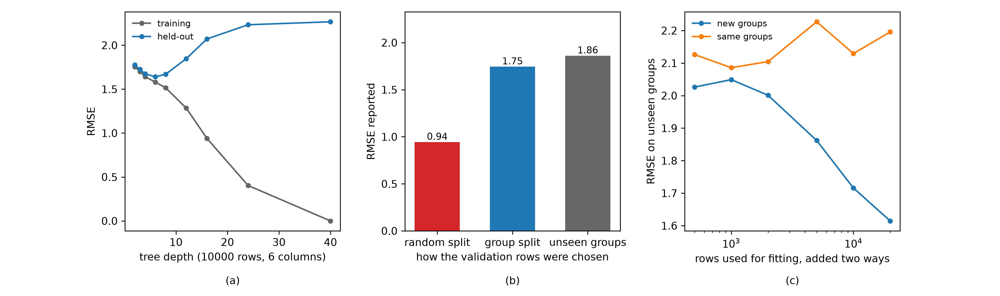

# Overfitting In Long Data
Rev. 15 | Created: 2026-09-07 | Updated: 2026-09-10 10:32 UTC

## 1. Purpose

- **Problem Statement**: 행이 많은 자료에서는 overfitting 이 없다고 보고 검증을 느슨하게 하여, validation performance 와 test performance 가 크게 차이 날 수 있다.
- **Goal**: Overfitting taxonomy 에 따른 물리와 해석, 반도체 자료에서의 대응책을 정리한다.
- **Non-Goal**: 열이 행보다 많은 자료의 방어는 다루지 않는다. Dropout 이나 weight decay 처럼 신경망에만 있는 regularization 도 다루지 않는다.

## 2. Summary

Long data 의 overfitting 은 parameter 의 수에서 오지 않고 세 곳에서 온다.

- **Model 의 용량 (capacity)**
- **서로 닮은 행**
- **절차의 누수 (leakage)**

셋 가운데 실무에서 가장 크고 가장 늦게 드러나는 것은 둘째이다. 행이 wafer·lot·설비 같은 group 으로 묶여 있으면 유효 표본 (effective sample size) 이 행의 수보다 훨씬 작은데, 무작위 분할은 같은 group 의 행을 학습과 검증에 나누어 담아 그 사실을 감춘다. 3 장의 모의 실험에서 무작위 분할이 0.94 로 보고한 오차는 새로운 group 에서 실제로 1.86 이었다.

처방도 셋이다.

- **용량**: Held-out 오차가 돌아서는 지점에서 멈춘다.
- **닮은 행**: 분할은 자료가 묶인 group 을 따르고, 행은 같은 group 안이 아니라 새 group 을 늘린다.
- **누수**: 열이 기록되는 시점을 확인하고, 전처리와 선택을 학습 fold 안에 둔다.

## 3. Principle

### 3.1 Three Paths

이 문서가 쓰는 taxonomy 는 overfitting 이 들어오는 경로 셋이며, 각각 다른 장치로 막는다. 아래의 해석과 대응책은 모두 이 셋 가운데 어느 것인지를 먼저 가린 뒤에 정해진다. Table 1 이 그 셋이다.

Table 1. Three paths into a long-data model

| # | Path | What it exploits | Where it shows up |
|---|------|------------------|-------------------|
| 1 | Model capacity | A model flexible enough to memorize individual rows | Training error near zero, held-out error rising |
| 2 | Dependent rows | Rows that repeat one another inside a group | Random-split error far below the error on new groups |
| 3 | Leakage | A column or a split that carries the answer | An implausibly good model that fails on arrival |

Fig 1 은 앞의 둘을 모의 실험으로 잰 것이다.

Fig 1. Capacity, split choice, and the direction in which rows are added

세 panel 의 자료는 모두 열이 6 개뿐이고 행이 group 으로 묶여 있으며, group 마다 고유한 offset 을 가진다.

- **Panel (a)**: 400 개 group 에 group 마다 25 행씩 둔 10000 행 자료를 `sklearn.tree` 의 `DecisionTreeRegressor` 하나로 학습한 것이다. 가로축은 그 tree 에 허용한 깊이이며, 깊이를 풀수록 훈련 오차는 0 으로 내려가지만 held-out 오차는 깊이 6 을 지나 다시 올라간다. 여기서 용량은 model 이 만들어 낼 수 있는 함수의 다양함을 말하고, tree 에서는 깊이가 그것을 정한다. 깊이가 하나 늘 때마다 자료를 나눌 수 있는 구획의 수가 두 배가 되며, 구획의 수가 행의 수에 이르면 행을 하나씩 외울 수 있다. 열이 적어도 이 용량만으로 overfitting 이 일어난다는 뜻이다.
- **Panel (b)**: 200 개 group 에 group 마다 25 행씩 둔 5000 행 자료. 같은 자료와 같은 model 인데 무작위 분할이 보고한 오차가 가장 낮고, group 을 지킨 분할과 학습에 쓰이지 않은 새 group 순으로 높아진다. 분할을 어떻게 하느냐가 보고되는 숫자를 두 배까지 바꾼다는 뜻이다.
- **Panel (c)**: 행을 500 개에서 20000 개까지 늘리되 늘리는 방향을 둘로 나눈 것이다. 한 방향은 group 마다 25 행을 그대로 두고 group 의 수를 늘리는 것이고 (new groups), 다른 방향은 group 의 수를 20 으로 고정한 채 group 안의 행만 늘리는 것이다 (same groups). 세로축은 두 경우 모두 학습에 쓰이지 않은 새 group 에서 잰 오차이다. 새 group 을 더한 곡선만 내려가고 다른 곡선은 제자리이므로, 행의 수가 아니라 group 의 수가 정보의 양이라는 뜻이다.

행이 group 으로 묶여 있다는 것은 행이 하나씩 따로 생기지 않고 몇 개씩 같은 조건에서 함께 생긴다는 뜻이다. 같은 group 의 행들은 어떤 열의 값을 공유하고 응답에도 그 group 에만 붙는 값이 함께 들어 있어, 한 행을 보면 같은 group 의 다른 행을 상당 부분 맞출 수 있다. 이 자료의 여섯 행을 실제로 적어 보인 예가 [Appendix C](#appendix-c-what-a-grouped-row-looks-like) 에 있다.

### 3.2 Model Capacity

열이 6 개뿐이어도 model 이 충분히 유연하면 행을 외운다. Fig 1(a) 에서 held-out 오차는 깊이 6 의 1.64 에서 깊이를 푼 2.27 로 올라간다. 자유도를 정하는 것은 열의 수가 아니라 model 의 용량이다.

이 경로는 세 가지가 함께 나타나므로 알아보기 쉽다. 훈련 오차가 0 에 가깝고, held-out 오차가 용량과 함께 올라가며, 같은 자료를 다시 뽑아 학습하면 model 이 크게 달라진다.

### 3.3 Dependent Rows

행이 group 으로 묶여 있으면 행의 수가 정보의 양을 말해 주지 않는다. Group 안의 행들이 서로 닮은 정도를 intracluster correlation $\rho$ 로 두고 group 의 크기를 $m$ 이라 하면, 유효 표본은 아래와 같다 [[1](#ref-1)]. $\rho$ 를 자료에서 구하는 방법은 [Appendix D](#appendix-d-estimating-the-intracluster-correlation) 에 있다.

$$n_{\mathrm{eff}} = \frac{n}{1 + (m-1)\rho} \hspace{19em} (1)$$

$m = 25$, $\rho = 0.5$ 이면 분모가 13 이므로 10000 행이 실제로는 769 행만큼의 정보를 가진다. 이 상태에서 무작위 분할을 쓰면 검증 행과 같은 group 의 행이 학습에 들어가 있으므로, model 은 그 group 의 offset 을 이미 알고 있는 셈이 된다.

Fig 1(b) 가 그 결과이다. 무작위 분할은 0.94 를, group 을 지킨 분할은 1.75 를 보고했고, 학습에 쓰이지 않은 새 group 에서의 실제 오차는 1.86 이었다. 무작위 분할의 값은 실제의 절반이며, 이 차이는 model 을 고쳐서 줄일 수 있는 것이 아니라 보고된 숫자가 다른 질문에 답한 결과이다.

### 3.4 Leakage

누수는 학습 시점에 알 수 없는 정보가 열이나 분할을 통해 들어오는 일이다 [[2](#ref-2)]. Long data 에서 자주 만나는 형태는 셋이다. 결과가 정해진 뒤에 기록되는 열이 설명변수에 섞이는 것, 미래의 행이 과거를 예측하는 데 쓰이도록 시간 순서를 무시하고 분할하는 것, 그리고 전체 자료로 계산한 중심과 척도를 학습과 검증에 함께 쓰는 것이다.

누수는 앞의 두 경로와 달리 held-out 오차로도 잡히지 않는다. 검증 자료 역시 같은 누수를 안고 있기 때문이며, 그래서 이 경로만은 자료를 만든 사람에게 열의 생성 시점을 묻는 것으로 확인해야 한다.

### 3.5 Where The Paths Come From In The Process

세 경로는 통계의 성질이기 전에 자료가 만들어진 방식의 결과이다. 반도체 계측 자료에서 각 경로가 어디서 오는지가 Table 2 이다.

Table 2. The physical origin of each path in process data

| # | Path | Where it comes from | What carries it |
|---|------|---------------------|-----------------|
| 1 | Model capacity | A response that varies smoothly with a few process knobs | A model free to cut the space once per row |
| 2 | Dependent rows | Sites processed together in one chamber at one time | Chamber state, incoming material, the run itself |
| 3 | Leakage | Metrology and disposition recorded after the response is fixed | Post-process columns and a split that ignores drift |

첫째 경로의 물리는 자유도의 불일치이다. 두께나 선폭 같은 응답은 소수의 공정 인자에 매끄럽게 반응하므로 실제 자유도가 작은데, tree 계열 model 은 측점 하나마다 구획을 만들 수 있어 자유도를 행의 수까지 늘린다.

둘째 경로의 물리는 공유된 처리 조건이다. 한 wafer 의 측점들은 같은 chamber 에서 같은 시각에 처리되므로 chamber 벽면 상태, 가스와 온도의 그날 값, 들어온 wafer 자체의 편차를 함께 겪는다. 그 몫이 그 wafer 의 측정값 전체를 위나 아래로 옮기며, 이것이 3.3 의 offset 이다. Lot 단위로 올라가면 소재 batch 와 전처리 이력이, chamber 단위로 올라가면 chamber 사이의 차이가 같은 일을 한다.

셋째 경로의 물리는 기록의 시간 순서이다. 계측은 공정 뒤에 일어나고, 재작업 (rework) 여부나 최종 판정처럼 응답이 정해진 뒤에야 기록되는 열이 자료에 함께 실린다. 또한 chamber 의 상태는 시간에 따라 서서히 변하다가 정비 (preventive maintenance) 에서 되돌아가므로, 시간 순서를 무시한 분할은 그 변화를 건너뛰고 model 을 평가한다.

## 4. Application

### 4.1 Capacity Control

용량은 held-out 오차가 돌아서는 지점에서 멈춘다. Gradient boosting 이라면 round 수를 held-out 오차로 조기 종료하고, 학습률을 낮추는 대신 round 를 늘리는 편이 같은 성능에서 더 안정적이다 [[3](#ref-3)]. Tree 계열이라면 leaf 하나가 담는 최소 행 수를 두는 것이 깊이 제한보다 직접적이다. 행이 많은 자료에서는 이 값을 크게 두어도 잃는 것이 적다.

용량을 정하는 held-out 자료는 4.2 의 규칙을 따라야 한다. 그러지 않으면 조기 종료가 group 을 외운 시점에서 멈춘다.

### 4.2 Splitting That Matches The Grouping

분할은 자료가 묶인 방식을 따른다. Group 이 있으면 group 단위로 나누고, 시간 순서가 있으면 과거로 학습해 미래를 검증하며, 두 구간 사이에 자기상관 (autocorrelation) 이 미치는 만큼의 간격을 둔다 [[4](#ref-4)]. 무엇을 group 으로 볼지는 자료를 만든 공정이 정한다. 같은 wafer 의 측점, 같은 lot 의 wafer, 같은 설비의 lot 가 모두 후보이며, 예측이 새로운 무엇에 대해 이루어질지가 판단 기준이다.

Hyperparameter 를 고르는 안쪽 loop 과 성능을 재는 바깥 loop 을 나누는 nested cross-validation 도 함께 쓴다 [[5](#ref-5)]. 안쪽과 바깥쪽 모두 같은 group 규칙을 따라야 하며, 한쪽만 지키면 그 한쪽에서 다시 새어 들어온다.

### 4.3 Growing The Sample In The Right Direction

행을 늘릴 때는 새 group 을 늘린다. Fig 1(c) 에서 새 group 을 더하면 500 행의 2.03 에서 20000 행의 1.62 로 오차가 내려가지만, group 수를 20 으로 고정하고 group 안의 행만 늘리면 20000 행에서도 2.20 으로 제자리이다. 식 (1) 이 말하는 것과 같다. 분모의 $m$ 만 키우는 일은 $n_{\mathrm{eff}}$ 를 거의 늘리지 못한다.

이 판단은 자료 수집 계획에 바로 쓰인다. Wafer 당 측점을 늘릴지 wafer 수를 늘릴지 물을 때, 답은 거의 언제나 뒤쪽이다.

### 4.4 Leakage Control

누수는 열과 분할과 전처리의 세 자리에서 들어오므로 (3.4), 대응도 그 세 자리에 하나씩 둔다.

- **열**: 각 열이 기록되는 시점을 자료 사전에 적고, 응답이 정해진 뒤에 기록되는 열을 설명변수에서 뺀다.
- **분할**: 4.2 의 시간 순서 규칙이 그대로 이 경로의 장치이다. Group 규칙과 함께 지켜야 하며, 한쪽만 지키면 나머지 한쪽에서 새어 들어온다.
- **전처리**: 중심과 척도, 결측 대치, 열 선택을 학습 fold 안에서만 계산하고 검증 fold 에 적용한다.

이 경로의 대응은 model 을 고치는 일이 아니라 자료가 만들어진 순서를 문서로 남기는 일이다. 3.4 가 말한 대로 오차로는 드러나지 않으므로, 그 기록이 없으면 같은 누수가 다음 model 에서 되풀이된다 [[2](#ref-2)].

### 4.5 Test Set Discipline

같은 test 자료로 여러 후보를 반복해서 재면 그 자료는 더 이상 test 자료가 아니다. 후보를 고르는 데 쓰인 순간 그것은 검증 자료가 되며, 반복 횟수만큼 낙관적으로 기운다. 최종 보고용 자료는 한 번만 열고, 그 전까지의 모든 비교는 4.2 의 분할 안에서 끝낸다.

### 4.6 Applying The Three Devices To Semiconductor Data

반도체 자료에서 세 장치는 공정의 계층에 그대로 얹힌다. 가장 많이 틀리는 것은 분할 단위이며, 그것을 정하는 물음은 하나이다. Model 이 답해야 하는 것이 새로운 무엇인가. Table 3 이 그 물음과 단위이다.

Table 3. Split unit by the question the model answers

| # | Question the model answers | Split unit | Rows that must stay together |
|---|---------------------------|------------|------------------------------|
| 1 | Another site on a wafer already measured | Site | None |
| 2 | A wafer not measured before | Wafer | Sites of one wafer |
| 3 | A lot not run before | Lot | Wafers of one lot |
| 4 | A chamber the model has not seen | Chamber | Lots run in one chamber |
| 5 | The coming week on the same chamber | Time block with a gap | Rows inside one block |

계측 model 은 대개 2 나 3 이다. 1 을 쓸 수 있는 경우는 이미 측정한 wafer 의 빠진 측점을 메울 때뿐이며, 그 밖에는 무작위 분할이 곧 1 을 고른 것이 되어 3.3 이 잰 차이가 그대로 생긴다.

나머지 두 장치도 공정의 수치로 옮겨 적을 수 있다.

- **용량 (4.1)**: 계측 자료는 행이 많고 열이 적으므로 leaf 하나가 담는 최소 행 수를 크게 두어도 잃는 것이 적다. 이 값을 wafer 당 측점 수보다 크게 두면 leaf 하나가 한 wafer 만 담는 일이 막힌다.
- **누수 (4.4)**: 계측 순서, 재작업 flag, 최종 판정처럼 응답 뒤에 기록되는 열을 자료 사전에서 걸러 낸다. 정비 시각은 시간 분할의 경계로 쓴다.
- **표본 (4.3)**: 측점을 늘리는 계획과 wafer 수를 늘리는 계획을 견줄 때는 유효 표본의 증가를 비용으로 나누어 본다. 앞쪽은 식 (1) 의 분모만 키우므로 비용을 아무리 써도 증가가 거의 없다.

## 5. Detection

Overfitting 은 하나의 숫자로 확인되지 않고, 3 장의 경로마다 다른 검사로 확인한다. 가장 먼저 돌릴 것은 둘째 검사이다. 같은 자료에 분할만 바꾸어 두 번 재면 끝나고, 실무에서 가장 큰 경로를 바로 드러내기 때문이다. Table 4 가 검사와 그것이 가리키는 경로이다.

Table 4. Checks that confirm overfitting

| # | Check | What it reveals | Next step |
|---|-------|-----------------|-----------|
| 1 | Training error against held-out error | Model capacity | Capacity limit in 4.1 |
| 2 | Random split against group split, same data and same model | Dependence between rows | Group-aware split in 4.2 |
| 3 | Error on groups held out entirely | The size of the gap the report hides | Report this number instead |
| 4 | Learning curve along new groups against rows inside groups | Whether more rows will help | Collection direction in 4.3 |
| 5 | Permutation test over the whole procedure | Bias in the procedure itself | Rebuild the procedure |
| 6 | Error compared between the earlier and later time segments | Leakage through the split | Leakage control in 4.4 |
| 7 | One column carrying almost the whole fit | Leakage through a column | Leakage control in 4.4 |

둘째와 셋째 검사는 같은 자료에 분할만 바꾸어 다시 재는 것으로 끝난다. 3.3 의 자료에서 두 값의 비는 1.9 였고, group 을 지킨 분할의 값이 새 group 에서의 실제 오차와 거의 같았다. 그러므로 보고할 값은 group 분할 쪽이며, 두 값이 처음부터 거의 같게 나오면 행 사이의 의존은 이 자료에서 문제가 아니어서 남는 경로는 용량과 누수 둘이다. 첫째 검사는 3.2 가 든 세 징후를 그대로 보는 것이고, 용량을 키워 가며 held-out 오차가 돌아서는 지점이 곧 4.1 이 멈출 자리이다.

넷째 검사는 learning curve 를 두 방향으로 나누어 그린다. 4.3 의 모의 실험에서는 새 group 을 더하는 쪽에서만 오차가 내려갔다. 대상 자료에서 그 모양이 재현되면 표본이 모자란 것이고, 두 곡선이 모두 평평하면 행을 더 모으는 일로는 얻을 것이 없다. 이 검사는 overfitting 의 유무와 함께 다음에 무엇을 살지도 알려 준다.

다섯째 검사는 응답을 무작위로 섞은 자료에 절차 전체를 다시 태운다. Model 학습만이 아니라 열 선택과 hyperparameter 조정까지 포함해야 하며, 그러고도 성능이 우연 수준으로 떨어지지 않으면 그 성능은 자료가 아니라 절차에서 나온 것이다.

마지막 두 검사는 성격이 다르다. 3.4 에서 보았듯 누수는 held-out 오차에 나타나지 않으므로, 오차 대신 자료의 구조를 본다. 시간축으로 앞뒤 구간을 나누어 잰 성능이 크게 다르거나 한 열이 model 을 거의 혼자 설명하면, 그 열이 결과가 정해지기 전에 기록되는지를 자료를 만든 공정에서 확인한다 [[2](#ref-2)].

#### When Training Is Good And Test Is Bad

훈련 성능이 좋고 test 성능이 나쁜 것은 overfitting 의 증상이지 증거가 아니다. 같은 그림을 만드는 원인이 다섯이고 overfitting 은 그 가운데 하나이며, 나머지 넷은 model 을 고쳐도 사라지지 않는다.

- **Overfitting**: 3.1 의 첫째 경로. Model 이 학습 자료의 우연한 특징을 외운 경우이다.
- **행 사이의 의존**: Test 자료가 학습에 없던 group 에서 왔으면 3.3 의 유효 표본 문제가 그대로 드러난 것이며, 용량을 줄여도 간격은 남는다.
- **Covariate shift**: 설명변수의 분포가 학습과 추론에서 다르면 학습 자료가 덮지 않은 구간에서 extrapolation 이 되어 오차가 커진다.
- **지표의 분모**: $R^2$ 처럼 자료의 분산으로 나누는 지표는 두 집합의 산포가 다르면 같은 오차에서도 다른 값을 낸다.
- **Test 집합의 크기**: 행이 적은 test 집합에서는 표본 오차만으로도 지표가 크게 흔들린다.

이 다섯을 가르는 것은 학습과 같은 분포에서 뽑은 held-out 하나이다. 그 자료에서 성능이 훈련에 가깝게 남으면 간격은 overfitting 이 아니라 뒤의 넷 가운데 하나에서 온 것이고, 거기서도 함께 떨어지면 overfitting 이다. 판정이 선 뒤에는 용량을 줄여 다시 학습하는 것으로 한 번 더 확인한다. 간격이 함께 줄고 test 성능이 올라가면 overfitting 이 맞다.

실제로 보고된 숫자에 이 판정을 적용한 예는 [Appendix B](#appendix-b-case-study-of-a-train-test-gap) 에 있다.

## 6. Comparison

Wide data 와 long data 는 같은 이름의 문제를 서로 다른 이유로 겪는다. Table 5 가 그 대비이다.

Table 5. The same failure from two different causes

| # | Aspect | Wide data | Long data |
|---|--------|-----------|-----------|
| 1 | Source | Parameters outnumbering rows | Model capacity and dependence between rows |
| 2 | First defense | Regularization and dimension reduction | Capacity control and a group-aware split |
| 3 | What more rows buy | A direct cure | A cure only if the rows come from new groups |
| 4 | How it is detected | Unstable coefficients, chance correlation | A gap between the random-split error and the error on new groups |

두 자료를 가르는 물음은 하나이다. 자유도가 열에서 오는가, model 의 유연성에서 오는가. 앞이면 열을 줄이거나 계수를 묶고, 뒤이면 용량을 묶고 분할을 고친다. 열도 많고 행도 많은 자료는 두 방어를 함께 쓰며, 그때도 분할은 언제나 group 을 따른다.

## 7. Further Work

- **Group 구조를 자동으로 진단하는 절차**: 자료의 group 후보마다 $\rho$ 를 재어 유효 표본을 추정하고, 그 값으로 분할 방식을 정하는 단계를 표준 흐름에 넣는 일. 지금인 이유는 이 저장소의 자료가 wafer 와 lot 의 식별자를 이미 함께 저장하고 있어 $\rho$ 를 계산할 재료가 갖추어졌기 때문이다. 필요한 것은 group 식별자가 붙은 과거 자료와 그 위에서 $\rho$ 를 재는 script 이다.
- **시간 간격의 폭을 자기상관에서 정하는 규칙**: 4.2 의 간격을 눈대중이 아니라 잔차 자기상관이 사라지는 지점으로 정하는 일. 지금인 이유는 간격을 좁게 잡아 생긴 낙관적 오차가 시계열 자료에서 반복 관찰되기 때문이다. 필요한 것은 대상 계열의 자기상관 추정과, 그 값을 분할 절차에 넘기는 규약이다.

## References

[1] Killip, S., Mahfoud, Z. and Pearce, K., [What Is an Intracluster Correlation Coefficient? Crucial Concepts for Primary Care Researchers](https://doi.org/10.1370/afm.141). *The Annals of Family Medicine*, 2(3), 204-208, 2004. 
[2] Kaufman, S., Rosset, S., Perlich, C. and Stitelman, O., [Leakage in Data Mining: Formulation, Detection, and Avoidance](https://doi.org/10.1145/2382577.2382579). *ACM Transactions on Knowledge Discovery from Data*, 6(4), 1-21, 2012. 
[3] Friedman, J. H., [Greedy Function Approximation: A Gradient Boosting Machine](https://doi.org/10.1214/aos/1013203451). *The Annals of Statistics*, 29(5), 1189-1232, 2001. 
[4] Roberts, D. R., Bahn, V., Ciuti, S., Boyce, M. S., Elith, J., Guillera-Arroita, G., Hauenstein, S., Lahoz-Monfort, J. J., Schröder, B., Thuiller, W., Warton, D. I., Wintle, B. A., Hartig, F. and Dormann, C. F., [Cross-validation strategies for data with temporal, spatial, hierarchical, or phylogenetic structure](https://doi.org/10.1111/ecog.02881). *Ecography*, 40(8), 913-929, 2017. 
[5] Varma, S. and Simon, R., [Bias in error estimation when using cross-validation for model selection](https://doi.org/10.1186/1471-2105-7-91). *BMC Bioinformatics*, 7, 91, 2006.

---

## Appendix A. Terminology

- **analysis of variance**: 전체 변동을 원인별 몫으로 나누어 견주는 절차. 여기서는 group 사이와 group 안의 두 몫으로 나눈다.
- **autocorrelation**: 한 계열의 값이 시간 간격을 두고 자기 자신과 닮은 정도.
- **capacity**: Model 이 만들어 낼 수 있는 함수의 다양함. 클수록 자료를 더 잘 따라가고 더 잘 외운다.
- **chamber**: 공정이 실제로 일어나는 설비 안의 처리 공간. 같은 설비라도 chamber 마다 상태가 다르다.
- **covariate shift**: 설명변수의 분포가 학습과 추론에서 달라지는 일. 응답과 설명변수의 관계 자체는 그대로이다.
- **cross-validation**: 자료를 여러 fold 로 나누어 한 fold 를 남기고 학습한 뒤 그 fold 로 평가하는 일을 돌아가며 반복하는 절차.
- **drift**: 설비의 상태가 시간에 따라 서서히 변하는 일.
- **early stopping**: Held-out 오차가 더 내려가지 않는 지점에서 학습을 멈추는 방법.
- **effective sample size**: 서로 독립인 행이 몇 개인 것과 같은지를 나타내는 수. 유효 표본.
- **extrapolation**: 학습 자료가 덮지 않은 구간에서 예측하는 일.
- **gradient boosting**: 앞의 model 이 남긴 잔차를 다음 model 이 맞추도록 차례로 쌓는 ensemble.
- **group**: 같은 wafer, 같은 lot, 같은 설비처럼 함께 만들어져 서로 닮은 행의 묶음. 통계 문헌에서는 같은 것을 cluster 라 부르며, intracluster correlation 의 cluster 가 그것이다.
- **held-out error**: 학습에 쓰지 않은 자료에서 잰 오차.
- **hyperparameter**: 학습으로 정해지지 않고 밖에서 정해 주는 값.
- **intracluster correlation**: Group 안의 두 행이 서로 닮은 정도. 전체 분산 가운데 group 사이 분산이 차지하는 몫.
- **leakage**: 학습 시점에 알 수 없는 정보가 model 이나 그 평가에 섞여 들어가는 일.
- **learning curve**: 학습에 쓴 행의 수에 따른 오차의 변화를 그린 곡선.
- **long data**: 행의 수가 열의 수보다 훨씬 큰 자료.
- **lot**: 함께 이동하며 같은 공정 이력을 겪는 wafer 묶음.
- **measurement site**: Wafer 위에서 계측이 이루어지는 지점. 측점.
- **nested cross-validation**: 바깥 loop 이 성능을 재고 안쪽 loop 이 hyperparameter 를 고르는 cross-validation.
- **offset**: Group 마다 다르게 더해지는 값. 그 group 의 행 전체를 위나 아래로 옮긴다.
- **out-of-fold prediction**: Cross-validation 에서 그 행이 학습에 쓰이지 않은 fold 의 model 로 낸 예측.
- **overfitting**: Model 이 학습 자료의 우연한 특징까지 따라가 새 자료에서 성능이 떨어지는 현상.
- **permutation test**: 응답을 무작위로 섞은 자료에 같은 절차를 돌려 성능이 우연 수준인지 확인하는 검정.
- **preventive maintenance**: 설비를 정기적으로 정비하여 상태를 되돌리는 일.
- **R-squared**: 응답의 분산 가운데 model 이 설명한 몫이며, 기호는 $R^2$ 이다. 분모가 그 자료의 분산이므로 자료가 바뀌면 같은 model 도 다른 값을 낸다.
- **regularization**: Model 이 학습 자료를 지나치게 따라가지 못하도록 학습에 제약을 더하는 장치. 계수의 크기를 벌하거나, 학습을 일찍 멈추거나, 신경망이라면 일부 unit 을 학습 중에 꺼 두는 방식이 여기에 든다.
- **rework**: 규격을 벗어난 wafer 를 되돌려 다시 처리하는 일. 재작업.
- **RMSE**: Root Mean Squared Error. 오차 제곱의 평균에 제곱근을 취한 값.
- **taxonomy**: 대상을 서로 겹치지 않는 갈래로 나눈 분류 체계.
- **wafer**: 반도체 소자를 만드는 원판. 그 위의 여러 측점에서 계측이 이루어진다.

## Appendix B. Case Study Of A Train-Test Gap

제출된 판단은 아직 이르다. 학습에서 $R^2$ 가 0.99, test 에서 $R^2$ 가 0.7, 그리고 학습 자료와 추론 자료의 평균과 산포가 서로 다르다는 세 관찰을 두고 "overfitting 이 심하다" 는 결론이 나왔지만, 같은 증상을 만드는 원인이 셋이어서 이 숫자만으로는 갈라지지 않는다.

[5 장의 마지막 꼭지](#when-training-is-good-and-test-is-bad) 가 든 다섯 원인 가운데 셋이 이 숫자에 함께 걸린다. Model 이 외웠을 가능성, 추론 자료가 학습 자료의 범위 밖으로 나간 covariate shift, 그리고 산포가 다른 두 자료에서 잰 $R^2$ 의 분모이다.

마지막 것이 특히 중요하다. $R^2$ 가 0.99 에서 0.7 로 떨어진 폭 자체는 model 이 얼마나 나빠졌는지를 재지 않는다. 분모가 서로 다른 두 값은 애초에 같은 자로 잰 것이 아니기 때문이다.

Table 6 이 셋을 갈라내는 순서이다.

Table 6. Separating the three causes of the gap

| # | Step | What it settles |
|---|------|-----------------|
| 1 | Report RMSE next to $R^2$ on both sets | Whether the model got worse or only the denominator changed |
| 2 | Hold out rows drawn from the training distribution itself | The part of the gap that is overfitting alone |
| 3 | Restrict the test rows to the range the training rows cover | The error with the shift removed |
| 4 | Compare the input distributions column by column | Which columns moved, and by how much |
| 5 | Refit with the capacity reduced | Whether the gap follows capacity |

둘째 단계가 판단을 가른다. 학습과 같은 분포에서 뽑은 held-out 에서 $R^2$ 가 0.99 가까이 남으면 남은 하락은 overfitting 이 아니라 shift 와 분모의 몫이고, 거기서도 0.7 로 떨어지면 overfitting 이 맞다. 두 몫이 함께 있는 경우가 흔하며, 그때는 둘째 단계의 값이 overfitting 의 몫을, 그 값과 test 값의 차이가 shift 의 몫을 준다.

처방은 갈린 결과를 따른다. Overfitting 쪽이면 4.1 의 용량 제한과 4.2 의 분할을 고친다. Shift 쪽이면 model 을 고치는 일이 아니라, 추론 구간을 덮도록 학습 자료의 범위를 넓히거나 (4.3) 추론을 학습 자료가 덮는 구간으로 제한한다. 어느 쪽이든 보고에는 $R^2$ 만이 아니라 RMSE 를 함께 적어, 다음 사람이 같은 자리에서 다시 막히지 않게 한다.

## Appendix C. What A Grouped Row Looks Like

3.1 의 자료를 여섯 행만 그대로 옮기면 같은 group 의 행들이 무엇을 공유하는지가 표에서 바로 보인다. 열은 여섯이고 그 가운데 첫째 열은 group 안에서 값이 바뀌지 않으며, 나머지 다섯은 행마다 따로 뽑힌다. 응답은 둘째와 셋째 열의 비선형 함수에 그 group 의 offset 과 잡음을 더한 값이다.

Table 7 이 두 group 에서 세 행씩 뽑은 그 여섯 행이다.

Table 7. Six rows drawn from two groups

| Group | x1 | x2 | x3 | x4 | x5 | x6 | Offset | y |
|-------|------|-------|-------|-------|-------|-------|--------|-------|
| 1 | 0.42 | -0.45 | -0.22 | -2.02 | -0.23 | -0.87 | 3.06 | 2.34 |
| 1 | 0.42 | 3.32 | 0.23 | -0.35 | -0.28 | -0.67 | 3.06 | 3.78 |
| 1 | 0.42 | -1.06 | -0.39 | 0.48 | -0.24 | 0.96 | 3.06 | 0.87 |
| 2 | -0.57 | -0.20 | 0.02 | 1.55 | 0.55 | -0.51 | -3.83 | -3.71 |
| 2 | -0.57 | -0.18 | 0.54 | 1.94 | -0.27 | -0.24 | -3.83 | -4.52 |
| 2 | -0.57 | 1.00 | -0.89 | -0.29 | 0.88 | 0.58 | -3.83 | -3.37 |

Offset 열은 자료에 들어 있지 않다. 설명을 위해 함께 적었을 뿐이며, model 이 보는 것은 x1 부터 x6 까지와 y 이다.

표에서 읽을 것은 셋이다.

- **공유하는 열**: x1 은 group 1 의 세 행에서 모두 0.42, group 2 의 세 행에서 모두 -0.57 이다. Group 이 정해지면 이 열의 값도 정해진다.
- **겹치지 않는 응답**: y 는 group 1 에서 0.87 에서 3.78 사이, group 2 에서 -4.52 에서 -3.71 사이이다. 두 무리가 전혀 겹치지 않으며, 그 차이의 대부분은 x1 부터 x6 이 아니라 offset 3.06 과 -3.83 에서 온다.
- **한 행이 주는 정보**: group 1 의 한 행을 학습에서 보면 model 은 x1 이 0.42 인 행의 y 가 3 근처라는 것을 배운다. 같은 group 의 다른 행이 검증에 놓이면 그 행은 이미 절반쯤 답이 알려진 문제이다.

계측 자료로 옮기면 group 은 wafer 한 장이고 행은 그 wafer 위의 측점이다. x1 은 그 wafer 를 처리한 설비의 설정값처럼 wafer 마다 하나씩 정해지는 값이고, 나머지 다섯 열은 측점마다 다른 측정값이다. Offset 에 해당하는 것은 3.5 가 든 chamber 상태와 소재 편차이며, 자료에 열로 들어 있지 않다.

이 구조 때문에 행을 무작위로 나누면 같은 wafer 의 측점이 학습과 검증에 함께 들어간다. 3.3 이 재는 것이 바로 그 결과이다.

## Appendix D. Estimating The Intracluster Correlation

$\rho$ 는 한 번의 one-way analysis of variance 로 얻는다. 응답의 변동을 group 사이의 몫과 group 안의 몫으로 나누고, 전체 가운데 앞의 몫이 차지하는 비율이 $\rho$ 이다 [[1](#ref-1)].

$$\rho = \frac{\sigma_b^2}{\sigma_b^2 + \sigma_w^2} \hspace{19em} (2)$$

$\sigma_b^2$ 는 group 사이의 분산, $\sigma_w^2$ 는 group 안의 분산이다. 둘 다 관측되지 않으므로 표본에서 추정한다. Table 8 이 그 추정에 쓰이는 값들이다.

Table 8. Quantities in the one-way analysis of variance

| # | Symbol | Meaning |
|---|--------|---------|
| 1 | k | Number of groups |
| 2 | N | Number of rows in total |
| 3 | MSB | Between-group mean square, on k-1 degrees of freedom |
| 4 | MSW | Within-group mean square, on N-k degrees of freedom |
| 5 | m0 | Group size the estimator uses, equal to m when every group holds m rows |

MSW 가 그대로 $\sigma_w^2$ 의 추정값이고, $\sigma_b^2$ 의 추정값은 MSB 에서 MSW 를 뺀 뒤 group 크기로 나눈 값이다. 둘을 식 (2) 에 넣으면 아래가 남는다.

$$\hat{\rho} = \frac{\mathrm{MSB} - \mathrm{MSW}}{\mathrm{MSB} + (m_0 - 1)\,\mathrm{MSW}} \hspace{19em} (3)$$

$m_0$ 는 group 의 크기가 서로 다를 때 쓰는 대푯값이며, $m_i$ 를 $i$ 번째 group 의 행 수라 하면 아래와 같다.

$$m_0 = \frac{1}{k-1}\left(N - \frac{\sum_i m_i^2}{N}\right) \hspace{19em} (4)$$

Group 이 모두 같은 크기 $m$ 이면 $m_0 = m$ 이 되어 식 (3) 이 그만큼 단순해진다.

#### Procedure

- **1 단계**: Group 식별자로 행을 나눈다. 무엇을 group 으로 볼지는 4.2 가 정한다.
- **2 단계**: 각 group 의 평균과 전체 평균의 차이로 MSB 를, group 안에서의 편차로 MSW 를 얻는다.
- **3 단계**: 식 (4) 로 $m_0$ 를 구하고 식 (3) 에 넣어 $\hat{\rho}$ 를 얻는다.
- **4 단계**: 값이 음수이면 0 으로 자른다. Group 사이 분산이 실제로 0 인 자료에서도 표본 변동만으로 MSB 가 MSW 보다 작아질 수 있다.

#### What To Measure It On

응답에 대해 재면 열이 설명할 수 있는 몫까지 group 사이의 차이에 섞여 들어간다. 분할을 설계하려고 재는 값이라면 model 이 설명하고 남은 잔차에 대해 재는 편이 맞다. 관심이 새 group 에서 얼마나 틀리는지에 있고, 그 크기를 결정하는 것은 열이 설명하지 못한 group 차이이기 때문이다.

#### A Worked Example

3.1 의 자료 가운데 200 개 group 에 group 마다 25 행씩 둔 5000 행에 이 절차를 적용한 결과가 아래이다.

- **응답에 대해**: MSB 54.26, MSW 1.24, $m_0 = 25$ 이므로 $\hat{\rho} = 0.63$ 이다. 이 자료는 offset 의 표준편차가 1.5 이고 group 안의 변동이 분산 1.25 이므로 참값이 0.64 이며, 추정값이 거기에 닿는다.
- **잔차에 대해**: group 을 지킨 분할에서 얻은 out-of-fold 잔차로 다시 재면 MSB 68.11, MSW 0.36 으로 $\hat{\rho} = 0.88$ 이다. 열이 설명한 몫은 잔차에서 빠져나가지만 학습에 없던 group 의 offset 은 model 이 맞출 수 없어 그대로 남기 때문에 값이 더 크다.

식 (1) 에 넣으면 앞의 값은 유효 표본 309 행, 뒤의 값은 226 행을 준다. 3.3 이 어림으로 든 0.5 보다 둘 다 크지만 결론은 같다. 5000 행이 300 행 남짓의 정보를 가진다.

#### Cautions

- **Group 의 수**: MSB 의 자유도가 $k-1$ 이므로 group 이 열 개 남짓이면 $\hat{\rho}$ 가 크게 흔들린다. 이 경우 값 하나를 믿기보다 분할을 group 단위로 두는 쪽이 안전하다.
- **Group 후보가 여럿일 때**: 측점·wafer·lot 처럼 후보가 겹쳐 있으면 각각에 대해 따로 재고, 가장 큰 $\hat{\rho}$ 를 주는 층을 분할 단위로 삼는다.
