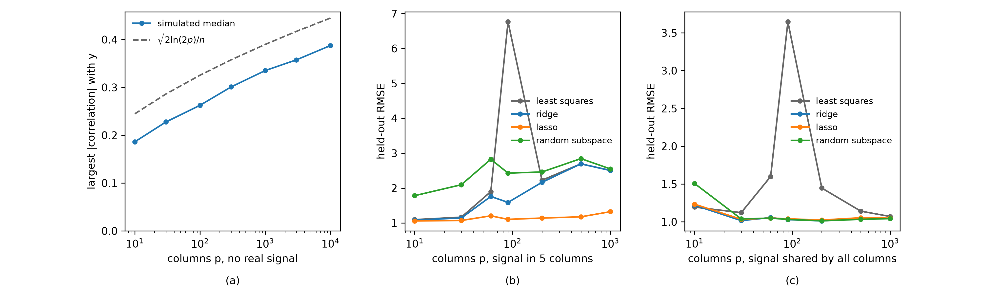

# Overfitting In Wide Data
Rev. 2 | Created: 2026-09-06 | Updated: 2026-09-07 16:33 CDT

## 1. Purpose

- **Problem Statement**: 반도체 계측 자료, 유전자 발현 자료, 장비 sensor 요약값처럼 열의 수 $p$ 가 행의 수 $n$ 에 견주어 큰 자료에서는 overfitting 이 사고가 아니라 기본 상태이므로, 방어를 뒤에 얹으면 이미 보고된 오차가 낙관적으로 기운 뒤이다.
- **Goal**: Overfitting 이 생기는 자리를 셋으로 가려내고, 자료의 신호가 놓인 모양에 따라 어느 방어를 고를지와 그 효과를 어떤 절차로 잴지를 정할 수 있게 한다.
- **Non-Goal**: Deep learning 고유의 정칙화 (regularization), 시계열 고유의 검증 설계, 결측과 이상값 처리는 다루지 않는다.

## 2. Summary

방어의 우열은 방법 자체로 정해지지 않고 **자료의 신호가 몇 개의 열에 모여 있는지** 로 갈린다. 신호가 소수의 열에 있으면 선택을 함께 수행하는 lasso 가, 여러 열에 퍼져 있으면 계수를 고르게 줄이는 ridge 와 projection 과 random subspace 가 맞는다.

3.2 의 모의 실험이 그 갈림을 보인다. 신호가 5 개 열에만 있는 자료에서 lasso 는 도달 가능한 바닥 1.0 에 가까운 1.32 를 냈지만 ridge 는 2.50, random subspace 는 2.55 에 머물렀다. 신호가 모든 열에 퍼진 자료에서는 ridge 1.04, random subspace 1.04, lasso 1.05 로 셋이 나란해졌다. 최소제곱은 두 경우 모두 $p$ 가 $n$ 에 가까워지는 지점에서 무너졌다.

방어를 무엇으로 고르든 절차는 하나로 고정된다. 중심과 척도, 열 선택, hyperparameter 조정, projection 적합은 모두 학습 fold 안에서 끝내고, 성능은 nested cross-validation 으로 재며, 그 값이 우연 수준을 넘는지 permutation test 로 확인한다.

## 3. Principle

### 3.1 Three Sources

원인은 셋이며 서로 다른 자리에서 생긴다. Table 1 이 그 셋이다.

Table 1. Three sources of overfitting in wide data

| # | Source | What happens | What it looks like |
|---|--------|--------------|--------------------|
| 1 | More parameters than rows | Exact fits without a unique solution | Training error zero, coefficients unstable |
| 2 | Chance correlation | An unrelated column matching the response by luck | A strong-looking predictor that does not reproduce |
| 3 | Selection bias | Columns chosen while looking at the whole sample | Cross-validation error far below test error |

첫째 원인은 대수적이다. 최소제곱해는 아래 식으로 얻는데, $p \gt n$ 이면 $X^{\top}X$ 가 특이 행렬이어서 역행렬이 없고, 훈련 잔차 (residual) 를 0 으로 만드는 해가 무수히 많다. 그 가운데 어느 것을 골라도 훈련 자료는 완벽하게 설명되므로, 훈련 오차는 model 이 좋은지에 대해 아무것도 말해 주지 않는다.

$$\hat{\beta} = (X^{\top}X)^{-1} X^{\top} y \hspace{19em} (1)$$

둘째 원인은 확률적이다. 응답과 아무 관계가 없는 열이라도 $n$ 개의 관측에서는 우연히 상관 (correlation) 을 보인다. 열이 많아질수록 그중 가장 큰 상관은 커지며, 독립인 열 $p$ 개에서 그 크기는 아래 값에 가깝다.

$$\max_j |r_j| \approx \sqrt{\frac{2 \ln (2p)}{n}} \hspace{19em} (2)$$

셋째 원인은 절차에서 온다. 전체 자료를 보고 열을 고른 뒤 그 열로 cross-validation 을 돌리면, 고르는 단계에서 이미 검증 자료를 쓴 것이므로 오차가 낙관적으로 나온다. 이 편향은 열이 많을수록 커지며, 식 (2) 가 말하는 규모의 우연 상관이 그 편향의 재료가 된다.

### 3.2 Evidence From A Simulation

앞의 세 원인 가운데 둘은 숫자로 바로 보인다. Fig 1 은 $n = 100$ 을 고정하고 열의 수만 늘리며 관찰한 것이다.

Fig 1. Chance correlation and held-out error as the column count grows

(a) 는 응답과 아무 관계가 없는 열만으로 만든 자료에서 가장 큰 절대 상관이다. 열이 100 개면 0.26, 10000 개면 0.39 에 이른다. 실무에서 0.39 의 상관은 보고서에 실릴 만한 값이지만, 여기서는 신호가 하나도 없는 자료에서 나온 값이다. 점선은 식 (2) 의 근사이며, 모의 실험의 중앙값이 그 아래에서 같은 모양으로 자란다.

(b) 는 신호가 5 개 열에만 있는 자료에서 held-out 오차이다. 잡음 (noise) 의 표준편차가 1 이므로 1.0 이 도달 가능한 바닥이다. 최소제곱은 $p$ 가 $n$ 에 가까워지는 90 에서 6.76 까지 치솟고, ridge 도 $p = 1000$ 에서 2.50 에 머문다. Lasso 만 1.32 로 바닥 가까이 남는다.

(c) 는 신호가 몇 개의 잠재 factor 를 통해 모든 열에 퍼져 있는 자료이다. 여기서는 ridge 1.04, random subspace 1.04, lasso 1.05 로 셋이 모두 바닥에 붙고, 최소제곱만 $p = 90$ 에서 3.65 로 무너진다.

두 panel 의 차이가 2 장의 결론을 만든 근거이다. 같은 $p$ 와 같은 $n$ 에서 방법의 순위가 뒤집혔으므로, 순위를 정하는 것은 방법이 아니라 신호가 놓인 모양이다.

## 4. Application

### 4.1 Families Of Defense

방어는 무엇을 줄이는지에 따라 다섯 갈래이다. Table 2 가 그 갈래와 각각이 줄이는 대상이다.

Table 2. Five families of defense

| # | Family | What it reduces | Representative method |
|---|--------|-----------------|-----------------------|
| 1 | Regularization | The size the coefficients may take | Ridge, lasso, elastic net |
| 2 | Subspace ensemble | The columns one model may see | Random subspace, random forest |
| 3 | Projection | The dimension the model is fitted in | PCR, PLS |
| 4 | Selection | The columns that enter the model at all | Filter, wrapper, embedded |
| 5 | Protocol | The optimism of the reported error | Nested cross-validation, permutation test |

앞의 넷은 model 을 바꾸고, 다섯째는 model 을 바꾸지 않는다. 다섯째를 빼면 앞의 넷이 정말 도움이 되었는지 알 수 없으므로, 순서로는 다섯째가 먼저이다.

### 4.2 Random Subspace Method

#### How It Works

Random subspace method 는 행은 모두 그대로 두고 열만 무작위로 $k \lt p$ 개 뽑아 model 하나를 학습시키는 일을 $B$ 번 되풀이한 뒤, $B$ 개의 예측을 평균이나 투표로 합치는 방법이다 [[1](#ref-1)]. 개별 model 은 $k$ 개의 열만 보므로 $k$ 를 $n$ 보다 작게 두면 각 model 에서는 wide data 문제가 사라진다.

#### Why Averaging Helps

$B$ 개 model 의 예측이 각각 분산 (variance) $\sigma^2$ 을 가지고 서로 상관 $\rho$ 를 가질 때, 평균한 예측의 분산은 아래와 같다.

$$\sigma_{\mathrm{avg}}^2 = \rho \sigma^2 + \frac{1 - \rho}{B} \sigma^2 \hspace{19em} (3)$$

$B$ 를 키우면 둘째 항은 0 으로 가지만 첫째 항은 남는다. 그러므로 model 을 많이 만드는 것보다 **model 들이 서로 덜 닮게 만드는 것** 이 중요하며, 열을 무작위로 뽑는 일이 바로 $\rho$ 를 낮추는 장치이다.

#### Choosing The Subspace Size

$k$ 는 이 방법의 유일한 주요 hyperparameter 이다. $k$ 를 키우면 개별 model 이 정확해지지만 서로 닮아 $\rho$ 가 올라가고, 줄이면 $\rho$ 는 내려가지만 개별 model 이 약해진다. Random forest 의 관례는 분류에서 $k = \sqrt{p}$, 회귀에서 $k = p/3$ 이며 [[2](#ref-2)], 출발점으로 쓰고 검증으로 조정한다.

#### When It Does Not Help

이 방법은 신호가 여러 열에 퍼져 있다는 가정 위에 서 있다. 무작위로 뽑은 $k$ 개 안에 쓸 만한 열이 들어 있어야 개별 model 이 쓸모가 있기 때문이다. Fig 1(b) 처럼 신호가 5 개 열에만 있고 $p$ 가 1000 이면 $k = \sqrt{p} \approx 31$ 개를 뽑아도 그 5 개가 들어갈 확률이 낮아, 대부분의 model 이 잡음만 보고 학습한다. 같은 그림에서 random subspace 가 2.55 로 lasso 의 1.32 보다 훨씬 나쁜 이유가 이것이다. 반대로 Fig 1(c) 처럼 신호가 모든 열에 퍼져 있으면 1.04 로 최선의 방법들과 같아진다.

#### Relation To Bagging And Random Forest

Bagging 은 행을 무작위로 뽑고, random subspace method 는 열을 무작위로 뽑는다. Random forest 는 이 둘을 함께 쓰되 열을 뽑는 자리를 node 분할마다로 옮긴 것이다 [[2](#ref-2)]. 그러므로 random forest 를 쓰고 있다면 이 방법을 이미 쓰고 있는 것이며, 따로 얹을 필요는 없다.

### 4.3 Regularization

#### Ridge

Ridge 는 잔차 제곱합에 계수 (coefficient) 의 제곱합을 벌점 (penalty) 으로 더한다 [[3](#ref-3)].

$$\hat{\beta} = \arg\min_{\beta} \lVert y - X\beta \rVert_2^2 + \lambda \lVert \beta \rVert_2^2 \hspace{19em} (4)$$

$\lambda \gt 0$ 이면 $X^{\top}X + \lambda I$ 가 항상 가역이므로 $p \gt n$ 에서도 해가 하나로 정해진다. 상관이 큰 열들에 계수를 고르게 나누어 주므로 잠재 factor 형 자료에 잘 맞지만, 계수를 0 으로 만들지 않아 열을 골라 주지는 않는다.

#### Lasso And Elastic Net

Lasso 는 벌점을 절대값의 합으로 바꾼다 [[4](#ref-4)]. 이 형태는 일부 계수를 정확히 0 으로 만들어 열 선택을 함께 수행한다.

$$\hat{\beta} = \arg\min_{\beta} \lVert y - X\beta \rVert_2^2 + \lambda \lVert \beta \rVert_1 \hspace{19em} (5)$$

Lasso 에는 wide data 에서 두 가지 약점이 있다. 고를 수 있는 열이 최대 $n$ 개로 묶이고, 상관이 큰 열 무리에서 하나만 남기고 나머지를 버려 표본이 조금만 달라져도 선택이 바뀐다. Elastic net 은 두 벌점을 함께 두어 그 약점을 줄인다 [[5](#ref-5)].

$$\hat{\beta} = \arg\min_{\beta} \lVert y - X\beta \rVert_2^2 + \lambda_1 \lVert \beta \rVert_1 + \lambda_2 \lVert \beta \rVert_2^2 \hspace{19em} (6)$$

#### Choosing Between Them

선택 기준은 신호가 몇 개의 열에 있다고 보는지이다. 신호가 소수의 열에 있으면 lasso 가, 모든 열에 퍼져 있으면 ridge 가 맞으며, 상관이 큰 무리에 신호가 있으면 elastic net 이 둘 사이를 메운다. 어느 쪽인지 모르면 elastic net 의 혼합 비율을 검증으로 정하는 것이 가장 단순한 답이다.

### 4.4 Projection Before Regression

투영 (projection) 은 열을 고르는 대신 열들의 선형 결합 몇 개로 자료를 줄인 뒤 그 위에서 회귀한다. PCR 은 분산이 큰 방향으로 줄이고, PLS 는 응답과의 공분산 (covariance) 이 큰 방향으로 줄인다 [[6](#ref-6)].

둘의 차이는 응답을 보는지에 있다. PCR 의 방향은 $y$ 를 보지 않고 정해지므로 분산은 크지만 예측에 쓸모없는 방향이 앞자리를 차지할 수 있고, 그러면 뒤로 밀린 성분 (component) 을 잘라 낼 때 신호까지 잘려 나간다. PLS 는 그 위험이 없는 대신 응답을 보았으므로, 성분 수를 정하는 일이 곧 model 복잡도를 정하는 일이 되어 4.5 와 4.6 의 절차가 더 중요해진다.

### 4.5 Feature Selection Without Selection Bias

열 선택은 세 갈래이다. Filter 는 model 과 무관한 지표로 미리 거르고, wrapper 는 model 성능으로 열 조합을 탐색하며, embedded 는 lasso 처럼 학습 과정에서 선택이 함께 일어난다. Wide data 에서 wrapper 는 탐색 공간이 $2^p$ 로 커져 실용적이지 않으므로 filter 와 embedded 가 주로 쓰인다.

어느 갈래를 쓰든 규칙은 하나다. **선택은 학습 fold 안에서만 일어나야 한다.** 전체 자료로 열을 고른 뒤 cross-validation 을 돌리면, 무작위 label 로 만든 자료에서도 오차가 크게 낮아진다. 유전자 발현 자료에서 이 편향이 실제로 얼마나 큰지를 보인 보고가 있으며, 신호가 전혀 없는 자료에서도 낙관적인 오차가 나왔다 [[7](#ref-7)].

### 4.6 Validation Protocol

방어를 얹었는지보다 그 효과를 어떻게 쟀는지가 더 자주 문제가 된다. Table 3 은 학습 fold 안에서 해야 하는 일과 그것을 밖에서 하면 생기는 결과이다.

Table 3. What belongs inside the training fold

| # | Step | If done outside the fold |
|---|------|--------------------------|
| 1 | Centering and scaling | Test rows leak their location and spread |
| 2 | Column selection | Optimistic error even with random labels |
| 3 | Hyperparameter tuning | The reported error is a tuning score, not a test score |
| 4 | Projection fitting | Components chosen with the test rows in view |

Hyperparameter 를 cross-validation 으로 고르고 같은 cross-validation 의 오차를 성능으로 보고하면 그 값은 낙관적이다. 바깥 loop 이 성능을 재고 안쪽 loop 이 hyperparameter 를 고르는 nested cross-validation 이 이 문제의 표준 해법이며, 표본이 작을수록 두 값의 차이가 커진다 [[8](#ref-8)].

두 가지를 함께 두면 판단이 쉬워진다. 하나는 permutation test 로, 응답을 무작위로 섞은 자료에 같은 절차를 그대로 돌려 성능이 우연 수준으로 떨어지는지 확인한다. 다른 하나는 learning curve 로, 행을 늘려 가며 오차가 내려가는지 본다. 앞의 것은 절차의 편향을, 뒤의 것은 표본 부족을 드러낸다.

## 5. Comparison

방법은 자료의 모양에서 정해지며, 정하는 순서는 늘 같다. 신호가 어디에 있다고 보는지를 먼저 정하고, 그에 맞는 방어를 고르고, 마지막으로 그 선택이 옳았는지를 정직한 절차로 확인한다. Table 4 가 그 첫 단계에서 자료의 모양이 방법으로 이어지는 길이다.

Table 4. Method by the shape of the data

| # | Situation | Method | Why |
|---|-----------|--------|-----|
| 1 | Signal expected in a few columns | Lasso or elastic net | Selection is part of the fit |
| 2 | Signal spread over correlated columns | Ridge, PLS, or random subspace | Nothing has to be discarded |
| 3 | Columns grouped by sensor or wafer | Group-aware split with any of the above | The split has to match the grouping |
| 4 | Response non-linear in the columns | Random forest | Subspace sampling and trees in one fit |
| 5 | Any of the above, before reporting | Nested cross-validation and permutation test | The number has to survive an honest protocol |

세 단계 가운데 마지막을 건너뛰면 앞의 둘이 무엇을 했는지 알 수 없다. 그 확인이 4.6 의 절차이며, 자료의 모양을 잘못 짚었더라도 거기서 드러난다.

## 6. Further Work

- **신호가 놓인 모양을 자료에서 추정하는 절차**: 2 장의 갈림을 짐작이 아니라 자료로 정하는 일. Lasso 와 ridge 를 같은 분할에서 나란히 돌려 held-out 오차를 견주고, lasso 가 남긴 계수의 수를 함께 보아 신호가 몇 개의 열에 모여 있는지를 추정한 뒤 방어를 고르는 단계를 표준 흐름에 넣는다. 지금인 이유는 Fig 1 이 두 모양에서 방법의 순위가 뒤집힌다는 것을 보였으므로, 모양을 모르는 채 방법을 고르는 것이 곧 오차를 두 배로 두는 선택임이 확인되었기 때문이다. 필요한 것은 과거 자료에서 잰 held-out 오차와, 두 방법을 같은 분할에 태우는 script 이다.
- **열의 group 을 단위로 뽑는 subspace**: Random subspace 가 열을 하나씩 독립으로 뽑는 대신, 같은 sensor 나 같은 계측 단계에서 나온 열 묶음을 단위로 뽑는 일. 식 (3) 의 $\rho$ 를 낮추는 것이 이 방법의 유일한 장치인데, 상관이 큰 열들이 여러 subspace 에 흩어져 들어가면 model 들이 서로 닮아 그 장치가 약해진다. 지금인 이유는 계측 자료의 열 이름이 sensor 와 단계의 식별자를 이미 담고 있어 묶음을 자료에서 바로 읽을 수 있기 때문이다. 필요한 것은 열 group 식별자의 규약과, 그 단위로 subspace 를 뽑아 $\rho$ 의 변화를 재는 구현이다.

## References

[1] Ho, T. K., [The Random Subspace Method for Constructing Decision Forests](https://doi.org/10.1109/34.709601). *IEEE Transactions on Pattern Analysis and Machine Intelligence*, 20(8), 832-844, 1998. 
[2] Breiman, L., [Random Forests](https://doi.org/10.1023/A:1010933404324). *Machine Learning*, 45(1), 5-32, 2001. 
[3] Hoerl, A. E. and Kennard, R. W., [Ridge Regression: Biased Estimation for Nonorthogonal Problems](https://doi.org/10.1080/00401706.1970.10488634). *Technometrics*, 12(1), 55-67, 1970. 
[4] Tibshirani, R., [Regression Shrinkage and Selection Via the Lasso](https://doi.org/10.1111/j.2517-6161.1996.tb02080.x). *Journal of the Royal Statistical Society: Series B (Methodological)*, 58(1), 267-288, 1996. 
[5] Zou, H. and Hastie, T., [Regularization and Variable Selection via the Elastic Net](https://doi.org/10.1111/j.1467-9868.2005.00503.x). *Journal of the Royal Statistical Society: Series B (Statistical Methodology)*, 67(2), 301-320, 2005. 
[6] Wold, S., Sjöström, M. and Eriksson, L., [PLS-regression: a basic tool of chemometrics](https://doi.org/10.1016/S0169-7439(01)00155-1). *Chemometrics and Intelligent Laboratory Systems*, 58(2), 109-130, 2001. 
[7] Ambroise, C. and McLachlan, G. J., [Selection bias in gene extraction on the basis of microarray gene-expression data](https://doi.org/10.1073/pnas.102102699). *Proceedings of the National Academy of Sciences*, 99(10), 6562-6566, 2002. 
[8] Varma, S. and Simon, R., [Bias in error estimation when using cross-validation for model selection](https://doi.org/10.1186/1471-2105-7-91). *BMC Bioinformatics*, 7, 91, 2006.

---

## Appendix A. Terminology

- **bagging**: 행을 복원 추출하여 만든 여러 표본으로 model 을 학습시키고 그 예측을 합치는 방법.
- **cross-validation**: 자료를 여러 fold 로 나누어 한 fold 를 남기고 학습한 뒤 그 fold 로 평가하는 일을 돌아가며 반복하는 절차.
- **elastic net**: 절대값 벌점과 제곱 벌점을 함께 두는 정칙화.
- **embedded selection**: 학습 과정 안에서 열 선택이 함께 일어나는 방식.
- **filter selection**: model 과 무관한 지표로 열을 미리 거르는 방식.
- **held-out error**: 학습에 쓰지 않은 자료에서 잰 오차.
- **hyperparameter**: 학습으로 정해지지 않고 밖에서 정해 주는 값.
- **lasso**: 절대값 벌점을 두어 일부 계수를 0 으로 만드는 정칙화.
- **latent factor**: 여러 열이 함께 따르는, 관측되지 않는 소수의 변수.
- **learning curve**: 학습에 쓴 행의 수에 따른 오차의 변화를 그린 곡선.
- **nested cross-validation**: 바깥 loop 이 성능을 재고 안쪽 loop 이 hyperparameter 를 고르는 cross-validation.
- **overfitting**: model 이 학습 자료의 우연한 특징까지 따라가 새 자료에서 성능이 떨어지는 현상.
- **PCR**: Principal Component Regression. 분산이 큰 방향으로 줄인 뒤 회귀하는 방법.
- **permutation test**: 응답을 무작위로 섞은 자료에 같은 절차를 돌려 성능이 우연 수준인지 확인하는 검정.
- **PLS**: Partial Least Squares. 응답과의 공분산이 큰 방향으로 줄인 뒤 회귀하는 방법.
- **random forest**: 행 추출과 node 마다의 열 추출을 함께 쓰는 tree ensemble.
- **random subspace method**: 열만 무작위로 뽑아 학습시킨 model 여럿을 합치는 방법.
- **ridge**: 제곱 벌점을 두어 계수의 크기를 줄이는 정칙화.
- **RMSE**: Root Mean Squared Error. 오차 제곱의 평균에 제곱근을 취한 값.
- **wide data**: 열의 수가 행의 수에 견주어 크거나 더 큰 자료.
- **wrapper selection**: model 성능을 기준으로 열 조합을 탐색하는 방식.
