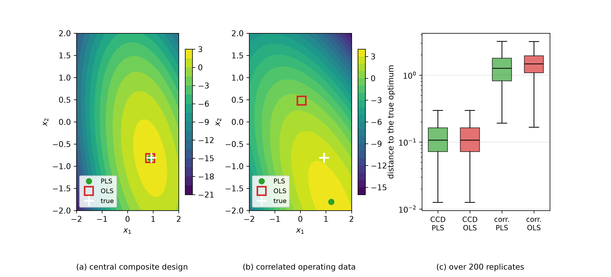

# PLS-RSM (Partial Least Squares Response Surface Methodology)
Rev. 1 | Created: 2026-09-06 | Updated: 2026-09-06 19:33 CDT

RSM approximates a process response by a second-order polynomial and reads the best operating condition off the stationary point of that surface; it has been the standard form of process optimization since Box and Wilson set it out [[1](#ref-1)]. PLS projects the predictors onto the directions of largest covariance with the response, so that regression and reduction finish in one pass even where the variables are entangled or outnumber the observations [[3](#ref-3)]. PLS-RSM, the subject of this document, is the two laid over each other: PLS rather than OLS fitted to an input matrix expanded to second order.

The name comes first. PLS-RSM is not an established method name in the literature. It is what process optimization papers have called the pairing when they use both, so this document treats it not as one algorithm but as a **set of design choices**. What changes at each of those choices is the content of the document.

## 1. Scope

- Covered: the procedure that fits a second-order surface with PLS, the choice of component count, the recovery of the surface and the reading of its stationary point, and what the combination actually buys.
- Not covered: the derivation of the PLS algorithm, the optimality theory of experimental design itself, nonlinear PLS in general [[5](#ref-5)].
- Assumed: at least one response $y$, continuous process factors as inputs, and factors that are either entangled with one another or numerous.

## 2. Why The Two Are Combined

The standard RSM procedure fits the second-order model by OLS.

$$\hat{y} = b_0 + \mathbf{x}^{\top}\mathbf{b} + \mathbf{x}^{\top}\mathbf{B}\mathbf{x}$$

Here $\mathbf{b}$ is the vector of first-order coefficients and $\mathbf{B}$ the symmetric matrix holding the square and interaction terms. With $k$ factors the count of coefficients to estimate grows to $1 + k + k(k+1)/2$, which is 28 at $k = 6$ and 66 at $k = 10$. OLS requires $(\mathbf{X}^{\top}\mathbf{X})^{-1}$, so it breaks in two places. With fewer runs than coefficients the inverse does not exist at all, and with entangled columns it exists but the variance of the coefficients inflates, so the stationary point moves far on a small disturbance of the data.

PLS asks for no such inverse. It finds one component direction $\mathbf{w}$ at a time under the objective below, then looks for the next direction in the residual left after removing the score of the one it found [[2](#ref-2)].

$$\max_{\lVert \mathbf{w} \rVert = 1} \mathrm{Cov}(\mathbf{X}\mathbf{w},\, y)^2$$

The component count $A$ is the only hyperparameter and the only regularisation strength, and raising $A$ makes PLS converge on OLS. That fixes the character of the combination: PLS-RSM does not replace OLS so much as choose, through $A$, where to stand between OLS and a reduced solution.

## 3. The Expanded Input Matrix

The first step of the procedure is to widen the input to second order. A row $\mathbf{x}$ of $k$ factors expands into the columns below.

Table 1. Columns of the expanded matrix

| Block | Columns | Count |
|-------|---------|-------|
| Linear | $x_1, \ldots, x_k$ | $k$ |
| Square | $x_1^2, \ldots, x_k^2$ | $k$ |
| Interaction | $x_i x_j,\ i \lt j$ | $k(k-1)/2$ |

This expansion fixes the second half of the combination's character. Even where the original factors are independent, $x_i$ and $x_i^2$ are correlated, and without centring that correlation is severe. In other words, **the expansion itself manufactures the multicollinearity.** Coding the factors so that the centre of the region sits at zero is the RSM convention for that reason, and the convention holds whether or not PLS is used.

## 4. Fitting And Choosing The Component Count

PLS is fitted to the expanded matrix and the component count is chosen. That count is the only adjusting handle the method has, so the way it is chosen is the character of the model.

- Choose the $A$ that minimises the cross-validated RMSE. Designed data has few rows, so one fold moves the estimate a long way, and the $A$ that is chosen can change with the random split into folds.
- The rank of the expanded matrix caps $A$; past it no variance is left for a component to explain and the algorithm divides by zero.
- Raising $A$ to the rank makes PLS identical to OLS. A situation where the count is drawn to its maximum is a signal in itself: the reason for using PLS has gone.

Where the contribution of a variable has to be read, VIP is read alongside. VIP collects the share of the response each variable explains across the component space, and by convention a variable above 1 is taken as important [[6](#ref-6)]. In an expanded matrix, though, $x_i$, $x_i^2$ and $x_i x_j$ are scored separately, so the importance of one factor has to be read over the columns that factor takes part in.

## 5. Recovering The Surface

What PLS returns is not a loading in component space but a regression coefficient in the expanded variable space, so recovering the surface is a matter of putting those coefficients where they belong. Pairing column names with coefficients builds $\mathbf{b}$ and $\mathbf{B}$.

$$b_i = \hat{\beta}_{x_i}, \qquad B_{ii} = \hat{\beta}_{x_i^2}, \qquad B_{ij} = B_{ji} = \tfrac{1}{2}\hat{\beta}_{x_i x_j}$$

The interaction coefficient is halved because $\mathbf{x}^{\top}\mathbf{B}\mathbf{x}$ counts $B_{ij}$ and $B_{ji}$ twice. Miss that one line and the stationary point lands, quietly, in the wrong place.

The stationary point follows from setting the gradient to zero.

$$\mathbf{x}^{\ast} = -\tfrac{1}{2}\mathbf{B}^{-1}\mathbf{b}$$

What that point is, the eigenvalues of $\mathbf{B}$ decide [[8](#ref-8)]. All negative is a maximum, all positive a minimum, mixed signs a saddle. A saddle means there is no optimum inside the experimental region, and then what should be reported is not the stationary point but the direction of the ridge leading out of the region.

With several responses, a surface is built for each and the surfaces are tied together into one objective by a desirability function [[7](#ref-7)]. PLS handles several responses in a single model as well, but at the stage of locating the optimum each response has its own target, so a separate rule for tying them is still needed.

## 6. What The Combination Buys

What the combination buys can be checked. The script in [Appendix B](#appendix-b-python-example) takes one true surface and replicates two ways of collecting data 200 times each, measuring how far the stationary point located by PLS and by OLS falls from the true optimum.

- **Central composite design**: a rotatable design of factorial points, axial points and centre points [[1](#ref-1)], whose expanded matrix has a median condition number of 3.6. The other standard second-order design is Box-Behnken, which differs in using only three levels [[4](#ref-4)].
- **Correlated operating data**: observational data whose factors move together, with a median condition number of 337.2 after the same expansion.


<p>Fig 1. Fitted surfaces and the spread of the located optimum over 200 replicates</p>

Table 2. Distance from the located optimum to the true optimum

| Design | Method | Median | Q25 | Q75 |
|--------|--------|--------|-----|-----|
| CCD | PLS | 0.107 | 0.072 | 0.164 |
| CCD | OLS | 0.107 | 0.072 | 0.164 |
| Correlated | PLS | 1.265 | 0.818 | 1.790 |
| Correlated | OLS | 1.470 | 1.087 | 1.942 |

There are three things to read, and all three cut against overstating the combination.

First, **where the design is orthogonal PLS buys nothing.** On the CCD the two distance distributions agree to the decimal, and PLS was closer in 49.5% of the 200 replicates, which is indistinguishable from a coin toss. A good design lets cross-validation push the component count near the rank, at which PLS has converged on OLS.

Second, **on entangled data there is a gain, and it is small.** The median distance falls from 1.470 to 1.265 and PLS is closer in 57.5% of replicates. The direction is clear, but this does not turn bad data into good data.

Third, **the gap between the two data sets is far wider than the gap between the two methods.** The median distance opens from 0.107 to 1.265, more than tenfold. The question PLS-RSM answers is which regression to use, while what decides the accuracy of the optimum is how the data was obtained. The former cannot stand in for the latter.

## 7. Where It Is Used

- **Bio and pharmaceutical processes**: optimising culture and synthesis conditions where many entangled factors such as temperature, pH, agitation rate and nutrient concentration act together. Factors are numerous enough that a complete design is hard to afford.
- **Chemical and materials processes**: yield optimisation where spectra such as NIR or Raman enter as inputs. This is the classic place where variables outnumber observations, and the place PLS grew up in [[3](#ref-3)].
- **Quality engineering**: reading a direction for improvement out of operating records already accumulated. That data is not designed, so it belongs to the second case of section 6.

## 8. Cautions

- **The expansion manufactures collinearity.** Square and interaction terms are not orthogonal even where the original factors are. Without coding and centring, less is gained even from PLS.
- **The stationary point can be an extrapolation.** $-\frac{1}{2}\mathbf{B}^{-1}\mathbf{b}$ can land outside the experimental region, where no data supports the surface. When it does, report no value and solve a constrained optimisation on the boundary instead.
- **The component count is the model.** A large $A$ recovers the instability of OLS intact; a small one cannot express the curvature and pulls the optimum toward the centre. Do not use a fixed $A$ without cross-validation.
- **PLS is not a substitute for a design.** That is the third observation of section 6. Where the factors can be moved, design the experiment; PLS comes out when they cannot.
- **With several responses, set the optimisation rule separately.** Building several surfaces and choosing among them are different tasks.

## References

<a id="ref-1"></a>
[1] Box, G. E. P. and Wilson, K. B. (1951). [On the Experimental Attainment of Optimum Conditions](https://doi.org/10.1111/j.2517-6161.1951.tb00067.x). *Journal of the Royal Statistical Society: Series B*, 13(1), 1–38.

<a id="ref-2"></a>
[2] Wold, S., Ruhe, A., Wold, H. and Dunn, W. J. (1984). [The Collinearity Problem in Linear Regression. The Partial Least Squares (PLS) Approach to Generalized Inverses](https://doi.org/10.1137/0905052). *SIAM Journal on Scientific and Statistical Computing*, 5(3), 735–743.

<a id="ref-3"></a>
[3] Wold, S., Sjöström, M. and Eriksson, L. (2001). [PLS-regression: a basic tool of chemometrics](https://doi.org/10.1016/S0169-7439(01)00155-1). *Chemometrics and Intelligent Laboratory Systems*, 58(2), 109–130.

<a id="ref-4"></a>
[4] Box, G. E. P. and Behnken, D. W. (1960). [Some New Three Level Designs for the Study of Quantitative Variables](https://doi.org/10.1080/00401706.1960.10489912). *Technometrics*, 2(4), 455–475.

<a id="ref-5"></a>
[5] Wold, S., Kettaneh-Wold, N. and Skagerberg, B. (1989). [Nonlinear PLS modeling](https://doi.org/10.1016/0169-7439(89)80111-X). *Chemometrics and Intelligent Laboratory Systems*, 7(1–2), 53–65.

<a id="ref-6"></a>
[6] Chong, I.-G. and Jun, C.-H. (2005). [Performance of some variable selection methods when multicollinearity is present](https://doi.org/10.1016/j.chemolab.2004.12.011). *Chemometrics and Intelligent Laboratory Systems*, 78(1–2), 103–112.

<a id="ref-7"></a>
[7] Derringer, G. and Suich, R. (1980). [Simultaneous Optimization of Several Response Variables](https://doi.org/10.1080/00224065.1980.11980968). *Journal of Quality Technology*, 12(4), 214–219.

<a id="ref-8"></a>
[8] Myers, R. H., Montgomery, D. C. and Anderson-Cook, C. M. (2016). *Response Surface Methodology: Process and Product Optimization Using Designed Experiments* (4th ed.). [Wiley](https://www.wiley.com/en-us/Response+Surface+Methodology:+Process+and+Product+Optimization+Using+Designed+Experiments,+4th+Edition-p-9781118916018). ISBN 978-1-118-91601-8.

---

## Appendix A. Terminology

- **canonical analysis**: the procedure that reads the eigenvalues of $\mathbf{B}$ at the stationary point to say whether that point is a maximum, a minimum or a saddle.
- **CCD**: central composite design, which estimates a second-order model from factorial points, axial points and centre points.
- **coded variable**: a dimensionless factor whose experimental region has been shifted so that the centre is 0 and the factorial levels are ±1.
- **condition number**: the ratio of the largest singular value of a matrix to the smallest; the larger it is, the more the coefficient estimates move with a disturbance of the data.
- **desirability**: a function that maps several responses each into the interval between 0 and 1 and ties them into one quantity to optimise.
- **latent variable**: a new variable obtained by projecting the data onto a component direction found by PLS, also called a score.
- **OLS**: ordinary least squares, the regression that minimises the sum of squared residuals.
- **rank**: the number of linearly independent columns of a matrix, which caps the PLS component count.
- **RMSE**: root mean squared error, the square root of the mean squared residual.
- **rotatable design**: a design whose prediction variance is the same at every point equidistant from the centre.
- **stationary point**: the point at which the gradient of the fitted surface is zero.
- **VIP**: variable importance in the projection, the share of the response each variable explains across the component space.

## Appendix B. Python Example

The script that produced Fig 1 and Table 2 of section 6. It replicates the two designs against the same true surface and goes through expansion, fitting, recovery of the surface and computation of the stationary point in turn, leaving the distance distribution behind. Run with no arguments it reproduces the document's results, and `-h` shows the values that can be adjusted.

```python
# Models/Regression/PLS-RSM/pls_rsm.py
__author__ = 'yRocket'
__version__ = "0.0.0.2026.9.6"  # Semantic Versioning: Major.Minor.Patch.Date(YYYY.M.D)

import argparse
import enum
import itertools
import pathlib
import sys
import warnings

import matplotlib
import numpy as np
import pandas as pd
from matplotlib import pyplot as plt
from matplotlib.colors import TABLEAU_COLORS
from scipy import linalg
from sklearn.cross_decomposition import PLSRegression
from sklearn.model_selection import KFold, cross_val_predict

__all__ = [
    'Design',
    'central_composite_design',
    'correlated_operating_data',
    'expand_quadratic',
    'true_response',
    'quadratic_from_coefficients',
    'stationary_point',
    'fit_pls_surface',
    'fit_ols_surface',
    'run',
]

FIGSIZE: tuple = (11.0, 5.0)
REFERENCE_WIDTH: float = 11.0    # the width BASE_FONT_SIZE was chosen for
BASE_FONT_SIZE: float = 10.0
FIGURE_DPI: int = 300
CONTOUR_GRID: int = 160          # samples per axis in the contour grid
COLORS: list = list(TABLEAU_COLORS.values())

N_FACTORS: int = 3
TRUE_INTERCEPT: float = 78.0
TRUE_LINEAR: np.ndarray = np.array([1.95, -0.55, 3.10])
TRUE_QUADRATIC: np.ndarray = np.array([
    [-2.00, -0.60, 0.45],
    [-0.60, -1.40, -0.35],
    [0.45, -0.35, -2.60],
])


DESIGN_LABELS: dict = {'ccd': 'CCD', 'correlated': 'corr.'}


class Design(enum.StrEnum):
    """Names of the two designs the script contrasts."""

    CCD = enum.auto()
    CORRELATED = enum.auto()


def true_response(x: np.ndarray, noise_sd: float = 0.0, rng: np.random.Generator = None) -> np.ndarray:
    """Evaluate the true quadratic surface at the coded settings in the rows of `x`."""
    if noise_sd < 0.0:
        raise ValueError(f"noise_sd must be non-negative, got {noise_sd}.")
    if noise_sd > 0.0 and rng is None:
        raise ValueError("rng is required when noise_sd is positive; pass a numpy Generator.")
    quadratic = np.einsum('ij,jk,ik->i', x, TRUE_QUADRATIC, x)
    y = TRUE_INTERCEPT + x @ TRUE_LINEAR + quadratic
    if noise_sd > 0.0:
        y = y + rng.normal(loc=0.0, scale=noise_sd, size=y.shape)
    return y


def central_composite_design(n_factors: int = N_FACTORS, n_center: int = 6) -> np.ndarray:
    """Build a rotatable central composite design: a full factorial, star points at alpha, and centers."""
    if n_factors < 2:
        raise ValueError(f"a response surface needs at least two factors, got {n_factors}.")
    if n_center < 1:
        raise ValueError(f"n_center must be at least one, got {n_center}.")
    factorial = np.array(list(itertools.product([-1.0, 1.0], repeat=n_factors)))
    alpha = float(len(factorial)) ** 0.25          # the value that makes the design rotatable
    star = np.zeros((2 * n_factors, n_factors))
    for i in range(n_factors):
        star[2 * i, i] = alpha
        star[2 * i + 1, i] = -alpha
    center = np.zeros((n_center, n_factors))
    return np.vstack([factorial, star, center])


def correlated_operating_data(n_runs: int, correlation: float, rng: np.random.Generator) -> np.ndarray:
    """Draw settings the way an unplanned process record supplies them, with the factors tied together."""
    if not 0.0 <= correlation < 1.0:
        raise ValueError(f"correlation must be in [0, 1), got {correlation}.")
    if n_runs < 1:
        raise ValueError(f"n_runs must be positive, got {n_runs}.")
    driver = rng.normal(size=n_runs)
    independent = rng.normal(size=(n_runs, N_FACTORS))
    x = correlation * driver[:, None] + (1.0 - correlation) * independent
    return x / np.std(x, axis=0, ddof=1)


def expand_quadratic(x: np.ndarray) -> tuple:
    """Append squares and two-factor products to `x`, returning the expanded matrix and its column names."""
    n_factors = x.shape[1]
    names = [f"x{i + 1}" for i in range(n_factors)]
    columns = [x]
    columns.append(x ** 2)
    names += [f"x{i + 1}^2" for i in range(n_factors)]
    pairs = list(itertools.combinations(range(n_factors), 2))
    if pairs:
        columns.append(np.column_stack([x[:, i] * x[:, j] for i, j in pairs]))
        names += [f"x{i + 1}x{j + 1}" for i, j in pairs]
    return np.hstack(columns), names


def quadratic_from_coefficients(coefficients: np.ndarray, names: list, n_factors: int) -> tuple:
    """Split expanded-space coefficients into the linear vector b and the symmetric matrix B of the surface."""
    if len(coefficients) != len(names):
        raise ValueError(f"got {len(coefficients)} coefficients for {len(names)} names.")
    index = {name: position for position, name in enumerate(names)}
    b = np.array([coefficients[index[f"x{i + 1}"]] for i in range(n_factors)])
    matrix = np.zeros((n_factors, n_factors))
    for i in range(n_factors):
        matrix[i, i] = coefficients[index[f"x{i + 1}^2"]]
    for i, j in itertools.combinations(range(n_factors), 2):
        half = 0.5 * coefficients[index[f"x{i + 1}x{j + 1}"]]
        matrix[i, j] = half
        matrix[j, i] = half
    return b, matrix


def stationary_point(b: np.ndarray, matrix: np.ndarray) -> tuple:
    """Solve for the stationary point of the fitted surface and return it with the eigenvalues that classify it."""
    eigenvalues = np.linalg.eigvalsh(matrix)
    if np.min(np.abs(eigenvalues)) < np.finfo(float).eps * max(1.0, np.max(np.abs(eigenvalues))):
        raise linalg.LinAlgError("the quadratic matrix is singular; the surface has no isolated stationary point.")
    return -0.5 * np.linalg.solve(matrix, b), eigenvalues


def fit_pls_surface(x_expanded: np.ndarray, y: np.ndarray, max_components: int, n_splits: int) -> tuple:
    """Choose the component count by cross-validated RMSE, refit on all rows, and return coefficients and the count."""
    # The rank caps the component count: past it a component carries no variance and PLS divides by zero.
    # A fold holds out rows, so the cap uses the rank of the smallest training set rather than of the whole.
    folds = KFold(n_splits=min(n_splits, x_expanded.shape[0]), shuffle=True, random_state=0)
    held_out = int(np.ceil(x_expanded.shape[0] / folds.get_n_splits()))
    rank = int(np.linalg.matrix_rank(x_expanded - x_expanded.mean(axis=0)))
    upper = min(max_components, rank, x_expanded.shape[0] - held_out - 1)
    if upper < 1:
        raise ValueError(f"no components are available for a {x_expanded.shape} design matrix of rank {rank}.")
    errors = []
    for n_components in range(1, upper + 1):
        with warnings.catch_warnings():
            # A fold can exhaust y before the cap, which leaves NaN predictions. That count and every larger
            # one are unusable, so the search stops there and says so instead of ranking a NaN error.
            warnings.simplefilter('ignore', category=RuntimeWarning)
            predicted = cross_val_predict(PLSRegression(n_components=n_components), x_expanded, y, cv=folds)
        if not np.all(np.isfinite(predicted)):
            print(f"PLS exhausted the response at {n_components} components; searching up to {n_components - 1}.",
                  file=sys.stderr)
            break
        errors.append(float(np.sqrt(np.mean((y - predicted.ravel()) ** 2))))
    if not errors:
        raise ValueError(f"no usable component count for a {x_expanded.shape} design matrix.")
    best = int(np.argmin(errors)) + 1
    model = PLSRegression(n_components=best).fit(x_expanded, y)
    return model.coef_.ravel(), best, errors


def fit_ols_surface(x_expanded: np.ndarray, y: np.ndarray) -> np.ndarray:
    """Solve the normal equations for the same expanded matrix, which is what PLS is being compared against."""
    design = np.column_stack([np.ones(len(x_expanded)), x_expanded])
    gram = design.T @ design
    # The solve is deliberately not replaced by a pseudo-inverse: a singular gram matrix is the finding,
    # not something to paper over, and the caller reports it.
    coefficients = linalg.solve(gram, design.T @ y, assume_a='pos')
    return coefficients[1:]


def evaluate_design(x: np.ndarray, y: np.ndarray, max_components: int, n_splits: int) -> dict:
    """Fit both surfaces to one design and collect what the document compares."""
    x_expanded, names = expand_quadratic(x=x)
    condition = float(np.linalg.cond(np.column_stack([np.ones(len(x_expanded)), x_expanded])))
    pls_coefficients, n_components, cv_errors = fit_pls_surface(
        x_expanded=x_expanded, y=y, max_components=max_components, n_splits=n_splits)
    pls_b, pls_matrix = quadratic_from_coefficients(
        coefficients=pls_coefficients, names=names, n_factors=x.shape[1])
    pls_optimum, pls_eigenvalues = stationary_point(b=pls_b, matrix=pls_matrix)
    result = {
        'n_runs': len(x),
        'condition_number': condition,
        'n_components': n_components,
        'cv_rmse': min(cv_errors),
        'pls_optimum': pls_optimum,
        'pls_eigenvalues': pls_eigenvalues,
        'pls_matrix': pls_matrix,
        'pls_b': pls_b,
    }
    try:
        ols_coefficients = fit_ols_surface(x_expanded=x_expanded, y=y)
    except (linalg.LinAlgError, np.linalg.LinAlgError) as error:
        print(f"OLS failed on this design: {error}", file=sys.stderr)
        result['ols_optimum'] = None
        result['ols_coefficient_norm'] = float('nan')
        return result
    ols_b, ols_matrix = quadratic_from_coefficients(
        coefficients=ols_coefficients, names=names, n_factors=x.shape[1])
    result['ols_coefficient_norm'] = float(np.linalg.norm(ols_coefficients))
    try:
        result['ols_optimum'] = stationary_point(b=ols_b, matrix=ols_matrix)[0]
    except (linalg.LinAlgError, np.linalg.LinAlgError) as error:
        print(f"OLS surface has no isolated stationary point: {error}", file=sys.stderr)
        result['ols_optimum'] = None
    return result


def plot_results(results: dict, distances: pd.DataFrame, true_optimum: np.ndarray,
                 output_path: pathlib.Path) -> None:
    """Draw the fitted surface of each design and the spread of the located optimum over the replicates."""
    font_size = BASE_FONT_SIZE * FIGSIZE[0] / REFERENCE_WIDTH
    matplotlib.rcParams.update({'font.size': font_size})
    grid = np.linspace(-2.0, 2.0, CONTOUR_GRID)
    mesh_1, mesh_2 = np.meshgrid(grid, grid)
    figure, axes = plt.subplots(1, 3, figsize=FIGSIZE)
    for axis, (design, result) in zip(axes[:2], results.items()):
        held = result['pls_optimum'][2]
        flat = np.column_stack([mesh_1.ravel(), mesh_2.ravel(), np.full(mesh_1.size, held)])
        surface = flat @ result['pls_b'] + np.einsum('ij,jk,ik->i', flat, result['pls_matrix'], flat)
        contour = axis.contourf(mesh_1, mesh_2, surface.reshape(mesh_1.shape), levels=18, cmap='viridis')
        figure.colorbar(contour, ax=axis, shrink=0.82)
        axis.plot(result['pls_optimum'][0], result['pls_optimum'][1], marker='o', markersize=7,
                  color=COLORS[2], linestyle='none', label='PLS')
        if result['ols_optimum'] is not None:
            # An open marker, drawn last, so that a PLS point underneath it still shows when the two coincide.
            axis.plot(result['ols_optimum'][0], result['ols_optimum'][1], marker='s', markersize=11,
                      markerfacecolor='none', markeredgewidth=2.0, color=COLORS[3], linestyle='none', label='OLS')
        # Drawn last so it stays readable where all three points coincide, as they do on the orthogonal design.
        axis.plot(true_optimum[0], true_optimum[1], marker='+', markersize=13, markeredgewidth=2.2,
                  color='white', linestyle='none', label='true')
        axis.set_xlabel('$x_1$')
        axis.set_ylabel('$x_2$')
        axis.set_xlim(grid[0], grid[-1])
        axis.set_ylim(grid[0], grid[-1])
        axis.legend(loc='lower left', framealpha=0.85, fontsize=font_size * 0.85)
    groups, positions, tick_labels = [], [], []
    for position, (design, method) in enumerate(itertools.product([str(d) for d in Design], ['pls', 'ols'])):
        selected = distances.loc[(distances['design'] == design) & (distances['method'] == method), 'distance']
        groups.append(selected.dropna().to_numpy())
        positions.append(position + 1)
        tick_labels.append(f"{DESIGN_LABELS[design]}\n{method.upper()}")
    box = axes[2].boxplot(groups, positions=positions, widths=0.6, patch_artist=True, showfliers=False)
    for patch, color in zip(box['boxes'], [COLORS[2], COLORS[3], COLORS[2], COLORS[3]]):
        patch.set_facecolor(color)
        patch.set_alpha(0.65)
    for median in box['medians']:
        median.set_color('black')
    axes[2].set_yscale('log')
    axes[2].set_xticks(positions, tick_labels, fontsize=font_size * 0.9)
    axes[2].set_ylabel('distance to the true optimum')
    axes[2].grid(axis='y', alpha=0.3)
    labels = ['(a) central composite design', '(b) correlated operating data',
              f"(c) over {distances['replicate'].nunique()} replicates"]
    for axis, label in zip(axes, labels):
        position = axis.get_position()
        figure.text(position.x0 + position.width / 2.0, 0.02, label, ha='center', va='bottom')
    figure.subplots_adjust(bottom=0.24, wspace=0.35)
    output_path.parent.mkdir(parents=True, exist_ok=True)
    figure.savefig(output_path, dpi=FIGURE_DPI)
    plt.close(figure)


def run(output_folder: pathlib.Path, n_runs: int, correlation: float, noise_sd: float, max_components: int,
        n_splits: int, seed: int, n_replicates: int) -> pd.DataFrame:
    """Run both designs over `n_replicates` draws and write the response table, the distances and the figure.

    Returns a pd.DataFrame indexed by (design, method), with columns median_distance, q25, q75,
    median_condition, median_components and n_failed.
    """
    if n_replicates < 1:
        raise ValueError(f"n_replicates must be positive, got {n_replicates}.")
    true_optimum = -0.5 * np.linalg.solve(TRUE_QUADRATIC, TRUE_LINEAR)
    ccd = central_composite_design()
    records, first_results, first_responses = [], {}, []
    for replicate in range(n_replicates):
        rng = np.random.default_rng(seed + replicate)
        designs = {
            Design.CCD: ccd,
            Design.CORRELATED: correlated_operating_data(n_runs=n_runs, correlation=correlation, rng=rng),
        }
        for design, x in designs.items():
            y = true_response(x=x, noise_sd=noise_sd, rng=rng)
            result = evaluate_design(x=x, y=y, max_components=max_components, n_splits=n_splits)
            for method, optimum in (('pls', result['pls_optimum']), ('ols', result['ols_optimum'])):
                records.append({
                    'replicate': replicate,
                    'design': str(design),
                    'method': method,
                    'condition_number': result['condition_number'],
                    'n_components': result['n_components'] if method == 'pls' else np.nan,
                    'distance': float('nan') if optimum is None else float(np.linalg.norm(optimum - true_optimum)),
                })
            if replicate == 0:
                first_results[design] = result
                frame = pd.DataFrame(x, columns=[f"x{i + 1}" for i in range(x.shape[1])])
                frame.insert(0, 'design', str(design))
                frame['y'] = y
                first_responses.append(frame)
    distances = pd.DataFrame.from_records(records)
    output_folder.mkdir(parents=True, exist_ok=True)
    pd.concat(first_responses, ignore_index=True).to_csv(output_folder / 'responses.csv', index=False)
    distances.to_csv(output_folder / 'distances.csv', index=False)
    grouped = distances.groupby(['design', 'method'])
    summary = pd.DataFrame({
        'median_distance': grouped['distance'].median(),
        'q25': grouped['distance'].quantile(0.25),
        'q75': grouped['distance'].quantile(0.75),
        'median_condition': grouped['condition_number'].median(),
        'median_components': grouped['n_components'].median(),
        'n_failed': grouped['distance'].apply(lambda column: int(column.isna().sum())),
    })
    summary.to_csv(output_folder / 'summary.csv')
    plot_results(results=first_results, distances=distances, true_optimum=true_optimum,
                 output_path=output_folder / 'README_fig' / 'pls-rsm-surfaces.png')
    print(f"true optimum: {np.array2string(true_optimum, precision=3)}")
    print(summary.to_string(float_format=lambda value: f"{value:.4g}"))
    return summary


def parse_args() -> argparse.Namespace:
    """Parse the command line, validate the combinations, and return the namespace."""
    parser = argparse.ArgumentParser(
        prog=pathlib.Path(__file__).name,
        description=f"{pathlib.Path(__file__).name} {__version__}\n"
                    "Fit a second-order response surface through PLS and locate its stationary point.",
        formatter_class=argparse.RawDescriptionHelpFormatter)
    parser.add_argument('-v', '--version', action='version', version=f"{pathlib.Path(__file__).name} {__version__}")
    parser.add_argument('--output-folder', type=pathlib.Path, default=pathlib.Path(__file__).parent,
                        help='root folder for the response table, the summary and the figure')
    parser.add_argument('--n-runs', type=int, default=20, help='runs in the correlated operating data')
    parser.add_argument('--correlation', type=float, default=0.85,
                        help='how strongly the factors of the correlated design move together, in [0, 1)')
    parser.add_argument('--noise-sd', type=float, default=0.35, help='standard deviation of the response noise')
    parser.add_argument('--max-components', type=int, default=9, help='largest PLS component count to consider')
    parser.add_argument('--n-splits', type=int, default=5, help='folds used to choose the component count')
    parser.add_argument('--n-replicates', type=int, default=200, help='independent draws the comparison is made over')
    parser.add_argument('--seed', type=int, default=20260906, help='seed for the response noise and the settings')
    args = parser.parse_args()
    if not 0.0 <= args.correlation < 1.0:
        parser.error(f"--correlation must be in [0, 1), got {args.correlation}")
    if args.noise_sd < 0.0:
        parser.error(f"--noise-sd must be non-negative, got {args.noise_sd}")
    if args.n_runs < N_FACTORS + 1:
        parser.error(f"--n-runs must exceed the factor count, got {args.n_runs}")
    if args.max_components < 1:
        parser.error(f"--max-components must be positive, got {args.max_components}")
    if args.n_splits < 2:
        parser.error(f"--n-splits must be at least two, got {args.n_splits}")
    if args.n_replicates < 1:
        parser.error(f"--n-replicates must be positive, got {args.n_replicates}")
    if args.output_folder.exists() and not args.output_folder.is_dir():
        parser.error(f"--output-folder is not a folder: {args.output_folder}")
    return args
```
