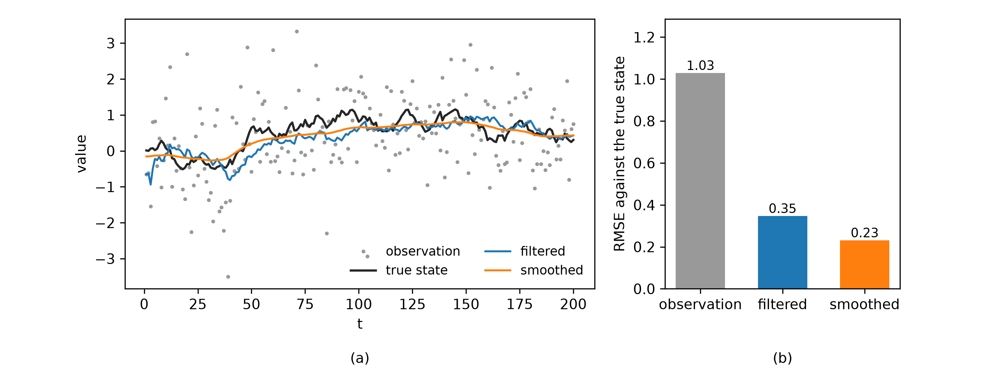

# TVC (Time-Varying Coefficient) Regression
Rev. 27 | Created: 2026-08-30 | Updated: 2026-08-31 03:41 CDT

보통의 회귀는 계수를 상수 하나로 고정한다. TVC 는 그 계수를 시간의 함수 $\beta(t)$ 로 확장한 model 이며, 같은 $X$ 라도 그것이 언제 있었느냐에 따라 결과에 미치는 영향이 달라지는 자료를 위한 것이다.

$$Y(t) = \beta_0(t) + \beta_1(t) X + \epsilon(t)$$

이 문서는 계수가 왜 움직이는지, $\beta(t)$ 를 어떤 형태로 두는지, 그것을 Kalman filter 로 어떻게 추정하는지, 그리고 그 추정을 PLS model 위에 얹는 방법을 차례로 정리한다. 마지막 것은 [Appendix B](#appendix-b-applying-tvp-to-a-pls-model) 에, 이 model 이 실제로 쓰이는 자리는 [Appendix C](#appendix-c-where-it-is-used) 에, filter 가 잡음을 걷어 내는 예는 [Appendix D](#appendix-d-how-much-noise-the-filter-removes) 에 둔다.

## 1. Scope

- 다루는 범위: $\beta(t)$ 의 함수 형태, state space 표현과 Kalman filter 추정, survival analysis 와 거시경제에서의 용례, PLS score 위에서의 적용.
- 다루지 않는 범위: constant-coefficient regression 의 추정 이론, Bayesian sampling 기반 추정, 비선형 filter.
- 전제: 관측에 시간 순서가 있고, 그 순서가 정보를 담고 있는 자료.

## 2. Why The Coefficient Moves

계수가 움직이는 이유는 자료마다 다르지만, 실제로 마주치는 형태는 몇 가지로 좁혀진다. Table 1 은 그 형태와 그것이 $\beta(t)$ 에 남기는 모양이다.

Table 1. Patterns of a moving coefficient

| # | Pattern | Example | Shape of $\beta(t)$ |
|---|---------|---------|---------------------|
| 1 | Decay | Advertising effect right after a launch | Large at first, monotonically shrinking |
| 2 | Delayed and inverted | Transplant surgery, hazardous early and protective later | Sign reversal after a crossing point |
| 3 | Structural change | Interest rate effect on growth across market regimes | Level shifts at regime boundaries |

계수를 상수로 두면 이 형태들이 지워진다. decay 를 상수로 적합하면 전 구간의 평균 효과가 나와 초기의 큰 효과도 후기의 작은 효과도 모두 틀리고, 부호가 뒤집히는 경우에는 두 구간이 상쇄되어 효과가 없다는 결론까지 나온다.

## 3. Forms Of The Coefficient

$\beta(t)$ 를 어떤 형태로 두느냐가 곧 model 의 유연성과 추정 부담을 정한다. 셋 중 어느 것을 고를지는 계수의 변화 모양을 사전에 얼마나 아는지에 달려 있다.

### 3.1 Parametric Form

변화의 모양이 알려져 있으면 그 모양을 함수로 직접 적는다.

$$\beta(t) = \beta_0 + \beta_1 t \qquad \text{or} \qquad \beta(t) = \beta_0 + \beta_1 \ln t$$

앞의 것은 영향력이 일정한 속도로 늘거나 줄어드는 경우, 뒤의 것은 초기에 빠르게 변하다 완만해지는 decay 에 맞는다. 추정할 parameter 가 둘뿐이라 표본이 적어도 안정적이고, 계수의 해석도 constant-coefficient regression 만큼 직관적이다. 대신 가정한 모양이 틀리면 그 틀림이 그대로 결론이 된다.

### 3.2 Spline And GAM

모양이 알려져 있지 않으면 $\beta(t)$ 를 basis function 의 합으로 두어 곡선의 선택을 자료에 맡긴다.

$$\beta(t) = \sum_{k=1}^{K} \gamma_k B_k(t)$$

$B_k$ 는 spline basis 이고 $\gamma_k$ 는 추정 대상이다. GAM 의 틀에서 smoothness penalty 를 함께 두면 $K$ 를 넉넉히 잡아도 overfitting 이 통제된다 [[1](#ref-1)]. sign reversal 이나 여러 번의 굴곡처럼 모양을 미리 적기 어려운 경우에 이 방법이 쓰인다.

### 3.3 Random Walk In A State Space

시간이 이산적이고 관측이 순서대로 도착한다면, 계수를 함수로 적는 대신 시점마다 하나씩 두고 그것들이 서서히 움직인다고 두는 방법이 있다. 이때 model 은 state space 형태를 얻는다. 4 장이 이 형태와 그 추정을 다룬다.

## 4. Estimation By Kalman Filter

### 4.1 State-Space Form

TVP model 은 두 방정식으로 정의된다. 둘을 가르는 기준은 그 값이 자료에 적혀 있는지이다. $y_t$ 와 $X_t$ 는 자료를 열면 숫자로 그대로 읽히지만, 계수 $\beta_t$ 는 어디에도 적혀 있지 않아 그 둘로부터 추정할 수밖에 없다. 그래서 앞의 것들을 잇는 아래 첫 식을 observation equation 이라 하고, 뒤엣것이 시간에 따라 어떻게 움직이는지를 적은 둘째 식을 state equation 이라 하며, 추정 대상인 $\beta_t$ 가 이 state space 의 state variable 이다.

constant-coefficient regression 에서도 계수는 자료에 적혀 있지 않다. 다만 미지수가 하나뿐이라 전체 자료로 한 번 추정하면 끝나므로 굳이 상태라 부르지 않는다. TVP 는 시점마다 다른 $\beta_t$ 를 두어 미지수를 시점 수만큼 만들고, 그것을 관측이 도착할 때마다 따라가며 추정해야 할 대상으로 삼는다.

**Observation equation**

$$y_t = X_t \beta_t + \epsilon_t, \qquad \epsilon_t \sim N(0, R)$$

**State equation**

$$\beta_t = \beta_{t-1} + v_t, \qquad v_t \sim N(0, Q)$$

Table 2 는 그 두 식에 나오는 기호와 각각이 맡는 역할이다.

Table 2. Terms of the state-space form

| Term | Role |
|------|------|
| $y_t$ | Observed response at time $t$ |
| $X_t$ | Observed covariates at time $t$ |
| $\beta_t$ | Coefficient at time $t$, the state variable |
| $\epsilon_t$ | Observation noise at time $t$ |
| $R$ | Variance of the observation noise |
| $v_t$ | State noise at time $t$, the shock that moves the coefficient |
| $Q$ | Variance of the state noise, how fast the coefficient may move |

$Q$ 는 계수의 이동 속도를 정하는 parameter 이다. $Q$ 가 0 이면 계수는 움직이지 않아 보통의 회귀로 되돌아가고, $Q$ 가 크면 계수가 관측을 그대로 따라가 잡음까지 계수의 변화로 읽는다.

두 잡음에 Gaussian 을 두는 이유는 셋이다. 첫째, Gaussian 은 이 model 이 하는 연산에 닫혀 있어, 선형 결합을 거치고 Gaussian 이 더해져도 Gaussian 으로 남는다. 그래서 $\beta_t$ 의 분포 전체가 평균과 분산 두 값으로 요약되고, 4.2 의 loop 이 시점마다 그 두 값만 옮기면 된다. 둘째, 그 가정 아래에서 filter 의 추정치가 conditional mean 과 같아져 mean squared error 를 최소로 한다. 셋째, prediction error 도 Gaussian 이 되어 likelihood 가 closed form 으로 적힌다.

가정이 틀렸을 때의 손실은 크지 않다. Gaussian 이 아니어도 filter 는 linear estimator 가운데에서는 여전히 최선이므로, 최적성이 선형 범위로 좁아질 뿐이다. 평균을 0 으로 둔 것은 별개의 가정으로, 잡음에 계통적 치우침이 없다는 뜻이다. 치우침이 있다면 그것은 잡음이 아니라 model 에 넣어야 할 항이다.

$Q$ 와 $R$ 도 자료에 적혀 있지 않으므로 추정해야 한다. 값을 하나 넣어 filter 를 돌리면 시점마다 prediction error $e_t$ 와 그 분산 $S_t$ 가 나오고, 그 둘로 자료의 likelihood 를 적을 수 있다. 그 likelihood 를 가장 크게 하는 값이 추정치이다.

$$(\hat{Q}, \hat{R}) = \arg\max_{Q,\, R} \; -\frac{1}{2} \sum_{t=1}^{n} \left( \ln S_t + \frac{e_t^2}{S_t} \right)$$

$e_t$ 와 $S_t$ 는 4.2 의 loop 이 내놓는 값이므로 이 식은 $Q$ 와 $R$ 에 대한 닫힌 해를 주지 않는다. 후보 값마다 filter 를 한 번 돌려 위 합을 계산하고 그 값을 수치적으로 최대화한다.

### 4.2 The Loop

4.1 은 두 방정식을 세울 뿐 상태 $\beta_t$ 의 값을 주지 않으므로, 그 값을 자료에서 뽑아내는 절차가 따로 필요하다. 그 절차가 Kalman filter 이며, R. E. Kalman 이 1960 년에 발표한 추정 방법의 이름을 그대로 쓴 것이다 [[2](#ref-2)]. Filter 라 부르는 것은 신호처리에서 잡음이 섞인 신호로부터 원 신호만 걸러내는 장치를 filter 라 하기 때문이며, 여기서 걸러 낼 원 신호는 상태 $\beta_t$ 이고 걸러 낼 잡음은 observation noise $\epsilon_t$ 이다.

이 filter 는 자료를 한꺼번에 놓고 푸는 대신 시점마다 예측과 갱신 두 단계를 반복하여 $\beta_t$ 의 추정치와 그 분산을 함께 갱신한다. Fig 1 이 그 절차이다.

```text
# Pseudocode
input  y[1..T], X[1..T], R, Q
output beta_hat[1..T], P[1..T]

beta_hat[0] = initial guess of the coefficient
P[0]        = initial uncertainty of that guess

for t = 1 .. T:

    # 1. predict: carry the estimate forward, widen its uncertainty by Q
    beta_prior = beta_hat[t-1]
    P_prior    = P[t-1] + Q

    # 2. update: correct the prediction with the observation that just arrived
    e = y[t] - X[t] beta_prior              # prediction error
    S = X[t] P_prior X[t]' + R              # its variance
    K = P_prior X[t]' / S                   # Kalman gain

    beta_hat[t] = beta_prior + K e
    P[t]        = (I - K X[t]) P_prior
```

Fig 1. The Kalman filter loop

예측 단계는 직전 추정치를 그대로 옮기고, 그 추정치의 분산 $P$ 에만 $Q$ 를 더한다. 계수가 random walk 를 한다고 두었으므로 다음 값의 최선의 추정은 직전 값이고, 그 사이에 계수가 움직였을 수 있으므로 분산은 커진다.

갱신 단계는 실제 관측 $y_t$ 가 도착한 뒤 prediction error $e_t$ 를 계산하고, 그 오차를 얼마나 반영할지를 Kalman gain $K_t$ 로 정한다. $K_t$ 는 두 불확실성의 비율이다. observation noise $R$ 이 크면 $K_t$ 가 작아져 새 관측의 반영이 줄고, 추정치의 분산 $P$ 가 크면 $K_t$ 가 커져 새 관측이 크게 반영된다.

### 4.3 Filtering And Smoothing

Filter 는 $t$ 시점까지의 정보만으로 $\beta_t$ 를 추정하므로 실시간 판단에 쓴다. 자료를 모두 모은 뒤 지나간 계수의 궤적을 그릴 때는 전체 표본을 쓰는 smoother 를 쓴다. 같은 시점의 추정이라도 뒤의 관측까지 반영하므로 궤적의 변동이 작다.

## 5. Strengths And Limits

얻는 것은 셋이다.

- 궤적에서 바로 읽히는 효과의 시간적 변화.
- proportional hazards assumption 이 깨진 자료에 대한 우회로.
- 개입 시점을 정할 근거.

치르는 것도 셋이다.

- 늘어난 parameter 와 그만큼 높아진 overfitting 위험.
- 한 문장으로 요약되지 않는 유연한 곡선.
- 충분히 긴 추적 기간과 자료량의 요구.

세 가지 비용의 원인은 하나이다. 계수를 시점마다 두면 degrees of freedom 가 표본 크기만큼 늘어나므로, 그것을 무엇으로 묶어 둘지가 이 model 의 실제 설계 문제이다.

#### Extra Coefficients

시점 $t$ 까지의 관측 $n$ 개로 적합할 때 계수를 시변으로 두어 실제로 더 쓰는 degrees of freedom 는 $n$ 이 아니다. penalty 이나 $Q$ 가 그 $n$ 개를 서로 묶어 두므로, 세어야 할 것은 smoother matrix $S$ 의 대각합으로 정의되는 effective degrees of freedom $\mathrm{edf} = \mathrm{tr}(S)$ 이고, constant-coefficient model 이 이미 하나를 쓰므로 추가분은 $\mathrm{edf} - 1$ 이다. 두 형태가 그 값을 정하는 방식은 아래와 같이 다르다.

Spline 의 smoother matrix 는 $S_\lambda = X(X^{\top}X + \lambda \Omega)^{-1} X^{\top}$ 이다. $\Omega$ 를 $X^{\top}X$ 에 대해 generalized eigendecomposition 하여 얻은 값을 $\gamma_j$ 라 하면 edf 는 다음과 같이 적힌다.

$$\mathrm{edf}(\lambda) = \sum_{j=1}^{K} \frac{1}{1 + \lambda \gamma_j}$$

$\lambda$ 가 0 이면 edf 는 basis function 의 수 $K$ 이고, $\lambda$ 를 키우면 penalty 이 걸리지 않는 방향 ($\gamma_j = 0$) 의 수로 줄어든다. 1 차 차분에 penalty 을 걸면 그 방향은 상수 하나뿐이므로 edf 는 1 로 수렴한다. 곧 spline 에서 추가 계수의 상한은 basis function 의 수이고, 그 값은 $\lambda$ 하나로 조절된다.

state space 에서는 계수가 시점마다 하나씩 있어 명목상 $n$ 개이지만, random walk 가정이 1 차 차분에 penalty 을 건 것과 같은 역할을 한다. 그 penalty 의 세기가 $\lambda = R/Q$ 이므로, signal-to-noise ratio $q = Q/R$ 로 쓰면 edf 가 닫힌 식으로 나온다.

$$\mathrm{edf}(q) = \sum_{j=0}^{n-1} \frac{1}{1 + 4 q^{-1} \sin^2 \left( \frac{\pi j}{2n} \right)}$$

큰 $n$ 에서 이 합은 $n \sqrt{q / (q+4)}$ 에 가까워지고, $q$ 가 작으면 $(n/2)\sqrt{q}$ 이다. 추가로 쓰는 계수의 수가 $q$ 의 제곱근에 비례한다는 뜻이며, $q$ 를 100 배 키워야 그 수가 10 배가 된다. Spline 과 달리 상한은 basis function 의 수가 아니라 관측의 수 $n$ 이다. Table 3 은 그 값을 $n = 200$ 에서 계산한 것이다.

Table 3. Effective degrees of freedom of one random-walk coefficient at n = 200

| $q = Q/R$ | Penalty $\lambda = R/Q$ | edf | Extra coefficients |
|-----------|--------------------------|------|--------------------|
| 0.0001 | 10000 | 1.54 | 0.54 |
| 0.001 | 1000 | 3.66 | 2.66 |
| 0.01 | 100 | 10.49 | 9.49 |
| 0.1 | 10 | 31.72 | 30.72 |
| 1 | 1 | 89.84 | 88.84 |

$q = 0.01$ 이면 계수 하나를 시변으로 두는 값이 parameter 약 9.5 개이고, $q = 1$ 이면 표본의 절반에 가깝다. 계수를 여럿 시변으로 두면 각 계수의 edf 가 더해지므로, 시변으로 둘 계수를 고르는 일이 곧 이 값을 정하는 일이다.

#### Data Leakage

Filter 는 $t$ 시점의 추정에 $t$ 까지의 관측만 쓰므로 그 자체로는 data leakage 가 없다. 새어 들어올 자리는 그 둘레에 셋 있다.

- **Smoother 의 추정치**: $t$ 이후의 관측까지 반영한 값. 지나간 궤적을 그리는 데는 맞으나 예측과 그 시점의 성능 평가에는 부적합. 그 자리에는 filter 의 추정치.
- **$Q$ 와 $R$ 의 추정**: 전체 표본의 likelihood 로 정하면 검증 구간의 정보가 두 값을 통해 학습으로 유입. 학습 구간만으로 추정한 뒤 검증 구간에 적용.
- **전처리와 초기값**: 중심과 척도, 계수의 초기 추측과 그 분산을 전체 자료로 정할 때 같은 경로로 유입. 셋 모두 학습 구간에서 결정.

## References

<a id="ref-1"></a>[1] Hastie, T. and Tibshirani, R., "[Varying-Coefficient Models](https://doi.org/10.1111/j.2517-6161.1993.tb01939.x)", Journal of the Royal Statistical Society: Series B (Methodological), 55(4), 757-779, 1993.

<a id="ref-2"></a>[2] Kalman, R. E., "[A New Approach to Linear Filtering and Prediction Problems](https://doi.org/10.1115/1.3662552)", Journal of Basic Engineering, 82(1), 35-45, 1960.

<a id="ref-3"></a>[3] Grambsch, P. M. and Therneau, T. M., "[Proportional hazards tests and diagnostics based on weighted residuals](https://doi.org/10.1093/biomet/81.3.515)", Biometrika, 81(3), 515-526, 1994.

<a id="ref-4"></a>[4] Primiceri, G. E., "[Time Varying Structural Vector Autoregressions and Monetary Policy](https://doi.org/10.1111/j.1467-937X.2005.00353.x)", The Review of Economic Studies, 72(3), 821-852, 2005.

---

## Appendix A. Terminology

- **basis function**: 곡선을 몇 개의 정해진 함수의 가중합으로 적을 때 그 정해진 함수 하나.
- **closed form**: 적분이나 반복 계산 없이 유한한 수의 기본 연산과 함수로 값이 적히는 식.
- **Cox proportional hazards model**: hazard ratio 가 시간에 무관하게 일정하다고 두고 생존 시간을 설명하는 회귀 model.
- **data leakage**: 학습 시점에 알 수 없는 정보가 model 이나 그 평가에 섞여 들어가는 일.
- **forgetting factor**: 오래된 자료의 가중치를 지수적으로 줄이는 계수.
- **GAM**: Generalized Additive Model. 각 설명변수의 효과를 매끄러운 함수로 두고 그 합으로 응답을 설명하는 model.
- **Gaussian**: 평균과 분산 두 값으로 정해지는 분포. normal distribution 이라고도 한다.
- **hazard ratio**: 두 집단의 순간 위험률의 비.
- **Kalman filter**: observation noise 가 있는 자료에서 관측되지 않는 상태를 예측과 갱신의 반복으로 추정하는 알고리즘.
- **Kalman gain**: 갱신 단계에서 prediction error 를 얼마나 반영할지 정하는 가중치.
- **likelihood**: 어떤 parameter 값에서 관측된 자료가 나올 확률을 그 parameter 의 함수로 본 것. 그 값을 가장 크게 하는 parameter 를 고르는 추정법을 maximum likelihood 라 한다.
- **observation equation**: 관측된 응답을 상태와 observation noise 로 적은 식. measurement equation 이라고도 한다.
- **PLS**: Partial Least Squares. 응답과의 공분산이 큰 방향으로 투영하는 지도 학습형 축약.
- **RMSE**: Root Mean Squared Error. 오차 제곱의 평균에 제곱근을 취한 값.
- **Schoenfeld residual**: Cox model 에서 사건 시점마다 관측된 공변량과 그 기대값의 차이. proportional hazards assumption 의 검정에 쓰인다.
- **score**: 관측을 PLS 성분 방향으로 투영한 값.
- **smoother**: 전체 표본을 모두 쓴 뒤 각 시점의 상태를 다시 추정하는 절차.
- **smoother matrix**: 관측 vector 를 적합값 vector 로 보내는 행렬. 그 대각합이 effective degrees of freedom 이다.
- **spline**: 구간마다 다항식을 잇되 이음매에서 매끄럽게 맞춘 곡선.
- **state equation**: 상태가 시간에 따라 어떻게 움직이는지를 적은 식. transition equation 이라고도 한다.
- **state space model**: observation equation 과 state equation 의 쌍으로 자료를 정의하는 model.
- **TVC**: Time-Varying Coefficient. 회귀계수를 시간의 함수로 둔 model.
- **TVP**: Time-Varying Parameter. 계수를 state space 의 state variable 로 둔 TVC 의 이산 시간 형태.
- **VAR**: Vector Autoregression. 여러 계열이 서로의 과거에 회귀하는 model.

## Appendix B. Applying TVP To A PLS Model

TVP 는 PLS model 위에 얹을 수 있으며, 방법은 둘이다.

Table 4. Two ways to make a PLS model time-varying

| # | Approach | What moves | When it fits |
|---|----------|------------|--------------|
| 1 | TVP on the scores | The regression from scores to $y$ | Latent directions stable, only their effect drifting |
| 2 | Adaptive PLS | The projection itself, refitted or updated | New $X$ no longer looking like the old $X$ |

앞의 것이 기본 선택이다. PLS 는 $X$ 를 응답과의 공분산이 큰 방향으로 투영하여 성분 수만큼의 score 로 줄이는데, TVP 를 그 score 위에 얹으면 추정할 상태가 성분 수에 절편 하나를 더한 개수로 묶인다. 원래 변수 위에 바로 얹으면 상태가 변수 수만큼 필요하고, 변수들이 서로 강하게 상관된 자료에서 그 상태들은 개별적으로 식별되지 않는다. 즉 PLS 가 차원을 줄이는 일을, TVP 가 그 줄어든 공간에서 시간을 다루는 일을 맡는 분담이다.

#### TVP on the scores

이 구성에는 성격이 다른 parameter 가 두 벌 있고, 둘의 취급이 정반대이다. 이름의 time-varying 은 뒤엣것을 가리킨다.

- **Projection weights of the PLS model**: 초기 구간으로 한 번 적합한 뒤 고정. 자료가 늘어나도 재적합 없음.
- **Coefficient from the scores to $y$**: 관측이 도착할 때마다 4.2 의 loop 이 갱신. 이 model 에서 시간에 따라 변하는 유일한 대상.

projection weights 를 함께 갱신하지 않는 이유는 식별성이다. 예측이 score 와 계수의 곱이므로, 둘을 동시에 움직이면 투영을 두 배로 키우고 계수를 절반으로 줄인 것이 원래 것과 똑같은 예측을 낸다. 그러면 계수의 궤적이 효과가 변한 것인지 투영이 돌아간 것인지 구분되지 않아, 시변 계수를 읽는다는 목적 자체가 사라진다.

구성은 세 단계이다. 초기 구간으로 PLS 를 적합하여 투영을 고정하고, 전체 구간을 그 투영으로 score 로 바꾸고, score 를 설명변수로 하는 state space model 을 Kalman filter 로 추정한다. 아래는 `statsmodels` 의 `MLEModel` 로 그 state space 를 정의하고 PLS score 에 적용한 예이며, `obs_cov` 와 `state_cov` 를 제곱으로 두어 분산이 음수가 되지 않게 한다.

```python
# Python
import numpy as np
import statsmodels.api as sm
from sklearn.cross_decomposition import PLSRegression


class TVPRegression(sm.tsa.statespace.MLEModel):
    """Random-walk time-varying coefficients on a fixed design matrix."""

    def __init__(self, endog, exog):
        exog = np.asarray(exog, dtype=float)
        if exog.ndim != 2:
            raise ValueError(f"exog must be 2-D, got shape {exog.shape}")
        k = exog.shape[1]
        super().__init__(endog, k_states=k, initialization="diffuse")
        self["design"] = exog.T.reshape(1, k, -1)
        self["transition"] = np.eye(k)
        self["selection"] = np.eye(k)

    @property
    def start_params(self):
        return np.r_[1.0, np.full(self.k_states, 0.1)]

    def update(self, params, **kwargs):
        params = super().update(params, **kwargs)
        self["obs_cov", 0, 0] = params[0] ** 2
        self["state_cov"] = np.diag(params[1:] ** 2)


# Fix the projection on the early segment, then let only its effect move.
pls = PLSRegression(n_components=2, scale=True).fit(X_early, y_early)
design = np.column_stack([np.ones(len(y)), pls.transform(X)])
result = TVPRegression(y, design).fit(disp=False)
beta = result.smoothed_state.T          # one coefficient trajectory per column
```

$Q$ 를 maximum likelihood 로 추정하면 계수의 이동 속도가 자료로 정해진다. 추정된 $Q$ 가 0 에 가까우면 계수가 움직인다는 증거가 자료에 없다는 뜻이며, 이때는 constant-coefficient PLS 로 충분하다.

이 구성에는 제약이 하나 있다. 투영을 초기 구간으로 고정했으므로, 새로 들어온 $X$ 가 이전 $X$ 와 다르게 생기면 score 의 의미가 달라지고 그 위의 $\beta_t$ 는 해석을 잃는다. Score 의 분산이나 잔차가 후반부에서 체계적으로 커지는지를 확인하고, 커진다면 Table 4 의 두 번째 방법으로 옮겨야 한다.

#### Adaptive PLS

두 번째 방법은 계수가 아니라 projection weights 를 새 자료로 갱신한다. 갱신하는 방식은 둘이다. 최근 관측만 남긴 window 로 PLS 를 매번 다시 적합하거나, 이전 적합의 결과를 가중해 새 자료와 함께 다시 분해한다. 뒤엣것에 forgetting factor 를 두면 오래된 자료의 가중치가 지수적으로 줄어든다.

이 방법이 필요한 경우는 앞 절이 말한 제약이 실제로 나타났을 때이다. 고정된 투영이 새 자료를 더 이상 대표하지 못하면 score 자체가 잘못된 좌표이므로, 그 위의 계수를 아무리 잘 추적해도 예측이 회복되지 않는다.

대가는 계수의 궤적이다. 투영이 시점마다 달라지면 앞에 적은 이유로 $\beta_t$ 의 궤적이 해석을 잃으므로, 이 방법에서는 궤적 대신 prediction error 로 model 을 판단한다. 두 방법을 겹쳐 쓰는 구성도 가능하다. 투영은 드물게 다시 적합하고 그 사이에서 계수만 filter 로 갱신하면, 좌표계가 유지되는 구간 안에서는 궤적의 해석이 살아 있다.

## Appendix C. Where It Is Used

Cox proportional hazards model 은 hazard ratio 가 시간에 무관하게 일정하다는 가정 위에 서 있다. 어떤 변수가 이 가정을 위반하면, 즉 hazard ratio 가 추적 기간 동안 변하면, 그 변수의 계수를 $\beta(t)$ 로 확장하여 왜곡을 막는다. 가정 위반은 Schoenfeld residual 을 시간에 대해 회귀하여 검정하며, 그 잔차의 기울기가 곧 $\beta(t)$ 가 어느 방향으로 움직이는지를 알려 준다 [[3](#ref-3)].

거시경제 자료에서는 변수들 사이의 관계 자체가 시대에 따라 달라진다. TVP-VAR 은 VAR 의 계수를 4.1 의 state space 형태로 두어, 정책 기조나 시장 구조가 바뀔 때 계수가 어떻게 이동했는지를 추정한다 [[4](#ref-4)]. 계수뿐 아니라 충격의 분산까지 함께 시변으로 두는 것이 보통이며, 그래야 계수의 변화와 잡음 크기의 변화가 서로 섞이지 않는다.

## Appendix D. How Much Noise The Filter Removes

4.2 의 filter 가 잡음을 얼마나 걷어 내는지를 하나의 예로 보인다. 자료는 4.1 의 state space 에서 $X_t = 1$ 로 둔 형태이다. 상태가 random walk 로 움직이고 관측은 그 상태에 Gaussian 잡음이 더해진 값이며, 시점은 200 개이다. $Q$ 와 $R$ 은 참값을 넣지 않고 maximum likelihood 로 추정했다.



Fig 2. Observation noise removed by the filter and by the smoother

(a) 는 참 상태, 관측, filter 의 추정, smoother 의 추정을 함께 그린 것이다. 관측은 참 상태 둘레에 넓게 흩어져 있으나 두 추정은 그 안을 지나며 상태의 모양을 따라간다. (b) 는 세 계열이 참 상태로부터 벗어난 정도를 RMSE 로 잰 것이며, 값은 관측 1.03, filter 0.35, smoother 0.23 이다.

Filter 는 관측이 지닌 오차의 약 3 분의 1 만 남기고, 지나간 구간을 다시 보는 smoother 는 그보다 더 줄인다. Filter 가 그 차이를 만드는 것은 관측 하나하나를 그대로 믿는 대신 직전까지의 추정과 새 관측을 $K_t$ 로 가중해 섞기 때문이며, 그 가중이 4.2 의 loop 이 하는 일 전부이다.
