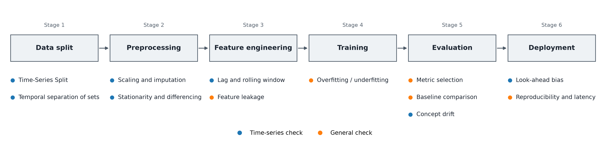

# Time-Series ML Model Validation Checklist
Rev. 2 | Created: 2026-09-20 | Updated: 2026-09-20 18:45 CDT

## 1. Purpose

- **Problem Statement**: 시계열 자료를 무작위 분할과 전체 구간 전처리로 검증하면 예측 시점 이후의 정보가 학습에 섞여, validation 성능이 운영 성능보다 높게 나온다.
- **Goal**: 시계열 model 을 배포하기 전에 점검할 항목을 일반 ML 항목과 시계열 특화 항목으로 나누고, 각 항목이 modeling pipeline 의 어느 단계에서 무엇을 확인하는지 정한다.
- **Non-Goal**: model 계열별 적합 알고리즘과 hyperparameter 조정은 다루지 않는다. 점검에서 어긋난 항목을 고치는 재학습 절차도 다루지 않는다.

## 2. Summary

점검의 두 층은 general ML check 와 time-series specific check 이다. 이 두 층에서 점검이 나뉘어, general ML check 는 시간의 순서와 무관하게 모든 model 이 받고, time-series specific check 는 순서 (order), 추세 (trend), 계절성 (seasonality) 이 있는 자료에만 더 붙는다.

Time-series specific check 의 세 축은 모두 한 가지를 막는다. 예측 시점 $t$ 이후의 정보가 학습과 전처리에 닿는 것이다.

- **분할**: 무작위 shuffle K-Fold 를 쓰지 않고, 과거로 학습하고 미래를 예측하는 Time-Series Split 을 쓴다.
- **전처리**: Scaler 와 imputation 은 train 구간의 통계량만으로 fit 한다.
- **자료 특성**: 정상성 (stationarity), concept drift, look-ahead bias 를 확인한다.

## 3. Taxonomy and its Hierarchy

점검 항목은 두 층으로 갈리고, 위 층은 다시 세 축으로 갈린다. 아래 층은 자료의 종류를 가리지 않으므로 어느 model 에서나 같은 항목이고, 위 층은 자료에 시간 순서가 있다는 조건에서만 성립한다. [Fig 1](#fig-1) 이 그 두 층과 세 축이다.

```text
Time-Series ML Model Validation
|
+-- General ML Check .............. order-independent, applies to every model
|     +-- Overfitting / Underfitting .. train and validation loss convergence
|     +-- Metric Selection ............ class imbalance, outlier sensitivity
|     +-- Feature Leakage ............. target or unknown value inside a feature
|     +-- Baseline Comparison ......... naive forecast, linear model
|     +-- Reproducibility & Latency ... fixed random seed, inference time budget
|
+-- Time-Series Specific Check .... order-dependent, adds trend and seasonality
      |
      +-- Validation Strategy ......... how the rows are split along time
      |     +-- Time-Series Split: walk-forward, expanding window
      |     +-- Temporal separation of train, validation, and test
      |
      +-- Preprocessing Leakage ....... what each transform is fitted on
      |     +-- Scaling and imputation fitted on the train segment only
      |     +-- Lag and rolling-window features shifted by one step
      |
      +-- Data Properties ............. what the series itself does over time
            +-- Stationarity and differencing
            +-- Concept drift and covariate shift
            +-- Look-ahead bias from data availability time
```

<a id="fig-1"></a>
Fig 1. Two levels of the validation checklist and the three axes of the time-series level

### 3.1 Placement

각 항목은 modeling pipeline 의 한 단계에서 점검한다. Table 1 이 항목과 그 단계이며, 단계의 순서는 자료 분할에서 배포까지의 순서다.

Table 1. Placement of each check in the modeling pipeline

| Check                         | Level       | Stage               |
| :---------------------------: | :---------: | :-----------------: |
| Time-Series Split             | Time-series | Data split          |
| Temporal separation of sets   | Time-series | Data split          |
| Scaling and imputation        | Time-series | Preprocessing       |
| Stationarity and differencing | Time-series | Preprocessing       |
| Lag and rolling window        | Time-series | Feature engineering |
| Feature leakage               | General     | Feature engineering |
| Overfitting / underfitting    | General     | Training            |
| Metric selection              | General     | Evaluation          |
| Baseline comparison           | General     | Evaluation          |
| Concept drift                 | Time-series | Evaluation          |
| Look-ahead bias               | Time-series | Deployment          |
| Reproducibility and latency   | General     | Deployment          |

분할 단계의 두 항목이 표의 맨 위에 있다. 분할이 어긋난 채로 얻은 점수는 뒤 단계의 점검을 모두 통과해도 운영에서 재현되지 않는다.

Fig 2 는 표의 단계를 순서대로 놓고 각 단계의 항목을 그 아래에 붙인 것이다.



<a id="fig-2"></a>
Fig 2. Placement of the twelve checks on the six pipeline stages

마커의 색이 Level 을 가른다. 파란색 일곱 항목이 time-series level 이고, 주황색 다섯 항목이 general level 이다.

## 4. General ML Check

시계열 여부와 상관없이 모든 machine learning model 에서 공통으로 점검하는 항목이다.

- **Overfitting / Underfitting**
  - Train loss 와 validation loss 의 수렴 양상.
  - Parameter 수 대비 자료 수. 부족하면 overfitting.
- **Metric Selection**
  - 분류 문제: Target class 가 불균형할 때 accuracy 대신 F1-score, PR-AUC.
  - 회귀 문제: outlier 영향도에 따라 RMSE, MAE, MAPE, Huber loss 중 선택.
- **Feature Leakage**
  - 예측 시점에 알 수 없는 미래 정보가 들어간 feature.
  - Target 값 자체가 들어간 feature.
- **Baseline Comparison**
  - 단순 예측 대비 성능 향상. 지난달 값을 그대로 쓰는 예측, 단순 이동평균.
  - 선형 model 대비 성능 향상.
- **Reproducibility & Latency**
  - Random seed 고정 여부.
  - 실제 batch 및 실시간 추론의 처리 속도 (latency) 만족 여부.

## 5. Time-Series Specific Check

시간의 순서와 계절성, 추세가 있는 자료에서 더 점검하는 항목이다.

### 5.1 Validation Strategy

분할은 시간을 따라야 한다. 무작위 shuffle K-Fold 는 미래 자료로 학습하고 과거 자료를 예측하게 하므로 쓰지 않는다.

- **No Random K-Fold**
  - 과거 자료로 학습하고 미래 자료를 예측하는 Time-Series Split. Walk-forward validation, expanding window.
- **Temporal Separation of Sets**
  - Train $\rightarrow$ validation $\rightarrow$ test 의 시간 순서.
  - 세 구간 사이의 시간 간격 (gap) 과 look-ahead 혼입 여부.

### 5.2 Preprocessing and Feature Engineering Leakage

전처리와 feature 생성은 학습 구간 안에서만 계산한다. 전체 구간의 통계량과 미래 시점의 값이 이 두 곳으로 들어온다.

- **Scaling & Imputation**
  - Scaler (MinMax, Standard) 의 fit 구간. 전체 자료가 아닌 train 구간의 평균, 표준편차.
  - 결측치 채우기 (imputation) 의 fit 구간. Train 구간에서 얻은 값을 validation 과 test 에 적용.
- **Lag Feature & Rolling Window**
  - $t$ 시점 예측에 $t+1$, $t+2$ 등 미래 시점 feature 참조 여부.
  - Rolling window 계산의 `shift(1)`. 현재 시점 이전의 자료만 사용.

### 5.3 Data Properties

자료 자체가 시간에 따라 무엇을 하는지 확인한다. 평균과 분산의 이동, 분포의 구조적 변화, 자료가 실제로 쓸 수 있게 되는 시각이 여기에 속한다. 세 항목의 용어 정의는 [Appendix A](#appendix-a-terminology) 에 있다.

- **Stationarity & Differencing**
  - 추세 (trend) 와 계절성 (seasonality) 으로 인한 평균과 분산의 시간 변화.
  - 필요 시 차분 (differencing) 또는 log 변환 적용 여부.
- **Concept Drift & Covariate Shift**
  - 과거 수집 기간과 예측 대상 기간 사이의 구조적 변화. 시장 상황, 규제, 외생 변수.
  - 예시: 코로나19 이전과 이후의 자료 분포 변화.
- **Look-ahead Bias**
  - Feature 자료가 수집되고 저장되는 시점 (data availability time) 과 model 이 호출되는 시점의 차이.
  - 운영 (production) 환경에서 그 차이의 반영 여부.

---

## Appendix A. Terminology

- **concept drift**: 입력과 target 의 관계가 시간에 따라 바뀌는 현상.
- **covariate shift**: Target 과의 관계는 그대로인 채 입력 분포만 바뀌는 현상.
- **data availability time**: 어떤 값이 실제로 조회 가능해지는 시각. 그 값이 가리키는 시점보다 늦다.
- **expanding window**: 학습 구간의 시작을 고정하고 끝만 뒤로 미는 분할. Fold 가 진행될수록 학습 자료가 늘어난다.
- **look-ahead bias**: 예측 시점에 아직 조회할 수 없는 값을 feature 로 써서 성능이 높게 나오는 편향.
- **PR-AUC**: Precision-recall curve 아래 면적. 양성 class 가 드문 자료에서 accuracy 대신 쓴다.
- **stationarity**: 평균과 분산이 시간에 따라 변하지 않는 성질.
- **walk-forward validation**: 학습 구간과 예측 구간을 시간 축을 따라 한 칸씩 밀며 반복하는 검증.
